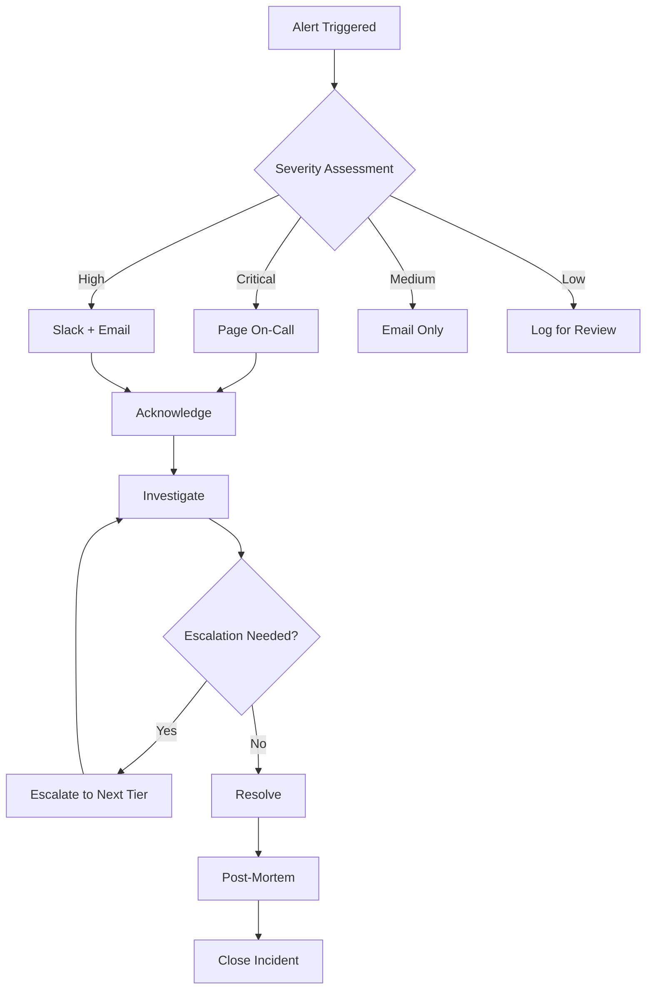
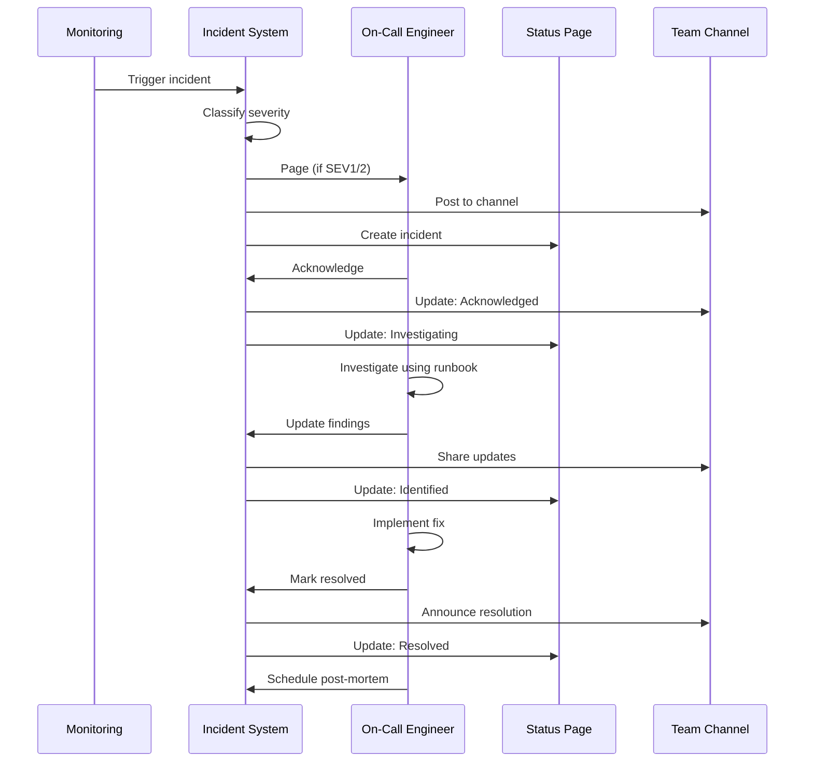

# How to Configure Incident Response

Author: [nawazdhandala](https://www.github.com/nawazdhandala)

Tags: Incident Response, DevOps, SRE, Monitoring, Alerting, On-Call, Incident Management

Description: A practical guide to configuring incident response workflows, including severity levels, escalation policies, runbooks, and communication templates.

---

When something breaks in production, every second counts. A well-configured incident response system can mean the difference between a 5-minute fix and a 5-hour outage. This guide walks through setting up a robust incident response workflow that your team can actually use.

## Understanding Incident Response Flow

Before diving into configuration, let's visualize how incidents should flow through your system:



## Define Severity Levels

The foundation of incident response is a clear severity classification. Here is a practical severity matrix:

```yaml
# severity-definitions.yaml
# This configuration defines how your team categorizes incidents

severities:
  critical:
    code: SEV1
    description: "Complete service outage affecting all users"
    examples:
      - "Database cluster down"
      - "Payment processing failed"
      - "Authentication service unavailable"
    response_time: "5 minutes"
    notification: "PagerDuty + Slack + Email"
    escalation_timer: "15 minutes"

  high:
    code: SEV2
    description: "Major feature unavailable or significant degradation"
    examples:
      - "Search functionality broken"
      - "API response times > 10s"
      - "50% of users affected by bug"
    response_time: "15 minutes"
    notification: "Slack + Email"
    escalation_timer: "30 minutes"

  medium:
    code: SEV3
    description: "Minor feature issues or limited user impact"
    examples:
      - "Dashboard loading slowly"
      - "Export feature timing out"
      - "Non-critical integration failing"
    response_time: "4 hours"
    notification: "Email"
    escalation_timer: "8 hours"

  low:
    code: SEV4
    description: "Cosmetic issues or minor inconveniences"
    examples:
      - "Typo in error message"
      - "UI alignment issue"
      - "Non-blocking warning in logs"
    response_time: "1 business day"
    notification: "Ticketing system"
    escalation_timer: "None"
```

## Configure Escalation Policies

Escalation policies ensure incidents don't fall through the cracks. Here is how to set them up:

```yaml
# escalation-policy.yaml
# Defines who gets notified and when

policies:
  - name: "production-critical"
    description: "For SEV1 and SEV2 incidents"

    steps:
      # First responder - primary on-call
      - level: 1
        targets:
          - type: "schedule"
            id: "primary-oncall"
        timeout_minutes: 15

      # Second level - backup on-call
      - level: 2
        targets:
          - type: "schedule"
            id: "secondary-oncall"
          - type: "user"
            id: "team-lead"
        timeout_minutes: 15

      # Third level - management
      - level: 3
        targets:
          - type: "user"
            id: "engineering-manager"
          - type: "user"
            id: "director-of-engineering"
        timeout_minutes: 30

      # Final escalation - executives
      - level: 4
        targets:
          - type: "user"
            id: "vp-engineering"
          - type: "user"
            id: "cto"
        timeout_minutes: 0  # No further escalation

  - name: "standard"
    description: "For SEV3 and SEV4 incidents"

    steps:
      - level: 1
        targets:
          - type: "schedule"
            id: "primary-oncall"
        timeout_minutes: 240  # 4 hours

      - level: 2
        targets:
          - type: "user"
            id: "team-lead"
        timeout_minutes: 480  # 8 hours
```

## Set Up Notification Channels

Different incidents need different notification channels. Here is a configuration example:

```javascript
// notification-config.js
// Configure how alerts reach your team

const notificationConfig = {
  channels: {
    // High urgency - wake people up
    pagerduty: {
      enabled: true,
      serviceKey: process.env.PAGERDUTY_KEY,
      severities: ['critical', 'high'],
      dedupKey: (incident) => `${incident.service}-${incident.alertId}`
    },

    // Medium urgency - team communication
    slack: {
      enabled: true,
      webhookUrl: process.env.SLACK_WEBHOOK,
      channels: {
        critical: '#incidents-critical',
        high: '#incidents-high',
        medium: '#incidents',
        low: '#incidents-low'
      },
      // Message template for Slack
      template: (incident) => ({
        blocks: [
          {
            type: 'header',
            text: {
              type: 'plain_text',
              text: `[${incident.severity.toUpperCase()}] ${incident.title}`
            }
          },
          {
            type: 'section',
            fields: [
              { type: 'mrkdwn', text: `*Service:*\n${incident.service}` },
              { type: 'mrkdwn', text: `*Status:*\n${incident.status}` },
              { type: 'mrkdwn', text: `*Started:*\n${incident.startTime}` },
              { type: 'mrkdwn', text: `*On-Call:*\n<@${incident.oncall}>` }
            ]
          },
          {
            type: 'actions',
            elements: [
              {
                type: 'button',
                text: { type: 'plain_text', text: 'Acknowledge' },
                action_id: 'ack_incident',
                value: incident.id
              },
              {
                type: 'button',
                text: { type: 'plain_text', text: 'View Runbook' },
                url: incident.runbookUrl
              }
            ]
          }
        ]
      })
    },

    // Low urgency - async notification
    email: {
      enabled: true,
      fromAddress: 'incidents@company.com',
      templates: {
        new: 'incident-new',
        update: 'incident-update',
        resolved: 'incident-resolved'
      }
    }
  },

  // Route incidents to appropriate channels
  routing: {
    critical: ['pagerduty', 'slack', 'email'],
    high: ['pagerduty', 'slack', 'email'],
    medium: ['slack', 'email'],
    low: ['email']
  }
};

module.exports = notificationConfig;
```

## Create Runbooks

Runbooks provide step-by-step guides for common incidents. Store them where your team can access them quickly:

```markdown
# Database Connection Pool Exhaustion

## Symptoms
- Application logs showing "connection pool exhausted"
- 503 errors on API endpoints
- Slow or failing database queries

## Quick Actions

### 1. Verify the Issue
```bash
# Check current connections on PostgreSQL
psql -c "SELECT count(*) FROM pg_stat_activity WHERE state = 'active';"

# Check connection pool metrics
curl -s localhost:9090/metrics | grep 'db_pool'
```

### 2. Immediate Mitigation
```bash
# Kill long-running queries (over 5 minutes)
psql -c "SELECT pg_terminate_backend(pid) FROM pg_stat_activity
         WHERE state = 'active' AND query_start < now() - interval '5 minutes';"

# Restart affected service pods
kubectl rollout restart deployment/api-server -n production
```

### 3. Investigate Root Cause
- Check recent deployments for connection leak
- Review slow query logs
- Look for unusual traffic patterns

## Escalation
If connections don't stabilize after restart, escalate to database team.
```

## Implement Status Page Integration

Keep stakeholders informed with automatic status page updates:

```python
# status_page_integration.py
# Automatically update status page during incidents

import requests
from datetime import datetime

class StatusPageUpdater:
    def __init__(self, api_key, page_id):
        self.api_key = api_key
        self.page_id = page_id
        self.base_url = "https://api.statuspage.io/v1"

    def create_incident(self, incident_data):
        """Create a new incident on the status page"""

        # Map internal severity to status page impact
        impact_map = {
            'critical': 'critical',
            'high': 'major',
            'medium': 'minor',
            'low': 'none'
        }

        payload = {
            'incident': {
                'name': incident_data['title'],
                'status': 'investigating',
                'impact_override': impact_map.get(incident_data['severity'], 'minor'),
                'body': f"We are investigating an issue affecting {incident_data['service']}. "
                        f"Our team is working to resolve this as quickly as possible.",
                'component_ids': incident_data.get('component_ids', []),
                'deliver_notifications': True
            }
        }

        response = requests.post(
            f"{self.base_url}/pages/{self.page_id}/incidents",
            headers={'Authorization': f'OAuth {self.api_key}'},
            json=payload
        )

        return response.json()

    def update_incident(self, incident_id, status, message):
        """Update an existing incident"""

        # Valid statuses: investigating, identified, monitoring, resolved
        payload = {
            'incident': {
                'status': status,
                'body': message
            }
        }

        response = requests.patch(
            f"{self.base_url}/pages/{self.page_id}/incidents/{incident_id}",
            headers={'Authorization': f'OAuth {self.api_key}'},
            json=payload
        )

        return response.json()


# Example usage during incident lifecycle
updater = StatusPageUpdater(api_key="your-key", page_id="your-page")

# When incident is created
status_incident = updater.create_incident({
    'title': 'API Performance Degradation',
    'severity': 'high',
    'service': 'REST API',
    'component_ids': ['api-component-id']
})

# When root cause is identified
updater.update_incident(
    status_incident['id'],
    'identified',
    'We have identified the root cause as a database performance issue. '
    'Our team is implementing a fix.'
)

# When fix is deployed and being monitored
updater.update_incident(
    status_incident['id'],
    'monitoring',
    'A fix has been deployed. We are monitoring the system to ensure stability.'
)

# When incident is fully resolved
updater.update_incident(
    status_incident['id'],
    'resolved',
    'The issue has been resolved. All systems are operating normally.'
)
```

## Incident Response Workflow

Here is the complete workflow your team should follow:



## Best Practices

1. **Test your alerts regularly** - Run fire drills to ensure notifications work
2. **Keep runbooks updated** - Review after every incident
3. **Set clear ownership** - Every service needs an owner
4. **Automate where possible** - Reduce manual steps in the response process
5. **Review escalation paths quarterly** - People change roles, update accordingly
6. **Practice incident response** - Game days help teams stay sharp
7. **Document everything** - Every incident teaches something valuable

## Common Pitfalls to Avoid

- Setting all alerts to critical severity
- Not having backup on-call coverage
- Runbooks that are outdated or too vague
- Missing escalation for acknowledged but unresolved incidents
- No communication templates for stakeholders

---

A well-configured incident response system reduces mean time to resolution and keeps your team calm under pressure. Start with the basics, iterate based on real incidents, and your process will improve with every outage you handle.
