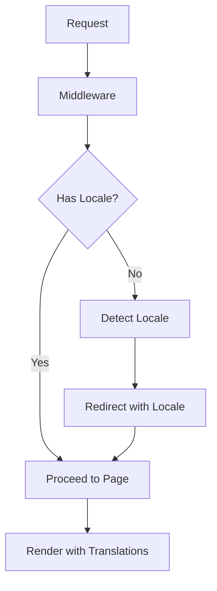
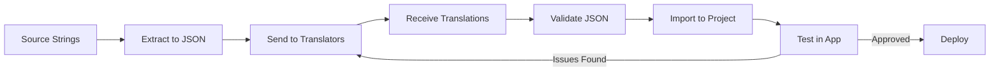

# How to Configure Internationalization in Next.js

Author: [nawazdhandala](https://www.github.com/nawazdhandala)

Tags: Next.js, Internationalization, i18n, Localization, React, Web Development, Multi-language

Description: A complete guide to implementing internationalization (i18n) in Next.js applications with routing, translations, and best practices.

---

Internationalization (i18n) enables your Next.js application to support multiple languages and locales. This guide covers both the Pages Router and App Router approaches, along with best practices for managing translations effectively.

## Understanding i18n Architecture in Next.js

Next.js provides different approaches for internationalization depending on your router choice:

```mermaid
flowchart TD
    A[Next.js i18n] --> B{Router Type}
    B -->|Pages Router| C[Built-in i18n Config]
    B -->|App Router| D[Manual Implementation]

    C --> E[Automatic Locale Detection]
    C --> F[Locale-based Routing]
    C --> G[Domain Routing]

    D --> H[Middleware-based Routing]
    D --> I[Dynamic Route Segments]
    D --> J[Third-party Libraries]

    E --> K[/en/about, /fr/about]
    F --> K
    H --> K
    I --> K
```

## Pages Router: Built-in i18n Configuration

### Basic Setup

```javascript
// next.config.js
/** @type {import('next').NextConfig} */
const nextConfig = {
  i18n: {
    // List of all supported locales
    locales: ['en', 'fr', 'de', 'es', 'ja'],

    // Default locale used when visiting a non-locale prefixed path
    defaultLocale: 'en',

    // Disable automatic locale detection
    localeDetection: false,  // Set to true to enable
  },
};

module.exports = nextConfig;
```

### Sub-path Routing Strategy

```javascript
// next.config.js
const nextConfig = {
  i18n: {
    locales: ['en', 'fr', 'de'],
    defaultLocale: 'en',
    // This creates URLs like:
    // /about (English - default)
    // /fr/about (French)
    // /de/about (German)
  },
};

module.exports = nextConfig;
```

### Domain Routing Strategy

```javascript
// next.config.js
const nextConfig = {
  i18n: {
    locales: ['en', 'fr', 'de'],
    defaultLocale: 'en',

    // Map domains to locales
    domains: [
      {
        domain: 'example.com',
        defaultLocale: 'en',
      },
      {
        domain: 'example.fr',
        defaultLocale: 'fr',
      },
      {
        domain: 'example.de',
        defaultLocale: 'de',
        // Optional: Use different HTTP protocol
        http: true,  // Use http instead of https
      },
    ],
  },
};

module.exports = nextConfig;
```

## Setting Up Translation Files

Create a structured translation system:

```
project/
  locales/
    en/
      common.json
      home.json
      about.json
    fr/
      common.json
      home.json
      about.json
    de/
      common.json
      home.json
      about.json
  lib/
    i18n.js
```

```json
// locales/en/common.json
{
  "nav": {
    "home": "Home",
    "about": "About",
    "contact": "Contact",
    "products": "Products"
  },
  "footer": {
    "copyright": "All rights reserved",
    "privacy": "Privacy Policy",
    "terms": "Terms of Service"
  },
  "buttons": {
    "submit": "Submit",
    "cancel": "Cancel",
    "save": "Save",
    "delete": "Delete"
  }
}
```

```json
// locales/fr/common.json
{
  "nav": {
    "home": "Accueil",
    "about": "A propos",
    "contact": "Contact",
    "products": "Produits"
  },
  "footer": {
    "copyright": "Tous droits reserves",
    "privacy": "Politique de confidentialite",
    "terms": "Conditions d'utilisation"
  },
  "buttons": {
    "submit": "Soumettre",
    "cancel": "Annuler",
    "save": "Enregistrer",
    "delete": "Supprimer"
  }
}
```

## Creating a Translation Hook

```javascript
// lib/i18n.js
import { useRouter } from 'next/router';
import { useCallback, useMemo } from 'react';

// Import all translations
import enCommon from '../locales/en/common.json';
import enHome from '../locales/en/home.json';
import frCommon from '../locales/fr/common.json';
import frHome from '../locales/fr/home.json';
import deCommon from '../locales/de/common.json';
import deHome from '../locales/de/home.json';

const translations = {
  en: { common: enCommon, home: enHome },
  fr: { common: frCommon, home: frHome },
  de: { common: deCommon, home: deHome },
};

export function useTranslation(namespace = 'common') {
  const { locale, locales, defaultLocale } = useRouter();

  // Get translations for current locale and namespace
  const t = useCallback(
    (key, params = {}) => {
      // Get the translation object for current locale
      const localeTranslations = translations[locale] || translations[defaultLocale];
      const namespaceTranslations = localeTranslations[namespace] || {};

      // Navigate nested keys (e.g., 'nav.home')
      const keys = key.split('.');
      let value = namespaceTranslations;

      for (const k of keys) {
        value = value?.[k];
        if (value === undefined) break;
      }

      // Return key if translation not found
      if (value === undefined) {
        console.warn(`Translation missing: ${namespace}.${key} for locale ${locale}`);
        return key;
      }

      // Replace parameters in translation string
      // e.g., t('greeting', { name: 'John' }) with "Hello, {{name}}!"
      if (typeof value === 'string' && Object.keys(params).length > 0) {
        return value.replace(/\{\{(\w+)\}\}/g, (_, paramKey) => {
          return params[paramKey] !== undefined ? params[paramKey] : `{{${paramKey}}}`;
        });
      }

      return value;
    },
    [locale, defaultLocale, namespace]
  );

  return {
    t,
    locale,
    locales,
    defaultLocale,
  };
}
```

## Using Translations in Components

```jsx
// components/Header.jsx
import Link from 'next/link';
import { useRouter } from 'next/router';
import { useTranslation } from '../lib/i18n';

export default function Header() {
  const { t, locale, locales } = useTranslation('common');
  const router = useRouter();

  // Handle locale change
  const changeLocale = (newLocale) => {
    router.push(router.pathname, router.asPath, { locale: newLocale });
  };

  return (
    <header>
      <nav>
        <Link href="/">{t('nav.home')}</Link>
        <Link href="/about">{t('nav.about')}</Link>
        <Link href="/contact">{t('nav.contact')}</Link>
        <Link href="/products">{t('nav.products')}</Link>
      </nav>

      {/* Language Selector */}
      <div className="locale-selector">
        <select
          value={locale}
          onChange={(e) => changeLocale(e.target.value)}
          aria-label="Select language"
        >
          {locales.map((loc) => (
            <option key={loc} value={loc}>
              {loc.toUpperCase()}
            </option>
          ))}
        </select>
      </div>
    </header>
  );
}
```

## App Router: Manual i18n Implementation

For the App Router, you need to implement i18n manually using middleware and dynamic segments:



### Directory Structure for App Router

```
app/
  [locale]/
    layout.js
    page.js
    about/
      page.js
    products/
      page.js
  middleware.js
  i18n/
    config.js
    dictionaries.js
```

### Middleware Configuration

```javascript
// middleware.js
import { NextResponse } from 'next/server';

const locales = ['en', 'fr', 'de', 'es'];
const defaultLocale = 'en';

// Get the preferred locale from request headers
function getLocale(request) {
  // Check Accept-Language header
  const acceptLanguage = request.headers.get('Accept-Language');

  if (acceptLanguage) {
    // Parse Accept-Language header
    const preferredLocales = acceptLanguage
      .split(',')
      .map((lang) => {
        const [locale, priority = 'q=1'] = lang.trim().split(';');
        return {
          locale: locale.split('-')[0],  // Get base language code
          priority: parseFloat(priority.replace('q=', '')),
        };
      })
      .sort((a, b) => b.priority - a.priority);

    // Find first supported locale
    for (const { locale } of preferredLocales) {
      if (locales.includes(locale)) {
        return locale;
      }
    }
  }

  return defaultLocale;
}

export function middleware(request) {
  const { pathname } = request.nextUrl;

  // Check if pathname already has a locale
  const pathnameHasLocale = locales.some(
    (locale) => pathname.startsWith(`/${locale}/`) || pathname === `/${locale}`
  );

  if (pathnameHasLocale) return;

  // Redirect to pathname with locale
  const locale = getLocale(request);
  request.nextUrl.pathname = `/${locale}${pathname}`;

  return NextResponse.redirect(request.nextUrl);
}

export const config = {
  // Match all paths except static files and API routes
  matcher: [
    '/((?!api|_next/static|_next/image|favicon.ico|.*\\.).*)',
  ],
};
```

### i18n Configuration

```javascript
// i18n/config.js
export const i18n = {
  defaultLocale: 'en',
  locales: ['en', 'fr', 'de', 'es'],
};

export const localeNames = {
  en: 'English',
  fr: 'Francais',
  de: 'Deutsch',
  es: 'Espanol',
};
```

### Dictionary Loader

```javascript
// i18n/dictionaries.js
const dictionaries = {
  en: () => import('./dictionaries/en.json').then((module) => module.default),
  fr: () => import('./dictionaries/fr.json').then((module) => module.default),
  de: () => import('./dictionaries/de.json').then((module) => module.default),
  es: () => import('./dictionaries/es.json').then((module) => module.default),
};

export const getDictionary = async (locale) => {
  // Fallback to default locale if requested locale is not available
  const dictionaryLoader = dictionaries[locale] || dictionaries.en;
  return dictionaryLoader();
};
```

### Root Layout with Locale

```jsx
// app/[locale]/layout.js
import { i18n } from '../../i18n/config';
import { getDictionary } from '../../i18n/dictionaries';
import Header from '../../components/Header';

// Generate static params for all locales
export async function generateStaticParams() {
  return i18n.locales.map((locale) => ({ locale }));
}

// Generate metadata with localized content
export async function generateMetadata({ params }) {
  const { locale } = await params;
  const dict = await getDictionary(locale);

  return {
    title: dict.metadata.title,
    description: dict.metadata.description,
  };
}

export default async function RootLayout({ children, params }) {
  const { locale } = await params;
  const dict = await getDictionary(locale);

  return (
    <html lang={locale}>
      <body>
        <Header locale={locale} dict={dict} />
        <main>{children}</main>
      </body>
    </html>
  );
}
```

### Page Component with Translations

```jsx
// app/[locale]/page.js
import { getDictionary } from '../../i18n/dictionaries';
import Link from 'next/link';

export default async function HomePage({ params }) {
  const { locale } = await params;
  const dict = await getDictionary(locale);

  return (
    <div>
      <h1>{dict.home.title}</h1>
      <p>{dict.home.description}</p>

      <section>
        <h2>{dict.home.features.title}</h2>
        <ul>
          {dict.home.features.items.map((item, index) => (
            <li key={index}>{item}</li>
          ))}
        </ul>
      </section>

      <Link href={`/${locale}/about`}>
        {dict.common.nav.about}
      </Link>
    </div>
  );
}
```

## Using next-intl Library

For a more robust solution, consider using the next-intl library:

```bash
# Install next-intl
npm install next-intl
```

```javascript
// i18n.js (configuration)
import { getRequestConfig } from 'next-intl/server';

export default getRequestConfig(async ({ locale }) => ({
  messages: (await import(`./messages/${locale}.json`)).default,
}));
```

```jsx
// app/[locale]/layout.js
import { NextIntlClientProvider } from 'next-intl';
import { getMessages } from 'next-intl/server';

export default async function LocaleLayout({ children, params }) {
  const { locale } = await params;
  const messages = await getMessages();

  return (
    <html lang={locale}>
      <body>
        <NextIntlClientProvider messages={messages}>
          {children}
        </NextIntlClientProvider>
      </body>
    </html>
  );
}
```

```jsx
// components/ClientComponent.jsx
'use client';

import { useTranslations } from 'next-intl';

export default function ClientComponent() {
  const t = useTranslations('common');

  return (
    <div>
      <h1>{t('title')}</h1>
      <p>{t('description')}</p>

      {/* With interpolation */}
      <p>{t('greeting', { name: 'John' })}</p>

      {/* With pluralization */}
      <p>{t('items', { count: 5 })}</p>
    </div>
  );
}
```

## Locale-aware Links and Navigation

```jsx
// components/LocaleLink.jsx
'use client';

import Link from 'next/link';
import { usePathname } from 'next/navigation';

export default function LocaleLink({ href, locale, children, ...props }) {
  const pathname = usePathname();

  // Extract current locale from pathname
  const currentLocale = pathname.split('/')[1];

  // Use provided locale or current locale
  const targetLocale = locale || currentLocale;

  // Construct localized href
  const localizedHref = `/${targetLocale}${href}`;

  return (
    <Link href={localizedHref} {...props}>
      {children}
    </Link>
  );
}
```

```jsx
// components/LanguageSwitcher.jsx
'use client';

import { usePathname, useRouter } from 'next/navigation';
import { i18n, localeNames } from '../i18n/config';

export default function LanguageSwitcher() {
  const pathname = usePathname();
  const router = useRouter();

  // Get current locale from pathname
  const currentLocale = pathname.split('/')[1];

  // Get pathname without locale prefix
  const pathnameWithoutLocale = pathname.replace(`/${currentLocale}`, '') || '/';

  const handleLocaleChange = (newLocale) => {
    const newPath = `/${newLocale}${pathnameWithoutLocale}`;
    router.push(newPath);
  };

  return (
    <div className="language-switcher">
      {i18n.locales.map((locale) => (
        <button
          key={locale}
          onClick={() => handleLocaleChange(locale)}
          className={locale === currentLocale ? 'active' : ''}
          aria-current={locale === currentLocale ? 'true' : undefined}
        >
          {localeNames[locale]}
        </button>
      ))}
    </div>
  );
}
```

## Date and Number Formatting

```javascript
// lib/formatters.js
export function formatDate(date, locale, options = {}) {
  const defaultOptions = {
    year: 'numeric',
    month: 'long',
    day: 'numeric',
  };

  return new Intl.DateTimeFormat(locale, { ...defaultOptions, ...options }).format(
    new Date(date)
  );
}

export function formatNumber(number, locale, options = {}) {
  return new Intl.NumberFormat(locale, options).format(number);
}

export function formatCurrency(amount, locale, currency = 'USD') {
  return new Intl.NumberFormat(locale, {
    style: 'currency',
    currency,
  }).format(amount);
}

export function formatRelativeTime(date, locale) {
  const now = new Date();
  const diff = date - now;
  const diffInSeconds = Math.round(diff / 1000);
  const diffInMinutes = Math.round(diff / (1000 * 60));
  const diffInHours = Math.round(diff / (1000 * 60 * 60));
  const diffInDays = Math.round(diff / (1000 * 60 * 60 * 24));

  const rtf = new Intl.RelativeTimeFormat(locale, { numeric: 'auto' });

  if (Math.abs(diffInSeconds) < 60) {
    return rtf.format(diffInSeconds, 'second');
  } else if (Math.abs(diffInMinutes) < 60) {
    return rtf.format(diffInMinutes, 'minute');
  } else if (Math.abs(diffInHours) < 24) {
    return rtf.format(diffInHours, 'hour');
  } else {
    return rtf.format(diffInDays, 'day');
  }
}
```

```jsx
// components/LocalizedContent.jsx
import { formatDate, formatCurrency, formatNumber } from '../lib/formatters';

export default function LocalizedContent({ locale }) {
  const today = new Date();
  const price = 1299.99;
  const quantity = 1234567;

  return (
    <div>
      {/* Date formatting */}
      <p>Today: {formatDate(today, locale)}</p>
      <p>Short date: {formatDate(today, locale, { dateStyle: 'short' })}</p>

      {/* Currency formatting */}
      <p>Price (USD): {formatCurrency(price, locale, 'USD')}</p>
      <p>Price (EUR): {formatCurrency(price, locale, 'EUR')}</p>

      {/* Number formatting */}
      <p>Quantity: {formatNumber(quantity, locale)}</p>
      <p>Percentage: {formatNumber(0.1234, locale, { style: 'percent' })}</p>
    </div>
  );
}
```

## SEO Considerations for i18n

```jsx
// app/[locale]/layout.js
import { i18n } from '../../i18n/config';

export async function generateMetadata({ params }) {
  const { locale } = await params;
  const dict = await getDictionary(locale);

  // Generate alternate language links
  const languages = {};
  i18n.locales.forEach((loc) => {
    languages[loc] = `https://example.com/${loc}`;
  });

  return {
    title: dict.metadata.title,
    description: dict.metadata.description,
    alternates: {
      canonical: `https://example.com/${locale}`,
      languages,
    },
    openGraph: {
      title: dict.metadata.title,
      description: dict.metadata.description,
      locale: locale,
      alternateLocale: i18n.locales.filter((l) => l !== locale),
    },
  };
}
```

## Translation Management Workflow



### Validation Script

```javascript
// scripts/validate-translations.js
const fs = require('fs');
const path = require('path');

const localesDir = path.join(__dirname, '../locales');
const baseLocale = 'en';

function getAllKeys(obj, prefix = '') {
  let keys = [];
  for (const key in obj) {
    const fullKey = prefix ? `${prefix}.${key}` : key;
    if (typeof obj[key] === 'object' && obj[key] !== null) {
      keys = keys.concat(getAllKeys(obj[key], fullKey));
    } else {
      keys.push(fullKey);
    }
  }
  return keys;
}

function validateTranslations() {
  const baseDir = path.join(localesDir, baseLocale);
  const baseFiles = fs.readdirSync(baseDir);
  const errors = [];

  // Get all locale directories
  const locales = fs.readdirSync(localesDir).filter((f) => {
    return fs.statSync(path.join(localesDir, f)).isDirectory();
  });

  // Check each locale against base
  locales.forEach((locale) => {
    if (locale === baseLocale) return;

    baseFiles.forEach((file) => {
      const basePath = path.join(localesDir, baseLocale, file);
      const localePath = path.join(localesDir, locale, file);

      // Check if file exists
      if (!fs.existsSync(localePath)) {
        errors.push(`Missing file: ${locale}/${file}`);
        return;
      }

      const baseContent = JSON.parse(fs.readFileSync(basePath, 'utf8'));
      const localeContent = JSON.parse(fs.readFileSync(localePath, 'utf8'));

      const baseKeys = getAllKeys(baseContent);
      const localeKeys = getAllKeys(localeContent);

      // Find missing keys
      baseKeys.forEach((key) => {
        if (!localeKeys.includes(key)) {
          errors.push(`Missing key in ${locale}/${file}: ${key}`);
        }
      });

      // Find extra keys
      localeKeys.forEach((key) => {
        if (!baseKeys.includes(key)) {
          errors.push(`Extra key in ${locale}/${file}: ${key}`);
        }
      });
    });
  });

  if (errors.length > 0) {
    console.error('Translation validation errors:');
    errors.forEach((err) => console.error(`  - ${err}`));
    process.exit(1);
  } else {
    console.log('All translations are valid!');
  }
}

validateTranslations();
```

## Summary

Configuring internationalization in Next.js involves:

1. **Choose your approach** - Built-in i18n for Pages Router or manual implementation for App Router
2. **Set up routing** - Configure locale-based URL paths or domain routing
3. **Organize translations** - Create a structured system for managing translation files
4. **Build translation hooks** - Create reusable utilities for accessing translations
5. **Handle formatting** - Use Intl APIs for dates, numbers, and currencies
6. **Optimize SEO** - Add proper hreflang tags and alternate links
7. **Validate translations** - Implement automated checks for missing keys

Following these practices will help you build a robust multilingual Next.js application that provides a great user experience for visitors from around the world.
