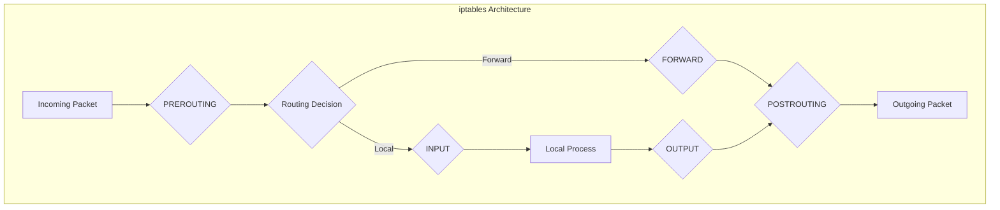
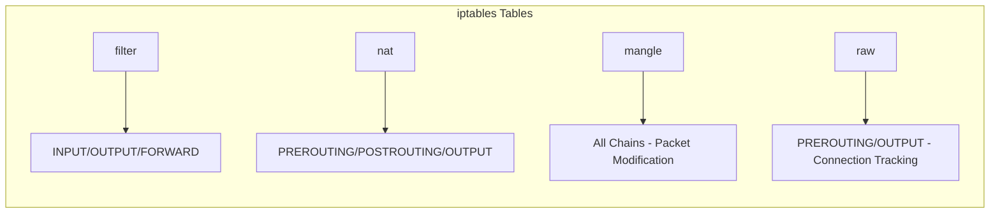
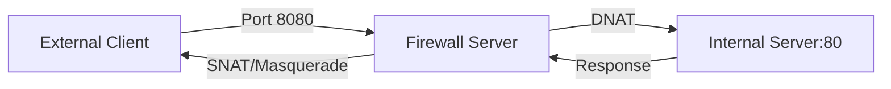
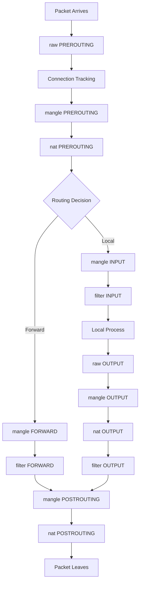

# How to Configure iptables Firewall Rules

Author: [nawazdhandala](https://github.com/nawazdhandala)

Tags: Linux, Security, Networking, Firewall, iptables, System Administration

Description: A comprehensive guide to configuring iptables firewall rules in Linux, including chains, tables, common patterns, and best practices for securing your servers.

---

iptables is the traditional Linux firewall tool that provides powerful packet filtering capabilities. While newer tools like nftables and firewalld exist, iptables remains widely used and understanding it is essential for Linux system administration. This guide covers everything from basic concepts to advanced configurations.

## Understanding iptables Architecture

iptables uses tables, chains, and rules to filter network traffic. Understanding this hierarchy is crucial for effective firewall configuration.



### Tables and Their Purpose



| Table | Purpose | Common Use |
|-------|---------|------------|
| **filter** | Default table for packet filtering | Allow/deny traffic |
| **nat** | Network Address Translation | Port forwarding, masquerading |
| **mangle** | Packet modification | QoS, TTL modification |
| **raw** | Connection tracking exemption | High-performance scenarios |

## Basic Commands

### Viewing Current Rules

```bash
# List all rules in filter table with line numbers
# -L lists rules, -n shows numeric addresses, -v shows verbose output
iptables -L -n -v --line-numbers

# List rules for specific chain
iptables -L INPUT -n -v --line-numbers

# List NAT table rules
iptables -t nat -L -n -v

# Show rules in iptables-save format (easier to read)
iptables-save
```

### Basic Rule Syntax

```bash
# General syntax
iptables [-t table] -A CHAIN -p protocol [options] -j TARGET

# Common targets:
# ACCEPT - Allow the packet
# DROP   - Silently discard the packet
# REJECT - Reject and send error response
# LOG    - Log the packet and continue processing
```

## Essential Firewall Rules

### 1. Set Default Policies

```bash
# Set default policy to DROP for INPUT and FORWARD
# This creates a "default deny" firewall
iptables -P INPUT DROP
iptables -P FORWARD DROP
iptables -P OUTPUT ACCEPT

# WARNING: Make sure you allow SSH before setting INPUT to DROP
# or you will lock yourself out!
```

### 2. Allow Established Connections

```bash
# Allow packets that are part of established connections
# This is essential for return traffic
iptables -A INPUT -m conntrack --ctstate ESTABLISHED,RELATED -j ACCEPT
iptables -A OUTPUT -m conntrack --ctstate ESTABLISHED,RELATED -j ACCEPT

# Alternative syntax (older systems)
iptables -A INPUT -m state --state ESTABLISHED,RELATED -j ACCEPT
```

### 3. Allow Loopback Traffic

```bash
# Allow all traffic on loopback interface
# Many applications require localhost communication
iptables -A INPUT -i lo -j ACCEPT
iptables -A OUTPUT -o lo -j ACCEPT
```

### 4. Allow SSH Access

```bash
# Allow SSH from anywhere (use with caution)
iptables -A INPUT -p tcp --dport 22 -j ACCEPT

# Allow SSH from specific IP only (more secure)
iptables -A INPUT -p tcp -s 192.168.1.100 --dport 22 -j ACCEPT

# Allow SSH from specific subnet
iptables -A INPUT -p tcp -s 10.0.0.0/8 --dport 22 -j ACCEPT

# Rate limit SSH connections to prevent brute force
iptables -A INPUT -p tcp --dport 22 -m conntrack --ctstate NEW -m limit --limit 3/min --limit-burst 3 -j ACCEPT
iptables -A INPUT -p tcp --dport 22 -m conntrack --ctstate NEW -j DROP
```

### 5. Allow Common Services

```bash
# Allow HTTP and HTTPS
iptables -A INPUT -p tcp --dport 80 -j ACCEPT
iptables -A INPUT -p tcp --dport 443 -j ACCEPT

# Allow DNS (both TCP and UDP)
iptables -A INPUT -p tcp --dport 53 -j ACCEPT
iptables -A INPUT -p udp --dport 53 -j ACCEPT

# Allow SMTP
iptables -A INPUT -p tcp --dport 25 -j ACCEPT

# Allow MySQL from specific host
iptables -A INPUT -p tcp -s 10.0.0.5 --dport 3306 -j ACCEPT

# Allow PostgreSQL from application servers
iptables -A INPUT -p tcp -s 10.0.0.0/24 --dport 5432 -j ACCEPT
```

### 6. Allow ICMP (Ping)

```bash
# Allow ping requests (useful for monitoring)
iptables -A INPUT -p icmp --icmp-type echo-request -j ACCEPT
iptables -A INPUT -p icmp --icmp-type echo-reply -j ACCEPT

# Allow all ICMP (needed for path MTU discovery)
iptables -A INPUT -p icmp -j ACCEPT

# Rate limit ICMP to prevent ping floods
iptables -A INPUT -p icmp --icmp-type echo-request -m limit --limit 1/second --limit-burst 4 -j ACCEPT
```

## Complete Firewall Script

```bash
#!/bin/bash
# Save as /usr/local/bin/firewall.sh
# A complete iptables firewall configuration script

# Flush existing rules
iptables -F
iptables -X
iptables -t nat -F
iptables -t nat -X
iptables -t mangle -F
iptables -t mangle -X

# Set default policies
iptables -P INPUT DROP
iptables -P FORWARD DROP
iptables -P OUTPUT ACCEPT

# Allow loopback
iptables -A INPUT -i lo -j ACCEPT

# Allow established connections
iptables -A INPUT -m conntrack --ctstate ESTABLISHED,RELATED -j ACCEPT

# Drop invalid packets
iptables -A INPUT -m conntrack --ctstate INVALID -j DROP

# Allow SSH (rate limited)
iptables -A INPUT -p tcp --dport 22 -m conntrack --ctstate NEW -m limit --limit 3/min --limit-burst 3 -j ACCEPT

# Allow HTTP/HTTPS
iptables -A INPUT -p tcp --dport 80 -j ACCEPT
iptables -A INPUT -p tcp --dport 443 -j ACCEPT

# Allow ICMP
iptables -A INPUT -p icmp --icmp-type echo-request -m limit --limit 1/second -j ACCEPT

# Log dropped packets (optional, can fill logs quickly)
iptables -A INPUT -j LOG --log-prefix "iptables-dropped: " --log-level 4

# Save rules
iptables-save > /etc/iptables/rules.v4

echo "Firewall rules applied successfully"
```

## Advanced Configurations

### Port Forwarding (NAT)

```bash
# Enable IP forwarding (required for NAT)
echo 1 > /proc/sys/net/ipv4/ip_forward

# Make it permanent
echo "net.ipv4.ip_forward = 1" >> /etc/sysctl.conf
sysctl -p

# Forward external port 8080 to internal server port 80
iptables -t nat -A PREROUTING -p tcp --dport 8080 -j DNAT --to-destination 192.168.1.10:80
iptables -A FORWARD -p tcp -d 192.168.1.10 --dport 80 -j ACCEPT

# Masquerade outgoing traffic (for NAT gateway)
iptables -t nat -A POSTROUTING -o eth0 -j MASQUERADE
```



### Protection Against Common Attacks

```bash
# Drop packets with invalid TCP flags (port scans)
iptables -A INPUT -p tcp --tcp-flags ALL NONE -j DROP
iptables -A INPUT -p tcp --tcp-flags ALL ALL -j DROP
iptables -A INPUT -p tcp --tcp-flags ALL FIN,PSH,URG -j DROP
iptables -A INPUT -p tcp --tcp-flags SYN,RST SYN,RST -j DROP

# Protection against SYN flood attacks
iptables -A INPUT -p tcp --syn -m limit --limit 1/s --limit-burst 3 -j ACCEPT
iptables -A INPUT -p tcp --syn -j DROP

# Limit new connections per IP
iptables -A INPUT -p tcp --syn -m connlimit --connlimit-above 20 -j DROP

# Drop fragmented packets
iptables -A INPUT -f -j DROP

# Block specific IP addresses (blacklist)
iptables -A INPUT -s 10.10.10.10 -j DROP

# Block entire subnet
iptables -A INPUT -s 192.168.100.0/24 -j DROP
```

### Logging Rules

```bash
# Create a logging chain
iptables -N LOGGING
iptables -A INPUT -j LOGGING
iptables -A LOGGING -m limit --limit 2/min -j LOG --log-prefix "iptables-dropped: " --log-level 4
iptables -A LOGGING -j DROP

# Log specific traffic
iptables -A INPUT -p tcp --dport 22 -j LOG --log-prefix "SSH-attempt: " --log-level 4

# View logs
dmesg | grep iptables
tail -f /var/log/kern.log | grep iptables
```

### Time-Based Rules

```bash
# Allow SSH only during business hours
iptables -A INPUT -p tcp --dport 22 -m time --timestart 09:00 --timestop 18:00 --weekdays Mon,Tue,Wed,Thu,Fri -j ACCEPT

# Block specific service on weekends
iptables -A INPUT -p tcp --dport 3306 -m time --weekdays Sat,Sun -j DROP
```

### Multi-Port Rules

```bash
# Allow multiple ports in one rule
iptables -A INPUT -p tcp -m multiport --dports 80,443,8080,8443 -j ACCEPT

# Allow port range
iptables -A INPUT -p tcp --dport 6000:6010 -j ACCEPT
```

## Saving and Restoring Rules

### Debian/Ubuntu

```bash
# Install iptables-persistent
apt-get install iptables-persistent

# Save current rules
iptables-save > /etc/iptables/rules.v4
ip6tables-save > /etc/iptables/rules.v6

# Rules are automatically restored on boot
# To manually restore:
iptables-restore < /etc/iptables/rules.v4
```

### RHEL/CentOS

```bash
# Save rules
service iptables save
# or
iptables-save > /etc/sysconfig/iptables

# Restore rules
iptables-restore < /etc/sysconfig/iptables

# Enable iptables service
systemctl enable iptables
systemctl start iptables
```

## Troubleshooting

### Debug Traffic Flow

```bash
# Add logging to trace packet flow
iptables -t raw -A PREROUTING -p tcp --dport 80 -j LOG --log-prefix "raw-pre: "
iptables -t mangle -A PREROUTING -p tcp --dport 80 -j LOG --log-prefix "mangle-pre: "
iptables -t nat -A PREROUTING -p tcp --dport 80 -j LOG --log-prefix "nat-pre: "
iptables -A INPUT -p tcp --dport 80 -j LOG --log-prefix "filter-input: "
```

### Common Issues

```bash
# Check if rules are being hit (look at packet/byte counters)
iptables -L -n -v

# Reset counters
iptables -Z

# List rules with rule numbers for deletion
iptables -L INPUT -n --line-numbers

# Delete rule by number
iptables -D INPUT 3

# Delete rule by specification
iptables -D INPUT -p tcp --dport 80 -j ACCEPT

# Insert rule at specific position
iptables -I INPUT 2 -p tcp --dport 443 -j ACCEPT
```

### Testing Without Locking Yourself Out

```bash
# Schedule rule reset in case you lock yourself out
# This removes the DROP policy after 5 minutes
echo "iptables -P INPUT ACCEPT" | at now + 5 minutes

# Apply your rules
iptables -P INPUT DROP
# ... other rules ...

# If everything works, cancel the scheduled reset
atrm $(atq | cut -f1)
```

## iptables Rule Processing Order



## Quick Reference

| Task | Command |
|------|---------|
| List rules | `iptables -L -n -v` |
| List with line numbers | `iptables -L -n --line-numbers` |
| Flush all rules | `iptables -F` |
| Delete chain | `iptables -X CHAIN` |
| Set policy | `iptables -P INPUT DROP` |
| Save rules | `iptables-save > /etc/iptables/rules.v4` |
| Restore rules | `iptables-restore < /etc/iptables/rules.v4` |
| Delete rule by number | `iptables -D INPUT 3` |
| Insert rule at position | `iptables -I INPUT 2 -p tcp --dport 443 -j ACCEPT` |

## Conclusion

iptables provides granular control over network traffic and remains a fundamental skill for Linux administrators. Start with a default deny policy, explicitly allow required traffic, and always test rules carefully to avoid locking yourself out. Regular audits of your firewall rules and logging of dropped packets help maintain security while troubleshooting connectivity issues.
