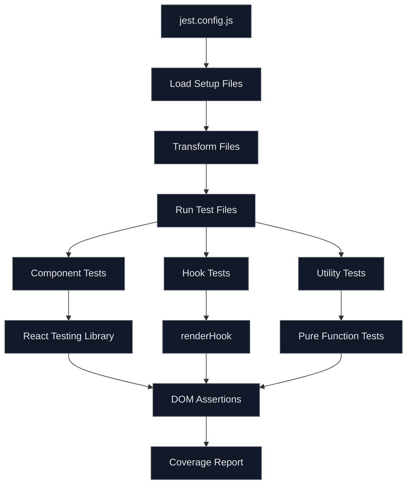

# How to Configure Jest for React Testing

Author: [nawazdhandala](https://www.github.com/nawazdhandala)

Tags: Jest, React, Testing, JavaScript, TypeScript, Unit Testing, Component Testing, Frontend

Description: A comprehensive guide to setting up Jest for React applications with TypeScript support, DOM testing, mocking patterns, and CI integration.

---

Jest is the de facto standard for testing React applications. It provides a complete testing solution with a test runner, assertion library, and mocking capabilities built in. This guide walks through configuring Jest for a production-ready React testing setup.

## Installation

Start by installing Jest and the necessary dependencies:

```bash
# For a React project with TypeScript
npm install -D jest @types/jest ts-jest

# Testing utilities for React
npm install -D @testing-library/react @testing-library/jest-dom @testing-library/user-event

# For projects using ES modules
npm install -D babel-jest @babel/preset-env @babel/preset-react @babel/preset-typescript
```

## Basic Configuration

Create a `jest.config.js` file in your project root:

```javascript
// jest.config.js
/** @type {import('jest').Config} */
const config = {
  // Use jsdom for DOM testing
  testEnvironment: 'jsdom',

  // Setup files run before each test file
  setupFilesAfterEnv: ['<rootDir>/jest.setup.js'],

  // Module path aliases (match your tsconfig paths)
  moduleNameMapper: {
    // Handle CSS imports
    '\\.(css|less|scss|sass)$': 'identity-obj-proxy',
    // Handle image imports
    '\\.(jpg|jpeg|png|gif|webp|svg)$': '<rootDir>/__mocks__/fileMock.js',
    // Handle path aliases
    '^@/(.*)$': '<rootDir>/src/$1',
    '^@components/(.*)$': '<rootDir>/src/components/$1',
    '^@hooks/(.*)$': '<rootDir>/src/hooks/$1',
    '^@utils/(.*)$': '<rootDir>/src/utils/$1',
  },

  // Transform TypeScript and JSX
  transform: {
    '^.+\\.(ts|tsx|js|jsx)$': ['babel-jest', { presets: ['next/babel'] }],
  },

  // Ignore patterns
  testPathIgnorePatterns: ['/node_modules/', '/.next/', '/dist/'],
  transformIgnorePatterns: ['/node_modules/(?!(some-esm-package)/)'],

  // Coverage configuration
  collectCoverageFrom: [
    'src/**/*.{js,jsx,ts,tsx}',
    '!src/**/*.d.ts',
    '!src/**/*.stories.{js,jsx,ts,tsx}',
    '!src/**/index.{js,ts}',
  ],
  coverageThreshold: {
    global: {
      branches: 70,
      functions: 70,
      lines: 70,
      statements: 70,
    },
  },

  // Performance
  maxWorkers: '50%',

  // Test file patterns
  testMatch: [
    '**/__tests__/**/*.[jt]s?(x)',
    '**/?(*.)+(spec|test).[jt]s?(x)',
  ],
};

module.exports = config;
```

## Setup File

Create the setup file referenced in the config:

```javascript
// jest.setup.js
import '@testing-library/jest-dom';

// Mock window.matchMedia
Object.defineProperty(window, 'matchMedia', {
  writable: true,
  value: jest.fn().mockImplementation(query => ({
    matches: false,
    media: query,
    onchange: null,
    addListener: jest.fn(),
    removeListener: jest.fn(),
    addEventListener: jest.fn(),
    removeEventListener: jest.fn(),
    dispatchEvent: jest.fn(),
  })),
});

// Mock IntersectionObserver
class MockIntersectionObserver {
  observe = jest.fn();
  disconnect = jest.fn();
  unobserve = jest.fn();
}

Object.defineProperty(window, 'IntersectionObserver', {
  writable: true,
  configurable: true,
  value: MockIntersectionObserver,
});

// Mock ResizeObserver
class MockResizeObserver {
  observe = jest.fn();
  disconnect = jest.fn();
  unobserve = jest.fn();
}

Object.defineProperty(window, 'ResizeObserver', {
  writable: true,
  configurable: true,
  value: MockResizeObserver,
});

// Suppress console errors during tests (optional)
const originalError = console.error;
beforeAll(() => {
  console.error = (...args) => {
    if (
      typeof args[0] === 'string' &&
      args[0].includes('Warning: ReactDOM.render is no longer supported')
    ) {
      return;
    }
    originalError.call(console, ...args);
  };
});

afterAll(() => {
  console.error = originalError;
});
```

## TypeScript Configuration

For TypeScript projects, configure ts-jest:

```javascript
// jest.config.js for TypeScript
/** @type {import('ts-jest').JestConfigWithTsJest} */
module.exports = {
  preset: 'ts-jest',
  testEnvironment: 'jsdom',

  setupFilesAfterEnv: ['<rootDir>/jest.setup.ts'],

  moduleNameMapper: {
    '\\.(css|less|scss|sass)$': 'identity-obj-proxy',
    '^@/(.*)$': '<rootDir>/src/$1',
  },

  transform: {
    '^.+\\.tsx?$': ['ts-jest', {
      tsconfig: 'tsconfig.test.json',
    }],
  },

  // Type checking is slow, disable for faster tests
  globals: {
    'ts-jest': {
      isolatedModules: true,
    },
  },
};
```

Create a separate tsconfig for tests:

```json
// tsconfig.test.json
{
  "extends": "./tsconfig.json",
  "compilerOptions": {
    "jsx": "react-jsx",
    "types": ["jest", "@testing-library/jest-dom"],
    "esModuleInterop": true
  },
  "include": ["src/**/*", "**/*.test.ts", "**/*.test.tsx", "jest.setup.ts"]
}
```

## Project Structure

Organize your tests consistently:

```
src/
├── components/
│   ├── Button/
│   │   ├── Button.tsx
│   │   ├── Button.test.tsx
│   │   └── Button.module.css
│   └── Form/
│       ├── Form.tsx
│       └── Form.test.tsx
├── hooks/
│   ├── useAuth.ts
│   └── useAuth.test.ts
├── utils/
│   ├── format.ts
│   └── format.test.ts
└── __mocks__/
    ├── fileMock.js
    └── styleMock.js
```

## Test Architecture

How Jest processes your tests:



## Writing Component Tests

Test components using React Testing Library:

```tsx
// src/components/Button/Button.test.tsx
import { render, screen, fireEvent } from '@testing-library/react';
import userEvent from '@testing-library/user-event';
import { Button } from './Button';

describe('Button', () => {
  it('renders with correct text', () => {
    render(<Button>Click me</Button>);

    expect(screen.getByRole('button', { name: /click me/i })).toBeInTheDocument();
  });

  it('calls onClick handler when clicked', async () => {
    const handleClick = jest.fn();
    const user = userEvent.setup();

    render(<Button onClick={handleClick}>Click me</Button>);

    await user.click(screen.getByRole('button'));

    expect(handleClick).toHaveBeenCalledTimes(1);
  });

  it('is disabled when loading', () => {
    render(<Button loading>Submit</Button>);

    expect(screen.getByRole('button')).toBeDisabled();
  });

  it('shows loading spinner when loading', () => {
    render(<Button loading>Submit</Button>);

    expect(screen.getByTestId('loading-spinner')).toBeInTheDocument();
  });

  it('applies variant styles', () => {
    render(<Button variant="primary">Primary</Button>);

    expect(screen.getByRole('button')).toHaveClass('btn-primary');
  });
});
```

## Testing Hooks

Test custom hooks with `renderHook`:

```tsx
// src/hooks/useCounter.test.ts
import { renderHook, act } from '@testing-library/react';
import { useCounter } from './useCounter';

describe('useCounter', () => {
  it('initializes with default value', () => {
    const { result } = renderHook(() => useCounter());

    expect(result.current.count).toBe(0);
  });

  it('initializes with provided value', () => {
    const { result } = renderHook(() => useCounter(10));

    expect(result.current.count).toBe(10);
  });

  it('increments count', () => {
    const { result } = renderHook(() => useCounter());

    act(() => {
      result.current.increment();
    });

    expect(result.current.count).toBe(1);
  });

  it('decrements count', () => {
    const { result } = renderHook(() => useCounter(5));

    act(() => {
      result.current.decrement();
    });

    expect(result.current.count).toBe(4);
  });

  it('resets to initial value', () => {
    const { result } = renderHook(() => useCounter(10));

    act(() => {
      result.current.increment();
      result.current.increment();
      result.current.reset();
    });

    expect(result.current.count).toBe(10);
  });
});
```

## Mocking Patterns

### Mock Modules

```typescript
// __mocks__/axios.ts
const mockAxios = {
  get: jest.fn(() => Promise.resolve({ data: {} })),
  post: jest.fn(() => Promise.resolve({ data: {} })),
  put: jest.fn(() => Promise.resolve({ data: {} })),
  delete: jest.fn(() => Promise.resolve({ data: {} })),
  create: jest.fn(function () {
    return this;
  }),
  interceptors: {
    request: { use: jest.fn(), eject: jest.fn() },
    response: { use: jest.fn(), eject: jest.fn() },
  },
};

export default mockAxios;
```

### Mock Components

```tsx
// src/components/Chart/__mocks__/Chart.tsx
export const Chart = jest.fn(({ data, title }) => (
  <div data-testid="mock-chart">
    <h3>{title}</h3>
    <span>Data points: {data.length}</span>
  </div>
));
```

### Mock API Calls

```tsx
// src/components/UserList/UserList.test.tsx
import { render, screen, waitFor } from '@testing-library/react';
import { UserList } from './UserList';
import * as api from '@/api/users';

// Mock the API module
jest.mock('@/api/users');
const mockApi = api as jest.Mocked<typeof api>;

describe('UserList', () => {
  beforeEach(() => {
    jest.clearAllMocks();
  });

  it('displays users after loading', async () => {
    mockApi.getUsers.mockResolvedValue([
      { id: 1, name: 'Alice' },
      { id: 2, name: 'Bob' },
    ]);

    render(<UserList />);

    // Initially shows loading
    expect(screen.getByText(/loading/i)).toBeInTheDocument();

    // After loading, shows users
    await waitFor(() => {
      expect(screen.getByText('Alice')).toBeInTheDocument();
      expect(screen.getByText('Bob')).toBeInTheDocument();
    });
  });

  it('displays error message on failure', async () => {
    mockApi.getUsers.mockRejectedValue(new Error('Network error'));

    render(<UserList />);

    await waitFor(() => {
      expect(screen.getByText(/error loading users/i)).toBeInTheDocument();
    });
  });
});
```

## Testing with Context

```tsx
// src/test-utils/render.tsx
import { ReactElement } from 'react';
import { render, RenderOptions } from '@testing-library/react';
import { ThemeProvider } from '@/contexts/ThemeContext';
import { AuthProvider } from '@/contexts/AuthContext';
import { QueryClient, QueryClientProvider } from '@tanstack/react-query';

const createTestQueryClient = () =>
  new QueryClient({
    defaultOptions: {
      queries: { retry: false },
      mutations: { retry: false },
    },
  });

interface CustomRenderOptions extends Omit<RenderOptions, 'wrapper'> {
  initialAuthState?: { user: any; isAuthenticated: boolean };
  theme?: 'light' | 'dark';
}

function customRender(ui: ReactElement, options: CustomRenderOptions = {}) {
  const {
    initialAuthState = { user: null, isAuthenticated: false },
    theme = 'light',
    ...renderOptions
  } = options;

  const queryClient = createTestQueryClient();

  function Wrapper({ children }: { children: React.ReactNode }) {
    return (
      <QueryClientProvider client={queryClient}>
        <AuthProvider initialState={initialAuthState}>
          <ThemeProvider initialTheme={theme}>
            {children}
          </ThemeProvider>
        </AuthProvider>
      </QueryClientProvider>
    );
  }

  return render(ui, { wrapper: Wrapper, ...renderOptions });
}

export * from '@testing-library/react';
export { customRender as render };
```

## CI Configuration

Add Jest to your CI pipeline:

```yaml
# .github/workflows/test.yml
name: Tests

on: [push, pull_request]

jobs:
  test:
    runs-on: ubuntu-latest

    steps:
      - uses: actions/checkout@v4

      - name: Setup Node.js
        uses: actions/setup-node@v4
        with:
          node-version: '20'
          cache: 'npm'

      - name: Install dependencies
        run: npm ci

      - name: Run tests
        run: npm test -- --coverage --watchAll=false

      - name: Upload coverage
        uses: codecov/codecov-action@v4
        with:
          files: ./coverage/lcov.info
          fail_ci_if_error: true
```

## Package.json Scripts

```json
{
  "scripts": {
    "test": "jest",
    "test:watch": "jest --watch",
    "test:coverage": "jest --coverage",
    "test:ci": "jest --ci --coverage --watchAll=false",
    "test:update": "jest --updateSnapshot"
  }
}
```

## Best Practices

1. **Test behavior, not implementation** - Focus on what users see and do
2. **Use accessible queries** - Prefer getByRole, getByLabelText over getByTestId
3. **Avoid testing implementation details** - Don't test state directly
4. **Keep tests independent** - Each test should set up its own data
5. **Use userEvent over fireEvent** - It simulates real user interactions better
6. **Mock at the right level** - Mock API calls, not internal functions
7. **Write meaningful assertions** - Test what matters to users
8. **Maintain test readability** - Tests are documentation

## Common Issues and Solutions

| Issue | Solution |
|-------|----------|
| "Cannot find module" | Check moduleNameMapper in config |
| CSS import errors | Use identity-obj-proxy mock |
| ESM module errors | Add to transformIgnorePatterns |
| Slow tests | Use isolatedModules, reduce maxWorkers |
| Act warnings | Wrap state updates in act() or waitFor() |

Jest with React Testing Library provides everything you need for comprehensive React testing. Start with the basic configuration and expand as your needs grow. The key is writing tests that give you confidence in your application without becoming a maintenance burden.
