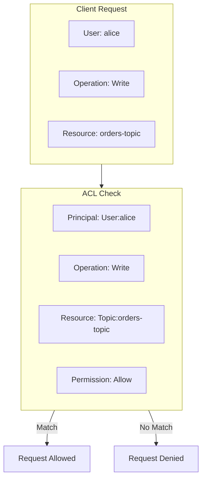
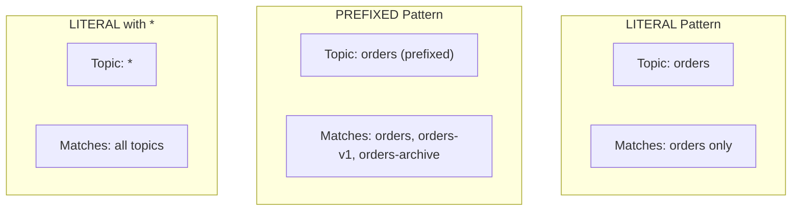
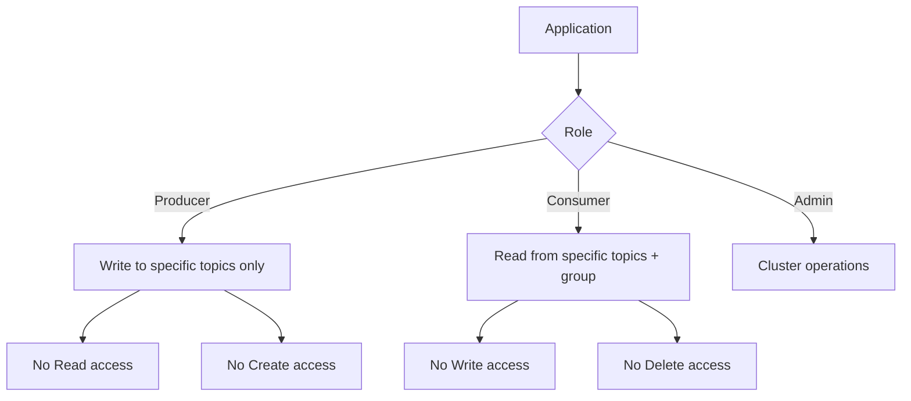
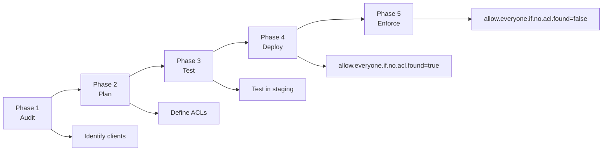

# How to Configure Kafka ACLs for Security

Author: [nawazdhandala](https://www.github.com/nawazdhandala)

Tags: Apache Kafka, Security, ACLs, Authorization, Authentication, SASL, DevOps

Description: A practical guide to implementing Kafka Access Control Lists (ACLs) for securing your cluster, including authentication setup, permission management, and best practices.

---

Kafka Access Control Lists (ACLs) provide fine-grained authorization for your cluster. Without them, any client can read from or write to any topic. This guide shows you how to lock down your Kafka cluster properly.

## Understanding Kafka ACLs

ACLs control who can do what on which resources.



### ACL Components

| Component | Description | Examples |
|-----------|-------------|----------|
| Principal | Who is accessing | `User:alice`, `User:CN=app.example.com` |
| Resource | What is being accessed | `Topic:orders`, `Group:consumer-group` |
| Operation | What action | `Read`, `Write`, `Create`, `Delete` |
| Permission | Allow or Deny | `Allow`, `Deny` |
| Host | From where | `*`, `192.168.1.100` |

## Prerequisites: Enable Authentication

ACLs require authentication. Configure SASL/SCRAM or SSL authentication first.

### Option 1: SASL/SCRAM Authentication

**Step 1: Create SCRAM credentials**

```bash
# Create admin user
kafka-configs.sh --bootstrap-server localhost:9092 \
  --alter --add-config 'SCRAM-SHA-256=[password=admin-secret]' \
  --entity-type users --entity-name admin

# Create application users
kafka-configs.sh --bootstrap-server localhost:9092 \
  --alter --add-config 'SCRAM-SHA-256=[password=producer-secret]' \
  --entity-type users --entity-name order-producer

kafka-configs.sh --bootstrap-server localhost:9092 \
  --alter --add-config 'SCRAM-SHA-256=[password=consumer-secret]' \
  --entity-type users --entity-name order-consumer
```

**Step 2: Configure broker for SASL**

```properties
# server.properties

# Enable SASL authentication
listeners=SASL_PLAINTEXT://0.0.0.0:9092
advertised.listeners=SASL_PLAINTEXT://kafka-broker:9092
security.inter.broker.protocol=SASL_PLAINTEXT
sasl.mechanism.inter.broker.protocol=SCRAM-SHA-256
sasl.enabled.mechanisms=SCRAM-SHA-256

# Enable ACL authorizer
authorizer.class.name=kafka.security.authorizer.AclAuthorizer

# Set super users who bypass ACL checks
super.users=User:admin

# Allow broker operations
allow.everyone.if.no.acl.found=false
```

**Step 3: Create JAAS configuration**

```
# kafka_server_jaas.conf
KafkaServer {
    org.apache.kafka.common.security.scram.ScramLoginModule required
    username="admin"
    password="admin-secret";
};
```

### Option 2: SSL/mTLS Authentication

```properties
# server.properties

listeners=SSL://0.0.0.0:9093
advertised.listeners=SSL://kafka-broker:9093
security.inter.broker.protocol=SSL

# SSL configuration
ssl.keystore.location=/etc/kafka/ssl/kafka.keystore.jks
ssl.keystore.password=keystore-password
ssl.key.password=key-password
ssl.truststore.location=/etc/kafka/ssl/kafka.truststore.jks
ssl.truststore.password=truststore-password
ssl.client.auth=required

# Enable ACL authorizer
authorizer.class.name=kafka.security.authorizer.AclAuthorizer

# Super users use certificate DN
super.users=User:CN=admin,O=MyOrg,C=US
```

## Managing ACLs

### Basic ACL Commands

```bash
# Add an ACL
kafka-acls.sh --bootstrap-server localhost:9092 \
  --command-config admin.properties \
  --add \
  --allow-principal User:order-producer \
  --operation Write \
  --topic orders

# List ACLs
kafka-acls.sh --bootstrap-server localhost:9092 \
  --command-config admin.properties \
  --list

# Remove an ACL
kafka-acls.sh --bootstrap-server localhost:9092 \
  --command-config admin.properties \
  --remove \
  --allow-principal User:order-producer \
  --operation Write \
  --topic orders
```

### Admin Client Configuration

```properties
# admin.properties
bootstrap.servers=localhost:9092
security.protocol=SASL_PLAINTEXT
sasl.mechanism=SCRAM-SHA-256
sasl.jaas.config=org.apache.kafka.common.security.scram.ScramLoginModule required \
    username="admin" \
    password="admin-secret";
```

## Common ACL Patterns

### Pattern 1: Producer ACLs

Grant a producer permission to write to specific topics.

```bash
# Allow producer to write to orders topic
kafka-acls.sh --bootstrap-server localhost:9092 \
  --command-config admin.properties \
  --add \
  --allow-principal User:order-producer \
  --operation Write \
  --operation Describe \
  --topic orders

# Allow producer to write to multiple topics with prefix
kafka-acls.sh --bootstrap-server localhost:9092 \
  --command-config admin.properties \
  --add \
  --allow-principal User:order-producer \
  --operation Write \
  --operation Describe \
  --topic orders \
  --resource-pattern-type prefixed
```

### Pattern 2: Consumer ACLs

Grant a consumer permission to read topics and manage consumer groups.

```bash
# Allow consumer to read from orders topic
kafka-acls.sh --bootstrap-server localhost:9092 \
  --command-config admin.properties \
  --add \
  --allow-principal User:order-consumer \
  --operation Read \
  --operation Describe \
  --topic orders

# Allow consumer to use a specific consumer group
kafka-acls.sh --bootstrap-server localhost:9092 \
  --command-config admin.properties \
  --add \
  --allow-principal User:order-consumer \
  --operation Read \
  --group order-processing-group
```

### Pattern 3: Kafka Streams ACLs

Kafka Streams applications need broader permissions.

```bash
APP_ID="order-processing"
USER="streams-app"

# Read from input topics
kafka-acls.sh --bootstrap-server localhost:9092 \
  --command-config admin.properties \
  --add \
  --allow-principal User:$USER \
  --operation Read \
  --topic orders-input

# Write to output topics
kafka-acls.sh --bootstrap-server localhost:9092 \
  --command-config admin.properties \
  --add \
  --allow-principal User:$USER \
  --operation Write \
  --topic orders-output

# Internal topics (prefixed with application.id)
kafka-acls.sh --bootstrap-server localhost:9092 \
  --command-config admin.properties \
  --add \
  --allow-principal User:$USER \
  --operation All \
  --topic $APP_ID \
  --resource-pattern-type prefixed

# Consumer group for the application
kafka-acls.sh --bootstrap-server localhost:9092 \
  --command-config admin.properties \
  --add \
  --allow-principal User:$USER \
  --operation All \
  --group $APP_ID
```

### Pattern 4: Admin ACLs

Grant administrative permissions for topic management.

```bash
# Allow topic creation and deletion
kafka-acls.sh --bootstrap-server localhost:9092 \
  --command-config admin.properties \
  --add \
  --allow-principal User:topic-admin \
  --operation Create \
  --operation Delete \
  --operation Alter \
  --operation Describe \
  --cluster

# Allow topic configuration changes
kafka-acls.sh --bootstrap-server localhost:9092 \
  --command-config admin.properties \
  --add \
  --allow-principal User:topic-admin \
  --operation AlterConfigs \
  --operation DescribeConfigs \
  --topic '*'
```

## Resource Pattern Types



### Using Prefixed Patterns

```bash
# Match all topics starting with "team-a-"
kafka-acls.sh --bootstrap-server localhost:9092 \
  --command-config admin.properties \
  --add \
  --allow-principal User:team-a-producer \
  --operation Write \
  --topic team-a- \
  --resource-pattern-type prefixed
```

### Using Wildcard

```bash
# Allow read access to ALL topics (use carefully)
kafka-acls.sh --bootstrap-server localhost:9092 \
  --command-config admin.properties \
  --add \
  --allow-principal User:monitoring \
  --operation Describe \
  --topic '*'
```

## ACL Management with Java

### Programmatic ACL Creation

```java
import org.apache.kafka.clients.admin.*;
import org.apache.kafka.common.acl.*;
import org.apache.kafka.common.resource.*;
import java.util.*;

public class AclManager {
    private final AdminClient admin;

    public AclManager(String bootstrapServers, String username, String password) {
        Properties props = new Properties();
        props.put("bootstrap.servers", bootstrapServers);
        props.put("security.protocol", "SASL_PLAINTEXT");
        props.put("sasl.mechanism", "SCRAM-SHA-256");
        props.put("sasl.jaas.config",
            "org.apache.kafka.common.security.scram.ScramLoginModule required " +
            "username=\"" + username + "\" password=\"" + password + "\";");

        this.admin = AdminClient.create(props);
    }

    public void grantProducerAccess(String user, String topic) throws Exception {
        // Define the resource (topic)
        ResourcePattern resource = new ResourcePattern(
            ResourceType.TOPIC,
            topic,
            PatternType.LITERAL
        );

        // Define the access control entry
        AccessControlEntry writeEntry = new AccessControlEntry(
            "User:" + user,
            "*",  // from any host
            AclOperation.WRITE,
            AclPermissionType.ALLOW
        );

        AccessControlEntry describeEntry = new AccessControlEntry(
            "User:" + user,
            "*",
            AclOperation.DESCRIBE,
            AclPermissionType.ALLOW
        );

        // Create ACL bindings
        Collection<AclBinding> acls = Arrays.asList(
            new AclBinding(resource, writeEntry),
            new AclBinding(resource, describeEntry)
        );

        // Apply ACLs
        admin.createAcls(acls).all().get();
        System.out.println("Granted producer access to " + user + " for topic " + topic);
    }

    public void grantConsumerAccess(String user, String topic, String groupId)
            throws Exception {
        Collection<AclBinding> acls = new ArrayList<>();

        // Topic read access
        ResourcePattern topicResource = new ResourcePattern(
            ResourceType.TOPIC, topic, PatternType.LITERAL);

        acls.add(new AclBinding(topicResource, new AccessControlEntry(
            "User:" + user, "*", AclOperation.READ, AclPermissionType.ALLOW)));
        acls.add(new AclBinding(topicResource, new AccessControlEntry(
            "User:" + user, "*", AclOperation.DESCRIBE, AclPermissionType.ALLOW)));

        // Consumer group access
        ResourcePattern groupResource = new ResourcePattern(
            ResourceType.GROUP, groupId, PatternType.LITERAL);

        acls.add(new AclBinding(groupResource, new AccessControlEntry(
            "User:" + user, "*", AclOperation.READ, AclPermissionType.ALLOW)));

        admin.createAcls(acls).all().get();
        System.out.println("Granted consumer access to " + user);
    }

    public void listAcls() throws Exception {
        Collection<AclBinding> acls = admin.describeAcls(AclBindingFilter.ANY)
            .values().get();

        for (AclBinding acl : acls) {
            System.out.printf("Resource: %s, Principal: %s, Operation: %s, Permission: %s%n",
                acl.pattern(),
                acl.entry().principal(),
                acl.entry().operation(),
                acl.entry().permissionType());
        }
    }

    public void revokeAccess(String user, String topic) throws Exception {
        ResourcePatternFilter resourceFilter = new ResourcePatternFilter(
            ResourceType.TOPIC, topic, PatternType.LITERAL);

        AccessControlEntryFilter entryFilter = new AccessControlEntryFilter(
            "User:" + user, null, AclOperation.ANY, AclPermissionType.ANY);

        AclBindingFilter filter = new AclBindingFilter(resourceFilter, entryFilter);

        admin.deleteAcls(Collections.singleton(filter)).all().get();
        System.out.println("Revoked access for " + user + " on topic " + topic);
    }

    public void close() {
        admin.close();
    }
}
```

## Security Best Practices

### 1. Principle of Least Privilege



### 2. Use Service Accounts

Create dedicated users for each application, not shared credentials.

```bash
# Create service account for order service
kafka-configs.sh --bootstrap-server localhost:9092 \
  --alter --add-config 'SCRAM-SHA-256=[password=secure-random-password]' \
  --entity-type users --entity-name svc-order-service

# Grant specific permissions
kafka-acls.sh --bootstrap-server localhost:9092 \
  --command-config admin.properties \
  --add \
  --allow-principal User:svc-order-service \
  --operation Write \
  --topic orders \
  --operation Read \
  --topic inventory
```

### 3. Restrict by Host

Limit access to specific IP addresses or networks.

```bash
# Allow producer only from specific hosts
kafka-acls.sh --bootstrap-server localhost:9092 \
  --command-config admin.properties \
  --add \
  --allow-principal User:order-producer \
  --allow-host 192.168.1.100 \
  --allow-host 192.168.1.101 \
  --operation Write \
  --topic orders
```

### 4. Deny Rules for Sensitive Topics

Explicitly deny access to sensitive topics.

```bash
# Deny all access to PII topic by default
kafka-acls.sh --bootstrap-server localhost:9092 \
  --command-config admin.properties \
  --add \
  --deny-principal User:'*' \
  --operation All \
  --topic customer-pii

# Then explicitly allow specific users
kafka-acls.sh --bootstrap-server localhost:9092 \
  --command-config admin.properties \
  --add \
  --allow-principal User:pii-processor \
  --operation Read \
  --topic customer-pii
```

### 5. Audit ACL Changes

```bash
#!/bin/bash
# acl-audit.sh - Run regularly to track ACL changes

DATE=$(date +%Y%m%d)
ACL_FILE="/var/log/kafka/acls-$DATE.txt"

# Dump current ACLs
kafka-acls.sh --bootstrap-server localhost:9092 \
  --command-config admin.properties \
  --list > $ACL_FILE

# Compare with previous day
PREV_DATE=$(date -d "yesterday" +%Y%m%d)
PREV_FILE="/var/log/kafka/acls-$PREV_DATE.txt"

if [ -f "$PREV_FILE" ]; then
  diff $PREV_FILE $ACL_FILE > /var/log/kafka/acl-changes-$DATE.txt
  if [ -s /var/log/kafka/acl-changes-$DATE.txt ]; then
    echo "ACL changes detected on $DATE"
    cat /var/log/kafka/acl-changes-$DATE.txt
  fi
fi
```

## Troubleshooting ACLs

### Check Effective Permissions

```bash
# List all ACLs for a specific principal
kafka-acls.sh --bootstrap-server localhost:9092 \
  --command-config admin.properties \
  --list --principal User:order-producer

# List all ACLs for a specific topic
kafka-acls.sh --bootstrap-server localhost:9092 \
  --command-config admin.properties \
  --list --topic orders
```

### Debug Authorization Failures

**Enable authorizer logging:**
```properties
# log4j.properties
log4j.logger.kafka.authorizer.logger=DEBUG
```

**Common errors and fixes:**

| Error | Cause | Fix |
|-------|-------|-----|
| `TopicAuthorizationException` | Missing topic Read/Write ACL | Add topic ACL |
| `GroupAuthorizationException` | Missing consumer group ACL | Add group ACL |
| `ClusterAuthorizationException` | Missing cluster-level ACL | Add cluster ACL |

### Verify Client Configuration

```java
// Ensure client is authenticating correctly
Properties props = new Properties();
props.put("bootstrap.servers", "kafka:9092");
props.put("security.protocol", "SASL_PLAINTEXT");
props.put("sasl.mechanism", "SCRAM-SHA-256");
props.put("sasl.jaas.config",
    "org.apache.kafka.common.security.scram.ScramLoginModule required " +
    "username=\"order-producer\" " +
    "password=\"producer-secret\";");

// Test connection
try (AdminClient admin = AdminClient.create(props)) {
    admin.listTopics().names().get();
    System.out.println("Authentication successful");
} catch (Exception e) {
    System.err.println("Authentication failed: " + e.getMessage());
}
```

## Migration Strategy

When adding ACLs to an existing cluster:



1. **Audit**: List all clients and their access patterns
2. **Plan**: Define ACLs for each client
3. **Test**: Apply ACLs in staging environment
4. **Deploy**: Add ACLs with `allow.everyone.if.no.acl.found=true`
5. **Enforce**: Set `allow.everyone.if.no.acl.found=false`

---

Kafka ACLs are your last line of defense against unauthorized access. Start with authentication, apply the principle of least privilege, and audit regularly. A well-configured ACL setup prevents data breaches and ensures compliance with security requirements.
