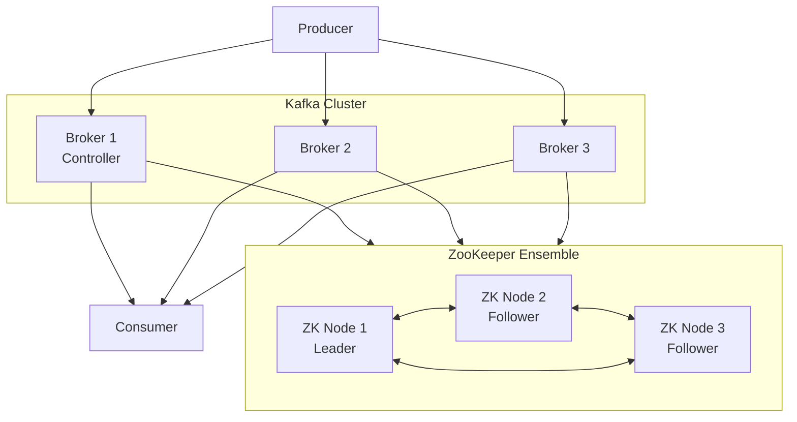
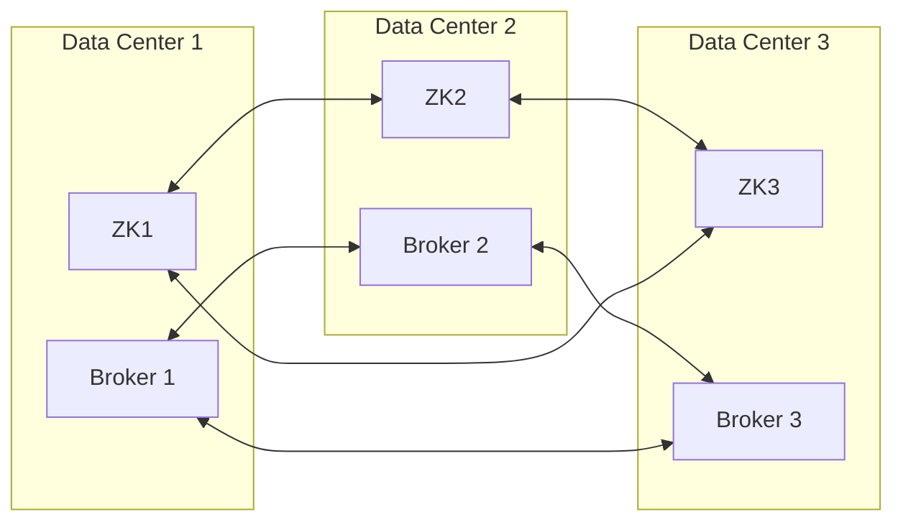
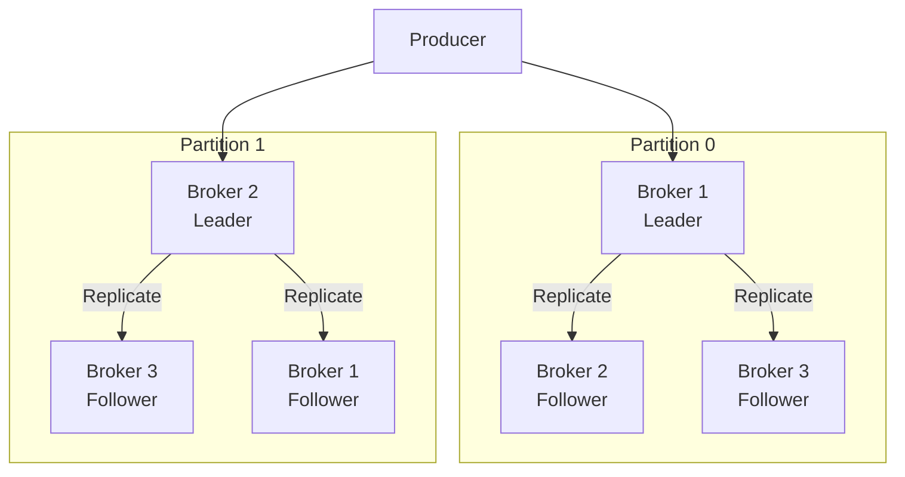

# How to Configure Kafka Cluster with ZooKeeper

Author: [nawazdhandala](https://www.github.com/nawazdhandala)

Tags: Kafka, ZooKeeper, Cluster, Configuration, Distributed Systems, High Availability, DevOps, Backend

Description: Learn how to configure a production-ready Apache Kafka cluster with ZooKeeper for coordination, including multi-broker setup, replication, and high availability.

---

> ZooKeeper is the coordination service that manages Kafka cluster metadata, broker registration, and leader election. While Kafka is moving toward KRaft mode, many production clusters still rely on ZooKeeper. This guide covers setting up a robust Kafka cluster with ZooKeeper.

Proper cluster configuration ensures high availability and fault tolerance for your message streaming platform.

---

## Architecture Overview



---

## ZooKeeper Ensemble Setup

### Node 1 Configuration

Create the ZooKeeper configuration file for the first node. Each node needs a unique server ID:

```properties
# /etc/zookeeper/zoo.cfg - ZooKeeper Node 1

# Basic settings
# tickTime is the basic time unit in milliseconds used by ZooKeeper
tickTime=2000

# initLimit is the number of ticks that follower nodes can take to connect to leader
initLimit=10

# syncLimit is the number of ticks that follower nodes can be out of sync with leader
syncLimit=5

# Directory where ZooKeeper stores its data
dataDir=/var/lib/zookeeper

# Client connection port
clientPort=2181

# Maximum number of client connections
maxClientCnxns=60

# Enable admin server for monitoring
admin.enableServer=true
admin.serverPort=8080

# ZooKeeper ensemble configuration
# Format: server.id=hostname:peer_port:election_port
# peer_port (2888) is used for follower connections to the leader
# election_port (3888) is used for leader election
server.1=zk1.example.com:2888:3888
server.2=zk2.example.com:2888:3888
server.3=zk3.example.com:2888:3888

# Autopurge settings to clean old snapshots
autopurge.snapRetainCount=3
autopurge.purgeInterval=24
```

### Create Node ID File

Each ZooKeeper node needs a unique ID that matches the server.X configuration:

```bash
# On ZooKeeper Node 1 - create the myid file with server ID
# This file must contain a single line with the server number
echo "1" > /var/lib/zookeeper/myid

# On ZooKeeper Node 2
echo "2" > /var/lib/zookeeper/myid

# On ZooKeeper Node 3
echo "3" > /var/lib/zookeeper/myid
```

### Start ZooKeeper

```bash
# Start ZooKeeper on each node
# The service will read configuration from zoo.cfg
zkServer.sh start

# Check status to verify leader election completed
zkServer.sh status
```

---

## Kafka Broker Configuration

### Broker 1 Configuration

```properties
# /etc/kafka/server.properties - Kafka Broker 1

# Unique broker ID - must be different for each broker in the cluster
broker.id=1

# Network listeners for client and inter-broker communication
# PLAINTEXT is unencrypted - use SSL/SASL in production
listeners=PLAINTEXT://0.0.0.0:9092

# Advertised listeners are what clients use to connect
# Must be resolvable by clients
advertised.listeners=PLAINTEXT://kafka1.example.com:9092

# Number of threads handling network requests
num.network.threads=8

# Number of threads doing disk I/O
num.io.threads=16

# Socket buffer sizes for high throughput
socket.send.buffer.bytes=102400
socket.receive.buffer.bytes=102400
socket.request.max.bytes=104857600

# Log directory where Kafka stores partition data
# Use multiple directories on different disks for better performance
log.dirs=/var/lib/kafka/data

# Default number of partitions for auto-created topics
# Higher values enable more parallelism but increase overhead
num.partitions=6

# Number of threads per data directory for recovery at startup
num.recovery.threads.per.data.dir=2

# Replication factor for internal topics
# Should be min(3, number of brokers) for fault tolerance
offsets.topic.replication.factor=3
transaction.state.log.replication.factor=3
transaction.state.log.min.isr=2

# Log retention settings
# Messages older than 7 days (168 hours) will be deleted
log.retention.hours=168

# Maximum size of a log segment file before rotation
log.segment.bytes=1073741824

# Check interval for log retention
log.retention.check.interval.ms=300000

# ZooKeeper connection string - all nodes in the ensemble
# /kafka is the chroot path to isolate Kafka data in ZooKeeper
zookeeper.connect=zk1.example.com:2181,zk2.example.com:2181,zk3.example.com:2181/kafka

# ZooKeeper session timeout
zookeeper.connection.timeout.ms=18000
zookeeper.session.timeout.ms=18000

# Enable automatic topic creation (disable in production for better control)
auto.create.topics.enable=false

# Delete topic enabled
delete.topic.enable=true

# Minimum number of replicas that must acknowledge a write
min.insync.replicas=2

# Default replication factor for auto-created topics
default.replication.factor=3

# Unclean leader election - set to false to prevent data loss
# When true, out-of-sync replicas can become leader (may lose data)
unclean.leader.election.enable=false
```

### Broker 2 Configuration

```properties
# /etc/kafka/server.properties - Kafka Broker 2
# Same as Broker 1 except for broker-specific settings

broker.id=2
listeners=PLAINTEXT://0.0.0.0:9092
advertised.listeners=PLAINTEXT://kafka2.example.com:9092
log.dirs=/var/lib/kafka/data

# All other settings remain the same as Broker 1
# ZooKeeper connection is identical across all brokers
zookeeper.connect=zk1.example.com:2181,zk2.example.com:2181,zk3.example.com:2181/kafka
```

### Broker 3 Configuration

```properties
# /etc/kafka/server.properties - Kafka Broker 3

broker.id=3
listeners=PLAINTEXT://0.0.0.0:9092
advertised.listeners=PLAINTEXT://kafka3.example.com:9092
log.dirs=/var/lib/kafka/data

zookeeper.connect=zk1.example.com:2181,zk2.example.com:2181,zk3.example.com:2181/kafka
```

---

## Network Configuration

### Firewall Rules

```bash
# ZooKeeper ports
# Client port - for Kafka brokers and admin tools
sudo ufw allow 2181/tcp comment "ZooKeeper client"

# Peer communication port - for ZooKeeper cluster communication
sudo ufw allow 2888/tcp comment "ZooKeeper peer"

# Leader election port - for ZooKeeper leader election
sudo ufw allow 3888/tcp comment "ZooKeeper election"

# Kafka ports
# Client port - for producers and consumers
sudo ufw allow 9092/tcp comment "Kafka client"

# Enable firewall
sudo ufw enable
```

---

## Cluster Topology



---

## Docker Compose Setup

For development or testing, use Docker Compose to run the full cluster:

```yaml
# docker-compose.yml - Complete Kafka cluster with ZooKeeper
version: '3.8'

services:
  # ZooKeeper Ensemble - 3 nodes for quorum
  zk1:
    image: confluentinc/cp-zookeeper:7.5.0
    hostname: zk1
    container_name: zk1
    ports:
      - "2181:2181"
    environment:
      # Unique server ID for this ZooKeeper node
      ZOOKEEPER_SERVER_ID: 1
      ZOOKEEPER_CLIENT_PORT: 2181
      ZOOKEEPER_TICK_TIME: 2000
      ZOOKEEPER_INIT_LIMIT: 5
      ZOOKEEPER_SYNC_LIMIT: 2
      # Ensemble configuration - all ZK nodes
      ZOOKEEPER_SERVERS: zk1:2888:3888;zk2:2888:3888;zk3:2888:3888
    volumes:
      - zk1-data:/var/lib/zookeeper/data
      - zk1-logs:/var/lib/zookeeper/log
    networks:
      - kafka-network

  zk2:
    image: confluentinc/cp-zookeeper:7.5.0
    hostname: zk2
    container_name: zk2
    ports:
      - "2182:2181"
    environment:
      ZOOKEEPER_SERVER_ID: 2
      ZOOKEEPER_CLIENT_PORT: 2181
      ZOOKEEPER_TICK_TIME: 2000
      ZOOKEEPER_INIT_LIMIT: 5
      ZOOKEEPER_SYNC_LIMIT: 2
      ZOOKEEPER_SERVERS: zk1:2888:3888;zk2:2888:3888;zk3:2888:3888
    volumes:
      - zk2-data:/var/lib/zookeeper/data
      - zk2-logs:/var/lib/zookeeper/log
    networks:
      - kafka-network

  zk3:
    image: confluentinc/cp-zookeeper:7.5.0
    hostname: zk3
    container_name: zk3
    ports:
      - "2183:2181"
    environment:
      ZOOKEEPER_SERVER_ID: 3
      ZOOKEEPER_CLIENT_PORT: 2181
      ZOOKEEPER_TICK_TIME: 2000
      ZOOKEEPER_INIT_LIMIT: 5
      ZOOKEEPER_SYNC_LIMIT: 2
      ZOOKEEPER_SERVERS: zk1:2888:3888;zk2:2888:3888;zk3:2888:3888
    volumes:
      - zk3-data:/var/lib/zookeeper/data
      - zk3-logs:/var/lib/zookeeper/log
    networks:
      - kafka-network

  # Kafka Brokers - 3 nodes for high availability
  kafka1:
    image: confluentinc/cp-kafka:7.5.0
    hostname: kafka1
    container_name: kafka1
    depends_on:
      - zk1
      - zk2
      - zk3
    ports:
      - "9092:9092"
    environment:
      KAFKA_BROKER_ID: 1
      # ZooKeeper connection with all ensemble nodes
      KAFKA_ZOOKEEPER_CONNECT: zk1:2181,zk2:2181,zk3:2181/kafka
      # Internal listener for inter-broker communication
      # External listener for client connections
      KAFKA_LISTENER_SECURITY_PROTOCOL_MAP: INTERNAL:PLAINTEXT,EXTERNAL:PLAINTEXT
      KAFKA_INTER_BROKER_LISTENER_NAME: INTERNAL
      KAFKA_LISTENERS: INTERNAL://0.0.0.0:29092,EXTERNAL://0.0.0.0:9092
      KAFKA_ADVERTISED_LISTENERS: INTERNAL://kafka1:29092,EXTERNAL://localhost:9092
      # Replication settings for fault tolerance
      KAFKA_OFFSETS_TOPIC_REPLICATION_FACTOR: 3
      KAFKA_TRANSACTION_STATE_LOG_REPLICATION_FACTOR: 3
      KAFKA_TRANSACTION_STATE_LOG_MIN_ISR: 2
      KAFKA_MIN_INSYNC_REPLICAS: 2
      KAFKA_DEFAULT_REPLICATION_FACTOR: 3
      KAFKA_NUM_PARTITIONS: 6
    volumes:
      - kafka1-data:/var/lib/kafka/data
    networks:
      - kafka-network

  kafka2:
    image: confluentinc/cp-kafka:7.5.0
    hostname: kafka2
    container_name: kafka2
    depends_on:
      - zk1
      - zk2
      - zk3
    ports:
      - "9093:9092"
    environment:
      KAFKA_BROKER_ID: 2
      KAFKA_ZOOKEEPER_CONNECT: zk1:2181,zk2:2181,zk3:2181/kafka
      KAFKA_LISTENER_SECURITY_PROTOCOL_MAP: INTERNAL:PLAINTEXT,EXTERNAL:PLAINTEXT
      KAFKA_INTER_BROKER_LISTENER_NAME: INTERNAL
      KAFKA_LISTENERS: INTERNAL://0.0.0.0:29092,EXTERNAL://0.0.0.0:9092
      KAFKA_ADVERTISED_LISTENERS: INTERNAL://kafka2:29092,EXTERNAL://localhost:9093
      KAFKA_OFFSETS_TOPIC_REPLICATION_FACTOR: 3
      KAFKA_TRANSACTION_STATE_LOG_REPLICATION_FACTOR: 3
      KAFKA_TRANSACTION_STATE_LOG_MIN_ISR: 2
      KAFKA_MIN_INSYNC_REPLICAS: 2
      KAFKA_DEFAULT_REPLICATION_FACTOR: 3
      KAFKA_NUM_PARTITIONS: 6
    volumes:
      - kafka2-data:/var/lib/kafka/data
    networks:
      - kafka-network

  kafka3:
    image: confluentinc/cp-kafka:7.5.0
    hostname: kafka3
    container_name: kafka3
    depends_on:
      - zk1
      - zk2
      - zk3
    ports:
      - "9094:9092"
    environment:
      KAFKA_BROKER_ID: 3
      KAFKA_ZOOKEEPER_CONNECT: zk1:2181,zk2:2181,zk3:2181/kafka
      KAFKA_LISTENER_SECURITY_PROTOCOL_MAP: INTERNAL:PLAINTEXT,EXTERNAL:PLAINTEXT
      KAFKA_INTER_BROKER_LISTENER_NAME: INTERNAL
      KAFKA_LISTENERS: INTERNAL://0.0.0.0:29092,EXTERNAL://0.0.0.0:9092
      KAFKA_ADVERTISED_LISTENERS: INTERNAL://kafka3:29092,EXTERNAL://localhost:9094
      KAFKA_OFFSETS_TOPIC_REPLICATION_FACTOR: 3
      KAFKA_TRANSACTION_STATE_LOG_REPLICATION_FACTOR: 3
      KAFKA_TRANSACTION_STATE_LOG_MIN_ISR: 2
      KAFKA_MIN_INSYNC_REPLICAS: 2
      KAFKA_DEFAULT_REPLICATION_FACTOR: 3
      KAFKA_NUM_PARTITIONS: 6
    volumes:
      - kafka3-data:/var/lib/kafka/data
    networks:
      - kafka-network

volumes:
  zk1-data:
  zk1-logs:
  zk2-data:
  zk2-logs:
  zk3-data:
  zk3-logs:
  kafka1-data:
  kafka2-data:
  kafka3-data:

networks:
  kafka-network:
    driver: bridge
```

---

## Verification Commands

### Check ZooKeeper Status

```bash
# Connect to ZooKeeper and check cluster status
# The srvr command returns server details
echo "srvr" | nc zk1.example.com 2181

# Check if ZooKeeper is the leader or follower
echo "stat" | nc zk1.example.com 2181 | grep Mode

# List ZooKeeper nodes to verify Kafka registration
# The /kafka/brokers/ids path contains registered broker IDs
zkCli.sh -server zk1.example.com:2181 ls /kafka/brokers/ids
```

### Check Kafka Cluster Status

```bash
# List all brokers in the cluster
# This confirms all brokers are registered with ZooKeeper
kafka-broker-api-versions.sh --bootstrap-server kafka1.example.com:9092

# Describe cluster metadata
kafka-metadata.sh --snapshot /var/lib/kafka/data/__cluster_metadata-0/00000000000000000000.log --command "describe"

# Check cluster controller
# The controller handles partition leader election
kafka-metadata.sh --bootstrap-server kafka1.example.com:9092 --describe --controllers
```

### Create and Verify Topic

```bash
# Create a topic with 6 partitions and replication factor of 3
# Each partition will have replicas on 3 different brokers
kafka-topics.sh --create \
    --bootstrap-server kafka1.example.com:9092 \
    --topic test-topic \
    --partitions 6 \
    --replication-factor 3

# Describe the topic to see partition distribution
# Shows which broker is leader for each partition
kafka-topics.sh --describe \
    --bootstrap-server kafka1.example.com:9092 \
    --topic test-topic

# Expected output shows replicas spread across brokers:
# Topic: test-topic  Partition: 0  Leader: 1  Replicas: 1,2,3  Isr: 1,2,3
# Topic: test-topic  Partition: 1  Leader: 2  Replicas: 2,3,1  Isr: 2,3,1
```

---

## Replication and Leader Election



---

## Security Configuration

### Enable SASL Authentication

```properties
# server.properties - Security settings for Kafka broker

# SASL configuration for authentication
listeners=SASL_PLAINTEXT://0.0.0.0:9092
advertised.listeners=SASL_PLAINTEXT://kafka1.example.com:9092
security.inter.broker.protocol=SASL_PLAINTEXT

# SASL mechanism - SCRAM is more secure than PLAIN
sasl.mechanism.inter.broker.protocol=SCRAM-SHA-512
sasl.enabled.mechanisms=SCRAM-SHA-512

# Path to JAAS configuration file
listener.name.sasl_plaintext.scram-sha-512.sasl.jaas.config=org.apache.kafka.common.security.scram.ScramLoginModule required \
    username="admin" \
    password="admin-secret";
```

### Create SCRAM Users

```bash
# Create admin user with SCRAM-SHA-512 mechanism
# This user can be used for inter-broker communication
kafka-configs.sh --bootstrap-server kafka1.example.com:9092 \
    --alter --add-config 'SCRAM-SHA-512=[password=admin-secret]' \
    --entity-type users --entity-name admin

# Create application user with limited permissions
kafka-configs.sh --bootstrap-server kafka1.example.com:9092 \
    --alter --add-config 'SCRAM-SHA-512=[password=app-secret]' \
    --entity-type users --entity-name app-user
```

---

## Monitoring Setup

### JMX Configuration

```bash
# Enable JMX for Kafka monitoring
# Add to kafka-server-start.sh or set as environment variable
export KAFKA_JMX_OPTS="-Dcom.sun.management.jmxremote \
    -Dcom.sun.management.jmxremote.port=9999 \
    -Dcom.sun.management.jmxremote.authenticate=false \
    -Dcom.sun.management.jmxremote.ssl=false \
    -Djava.rmi.server.hostname=kafka1.example.com"
```

### Key Metrics to Monitor

```bash
# Check under-replicated partitions
# Should be 0 in a healthy cluster
kafka-topics.sh --bootstrap-server kafka1.example.com:9092 \
    --describe --under-replicated-partitions

# Check offline partitions
# Should be 0 - offline partitions cannot serve requests
kafka-topics.sh --bootstrap-server kafka1.example.com:9092 \
    --describe --unavailable-partitions

# Check consumer group lag
# High lag indicates consumers are falling behind
kafka-consumer-groups.sh --bootstrap-server kafka1.example.com:9092 \
    --describe --group my-consumer-group
```

---

## Best Practices

1. **Use odd number of ZooKeeper nodes** - 3 or 5 for quorum
2. **Spread across failure domains** - different racks or data centers
3. **Set replication factor >= 3** - for fault tolerance
4. **Configure min.insync.replicas = 2** - prevent data loss
5. **Disable unclean leader election** - avoid data loss
6. **Monitor under-replicated partitions** - early warning sign
7. **Use dedicated disks for logs** - separate from OS

---

## Conclusion

A properly configured Kafka cluster with ZooKeeper provides a reliable, fault-tolerant messaging platform. Key takeaways:

- **ZooKeeper ensemble** needs odd number of nodes for quorum
- **Broker configuration** must match across the cluster
- **Replication settings** ensure data durability
- **Security configuration** protects data in transit
- **Monitoring** helps detect issues before they become critical

---

*Need to monitor your Kafka cluster? [OneUptime](https://oneuptime.com) provides comprehensive monitoring for Kafka with consumer lag tracking, broker health checks, and partition alerts.*
