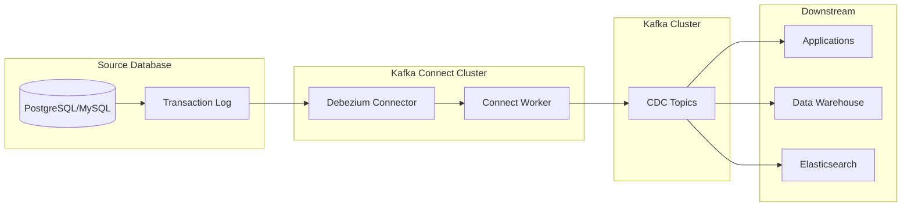
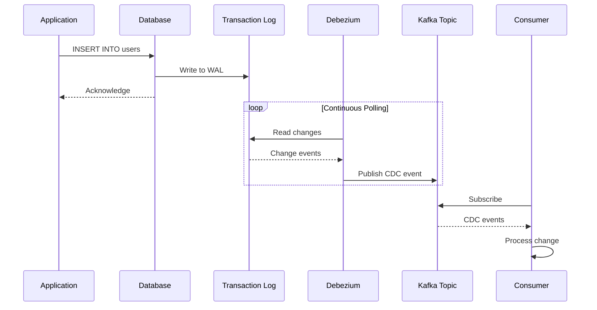
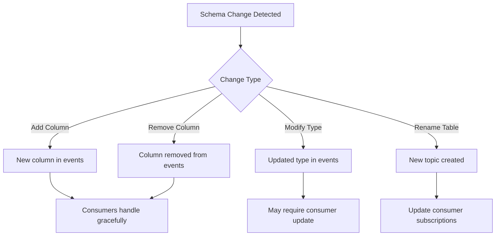

# How to Configure Kafka Connect for Database CDC

Author: [nawazdhandala](https://www.github.com/nawazdhandala)

Tags: Kafka, Kafka Connect, CDC, Database, Debezium, Data Streaming, PostgreSQL, MySQL, Real-time

Description: A comprehensive guide to setting up Kafka Connect with Debezium for capturing database changes and streaming them in real-time to Kafka topics.

---

Change Data Capture (CDC) allows you to track and stream database changes in real-time. Kafka Connect, combined with Debezium connectors, provides a robust solution for capturing INSERT, UPDATE, and DELETE operations from your databases and publishing them to Kafka topics. This guide walks you through the complete setup process.

## Understanding CDC Architecture

Before diving into configuration, let us understand how CDC with Kafka Connect works:



## Prerequisites

- Apache Kafka 2.8+ running
- Kafka Connect (included with Kafka)
- Source database (PostgreSQL, MySQL, or others)
- Java 11 or later
- Database user with replication permissions

## Install Kafka Connect

Kafka Connect comes bundled with Kafka. Create a dedicated configuration:

```bash
# Create Connect configuration directory
sudo mkdir -p /opt/kafka/config/connect

# Create worker properties file
sudo nano /opt/kafka/config/connect/connect-distributed.properties
```

```properties
# Kafka Connect Distributed Worker Configuration

# Kafka broker connection
bootstrap.servers=localhost:9092

# Unique cluster name for this Connect cluster
group.id=connect-cluster

# Converter configuration for key and value serialization
key.converter=org.apache.kafka.connect.json.JsonConverter
value.converter=org.apache.kafka.connect.json.JsonConverter

# Enable schemas in JSON output
key.converter.schemas.enable=true
value.converter.schemas.enable=true

# Internal converter for Connect's internal topics
internal.key.converter=org.apache.kafka.connect.json.JsonConverter
internal.value.converter=org.apache.kafka.connect.json.JsonConverter

# Offset storage topic configuration
offset.storage.topic=connect-offsets
offset.storage.replication.factor=1
offset.storage.partitions=25

# Config storage topic for connector configurations
config.storage.topic=connect-configs
config.storage.replication.factor=1

# Status storage topic for connector status
status.storage.topic=connect-status
status.storage.replication.factor=1

# Flush interval for offset commits
offset.flush.interval.ms=10000

# REST API configuration
rest.host.name=0.0.0.0
rest.port=8083
rest.advertised.host.name=localhost
rest.advertised.port=8083

# Plugin path for connectors
plugin.path=/opt/kafka/plugins
```

## Install Debezium Connectors

Download and install the Debezium connectors:

```bash
# Create plugins directory
sudo mkdir -p /opt/kafka/plugins

# Download Debezium PostgreSQL connector
cd /tmp
wget https://repo1.maven.org/maven2/io/debezium/debezium-connector-postgres/2.4.0.Final/debezium-connector-postgres-2.4.0.Final-plugin.tar.gz

# Extract to plugins directory
sudo tar -xzf debezium-connector-postgres-2.4.0.Final-plugin.tar.gz -C /opt/kafka/plugins/

# Download Debezium MySQL connector
wget https://repo1.maven.org/maven2/io/debezium/debezium-connector-mysql/2.4.0.Final/debezium-connector-mysql-2.4.0.Final-plugin.tar.gz

# Extract MySQL connector
sudo tar -xzf debezium-connector-mysql-2.4.0.Final-plugin.tar.gz -C /opt/kafka/plugins/

# Set permissions
sudo chown -R kafka:kafka /opt/kafka/plugins
```

## Configure PostgreSQL for CDC

Enable logical replication in PostgreSQL:

```bash
# Edit PostgreSQL configuration
sudo nano /etc/postgresql/14/main/postgresql.conf
```

```properties
# Enable logical replication for CDC
wal_level = logical

# Maximum number of replication slots
max_replication_slots = 4

# Maximum number of WAL senders
max_wal_senders = 4

# Keep WAL segments for replication
wal_keep_size = 1024
```

Create a replication user and grant permissions:

```sql
-- Create dedicated user for Debezium
CREATE USER debezium WITH REPLICATION LOGIN PASSWORD 'debezium_password';

-- Grant necessary permissions on the database
GRANT CONNECT ON DATABASE myapp TO debezium;
GRANT USAGE ON SCHEMA public TO debezium;

-- Grant SELECT on all tables you want to capture
GRANT SELECT ON ALL TABLES IN SCHEMA public TO debezium;

-- Allow future tables to be readable
ALTER DEFAULT PRIVILEGES IN SCHEMA public GRANT SELECT ON TABLES TO debezium;

-- Create publication for CDC (PostgreSQL 10+)
CREATE PUBLICATION debezium_publication FOR ALL TABLES;
```

Restart PostgreSQL:

```bash
sudo systemctl restart postgresql
```

## Configure MySQL for CDC

Enable binary logging in MySQL:

```bash
# Edit MySQL configuration
sudo nano /etc/mysql/mysql.conf.d/mysqld.cnf
```

```ini
[mysqld]
# Enable binary logging for CDC
server-id = 1
log_bin = mysql-bin
binlog_format = ROW
binlog_row_image = FULL
expire_logs_days = 3

# Enable GTID for better tracking
gtid_mode = ON
enforce_gtid_consistency = ON
```

Create MySQL user for Debezium:

```sql
-- Create dedicated CDC user
CREATE USER 'debezium'@'%' IDENTIFIED BY 'debezium_password';

-- Grant replication permissions
GRANT SELECT, RELOAD, SHOW DATABASES, REPLICATION SLAVE, REPLICATION CLIENT ON *.* TO 'debezium'@'%';

-- Grant access to specific database
GRANT SELECT ON myapp.* TO 'debezium'@'%';

-- Apply changes
FLUSH PRIVILEGES;
```

## Start Kafka Connect

Create a systemd service for Kafka Connect:

```bash
sudo nano /etc/systemd/system/kafka-connect.service
```

```ini
[Unit]
Description=Kafka Connect
Documentation=https://kafka.apache.org
Requires=kafka.service
After=kafka.service

[Service]
Type=simple
User=kafka
Group=kafka
Environment="JAVA_HOME=/usr/lib/jvm/java-11-openjdk-amd64"
Environment="KAFKA_HEAP_OPTS=-Xmx2G -Xms2G"
ExecStart=/opt/kafka/bin/connect-distributed.sh /opt/kafka/config/connect/connect-distributed.properties
ExecStop=/bin/kill -TERM $MAINPID
Restart=on-failure
RestartSec=10

[Install]
WantedBy=multi-user.target
```

Start the service:

```bash
# Reload systemd and start Connect
sudo systemctl daemon-reload
sudo systemctl start kafka-connect
sudo systemctl enable kafka-connect

# Verify Connect is running
curl http://localhost:8083/connectors
```

## Create PostgreSQL CDC Connector

Create a connector configuration file:

```bash
nano /tmp/postgres-connector.json
```

```json
{
  "name": "postgres-cdc-connector",
  "config": {
    "connector.class": "io.debezium.connector.postgresql.PostgresConnector",
    "database.hostname": "localhost",
    "database.port": "5432",
    "database.user": "debezium",
    "database.password": "debezium_password",
    "database.dbname": "myapp",
    "topic.prefix": "cdc",
    "table.include.list": "public.users,public.orders,public.products",
    "plugin.name": "pgoutput",
    "publication.name": "debezium_publication",
    "slot.name": "debezium_slot",
    "snapshot.mode": "initial",
    "tombstones.on.delete": "true",
    "decimal.handling.mode": "string",
    "time.precision.mode": "connect",
    "heartbeat.interval.ms": "10000",
    "heartbeat.action.query": "UPDATE debezium_heartbeat SET last_heartbeat = NOW()"
  }
}
```

Deploy the connector:

```bash
# Create the connector via REST API
curl -X POST http://localhost:8083/connectors \
  -H "Content-Type: application/json" \
  -d @/tmp/postgres-connector.json

# Check connector status
curl http://localhost:8083/connectors/postgres-cdc-connector/status | jq
```

## Create MySQL CDC Connector

```bash
nano /tmp/mysql-connector.json
```

```json
{
  "name": "mysql-cdc-connector",
  "config": {
    "connector.class": "io.debezium.connector.mysql.MySqlConnector",
    "database.hostname": "localhost",
    "database.port": "3306",
    "database.user": "debezium",
    "database.password": "debezium_password",
    "database.server.id": "184054",
    "topic.prefix": "mysql-cdc",
    "database.include.list": "myapp",
    "table.include.list": "myapp.users,myapp.orders",
    "schema.history.internal.kafka.bootstrap.servers": "localhost:9092",
    "schema.history.internal.kafka.topic": "schema-changes.myapp",
    "include.schema.changes": "true",
    "snapshot.mode": "initial",
    "snapshot.locking.mode": "minimal",
    "decimal.handling.mode": "string",
    "time.precision.mode": "connect"
  }
}
```

Deploy the MySQL connector:

```bash
curl -X POST http://localhost:8083/connectors \
  -H "Content-Type: application/json" \
  -d @/tmp/mysql-connector.json
```

## Understanding CDC Message Format

Debezium produces messages with a consistent structure. Here is an example of an INSERT event:

```json
{
  "schema": { ... },
  "payload": {
    "before": null,
    "after": {
      "id": 1001,
      "email": "user@example.com",
      "name": "John Doe",
      "created_at": 1706140800000
    },
    "source": {
      "version": "2.4.0.Final",
      "connector": "postgresql",
      "name": "cdc",
      "ts_ms": 1706140800123,
      "snapshot": "false",
      "db": "myapp",
      "schema": "public",
      "table": "users",
      "txId": 12345,
      "lsn": 123456789
    },
    "op": "c",
    "ts_ms": 1706140800456
  }
}
```

The operation types are:
- `c` - Create (INSERT)
- `u` - Update
- `d` - Delete
- `r` - Read (snapshot)

## CDC Data Flow Visualization



## Configure Avro Serialization

For production, use Avro with Schema Registry for efficient serialization:

```bash
# Update connect worker properties
sudo nano /opt/kafka/config/connect/connect-distributed.properties
```

```properties
# Use Avro converters with Schema Registry
key.converter=io.confluent.connect.avro.AvroConverter
key.converter.schema.registry.url=http://localhost:8081
value.converter=io.confluent.connect.avro.AvroConverter
value.converter.schema.registry.url=http://localhost:8081
```

Update connector configuration for Avro:

```json
{
  "name": "postgres-cdc-avro",
  "config": {
    "connector.class": "io.debezium.connector.postgresql.PostgresConnector",
    "database.hostname": "localhost",
    "database.port": "5432",
    "database.user": "debezium",
    "database.password": "debezium_password",
    "database.dbname": "myapp",
    "topic.prefix": "cdc-avro",
    "plugin.name": "pgoutput",
    "key.converter": "io.confluent.connect.avro.AvroConverter",
    "key.converter.schema.registry.url": "http://localhost:8081",
    "value.converter": "io.confluent.connect.avro.AvroConverter",
    "value.converter.schema.registry.url": "http://localhost:8081"
  }
}
```

## Single Message Transforms (SMTs)

Apply transformations to CDC events before they reach Kafka:

```json
{
  "name": "postgres-cdc-transformed",
  "config": {
    "connector.class": "io.debezium.connector.postgresql.PostgresConnector",
    "database.hostname": "localhost",
    "database.port": "5432",
    "database.user": "debezium",
    "database.password": "debezium_password",
    "database.dbname": "myapp",
    "topic.prefix": "cdc",
    "plugin.name": "pgoutput",

    "transforms": "unwrap,route,timestamp",

    "transforms.unwrap.type": "io.debezium.transforms.ExtractNewRecordState",
    "transforms.unwrap.drop.tombstones": "false",
    "transforms.unwrap.delete.handling.mode": "rewrite",
    "transforms.unwrap.add.fields": "op,table,source.ts_ms",

    "transforms.route.type": "org.apache.kafka.connect.transforms.RegexRouter",
    "transforms.route.regex": "cdc\\.public\\.(.*)",
    "transforms.route.replacement": "events.$1",

    "transforms.timestamp.type": "org.apache.kafka.connect.transforms.InsertField$Value",
    "transforms.timestamp.timestamp.field": "processed_at"
  }
}
```

## Monitoring Kafka Connect

### Check Connector Status

```bash
# List all connectors
curl http://localhost:8083/connectors | jq

# Get detailed status
curl http://localhost:8083/connectors/postgres-cdc-connector/status | jq

# Check connector configuration
curl http://localhost:8083/connectors/postgres-cdc-connector/config | jq
```

### Monitor Connector Metrics

Enable JMX for monitoring:

```bash
# Add to kafka-connect.service Environment
Environment="KAFKA_JMX_OPTS=-Dcom.sun.management.jmxremote -Dcom.sun.management.jmxremote.port=9998 -Dcom.sun.management.jmxremote.authenticate=false -Dcom.sun.management.jmxremote.ssl=false"
```

Key metrics to monitor:
- `source-record-poll-total` - Total records polled from source
- `source-record-write-total` - Total records written to Kafka
- `offset-commit-completion-total` - Successful offset commits
- `last-event-time` - Timestamp of last processed event

### Check Consumer Lag

```bash
# Check CDC topic lag
/opt/kafka/bin/kafka-consumer-groups.sh --bootstrap-server localhost:9092 \
  --describe --group connect-cluster

# List CDC topics
/opt/kafka/bin/kafka-topics.sh --bootstrap-server localhost:9092 --list | grep cdc
```

## Handling Schema Changes

Debezium handles schema changes automatically, but you should understand the behavior:



Configure schema evolution handling:

```json
{
  "config": {
    "schema.history.internal.kafka.bootstrap.servers": "localhost:9092",
    "schema.history.internal.kafka.topic": "schema-changes.myapp",
    "include.schema.changes": "true",
    "column.exclude.list": "public.users.password_hash,public.users.ssn"
  }
}
```

## Troubleshooting Common Issues

### Connector Fails to Start

```bash
# Check Connect logs
sudo journalctl -u kafka-connect -f

# Verify plugin is loaded
curl http://localhost:8083/connector-plugins | jq

# Validate connector configuration
curl -X PUT http://localhost:8083/connector-plugins/PostgresConnector/config/validate \
  -H "Content-Type: application/json" \
  -d @/tmp/postgres-connector.json | jq
```

### Replication Slot Issues

```sql
-- Check existing replication slots
SELECT * FROM pg_replication_slots;

-- Drop stuck slot
SELECT pg_drop_replication_slot('debezium_slot');

-- Check slot lag
SELECT slot_name, pg_size_pretty(pg_wal_lsn_diff(pg_current_wal_lsn(), restart_lsn)) AS lag
FROM pg_replication_slots;
```

### High Latency

```bash
# Increase parallelism in connector
{
  "config": {
    "tasks.max": "4",
    "snapshot.fetch.size": "10240",
    "poll.interval.ms": "100",
    "max.batch.size": "2048"
  }
}
```

### Restart Connector

```bash
# Restart specific connector
curl -X POST http://localhost:8083/connectors/postgres-cdc-connector/restart

# Restart specific task
curl -X POST http://localhost:8083/connectors/postgres-cdc-connector/tasks/0/restart

# Delete and recreate connector
curl -X DELETE http://localhost:8083/connectors/postgres-cdc-connector
curl -X POST http://localhost:8083/connectors -H "Content-Type: application/json" -d @/tmp/postgres-connector.json
```

## Production Best Practices

1. **Use dedicated database users** with minimal required permissions
2. **Monitor replication lag** to ensure CDC events are timely
3. **Configure heartbeats** to keep connections alive during low-activity periods
4. **Set appropriate retention** on CDC topics based on your recovery needs
5. **Use Schema Registry** for schema evolution management
6. **Implement idempotent consumers** since events may be delivered more than once
7. **Back up connector configurations** and schema history topics
8. **Use separate Connect clusters** for production and non-production

---

Kafka Connect with Debezium provides a powerful foundation for building event-driven architectures with real-time database change capture. By following this guide, you can set up reliable CDC pipelines that stream database changes to Kafka for downstream processing, analytics, and synchronization across your systems.
