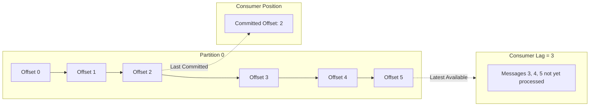
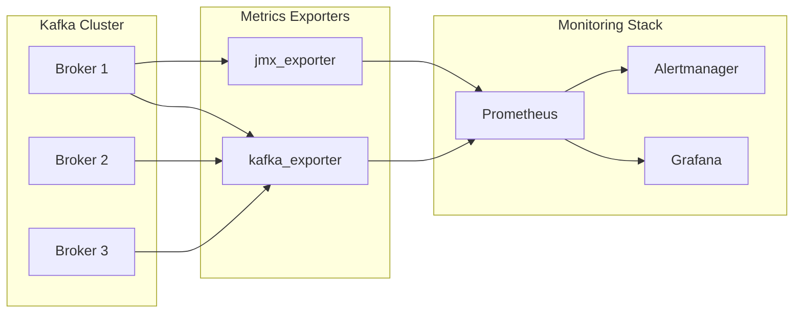
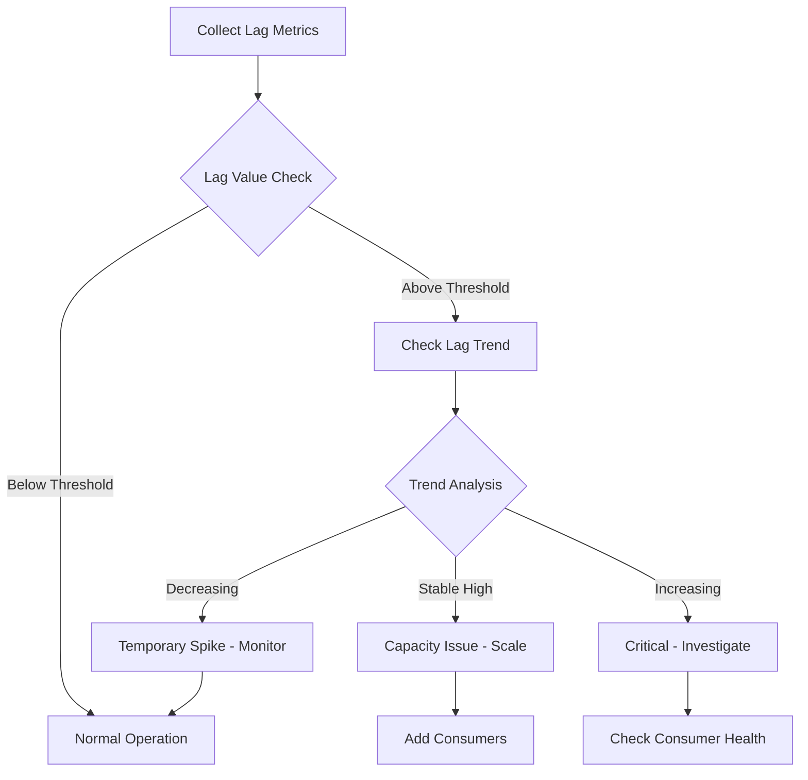

# How to Configure Kafka Consumer Lag Monitoring

Author: [nawazdhandala](https://www.github.com/nawazdhandala)

Tags: Kafka, Consumer Lag, Monitoring, Observability, Metrics, Prometheus, Grafana

Description: A practical guide to setting up comprehensive consumer lag monitoring for Apache Kafka using built-in tools, JMX metrics, and modern observability stacks.

---

Consumer lag is one of the most critical metrics for monitoring Apache Kafka applications. It represents the difference between the latest message offset in a partition and the last committed offset by a consumer group. High consumer lag indicates that consumers are falling behind producers, which can lead to data processing delays and potential data loss. This guide covers multiple approaches to monitor consumer lag effectively.

## Understanding Consumer Lag

Consumer lag measures how far behind a consumer is from the latest available message in a partition.



### Why Consumer Lag Matters

| Lag Level | Implication | Action |
|-----------|-------------|--------|
| 0 | Consumer is caught up | Normal operation |
| Low (< 1000) | Minor processing delay | Monitor trends |
| Medium (1000-10000) | Noticeable delay | Investigate cause |
| High (> 10000) | Significant backlog | Scale consumers or optimize |
| Growing continuously | Consumer cannot keep up | Urgent intervention needed |

## Method 1: Kafka CLI Tools

Kafka provides built-in command-line tools for checking consumer lag.

### Using kafka-consumer-groups.sh

```bash
# Describe a consumer group and show lag
kafka-consumer-groups.sh --bootstrap-server localhost:9092 \
    --group my-consumer-group \
    --describe

# Output shows:
# GROUP           TOPIC           PARTITION  CURRENT-OFFSET  LOG-END-OFFSET  LAG
# my-group        my-topic        0          1000            1050            50
# my-group        my-topic        1          2000            2100            100
```

### Automated Lag Check Script

```bash
#!/bin/bash
# kafka-lag-check.sh - Monitor consumer lag and alert on thresholds

BOOTSTRAP_SERVER="localhost:9092"
CONSUMER_GROUP="$1"
LAG_THRESHOLD="${2:-1000}"
ALERT_ENDPOINT="${3:-}"

if [ -z "$CONSUMER_GROUP" ]; then
    echo "Usage: $0 <consumer-group> [lag-threshold] [alert-endpoint]"
    exit 1
fi

# Get consumer group lag information
LAG_OUTPUT=$(kafka-consumer-groups.sh \
    --bootstrap-server "$BOOTSTRAP_SERVER" \
    --group "$CONSUMER_GROUP" \
    --describe 2>/dev/null)

# Parse and check lag values
echo "$LAG_OUTPUT" | tail -n +3 | while read -r line; do
    if [ -n "$line" ]; then
        TOPIC=$(echo "$line" | awk '{print $2}')
        PARTITION=$(echo "$line" | awk '{print $3}')
        LAG=$(echo "$line" | awk '{print $6}')

        # Skip if LAG is not a number (header row or error)
        if [[ "$LAG" =~ ^[0-9]+$ ]]; then
            echo "Topic: $TOPIC, Partition: $PARTITION, Lag: $LAG"

            if [ "$LAG" -gt "$LAG_THRESHOLD" ]; then
                echo "WARNING: High lag detected! $TOPIC:$PARTITION lag=$LAG"

                # Send alert if endpoint configured
                if [ -n "$ALERT_ENDPOINT" ]; then
                    curl -X POST "$ALERT_ENDPOINT" \
                        -H "Content-Type: application/json" \
                        -d "{\"group\": \"$CONSUMER_GROUP\", \"topic\": \"$TOPIC\", \"partition\": $PARTITION, \"lag\": $LAG}"
                fi
            fi
        fi
    fi
done

# Calculate total lag
TOTAL_LAG=$(echo "$LAG_OUTPUT" | tail -n +3 | awk '{sum += $6} END {print sum}')
echo "Total lag for group $CONSUMER_GROUP: $TOTAL_LAG"
```

## Method 2: JMX Metrics

Kafka exposes comprehensive metrics through JMX that can be collected by monitoring systems.

### Enable JMX on Kafka Brokers

Add to your Kafka startup script or `kafka-server-start.sh`:

```bash
export KAFKA_JMX_OPTS="-Dcom.sun.management.jmxremote \
    -Dcom.sun.management.jmxremote.port=9999 \
    -Dcom.sun.management.jmxremote.authenticate=false \
    -Dcom.sun.management.jmxremote.ssl=false \
    -Djava.rmi.server.hostname=localhost"

export JMX_PORT=9999
```

### Key Consumer Lag JMX Metrics

```
# Consumer metrics (available on consumer JVM)
kafka.consumer:type=consumer-fetch-manager-metrics,client-id=*,topic=*,partition=*
  - records-lag                    # Current lag per partition
  - records-lag-avg                # Average lag
  - records-lag-max                # Maximum lag

# Consumer group coordinator metrics (available on broker)
kafka.server:type=FetcherLagMetrics,name=ConsumerLag,clientId=*,topic=*,partition=*
```

### Java Application with JMX Metrics Export

```java
import org.apache.kafka.clients.consumer.*;
import org.apache.kafka.common.TopicPartition;
import javax.management.*;
import java.lang.management.ManagementFactory;
import java.util.*;
import java.util.concurrent.*;

public class MonitoredConsumer {

    private final KafkaConsumer<String, String> consumer;
    private final MBeanServer mBeanServer;
    private final String groupId;
    private final ScheduledExecutorService scheduler;

    public MonitoredConsumer(String bootstrapServers, String groupId) {
        Properties props = new Properties();
        props.put(ConsumerConfig.BOOTSTRAP_SERVERS_CONFIG, bootstrapServers);
        props.put(ConsumerConfig.GROUP_ID_CONFIG, groupId);
        props.put(ConsumerConfig.KEY_DESERIALIZER_CLASS_CONFIG,
            "org.apache.kafka.common.serialization.StringDeserializer");
        props.put(ConsumerConfig.VALUE_DESERIALIZER_CLASS_CONFIG,
            "org.apache.kafka.common.serialization.StringDeserializer");
        props.put(ConsumerConfig.ENABLE_AUTO_COMMIT_CONFIG, false);

        this.consumer = new KafkaConsumer<>(props);
        this.mBeanServer = ManagementFactory.getPlatformMBeanServer();
        this.groupId = groupId;
        this.scheduler = Executors.newSingleThreadScheduledExecutor();

        // Start lag metrics collection
        startLagMetricsCollection();
    }

    /**
     * Periodically calculates and exposes consumer lag as JMX metrics.
     */
    private void startLagMetricsCollection() {
        scheduler.scheduleAtFixedRate(() -> {
            try {
                Map<TopicPartition, Long> endOffsets = consumer.endOffsets(
                    consumer.assignment());

                for (TopicPartition partition : consumer.assignment()) {
                    long currentOffset = consumer.position(partition);
                    long endOffset = endOffsets.getOrDefault(partition, 0L);
                    long lag = endOffset - currentOffset;

                    // Register or update JMX metric
                    registerLagMetric(partition, lag);

                    System.out.printf("Partition %s lag: %d%n", partition, lag);
                }
            } catch (Exception e) {
                System.err.println("Error collecting lag metrics: " + e.getMessage());
            }
        }, 0, 10, TimeUnit.SECONDS);
    }

    private void registerLagMetric(TopicPartition partition, long lag) {
        try {
            ObjectName objectName = new ObjectName(String.format(
                "kafka.consumer:type=consumer-lag,group=%s,topic=%s,partition=%d",
                groupId, partition.topic(), partition.partition()));

            if (!mBeanServer.isRegistered(objectName)) {
                LagMBean lagMBean = new Lag(lag);
                mBeanServer.registerMBean(lagMBean, objectName);
            } else {
                // Update existing metric
                mBeanServer.setAttribute(objectName,
                    new Attribute("Value", lag));
            }
        } catch (Exception e) {
            System.err.println("Error registering MBean: " + e.getMessage());
        }
    }

    // MBean interface for lag metric
    public interface LagMBean {
        long getValue();
        void setValue(long value);
    }

    public static class Lag implements LagMBean {
        private volatile long value;

        public Lag(long value) {
            this.value = value;
        }

        @Override
        public long getValue() {
            return value;
        }

        @Override
        public void setValue(long value) {
            this.value = value;
        }
    }

    public void close() {
        scheduler.shutdown();
        consumer.close();
    }
}
```

## Method 3: Prometheus and Grafana

A modern approach using Prometheus for metrics collection and Grafana for visualization.

### Architecture Overview



### Deploy kafka_exporter

The kafka_exporter is a popular choice for exposing Kafka metrics to Prometheus.

```yaml
# docker-compose.yml
version: '3.8'
services:
  kafka-exporter:
    image: danielqsj/kafka-exporter:latest
    ports:
      - "9308:9308"
    command:
      - --kafka.server=kafka1:9092
      - --kafka.server=kafka2:9092
      - --kafka.server=kafka3:9092
      - --topic.filter=.*
      - --group.filter=.*
    environment:
      - KAFKA_EXPORTER_LOG_LEVEL=info
    restart: unless-stopped
```

### Prometheus Configuration

```yaml
# prometheus.yml
global:
  scrape_interval: 15s
  evaluation_interval: 15s

rule_files:
  - /etc/prometheus/rules/kafka_alerts.yml

alerting:
  alertmanagers:
    - static_configs:
        - targets:
          - alertmanager:9093

scrape_configs:
  # Scrape kafka_exporter metrics
  - job_name: 'kafka-exporter'
    static_configs:
      - targets: ['kafka-exporter:9308']
    relabel_configs:
      - source_labels: [__address__]
        target_label: instance
        regex: '([^:]+):\d+'
        replacement: '${1}'

  # Scrape JMX exporter metrics from brokers
  - job_name: 'kafka-jmx'
    static_configs:
      - targets:
        - 'kafka1:7071'
        - 'kafka2:7071'
        - 'kafka3:7071'
```

### Key Prometheus Metrics for Consumer Lag

```promql
# Consumer group lag per partition
kafka_consumergroup_lag{consumergroup="my-group", topic="my-topic"}

# Total lag across all partitions for a consumer group
sum(kafka_consumergroup_lag{consumergroup="my-group"}) by (consumergroup)

# Lag rate of change (messages per second falling behind)
rate(kafka_consumergroup_lag{consumergroup="my-group"}[5m])

# Consumer group current offset
kafka_consumergroup_current_offset{consumergroup="my-group"}

# Topic partition end offset (latest message)
kafka_topic_partition_current_offset{topic="my-topic"}
```

### Alerting Rules

```yaml
# kafka_alerts.yml
groups:
  - name: kafka_consumer_lag
    rules:
      # Alert when consumer lag exceeds threshold
      - alert: KafkaConsumerLagHigh
        expr: sum(kafka_consumergroup_lag) by (consumergroup, topic) > 10000
        for: 5m
        labels:
          severity: warning
        annotations:
          summary: "High consumer lag detected"
          description: "Consumer group {{ $labels.consumergroup }} has lag of {{ $value }} on topic {{ $labels.topic }}"

      # Alert when lag is growing continuously
      - alert: KafkaConsumerLagGrowing
        expr: |
          avg(rate(kafka_consumergroup_lag[10m])) by (consumergroup, topic) > 100
        for: 15m
        labels:
          severity: critical
        annotations:
          summary: "Consumer lag is continuously growing"
          description: "Consumer group {{ $labels.consumergroup }} lag is growing at {{ $value }} messages/second"

      # Alert when consumer group has no active members
      - alert: KafkaConsumerGroupInactive
        expr: kafka_consumergroup_members == 0
        for: 5m
        labels:
          severity: critical
        annotations:
          summary: "Consumer group has no active members"
          description: "Consumer group {{ $labels.consumergroup }} has no active consumers"

      # Alert when partition has no consumer
      - alert: KafkaPartitionUnderReplicated
        expr: kafka_topic_partition_under_replicated_partition > 0
        for: 1m
        labels:
          severity: critical
        annotations:
          summary: "Partition is under-replicated"
          description: "Topic {{ $labels.topic }} partition {{ $labels.partition }} is under-replicated"
```

### Grafana Dashboard JSON

```json
{
  "dashboard": {
    "title": "Kafka Consumer Lag Dashboard",
    "panels": [
      {
        "title": "Consumer Lag by Group",
        "type": "timeseries",
        "gridPos": {"h": 8, "w": 12, "x": 0, "y": 0},
        "targets": [
          {
            "expr": "sum(kafka_consumergroup_lag) by (consumergroup)",
            "legendFormat": "{{consumergroup}}"
          }
        ]
      },
      {
        "title": "Lag by Topic and Partition",
        "type": "table",
        "gridPos": {"h": 8, "w": 12, "x": 12, "y": 0},
        "targets": [
          {
            "expr": "kafka_consumergroup_lag",
            "format": "table",
            "instant": true
          }
        ],
        "transformations": [
          {
            "id": "organize",
            "options": {
              "includeByName": {
                "consumergroup": true,
                "topic": true,
                "partition": true,
                "Value": true
              },
              "renameByName": {
                "Value": "Lag"
              }
            }
          }
        ]
      },
      {
        "title": "Lag Growth Rate",
        "type": "timeseries",
        "gridPos": {"h": 8, "w": 12, "x": 0, "y": 8},
        "targets": [
          {
            "expr": "rate(kafka_consumergroup_lag[5m])",
            "legendFormat": "{{consumergroup}} - {{topic}}"
          }
        ]
      },
      {
        "title": "Consumer Group Members",
        "type": "stat",
        "gridPos": {"h": 4, "w": 6, "x": 12, "y": 8},
        "targets": [
          {
            "expr": "kafka_consumergroup_members",
            "legendFormat": "{{consumergroup}}"
          }
        ]
      }
    ]
  }
}
```

## Method 4: Programmatic Lag Monitoring

Build custom lag monitoring into your applications.

### Java Lag Monitor

```java
import org.apache.kafka.clients.admin.*;
import org.apache.kafka.clients.consumer.*;
import org.apache.kafka.common.TopicPartition;
import java.util.*;
import java.util.concurrent.*;
import java.time.Duration;

public class KafkaLagMonitor {

    private final AdminClient adminClient;
    private final Properties consumerProps;
    private final ScheduledExecutorService scheduler;
    private final List<LagListener> listeners;

    public interface LagListener {
        void onLagUpdate(String groupId, Map<TopicPartition, LagInfo> lagByPartition);
    }

    public static class LagInfo {
        public final long currentOffset;
        public final long endOffset;
        public final long lag;
        public final String consumerId;

        public LagInfo(long currentOffset, long endOffset, long lag, String consumerId) {
            this.currentOffset = currentOffset;
            this.endOffset = endOffset;
            this.lag = lag;
            this.consumerId = consumerId;
        }
    }

    public KafkaLagMonitor(String bootstrapServers) {
        Properties adminProps = new Properties();
        adminProps.put(AdminClientConfig.BOOTSTRAP_SERVERS_CONFIG, bootstrapServers);
        this.adminClient = AdminClient.create(adminProps);

        this.consumerProps = new Properties();
        consumerProps.put(ConsumerConfig.BOOTSTRAP_SERVERS_CONFIG, bootstrapServers);
        consumerProps.put(ConsumerConfig.KEY_DESERIALIZER_CLASS_CONFIG,
            "org.apache.kafka.common.serialization.StringDeserializer");
        consumerProps.put(ConsumerConfig.VALUE_DESERIALIZER_CLASS_CONFIG,
            "org.apache.kafka.common.serialization.StringDeserializer");

        this.scheduler = Executors.newSingleThreadScheduledExecutor();
        this.listeners = new CopyOnWriteArrayList<>();
    }

    public void addListener(LagListener listener) {
        listeners.add(listener);
    }

    /**
     * Starts periodic monitoring of consumer group lag.
     */
    public void startMonitoring(String groupId, Duration interval) {
        scheduler.scheduleAtFixedRate(() -> {
            try {
                Map<TopicPartition, LagInfo> lagInfo = calculateLag(groupId);

                // Notify listeners
                for (LagListener listener : listeners) {
                    listener.onLagUpdate(groupId, lagInfo);
                }

            } catch (Exception e) {
                System.err.println("Error calculating lag: " + e.getMessage());
            }
        }, 0, interval.toMillis(), TimeUnit.MILLISECONDS);
    }

    /**
     * Calculates current lag for all partitions assigned to a consumer group.
     */
    public Map<TopicPartition, LagInfo> calculateLag(String groupId) throws Exception {
        Map<TopicPartition, LagInfo> result = new HashMap<>();

        // Get consumer group offsets
        ListConsumerGroupOffsetsResult offsetsResult =
            adminClient.listConsumerGroupOffsets(groupId);
        Map<TopicPartition, OffsetAndMetadata> offsets =
            offsetsResult.partitionsToOffsetAndMetadata().get();

        if (offsets.isEmpty()) {
            return result;
        }

        // Get end offsets for all partitions
        Set<TopicPartition> partitions = offsets.keySet();

        try (KafkaConsumer<String, String> consumer = new KafkaConsumer<>(consumerProps)) {
            Map<TopicPartition, Long> endOffsets = consumer.endOffsets(partitions);

            // Get consumer group description for member assignment
            DescribeConsumerGroupsResult groupResult =
                adminClient.describeConsumerGroups(Collections.singleton(groupId));
            ConsumerGroupDescription groupDesc =
                groupResult.describedGroups().get(groupId).get();

            // Build partition to consumer mapping
            Map<TopicPartition, String> partitionConsumers = new HashMap<>();
            for (MemberDescription member : groupDesc.members()) {
                for (TopicPartition tp : member.assignment().topicPartitions()) {
                    partitionConsumers.put(tp, member.consumerId());
                }
            }

            // Calculate lag for each partition
            for (TopicPartition partition : partitions) {
                long currentOffset = offsets.get(partition).offset();
                long endOffset = endOffsets.getOrDefault(partition, 0L);
                long lag = endOffset - currentOffset;
                String consumerId = partitionConsumers.getOrDefault(partition, "unassigned");

                result.put(partition, new LagInfo(currentOffset, endOffset, lag, consumerId));
            }
        }

        return result;
    }

    /**
     * Gets total lag across all partitions for a consumer group.
     */
    public long getTotalLag(String groupId) throws Exception {
        return calculateLag(groupId).values().stream()
            .mapToLong(info -> info.lag)
            .sum();
    }

    public void close() {
        scheduler.shutdown();
        adminClient.close();
    }

    public static void main(String[] args) throws Exception {
        KafkaLagMonitor monitor = new KafkaLagMonitor("localhost:9092");

        // Add a listener that logs lag information
        monitor.addListener((groupId, lagByPartition) -> {
            System.out.println("\n=== Lag Report for " + groupId + " ===");
            long totalLag = 0;

            for (Map.Entry<TopicPartition, LagInfo> entry : lagByPartition.entrySet()) {
                TopicPartition tp = entry.getKey();
                LagInfo info = entry.getValue();

                System.out.printf("%s-%d: offset=%d, end=%d, lag=%d, consumer=%s%n",
                    tp.topic(), tp.partition(),
                    info.currentOffset, info.endOffset, info.lag, info.consumerId);

                totalLag += info.lag;
            }

            System.out.printf("Total lag: %d%n", totalLag);
        });

        // Start monitoring
        monitor.startMonitoring("my-consumer-group", Duration.ofSeconds(10));

        // Keep running
        Thread.sleep(Long.MAX_VALUE);
    }
}
```

### Python Lag Monitor with confluent-kafka

```python
#!/usr/bin/env python3
"""
Kafka consumer lag monitor using confluent-kafka-python.
"""

from confluent_kafka import Consumer, TopicPartition
from confluent_kafka.admin import AdminClient
import time
import json
from datetime import datetime
from typing import Dict, List, Callable

class LagMonitor:
    """Monitors consumer group lag and provides metrics."""

    def __init__(self, bootstrap_servers: str):
        self.admin_client = AdminClient({
            'bootstrap.servers': bootstrap_servers
        })
        self.bootstrap_servers = bootstrap_servers
        self.listeners: List[Callable] = []

    def add_listener(self, listener: Callable):
        """Add a callback function to receive lag updates."""
        self.listeners.append(listener)

    def get_consumer_groups(self) -> List[str]:
        """Get list of all consumer groups."""
        groups = self.admin_client.list_groups(timeout=10)
        return [g.id for g in groups]

    def calculate_lag(self, group_id: str) -> Dict:
        """Calculate lag for all partitions in a consumer group."""

        # Create a temporary consumer to get offsets
        consumer = Consumer({
            'bootstrap.servers': self.bootstrap_servers,
            'group.id': f'{group_id}-lag-monitor-{time.time()}',
            'enable.auto.commit': False,
        })

        try:
            # Get committed offsets for the group
            # First, we need to get the topics the group is subscribed to
            group_metadata = self.admin_client.list_consumer_groups()

            # Get topic partitions for the consumer group
            committed_offsets = {}
            topic_partitions = []

            # Get group's committed offsets
            topics = set()
            cluster_metadata = self.admin_client.list_topics(timeout=10)

            for topic_name in cluster_metadata.topics:
                if topic_name.startswith('_'):  # Skip internal topics
                    continue

                topic_metadata = cluster_metadata.topics[topic_name]
                for partition_id in topic_metadata.partitions:
                    tp = TopicPartition(topic_name, partition_id)
                    topic_partitions.append(tp)

            # Get committed offsets
            committed = consumer.committed(topic_partitions, timeout=10)

            # Filter to only partitions with committed offsets
            active_partitions = [
                tp for tp in committed
                if tp is not None and tp.offset >= 0
            ]

            if not active_partitions:
                return {'group_id': group_id, 'partitions': [], 'total_lag': 0}

            # Get end offsets (high watermarks)
            lag_info = []

            for tp in active_partitions:
                # Get the high watermark
                low, high = consumer.get_watermark_offsets(tp, timeout=10)

                lag = high - tp.offset if tp.offset >= 0 else high

                lag_info.append({
                    'topic': tp.topic,
                    'partition': tp.partition,
                    'current_offset': tp.offset,
                    'end_offset': high,
                    'lag': lag
                })

            total_lag = sum(p['lag'] for p in lag_info)

            return {
                'group_id': group_id,
                'timestamp': datetime.utcnow().isoformat(),
                'partitions': lag_info,
                'total_lag': total_lag
            }

        finally:
            consumer.close()

    def monitor_group(self, group_id: str, interval_seconds: int = 10):
        """Continuously monitor a consumer group."""
        print(f"Starting lag monitoring for group: {group_id}")

        while True:
            try:
                lag_data = self.calculate_lag(group_id)

                # Notify listeners
                for listener in self.listeners:
                    listener(lag_data)

                # Print summary
                print(f"\n[{lag_data['timestamp']}] Group: {group_id}")
                print(f"Total lag: {lag_data['total_lag']}")

                for p in lag_data['partitions']:
                    print(f"  {p['topic']}-{p['partition']}: "
                          f"offset={p['current_offset']}, "
                          f"end={p['end_offset']}, "
                          f"lag={p['lag']}")

            except Exception as e:
                print(f"Error monitoring group: {e}")

            time.sleep(interval_seconds)


def json_listener(lag_data: Dict):
    """Example listener that outputs JSON."""
    print(json.dumps(lag_data, indent=2))


def alert_listener(lag_data: Dict, threshold: int = 1000):
    """Example listener that alerts on high lag."""
    if lag_data['total_lag'] > threshold:
        print(f"ALERT: High lag detected! {lag_data['total_lag']} > {threshold}")


if __name__ == '__main__':
    import argparse

    parser = argparse.ArgumentParser(description='Kafka Consumer Lag Monitor')
    parser.add_argument('--bootstrap-servers', default='localhost:9092',
                        help='Kafka bootstrap servers')
    parser.add_argument('--group', required=True, help='Consumer group to monitor')
    parser.add_argument('--interval', type=int, default=10,
                        help='Monitoring interval in seconds')
    parser.add_argument('--threshold', type=int, default=1000,
                        help='Lag threshold for alerts')

    args = parser.parse_args()

    monitor = LagMonitor(args.bootstrap_servers)
    monitor.add_listener(lambda data: alert_listener(data, args.threshold))

    monitor.monitor_group(args.group, args.interval)
```

## Best Practices for Consumer Lag Monitoring

### 1. Set Appropriate Alert Thresholds

```yaml
# Different thresholds for different scenarios
alerts:
  # Real-time processing - low tolerance
  realtime_lag:
    warning: 100
    critical: 1000

  # Batch processing - higher tolerance
  batch_lag:
    warning: 10000
    critical: 100000

  # Lag growth rate - universal concern
  lag_growth:
    warning: 50   # messages/second
    critical: 200
```

### 2. Monitor Lag Trends, Not Just Values



### 3. Correlate with Other Metrics

Monitor these alongside consumer lag:

- Producer throughput
- Consumer processing time
- Consumer group rebalances
- Broker CPU and memory
- Network throughput

## Conclusion

Effective consumer lag monitoring is essential for maintaining healthy Kafka deployments:

1. **Use built-in CLI tools** for quick ad-hoc checks
2. **Expose JMX metrics** for detailed application-level monitoring
3. **Deploy Prometheus and Grafana** for comprehensive visualization and alerting
4. **Build custom monitors** for application-specific requirements

By implementing comprehensive lag monitoring, you can detect issues before they impact your applications and make informed decisions about scaling your Kafka consumers.
