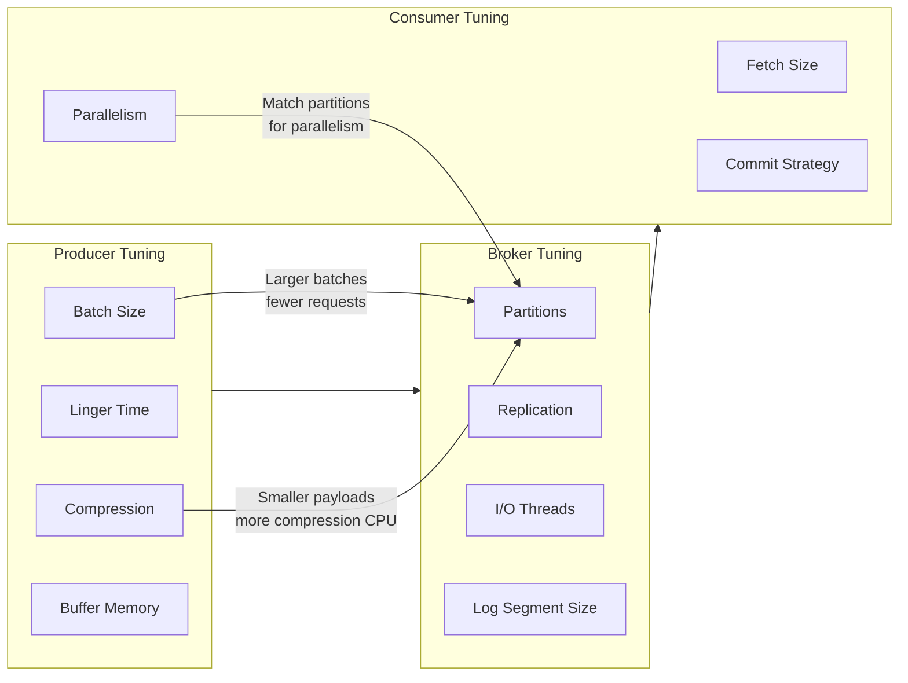
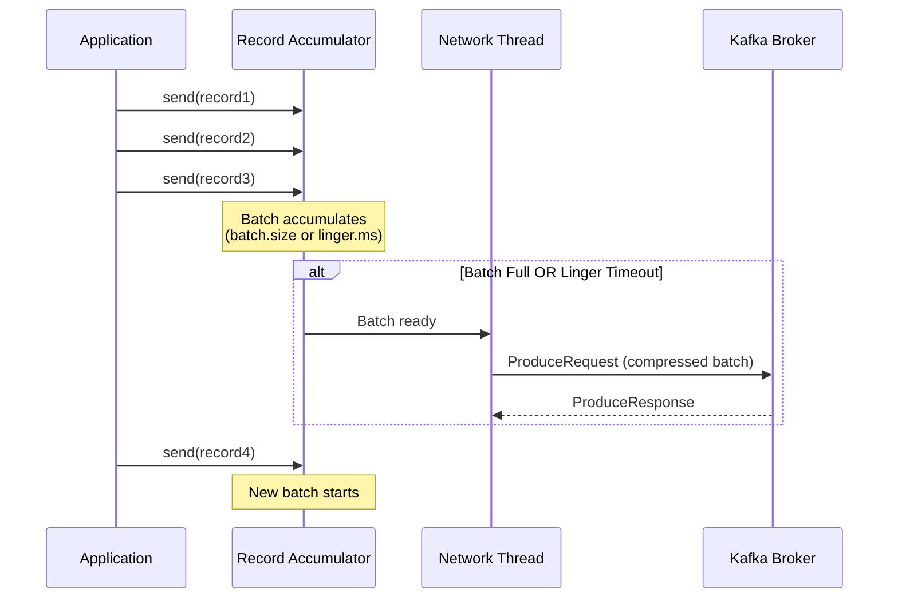
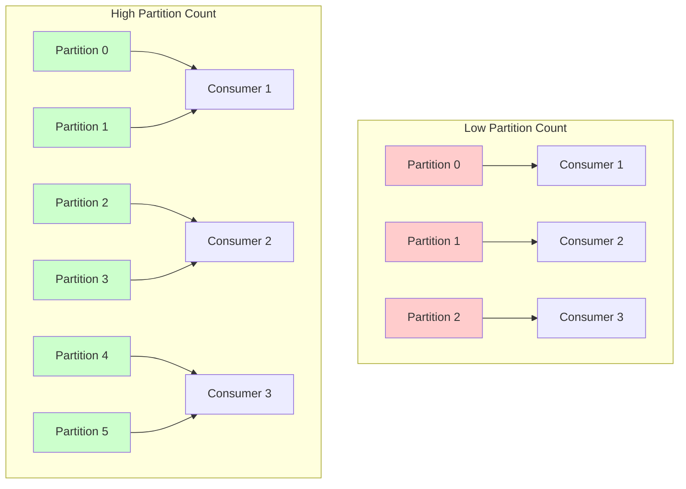

# How to Configure Kafka for High Throughput

Author: [nawazdhandala](https://www.github.com/nawazdhandala)

Tags: Kafka, Performance, High Throughput, Java, Configuration, Producer, Consumer, Optimization

Description: Learn how to tune Apache Kafka producers, consumers, and brokers for maximum throughput with practical configuration examples and performance benchmarks.

---

> Kafka can handle millions of messages per second, but achieving this requires careful configuration of producers, consumers, and brokers. Default settings prioritize safety over speed, and tuning them for your workload can yield dramatic performance improvements.

Apache Kafka is designed for high-throughput data streaming, but out-of-the-box configurations are conservative. This guide covers the key settings to optimize for maximum throughput across your entire Kafka pipeline.

---

## Understanding Kafka Throughput

Throughput in Kafka depends on multiple factors working together:



---

## High-Throughput Producer Configuration

### Essential Settings

```java
import org.apache.kafka.clients.producer.*;
import java.util.Properties;

public class HighThroughputProducer {

    public static KafkaProducer<String, String> createProducer() {
        Properties props = new Properties();

        // Basic connection settings
        props.put(ProducerConfig.BOOTSTRAP_SERVERS_CONFIG, "kafka1:9092,kafka2:9092,kafka3:9092");
        props.put(ProducerConfig.KEY_SERIALIZER_CLASS_CONFIG,
            "org.apache.kafka.common.serialization.StringSerializer");
        props.put(ProducerConfig.VALUE_SERIALIZER_CLASS_CONFIG,
            "org.apache.kafka.common.serialization.StringSerializer");

        // THROUGHPUT SETTINGS

        // Batch size in bytes - larger batches mean fewer requests
        // Default: 16384 (16KB), increase for high throughput
        props.put(ProducerConfig.BATCH_SIZE_CONFIG, 65536); // 64KB

        // Time to wait for batch to fill before sending
        // Default: 0 (send immediately), add delay to allow batching
        props.put(ProducerConfig.LINGER_MS_CONFIG, 10); // Wait up to 10ms

        // Total memory for buffering records
        // Default: 33554432 (32MB), increase for sustained high throughput
        props.put(ProducerConfig.BUFFER_MEMORY_CONFIG, 67108864); // 64MB

        // Compression reduces network bandwidth significantly
        // Options: none, gzip, snappy, lz4, zstd
        // lz4 offers best balance of compression ratio and CPU usage
        props.put(ProducerConfig.COMPRESSION_TYPE_CONFIG, "lz4");

        // Number of acknowledgments required
        // acks=1 for high throughput (leader only)
        // acks=all for durability (wait for all replicas)
        props.put(ProducerConfig.ACKS_CONFIG, "1");

        // Maximum requests in flight per connection
        // Higher values increase throughput but may affect ordering
        props.put(ProducerConfig.MAX_IN_FLIGHT_REQUESTS_PER_CONNECTION, 5);

        // Request timeout - how long to wait for response
        props.put(ProducerConfig.REQUEST_TIMEOUT_MS_CONFIG, 30000);

        // Delivery timeout - total time for send to complete
        props.put(ProducerConfig.DELIVERY_TIMEOUT_MS_CONFIG, 120000);

        return new KafkaProducer<>(props);
    }
}
```

### Batching Explained



### Compression Comparison

Choose the right compression algorithm for your use case:

| Algorithm | Compression Ratio | CPU Usage | Best For |
|-----------|------------------|-----------|----------|
| none | 1.0x | None | Very low latency requirements |
| lz4 | 2-3x | Low | General high throughput |
| snappy | 2-3x | Low | Similar to lz4, widely supported |
| zstd | 3-5x | Medium | Best ratio when CPU is not bottleneck |
| gzip | 3-4x | High | Maximum compression, batch jobs |

```java
// Benchmark different compression settings
public class CompressionBenchmark {

    public static void benchmarkCompression(String compressionType, int messageCount) {
        Properties props = new Properties();
        props.put(ProducerConfig.BOOTSTRAP_SERVERS_CONFIG, "localhost:9092");
        props.put(ProducerConfig.COMPRESSION_TYPE_CONFIG, compressionType);
        props.put(ProducerConfig.BATCH_SIZE_CONFIG, 65536);
        props.put(ProducerConfig.LINGER_MS_CONFIG, 10);
        // ... other settings

        KafkaProducer<String, String> producer = new KafkaProducer<>(props);

        long startTime = System.currentTimeMillis();

        for (int i = 0; i < messageCount; i++) {
            // Typical JSON payload
            String value = "{\"id\":" + i + ",\"timestamp\":" + System.currentTimeMillis() +
                ",\"data\":\"sample-payload-with-some-content\"}";
            producer.send(new ProducerRecord<>("benchmark-topic", String.valueOf(i), value));
        }

        producer.flush();
        long endTime = System.currentTimeMillis();

        double throughput = (messageCount * 1000.0) / (endTime - startTime);
        System.out.printf("Compression: %s, Throughput: %.2f msgs/sec%n",
            compressionType, throughput);

        producer.close();
    }
}
```

---

## High-Throughput Consumer Configuration

### Essential Settings

```java
import org.apache.kafka.clients.consumer.*;
import java.util.Properties;
import java.util.Collections;

public class HighThroughputConsumer {

    public static KafkaConsumer<String, String> createConsumer(String groupId) {
        Properties props = new Properties();

        // Basic connection settings
        props.put(ConsumerConfig.BOOTSTRAP_SERVERS_CONFIG, "kafka1:9092,kafka2:9092,kafka3:9092");
        props.put(ConsumerConfig.GROUP_ID_CONFIG, groupId);
        props.put(ConsumerConfig.KEY_DESERIALIZER_CLASS_CONFIG,
            "org.apache.kafka.common.serialization.StringDeserializer");
        props.put(ConsumerConfig.VALUE_DESERIALIZER_CLASS_CONFIG,
            "org.apache.kafka.common.serialization.StringDeserializer");

        // THROUGHPUT SETTINGS

        // Maximum data returned per fetch request
        // Default: 52428800 (50MB), increase for high throughput
        props.put(ConsumerConfig.FETCH_MAX_BYTES_CONFIG, 104857600); // 100MB

        // Maximum data per partition per fetch
        // Default: 1048576 (1MB)
        props.put(ConsumerConfig.MAX_PARTITION_FETCH_BYTES_CONFIG, 10485760); // 10MB

        // Minimum bytes to return from fetch (wait for this much data)
        // Default: 1, increase to batch fetches
        props.put(ConsumerConfig.FETCH_MIN_BYTES_CONFIG, 1048576); // 1MB

        // Maximum time to wait for fetch.min.bytes
        // Default: 500ms
        props.put(ConsumerConfig.FETCH_MAX_WAIT_MS_CONFIG, 500);

        // Maximum records per poll()
        // Default: 500, increase for bulk processing
        props.put(ConsumerConfig.MAX_POLL_RECORDS_CONFIG, 1000);

        // Maximum time between polls before consumer is considered dead
        // Increase if processing takes longer
        props.put(ConsumerConfig.MAX_POLL_INTERVAL_MS_CONFIG, 300000); // 5 minutes

        // Disable auto-commit for manual control
        props.put(ConsumerConfig.ENABLE_AUTO_COMMIT_CONFIG, "false");

        return new KafkaConsumer<>(props);
    }
}
```

### Parallel Consumer Processing

Maximize throughput by matching consumer instances to partitions:

```java
import java.util.concurrent.*;
import java.util.List;
import java.util.ArrayList;

public class ParallelConsumerGroup {
    private final int numConsumers;
    private final String topic;
    private final String groupId;
    private final ExecutorService executor;
    private final List<ConsumerWorker> workers;

    public ParallelConsumerGroup(String topic, String groupId, int numConsumers) {
        this.topic = topic;
        this.groupId = groupId;
        this.numConsumers = numConsumers;
        this.executor = Executors.newFixedThreadPool(numConsumers);
        this.workers = new ArrayList<>();
    }

    // Start all consumer workers
    public void start() {
        for (int i = 0; i < numConsumers; i++) {
            ConsumerWorker worker = new ConsumerWorker(topic, groupId, i);
            workers.add(worker);
            executor.submit(worker);
        }
        System.out.println("Started " + numConsumers + " consumer workers");
    }

    // Graceful shutdown
    public void shutdown() {
        workers.forEach(ConsumerWorker::shutdown);
        executor.shutdown();
        try {
            executor.awaitTermination(30, TimeUnit.SECONDS);
        } catch (InterruptedException e) {
            executor.shutdownNow();
        }
    }

    // Individual consumer worker
    private static class ConsumerWorker implements Runnable {
        private final KafkaConsumer<String, String> consumer;
        private final String topic;
        private volatile boolean running = true;

        public ConsumerWorker(String topic, String groupId, int workerId) {
            this.topic = topic;
            this.consumer = HighThroughputConsumer.createConsumer(groupId);
        }

        @Override
        public void run() {
            consumer.subscribe(Collections.singletonList(topic));

            while (running) {
                ConsumerRecords<String, String> records = consumer.poll(Duration.ofMillis(100));

                if (!records.isEmpty()) {
                    // Process records in batch for efficiency
                    processBatch(records);

                    // Commit after successful processing
                    consumer.commitSync();
                }
            }

            consumer.close();
        }

        private void processBatch(ConsumerRecords<String, String> records) {
            // Batch processing is more efficient than per-record processing
            for (ConsumerRecord<String, String> record : records) {
                // Process record
            }
        }

        public void shutdown() {
            running = false;
        }
    }
}
```

---

## Broker Configuration for High Throughput

### Key Broker Settings

```properties
# server.properties - Broker configuration for high throughput

# PARTITION AND REPLICATION
# More partitions enable more parallelism
num.partitions=12
default.replication.factor=2

# Minimum in-sync replicas for durability/throughput tradeoff
min.insync.replicas=1

# NETWORK AND I/O THREADS
# Network threads handle connections
num.network.threads=8

# I/O threads handle disk operations
num.io.threads=16

# Request handler threads
num.replica.fetchers=4

# SOCKET SETTINGS
# Increase buffer sizes for high throughput
socket.send.buffer.bytes=1048576
socket.receive.buffer.bytes=1048576
socket.request.max.bytes=104857600

# LOGGING
# Larger log segments reduce overhead
log.segment.bytes=1073741824

# Flush settings - less frequent flushing improves throughput
# But increases data loss risk on crash
log.flush.interval.messages=50000
log.flush.interval.ms=10000

# LOG CLEANUP
log.retention.hours=168
log.retention.bytes=-1
log.cleanup.policy=delete

# COMPRESSION
# Allow broker to validate compressed batches
compression.type=producer
```

### Partition Strategy



Create topics with appropriate partition count:

```bash
# Create high-throughput topic with 24 partitions
kafka-topics.sh --bootstrap-server localhost:9092 \
  --create --topic high-throughput-events \
  --partitions 24 \
  --replication-factor 2 \
  --config min.insync.replicas=1 \
  --config retention.ms=86400000

# Verify topic configuration
kafka-topics.sh --bootstrap-server localhost:9092 \
  --describe --topic high-throughput-events
```

---

## Complete High-Throughput Configuration

### Producer Configuration Summary

```java
public class OptimalProducerConfig {

    public static Properties getHighThroughputConfig() {
        Properties props = new Properties();

        // Connection
        props.put("bootstrap.servers", "kafka1:9092,kafka2:9092,kafka3:9092");
        props.put("key.serializer", "org.apache.kafka.common.serialization.StringSerializer");
        props.put("value.serializer", "org.apache.kafka.common.serialization.StringSerializer");

        // Batching - Critical for throughput
        props.put("batch.size", 131072);        // 128KB batches
        props.put("linger.ms", 20);             // Wait up to 20ms for batch
        props.put("buffer.memory", 134217728);  // 128MB buffer

        // Compression
        props.put("compression.type", "lz4");

        // Reliability vs Throughput tradeoff
        props.put("acks", "1");                 // Leader ack only
        props.put("retries", 3);
        props.put("max.in.flight.requests.per.connection", 5);

        // Timeouts
        props.put("request.timeout.ms", 30000);
        props.put("delivery.timeout.ms", 120000);

        return props;
    }

    public static Properties getBalancedConfig() {
        Properties props = new Properties();

        // Connection
        props.put("bootstrap.servers", "kafka1:9092,kafka2:9092,kafka3:9092");
        props.put("key.serializer", "org.apache.kafka.common.serialization.StringSerializer");
        props.put("value.serializer", "org.apache.kafka.common.serialization.StringSerializer");

        // Moderate batching
        props.put("batch.size", 65536);         // 64KB batches
        props.put("linger.ms", 5);              // Wait up to 5ms
        props.put("buffer.memory", 67108864);   // 64MB buffer

        // Compression
        props.put("compression.type", "lz4");

        // Better reliability
        props.put("acks", "all");
        props.put("retries", Integer.MAX_VALUE);
        props.put("max.in.flight.requests.per.connection", 5);
        props.put("enable.idempotence", true);

        return props;
    }
}
```

### Consumer Configuration Summary

```java
public class OptimalConsumerConfig {

    public static Properties getHighThroughputConfig(String groupId) {
        Properties props = new Properties();

        // Connection
        props.put("bootstrap.servers", "kafka1:9092,kafka2:9092,kafka3:9092");
        props.put("group.id", groupId);
        props.put("key.deserializer", "org.apache.kafka.common.serialization.StringDeserializer");
        props.put("value.deserializer", "org.apache.kafka.common.serialization.StringDeserializer");

        // Fetch settings - Larger fetches
        props.put("fetch.max.bytes", 104857600);           // 100MB per fetch
        props.put("max.partition.fetch.bytes", 10485760);  // 10MB per partition
        props.put("fetch.min.bytes", 1048576);             // Wait for 1MB
        props.put("fetch.max.wait.ms", 500);               // Or 500ms

        // Polling
        props.put("max.poll.records", 2000);               // Up to 2000 records
        props.put("max.poll.interval.ms", 600000);         // 10 min processing time

        // Offset management
        props.put("enable.auto.commit", false);
        props.put("auto.offset.reset", "earliest");

        return props;
    }
}
```

---

## Performance Benchmarking

Use the built-in Kafka tools to benchmark your configuration:

```bash
# Producer performance test
kafka-producer-perf-test.sh \
  --topic benchmark-topic \
  --num-records 10000000 \
  --record-size 1024 \
  --throughput -1 \
  --producer-props \
    bootstrap.servers=localhost:9092 \
    batch.size=131072 \
    linger.ms=20 \
    compression.type=lz4 \
    acks=1

# Consumer performance test
kafka-consumer-perf-test.sh \
  --bootstrap-server localhost:9092 \
  --topic benchmark-topic \
  --messages 10000000 \
  --threads 4
```

### Expected Results

With optimized configuration on modern hardware:

| Metric | Conservative | Optimized |
|--------|-------------|-----------|
| Producer Throughput | 50K msgs/sec | 500K+ msgs/sec |
| Producer Latency (p99) | 50ms | 100ms |
| Consumer Throughput | 100K msgs/sec | 1M+ msgs/sec |
| Network Utilization | 20% | 80%+ |

---

## Monitoring Throughput

Track these metrics to ensure your configuration is working:

```java
// Key producer metrics to monitor
public class ThroughputMetrics {

    public void logProducerMetrics(KafkaProducer<?, ?> producer) {
        Map<MetricName, ? extends Metric> metrics = producer.metrics();

        for (Map.Entry<MetricName, ? extends Metric> entry : metrics.entrySet()) {
            String name = entry.getKey().name();

            // Key throughput metrics
            if (name.equals("record-send-rate") ||
                name.equals("byte-rate") ||
                name.equals("compression-rate-avg") ||
                name.equals("batch-size-avg") ||
                name.equals("records-per-request-avg")) {

                System.out.printf("%s: %.2f%n", name, entry.getValue().metricValue());
            }
        }
    }
}
```

---

## Summary

To maximize Kafka throughput:

1. **Producer**: Increase batch size, add linger time, enable compression
2. **Consumer**: Increase fetch sizes, use parallel consumers matching partition count
3. **Broker**: Configure adequate partitions, tune I/O threads, optimize log settings
4. **Network**: Use compression to reduce bandwidth, increase buffer sizes

Remember that throughput often trades off against latency and durability. Choose settings that match your specific requirements.

---

*Want to monitor your Kafka cluster performance in real-time? [OneUptime](https://oneuptime.com) provides comprehensive Kafka monitoring with throughput dashboards, latency tracking, and alerting for performance degradation.*

**Related Reading:**
- [How to Monitor Kafka Consumer Lag](https://oneuptime.com/blog/post/2026-01-21-kafka-consumer-lag)
- [Kafka Performance Tuning Guide](https://oneuptime.com/blog/post/2026-01-21-tune-kafka-broker-performance)
