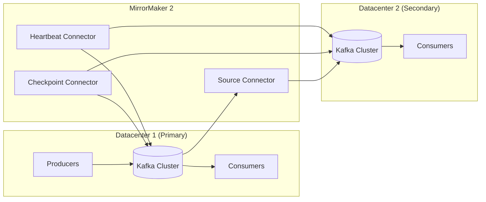
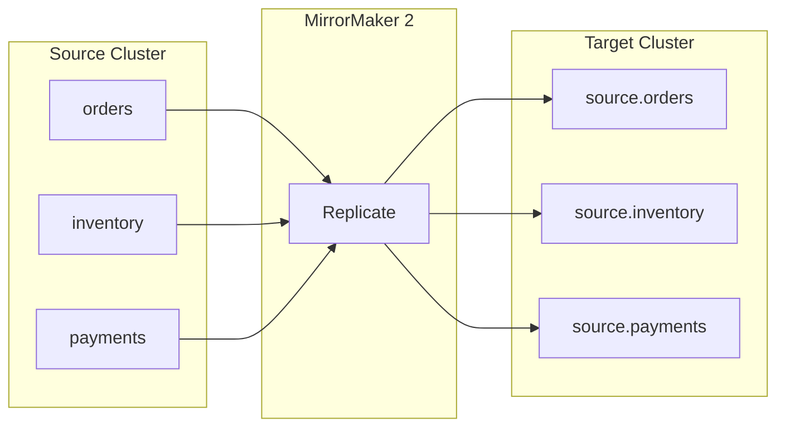
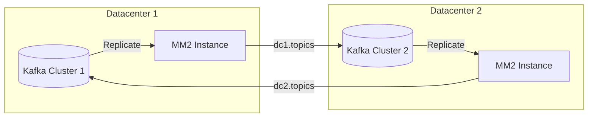
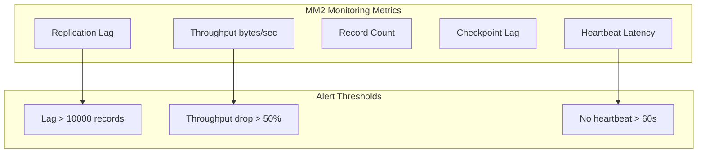
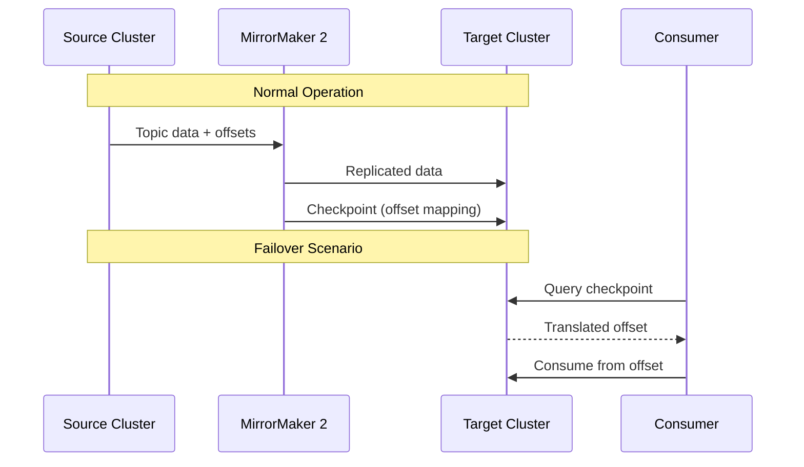
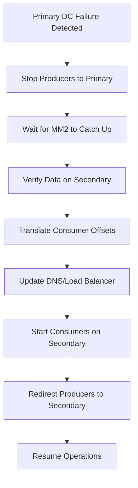

# How to Configure Kafka MirrorMaker for Cross-Datacenter Replication

Author: [nawazdhandala](https://www.github.com/nawazdhandala)

Tags: Kafka, MirrorMaker, Replication, Cross-Datacenter, Disaster Recovery, High Availability, MM2

Description: A comprehensive guide to setting up Kafka MirrorMaker 2 for cross-datacenter replication, including active-active configurations and disaster recovery strategies.

---

MirrorMaker 2 (MM2) is Kafka's built-in tool for replicating data between Kafka clusters across datacenters. It enables disaster recovery, geographic data distribution, and cluster migration. This guide covers MM2 architecture, configuration, and best practices for production deployments.

## Understanding MirrorMaker 2 Architecture

MirrorMaker 2 is built on Kafka Connect and provides several advantages over the legacy MirrorMaker:



## MM2 Components

MirrorMaker 2 consists of three connectors:

| Connector | Purpose |
|-----------|---------|
| MirrorSourceConnector | Replicates topic data from source to target |
| MirrorCheckpointConnector | Replicates consumer group offsets |
| MirrorHeartbeatConnector | Monitors replication health and latency |

## Installation and Setup

### Prerequisites

- Two Kafka clusters (source and target)
- Kafka 2.4+ with MM2 included
- Network connectivity between datacenters
- JDK 11 or later

### Directory Structure

```bash
# Create MM2 configuration directory
sudo mkdir -p /opt/kafka/config/mm2
sudo mkdir -p /var/log/mm2
sudo chown -R kafka:kafka /opt/kafka/config/mm2
sudo chown -R kafka:kafka /var/log/mm2
```

## Basic Configuration

Create the MM2 configuration file:

```bash
sudo nano /opt/kafka/config/mm2/mm2.properties
```

```properties
# MirrorMaker 2 Configuration

# Define cluster aliases
clusters = source, target

# Source cluster connection
source.bootstrap.servers = kafka-dc1-1:9092,kafka-dc1-2:9092,kafka-dc1-3:9092

# Target cluster connection
target.bootstrap.servers = kafka-dc2-1:9092,kafka-dc2-2:9092,kafka-dc2-3:9092

# Define replication flow: source -> target
source->target.enabled = true

# Topics to replicate (regex pattern)
source->target.topics = orders.*,inventory.*,payments.*

# Exclude internal topics
source->target.topics.exclude = .*\.internal,__.*

# Consumer group offset sync
source->target.groups = order-processor,inventory-service

# Replication factor for MM2 internal topics
replication.factor = 3

# Sync topic configurations
sync.topic.configs.enabled = true

# Sync topic ACLs
sync.topic.acls.enabled = true

# Checkpoints configuration
checkpoints.topic.replication.factor = 3
heartbeats.topic.replication.factor = 3
offset-syncs.topic.replication.factor = 3

# Refresh interval for topic discovery (ms)
refresh.topics.interval.seconds = 60

# Emit checkpoints every 60 seconds
emit.checkpoints.interval.seconds = 60

# Emit heartbeats every 5 seconds
emit.heartbeats.interval.seconds = 5

# Sync consumer group offsets every 60 seconds
sync.group.offsets.enabled = true
sync.group.offsets.interval.seconds = 60
```

## Start MirrorMaker 2

### Manual Start

```bash
# Start MM2 with dedicated mode
/opt/kafka/bin/connect-mirror-maker.sh /opt/kafka/config/mm2/mm2.properties

# Or run as background process
nohup /opt/kafka/bin/connect-mirror-maker.sh /opt/kafka/config/mm2/mm2.properties > /var/log/mm2/mm2.log 2>&1 &
```

### Systemd Service

```bash
sudo nano /etc/systemd/system/kafka-mm2.service
```

```ini
[Unit]
Description=Kafka MirrorMaker 2
Documentation=https://kafka.apache.org
Requires=network.target
After=network.target

[Service]
Type=simple
User=kafka
Group=kafka
Environment="JAVA_HOME=/usr/lib/jvm/java-11-openjdk-amd64"
Environment="KAFKA_HEAP_OPTS=-Xmx4G -Xms4G"
Environment="KAFKA_LOG4J_OPTS=-Dlog4j.configuration=file:/opt/kafka/config/mm2/log4j.properties"
ExecStart=/opt/kafka/bin/connect-mirror-maker.sh /opt/kafka/config/mm2/mm2.properties
ExecStop=/bin/kill -TERM $MAINPID
Restart=on-failure
RestartSec=10

[Install]
WantedBy=multi-user.target
```

```bash
# Start and enable service
sudo systemctl daemon-reload
sudo systemctl start kafka-mm2
sudo systemctl enable kafka-mm2

# Check status
sudo systemctl status kafka-mm2
```

## Topic Naming Convention

MM2 prefixes replicated topics with the source cluster name:



### Custom Topic Naming

Override the default naming:

```properties
# Use custom replication policy
replication.policy.class = org.apache.kafka.connect.mirror.IdentityReplicationPolicy

# Or implement custom policy
# replication.policy.class = com.company.CustomReplicationPolicy
```

Create a custom replication policy:

```java
package com.company;

import org.apache.kafka.connect.mirror.ReplicationPolicy;

public class CustomReplicationPolicy implements ReplicationPolicy {

    @Override
    public String formatRemoteTopic(String sourceClusterAlias, String topic) {
        // Keep original topic name (no prefix)
        return topic;
    }

    @Override
    public String topicSource(String topic) {
        return null; // Topic was not replicated
    }

    @Override
    public String upstreamTopic(String topic) {
        return topic;
    }

    @Override
    public boolean isMirrorTopic(String topic) {
        return false;
    }

    @Override
    public boolean isInternalTopic(String topic) {
        return topic.startsWith("__") ||
               topic.endsWith(".internal") ||
               topic.contains("heartbeat") ||
               topic.contains("checkpoint");
    }
}
```

## Active-Active Replication

For bidirectional replication between two active datacenters:



### Active-Active Configuration

```properties
# Cluster definitions
clusters = dc1, dc2

# DC1 cluster
dc1.bootstrap.servers = kafka-dc1-1:9092,kafka-dc1-2:9092,kafka-dc1-3:9092

# DC2 cluster
dc2.bootstrap.servers = kafka-dc2-1:9092,kafka-dc2-2:9092,kafka-dc2-3:9092

# Bidirectional replication
dc1->dc2.enabled = true
dc2->dc1.enabled = true

# Topics to replicate from DC1 to DC2
dc1->dc2.topics = orders-dc1.*,events-dc1.*

# Topics to replicate from DC2 to DC1
dc2->dc1.topics = orders-dc2.*,events-dc2.*

# Prevent replication loops - exclude already replicated topics
dc1->dc2.topics.exclude = dc2\..*
dc2->dc1.topics.exclude = dc1\..*

# Sync consumer groups in both directions
dc1->dc2.groups = .*
dc2->dc1.groups = .*

# Both directions sync offsets
dc1->dc2.sync.group.offsets.enabled = true
dc2->dc1.sync.group.offsets.enabled = true

# Replication settings
replication.factor = 3
```

## Secure Configuration

### SASL/SSL Configuration

```properties
# Source cluster security
source.security.protocol = SASL_SSL
source.sasl.mechanism = PLAIN
source.sasl.jaas.config = org.apache.kafka.common.security.plain.PlainLoginModule required \
    username="mm2-user" \
    password="mm2-password";
source.ssl.truststore.location = /opt/kafka/config/mm2/source-truststore.jks
source.ssl.truststore.password = truststore-password

# Target cluster security
target.security.protocol = SASL_SSL
target.sasl.mechanism = PLAIN
target.sasl.jaas.config = org.apache.kafka.common.security.plain.PlainLoginModule required \
    username="mm2-user" \
    password="mm2-password";
target.ssl.truststore.location = /opt/kafka/config/mm2/target-truststore.jks
target.ssl.truststore.password = truststore-password

# Producer security for replicating to target
source->target.producer.security.protocol = SASL_SSL
source->target.producer.sasl.mechanism = PLAIN
source->target.producer.sasl.jaas.config = org.apache.kafka.common.security.plain.PlainLoginModule required \
    username="mm2-producer" \
    password="producer-password";

# Consumer security for reading from source
source->target.consumer.security.protocol = SASL_SSL
source->target.consumer.sasl.mechanism = PLAIN
source->target.consumer.sasl.jaas.config = org.apache.kafka.common.security.plain.PlainLoginModule required \
    username="mm2-consumer" \
    password="consumer-password";
```

## Performance Tuning

### High-Throughput Configuration

```properties
# Increase number of tasks for parallel replication
tasks.max = 10

# Producer optimization
source->target.producer.batch.size = 524288
source->target.producer.linger.ms = 100
source->target.producer.buffer.memory = 67108864
source->target.producer.compression.type = lz4
source->target.producer.acks = all
source->target.producer.max.in.flight.requests.per.connection = 5

# Consumer optimization
source->target.consumer.fetch.min.bytes = 1048576
source->target.consumer.fetch.max.wait.ms = 500
source->target.consumer.max.poll.records = 5000
source->target.consumer.auto.offset.reset = earliest

# Offset commit interval
offset.flush.interval.ms = 30000

# Admin client timeouts
source->target.admin.request.timeout.ms = 60000
source->target.admin.default.api.timeout.ms = 120000
```

### Network Optimization

```properties
# Increase socket buffers for WAN replication
source->target.producer.send.buffer.bytes = 1048576
source->target.producer.receive.buffer.bytes = 1048576
source->target.consumer.send.buffer.bytes = 1048576
source->target.consumer.receive.buffer.bytes = 1048576

# Retry configuration for network issues
source->target.producer.retries = 2147483647
source->target.producer.retry.backoff.ms = 500
source->target.producer.delivery.timeout.ms = 300000

# Request timeout
source->target.producer.request.timeout.ms = 60000
```

## Monitoring MirrorMaker 2

### Key Metrics



### JMX Metrics

```bash
# Enable JMX for MM2
export KAFKA_JMX_OPTS="-Dcom.sun.management.jmxremote \
  -Dcom.sun.management.jmxremote.port=9999 \
  -Dcom.sun.management.jmxremote.authenticate=false \
  -Dcom.sun.management.jmxremote.ssl=false"
```

Key JMX metrics to monitor:

| Metric | Description |
|--------|-------------|
| `kafka.connect.mirror:type=MirrorSourceConnector,*` | Source connector metrics |
| `kafka.connect:type=source-task-metrics,*` | Task-level metrics |
| `replication-latency-ms-avg` | Average replication latency |
| `record-count` | Number of records replicated |
| `byte-count` | Bytes replicated |

### Prometheus Monitoring

```yaml
# prometheus.yml scrape config
scrape_configs:
  - job_name: 'kafka-mm2'
    static_configs:
      - targets: ['mm2-host:9999']
    metrics_path: /metrics
```

### CLI Monitoring Commands

```bash
# Check MM2 internal topics
/opt/kafka/bin/kafka-topics.sh --bootstrap-server target:9092 --list | grep mm2

# Check heartbeats topic
/opt/kafka/bin/kafka-console-consumer.sh \
  --bootstrap-server target:9092 \
  --topic heartbeats \
  --from-beginning \
  --max-messages 5

# Check checkpoints topic
/opt/kafka/bin/kafka-console-consumer.sh \
  --bootstrap-server target:9092 \
  --topic source.checkpoints.internal \
  --from-beginning \
  --max-messages 5

# Verify replicated topics
/opt/kafka/bin/kafka-topics.sh --bootstrap-server target:9092 --list | grep "source\."

# Check consumer group offsets on target
/opt/kafka/bin/kafka-consumer-groups.sh \
  --bootstrap-server target:9092 \
  --describe --group order-processor
```

## Consumer Offset Translation

MM2 automatically translates consumer offsets between clusters:



### Offset Translation API

```java
import org.apache.kafka.connect.mirror.RemoteClusterUtils;
import java.util.*;

public class OffsetTranslator {

    /**
     * Translate consumer group offsets from source to target cluster.
     */
    public Map<TopicPartition, OffsetAndMetadata> translateOffsets(
            String consumerGroup,
            String sourceCluster,
            Properties targetConfig) throws Exception {

        // Get translated offsets using MM2's checkpoint data
        Map<TopicPartition, OffsetAndMetadata> translatedOffsets =
            RemoteClusterUtils.translateOffsets(
                targetConfig,
                sourceCluster,
                consumerGroup,
                Duration.ofSeconds(30)
            );

        System.out.printf("Translated offsets for group %s: %s%n",
            consumerGroup, translatedOffsets);

        return translatedOffsets;
    }

    /**
     * Get replication lag between clusters.
     */
    public long getReplicationLag(String sourceCluster, Properties targetConfig)
            throws Exception {

        long lag = RemoteClusterUtils.replicationLag(
            targetConfig,
            sourceCluster,
            Duration.ofSeconds(30)
        );

        System.out.printf("Replication lag from %s: %d ms%n", sourceCluster, lag);
        return lag;
    }
}
```

## Disaster Recovery Procedures

### Failover Process



### Automated Failover Script

```bash
#!/bin/bash
# failover.sh - Automated MM2 failover script

SOURCE_BOOTSTRAP="kafka-dc1-1:9092"
TARGET_BOOTSTRAP="kafka-dc2-1:9092"
CONSUMER_GROUP="order-processor"

# Function to check if source is healthy
check_source_health() {
    /opt/kafka/bin/kafka-broker-api-versions.sh \
        --bootstrap-server $SOURCE_BOOTSTRAP \
        --timeout 5000 > /dev/null 2>&1
    return $?
}

# Function to get replication lag
get_replication_lag() {
    /opt/kafka/bin/kafka-consumer-groups.sh \
        --bootstrap-server $TARGET_BOOTSTRAP \
        --describe --group mm2-source-connector \
        2>/dev/null | awk '{sum += $6} END {print sum}'
}

# Function to translate offsets
translate_offsets() {
    echo "Translating consumer group offsets..."
    # Use MM2's checkpoint data for offset translation
    /opt/kafka/bin/kafka-consumer-groups.sh \
        --bootstrap-server $TARGET_BOOTSTRAP \
        --describe --group $CONSUMER_GROUP
}

# Main failover logic
main() {
    echo "Starting failover procedure..."

    # Check if source is actually down
    if check_source_health; then
        echo "WARNING: Source cluster appears healthy. Confirm failover? (y/n)"
        read -r confirm
        if [ "$confirm" != "y" ]; then
            echo "Failover cancelled."
            exit 0
        fi
    fi

    # Wait for replication to catch up
    echo "Waiting for replication lag to clear..."
    while true; do
        lag=$(get_replication_lag)
        if [ "$lag" -lt 100 ]; then
            echo "Replication lag is acceptable: $lag"
            break
        fi
        echo "Current lag: $lag - waiting..."
        sleep 5
    done

    # Translate offsets
    translate_offsets

    echo "Failover preparation complete."
    echo "Manual steps required:"
    echo "1. Update DNS to point to target cluster"
    echo "2. Restart consumers with target bootstrap servers"
    echo "3. Redirect producers to target cluster"
}

main
```

### Failback Procedure

```bash
#!/bin/bash
# failback.sh - Return to primary datacenter

# 1. Ensure primary is healthy
echo "Checking primary cluster health..."

# 2. Start MM2 in reverse direction (target -> source)
echo "Starting reverse replication..."

# 3. Wait for sync
echo "Waiting for data synchronization..."

# 4. Stop writes to secondary
echo "Stopping writes to secondary..."

# 5. Final sync check
echo "Verifying final sync..."

# 6. Failback to primary
echo "Failing back to primary..."
```

## Multi-Region Configuration

For replicating to multiple datacenters:

```properties
# Define all clusters
clusters = primary, region-us, region-eu, region-asia

# Primary cluster (source)
primary.bootstrap.servers = kafka-primary-1:9092,kafka-primary-2:9092

# Regional clusters (targets)
region-us.bootstrap.servers = kafka-us-1:9092,kafka-us-2:9092
region-eu.bootstrap.servers = kafka-eu-1:9092,kafka-eu-2:9092
region-asia.bootstrap.servers = kafka-asia-1:9092,kafka-asia-2:9092

# Replicate from primary to all regions
primary->region-us.enabled = true
primary->region-eu.enabled = true
primary->region-asia.enabled = true

# Topics for each region
primary->region-us.topics = global.*,us-specific.*
primary->region-eu.topics = global.*,eu-specific.*
primary->region-asia.topics = global.*,asia-specific.*

# Regional specific settings
primary->region-eu.producer.compression.type = gzip
primary->region-asia.producer.compression.type = gzip

# Higher task count for high-latency regions
primary->region-asia.tasks.max = 20
```

## Troubleshooting

### Common Issues

```bash
# Issue: Topics not being replicated
# Check topic regex pattern
/opt/kafka/bin/kafka-topics.sh --bootstrap-server source:9092 --list | grep -E "orders.*"

# Issue: Consumer offsets not syncing
# Verify checkpoint connector is running
curl -s http://localhost:8083/connectors/MirrorCheckpointConnector/status | jq

# Issue: High replication lag
# Check network latency
ping -c 5 target-broker

# Check producer backlog
/opt/kafka/bin/kafka-consumer-groups.sh \
  --bootstrap-server target:9092 \
  --describe --group mm2-MirrorSourceConnector

# Issue: MM2 not starting
# Check logs
journalctl -u kafka-mm2 -f

# Verify configuration
/opt/kafka/bin/connect-mirror-maker.sh --help
```

### Validation Commands

```bash
# Verify topics are replicated
echo "Source topics:"
/opt/kafka/bin/kafka-topics.sh --bootstrap-server source:9092 --list | grep orders

echo "Target topics (should have source. prefix):"
/opt/kafka/bin/kafka-topics.sh --bootstrap-server target:9092 --list | grep "source.orders"

# Compare message counts
echo "Source message count:"
/opt/kafka/bin/kafka-run-class.sh kafka.tools.GetOffsetShell \
  --broker-list source:9092 --topic orders

echo "Target message count:"
/opt/kafka/bin/kafka-run-class.sh kafka.tools.GetOffsetShell \
  --broker-list target:9092 --topic source.orders
```

---

MirrorMaker 2 provides robust cross-datacenter replication for Kafka with automatic offset translation, heartbeat monitoring, and topic configuration synchronization. For production deployments, ensure proper monitoring, test failover procedures regularly, and tune performance settings based on your network characteristics and throughput requirements.
