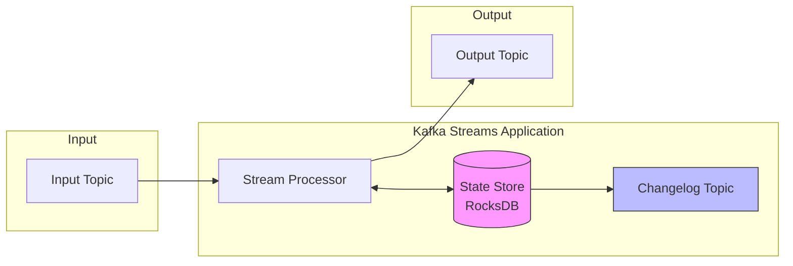
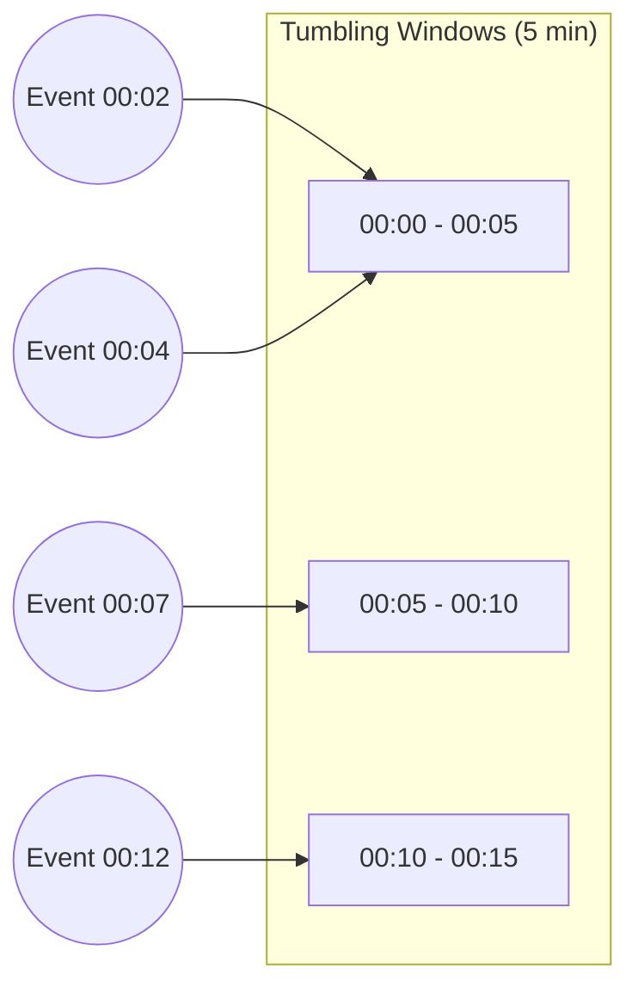

# How to Configure Kafka Streams for Stateful Processing

Author: [nawazdhandala](https://www.github.com/nawazdhandala)

Tags: Kafka, Kafka Streams, Stream Processing, Stateful Processing, Java, RocksDB, State Store, Real-time Analytics

Description: A practical guide to configuring Kafka Streams for stateful processing, including state store setup, fault tolerance, performance tuning, and best practices for production deployments.

---

> Kafka Streams is a powerful library for building real-time streaming applications that process and transform data stored in Apache Kafka. While stateless operations like filtering and mapping are straightforward, stateful operations such as aggregations, joins, and windowed computations require careful configuration to ensure correctness, performance, and fault tolerance.

This guide covers everything you need to know to configure Kafka Streams for stateful processing in production environments.

---

## Understanding Stateful Processing



Stateful operations in Kafka Streams include:
- **Aggregations**: `count()`, `reduce()`, `aggregate()`
- **Joins**: `join()`, `leftJoin()`, `outerJoin()`
- **Windowed Operations**: tumbling, hopping, sliding, and session windows
- **Custom State Stores**: for complex processing logic

---

## Basic Stateful Configuration

```java
import org.apache.kafka.common.serialization.Serdes;
import org.apache.kafka.streams.KafkaStreams;
import org.apache.kafka.streams.StreamsBuilder;
import org.apache.kafka.streams.StreamsConfig;
import org.apache.kafka.streams.kstream.KStream;
import org.apache.kafka.streams.kstream.KTable;
import org.apache.kafka.streams.kstream.Materialized;
import org.apache.kafka.streams.kstream.Produced;

import java.util.Properties;

public class StatefulStreamProcessor {

    public static Properties createConfig() {
        Properties props = new Properties();

        // Required configuration
        props.put(StreamsConfig.APPLICATION_ID_CONFIG, "stateful-processor");
        props.put(StreamsConfig.BOOTSTRAP_SERVERS_CONFIG,
                  "kafka1:9092,kafka2:9092,kafka3:9092");

        // Default serializers/deserializers
        props.put(StreamsConfig.DEFAULT_KEY_SERDE_CLASS_CONFIG,
                  Serdes.String().getClass());
        props.put(StreamsConfig.DEFAULT_VALUE_SERDE_CLASS_CONFIG,
                  Serdes.String().getClass());

        // CRITICAL: State directory for RocksDB
        props.put(StreamsConfig.STATE_DIR_CONFIG, "/var/kafka-streams/state");

        // Processing guarantee (exactly_once_v2 recommended for stateful apps)
        props.put(StreamsConfig.PROCESSING_GUARANTEE_CONFIG,
                  StreamsConfig.EXACTLY_ONCE_V2);

        // Commit interval for state stores
        props.put(StreamsConfig.COMMIT_INTERVAL_MS_CONFIG, 100);

        // Number of stream threads (parallelism)
        props.put(StreamsConfig.NUM_STREAM_THREADS_CONFIG, 4);

        // Replication factor for internal topics
        props.put(StreamsConfig.REPLICATION_FACTOR_CONFIG, 3);

        return props;
    }

    public static void main(String[] args) {
        Properties config = createConfig();
        StreamsBuilder builder = new StreamsBuilder();

        // Create a stream from input topic
        KStream<String, String> inputStream = builder.stream("input-events");

        // Stateful aggregation: count events by key
        KTable<String, Long> eventCounts = inputStream
            .groupByKey()
            .count(Materialized.as("event-counts-store"));

        // Write results to output topic
        eventCounts.toStream()
            .to("event-counts", Produced.with(Serdes.String(), Serdes.Long()));

        // Build and start the application
        KafkaStreams streams = new KafkaStreams(builder.build(), config);
        Runtime.getRuntime().addShutdownHook(new Thread(streams::close));
        streams.start();
    }
}
```

---

## Windowed Aggregations



```java
import org.apache.kafka.streams.kstream.TimeWindows;
import org.apache.kafka.streams.kstream.Windowed;

import java.time.Duration;

// Tumbling window: fixed-size, non-overlapping windows
KTable<Windowed<String>, Long> windowedCounts = stream
    .groupByKey()
    .windowedBy(TimeWindows.ofSizeWithNoGrace(Duration.ofMinutes(5)))
    .count(Materialized.as("windowed-counts"));
```

---

## Fault Tolerance Configuration

```java
// Configure changelog topic settings
Properties props = new Properties();

// Number of replicas for changelog topics
props.put(StreamsConfig.REPLICATION_FACTOR_CONFIG, 3);

// Configure standby replicas for faster failover
props.put(StreamsConfig.NUM_STANDBY_REPLICAS_CONFIG, 1);
```

---

## Best Practices Summary

1. **Use exactly-once semantics** for stateful processing to prevent duplicates
2. **Configure standby replicas** for faster failover and recovery
3. **Size state directories appropriately** for RocksDB storage needs
4. **Tune RocksDB** based on your workload characteristics
5. **Monitor state store sizes** and processing lag
6. **Set appropriate retention** for windowed state stores

---

## Conclusion

Configuring Kafka Streams for stateful processing requires careful attention to state store configuration, fault tolerance settings, and performance tuning. With proper configuration, Kafka Streams provides a robust platform for building real-time streaming applications.

---

*Need to monitor your Kafka Streams applications? [OneUptime](https://oneuptime.com) provides comprehensive monitoring for streaming applications, including processing lag, state store metrics, and application health tracking.*
