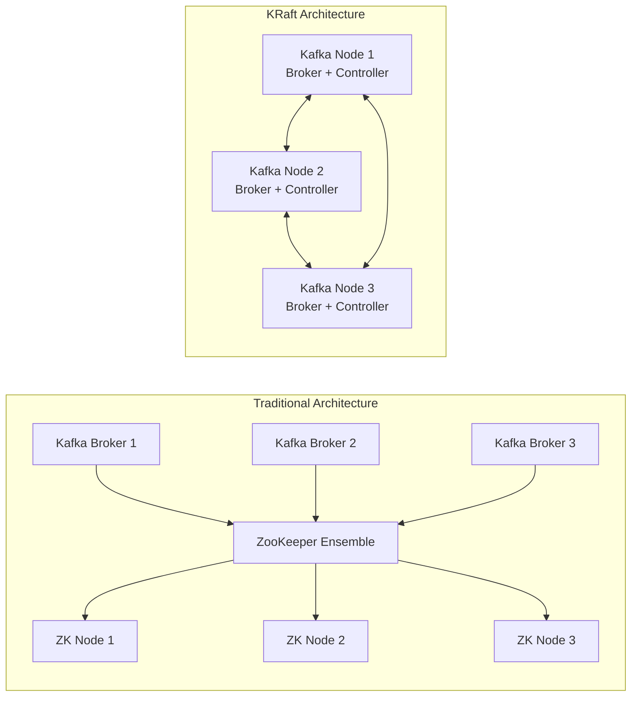
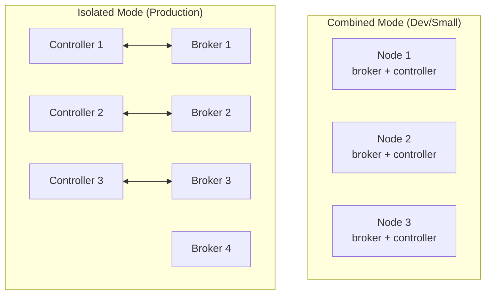
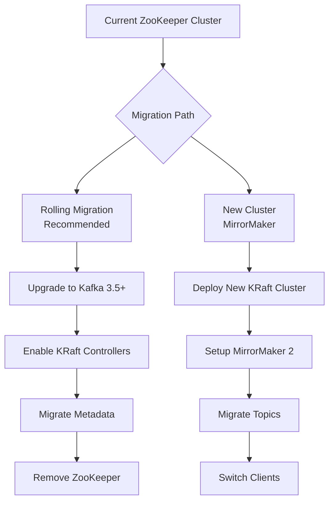

# How to Configure KRaft Mode Without ZooKeeper

Author: [nawazdhandala](https://www.github.com/nawazdhandala)

Tags: Apache Kafka, KRaft, ZooKeeper, Distributed Systems, Message Queue, DevOps, Configuration

Description: A comprehensive guide to configuring Apache Kafka in KRaft mode, eliminating the need for ZooKeeper and simplifying cluster management.

---

KRaft (Kafka Raft) mode is Kafka's native consensus protocol that removes the dependency on ZooKeeper. This simplifies operations, reduces infrastructure complexity, and improves scalability. Since Kafka 3.3, KRaft is production-ready and is the recommended deployment mode for new clusters.

## Why KRaft Mode?



### Benefits of KRaft

| Feature | ZooKeeper Mode | KRaft Mode |
|---------|---------------|------------|
| Components | Kafka + ZooKeeper | Kafka only |
| Metadata storage | External (ZK) | Internal (Kafka logs) |
| Partition limit | ~200,000 | Millions |
| Recovery time | Minutes | Seconds |
| Operational complexity | High | Low |

## Prerequisites

Before configuring KRaft mode, ensure you have:

- Kafka 3.3 or later (3.6+ recommended for production)
- Java 11 or later
- Sufficient disk space for metadata logs

```bash
# Check Kafka version
kafka-broker-api-versions.sh --version

# Verify Java version
java -version
```

## Cluster Architecture Options

KRaft supports three deployment patterns:



## Step 1: Generate a Cluster ID

Every KRaft cluster needs a unique cluster ID. Generate one using the provided utility:

```bash
# Generate a new cluster UUID
# This ID must be the same across all nodes in the cluster
KAFKA_CLUSTER_ID=$(kafka-storage.sh random-uuid)
echo "Cluster ID: $KAFKA_CLUSTER_ID"

# Example output: MkU3OEVBNTcwNTJENDM2Qk
```

Save this ID securely. You will need it when formatting storage on each node.

## Step 2: Configure Server Properties

### Combined Mode Configuration (Development)

In combined mode, each node runs both broker and controller processes. This is suitable for development and small clusters.

Create `server.properties` for each node:

```properties
# /etc/kafka/server.properties

# Unique node identifier within the cluster
# Must be unique for each node (0, 1, 2, etc.)
node.id=0

# Process roles: broker, controller, or both
# Combined mode runs both on the same node
process.roles=broker,controller

# Controller quorum voters: node_id@host:controller_port
# List all controller nodes in the cluster
controller.quorum.voters=0@kafka-0:9093,1@kafka-1:9093,2@kafka-2:9093

# Listener configuration
# PLAINTEXT for client connections, CONTROLLER for internal consensus
listeners=PLAINTEXT://:9092,CONTROLLER://:9093
inter.broker.listener.name=PLAINTEXT
controller.listener.names=CONTROLLER

# Advertised listeners for client connections
# Replace with actual hostnames or IPs
advertised.listeners=PLAINTEXT://kafka-0:9092

# Listener security protocol mapping
listener.security.protocol.map=CONTROLLER:PLAINTEXT,PLAINTEXT:PLAINTEXT

# Log directories for data storage
# Separate directories recommended for performance
log.dirs=/var/lib/kafka/data

# Number of partitions for auto-created topics
num.partitions=3

# Replication factor for internal topics
# Should match number of brokers for fault tolerance
offsets.topic.replication.factor=3
transaction.state.log.replication.factor=3
transaction.state.log.min.isr=2

# Default replication for user topics
default.replication.factor=3
min.insync.replicas=2

# Log retention settings
log.retention.hours=168
log.segment.bytes=1073741824
log.retention.check.interval.ms=300000
```

### Isolated Mode Configuration (Production)

For production deployments, separate controller and broker roles for better isolation and scalability.

**Controller Node Configuration** (`controller.properties`):

```properties
# /etc/kafka/controller.properties

# Controller-specific configuration
node.id=100
process.roles=controller

# Controller quorum - only controller nodes participate
controller.quorum.voters=100@controller-0:9093,101@controller-1:9093,102@controller-2:9093

# Controller listener only
listeners=CONTROLLER://:9093
controller.listener.names=CONTROLLER
listener.security.protocol.map=CONTROLLER:PLAINTEXT

# Metadata log directory
log.dirs=/var/lib/kafka/metadata

# Controller-specific settings
# Metadata snapshot interval (in records)
metadata.log.max.record.bytes.between.snapshots=10485760

# Metadata log retention
metadata.log.segment.bytes=1073741824
metadata.max.retention.bytes=104857600
```

**Broker Node Configuration** (`broker.properties`):

```properties
# /etc/kafka/broker.properties

# Broker-specific configuration
node.id=0
process.roles=broker

# Controller quorum voters - point to controller nodes
controller.quorum.voters=100@controller-0:9093,101@controller-1:9093,102@controller-2:9093

# Broker listeners
listeners=PLAINTEXT://:9092
inter.broker.listener.name=PLAINTEXT
controller.listener.names=CONTROLLER
listener.security.protocol.map=CONTROLLER:PLAINTEXT,PLAINTEXT:PLAINTEXT

# Advertised listener for clients
advertised.listeners=PLAINTEXT://broker-0:9092

# Data directory for topic logs
log.dirs=/var/lib/kafka/data

# Replication settings
num.partitions=3
default.replication.factor=3
min.insync.replicas=2
offsets.topic.replication.factor=3
transaction.state.log.replication.factor=3
transaction.state.log.min.isr=2

# Performance tuning
num.network.threads=8
num.io.threads=16
socket.send.buffer.bytes=102400
socket.receive.buffer.bytes=102400
socket.request.max.bytes=104857600

# Log retention
log.retention.hours=168
log.segment.bytes=1073741824
```

## Step 3: Format Storage Directories

Before starting Kafka, format the storage directories with the cluster ID:

```bash
# Format storage on each node
# Use the same cluster ID generated in Step 1
kafka-storage.sh format \
    --config /etc/kafka/server.properties \
    --cluster-id $KAFKA_CLUSTER_ID

# Expected output:
# Formatting /var/lib/kafka/data with metadata.version 3.6-IV2
```

For a multi-node cluster, run this on every node before starting any Kafka process:

```bash
# On controller-0
kafka-storage.sh format \
    --config /etc/kafka/controller.properties \
    --cluster-id MkU3OEVBNTcwNTJENDM2Qk

# On broker-0
kafka-storage.sh format \
    --config /etc/kafka/broker.properties \
    --cluster-id MkU3OEVBNTcwNTJENDM2Qk
```

## Step 4: Start the Cluster

Start nodes in order, beginning with controllers (in isolated mode) or any node (in combined mode):

```bash
# Start Kafka with KRaft configuration
kafka-server-start.sh /etc/kafka/server.properties

# Or as a background service
kafka-server-start.sh -daemon /etc/kafka/server.properties
```

For systemd service management, create a unit file:

```ini
# /etc/systemd/system/kafka.service
[Unit]
Description=Apache Kafka Server (KRaft Mode)
Documentation=http://kafka.apache.org/documentation.html
Requires=network.target
After=network.target

[Service]
Type=simple
User=kafka
Group=kafka
Environment="KAFKA_HEAP_OPTS=-Xmx4G -Xms4G"
Environment="KAFKA_JVM_PERFORMANCE_OPTS=-server -XX:+UseG1GC -XX:MaxGCPauseMillis=20"
ExecStart=/opt/kafka/bin/kafka-server-start.sh /etc/kafka/server.properties
ExecStop=/opt/kafka/bin/kafka-server-stop.sh
Restart=on-failure
RestartSec=10

[Install]
WantedBy=multi-user.target
```

## Step 5: Verify Cluster Health

After starting all nodes, verify the cluster is healthy:

```bash
# Check cluster metadata
kafka-metadata.sh --snapshot /var/lib/kafka/data/__cluster_metadata-0/00000000000000000000.log --command "cat"

# List brokers in the cluster
kafka-broker-api-versions.sh --bootstrap-server localhost:9092

# Describe cluster metadata
kafka-metadata.sh --snapshot /var/lib/kafka/data/__cluster_metadata-0/*.log \
    --command "node list"

# Check controller quorum status
kafka-metadata.sh --snapshot /var/lib/kafka/data/__cluster_metadata-0/*.log \
    --command "quorum describe"
```

Create a test topic to verify functionality:

```bash
# Create a test topic with replication
kafka-topics.sh --bootstrap-server localhost:9092 \
    --create \
    --topic test-kraft \
    --partitions 3 \
    --replication-factor 3

# Describe the topic
kafka-topics.sh --bootstrap-server localhost:9092 \
    --describe \
    --topic test-kraft

# Produce test messages
echo "Hello KRaft" | kafka-console-producer.sh \
    --bootstrap-server localhost:9092 \
    --topic test-kraft

# Consume test messages
kafka-console-consumer.sh \
    --bootstrap-server localhost:9092 \
    --topic test-kraft \
    --from-beginning
```

## Docker Deployment

For containerized deployments, use this Docker Compose configuration:

```yaml
# docker-compose.yml
version: '3.8'

services:
  kafka-0:
    image: confluentinc/cp-kafka:7.5.0
    hostname: kafka-0
    container_name: kafka-0
    ports:
      - "9092:9092"
    environment:
      # KRaft configuration
      KAFKA_NODE_ID: 0
      KAFKA_PROCESS_ROLES: broker,controller
      KAFKA_CONTROLLER_QUORUM_VOTERS: 0@kafka-0:9093,1@kafka-1:9093,2@kafka-2:9093
      CLUSTER_ID: MkU3OEVBNTcwNTJENDM2Qk

      # Listener configuration
      KAFKA_LISTENERS: PLAINTEXT://:9092,CONTROLLER://:9093,EXTERNAL://:9094
      KAFKA_ADVERTISED_LISTENERS: PLAINTEXT://kafka-0:9092,EXTERNAL://localhost:9092
      KAFKA_LISTENER_SECURITY_PROTOCOL_MAP: CONTROLLER:PLAINTEXT,PLAINTEXT:PLAINTEXT,EXTERNAL:PLAINTEXT
      KAFKA_CONTROLLER_LISTENER_NAMES: CONTROLLER
      KAFKA_INTER_BROKER_LISTENER_NAME: PLAINTEXT

      # Replication settings
      KAFKA_OFFSETS_TOPIC_REPLICATION_FACTOR: 3
      KAFKA_TRANSACTION_STATE_LOG_REPLICATION_FACTOR: 3
      KAFKA_TRANSACTION_STATE_LOG_MIN_ISR: 2
      KAFKA_DEFAULT_REPLICATION_FACTOR: 3
      KAFKA_MIN_INSYNC_REPLICAS: 2

      # Log retention
      KAFKA_LOG_RETENTION_HOURS: 168
    volumes:
      - kafka-0-data:/var/lib/kafka/data
    networks:
      - kafka-network

  kafka-1:
    image: confluentinc/cp-kafka:7.5.0
    hostname: kafka-1
    container_name: kafka-1
    ports:
      - "9093:9092"
    environment:
      KAFKA_NODE_ID: 1
      KAFKA_PROCESS_ROLES: broker,controller
      KAFKA_CONTROLLER_QUORUM_VOTERS: 0@kafka-0:9093,1@kafka-1:9093,2@kafka-2:9093
      CLUSTER_ID: MkU3OEVBNTcwNTJENDM2Qk
      KAFKA_LISTENERS: PLAINTEXT://:9092,CONTROLLER://:9093,EXTERNAL://:9094
      KAFKA_ADVERTISED_LISTENERS: PLAINTEXT://kafka-1:9092,EXTERNAL://localhost:9093
      KAFKA_LISTENER_SECURITY_PROTOCOL_MAP: CONTROLLER:PLAINTEXT,PLAINTEXT:PLAINTEXT,EXTERNAL:PLAINTEXT
      KAFKA_CONTROLLER_LISTENER_NAMES: CONTROLLER
      KAFKA_INTER_BROKER_LISTENER_NAME: PLAINTEXT
      KAFKA_OFFSETS_TOPIC_REPLICATION_FACTOR: 3
      KAFKA_TRANSACTION_STATE_LOG_REPLICATION_FACTOR: 3
      KAFKA_TRANSACTION_STATE_LOG_MIN_ISR: 2
      KAFKA_DEFAULT_REPLICATION_FACTOR: 3
      KAFKA_MIN_INSYNC_REPLICAS: 2
      KAFKA_LOG_RETENTION_HOURS: 168
    volumes:
      - kafka-1-data:/var/lib/kafka/data
    networks:
      - kafka-network

  kafka-2:
    image: confluentinc/cp-kafka:7.5.0
    hostname: kafka-2
    container_name: kafka-2
    ports:
      - "9094:9092"
    environment:
      KAFKA_NODE_ID: 2
      KAFKA_PROCESS_ROLES: broker,controller
      KAFKA_CONTROLLER_QUORUM_VOTERS: 0@kafka-0:9093,1@kafka-1:9093,2@kafka-2:9093
      CLUSTER_ID: MkU3OEVBNTcwNTJENDM2Qk
      KAFKA_LISTENERS: PLAINTEXT://:9092,CONTROLLER://:9093,EXTERNAL://:9094
      KAFKA_ADVERTISED_LISTENERS: PLAINTEXT://kafka-2:9092,EXTERNAL://localhost:9094
      KAFKA_LISTENER_SECURITY_PROTOCOL_MAP: CONTROLLER:PLAINTEXT,PLAINTEXT:PLAINTEXT,EXTERNAL:PLAINTEXT
      KAFKA_CONTROLLER_LISTENER_NAMES: CONTROLLER
      KAFKA_INTER_BROKER_LISTENER_NAME: PLAINTEXT
      KAFKA_OFFSETS_TOPIC_REPLICATION_FACTOR: 3
      KAFKA_TRANSACTION_STATE_LOG_REPLICATION_FACTOR: 3
      KAFKA_TRANSACTION_STATE_LOG_MIN_ISR: 2
      KAFKA_DEFAULT_REPLICATION_FACTOR: 3
      KAFKA_MIN_INSYNC_REPLICAS: 2
      KAFKA_LOG_RETENTION_HOURS: 168
    volumes:
      - kafka-2-data:/var/lib/kafka/data
    networks:
      - kafka-network

volumes:
  kafka-0-data:
  kafka-1-data:
  kafka-2-data:

networks:
  kafka-network:
    driver: bridge
```

## Kubernetes Deployment

For Kubernetes deployments, use a StatefulSet:

```yaml
# kafka-kraft-statefulset.yaml
apiVersion: v1
kind: Service
metadata:
  name: kafka-headless
  labels:
    app: kafka
spec:
  ports:
    - port: 9092
      name: broker
    - port: 9093
      name: controller
  clusterIP: None
  selector:
    app: kafka
---
apiVersion: apps/v1
kind: StatefulSet
metadata:
  name: kafka
spec:
  serviceName: kafka-headless
  replicas: 3
  selector:
    matchLabels:
      app: kafka
  template:
    metadata:
      labels:
        app: kafka
    spec:
      containers:
        - name: kafka
          image: confluentinc/cp-kafka:7.5.0
          ports:
            - containerPort: 9092
              name: broker
            - containerPort: 9093
              name: controller
          env:
            # KRaft mode settings
            - name: KAFKA_PROCESS_ROLES
              value: "broker,controller"
            - name: KAFKA_CONTROLLER_LISTENER_NAMES
              value: "CONTROLLER"
            - name: KAFKA_LISTENER_SECURITY_PROTOCOL_MAP
              value: "CONTROLLER:PLAINTEXT,PLAINTEXT:PLAINTEXT"
            - name: KAFKA_INTER_BROKER_LISTENER_NAME
              value: "PLAINTEXT"
            - name: CLUSTER_ID
              value: "MkU3OEVBNTcwNTJENDM2Qk"
            # Replication
            - name: KAFKA_OFFSETS_TOPIC_REPLICATION_FACTOR
              value: "3"
            - name: KAFKA_TRANSACTION_STATE_LOG_REPLICATION_FACTOR
              value: "3"
            - name: KAFKA_TRANSACTION_STATE_LOG_MIN_ISR
              value: "2"
          command:
            - /bin/bash
            - -c
            - |
              # Extract node ID from pod ordinal
              export KAFKA_NODE_ID=${HOSTNAME##*-}
              # Configure controller voters
              export KAFKA_CONTROLLER_QUORUM_VOTERS="0@kafka-0.kafka-headless:9093,1@kafka-1.kafka-headless:9093,2@kafka-2.kafka-headless:9093"
              # Configure listeners
              export KAFKA_LISTENERS="PLAINTEXT://:9092,CONTROLLER://:9093"
              export KAFKA_ADVERTISED_LISTENERS="PLAINTEXT://${HOSTNAME}.kafka-headless:9092"
              # Start Kafka
              /etc/confluent/docker/run
          volumeMounts:
            - name: kafka-data
              mountPath: /var/lib/kafka/data
          resources:
            requests:
              cpu: 500m
              memory: 2Gi
            limits:
              cpu: 2
              memory: 4Gi
          livenessProbe:
            tcpSocket:
              port: 9092
            initialDelaySeconds: 60
            periodSeconds: 10
          readinessProbe:
            tcpSocket:
              port: 9092
            initialDelaySeconds: 30
            periodSeconds: 5
  volumeClaimTemplates:
    - metadata:
        name: kafka-data
      spec:
        accessModes: ["ReadWriteOnce"]
        storageClassName: fast-ssd
        resources:
          requests:
            storage: 100Gi
```

## Migration from ZooKeeper Mode



For existing ZooKeeper-based clusters, Kafka provides a migration tool:

```bash
# Step 1: Deploy KRaft controllers alongside existing cluster
# Configure controllers to connect to ZooKeeper for migration

# Step 2: Run the migration tool
kafka-metadata-migration.sh \
    --bootstrap-server localhost:9092 \
    --controller-quorum-voters 100@controller-0:9093,101@controller-1:9093,102@controller-2:9093 \
    --zookeeper-connect localhost:2181

# Step 3: Verify migration status
kafka-metadata-migration.sh --status

# Step 4: Complete migration (removes ZooKeeper dependency)
kafka-metadata-migration.sh --finalize
```

## Troubleshooting Common Issues

### Issue: Controller Not Electing Leader

```bash
# Check controller logs for quorum issues
grep -i "quorum\|leader\|vote" /var/log/kafka/controller.log

# Verify all controllers can communicate
for i in 0 1 2; do
  nc -zv controller-$i 9093
done

# Check metadata directory permissions
ls -la /var/lib/kafka/metadata/
```

### Issue: Broker Cannot Connect to Controller

```bash
# Verify controller quorum voters configuration matches
grep controller.quorum.voters /etc/kafka/broker.properties

# Test connectivity from broker to controllers
kafka-broker-api-versions.sh --bootstrap-server controller-0:9093
```

### Issue: Cluster ID Mismatch

```bash
# Check cluster ID in metadata
cat /var/lib/kafka/data/meta.properties

# If mismatch, reformat storage (WARNING: deletes all data)
rm -rf /var/lib/kafka/data/*
kafka-storage.sh format --config /etc/kafka/server.properties --cluster-id $CORRECT_CLUSTER_ID
```

## Best Practices

1. **Use odd number of controllers** - 3 or 5 controllers for proper quorum
2. **Separate controller and broker roles in production** - Better isolation and scalability
3. **Use dedicated disks for metadata** - Controllers benefit from low-latency storage
4. **Monitor controller metrics** - Track quorum health and metadata operations
5. **Plan for rolling upgrades** - KRaft supports zero-downtime upgrades
6. **Backup cluster metadata** - Regular snapshots of the metadata log
7. **Test failover scenarios** - Regularly verify controller leader election works

---

KRaft mode simplifies Kafka operations by eliminating ZooKeeper while providing faster metadata operations and higher partition limits. For new deployments, KRaft is the recommended approach. For existing clusters, plan a careful migration path using Kafka's built-in migration tools.
