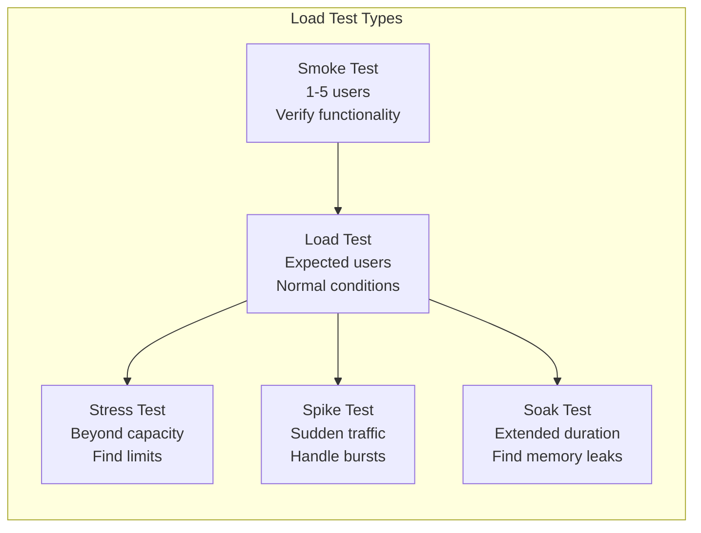
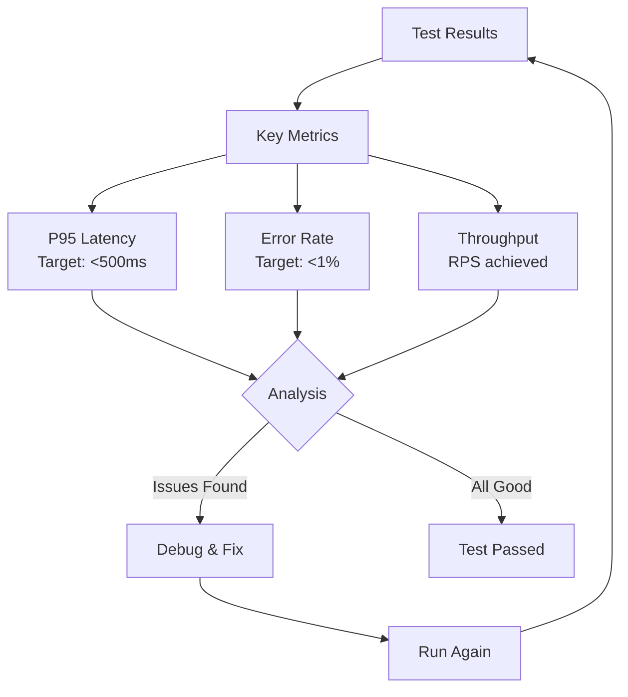

# How to Configure Load Testing

Author: [nawazdhandala](https://www.github.com/nawazdhandala)

Tags: Performance, Testing, Load Testing, k6, JMeter, Locust, DevOps, CI/CD, Scalability

Description: A practical guide to configuring load testing for web applications using k6, Locust, and Artillery, including realistic scenarios, CI/CD integration, and result analysis.

---

Load testing reveals how your application behaves under stress before your users discover it in production. A well-configured load test simulates real traffic patterns and helps you find breaking points, bottlenecks, and performance regressions. Let's explore how to set this up properly.

## Types of Load Tests

Different tests serve different purposes. Choose the right type for your goals.



## Setting Up k6 for Load Testing

k6 is a modern load testing tool that uses JavaScript for test scripts.

### Installation

```bash
# macOS
brew install k6

# Linux
sudo gpg -k
sudo gpg --no-default-keyring --keyring /usr/share/keyrings/k6-archive-keyring.gpg \
    --keyserver hkp://keyserver.ubuntu.com:80 --recv-keys C5AD17C747E3415A3642D57D77C6C491D6AC1D69
echo "deb [signed-by=/usr/share/keyrings/k6-archive-keyring.gpg] https://dl.k6.io/deb stable main" | \
    sudo tee /etc/apt/sources.list.d/k6.list
sudo apt-get update
sudo apt-get install k6

# Docker
docker run --rm -i grafana/k6 run - <script.js
```

### Basic Load Test Script

```javascript
// load-test.js
import http from 'k6/http';
import { check, sleep } from 'k6';
import { Rate, Trend } from 'k6/metrics';

// Custom metrics
const errorRate = new Rate('errors');
const apiLatency = new Trend('api_latency');

// Test configuration
export const options = {
    // Stages define how load changes over time
    stages: [
        { duration: '2m', target: 50 },   // Ramp up to 50 users
        { duration: '5m', target: 50 },   // Stay at 50 users
        { duration: '2m', target: 100 },  // Ramp up to 100 users
        { duration: '5m', target: 100 },  // Stay at 100 users
        { duration: '2m', target: 0 },    // Ramp down to 0
    ],

    // Performance thresholds (test fails if not met)
    thresholds: {
        http_req_duration: ['p(95)<500'],  // 95% of requests under 500ms
        http_req_failed: ['rate<0.01'],     // Less than 1% errors
        errors: ['rate<0.05'],              // Custom error rate under 5%
    },
};

// Setup function runs once at the start
export function setup() {
    // Get auth token or other setup data
    const loginRes = http.post('https://api.example.com/auth/login', JSON.stringify({
        email: 'loadtest@example.com',
        password: 'testpassword'
    }), {
        headers: { 'Content-Type': 'application/json' }
    });

    return { token: loginRes.json('token') };
}

// Default function runs for each virtual user
export default function(data) {
    const headers = {
        'Authorization': `Bearer ${data.token}`,
        'Content-Type': 'application/json'
    };

    // Simulate realistic user behavior

    // 1. View dashboard
    let res = http.get('https://api.example.com/dashboard', { headers });
    check(res, {
        'dashboard loaded': (r) => r.status === 200,
        'response has data': (r) => r.json('data') !== null,
    });
    apiLatency.add(res.timings.duration);
    errorRate.add(res.status !== 200);

    sleep(Math.random() * 2 + 1); // Random think time 1-3 seconds

    // 2. List items
    res = http.get('https://api.example.com/items?page=1&limit=20', { headers });
    check(res, {
        'items loaded': (r) => r.status === 200,
        'items returned': (r) => r.json('items').length > 0,
    });
    apiLatency.add(res.timings.duration);

    sleep(Math.random() * 3 + 2);

    // 3. Create an item (write operation)
    res = http.post('https://api.example.com/items', JSON.stringify({
        name: `Load Test Item ${Date.now()}`,
        description: 'Created during load testing'
    }), { headers });

    check(res, {
        'item created': (r) => r.status === 201,
    });
    errorRate.add(res.status !== 201);

    sleep(Math.random() * 2 + 1);
}

// Teardown function runs once at the end
export function teardown(data) {
    // Cleanup test data if needed
    console.log('Load test completed');
}
```

### Running the Test

```bash
# Basic run
k6 run load-test.js

# With more virtual users
k6 run --vus 100 --duration 10m load-test.js

# Output results to JSON
k6 run --out json=results.json load-test.js

# Stream results to InfluxDB
k6 run --out influxdb=http://localhost:8086/k6 load-test.js
```

## Setting Up Locust for Python Projects

Locust is Python-based and great for testing Python web applications.

```python
# locustfile.py
from locust import HttpUser, task, between
import json
import random

class WebsiteUser(HttpUser):
    # Wait between 1 and 5 seconds between tasks
    wait_time = between(1, 5)

    def on_start(self):
        """Called when a simulated user starts"""
        # Login and store token
        response = self.client.post("/auth/login", json={
            "email": "loadtest@example.com",
            "password": "testpassword"
        })
        if response.status_code == 200:
            self.token = response.json()["token"]
            self.headers = {"Authorization": f"Bearer {self.token}"}
        else:
            self.token = None
            self.headers = {}

    @task(3)  # Weight of 3 (more frequent)
    def view_dashboard(self):
        """Simulate viewing the dashboard"""
        with self.client.get("/dashboard", headers=self.headers,
                            catch_response=True) as response:
            if response.status_code == 200:
                response.success()
            else:
                response.failure(f"Got status {response.status_code}")

    @task(5)  # Weight of 5 (most frequent)
    def list_items(self):
        """Simulate browsing items"""
        page = random.randint(1, 10)
        self.client.get(f"/items?page={page}&limit=20", headers=self.headers)

    @task(2)  # Weight of 2
    def view_item(self):
        """Simulate viewing a single item"""
        item_id = random.randint(1, 1000)
        self.client.get(f"/items/{item_id}", headers=self.headers)

    @task(1)  # Weight of 1 (least frequent)
    def create_item(self):
        """Simulate creating an item"""
        self.client.post("/items", json={
            "name": f"Load Test Item {random.randint(1, 10000)}",
            "description": "Created during load testing"
        }, headers=self.headers)

    @task(1)
    def search_items(self):
        """Simulate searching"""
        queries = ["laptop", "phone", "tablet", "camera", "headphones"]
        query = random.choice(queries)
        self.client.get(f"/items/search?q={query}", headers=self.headers)


class AdminUser(HttpUser):
    """Simulate admin users with different behavior"""
    wait_time = between(2, 8)
    weight = 1  # 1 admin for every 10 regular users

    def on_start(self):
        response = self.client.post("/auth/login", json={
            "email": "admin@example.com",
            "password": "adminpassword"
        })
        self.token = response.json().get("token")
        self.headers = {"Authorization": f"Bearer {self.token}"}

    @task
    def view_analytics(self):
        self.client.get("/admin/analytics", headers=self.headers)

    @task
    def export_report(self):
        self.client.get("/admin/reports/export?format=csv", headers=self.headers)
```

Run Locust with:

```bash
# Start web UI
locust -f locustfile.py --host=https://api.example.com

# Headless mode for CI
locust -f locustfile.py --host=https://api.example.com \
    --headless --users 100 --spawn-rate 10 --run-time 5m
```

## Realistic Test Scenarios

Real users don't just hammer one endpoint. Create realistic user journeys:

```javascript
// scenarios.js - k6 scenarios for realistic testing
import http from 'k6/http';
import { sleep, check } from 'k6';

export const options = {
    scenarios: {
        // Scenario 1: Browsing users (most common)
        browsers: {
            executor: 'ramping-vus',
            startVUs: 0,
            stages: [
                { duration: '5m', target: 100 },
                { duration: '10m', target: 100 },
                { duration: '5m', target: 0 },
            ],
            exec: 'browsingUser',
        },

        // Scenario 2: Buyers (less common but important)
        buyers: {
            executor: 'constant-arrival-rate',
            rate: 10,           // 10 purchases per second
            timeUnit: '1s',
            duration: '20m',
            preAllocatedVUs: 50,
            exec: 'buyingUser',
        },

        // Scenario 3: API integrations (steady rate)
        apiClients: {
            executor: 'constant-vus',
            vus: 20,
            duration: '20m',
            exec: 'apiClient',
        },
    },
};

export function browsingUser() {
    // Home page
    http.get('https://example.com/');
    sleep(2);

    // Browse category
    http.get('https://example.com/category/electronics');
    sleep(3);

    // View product
    http.get('https://example.com/product/12345');
    sleep(5);

    // Maybe add to cart (30% chance)
    if (Math.random() < 0.3) {
        http.post('https://example.com/cart/add', JSON.stringify({
            productId: 12345,
            quantity: 1
        }));
    }

    sleep(2);
}

export function buyingUser() {
    const headers = { 'Content-Type': 'application/json' };

    // Add item to cart
    http.post('https://example.com/cart/add', JSON.stringify({
        productId: Math.floor(Math.random() * 10000),
        quantity: 1
    }), { headers });

    sleep(1);

    // Checkout
    const checkoutRes = http.post('https://example.com/checkout', JSON.stringify({
        paymentMethod: 'credit_card',
        shippingAddress: { /* address data */ }
    }), { headers });

    check(checkoutRes, {
        'checkout successful': (r) => r.status === 200,
    });
}

export function apiClient() {
    const headers = {
        'Authorization': 'Bearer api_key_12345',
        'Content-Type': 'application/json'
    };

    // Typical API integration pattern
    http.get('https://api.example.com/v1/products', { headers });
    sleep(0.5);

    http.get('https://api.example.com/v1/inventory/check', { headers });
    sleep(0.5);
}
```

## CI/CD Integration

Automate load tests in your pipeline:

```yaml
# .github/workflows/load-test.yml
name: Load Test

on:
  schedule:
    - cron: '0 2 * * *'  # Run nightly at 2 AM
  workflow_dispatch:      # Manual trigger
  pull_request:
    paths:
      - 'src/**'          # Run on code changes

jobs:
  load-test:
    runs-on: ubuntu-latest

    steps:
      - uses: actions/checkout@v4

      - name: Install k6
        run: |
          sudo gpg -k
          sudo gpg --no-default-keyring --keyring /usr/share/keyrings/k6-archive-keyring.gpg \
              --keyserver hkp://keyserver.ubuntu.com:80 --recv-keys C5AD17C747E3415A3642D57D77C6C491D6AC1D69
          echo "deb [signed-by=/usr/share/keyrings/k6-archive-keyring.gpg] https://dl.k6.io/deb stable main" | \
              sudo tee /etc/apt/sources.list.d/k6.list
          sudo apt-get update
          sudo apt-get install k6

      - name: Run Load Test
        run: k6 run --out json=results.json tests/load-test.js
        env:
          K6_TEST_URL: ${{ secrets.STAGING_URL }}
          K6_TEST_TOKEN: ${{ secrets.LOAD_TEST_TOKEN }}

      - name: Check Thresholds
        run: |
          # Parse results and fail if thresholds not met
          if grep -q '"thresholds":{".*":{"ok":false' results.json; then
            echo "Load test thresholds not met!"
            exit 1
          fi

      - name: Upload Results
        uses: actions/upload-artifact@v4
        with:
          name: load-test-results
          path: results.json
```

## Analyzing Results



Key metrics to analyze:

```bash
# k6 output interpretation
# data_received.........: 150 MB  2.5 MB/s
# data_sent.............: 10 MB   167 kB/s
# http_req_duration.....: avg=125ms min=50ms max=2.5s p(90)=300ms p(95)=450ms
# http_req_failed.......: 0.50%
# http_reqs.............: 50000   833/s
# vus...................: 100
# vus_max...............: 100

# Key insights:
# - p(95) of 450ms is under 500ms threshold (good)
# - 0.50% error rate is under 1% threshold (good)
# - Throughput of 833 RPS with 100 VUs
# - Max latency of 2.5s indicates some slow requests (investigate)
```

## Best Practices

1. **Test in an isolated environment** to avoid affecting production
2. **Start small and scale up** gradually to find the breaking point
3. **Use realistic data** and think times between actions
4. **Monitor server resources** (CPU, memory, disk) during tests
5. **Run tests regularly** to catch performance regressions
6. **Document baselines** and compare against them
7. **Test failure scenarios** like network issues and service outages

Load testing is not a one-time activity. Build it into your development process, run it automatically, and continuously improve your performance baselines. The goal is to find problems before your users do.
