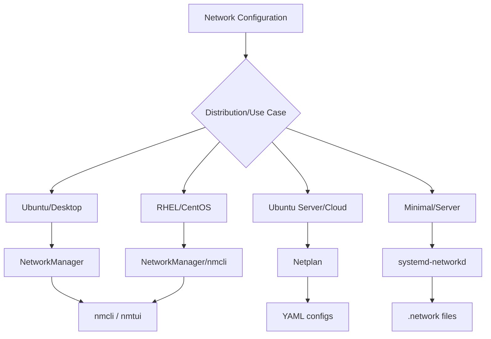
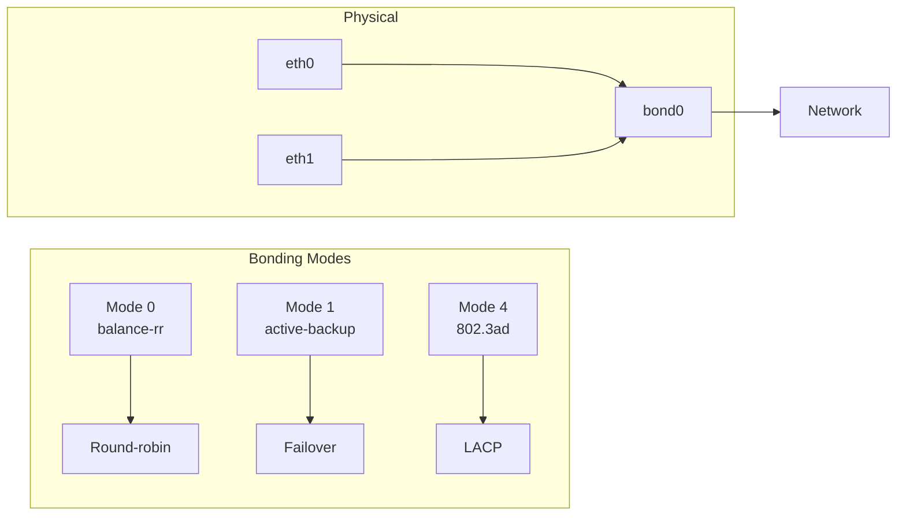
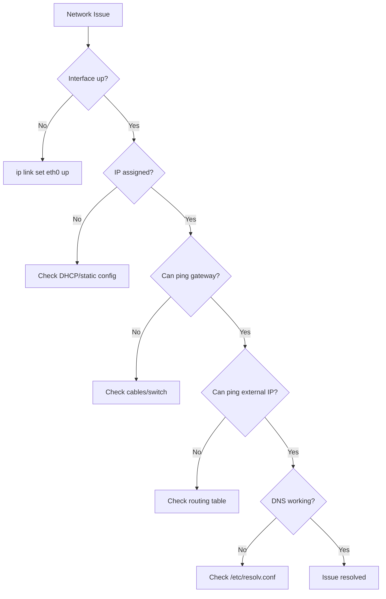

# How to Configure Network Interfaces in Linux

Author: [nawazdhandala](https://www.github.com/nawazdhandala)

Tags: Linux, Networking, System Administration, DevOps, Infrastructure

Description: Learn how to configure network interfaces on Linux using ip commands, Netplan, NetworkManager, and systemd-networkd.

---

Network configuration is fundamental to Linux system administration. Whether you're setting up a static IP address, configuring bonding for redundancy, or troubleshooting connectivity issues, understanding how to manage network interfaces is essential. This guide covers modern approaches across different Linux distributions.

## Network Configuration Methods Overview

Linux offers multiple ways to configure networking, depending on your distribution and use case.



## 1. Viewing Current Network Configuration

Start by understanding your current network setup.

```bash
# List all network interfaces with details
ip addr show
ip a    # Short form

# Show only interface names and states
ip link show

# Display routing table
ip route show
ip r    # Short form

# Show specific interface details
ip addr show eth0

# Display interface statistics
ip -s link show eth0

# View DNS configuration
resolvectl status
cat /etc/resolv.conf

# Check active connections
ss -tuln    # TCP and UDP listening ports
```

## 2. Temporary Network Configuration with ip Command

The `ip` command configures networking immediately but changes are lost on reboot.

```bash
# Bring interface up or down
sudo ip link set eth0 up
sudo ip link set eth0 down

# Assign IP address to interface
sudo ip addr add 192.168.1.100/24 dev eth0

# Remove IP address from interface
sudo ip addr del 192.168.1.100/24 dev eth0

# Add default gateway
sudo ip route add default via 192.168.1.1

# Delete default gateway
sudo ip route del default

# Add static route to specific network
sudo ip route add 10.0.0.0/8 via 192.168.1.1

# Flush all IP addresses from interface
sudo ip addr flush dev eth0

# Change MAC address
sudo ip link set eth0 down
sudo ip link set eth0 address 00:11:22:33:44:55
sudo ip link set eth0 up
```

## 3. Netplan Configuration (Ubuntu 18.04+)

Netplan is the default network configuration tool for modern Ubuntu systems.

```bash
# Netplan configuration files location
ls /etc/netplan/
# Usually: 00-installer-config.yaml or 01-netcfg.yaml
```

### Static IP Configuration

```yaml
# /etc/netplan/01-static.yaml
network:
  version: 2
  renderer: networkd    # Use systemd-networkd backend
  ethernets:
    eth0:
      addresses:
        - 192.168.1.100/24        # Primary IP with CIDR notation
        - 192.168.1.101/24        # Additional IP (optional)
      routes:
        - to: default
          via: 192.168.1.1        # Default gateway
        - to: 10.0.0.0/8
          via: 192.168.1.254      # Static route to internal network
      nameservers:
        addresses:
          - 8.8.8.8               # Primary DNS
          - 8.8.4.4               # Secondary DNS
        search:
          - example.com           # DNS search domain
      mtu: 1500                   # Maximum transmission unit
```

### DHCP Configuration

```yaml
# /etc/netplan/01-dhcp.yaml
network:
  version: 2
  renderer: networkd
  ethernets:
    eth0:
      dhcp4: true                 # Enable DHCP for IPv4
      dhcp6: false                # Disable DHCP for IPv6
      dhcp4-overrides:
        use-dns: true             # Use DNS from DHCP
        use-routes: true          # Use routes from DHCP
        route-metric: 100         # Route priority
```

### Apply Netplan Configuration

```bash
# Validate configuration syntax
sudo netplan generate

# Test configuration (auto-reverts in 120 seconds if no confirmation)
sudo netplan try

# Apply configuration permanently
sudo netplan apply

# Debug netplan issues
sudo netplan --debug apply
```

## 4. NetworkManager Configuration

NetworkManager is common on desktop systems and RHEL-based distributions.

### Using nmcli Command Line

```bash
# List all connections
nmcli connection show

# Show active connections
nmcli connection show --active

# List network devices
nmcli device status

# Create a new static IP connection
nmcli connection add \
    con-name "static-eth0" \
    type ethernet \
    ifname eth0 \
    ipv4.addresses "192.168.1.100/24" \
    ipv4.gateway "192.168.1.1" \
    ipv4.dns "8.8.8.8,8.8.4.4" \
    ipv4.method manual

# Create a DHCP connection
nmcli connection add \
    con-name "dhcp-eth0" \
    type ethernet \
    ifname eth0 \
    ipv4.method auto

# Modify existing connection
nmcli connection modify "static-eth0" ipv4.addresses "192.168.1.101/24"
nmcli connection modify "static-eth0" +ipv4.dns "1.1.1.1"    # Add DNS
nmcli connection modify "static-eth0" -ipv4.dns "8.8.4.4"    # Remove DNS

# Activate a connection
nmcli connection up "static-eth0"

# Deactivate a connection
nmcli connection down "static-eth0"

# Delete a connection
nmcli connection delete "static-eth0"

# Reload configuration files
nmcli connection reload
```

### Using nmtui Text Interface

```bash
# Launch text-based UI for network configuration
nmtui

# Options available:
# - Edit a connection
# - Activate a connection
# - Set system hostname
```

## 5. systemd-networkd Configuration

For servers and minimal installations, systemd-networkd provides reliable networking.

```bash
# Configuration files location
ls /etc/systemd/network/
# Files are processed in alphabetical order
```

### Static IP with systemd-networkd

```ini
# /etc/systemd/network/10-static.network
[Match]
Name=eth0                         # Interface name to configure

[Network]
Address=192.168.1.100/24          # IP address with CIDR
Gateway=192.168.1.1               # Default gateway
DNS=8.8.8.8                       # Primary DNS server
DNS=8.8.4.4                       # Secondary DNS server
Domains=example.com               # Search domain

[Route]
Destination=10.0.0.0/8            # Static route destination
Gateway=192.168.1.254             # Static route gateway
```

### DHCP with systemd-networkd

```ini
# /etc/systemd/network/20-dhcp.network
[Match]
Name=eth*                         # Match all eth interfaces

[Network]
DHCP=ipv4                         # Enable IPv4 DHCP
IPv6AcceptRA=yes                  # Accept Router Advertisements

[DHCP]
UseDNS=yes                        # Use DNS from DHCP
UseRoutes=yes                     # Use routes from DHCP
RouteMetric=100                   # Route priority
```

### Enable and Apply systemd-networkd

```bash
# Enable systemd-networkd
sudo systemctl enable systemd-networkd
sudo systemctl start systemd-networkd

# Enable systemd-resolved for DNS
sudo systemctl enable systemd-resolved
sudo systemctl start systemd-resolved

# Link resolv.conf to systemd-resolved
sudo ln -sf /run/systemd/resolve/stub-resolv.conf /etc/resolv.conf

# Restart networking to apply changes
sudo systemctl restart systemd-networkd

# Check status
networkctl status
networkctl status eth0
```

## 6. Network Interface Bonding

Combine multiple interfaces for redundancy or increased throughput.



### Bonding with Netplan

```yaml
# /etc/netplan/01-bonding.yaml
network:
  version: 2
  renderer: networkd
  ethernets:
    eth0:
      dhcp4: false                # Disable DHCP on physical interface
    eth1:
      dhcp4: false
  bonds:
    bond0:
      interfaces:
        - eth0                    # First physical interface
        - eth1                    # Second physical interface
      addresses:
        - 192.168.1.100/24
      routes:
        - to: default
          via: 192.168.1.1
      nameservers:
        addresses:
          - 8.8.8.8
      parameters:
        mode: active-backup       # Failover mode
        primary: eth0             # Preferred interface
        mii-monitoring-interval: 100    # Check link every 100ms
```

### Bonding with systemd-networkd

```ini
# /etc/systemd/network/10-bond0.netdev
[NetDev]
Name=bond0
Kind=bond

[Bond]
Mode=active-backup
PrimaryReselectPolicy=always
MIIMonitorSec=100ms
```

```ini
# /etc/systemd/network/20-bond0-slaves.network
[Match]
Name=eth0 eth1

[Network]
Bond=bond0
```

```ini
# /etc/systemd/network/30-bond0.network
[Match]
Name=bond0

[Network]
Address=192.168.1.100/24
Gateway=192.168.1.1
DNS=8.8.8.8
```

## 7. VLAN Configuration

Create virtual LANs on a single physical interface.

### VLAN with Netplan

```yaml
# /etc/netplan/01-vlan.yaml
network:
  version: 2
  renderer: networkd
  ethernets:
    eth0:
      dhcp4: false                # Physical interface - no IP
  vlans:
    vlan100:
      id: 100                     # VLAN ID
      link: eth0                  # Parent interface
      addresses:
        - 10.100.0.10/24
      routes:
        - to: default
          via: 10.100.0.1
    vlan200:
      id: 200
      link: eth0
      addresses:
        - 10.200.0.10/24
```

### VLAN with systemd-networkd

```ini
# /etc/systemd/network/10-vlan100.netdev
[NetDev]
Name=vlan100
Kind=vlan

[VLAN]
Id=100
```

```ini
# /etc/systemd/network/20-eth0.network
[Match]
Name=eth0

[Network]
VLAN=vlan100
```

```ini
# /etc/systemd/network/30-vlan100.network
[Match]
Name=vlan100

[Network]
Address=10.100.0.10/24
Gateway=10.100.0.1
```

## 8. Bridge Configuration

Create network bridges for VMs or containers.

### Bridge with Netplan

```yaml
# /etc/netplan/01-bridge.yaml
network:
  version: 2
  renderer: networkd
  ethernets:
    eth0:
      dhcp4: false
  bridges:
    br0:
      interfaces:
        - eth0                    # Physical interface attached to bridge
      addresses:
        - 192.168.1.100/24
      routes:
        - to: default
          via: 192.168.1.1
      nameservers:
        addresses:
          - 8.8.8.8
      parameters:
        stp: true                 # Enable Spanning Tree Protocol
        forward-delay: 4          # STP forward delay
```

## 9. Troubleshooting Network Issues

Systematic approach to diagnosing network problems.



### Diagnostic Commands

```bash
# Check interface state and statistics
ip -s link show eth0

# Verify IP configuration
ip addr show eth0

# Test connectivity to gateway
ping -c 3 192.168.1.1

# Test external connectivity (using IP to bypass DNS)
ping -c 3 8.8.8.8

# Test DNS resolution
nslookup google.com
dig google.com

# Trace route to destination
traceroute google.com
mtr google.com    # Better alternative

# Check listening ports
ss -tuln

# View active connections
ss -tun

# Check firewall rules
sudo iptables -L -n -v
sudo nft list ruleset

# Monitor network traffic
sudo tcpdump -i eth0 -n

# Check for errors in system logs
journalctl -u systemd-networkd -f
journalctl -u NetworkManager -f
```

### Common Issues and Fixes

```bash
# Issue: Interface not coming up
# Check if driver is loaded
lspci -k | grep -A 3 -i network
dmesg | grep eth0

# Issue: DHCP not getting IP
# Force DHCP renewal
sudo dhclient -r eth0    # Release
sudo dhclient eth0       # Renew

# Issue: DNS not resolving
# Test with different DNS server
dig @8.8.8.8 google.com

# Issue: Can't reach external networks
# Check default route exists
ip route | grep default

# Issue: Duplicate IP address
# Check for conflicts
arping -D -I eth0 192.168.1.100
```

## 10. Network Configuration Best Practices

```bash
# Always backup before changes
sudo cp /etc/netplan/01-network.yaml /etc/netplan/01-network.yaml.bak

# Use netplan try for safe testing
sudo netplan try    # Auto-reverts if no confirmation

# Document your configurations
# Add comments in config files explaining the setup

# Use consistent naming
# Name configuration files with numeric prefixes: 01-base.yaml, 02-vlans.yaml

# Monitor changes
# Keep configuration in version control (git)

# Test failover
# Physically disconnect cables to verify bonding works

# Set appropriate MTU
# Match MTU across the network path
# For jumbo frames: mtu: 9000

# Disable IPv6 if not used
# Reduces attack surface and simplifies debugging
sysctl -w net.ipv6.conf.all.disable_ipv6=1
```

### Configuration Checklist

```bash
#!/bin/bash
# /usr/local/sbin/network-check.sh
# Verify network configuration is correct

echo "=== Network Configuration Check ==="

# Check interfaces are up
for iface in $(ip -o link show | awk -F': ' '{print $2}' | grep -v lo); do
    state=$(ip -o link show "$iface" | grep -o "state [A-Z]*" | cut -d' ' -f2)
    echo "Interface $iface: $state"
done

# Check IP addresses
echo ""
echo "IP Addresses:"
ip -4 addr show | grep inet

# Check default route
echo ""
echo "Default Gateway:"
ip route | grep default || echo "WARNING: No default route!"

# Check DNS
echo ""
echo "DNS Servers:"
grep nameserver /etc/resolv.conf

# Test connectivity
echo ""
echo "Connectivity Test:"
ping -c 1 -W 2 8.8.8.8 > /dev/null 2>&1 && echo "Internet: OK" || echo "Internet: FAILED"
ping -c 1 -W 2 google.com > /dev/null 2>&1 && echo "DNS: OK" || echo "DNS: FAILED"

echo "=== Check Complete ==="
```

---

Proper network configuration is critical for server reliability. Whether you use Netplan, NetworkManager, or systemd-networkd, always test changes carefully, maintain backups, and document your configuration for future reference.
