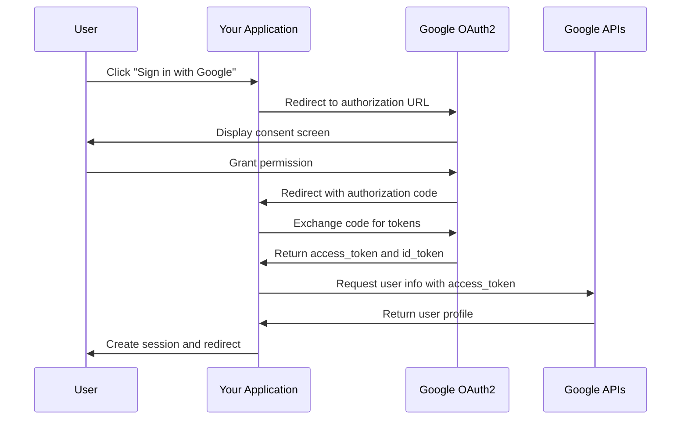
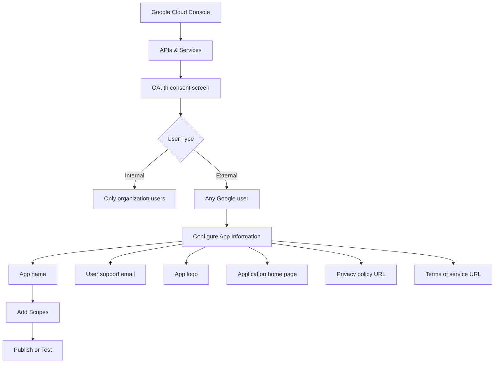
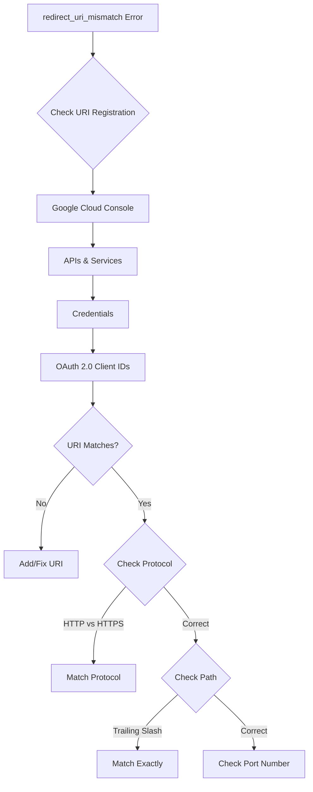

# How to Configure OAuth2 with Google Sign-In

Author: [nawazdhandala](https://github.com/nawazdhandala)

Tags: OAuth2, Google, Authentication, Security, Web Development, API

Description: A complete guide to implementing Google Sign-In using OAuth2 in your web application with step-by-step instructions and code examples.

---

Google Sign-In using OAuth2 provides a secure and user-friendly way to authenticate users in your application. This guide walks you through the complete setup process, from creating credentials in Google Cloud Console to implementing the authentication flow in your application.

## Prerequisites

Before starting, ensure you have:

- A Google Cloud Platform account
- A web application ready for OAuth2 integration
- Basic understanding of HTTP and authentication concepts

## Understanding the Google OAuth2 Flow



## Step 1: Create a Google Cloud Project

First, set up your project in the Google Cloud Console.

### Create the Project

1. Go to [Google Cloud Console](https://console.cloud.google.com)
2. Click the project dropdown and select "New Project"
3. Enter a project name and click "Create"

### Enable the Required APIs

```bash
# Using gcloud CLI to enable APIs
gcloud services enable oauth2.googleapis.com
gcloud services enable people.googleapis.com
gcloud services enable plus.googleapis.com
```

## Step 2: Configure the OAuth Consent Screen

Before creating credentials, configure how your app appears to users during authentication.



### Required Fields

Configure these essential fields:

```yaml
# OAuth Consent Screen Configuration
app_name: "Your Application Name"
user_support_email: "support@yourcompany.com"
developer_contact_email: "developer@yourcompany.com"

# Optional but recommended
app_logo: "URL to your logo (120x120 pixels)"
application_home_page: "https://yourapp.com"
privacy_policy: "https://yourapp.com/privacy"
terms_of_service: "https://yourapp.com/terms"
```

### Scopes Configuration

Add the scopes your application needs:

```python
# Common scopes for Google Sign-In
GOOGLE_SCOPES = [
    # Basic profile information (required for sign-in)
    "openid",
    "https://www.googleapis.com/auth/userinfo.email",
    "https://www.googleapis.com/auth/userinfo.profile",

    # Optional: Access to Google Calendar
    # "https://www.googleapis.com/auth/calendar.readonly",

    # Optional: Access to Google Drive
    # "https://www.googleapis.com/auth/drive.readonly",
]
```

## Step 3: Create OAuth2 Credentials

### In Google Cloud Console

1. Navigate to APIs & Services > Credentials
2. Click "Create Credentials" > "OAuth client ID"
3. Select "Web application" as the application type

### Configure Authorized Origins and Redirect URIs

```json
{
  "web_application": {
    "name": "Your App Web Client",
    "authorized_javascript_origins": [
      "http://localhost:3000",
      "http://localhost:8080",
      "https://yourapp.com",
      "https://www.yourapp.com"
    ],
    "authorized_redirect_uris": [
      "http://localhost:3000/auth/google/callback",
      "http://localhost:8080/auth/google/callback",
      "https://yourapp.com/auth/google/callback",
      "https://www.yourapp.com/auth/google/callback"
    ]
  }
}
```

### Download Credentials

After creation, download the JSON credentials file:

```json
{
  "web": {
    "client_id": "123456789-abcdefghijk.apps.googleusercontent.com",
    "project_id": "your-project-id",
    "auth_uri": "https://accounts.google.com/o/oauth2/auth",
    "token_uri": "https://oauth2.googleapis.com/token",
    "auth_provider_x509_cert_url": "https://www.googleapis.com/oauth2/v1/certs",
    "client_secret": "GOCSPX-your-client-secret",
    "redirect_uris": ["http://localhost:3000/auth/google/callback"]
  }
}
```

## Step 4: Implement the Backend

### Node.js with Express

```javascript
// server.js
const express = require('express');
const axios = require('axios');
const querystring = require('querystring');
const jwt = require('jsonwebtoken');

const app = express();
app.use(express.json());

// Configuration from environment variables
const config = {
    clientId: process.env.GOOGLE_CLIENT_ID,
    clientSecret: process.env.GOOGLE_CLIENT_SECRET,
    redirectUri: process.env.GOOGLE_REDIRECT_URI || 'http://localhost:3000/auth/google/callback',
    scopes: ['openid', 'email', 'profile']
};

// Google OAuth2 endpoints
const GOOGLE_AUTH_URL = 'https://accounts.google.com/o/oauth2/v2/auth';
const GOOGLE_TOKEN_URL = 'https://oauth2.googleapis.com/token';
const GOOGLE_USERINFO_URL = 'https://www.googleapis.com/oauth2/v3/userinfo';

// Generate a random state for CSRF protection
function generateState() {
    return require('crypto').randomBytes(32).toString('hex');
}

// Store states temporarily (use Redis in production)
const stateStore = new Map();

// Step 1: Redirect user to Google for authentication
app.get('/auth/google', (req, res) => {
    const state = generateState();

    // Store state with timestamp for verification
    stateStore.set(state, {
        createdAt: Date.now(),
        returnTo: req.query.returnTo || '/'
    });

    const params = querystring.stringify({
        client_id: config.clientId,
        redirect_uri: config.redirectUri,
        response_type: 'code',
        scope: config.scopes.join(' '),
        state: state,
        access_type: 'offline', // Request refresh token
        prompt: 'consent' // Force consent screen for refresh token
    });

    res.redirect(`${GOOGLE_AUTH_URL}?${params}`);
});

// Step 2: Handle the callback from Google
app.get('/auth/google/callback', async (req, res) => {
    const { code, state, error } = req.query;

    // Handle errors from Google
    if (error) {
        console.error('Google OAuth error:', error);
        return res.redirect(`/login?error=${error}`);
    }

    // Verify state to prevent CSRF attacks
    const storedState = stateStore.get(state);
    if (!storedState) {
        return res.status(403).json({ error: 'Invalid state parameter' });
    }

    // Check if state has expired (5 minutes)
    if (Date.now() - storedState.createdAt > 5 * 60 * 1000) {
        stateStore.delete(state);
        return res.status(403).json({ error: 'State expired' });
    }

    // Clean up used state
    stateStore.delete(state);

    try {
        // Step 3: Exchange authorization code for tokens
        const tokenResponse = await axios.post(GOOGLE_TOKEN_URL,
            querystring.stringify({
                code: code,
                client_id: config.clientId,
                client_secret: config.clientSecret,
                redirect_uri: config.redirectUri,
                grant_type: 'authorization_code'
            }),
            {
                headers: {
                    'Content-Type': 'application/x-www-form-urlencoded'
                }
            }
        );

        const { access_token, refresh_token, id_token, expires_in } = tokenResponse.data;

        // Step 4: Decode the ID token to get user info
        const decodedIdToken = jwt.decode(id_token);

        // Alternatively, fetch user info from the API
        const userInfoResponse = await axios.get(GOOGLE_USERINFO_URL, {
            headers: {
                Authorization: `Bearer ${access_token}`
            }
        });

        const userInfo = userInfoResponse.data;

        // Step 5: Create or update user in your database
        const user = await findOrCreateUser({
            googleId: userInfo.sub,
            email: userInfo.email,
            name: userInfo.name,
            picture: userInfo.picture,
            emailVerified: userInfo.email_verified
        });

        // Step 6: Create session or JWT for your application
        const sessionToken = createSessionToken(user);

        // Set secure cookie
        res.cookie('session', sessionToken, {
            httpOnly: true,
            secure: process.env.NODE_ENV === 'production',
            sameSite: 'lax',
            maxAge: 7 * 24 * 60 * 60 * 1000 // 7 days
        });

        // Redirect to the original destination
        res.redirect(storedState.returnTo);

    } catch (err) {
        console.error('Token exchange error:', err.response?.data || err.message);
        res.redirect('/login?error=authentication_failed');
    }
});

// Helper function to find or create user
async function findOrCreateUser(googleUser) {
    // Implement your user database logic here
    // This is a placeholder implementation
    return {
        id: googleUser.googleId,
        email: googleUser.email,
        name: googleUser.name,
        picture: googleUser.picture
    };
}

// Helper function to create session token
function createSessionToken(user) {
    return jwt.sign(
        { userId: user.id, email: user.email },
        process.env.SESSION_SECRET,
        { expiresIn: '7d' }
    );
}

app.listen(3000, () => {
    console.log('Server running on http://localhost:3000');
});
```

### Python with Flask

```python
# app.py
import os
import secrets
from flask import Flask, redirect, request, session, url_for, jsonify
from google.oauth2 import id_token
from google.auth.transport import requests as google_requests
import requests

app = Flask(__name__)
app.secret_key = os.environ.get('FLASK_SECRET_KEY', secrets.token_hex(32))

# Configuration
GOOGLE_CLIENT_ID = os.environ.get('GOOGLE_CLIENT_ID')
GOOGLE_CLIENT_SECRET = os.environ.get('GOOGLE_CLIENT_SECRET')
GOOGLE_REDIRECT_URI = os.environ.get('GOOGLE_REDIRECT_URI', 'http://localhost:5000/auth/google/callback')

# Google OAuth2 endpoints
GOOGLE_AUTH_URL = 'https://accounts.google.com/o/oauth2/v2/auth'
GOOGLE_TOKEN_URL = 'https://oauth2.googleapis.com/token'
GOOGLE_USERINFO_URL = 'https://www.googleapis.com/oauth2/v3/userinfo'

# Scopes
SCOPES = ['openid', 'email', 'profile']


@app.route('/auth/google')
def google_login():
    """Initiate Google OAuth2 flow."""
    # Generate state for CSRF protection
    state = secrets.token_urlsafe(32)
    session['oauth_state'] = state
    session['return_to'] = request.args.get('return_to', '/')

    # Build authorization URL
    params = {
        'client_id': GOOGLE_CLIENT_ID,
        'redirect_uri': GOOGLE_REDIRECT_URI,
        'response_type': 'code',
        'scope': ' '.join(SCOPES),
        'state': state,
        'access_type': 'offline',
        'prompt': 'consent'
    }

    auth_url = f"{GOOGLE_AUTH_URL}?{'&'.join(f'{k}={v}' for k, v in params.items())}"
    return redirect(auth_url)


@app.route('/auth/google/callback')
def google_callback():
    """Handle Google OAuth2 callback."""
    # Check for errors
    error = request.args.get('error')
    if error:
        return redirect(f'/login?error={error}')

    # Verify state
    state = request.args.get('state')
    if state != session.get('oauth_state'):
        return jsonify({'error': 'Invalid state parameter'}), 403

    # Clean up state
    session.pop('oauth_state', None)

    # Get authorization code
    code = request.args.get('code')

    try:
        # Exchange code for tokens
        token_data = {
            'code': code,
            'client_id': GOOGLE_CLIENT_ID,
            'client_secret': GOOGLE_CLIENT_SECRET,
            'redirect_uri': GOOGLE_REDIRECT_URI,
            'grant_type': 'authorization_code'
        }

        token_response = requests.post(GOOGLE_TOKEN_URL, data=token_data)
        token_response.raise_for_status()
        tokens = token_response.json()

        access_token = tokens['access_token']
        id_token_jwt = tokens.get('id_token')
        refresh_token = tokens.get('refresh_token')

        # Verify and decode ID token
        id_info = id_token.verify_oauth2_token(
            id_token_jwt,
            google_requests.Request(),
            GOOGLE_CLIENT_ID
        )

        # Get additional user info if needed
        userinfo_response = requests.get(
            GOOGLE_USERINFO_URL,
            headers={'Authorization': f'Bearer {access_token}'}
        )
        userinfo_response.raise_for_status()
        user_info = userinfo_response.json()

        # Create user session
        session['user'] = {
            'id': id_info['sub'],
            'email': id_info['email'],
            'name': id_info.get('name'),
            'picture': id_info.get('picture'),
            'email_verified': id_info.get('email_verified', False)
        }

        # Store refresh token securely if needed
        if refresh_token:
            # Store in database associated with user
            pass

        return_to = session.pop('return_to', '/')
        return redirect(return_to)

    except Exception as e:
        app.logger.error(f'OAuth callback error: {e}')
        return redirect('/login?error=authentication_failed')


@app.route('/auth/logout')
def logout():
    """Log out the user."""
    session.clear()
    return redirect('/')


@app.route('/api/user')
def get_user():
    """Get current user information."""
    user = session.get('user')
    if not user:
        return jsonify({'error': 'Not authenticated'}), 401
    return jsonify(user)


if __name__ == '__main__':
    app.run(debug=True, port=5000)
```

## Step 5: Implement the Frontend

### JavaScript Client Integration

```html
<!-- index.html -->
<!DOCTYPE html>
<html lang="en">
<head>
    <meta charset="UTF-8">
    <meta name="viewport" content="width=device-width, initial-scale=1.0">
    <title>Google Sign-In Example</title>
    <style>
        .google-btn {
            display: inline-flex;
            align-items: center;
            padding: 12px 24px;
            background-color: #4285f4;
            color: white;
            border: none;
            border-radius: 4px;
            font-size: 16px;
            cursor: pointer;
            text-decoration: none;
        }
        .google-btn:hover {
            background-color: #357abd;
        }
        .google-btn svg {
            margin-right: 12px;
        }
    </style>
</head>
<body>
    <div id="app">
        <div id="login-section">
            <h1>Welcome</h1>
            <a href="/auth/google" class="google-btn">
                <svg width="18" height="18" viewBox="0 0 18 18">
                    <path fill="#fff" d="M16.51 8H8.98v3h4.3c-.18 1-.74 1.48-1.6 2.04v2.01h2.6a7.8 7.8 0 0 0 2.38-5.88c0-.57-.05-.66-.15-1.18z"/>
                    <path fill="#fff" d="M8.98 17c2.16 0 3.97-.72 5.3-1.94l-2.6-2a4.8 4.8 0 0 1-7.18-2.54H1.83v2.07A8 8 0 0 0 8.98 17z"/>
                    <path fill="#fff" d="M4.5 10.52a4.8 4.8 0 0 1 0-3.04V5.41H1.83a8 8 0 0 0 0 7.18l2.67-2.07z"/>
                    <path fill="#fff" d="M8.98 4.18c1.17 0 2.23.4 3.06 1.2l2.3-2.3A8 8 0 0 0 1.83 5.4L4.5 7.49a4.77 4.77 0 0 1 4.48-3.3z"/>
                </svg>
                Sign in with Google
            </a>
        </div>
        <div id="user-section" style="display: none;">
            <h1>Welcome, <span id="user-name"></span>!</h1>
            
            <p>Email: <span id="user-email"></span></p>
            <button onclick="logout()">Sign Out</button>
        </div>
    </div>

    <script>
        // Check if user is logged in
        async function checkAuth() {
            try {
                const response = await fetch('/api/user');
                if (response.ok) {
                    const user = await response.json();
                    showUser(user);
                } else {
                    showLogin();
                }
            } catch (error) {
                console.error('Auth check failed:', error);
                showLogin();
            }
        }

        function showLogin() {
            document.getElementById('login-section').style.display = 'block';
            document.getElementById('user-section').style.display = 'none';
        }

        function showUser(user) {
            document.getElementById('login-section').style.display = 'none';
            document.getElementById('user-section').style.display = 'block';
            document.getElementById('user-name').textContent = user.name;
            document.getElementById('user-email').textContent = user.email;
            document.getElementById('user-picture').src = user.picture;
        }

        async function logout() {
            await fetch('/auth/logout');
            showLogin();
        }

        // Check auth status on page load
        checkAuth();
    </script>
</body>
</html>
```

### React Implementation

```jsx
// GoogleAuth.jsx
import React, { useState, useEffect, createContext, useContext } from 'react';

// Create Auth Context
const AuthContext = createContext(null);

export function AuthProvider({ children }) {
    const [user, setUser] = useState(null);
    const [loading, setLoading] = useState(true);

    useEffect(() => {
        checkAuth();
    }, []);

    async function checkAuth() {
        try {
            const response = await fetch('/api/user');
            if (response.ok) {
                const userData = await response.json();
                setUser(userData);
            }
        } catch (error) {
            console.error('Auth check failed:', error);
        } finally {
            setLoading(false);
        }
    }

    async function logout() {
        await fetch('/auth/logout');
        setUser(null);
    }

    return (
        <AuthContext.Provider value={{ user, loading, logout, checkAuth }}>
            {children}
        </AuthContext.Provider>
    );
}

export function useAuth() {
    return useContext(AuthContext);
}

// Google Sign-In Button Component
export function GoogleSignInButton({ returnTo = '/' }) {
    const handleClick = () => {
        // Redirect to backend auth endpoint
        window.location.href = `/auth/google?return_to=${encodeURIComponent(returnTo)}`;
    };

    return (
        <button
            onClick={handleClick}
            style={{
                display: 'flex',
                alignItems: 'center',
                padding: '12px 24px',
                backgroundColor: '#4285f4',
                color: 'white',
                border: 'none',
                borderRadius: '4px',
                fontSize: '16px',
                cursor: 'pointer'
            }}
        >
            <GoogleIcon />
            <span style={{ marginLeft: '12px' }}>Sign in with Google</span>
        </button>
    );
}

function GoogleIcon() {
    return (
        <svg width="18" height="18" viewBox="0 0 18 18">
            <path fill="#fff" d="M16.51 8H8.98v3h4.3c-.18 1-.74 1.48-1.6 2.04v2.01h2.6a7.8 7.8 0 0 0 2.38-5.88c0-.57-.05-.66-.15-1.18z"/>
            <path fill="#fff" d="M8.98 17c2.16 0 3.97-.72 5.3-1.94l-2.6-2a4.8 4.8 0 0 1-7.18-2.54H1.83v2.07A8 8 0 0 0 8.98 17z"/>
            <path fill="#fff" d="M4.5 10.52a4.8 4.8 0 0 1 0-3.04V5.41H1.83a8 8 0 0 0 0 7.18l2.67-2.07z"/>
            <path fill="#fff" d="M8.98 4.18c1.17 0 2.23.4 3.06 1.2l2.3-2.3A8 8 0 0 0 1.83 5.4L4.5 7.49a4.77 4.77 0 0 1 4.48-3.3z"/>
        </svg>
    );
}

// Protected Route Component
export function ProtectedRoute({ children }) {
    const { user, loading } = useAuth();

    if (loading) {
        return <div>Loading...</div>;
    }

    if (!user) {
        return (
            <div style={{ textAlign: 'center', padding: '48px' }}>
                <h2>Please sign in to continue</h2>
                <GoogleSignInButton returnTo={window.location.pathname} />
            </div>
        );
    }

    return children;
}

// Usage Example
export function App() {
    return (
        <AuthProvider>
            <Navigation />
            <Routes>
                <Route path="/" element={<Home />} />
                <Route path="/dashboard" element={
                    <ProtectedRoute>
                        <Dashboard />
                    </ProtectedRoute>
                } />
            </Routes>
        </AuthProvider>
    );
}
```

## Step 6: Token Refresh Implementation

### Automatic Token Refresh

```javascript
// tokenManager.js
class TokenManager {
    constructor() {
        this.accessToken = null;
        this.refreshToken = null;
        this.expiresAt = null;
    }

    setTokens(accessToken, refreshToken, expiresIn) {
        this.accessToken = accessToken;
        this.refreshToken = refreshToken;
        // Set expiration 5 minutes before actual expiry
        this.expiresAt = Date.now() + (expiresIn - 300) * 1000;
    }

    isTokenExpired() {
        return !this.expiresAt || Date.now() >= this.expiresAt;
    }

    async getValidAccessToken() {
        if (!this.isTokenExpired()) {
            return this.accessToken;
        }

        // Token expired, refresh it
        return await this.refreshAccessToken();
    }

    async refreshAccessToken() {
        try {
            const response = await fetch('/auth/refresh', {
                method: 'POST',
                headers: {
                    'Content-Type': 'application/json'
                },
                body: JSON.stringify({
                    refresh_token: this.refreshToken
                })
            });

            if (!response.ok) {
                throw new Error('Token refresh failed');
            }

            const data = await response.json();
            this.setTokens(data.access_token, data.refresh_token, data.expires_in);
            return this.accessToken;
        } catch (error) {
            // Refresh failed, user needs to re-authenticate
            this.clearTokens();
            window.location.href = '/auth/google';
            throw error;
        }
    }

    clearTokens() {
        this.accessToken = null;
        this.refreshToken = null;
        this.expiresAt = null;
    }
}

// Create singleton instance
export const tokenManager = new TokenManager();

// Wrapper for authenticated API calls
export async function authenticatedFetch(url, options = {}) {
    const token = await tokenManager.getValidAccessToken();

    const headers = {
        ...options.headers,
        'Authorization': `Bearer ${token}`
    };

    return fetch(url, { ...options, headers });
}
```

## Security Best Practices

### 1. Validate ID Tokens Server-Side

```python
# Always validate ID tokens on the server
from google.oauth2 import id_token
from google.auth.transport import requests

def verify_google_token(token):
    """Verify a Google ID token and return the user info."""
    try:
        # Specify the CLIENT_ID of the app that accesses the backend
        id_info = id_token.verify_oauth2_token(
            token,
            requests.Request(),
            GOOGLE_CLIENT_ID
        )

        # Verify the issuer
        if id_info['iss'] not in ['accounts.google.com', 'https://accounts.google.com']:
            raise ValueError('Wrong issuer')

        # Verify the audience
        if id_info['aud'] != GOOGLE_CLIENT_ID:
            raise ValueError('Wrong audience')

        return id_info
    except ValueError as e:
        raise ValueError(f'Invalid token: {e}')
```

### 2. Use HTTPS in Production

```nginx
# nginx.conf
server {
    listen 80;
    server_name yourapp.com;
    return 301 https://$server_name$request_uri;
}

server {
    listen 443 ssl;
    server_name yourapp.com;

    ssl_certificate /etc/letsencrypt/live/yourapp.com/fullchain.pem;
    ssl_certificate_key /etc/letsencrypt/live/yourapp.com/privkey.pem;

    location / {
        proxy_pass http://localhost:3000;
        proxy_set_header Host $host;
        proxy_set_header X-Real-IP $remote_addr;
        proxy_set_header X-Forwarded-Proto $scheme;
    }
}
```

### 3. Secure Session Storage

```javascript
// Secure cookie configuration
const sessionConfig = {
    secret: process.env.SESSION_SECRET,
    resave: false,
    saveUninitialized: false,
    cookie: {
        secure: process.env.NODE_ENV === 'production', // HTTPS only in production
        httpOnly: true, // Prevent XSS access to cookie
        sameSite: 'lax', // CSRF protection
        maxAge: 7 * 24 * 60 * 60 * 1000 // 7 days
    }
};
```

## Troubleshooting Common Issues

### Error: "redirect_uri_mismatch"



### Error: "invalid_client"

```bash
# Verify your credentials
echo "Client ID: $GOOGLE_CLIENT_ID"
echo "Client Secret length: ${#GOOGLE_CLIENT_SECRET}"

# Ensure no extra whitespace
export GOOGLE_CLIENT_ID=$(echo $GOOGLE_CLIENT_ID | tr -d '[:space:]')
export GOOGLE_CLIENT_SECRET=$(echo $GOOGLE_CLIENT_SECRET | tr -d '[:space:]')
```

### Error: "access_denied"

This usually means the user denied permission or the app is not verified:

1. Check if your app is in testing mode
2. Add test users in the OAuth consent screen
3. Submit for verification if needed for production

## Conclusion

Implementing Google Sign-In with OAuth2 provides a secure and seamless authentication experience for your users. By following this guide, you have learned how to:

1. Set up a Google Cloud project with OAuth2 credentials
2. Configure the OAuth consent screen properly
3. Implement the backend authentication flow
4. Create a frontend that initiates and handles authentication
5. Manage token refresh for persistent sessions
6. Apply security best practices

Remember to always validate tokens server-side, use HTTPS in production, and keep your client secrets secure. With these practices in place, you can provide a trustworthy authentication experience for your users.
