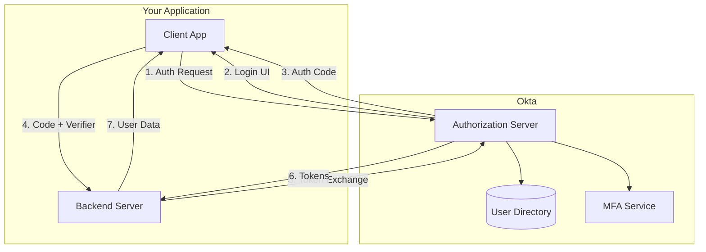

# How to Configure OAuth2 with Okta

Author: [nawazdhandala](https://www.github.com/nawazdhandala)

Tags: OAuth2, Okta, Authentication, SSO, OIDC, Identity Provider, Security

Description: A comprehensive guide to configuring OAuth2 and OpenID Connect with Okta, covering application setup, authorization flows, token management, and best practices for production deployments.

---

Okta is one of the most widely used identity providers for enterprise applications. This guide walks through configuring OAuth2 and OpenID Connect (OIDC) with Okta, from initial setup to production-ready implementation.

## Okta OAuth2 Architecture



## Step 1: Create an Okta Application

### For Single Page Applications (SPA)

1. Log into the Okta Admin Console
2. Navigate to Applications > Create App Integration
3. Select OIDC - OpenID Connect
4. Select Single-Page Application

```javascript
// Okta SPA configuration example
const oktaConfig = {
    issuer: 'https://your-domain.okta.com/oauth2/default',
    clientId: 'your-client-id',
    redirectUri: 'https://your-app.com/callback',
    scopes: ['openid', 'profile', 'email'],
    pkce: true,  // Required for SPAs
};
```

### For Server-Side Applications

1. Select OIDC - OpenID Connect
2. Select Web Application
3. Enable Client Credentials grant if needed

```javascript
// Okta server-side configuration
const oktaConfig = {
    issuer: 'https://your-domain.okta.com/oauth2/default',
    clientId: 'your-client-id',
    clientSecret: process.env.OKTA_CLIENT_SECRET,
    redirectUri: 'https://your-app.com/callback',
    scopes: ['openid', 'profile', 'email', 'offline_access'],
};
```

## Step 2: Implement Authorization Code Flow with PKCE

### SPA Implementation

```javascript
class OktaAuth {
    constructor(config) {
        this.issuer = config.issuer;
        this.clientId = config.clientId;
        this.redirectUri = config.redirectUri;
        this.scopes = config.scopes;

        // Derive endpoints from issuer
        this.authorizationEndpoint = `${this.issuer}/v1/authorize`;
        this.tokenEndpoint = `${this.issuer}/v1/token`;
        this.userInfoEndpoint = `${this.issuer}/v1/userinfo`;
        this.logoutEndpoint = `${this.issuer}/v1/logout`;
    }

    async login() {
        // Generate PKCE values
        const codeVerifier = this.generateCodeVerifier();
        const codeChallenge = await this.generateCodeChallenge(codeVerifier);
        const state = this.generateState();
        const nonce = this.generateNonce();

        // Store for callback
        sessionStorage.setItem('okta_code_verifier', codeVerifier);
        sessionStorage.setItem('okta_state', state);
        sessionStorage.setItem('okta_nonce', nonce);

        // Build authorization URL
        const authUrl = new URL(this.authorizationEndpoint);
        authUrl.searchParams.set('client_id', this.clientId);
        authUrl.searchParams.set('redirect_uri', this.redirectUri);
        authUrl.searchParams.set('response_type', 'code');
        authUrl.searchParams.set('scope', this.scopes.join(' '));
        authUrl.searchParams.set('state', state);
        authUrl.searchParams.set('nonce', nonce);
        authUrl.searchParams.set('code_challenge', codeChallenge);
        authUrl.searchParams.set('code_challenge_method', 'S256');

        // Redirect to Okta
        window.location.href = authUrl.toString();
    }

    async handleCallback() {
        const params = new URLSearchParams(window.location.search);

        // Check for errors
        if (params.has('error')) {
            const error = params.get('error');
            const description = params.get('error_description');
            throw new Error(`Okta error: ${error} - ${description}`);
        }

        // Validate state
        const state = params.get('state');
        const storedState = sessionStorage.getItem('okta_state');
        if (!state || state !== storedState) {
            throw new Error('State mismatch - possible CSRF attack');
        }

        // Get code and verifier
        const code = params.get('code');
        const codeVerifier = sessionStorage.getItem('okta_code_verifier');
        const nonce = sessionStorage.getItem('okta_nonce');

        if (!code || !codeVerifier) {
            throw new Error('Missing authorization code or code verifier');
        }

        // Exchange code for tokens
        const tokens = await this.exchangeCode(code, codeVerifier);

        // Validate ID token nonce
        if (tokens.id_token) {
            const idTokenPayload = this.decodeJwt(tokens.id_token);
            if (idTokenPayload.nonce !== nonce) {
                throw new Error('Nonce mismatch - possible replay attack');
            }
        }

        // Clean up
        sessionStorage.removeItem('okta_code_verifier');
        sessionStorage.removeItem('okta_state');
        sessionStorage.removeItem('okta_nonce');

        // Clear URL
        window.history.replaceState({}, document.title, window.location.pathname);

        return tokens;
    }

    async exchangeCode(code, codeVerifier) {
        const body = new URLSearchParams({
            grant_type: 'authorization_code',
            client_id: this.clientId,
            code: code,
            redirect_uri: this.redirectUri,
            code_verifier: codeVerifier,
        });

        const response = await fetch(this.tokenEndpoint, {
            method: 'POST',
            headers: {
                'Content-Type': 'application/x-www-form-urlencoded',
            },
            body: body.toString(),
        });

        if (!response.ok) {
            const error = await response.json();
            throw new Error(error.error_description || error.error);
        }

        return response.json();
    }

    async getUserInfo(accessToken) {
        const response = await fetch(this.userInfoEndpoint, {
            headers: {
                'Authorization': `Bearer ${accessToken}`,
            },
        });

        if (!response.ok) {
            throw new Error('Failed to fetch user info');
        }

        return response.json();
    }

    logout(idTokenHint) {
        const logoutUrl = new URL(this.logoutEndpoint);
        if (idTokenHint) {
            logoutUrl.searchParams.set('id_token_hint', idTokenHint);
        }
        logoutUrl.searchParams.set('post_logout_redirect_uri', window.location.origin);

        window.location.href = logoutUrl.toString();
    }

    // Helper methods
    generateCodeVerifier() {
        const array = new Uint8Array(32);
        crypto.getRandomValues(array);
        return this.base64UrlEncode(array);
    }

    async generateCodeChallenge(verifier) {
        const encoder = new TextEncoder();
        const data = encoder.encode(verifier);
        const digest = await crypto.subtle.digest('SHA-256', data);
        return this.base64UrlEncode(new Uint8Array(digest));
    }

    generateState() {
        return this.generateCodeVerifier();
    }

    generateNonce() {
        return this.generateCodeVerifier();
    }

    base64UrlEncode(array) {
        return btoa(String.fromCharCode(...array))
            .replace(/\+/g, '-')
            .replace(/\//g, '_')
            .replace(/=+$/, '');
    }

    decodeJwt(token) {
        const parts = token.split('.');
        const payload = JSON.parse(atob(parts[1]));
        return payload;
    }
}

// Usage
const okta = new OktaAuth({
    issuer: 'https://your-domain.okta.com/oauth2/default',
    clientId: 'your-client-id',
    redirectUri: 'https://your-app.com/callback',
    scopes: ['openid', 'profile', 'email', 'offline_access'],
});

// Login button
document.getElementById('login').addEventListener('click', () => okta.login());

// Callback handler
if (window.location.pathname === '/callback') {
    okta.handleCallback()
        .then(tokens => {
            console.log('Authenticated:', tokens);
            tokenManager.setTokens(tokens);
            window.location.href = '/dashboard';
        })
        .catch(error => {
            console.error('Auth failed:', error);
            window.location.href = '/login?error=' + encodeURIComponent(error.message);
        });
}
```

## Step 3: Configure Redirect URIs

```
Sign-in redirect URIs:
- http://localhost:3000/callback (development)
- https://staging.your-app.com/callback (staging)
- https://your-app.com/callback (production)

Sign-out redirect URIs:
- http://localhost:3000 (development)
- https://staging.your-app.com (staging)
- https://your-app.com (production)
```

## Step 4: Token Validation

```javascript
const jwt = require('jsonwebtoken');
const jwksClient = require('jwks-rsa');

class OktaTokenValidator {
    constructor(config) {
        this.issuer = config.issuer;
        this.clientId = config.clientId;

        this.jwksClient = jwksClient({
            jwksUri: `${this.issuer}/v1/keys`,
            cache: true,
            cacheMaxEntries: 5,
            cacheMaxAge: 600000, // 10 minutes
        });
    }

    getKey(header, callback) {
        this.jwksClient.getSigningKey(header.kid, (err, key) => {
            if (err) {
                callback(err);
                return;
            }
            const signingKey = key.getPublicKey();
            callback(null, signingKey);
        });
    }

    async validateAccessToken(token) {
        return new Promise((resolve, reject) => {
            jwt.verify(token, this.getKey.bind(this), {
                issuer: this.issuer,
                audience: 'api://default', // Your API audience
                algorithms: ['RS256'],
            }, (err, decoded) => {
                if (err) {
                    reject(err);
                    return;
                }
                resolve(decoded);
            });
        });
    }
}

// Middleware for API protection
const validator = new OktaTokenValidator({
    issuer: 'https://your-domain.okta.com/oauth2/default',
    clientId: process.env.OKTA_CLIENT_ID,
});

async function validateToken(req, res, next) {
    const authHeader = req.headers.authorization;

    if (!authHeader || !authHeader.startsWith('Bearer ')) {
        return res.status(401).json({ error: 'Missing authorization header' });
    }

    const token = authHeader.substring(7);

    try {
        const decoded = await validator.validateAccessToken(token);
        req.user = decoded;
        next();
    } catch (error) {
        console.error('Token validation failed:', error.message);
        return res.status(401).json({ error: 'Invalid token' });
    }
}

// Protected API route
app.get('/api/protected', validateToken, (req, res) => {
    res.json({
        message: 'Access granted',
        user: req.user,
    });
});
```

## Best Practices

### 1. Secure Token Storage

```javascript
// Store tokens in memory for SPAs, not localStorage
class SecureTokenStore {
    constructor() {
        this.tokens = null;
    }

    setTokens(tokenResponse) {
        this.tokens = {
            accessToken: tokenResponse.access_token,
            refreshToken: tokenResponse.refresh_token,
            expiresAt: Date.now() + (tokenResponse.expires_in * 1000),
            idToken: tokenResponse.id_token,
        };
    }

    getAccessToken() {
        if (!this.tokens) {
            return null;
        }

        // Check if token is expired
        if (Date.now() >= this.tokens.expiresAt - 60000) {
            return null;
        }

        return this.tokens.accessToken;
    }

    clearTokens() {
        this.tokens = null;
    }
}

const tokenManager = new SecureTokenStore();
```

### 2. Implement Proper Logout

```javascript
// Complete logout flow
async function logout(req, res) {
    const tokens = req.session.tokens;

    // Destroy local session
    const idToken = tokens?.id_token;

    req.session.destroy((err) => {
        if (err) {
            console.error('Session destruction failed:', err);
        }

        // Redirect to Okta logout
        const logoutUrl = new URL(`${okta.issuer}/v1/logout`);
        if (idToken) {
            logoutUrl.searchParams.set('id_token_hint', idToken);
        }
        logoutUrl.searchParams.set('post_logout_redirect_uri', 'https://your-app.com');

        res.redirect(logoutUrl.toString());
    });
}
```

## Summary

Configuring OAuth2 with Okta involves:

1. Creating the appropriate application type in Okta Admin Console
2. Configuring redirect URIs for each environment
3. Implementing Authorization Code Flow with PKCE for SPAs
4. Using client credentials for server-side applications
5. Validating tokens using Okta's JWKS endpoint
6. Implementing proper token refresh and logout flows

Okta provides a robust identity platform. Follow security best practices like encrypting stored tokens, validating all token claims, and implementing proper logout to ensure secure authentication.
