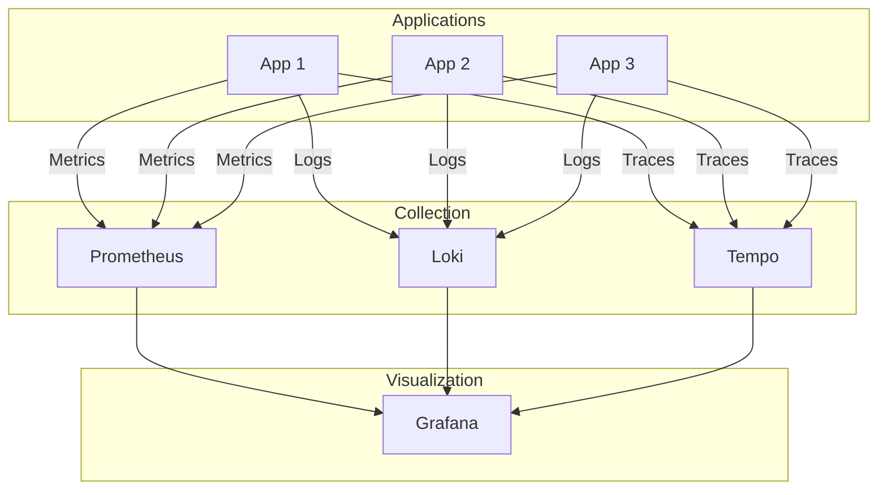

# How to Configure Observability Stack

Author: [nawazdhandala](https://www.github.com/nawazdhandala)

Tags: Observability, Monitoring, Prometheus, Grafana, Loki, Tempo, OpenTelemetry, DevOps

Description: Learn how to configure a complete observability stack with metrics, logs, and traces using Prometheus, Grafana, Loki, and Tempo.

---

A proper observability stack gives you visibility into what your applications are doing in production. This guide covers setting up a complete stack that handles metrics, logs, and traces. We will use the popular combination of Prometheus for metrics, Loki for logs, Tempo for traces, and Grafana for visualization.

## Observability Stack Architecture

Before diving into configuration, here is how the components fit together:



## Setting Up Prometheus for Metrics

Prometheus scrapes metrics from your applications at regular intervals. Start with a basic configuration file:

```yaml
# prometheus.yml
global:
  scrape_interval: 15s          # How often to collect metrics
  evaluation_interval: 15s       # How often to evaluate alerting rules
  external_labels:
    cluster: 'production'
    environment: 'prod'

# Alerting configuration
alerting:
  alertmanagers:
    - static_configs:
        - targets:
          - alertmanager:9093

# Load alerting rules
rule_files:
  - /etc/prometheus/rules/*.yml

# Scrape configurations define what endpoints to collect metrics from
scrape_configs:
  # Prometheus monitors itself
  - job_name: 'prometheus'
    static_configs:
      - targets: ['localhost:9090']

  # Application metrics using service discovery
  - job_name: 'applications'
    kubernetes_sd_configs:
      - role: pod
    relabel_configs:
      # Only scrape pods with prometheus.io/scrape annotation
      - source_labels: [__meta_kubernetes_pod_annotation_prometheus_io_scrape]
        action: keep
        regex: true
      # Use custom port if specified
      - source_labels: [__meta_kubernetes_pod_annotation_prometheus_io_port]
        action: replace
        target_label: __address__
        regex: (.+)
        replacement: $1
      # Add pod labels as metric labels
      - action: labelmap
        regex: __meta_kubernetes_pod_label_(.+)
```

### Configuring Service Discovery

For Kubernetes environments, Prometheus can automatically discover services. Here is a more complete service discovery setup:

```yaml
scrape_configs:
  - job_name: 'kubernetes-pods'
    kubernetes_sd_configs:
      - role: pod
    relabel_configs:
      # Keep only pods with scrape annotation
      - source_labels: [__meta_kubernetes_pod_annotation_prometheus_io_scrape]
        action: keep
        regex: true

      # Use the metrics path annotation or default to /metrics
      - source_labels: [__meta_kubernetes_pod_annotation_prometheus_io_path]
        action: replace
        target_label: __metrics_path__
        regex: (.+)

      # Construct the scrape address from pod IP and port annotation
      - source_labels: [__address__, __meta_kubernetes_pod_annotation_prometheus_io_port]
        action: replace
        regex: ([^:]+)(?::\d+)?;(\d+)
        replacement: $1:$2
        target_label: __address__

      # Add useful labels from pod metadata
      - source_labels: [__meta_kubernetes_namespace]
        action: replace
        target_label: kubernetes_namespace

      - source_labels: [__meta_kubernetes_pod_name]
        action: replace
        target_label: kubernetes_pod_name

      - source_labels: [__meta_kubernetes_pod_label_app]
        action: replace
        target_label: app
```

## Setting Up Loki for Logs

Loki is designed for log aggregation without indexing the full content. Configure Loki with appropriate storage:

```yaml
# loki-config.yaml
auth_enabled: false

server:
  http_listen_port: 3100
  grpc_listen_port: 9096

common:
  path_prefix: /loki
  storage:
    filesystem:
      chunks_directory: /loki/chunks
      rules_directory: /loki/rules
  replication_factor: 1
  ring:
    instance_addr: 127.0.0.1
    kvstore:
      store: inmemory

schema_config:
  configs:
    - from: 2024-01-01
      store: boltdb-shipper
      object_store: filesystem
      schema: v12
      index:
        prefix: index_
        period: 24h

storage_config:
  boltdb_shipper:
    active_index_directory: /loki/boltdb-shipper-active
    cache_location: /loki/boltdb-shipper-cache
    shared_store: filesystem

limits_config:
  retention_period: 744h        # 31 days retention
  ingestion_rate_mb: 10
  ingestion_burst_size_mb: 20
  max_streams_per_user: 10000

compactor:
  working_directory: /loki/compactor
  shared_store: filesystem
  retention_enabled: true
```

### Configuring Promtail for Log Collection

Promtail ships logs to Loki. Configure it to collect from your applications:

```yaml
# promtail-config.yaml
server:
  http_listen_port: 9080
  grpc_listen_port: 0

positions:
  filename: /tmp/positions.yaml

clients:
  - url: http://loki:3100/loki/api/v1/push

scrape_configs:
  # Collect container logs from Kubernetes
  - job_name: kubernetes-pods
    kubernetes_sd_configs:
      - role: pod
    pipeline_stages:
      # Parse JSON logs if present
      - json:
          expressions:
            level: level
            message: msg
            timestamp: time

      # Add log level as label
      - labels:
          level:

      # Parse timestamp from log
      - timestamp:
          source: timestamp
          format: RFC3339Nano

    relabel_configs:
      # Keep pods with logging annotation
      - source_labels: [__meta_kubernetes_pod_annotation_loki_io_scrape]
        action: keep
        regex: true

      # Use namespace and pod name as labels
      - source_labels: [__meta_kubernetes_namespace]
        action: replace
        target_label: namespace

      - source_labels: [__meta_kubernetes_pod_name]
        action: replace
        target_label: pod

      - source_labels: [__meta_kubernetes_pod_label_app]
        action: replace
        target_label: app

      # Set the path to the log file
      - source_labels: [__meta_kubernetes_pod_uid, __meta_kubernetes_pod_container_name]
        target_label: __path__
        separator: /
        replacement: /var/log/pods/*$1/$2/*.log
```

## Setting Up Tempo for Traces

Tempo stores and queries distributed traces. Here is a production configuration:

```yaml
# tempo-config.yaml
server:
  http_listen_port: 3200
  grpc_listen_port: 9095

distributor:
  receivers:
    otlp:
      protocols:
        grpc:
          endpoint: 0.0.0.0:4317
        http:
          endpoint: 0.0.0.0:4318
    jaeger:
      protocols:
        thrift_http:
          endpoint: 0.0.0.0:14268
        grpc:
          endpoint: 0.0.0.0:14250

storage:
  trace:
    backend: local
    local:
      path: /var/tempo/traces
    wal:
      path: /var/tempo/wal
    pool:
      max_workers: 100
      queue_depth: 10000

compactor:
  compaction:
    block_retention: 744h       # 31 days

metrics_generator:
  registry:
    external_labels:
      source: tempo
  storage:
    path: /var/tempo/generator/wal
    remote_write:
      - url: http://prometheus:9090/api/v1/write
        send_exemplars: true

overrides:
  defaults:
    metrics_generator:
      processors: [service-graphs, span-metrics]
```

## Configuring Grafana

Grafana connects all data sources and provides dashboards. Configure the data sources:

```yaml
# grafana-datasources.yaml
apiVersion: 1

datasources:
  - name: Prometheus
    type: prometheus
    access: proxy
    url: http://prometheus:9090
    isDefault: true
    editable: false
    jsonData:
      timeInterval: 15s
      exemplarTraceIdDestinations:
        - name: traceID
          datasourceUid: tempo
          urlDisplayLabel: View Trace

  - name: Loki
    type: loki
    access: proxy
    url: http://loki:3100
    editable: false
    jsonData:
      derivedFields:
        - name: TraceID
          matcherRegex: '"traceId":"([a-f0-9]+)"'
          url: '$${__value.raw}'
          datasourceUid: tempo

  - name: Tempo
    type: tempo
    access: proxy
    url: http://tempo:3200
    uid: tempo
    editable: false
    jsonData:
      httpMethod: GET
      tracesToLogs:
        datasourceUid: loki
        tags: ['app', 'namespace']
        mappedTags: [{ key: 'service.name', value: 'app' }]
        mapTagNamesEnabled: true
        spanStartTimeShift: '-1h'
        spanEndTimeShift: '1h'
        filterByTraceID: true
        filterBySpanID: true
      tracesToMetrics:
        datasourceUid: prometheus
        tags: [{ key: 'service.name', value: 'service' }]
        queries:
          - name: Request rate
            query: 'sum(rate(traces_spanmetrics_calls_total{$$__tags}[5m]))'
          - name: Error rate
            query: 'sum(rate(traces_spanmetrics_calls_total{$$__tags,status_code="STATUS_CODE_ERROR"}[5m]))'
      serviceMap:
        datasourceUid: prometheus
```

## Application Instrumentation

Your applications need to emit telemetry data. Here is a Node.js example using OpenTelemetry:

```javascript
// tracing.js - Initialize OpenTelemetry
const { NodeSDK } = require('@opentelemetry/sdk-node');
const { getNodeAutoInstrumentations } = require('@opentelemetry/auto-instrumentations-node');
const { OTLPTraceExporter } = require('@opentelemetry/exporter-trace-otlp-grpc');
const { OTLPMetricExporter } = require('@opentelemetry/exporter-metrics-otlp-grpc');
const { PeriodicExportingMetricReader } = require('@opentelemetry/sdk-metrics');
const { Resource } = require('@opentelemetry/resources');
const { SemanticResourceAttributes } = require('@opentelemetry/semantic-conventions');

const resource = new Resource({
  [SemanticResourceAttributes.SERVICE_NAME]: process.env.SERVICE_NAME || 'my-app',
  [SemanticResourceAttributes.SERVICE_VERSION]: process.env.SERVICE_VERSION || '1.0.0',
  [SemanticResourceAttributes.DEPLOYMENT_ENVIRONMENT]: process.env.ENVIRONMENT || 'production',
});

const sdk = new NodeSDK({
  resource,
  traceExporter: new OTLPTraceExporter({
    url: process.env.OTEL_EXPORTER_OTLP_ENDPOINT || 'http://tempo:4317',
  }),
  metricReader: new PeriodicExportingMetricReader({
    exporter: new OTLPMetricExporter({
      url: process.env.OTEL_EXPORTER_OTLP_ENDPOINT || 'http://prometheus:4317',
    }),
    exportIntervalMillis: 30000,
  }),
  instrumentations: [getNodeAutoInstrumentations()],
});

sdk.start();

process.on('SIGTERM', () => {
  sdk.shutdown().finally(() => process.exit(0));
});
```

Configure structured logging that includes trace context:

```javascript
// logger.js
const winston = require('winston');
const { trace } = require('@opentelemetry/api');

const traceFormat = winston.format((info) => {
  const span = trace.getActiveSpan();
  if (span) {
    const ctx = span.spanContext();
    info.traceId = ctx.traceId;
    info.spanId = ctx.spanId;
  }
  return info;
});

const logger = winston.createLogger({
  format: winston.format.combine(
    traceFormat(),
    winston.format.timestamp(),
    winston.format.json()
  ),
  transports: [new winston.transports.Console()],
});

module.exports = logger;
```

## Kubernetes Deployment

Deploy the complete stack using Kubernetes manifests or Helm charts. Here is a Docker Compose setup for local development:

```yaml
# docker-compose.yaml
version: '3.8'

services:
  prometheus:
    image: prom/prometheus:latest
    volumes:
      - ./prometheus.yml:/etc/prometheus/prometheus.yml
      - prometheus_data:/prometheus
    command:
      - '--config.file=/etc/prometheus/prometheus.yml'
      - '--storage.tsdb.path=/prometheus'
      - '--storage.tsdb.retention.time=15d'
      - '--web.enable-remote-write-receiver'
    ports:
      - "9090:9090"

  loki:
    image: grafana/loki:latest
    volumes:
      - ./loki-config.yaml:/etc/loki/local-config.yaml
      - loki_data:/loki
    command: -config.file=/etc/loki/local-config.yaml
    ports:
      - "3100:3100"

  promtail:
    image: grafana/promtail:latest
    volumes:
      - ./promtail-config.yaml:/etc/promtail/config.yml
      - /var/log:/var/log
    command: -config.file=/etc/promtail/config.yml

  tempo:
    image: grafana/tempo:latest
    volumes:
      - ./tempo-config.yaml:/etc/tempo/tempo.yaml
      - tempo_data:/var/tempo
    command: -config.file=/etc/tempo/tempo.yaml
    ports:
      - "3200:3200"
      - "4317:4317"
      - "4318:4318"

  grafana:
    image: grafana/grafana:latest
    volumes:
      - ./grafana-datasources.yaml:/etc/grafana/provisioning/datasources/datasources.yaml
      - grafana_data:/var/lib/grafana
    environment:
      - GF_AUTH_ANONYMOUS_ENABLED=true
      - GF_AUTH_ANONYMOUS_ORG_ROLE=Admin
    ports:
      - "3000:3000"
    depends_on:
      - prometheus
      - loki
      - tempo

volumes:
  prometheus_data:
  loki_data:
  tempo_data:
  grafana_data:
```

## Alerting Rules

Set up alerts in Prometheus for critical conditions:

```yaml
# alerts.yml
groups:
  - name: application-alerts
    rules:
      - alert: HighErrorRate
        expr: |
          sum(rate(http_requests_total{status=~"5.."}[5m])) by (service)
          /
          sum(rate(http_requests_total[5m])) by (service)
          > 0.05
        for: 5m
        labels:
          severity: critical
        annotations:
          summary: "High error rate detected"
          description: "Service {{ $labels.service }} has error rate above 5%"

      - alert: HighLatency
        expr: |
          histogram_quantile(0.95, sum(rate(http_request_duration_seconds_bucket[5m])) by (service, le))
          > 1
        for: 5m
        labels:
          severity: warning
        annotations:
          summary: "High latency detected"
          description: "Service {{ $labels.service }} p95 latency is above 1 second"

      - alert: ServiceDown
        expr: up == 0
        for: 1m
        labels:
          severity: critical
        annotations:
          summary: "Service is down"
          description: "{{ $labels.job }} has been down for more than 1 minute"
```

## Summary

A complete observability stack requires coordination between metrics, logs, and traces. Prometheus handles metrics collection with powerful querying. Loki provides log aggregation without expensive full-text indexing. Tempo stores distributed traces efficiently. Grafana ties everything together with correlated dashboards. The key is proper instrumentation in your applications and correct configuration to enable correlation between signals. Start with basic configuration, then expand as you understand your observability needs better.
