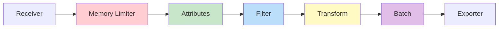
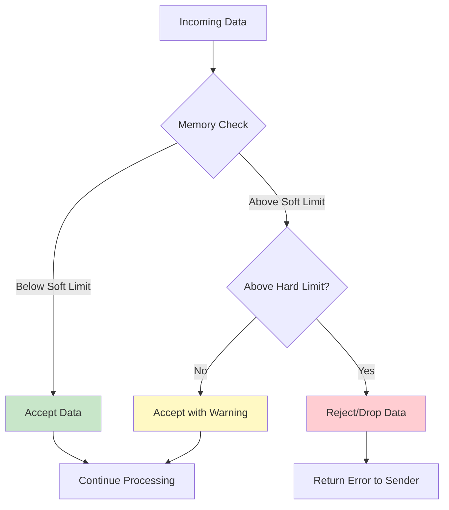
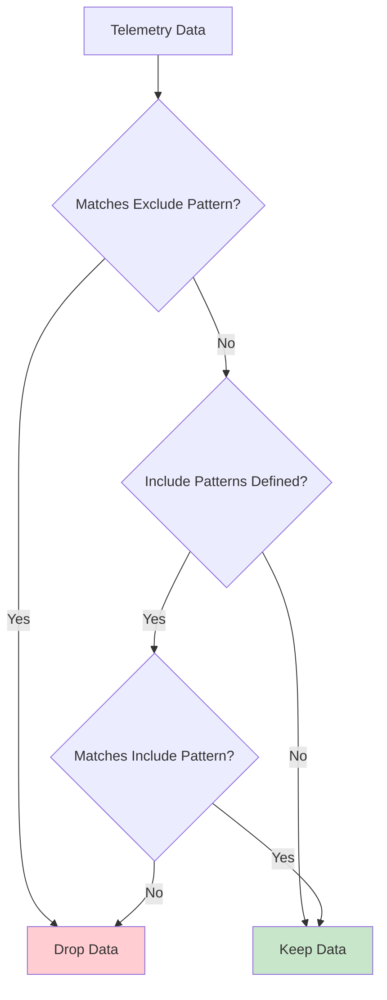
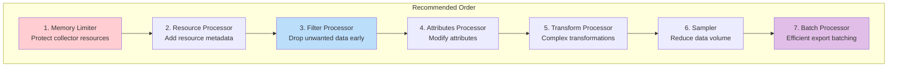

# How to Configure OpenTelemetry Processors

Author: [nawazdhandala](https://www.github.com/nawazdhandala)

Tags: OpenTelemetry, Collector, Processors, Configuration, Observability, Performance

Description: A comprehensive guide to configuring OpenTelemetry Collector processors for filtering, transforming, and optimizing telemetry data.

---

Processors are a critical component of the OpenTelemetry Collector pipeline. They sit between receivers and exporters, allowing you to transform, filter, enrich, and batch telemetry data before it reaches your backend. This guide covers the most important processors and how to configure them effectively.

## Understanding the Processor Pipeline

Processors are applied in the order they are listed in your pipeline configuration. The sequence matters because each processor transforms the data before passing it to the next.



## Essential Processors

### 1. Memory Limiter Processor

The memory limiter processor prevents the collector from running out of memory. It should always be the first processor in your pipeline.

```yaml
processors:
  # Memory limiter prevents OOM by applying backpressure
  memory_limiter:
    # How often to check memory usage
    check_interval: 1s

    # Hard limit - collector will drop data above this
    limit_mib: 512

    # Soft limit - collector will start refusing data before hitting hard limit
    # This gives time for GC to run before hitting the hard limit
    spike_limit_mib: 128

    # Alternative: percentage-based limits (useful in containerized environments)
    # limit_percentage: 75
    # spike_limit_percentage: 25
```

The memory limiter works by monitoring memory usage and applying backpressure:



### 2. Batch Processor

The batch processor groups telemetry data for more efficient export. It should typically be the last processor before the exporter.

```yaml
processors:
  batch:
    # Maximum time to wait before sending a batch
    # Shorter timeout = lower latency, higher overhead
    timeout: 5s

    # Target number of spans/metrics/logs per batch
    # Larger batches = better efficiency, higher latency
    send_batch_size: 1000

    # Maximum batch size - prevents batches from growing too large
    send_batch_max_size: 1500

  # Alternative configuration for high-throughput scenarios
  batch/high-throughput:
    timeout: 10s
    send_batch_size: 5000
    send_batch_max_size: 10000

  # Configuration for low-latency scenarios
  batch/low-latency:
    timeout: 1s
    send_batch_size: 100
    send_batch_max_size: 200
```

### 3. Attributes Processor

The attributes processor modifies span, metric, and log attributes. Use it to add, update, delete, or hash attribute values.

```yaml
processors:
  attributes:
    actions:
      # Add a new attribute to all telemetry
      - key: environment
        value: production
        action: insert  # Only adds if key doesn't exist

      # Update an existing attribute
      - key: http.url
        action: update  # Only updates if key exists
        value: "redacted"

      # Upsert - insert if missing, update if present
      - key: service.version
        action: upsert
        value: "2.0.0"

      # Delete sensitive attributes
      - key: user.password
        action: delete

      # Hash sensitive data instead of removing it
      - key: user.email
        action: hash

      # Extract part of a value using regex
      - key: http.url
        pattern: ^https?://[^/]+(?P<path>/[^?]*)
        action: extract

  # Attributes processor with conditions
  attributes/conditional:
    actions:
      - key: db.statement
        action: delete
        # Only apply to spans matching these conditions
        include:
          match_type: regexp
          span_names:
            - ".*database.*"
            - ".*query.*"
```

### 4. Filter Processor

The filter processor drops telemetry that matches (or does not match) specified criteria. This is useful for reducing costs and noise.

```yaml
processors:
  # Filter traces
  filter/traces:
    traces:
      span:
        # Drop health check spans
        - 'attributes["http.route"] == "/health"'
        - 'attributes["http.route"] == "/ready"'
        # Drop spans shorter than 1ms (likely not interesting)
        - 'duration < 1000000'  # nanoseconds

  # Filter metrics
  filter/metrics:
    metrics:
      metric:
        # Drop specific metrics by name
        - 'name == "system.cpu.utilization"'
        # Drop metrics with specific labels
        - 'resource.attributes["service.name"] == "test-service"'

  # Filter logs
  filter/logs:
    logs:
      log_record:
        # Drop debug logs
        - 'severity_number < 9'  # Below INFO level
        # Drop logs from specific services
        - 'resource.attributes["service.name"] == "noisy-service"'

  # Using include instead of exclude (whitelist approach)
  filter/include-only:
    traces:
      span:
        include:
          match_type: strict
          services:
            - "critical-service"
            - "payment-service"
```

Filtering decision flow:



### 5. Resource Processor

The resource processor modifies resource attributes that describe the entity producing telemetry.

```yaml
processors:
  resource:
    attributes:
      # Add deployment information
      - key: deployment.environment
        value: "production"
        action: insert

      # Add cloud provider metadata
      - key: cloud.provider
        value: "aws"
        action: insert

      - key: cloud.region
        value: "${AWS_REGION}"
        action: insert

      # Rename attributes to match conventions
      - key: k8s.pod.name
        from_attribute: pod_name
        action: insert

      # Delete unwanted resource attributes
      - key: host.name
        action: delete
```

### 6. Transform Processor

The transform processor uses the OpenTelemetry Transformation Language (OTTL) for complex transformations.

```yaml
processors:
  transform:
    # Transform trace data
    trace_statements:
      - context: span
        statements:
          # Truncate long attribute values
          - truncate_all(attributes, 256)

          # Set span name based on attributes
          - set(name, Concat([attributes["http.method"], " ", attributes["http.route"]])) where attributes["http.route"] != nil

          # Convert status code
          - set(status.code, 2) where attributes["http.status_code"] >= 500

          # Add computed attribute
          - set(attributes["latency_class"], "slow") where duration > 1000000000
          - set(attributes["latency_class"], "fast") where duration <= 1000000000

    # Transform metric data
    metric_statements:
      - context: datapoint
        statements:
          # Scale metric values
          - set(value_double, value_double * 1000) where metric.name == "response_time_seconds"

          # Add labels
          - set(attributes["normalized"], true)

    # Transform log data
    log_statements:
      - context: log
        statements:
          # Parse JSON body
          - merge_maps(attributes, ParseJSON(body), "insert") where IsMatch(body, "^\\{")

          # Mask sensitive data
          - replace_pattern(body, "password=\\w+", "password=***")
          - replace_pattern(body, "\\b[A-Za-z0-9._%+-]+@[A-Za-z0-9.-]+\\.[A-Z|a-z]{2,}\\b", "***@***.***")
```

### 7. Span Processor

The span processor modifies span names and extracts attributes from span names.

```yaml
processors:
  span:
    # Rename spans using attributes
    name:
      from_attributes:
        - http.method
        - http.route
      separator: " "

    # Extract attributes from span name using regex
    # Example: "GET /users/123" -> method="GET", user_id="123"
    name:
      to_attributes:
        rules:
          - ^(?P<http_method>\w+)\s+/users/(?P<user_id>\d+)$
```

### 8. Probabilistic Sampler Processor

The probabilistic sampler reduces data volume by sampling a percentage of traces.

```yaml
processors:
  probabilistic_sampler:
    # Sample 10% of traces
    sampling_percentage: 10

    # Use trace ID for consistent sampling
    # Same trace ID always gets same sampling decision
    hash_seed: 22

  # Alternative: tail-based sampling for more intelligent decisions
  tail_sampling:
    # How long to wait for a trace to complete
    decision_wait: 10s
    # Number of traces to keep in memory
    num_traces: 100000
    # Expected new traces per second
    expected_new_traces_per_sec: 1000

    policies:
      # Always sample errors
      - name: errors
        type: status_code
        status_code:
          status_codes: [ERROR]

      # Always sample slow traces
      - name: slow-traces
        type: latency
        latency:
          threshold_ms: 5000

      # Sample 10% of everything else
      - name: probabilistic
        type: probabilistic
        probabilistic:
          sampling_percentage: 10
```

## Complete Configuration Example

Here is a complete configuration that demonstrates a well-structured processor pipeline:

```yaml
# otel-collector-config.yaml

receivers:
  otlp:
    protocols:
      grpc:
        endpoint: 0.0.0.0:4317
      http:
        endpoint: 0.0.0.0:4318

processors:
  # 1. Memory protection - ALWAYS FIRST
  memory_limiter:
    check_interval: 1s
    limit_mib: 1024
    spike_limit_mib: 256

  # 2. Add resource attributes
  resource:
    attributes:
      - key: deployment.environment
        value: "${ENVIRONMENT:-development}"
        action: insert
      - key: collector.version
        value: "1.0.0"
        action: insert

  # 3. Filter out unwanted telemetry
  filter/drop-noise:
    traces:
      span:
        - 'attributes["http.route"] == "/health"'
        - 'attributes["http.route"] == "/metrics"'
        - 'attributes["http.route"] == "/ready"'
    logs:
      log_record:
        - 'severity_number < 9'
        - 'body == "Health check passed"'

  # 4. Modify attributes
  attributes/sanitize:
    actions:
      - key: db.statement
        action: hash
      - key: user.email
        action: hash
      - key: authorization
        action: delete

  # 5. Transform data
  transform/enrich:
    trace_statements:
      - context: span
        statements:
          - set(attributes["processed_at"], Now())
          - set(attributes["latency_ms"], duration / 1000000)
    log_statements:
      - context: log
        statements:
          - set(attributes["collector.processed"], true)

  # 6. Sample to reduce volume
  probabilistic_sampler:
    sampling_percentage: 25

  # 7. Batch for efficient export - ALWAYS LAST
  batch:
    timeout: 5s
    send_batch_size: 1000
    send_batch_max_size: 1500

exporters:
  otlphttp:
    endpoint: https://api.oneuptime.com
    headers:
      x-oneuptime-token: "${ONEUPTIME_TOKEN}"

  debug:
    verbosity: detailed

service:
  pipelines:
    traces:
      receivers: [otlp]
      processors:
        - memory_limiter      # First: protect memory
        - resource            # Add resource info
        - filter/drop-noise   # Remove unwanted data
        - attributes/sanitize # Clean sensitive data
        - transform/enrich    # Add computed fields
        - probabilistic_sampler  # Reduce volume
        - batch               # Last: batch for export
      exporters: [otlphttp]

    metrics:
      receivers: [otlp]
      processors:
        - memory_limiter
        - resource
        - batch
      exporters: [otlphttp]

    logs:
      receivers: [otlp]
      processors:
        - memory_limiter
        - resource
        - filter/drop-noise
        - attributes/sanitize
        - transform/enrich
        - batch
      exporters: [otlphttp]
```

## Processor Ordering Best Practices



Key ordering principles:

1. **Memory Limiter First**: Prevents OOM before any processing
2. **Filter Early**: Drop unwanted data before spending resources processing it
3. **Transform After Filter**: Only transform data you plan to keep
4. **Sample After Transform**: Ensures sampled data has all transformations applied
5. **Batch Last**: Collect processed data into efficient batches for export

## Summary

OpenTelemetry processors provide powerful capabilities for transforming telemetry data in your collection pipeline. The key to effective processor configuration is understanding the purpose of each processor type and ordering them correctly. Always start with memory protection, filter early to reduce load, apply transformations to the data you need, and batch at the end for efficient export. Use the transform processor's OTTL language for complex transformations that cannot be achieved with simpler processors.

**Related Reading:**

- [How to Fix "Memory Limit Exceeded" Collector Errors](https://oneuptime.com/blog/post/2026-01-24-memory-limit-exceeded-collector/view)
- [How to Fix "Invalid Endpoint" Collector Errors](https://oneuptime.com/blog/post/2026-01-24-invalid-endpoint-collector-errors/view)
- [How to Fix "Span Not Exported" Issues](https://oneuptime.com/blog/post/2026-01-24-span-not-exported-issues/view)
