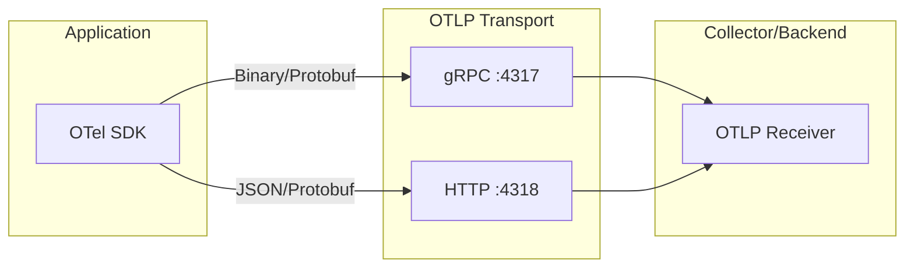

# How to Configure OpenTelemetry Protocol (OTLP)

Author: [nawazdhandala](https://www.github.com/nawazdhandala)

Tags: OpenTelemetry, OTLP, Observability, Tracing, Metrics, Logs, Configuration, Protocol

Description: A complete guide to configuring OpenTelemetry Protocol (OTLP) for exporting traces, metrics, and logs with detailed examples for various languages and scenarios.

---

OpenTelemetry Protocol (OTLP) is the native protocol for transmitting telemetry data in OpenTelemetry. It supports all three telemetry signals (traces, metrics, and logs) and provides efficient, standardized data transmission. This guide covers everything you need to know to configure OTLP correctly.

---

## Understanding OTLP

OTLP supports two transport protocols:

1. **gRPC** - Binary protocol, more efficient, better for high-throughput scenarios
2. **HTTP/1.1** - JSON or Protobuf encoding, easier to debug, works through more proxies



---

## Environment Variable Configuration

The simplest way to configure OTLP is through environment variables.

```bash
# General OTLP configuration
export OTEL_EXPORTER_OTLP_ENDPOINT="https://collector.example.com:4318"
export OTEL_EXPORTER_OTLP_PROTOCOL="http/protobuf"
export OTEL_EXPORTER_OTLP_HEADERS="x-oneuptime-token=your-token"
export OTEL_EXPORTER_OTLP_TIMEOUT="30000"

# Service identification
export OTEL_SERVICE_NAME="my-service"
export OTEL_RESOURCE_ATTRIBUTES="deployment.environment=production"
```

---

## Node.js Configuration

```javascript
// tracing.js - Basic OTLP configuration for Node.js
const { NodeSDK } = require('@opentelemetry/sdk-node');
const { OTLPTraceExporter } = require('@opentelemetry/exporter-trace-otlp-http');
const { Resource } = require('@opentelemetry/resources');

const resource = new Resource({
  'service.name': process.env.OTEL_SERVICE_NAME || 'my-service',
  'deployment.environment': process.env.NODE_ENV || 'development',
});

const traceExporter = new OTLPTraceExporter({
  url: 'https://oneuptime.com/otlp/v1/traces',
  headers: {
    'x-oneuptime-token': process.env.ONEUPTIME_TOKEN,
  },
  timeoutMillis: 30000,
});

const sdk = new NodeSDK({
  resource,
  traceExporter,
});

sdk.start();
```

---

## Python Configuration

```python
# tracing.py - Basic OTLP configuration for Python
import os
from opentelemetry import trace
from opentelemetry.sdk.trace import TracerProvider
from opentelemetry.sdk.trace.export import BatchSpanProcessor
from opentelemetry.sdk.resources import Resource
from opentelemetry.exporter.otlp.proto.http.trace_exporter import OTLPSpanExporter

resource = Resource.create({
    "service.name": os.getenv("OTEL_SERVICE_NAME", "my-python-service"),
    "deployment.environment": os.getenv("ENVIRONMENT", "development"),
})

trace_exporter = OTLPSpanExporter(
    endpoint="https://oneuptime.com/otlp/v1/traces",
    headers={"x-oneuptime-token": os.getenv("ONEUPTIME_TOKEN")},
    timeout=30,
)

trace_provider = TracerProvider(resource=resource)
trace_provider.add_span_processor(BatchSpanProcessor(trace_exporter))
trace.set_tracer_provider(trace_provider)
```

---

## OpenTelemetry Collector Configuration

```yaml
# otel-collector-config.yaml
receivers:
  otlp:
    protocols:
      grpc:
        endpoint: 0.0.0.0:4317
      http:
        endpoint: 0.0.0.0:4318

exporters:
  otlphttp:
    endpoint: https://oneuptime.com/otlp
    encoding: json
    headers:
      Content-Type: application/json
      x-oneuptime-token: ${ONEUPTIME_TOKEN}
    timeout: 30s
    retry_on_failure:
      enabled: true
      initial_interval: 5s
      max_interval: 30s

service:
  pipelines:
    traces:
      receivers: [otlp]
      processors: [batch]
      exporters: [otlphttp]
```

---

## Summary

OTLP configuration involves these key decisions:

1. **Transport**: gRPC for efficiency, HTTP for compatibility
2. **Encoding**: Protobuf for production, JSON for debugging
3. **Security**: TLS for encryption, headers for authentication
4. **Reliability**: Timeouts, retries, and queues for resilience

---

## Related Reading

- [What is OpenTelemetry Collector and Why Use One](https://oneuptime.com/blog/post/2025-09-18-what-is-opentelemetry-collector-and-why-use-one/view)
