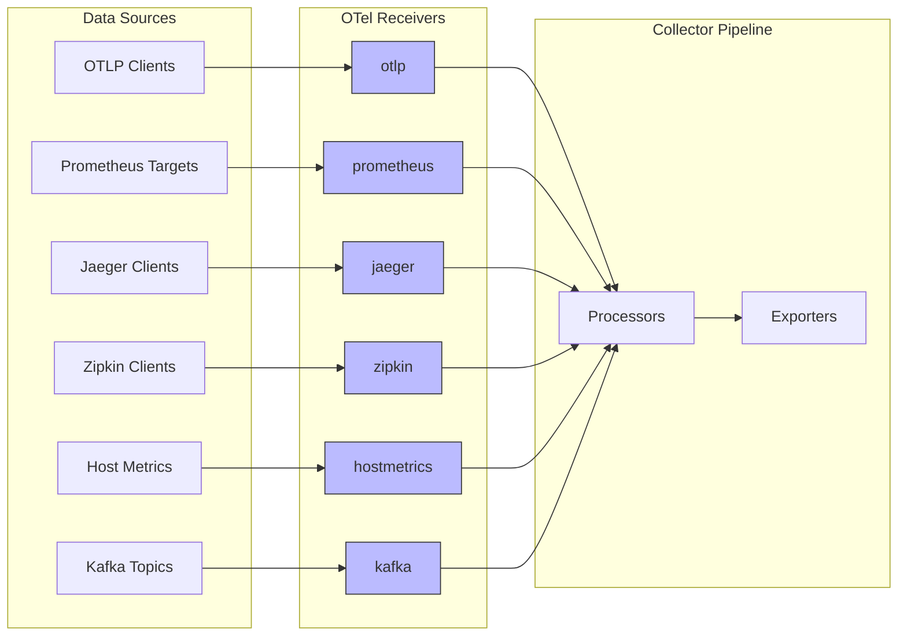
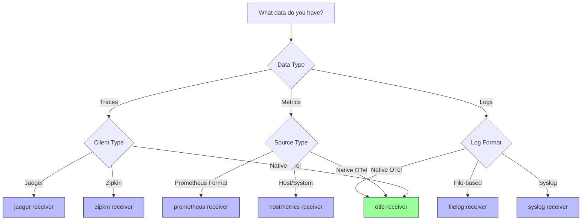

# How to Configure OpenTelemetry Receivers

Author: [nawazdhandala](https://www.github.com/nawazdhandala)

Tags: OpenTelemetry, Collector, Configuration, Receivers, Observability

Description: A comprehensive guide to configuring OpenTelemetry Collector receivers for ingesting traces, metrics, and logs from various sources.

---

OpenTelemetry Collector receivers are the entry points for telemetry data. They listen for or pull data from various sources and convert it into the OpenTelemetry internal format. This guide covers the most common receivers and their configuration options.

## Understanding Receivers Architecture



## OTLP Receiver

The OTLP receiver is the standard receiver for OpenTelemetry data. It supports both gRPC and HTTP protocols.

```yaml
# Basic OTLP receiver configuration
receivers:
  otlp:
    protocols:
      # gRPC protocol configuration
      grpc:
        # Endpoint to listen on
        endpoint: 0.0.0.0:4317

        # Maximum receive message size (default: 4MB)
        max_recv_msg_size_mib: 16

        # Maximum concurrent streams per connection
        max_concurrent_streams: 100

        # Enable gzip compression
        compression: gzip

        # TLS configuration for secure connections
        tls:
          cert_file: /certs/server.crt
          key_file: /certs/server.key
          ca_file: /certs/ca.crt
          # Require client certificates
          client_ca_file: /certs/client-ca.crt

        # Keepalive settings
        keepalive:
          server_parameters:
            max_connection_idle: 11s
            max_connection_age: 30s
            max_connection_age_grace: 5s
            time: 10s
            timeout: 20s

      # HTTP protocol configuration
      http:
        # Endpoint to listen on
        endpoint: 0.0.0.0:4318

        # CORS configuration for browser-based clients
        cors:
          allowed_origins:
            - "https://app.example.com"
            - "https://*.example.com"
          allowed_headers:
            - "Content-Type"
            - "X-Custom-Header"
          max_age: 7200

        # TLS configuration
        tls:
          cert_file: /certs/server.crt
          key_file: /certs/server.key
```

### OTLP Receiver with Authentication

```yaml
receivers:
  otlp:
    protocols:
      grpc:
        endpoint: 0.0.0.0:4317
        # Authentication using headers
        auth:
          authenticator: bearer_token

extensions:
  # Bearer token authenticator
  bearertoken:
    scheme: "Bearer"
    token: "${env:OTEL_AUTH_TOKEN}"
```

## Prometheus Receiver

The Prometheus receiver scrapes metrics from Prometheus endpoints.

```yaml
receivers:
  prometheus:
    config:
      # Global scrape configuration
      global:
        scrape_interval: 15s
        scrape_timeout: 10s
        evaluation_interval: 15s

      # Scrape configurations
      scrape_configs:
        # Scrape the collector itself
        - job_name: 'otel-collector'
          static_configs:
            - targets: ['localhost:8888']

        # Scrape application metrics
        - job_name: 'my-application'
          scrape_interval: 10s
          static_configs:
            - targets:
                - 'app-1:9090'
                - 'app-2:9090'
                - 'app-3:9090'
          # Relabel configurations
          relabel_configs:
            - source_labels: [__address__]
              target_label: instance
              regex: '([^:]+):\d+'
              replacement: '${1}'

        # Kubernetes service discovery
        - job_name: 'kubernetes-pods'
          kubernetes_sd_configs:
            - role: pod
              namespaces:
                names:
                  - production
                  - staging
          # Only scrape pods with the annotation
          relabel_configs:
            - source_labels: [__meta_kubernetes_pod_annotation_prometheus_io_scrape]
              action: keep
              regex: true
            - source_labels: [__meta_kubernetes_pod_annotation_prometheus_io_path]
              action: replace
              target_label: __metrics_path__
              regex: (.+)
            - source_labels: [__meta_kubernetes_pod_annotation_prometheus_io_port, __meta_kubernetes_pod_ip]
              action: replace
              target_label: __address__
              regex: (\d+);(.+)
              replacement: ${2}:${1}
```

## Jaeger Receiver

Accept traces from Jaeger clients using various protocols.

```yaml
receivers:
  jaeger:
    protocols:
      # gRPC protocol for jaeger-agent
      grpc:
        endpoint: 0.0.0.0:14250

      # Thrift Binary protocol
      thrift_binary:
        endpoint: 0.0.0.0:6832

      # Thrift Compact protocol
      thrift_compact:
        endpoint: 0.0.0.0:6831

      # Thrift HTTP protocol
      thrift_http:
        endpoint: 0.0.0.0:14268
```

## Host Metrics Receiver

Collect metrics from the host system.

```yaml
receivers:
  hostmetrics:
    # Collection interval
    collection_interval: 30s

    # Root path for filesystem metrics (useful in containers)
    root_path: /hostfs

    # Scrapers to enable
    scrapers:
      # CPU metrics
      cpu:
        metrics:
          system.cpu.utilization:
            enabled: true

      # Memory metrics
      memory:
        metrics:
          system.memory.utilization:
            enabled: true

      # Disk metrics
      disk:
        include:
          devices: ['sda', 'sdb', 'nvme*']
          match_type: regexp
        exclude:
          devices: ['loop*']
          match_type: regexp

      # Filesystem metrics
      filesystem:
        include:
          fs_types: ['ext4', 'xfs', 'btrfs']
          mount_points: ['/data', '/var']
        exclude:
          mount_points: ['/dev', '/proc', '/sys']

      # Load average metrics
      load:
        cpu_average: true

      # Network metrics
      network:
        include:
          interfaces: ['eth*', 'ens*']
          match_type: regexp
        exclude:
          interfaces: ['lo', 'docker*', 'veth*']
          match_type: regexp

      # Process metrics
      process:
        include:
          names: ['nginx', 'postgres', 'redis']
          match_type: regexp
        mute_process_name_error: true
        metrics:
          process.cpu.utilization:
            enabled: true
          process.memory.utilization:
            enabled: true

      # Paging/swap metrics
      paging:
```

## Kafka Receiver

Receive telemetry data from Kafka topics.

```yaml
receivers:
  kafka:
    # Kafka broker addresses
    brokers:
      - kafka-1:9092
      - kafka-2:9092
      - kafka-3:9092

    # Protocol version
    protocol_version: "2.6.0"

    # Topic to consume from
    topic: otel-traces

    # Consumer group ID
    group_id: otel-collector-traces

    # Client ID for identification
    client_id: otel-collector

    # Initial offset when no committed offset exists
    initial_offset: oldest

    # Encoding of the messages
    encoding: otlp_proto

    # Authentication
    auth:
      # SASL authentication
      sasl:
        mechanism: SCRAM-SHA-512
        username: ${env:KAFKA_USERNAME}
        password: ${env:KAFKA_PASSWORD}

      # TLS configuration
      tls:
        ca_file: /certs/kafka-ca.crt
        cert_file: /certs/kafka-client.crt
        key_file: /certs/kafka-client.key

    # Metadata configuration
    metadata:
      full: true
      retry:
        max: 3
        backoff: 250ms
```

## File Log Receiver

Read logs from files.

```yaml
receivers:
  filelog:
    # Files to read
    include:
      - /var/log/app/*.log
      - /var/log/nginx/access.log
      - /var/log/nginx/error.log

    # Files to exclude
    exclude:
      - /var/log/app/*.gz
      - /var/log/app/*.bak

    # Start reading from beginning or end of file
    start_at: end

    # Poll interval for new files
    poll_interval: 500ms

    # Maximum number of concurrent files to read
    max_concurrent_files: 1024

    # Multiline configuration for stack traces
    multiline:
      line_start_pattern: '^\d{4}-\d{2}-\d{2}'

    # Operators for parsing
    operators:
      # Parse JSON logs
      - type: json_parser
        if: 'body matches "^\\{"'
        parse_from: body
        timestamp:
          parse_from: attributes.timestamp
          layout: '%Y-%m-%dT%H:%M:%S.%fZ'

      # Parse plain text logs
      - type: regex_parser
        if: 'body matches "^\\d{4}-\\d{2}-\\d{2}"'
        regex: '^(?P<timestamp>\d{4}-\d{2}-\d{2} \d{2}:\d{2}:\d{2}) \[(?P<level>\w+)\] (?P<message>.*)$'
        timestamp:
          parse_from: attributes.timestamp
          layout: '%Y-%m-%d %H:%M:%S'
        severity:
          parse_from: attributes.level
          mapping:
            error: ERROR
            warn: WARN
            info: INFO
            debug: DEBUG

      # Add resource attributes
      - type: add
        field: resource.service.name
        value: my-application
```

## Zipkin Receiver

Accept traces from Zipkin clients.

```yaml
receivers:
  zipkin:
    # Endpoint to listen on
    endpoint: 0.0.0.0:9411
```

## Syslog Receiver

Receive syslog messages.

```yaml
receivers:
  syslog:
    # Protocol: tcp or udp
    protocol: tcp

    # Endpoint to listen on
    listen_address: 0.0.0.0:514

    # Syslog protocol: rfc3164 or rfc5424
    protocol_type: rfc5424

    # TLS for TCP
    tls:
      cert_file: /certs/server.crt
      key_file: /certs/server.key
```

## Complete Multi-Receiver Configuration

Here is a complete example with multiple receivers:

```yaml
# otel-collector-config.yaml
receivers:
  # OTLP for native OpenTelemetry clients
  otlp:
    protocols:
      grpc:
        endpoint: 0.0.0.0:4317
      http:
        endpoint: 0.0.0.0:4318
        cors:
          allowed_origins: ["*"]

  # Prometheus for metrics scraping
  prometheus:
    config:
      scrape_configs:
        - job_name: 'kubernetes-pods'
          kubernetes_sd_configs:
            - role: pod
          relabel_configs:
            - source_labels: [__meta_kubernetes_pod_annotation_prometheus_io_scrape]
              action: keep
              regex: true

  # Jaeger for legacy Jaeger clients
  jaeger:
    protocols:
      grpc:
        endpoint: 0.0.0.0:14250
      thrift_http:
        endpoint: 0.0.0.0:14268

  # Host metrics for infrastructure monitoring
  hostmetrics:
    collection_interval: 30s
    scrapers:
      cpu:
      memory:
      disk:
      filesystem:
      network:
      load:

  # File logs for application logs
  filelog:
    include:
      - /var/log/app/*.log
    operators:
      - type: json_parser
        parse_from: body

processors:
  # Batch processing for efficiency
  batch:
    timeout: 1s
    send_batch_size: 1024

  # Memory limiter to prevent OOM
  memory_limiter:
    check_interval: 1s
    limit_mib: 1000
    spike_limit_mib: 200

  # Resource detection
  resourcedetection:
    detectors: [env, system, docker, gcp, aws, azure]
    timeout: 5s

exporters:
  # Export to OTLP backend
  otlp:
    endpoint: backend:4317
    tls:
      insecure: false
      cert_file: /certs/client.crt
      key_file: /certs/client.key

extensions:
  # Health check endpoint
  health_check:
    endpoint: 0.0.0.0:13133

  # Performance profiling
  pprof:
    endpoint: 0.0.0.0:1777

  # Prometheus metrics for the collector itself
  zpages:
    endpoint: 0.0.0.0:55679

service:
  extensions: [health_check, pprof, zpages]

  pipelines:
    # Traces pipeline
    traces:
      receivers: [otlp, jaeger]
      processors: [memory_limiter, batch]
      exporters: [otlp]

    # Metrics pipeline
    metrics:
      receivers: [otlp, prometheus, hostmetrics]
      processors: [memory_limiter, batch]
      exporters: [otlp]

    # Logs pipeline
    logs:
      receivers: [otlp, filelog]
      processors: [memory_limiter, batch]
      exporters: [otlp]
```

## Receiver Selection Guide



## Best Practices

1. **Security First**: Always enable TLS for production receivers, especially those exposed to external networks.

2. **Resource Limits**: Configure appropriate queue sizes and memory limits to prevent the collector from being overwhelmed.

3. **Use Multiple Pipelines**: Separate traces, metrics, and logs into different pipelines for independent scaling and configuration.

4. **Monitor the Collector**: Use the health_check and zpages extensions to monitor the collector itself.

5. **Graceful Degradation**: Configure retry logic and queuing to handle temporary backend failures.

```yaml
# Example of robust receiver configuration
receivers:
  otlp:
    protocols:
      grpc:
        endpoint: 0.0.0.0:4317
        # Limit connections to prevent overload
        max_concurrent_streams: 100
        # Authentication for security
        auth:
          authenticator: bearer_token

processors:
  # Always include memory limiter first
  memory_limiter:
    check_interval: 1s
    limit_mib: 2000
    spike_limit_mib: 400
```

## Conclusion

OpenTelemetry Collector receivers provide a flexible way to ingest telemetry data from various sources. By understanding the available receivers and their configuration options, you can build a comprehensive observability pipeline that collects data from all parts of your infrastructure.

Start with the OTLP receiver for native OpenTelemetry clients, add the Prometheus receiver for existing metrics, and use specialized receivers like filelog and hostmetrics to capture additional data. Always configure security, resource limits, and monitoring to ensure reliable operation.
