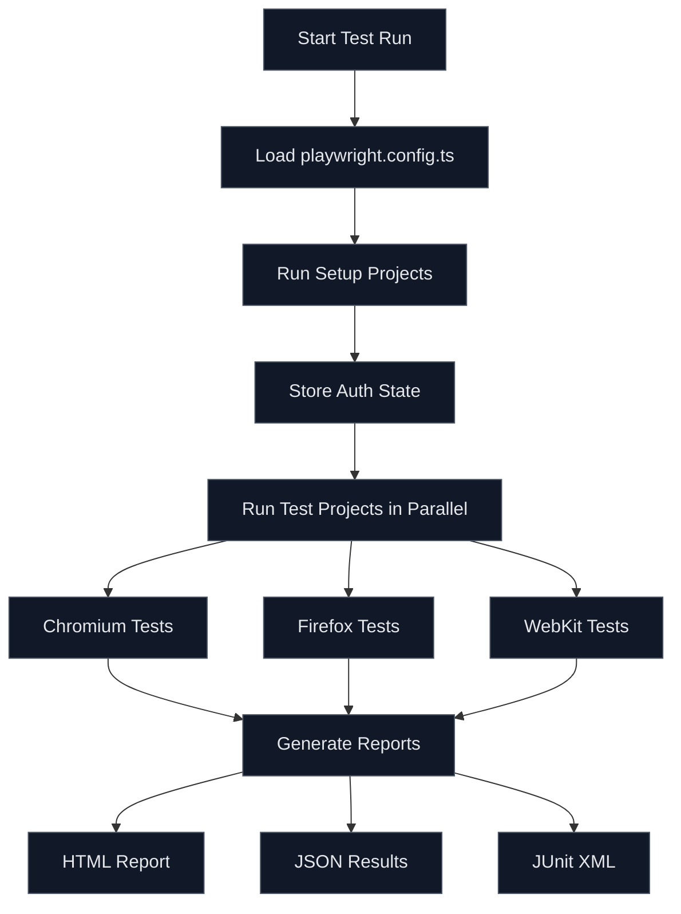

# How to Configure Playwright for E2E Testing

Author: [nawazdhandala](https://www.github.com/nawazdhandala)

Tags: Playwright, E2E Testing, Testing, Automation, JavaScript, TypeScript, CI/CD, Quality Assurance

Description: A comprehensive guide to configuring Playwright for end-to-end testing with practical examples, browser configuration, and CI/CD integration.

---

End-to-end testing validates that your application works correctly from the user's perspective. Playwright has become the go-to framework for E2E testing because it supports multiple browsers, handles modern web applications well, and provides excellent debugging tools. This guide walks you through configuring Playwright for production-ready E2E testing.

## Why Playwright for E2E Testing

Playwright offers several advantages over other testing frameworks:

- Cross-browser support (Chromium, Firefox, WebKit) with a single API
- Auto-wait functionality that eliminates flaky tests
- Built-in test isolation with browser contexts
- Powerful selectors including text, CSS, and accessibility-based
- Trace viewer for debugging failed tests
- Native support for TypeScript

## Installing Playwright

Start by installing Playwright in your project:

```bash
# Install Playwright and browsers
npm init playwright@latest

# Or add to an existing project
npm install -D @playwright/test
npx playwright install
```

The init command creates a basic configuration and example tests. It also installs the browser binaries needed for testing.

## Project Structure

A well-organized Playwright project looks like this:

```
project/
├── playwright.config.ts      # Main configuration
├── tests/
│   ├── auth.setup.ts         # Authentication setup
│   ├── home.spec.ts          # Home page tests
│   ├── checkout.spec.ts      # Checkout flow tests
│   └── fixtures/
│       └── test-data.json    # Test data
├── page-objects/
│   ├── BasePage.ts           # Base page object
│   ├── HomePage.ts           # Home page object
│   └── CheckoutPage.ts       # Checkout page object
└── .auth/
    └── user.json             # Stored auth state
```

## Core Configuration

The `playwright.config.ts` file controls all aspects of test execution. Here's a production-ready configuration:

```typescript
// playwright.config.ts
import { defineConfig, devices } from '@playwright/test';

export default defineConfig({
  // Directory containing test files
  testDir: './tests',

  // Run tests in parallel for faster execution
  fullyParallel: true,

  // Fail the build if test.only is left in code
  forbidOnly: !!process.env.CI,

  // Retry failed tests in CI environment
  retries: process.env.CI ? 2 : 0,

  // Limit parallel workers in CI to avoid resource exhaustion
  workers: process.env.CI ? 1 : undefined,

  // Reporter configuration
  reporter: [
    ['html', { open: 'never' }],
    ['json', { outputFile: 'test-results/results.json' }],
    ['junit', { outputFile: 'test-results/junit.xml' }],
  ],

  // Global test settings
  use: {
    // Base URL for all tests
    baseURL: process.env.BASE_URL || 'http://localhost:3000',

    // Capture trace on first retry for debugging
    trace: 'on-first-retry',

    // Capture screenshot on failure
    screenshot: 'only-on-failure',

    // Record video on failure
    video: 'retain-on-failure',

    // Set viewport size
    viewport: { width: 1280, height: 720 },

    // Timeout for each action (click, fill, etc.)
    actionTimeout: 10000,

    // Timeout for navigation
    navigationTimeout: 30000,
  },

  // Global timeout for each test
  timeout: 60000,

  // Configure projects for different browsers and devices
  projects: [
    // Setup project for authentication
    {
      name: 'setup',
      testMatch: /.*\.setup\.ts/,
    },

    // Desktop browsers
    {
      name: 'chromium',
      use: { ...devices['Desktop Chrome'] },
      dependencies: ['setup'],
    },
    {
      name: 'firefox',
      use: { ...devices['Desktop Firefox'] },
      dependencies: ['setup'],
    },
    {
      name: 'webkit',
      use: { ...devices['Desktop Safari'] },
      dependencies: ['setup'],
    },

    // Mobile browsers
    {
      name: 'Mobile Chrome',
      use: { ...devices['Pixel 5'] },
      dependencies: ['setup'],
    },
    {
      name: 'Mobile Safari',
      use: { ...devices['iPhone 12'] },
      dependencies: ['setup'],
    },
  ],

  // Run local dev server before tests
  webServer: {
    command: 'npm run start',
    url: 'http://localhost:3000',
    reuseExistingServer: !process.env.CI,
    timeout: 120000,
  },
});
```

## Authentication Setup

Most applications require authentication. Playwright supports storing authentication state to avoid logging in for every test:

```typescript
// tests/auth.setup.ts
import { test as setup, expect } from '@playwright/test';

const authFile = '.auth/user.json';

setup('authenticate', async ({ page }) => {
  // Navigate to login page
  await page.goto('/login');

  // Fill in credentials from environment variables
  await page.fill('[data-testid="email"]', process.env.TEST_USER_EMAIL!);
  await page.fill('[data-testid="password"]', process.env.TEST_USER_PASSWORD!);

  // Submit the form
  await page.click('[data-testid="login-button"]');

  // Wait for authentication to complete
  await page.waitForURL('/dashboard');

  // Verify we are logged in
  await expect(page.locator('[data-testid="user-menu"]')).toBeVisible();

  // Store authentication state for reuse
  await page.context().storageState({ path: authFile });
});
```

Then reference the auth state in your projects:

```typescript
// In playwright.config.ts projects array
{
  name: 'chromium',
  use: {
    ...devices['Desktop Chrome'],
    storageState: '.auth/user.json',
  },
  dependencies: ['setup'],
},
```

## Writing Effective Tests

Here's an example test file using best practices:

```typescript
// tests/checkout.spec.ts
import { test, expect } from '@playwright/test';

test.describe('Checkout Flow', () => {
  test.beforeEach(async ({ page }) => {
    // Start each test with a product in cart
    await page.goto('/products/test-product');
    await page.click('[data-testid="add-to-cart"]');
    await expect(page.locator('[data-testid="cart-count"]')).toHaveText('1');
  });

  test('should complete purchase with valid payment', async ({ page }) => {
    // Navigate to checkout
    await page.click('[data-testid="checkout-button"]');
    await expect(page).toHaveURL(/\/checkout/);

    // Fill shipping information
    await page.fill('[data-testid="shipping-address"]', '123 Test Street');
    await page.fill('[data-testid="shipping-city"]', 'Test City');
    await page.fill('[data-testid="shipping-zip"]', '12345');

    // Fill payment information
    await page.fill('[data-testid="card-number"]', '4242424242424242');
    await page.fill('[data-testid="card-expiry"]', '12/25');
    await page.fill('[data-testid="card-cvc"]', '123');

    // Submit order
    await page.click('[data-testid="place-order"]');

    // Verify success
    await expect(page).toHaveURL(/\/order-confirmation/);
    await expect(page.locator('[data-testid="order-number"]')).toBeVisible();
  });

  test('should show error for invalid card', async ({ page }) => {
    await page.goto('/checkout');

    // Fill with invalid card number
    await page.fill('[data-testid="card-number"]', '1234567890123456');
    await page.click('[data-testid="place-order"]');

    // Verify error message
    await expect(page.locator('[data-testid="payment-error"]'))
      .toContainText('Invalid card number');
  });
});
```

## Page Object Model

For larger test suites, use the Page Object Model pattern:

```typescript
// page-objects/CheckoutPage.ts
import { Page, Locator, expect } from '@playwright/test';

export class CheckoutPage {
  readonly page: Page;
  readonly addressInput: Locator;
  readonly cityInput: Locator;
  readonly zipInput: Locator;
  readonly cardNumberInput: Locator;
  readonly placeOrderButton: Locator;
  readonly orderNumber: Locator;

  constructor(page: Page) {
    this.page = page;
    this.addressInput = page.locator('[data-testid="shipping-address"]');
    this.cityInput = page.locator('[data-testid="shipping-city"]');
    this.zipInput = page.locator('[data-testid="shipping-zip"]');
    this.cardNumberInput = page.locator('[data-testid="card-number"]');
    this.placeOrderButton = page.locator('[data-testid="place-order"]');
    this.orderNumber = page.locator('[data-testid="order-number"]');
  }

  async goto() {
    await this.page.goto('/checkout');
  }

  async fillShippingInfo(address: string, city: string, zip: string) {
    await this.addressInput.fill(address);
    await this.cityInput.fill(city);
    await this.zipInput.fill(zip);
  }

  async fillPaymentInfo(cardNumber: string, expiry: string, cvc: string) {
    await this.cardNumberInput.fill(cardNumber);
    await this.page.fill('[data-testid="card-expiry"]', expiry);
    await this.page.fill('[data-testid="card-cvc"]', cvc);
  }

  async placeOrder() {
    await this.placeOrderButton.click();
  }

  async verifyOrderSuccess() {
    await expect(this.page).toHaveURL(/\/order-confirmation/);
    await expect(this.orderNumber).toBeVisible();
    return this.orderNumber.textContent();
  }
}
```

## Test Execution Flow

Understanding how Playwright executes tests helps with debugging:



## CI/CD Integration

Configure Playwright for GitHub Actions:

```yaml
# .github/workflows/e2e-tests.yml
name: E2E Tests

on:
  push:
    branches: [main]
  pull_request:
    branches: [main]

jobs:
  test:
    runs-on: ubuntu-latest
    steps:
      - uses: actions/checkout@v4

      - uses: actions/setup-node@v4
        with:
          node-version: 20

      - name: Install dependencies
        run: npm ci

      - name: Install Playwright browsers
        run: npx playwright install --with-deps

      - name: Run E2E tests
        run: npx playwright test
        env:
          BASE_URL: ${{ secrets.STAGING_URL }}
          TEST_USER_EMAIL: ${{ secrets.TEST_USER_EMAIL }}
          TEST_USER_PASSWORD: ${{ secrets.TEST_USER_PASSWORD }}

      - name: Upload test results
        if: always()
        uses: actions/upload-artifact@v4
        with:
          name: playwright-report
          path: playwright-report/
          retention-days: 30
```

## Debugging Failed Tests

When tests fail, use these debugging techniques:

```bash
# Run tests with UI mode for interactive debugging
npx playwright test --ui

# Run tests with headed browser
npx playwright test --headed

# Debug a specific test
npx playwright test checkout.spec.ts --debug

# View the trace of a failed test
npx playwright show-trace test-results/checkout-should-complete-purchase/trace.zip
```

## Best Practices

1. **Use data-testid attributes** for reliable element selection
2. **Avoid hardcoded waits** - use Playwright's auto-wait instead
3. **Keep tests independent** - each test should set up its own state
4. **Use environment variables** for sensitive data and URLs
5. **Run tests in parallel** but isolate shared resources
6. **Capture artifacts on failure** for debugging CI failures
7. **Test critical paths first** - login, checkout, core features

Playwright's configuration flexibility and powerful features make it an excellent choice for E2E testing. Start with a simple configuration and add complexity as your test suite grows. The key is maintaining fast, reliable tests that give you confidence in your deployments.
