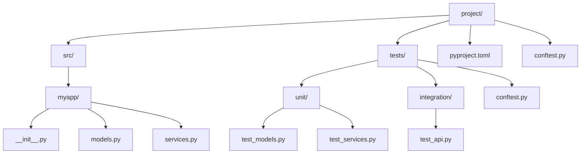

# How to Configure pytest for Python Testing

Author: [nawazdhandala](https://www.github.com/nawazdhandala)

Tags: Python, pytest, Testing, Configuration, Fixtures, Unit Tests, Test Automation, CI/CD

Description: Learn how to configure pytest for effective Python testing, including project setup, fixtures, plugins, markers, and CI/CD integration.

---

> pytest is the most popular testing framework for Python, offering powerful features like fixtures, parametrization, and a rich plugin ecosystem. Proper configuration makes your test suite faster and more maintainable.

This guide covers everything you need to configure pytest for projects of any size.

---

## Project Structure



---

## Basic Configuration

### pyproject.toml (Recommended)

```toml
# pyproject.toml
# Modern Python project configuration

[project]
name = "myapp"
version = "1.0.0"
requires-python = ">=3.9"

[tool.pytest.ini_options]
# Minimum pytest version
minversion = "7.0"

# Add current directory to Python path
pythonpath = ["src"]

# Default options for pytest
addopts = [
    "-ra",                    # Show summary of all tests
    "-q",                     # Quiet mode
    "--strict-markers",       # Error on unknown markers
    "--strict-config",        # Error on config issues
    "-v",                     # Verbose output
]

# Test file patterns
testpaths = ["tests"]
python_files = ["test_*.py", "*_test.py"]
python_classes = ["Test*"]
python_functions = ["test_*"]

# Register custom markers
markers = [
    "slow: marks tests as slow (deselect with '-m \"not slow\"')",
    "integration: marks tests as integration tests",
    "unit: marks tests as unit tests",
]

# Ignore specific warnings
filterwarnings = [
    "ignore::DeprecationWarning",
    "ignore::PendingDeprecationWarning",
]

# Coverage configuration
[tool.coverage.run]
source = ["src"]
branch = true
omit = [
    "*/tests/*",
    "*/__pycache__/*",
]

[tool.coverage.report]
exclude_lines = [
    "pragma: no cover",
    "def __repr__",
    "raise NotImplementedError",
    "if __name__ == .__main__.:",
]
```

### Alternative: pytest.ini

```ini
# pytest.ini
# Traditional pytest configuration file

[pytest]
minversion = 7.0
addopts = -ra -q --strict-markers
testpaths = tests
python_files = test_*.py
python_classes = Test*
python_functions = test_*

markers =
    slow: marks tests as slow
    integration: integration tests
    unit: unit tests

filterwarnings =
    ignore::DeprecationWarning
```

---

## Fixtures Configuration

### conftest.py at Project Root

```python
# conftest.py
# Shared fixtures available to all tests

import pytest
import os
from pathlib import Path

# Make fixtures available project-wide
pytest_plugins = [
    "tests.fixtures.database",
    "tests.fixtures.api",
]


@pytest.fixture(scope="session")
def project_root():
    """Return the project root directory."""
    return Path(__file__).parent


@pytest.fixture(scope="session")
def test_data_dir(project_root):
    """Return the test data directory."""
    return project_root / "tests" / "data"


@pytest.fixture
def sample_user_data():
    """Sample user data for tests."""
    return {
        "email": "test@example.com",
        "username": "testuser",
        "password": "securepassword123"
    }
```

### conftest.py in tests/ Directory

```python
# tests/conftest.py
# Test-specific fixtures

import pytest
from unittest.mock import Mock, patch
import tempfile
import os


@pytest.fixture
def temp_directory():
    """Create a temporary directory for test files."""
    with tempfile.TemporaryDirectory() as tmpdir:
        original_cwd = os.getcwd()
        os.chdir(tmpdir)
        yield tmpdir
        os.chdir(original_cwd)


@pytest.fixture
def mock_external_api():
    """Mock external API calls."""
    with patch("myapp.services.external_api") as mock:
        mock.get_data.return_value = {"status": "success"}
        mock.post_data.return_value = {"id": 123}
        yield mock


@pytest.fixture(scope="module")
def database_connection():
    """Database connection for the test module."""
    from myapp.database import create_connection

    conn = create_connection(":memory:")
    conn.execute("CREATE TABLE users (id INTEGER PRIMARY KEY, email TEXT)")

    yield conn

    conn.close()


@pytest.fixture
def db_session(database_connection):
    """Fresh database session with rollback."""
    database_connection.execute("BEGIN")
    yield database_connection
    database_connection.execute("ROLLBACK")
```

---

## Running Tests with Options

```bash
# Run all tests
pytest

# Run with verbose output
pytest -v

# Run specific test file
pytest tests/unit/test_models.py

# Run specific test function
pytest tests/unit/test_models.py::test_user_creation

# Run tests matching pattern
pytest -k "user and not slow"

# Run tests with specific marker
pytest -m integration

# Run tests excluding marker
pytest -m "not slow"

# Run with coverage
pytest --cov=src --cov-report=html

# Run in parallel (requires pytest-xdist)
pytest -n auto

# Stop on first failure
pytest -x

# Show local variables in tracebacks
pytest -l

# Drop into debugger on failure
pytest --pdb
```

---

## Essential Plugins

### Install Common Plugins

```bash
pip install pytest-cov        # Coverage reporting
pip install pytest-xdist      # Parallel execution
pip install pytest-randomly   # Random test order
pip install pytest-timeout    # Test timeouts
pip install pytest-mock       # Better mocking
pip install pytest-asyncio    # Async test support
```

### Configure Plugins in pyproject.toml

```toml
# pyproject.toml

[tool.pytest.ini_options]
# pytest-asyncio configuration
asyncio_mode = "auto"

# pytest-timeout configuration
timeout = 300  # 5 minute default timeout

# pytest-xdist configuration
addopts = [
    "-n", "auto",  # Use all CPU cores
]
```

---

## Parametrized Tests

```python
# tests/test_parametrized.py
# Examples of parametrized tests

import pytest

# Basic parametrization
@pytest.mark.parametrize("input,expected", [
    (1, 2),
    (2, 4),
    (3, 6),
    (0, 0),
    (-1, -2),
])
def test_double(input, expected):
    assert input * 2 == expected


# Multiple parameters
@pytest.mark.parametrize("a,b,expected", [
    (1, 1, 2),
    (2, 3, 5),
    (10, 20, 30),
])
def test_addition(a, b, expected):
    assert a + b == expected


# Parametrize with IDs for better output
@pytest.mark.parametrize("email,valid", [
    ("user@example.com", True),
    ("invalid-email", False),
    ("user@.com", False),
    ("@example.com", False),
], ids=["valid_email", "no_at_symbol", "missing_domain", "missing_user"])
def test_email_validation(email, valid):
    from myapp.validators import is_valid_email
    assert is_valid_email(email) == valid


# Combine multiple parametrize decorators
@pytest.mark.parametrize("base", [2, 10])
@pytest.mark.parametrize("exponent", [0, 1, 2])
def test_power(base, exponent):
    result = base ** exponent
    assert result == pow(base, exponent)
```

---

## Async Test Configuration

```python
# tests/test_async.py
# Testing async code with pytest-asyncio

import pytest
import asyncio

# Mark individual tests as async
@pytest.mark.asyncio
async def test_async_function():
    result = await async_fetch_data()
    assert result is not None


# Use async fixtures
@pytest.fixture
async def async_client():
    """Async HTTP client fixture."""
    import aiohttp
    async with aiohttp.ClientSession() as session:
        yield session


@pytest.mark.asyncio
async def test_api_call(async_client):
    async with async_client.get("http://localhost:8000/health") as response:
        assert response.status == 200


# Test async context managers
@pytest.mark.asyncio
async def test_async_context_manager():
    async with DatabaseConnection() as conn:
        result = await conn.execute("SELECT 1")
        assert result == 1
```

---

## Custom Markers

```python
# tests/conftest.py
# Custom marker configuration

import pytest
import sys

def pytest_configure(config):
    """Register custom markers."""
    config.addinivalue_line("markers", "slow: mark test as slow running")
    config.addinivalue_line("markers", "integration: mark as integration test")
    config.addinivalue_line("markers", "requires_db: mark as requiring database")


def pytest_collection_modifyitems(config, items):
    """Modify test collection based on markers."""

    # Skip integration tests unless explicitly requested
    if not config.getoption("--run-integration"):
        skip_integration = pytest.mark.skip(reason="need --run-integration option")
        for item in items:
            if "integration" in item.keywords:
                item.add_marker(skip_integration)


def pytest_addoption(parser):
    """Add custom command line options."""
    parser.addoption(
        "--run-integration",
        action="store_true",
        default=False,
        help="run integration tests"
    )
    parser.addoption(
        "--run-slow",
        action="store_true",
        default=False,
        help="run slow tests"
    )
```

Using markers in tests:

```python
# tests/test_with_markers.py

import pytest

@pytest.mark.slow
def test_complex_calculation():
    """This test takes a long time."""
    result = expensive_computation()
    assert result is not None


@pytest.mark.integration
def test_database_connection():
    """Requires real database."""
    conn = connect_to_database()
    assert conn.is_connected()


@pytest.mark.requires_db
@pytest.mark.integration
def test_full_workflow():
    """Full integration test."""
    pass
```

---

## CI/CD Configuration

### GitHub Actions

```yaml
# .github/workflows/test.yml

name: Tests

on:
  push:
    branches: [main, develop]
  pull_request:
    branches: [main]

jobs:
  test:
    runs-on: ubuntu-latest
    strategy:
      matrix:
        python-version: ['3.9', '3.10', '3.11', '3.12']

    steps:
      - uses: actions/checkout@v4

      - name: Set up Python ${{ matrix.python-version }}
        uses: actions/setup-python@v5
        with:
          python-version: ${{ matrix.python-version }}

      - name: Install dependencies
        run: |
          python -m pip install --upgrade pip
          pip install -e ".[test]"

      - name: Run tests
        run: |
          pytest --cov=src --cov-report=xml -v

      - name: Upload coverage
        uses: codecov/codecov-action@v3
        with:
          files: ./coverage.xml
```

---

## Quick Reference

| Command | Description |
|---------|-------------|
| `pytest` | Run all tests |
| `pytest -v` | Verbose output |
| `pytest -x` | Stop on first failure |
| `pytest -k "name"` | Filter by name |
| `pytest -m marker` | Filter by marker |
| `pytest --cov=src` | With coverage |
| `pytest -n auto` | Parallel execution |
| `pytest --pdb` | Debug on failure |

---

*Need to monitor your test suite performance in CI/CD? [OneUptime](https://oneuptime.com) provides comprehensive monitoring with test result tracking and alerting.*

**Related Reading:**
- [How to Fix "Assertion" Failures in Tests](/blog/post/2026-01-24-fix-assertion-failures-tests/view)
- [How to Fix "Test Dependency" Issues](/blog/post/2026-01-24-fix-test-dependency-issues/view)
