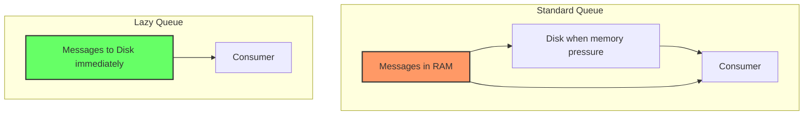
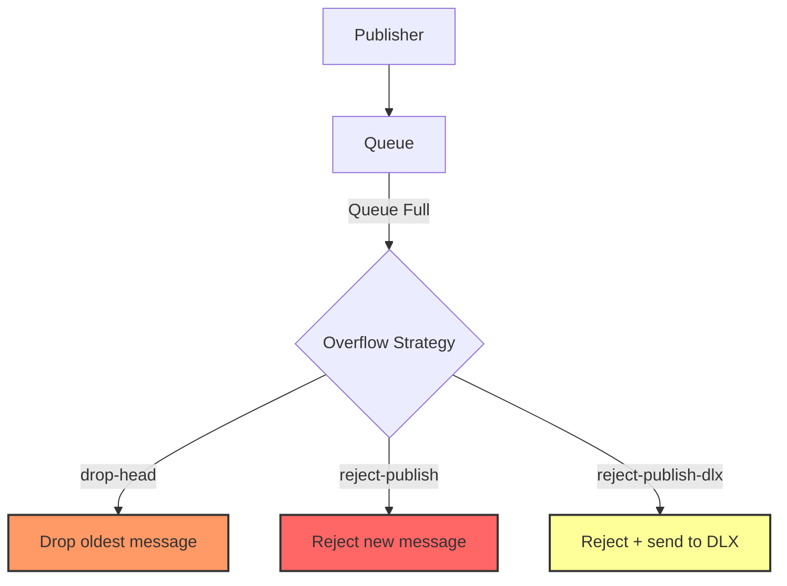
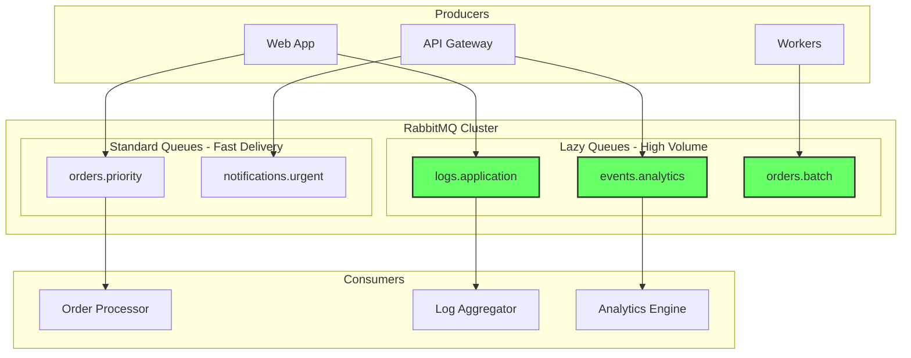

# How to Configure RabbitMQ Lazy Queues

Author: [nawazdhandala](https://www.github.com/nawazdhandala)

Tags: RabbitMQ, Message Queue, Performance, Memory Management, DevOps, Messaging, Queue Configuration

Description: Learn how to configure RabbitMQ lazy queues to optimize memory usage for high-volume messaging scenarios by storing messages on disk instead of RAM.

---

> Lazy queues in RabbitMQ store messages on disk as early as possible, reducing RAM usage significantly. This guide covers when and how to configure lazy queues for optimal performance.

Standard RabbitMQ queues keep messages in memory for fast delivery. However, when dealing with millions of messages or memory-constrained environments, lazy queues offer a better alternative by writing messages to disk immediately.

---

## Understanding Lazy Queues

### Standard vs Lazy Queues



### When to Use Lazy Queues

| Scenario | Standard Queue | Lazy Queue |
|----------|---------------|------------|
| High message volume | Memory pressure | Stable memory |
| Burst traffic | May trigger flow control | Handles gracefully |
| Long message retention | High RAM usage | Minimal RAM |
| Consumer downtime | Memory builds up | Disk handles it |
| Low latency required | Better | Slightly slower |

---

## Configuring Lazy Queues

### Method 1: Queue Declaration Arguments

```python
import pika

connection = pika.BlockingConnection(pika.ConnectionParameters('localhost'))
channel = connection.channel()

# Declare a lazy queue using x-queue-mode argument
channel.queue_declare(
    queue='orders-lazy',
    durable=True,
    arguments={
        'x-queue-mode': 'lazy'  # Messages stored on disk immediately
    }
)

print("Lazy queue created successfully")
```

### Method 2: Using RabbitMQ Policies

Policies allow you to configure lazy queues without changing application code:

```bash
# Create a policy to make all queues matching pattern lazy
rabbitmqctl set_policy lazy-queues \
    "^lazy\." \
    '{"queue-mode":"lazy"}' \
    --priority 1 \
    --apply-to queues

# Example: Make all order queues lazy
rabbitmqctl set_policy order-queues-lazy \
    "^orders\." \
    '{"queue-mode":"lazy"}' \
    --priority 1 \
    --apply-to queues
```

Using the HTTP API:

```bash
# Create policy via HTTP API
curl -u guest:guest -X PUT \
    -H "Content-Type: application/json" \
    -d '{"pattern":"^lazy\\.", "definition":{"queue-mode":"lazy"}, "apply-to":"queues"}' \
    http://localhost:15672/api/policies/%2F/lazy-queues
```

### Method 3: Default Queue Mode in Configuration

```ini
# rabbitmq.conf - Set default queue mode for all new queues
# Note: This affects ALL queues unless overridden

queue.default_queue_mode = lazy
```

---

## RabbitMQ 3.12+ Quorum Queues

In RabbitMQ 3.12 and later, classic queue modes are deprecated. Use quorum queues instead:

```python
import pika

connection = pika.BlockingConnection(pika.ConnectionParameters('localhost'))
channel = connection.channel()

# Quorum queues with lazy-like behavior
channel.queue_declare(
    queue='orders-quorum',
    durable=True,
    arguments={
        'x-queue-type': 'quorum',  # Quorum queue type
        'x-max-in-memory-length': 0,  # Keep 0 messages in memory (lazy-like)
        'x-max-in-memory-bytes': 0,   # Keep 0 bytes in memory
    }
)

print("Quorum queue with lazy behavior created")
```

---

## Memory Management Configuration

### Setting Memory Limits

```python
import pika

connection = pika.BlockingConnection(pika.ConnectionParameters('localhost'))
channel = connection.channel()

# Lazy queue with additional memory settings
channel.queue_declare(
    queue='high-volume-queue',
    durable=True,
    arguments={
        'x-queue-mode': 'lazy',
        'x-max-length': 1000000,        # Maximum 1M messages
        'x-max-length-bytes': 1073741824,  # Maximum 1GB total size
        'x-overflow': 'reject-publish',  # Reject new messages when full
    }
)
```

### Queue Length Limits with Overflow Strategies



```python
# Different overflow strategies
overflow_strategies = {
    'drop-head': 'Drop oldest messages when queue is full',
    'reject-publish': 'Reject new messages when queue is full',
    'reject-publish-dlx': 'Reject and send to dead letter exchange'
}

# Queue with drop-head overflow
channel.queue_declare(
    queue='logs-queue',
    durable=True,
    arguments={
        'x-queue-mode': 'lazy',
        'x-max-length': 100000,
        'x-overflow': 'drop-head',  # Drop oldest when full
    }
)

# Queue with reject-publish and dead letter
channel.queue_declare(
    queue='orders-queue',
    durable=True,
    arguments={
        'x-queue-mode': 'lazy',
        'x-max-length': 50000,
        'x-overflow': 'reject-publish-dlx',
        'x-dead-letter-exchange': 'dlx.orders',
        'x-dead-letter-routing-key': 'rejected',
    }
)
```

---

## Performance Comparison

### Benchmarking Script

```python
import pika
import time
import statistics

def benchmark_queue(queue_name, queue_mode, message_count=10000):
    """
    Benchmark message publishing and consumption for different queue modes.
    """
    connection = pika.BlockingConnection(pika.ConnectionParameters('localhost'))
    channel = connection.channel()

    # Delete queue if exists
    try:
        channel.queue_delete(queue=queue_name)
    except:
        pass

    # Declare queue with specified mode
    args = {}
    if queue_mode == 'lazy':
        args['x-queue-mode'] = 'lazy'

    channel.queue_declare(queue=queue_name, durable=True, arguments=args)

    # Benchmark publishing
    message = b'x' * 1024  # 1KB message
    publish_times = []

    start = time.time()
    for i in range(message_count):
        msg_start = time.time()
        channel.basic_publish(
            exchange='',
            routing_key=queue_name,
            body=message,
            properties=pika.BasicProperties(delivery_mode=2)
        )
        publish_times.append(time.time() - msg_start)

    publish_total = time.time() - start

    # Benchmark consumption
    consumed = 0
    consume_start = time.time()

    for method, properties, body in channel.consume(queue_name, inactivity_timeout=1):
        if method is None:
            break
        channel.basic_ack(method.delivery_tag)
        consumed += 1
        if consumed >= message_count:
            break

    consume_total = time.time() - consume_start

    channel.queue_delete(queue=queue_name)
    connection.close()

    return {
        'mode': queue_mode,
        'messages': message_count,
        'publish_total': publish_total,
        'publish_rate': message_count / publish_total,
        'consume_total': consume_total,
        'consume_rate': message_count / consume_total,
        'avg_publish_latency': statistics.mean(publish_times) * 1000,  # ms
    }

# Run benchmarks
print("Benchmarking Standard Queue...")
standard_results = benchmark_queue('bench-standard', 'default')

print("Benchmarking Lazy Queue...")
lazy_results = benchmark_queue('bench-lazy', 'lazy')

# Print results
print("\n--- Benchmark Results ---")
print(f"{'Metric':<25} {'Standard':<15} {'Lazy':<15}")
print("-" * 55)
print(f"{'Publish Rate (msg/s)':<25} {standard_results['publish_rate']:<15.0f} {lazy_results['publish_rate']:<15.0f}")
print(f"{'Consume Rate (msg/s)':<25} {standard_results['consume_rate']:<15.0f} {lazy_results['consume_rate']:<15.0f}")
print(f"{'Avg Publish Latency (ms)':<25} {standard_results['avg_publish_latency']:<15.2f} {lazy_results['avg_publish_latency']:<15.2f}")
```

---

## Monitoring Lazy Queues

### Key Metrics to Monitor

```python
import requests

def get_queue_metrics(queue_name, host='localhost', port=15672):
    """
    Fetch queue metrics from RabbitMQ management API.
    """
    url = f'http://{host}:{port}/api/queues/%2F/{queue_name}'
    response = requests.get(url, auth=('guest', 'guest'))
    data = response.json()

    metrics = {
        'name': data['name'],
        'messages': data.get('messages', 0),
        'messages_ready': data.get('messages_ready', 0),
        'messages_unacknowledged': data.get('messages_unacknowledged', 0),
        'memory': data.get('memory', 0),
        'message_bytes': data.get('message_bytes', 0),
        'message_bytes_ram': data.get('message_bytes_ram', 0),
        'message_bytes_persistent': data.get('message_bytes_persistent', 0),
        'consumers': data.get('consumers', 0),
        'state': data.get('state', 'unknown'),
    }

    # Calculate RAM vs Disk ratio
    if metrics['message_bytes'] > 0:
        metrics['ram_ratio'] = metrics['message_bytes_ram'] / metrics['message_bytes']
        metrics['disk_ratio'] = 1 - metrics['ram_ratio']
    else:
        metrics['ram_ratio'] = 0
        metrics['disk_ratio'] = 0

    return metrics

# Monitor queue
metrics = get_queue_metrics('orders-lazy')
print(f"Queue: {metrics['name']}")
print(f"Messages: {metrics['messages']}")
print(f"Memory Usage: {metrics['memory'] / 1024 / 1024:.2f} MB")
print(f"Messages in RAM: {metrics['ram_ratio']*100:.1f}%")
print(f"Messages on Disk: {metrics['disk_ratio']*100:.1f}%")
```

### Prometheus Metrics

```yaml
# Key metrics to monitor for lazy queues
# Using rabbitmq_exporter

# Queue message bytes breakdown
rabbitmq_queue_message_bytes{queue="orders-lazy"}
rabbitmq_queue_message_bytes_ram{queue="orders-lazy"}
rabbitmq_queue_message_bytes_persistent{queue="orders-lazy"}

# Disk I/O metrics
rabbitmq_disk_write_rate
rabbitmq_disk_read_rate

# Queue memory
rabbitmq_queue_memory{queue="orders-lazy"}
```

---

## Migration Strategy

### Converting Existing Queues to Lazy

You cannot change the queue mode of an existing queue. You must create a new queue and migrate messages:

```python
import pika
import time

def migrate_to_lazy_queue(old_queue, new_queue):
    """
    Migrate messages from a standard queue to a lazy queue.
    """
    connection = pika.BlockingConnection(pika.ConnectionParameters('localhost'))
    channel = connection.channel()

    # Create new lazy queue with same settings
    channel.queue_declare(
        queue=new_queue,
        durable=True,
        arguments={'x-queue-mode': 'lazy'}
    )

    # Get message count
    old_queue_info = channel.queue_declare(queue=old_queue, passive=True)
    message_count = old_queue_info.method.message_count
    print(f"Migrating {message_count} messages from {old_queue} to {new_queue}")

    migrated = 0

    # Consume from old queue and publish to new queue
    for method, properties, body in channel.consume(old_queue, inactivity_timeout=5):
        if method is None:
            break

        # Publish to new lazy queue
        channel.basic_publish(
            exchange='',
            routing_key=new_queue,
            body=body,
            properties=properties
        )

        # Acknowledge from old queue
        channel.basic_ack(method.delivery_tag)
        migrated += 1

        if migrated % 1000 == 0:
            print(f"Migrated {migrated}/{message_count} messages")

    print(f"Migration complete: {migrated} messages moved")

    # Optionally delete old queue
    # channel.queue_delete(queue=old_queue)

    connection.close()

# Migrate orders queue to lazy version
migrate_to_lazy_queue('orders', 'orders-lazy')
```

### Zero-Downtime Migration with Shovel

```bash
# Create a shovel to migrate messages
rabbitmqctl set_parameter shovel migrate-orders \
    '{"src-protocol": "amqp091",
      "src-uri": "amqp://localhost",
      "src-queue": "orders",
      "dest-protocol": "amqp091",
      "dest-uri": "amqp://localhost",
      "dest-queue": "orders-lazy",
      "ack-mode": "on-confirm",
      "delete-after": "queue-length"}'

# Monitor shovel status
rabbitmqctl shovel_status
```

---

## Configuration Best Practices

### 1. Use Policies for Consistent Configuration

```bash
# Development environment - all queues lazy for predictable memory
rabbitmqctl set_policy dev-lazy ".*" '{"queue-mode":"lazy"}' --apply-to queues

# Production - specific patterns only
rabbitmqctl set_policy prod-lazy-logs "^logs\." '{"queue-mode":"lazy"}' --apply-to queues
rabbitmqctl set_policy prod-lazy-events "^events\." '{"queue-mode":"lazy"}' --apply-to queues
```

### 2. Set Appropriate Disk Alarms

```ini
# rabbitmq.conf

# Disk free space threshold
disk_free_limit.absolute = 5GB

# Or as relative to total RAM
disk_free_limit.relative = 2.0
```

### 3. Configure Message TTL for Lazy Queues

```python
# Lazy queues with TTL to prevent unlimited growth
channel.queue_declare(
    queue='logs-lazy',
    durable=True,
    arguments={
        'x-queue-mode': 'lazy',
        'x-message-ttl': 86400000,  # 24 hours in milliseconds
        'x-expires': 604800000,      # Queue expires after 7 days of inactivity
    }
)
```

---

## Architecture Recommendations



---

## Troubleshooting

### High Disk I/O

```bash
# Check disk I/O stats
iostat -x 1

# Check RabbitMQ disk metrics
rabbitmqctl eval 'rabbit_disk_monitor:get_disk_free().'

# Verify queue mode
rabbitmqctl list_queues name arguments | grep queue-mode
```

### Slow Consumer Catch-up

```python
# Increase prefetch for faster consumption from lazy queues
channel.basic_qos(prefetch_count=100)  # Fetch 100 messages at a time

# Use multiple consumers
# Start multiple consumer processes or threads
```

---

## Conclusion

Lazy queues are essential for managing memory in high-volume RabbitMQ deployments:

- **Use lazy queues** for high-volume, bursty, or long-retention scenarios
- **Use standard queues** for low-latency, real-time requirements
- **Apply via policies** for consistent configuration without code changes
- **Monitor disk I/O** as the trade-off for reduced memory usage
- **Consider quorum queues** in RabbitMQ 3.12+ for better durability

---

*Need to monitor your RabbitMQ memory and disk usage? [OneUptime](https://oneuptime.com) provides comprehensive monitoring with alerts on memory pressure and disk utilization.*
