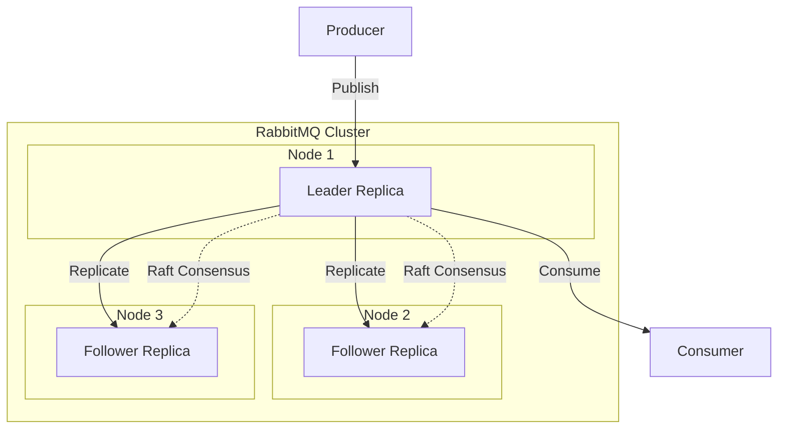
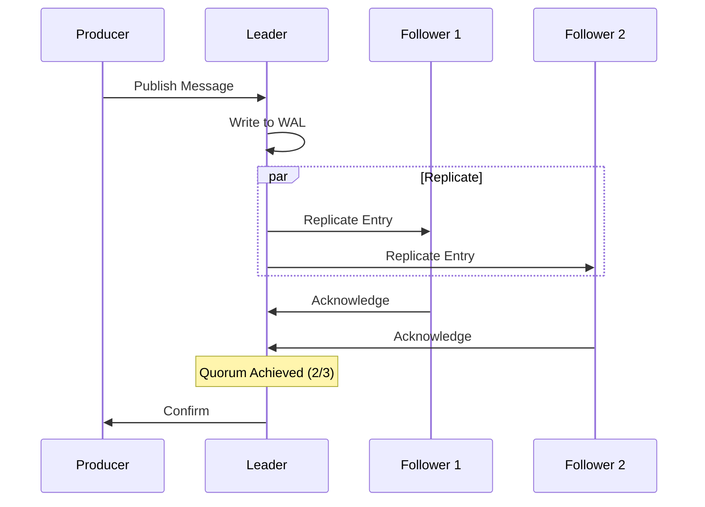
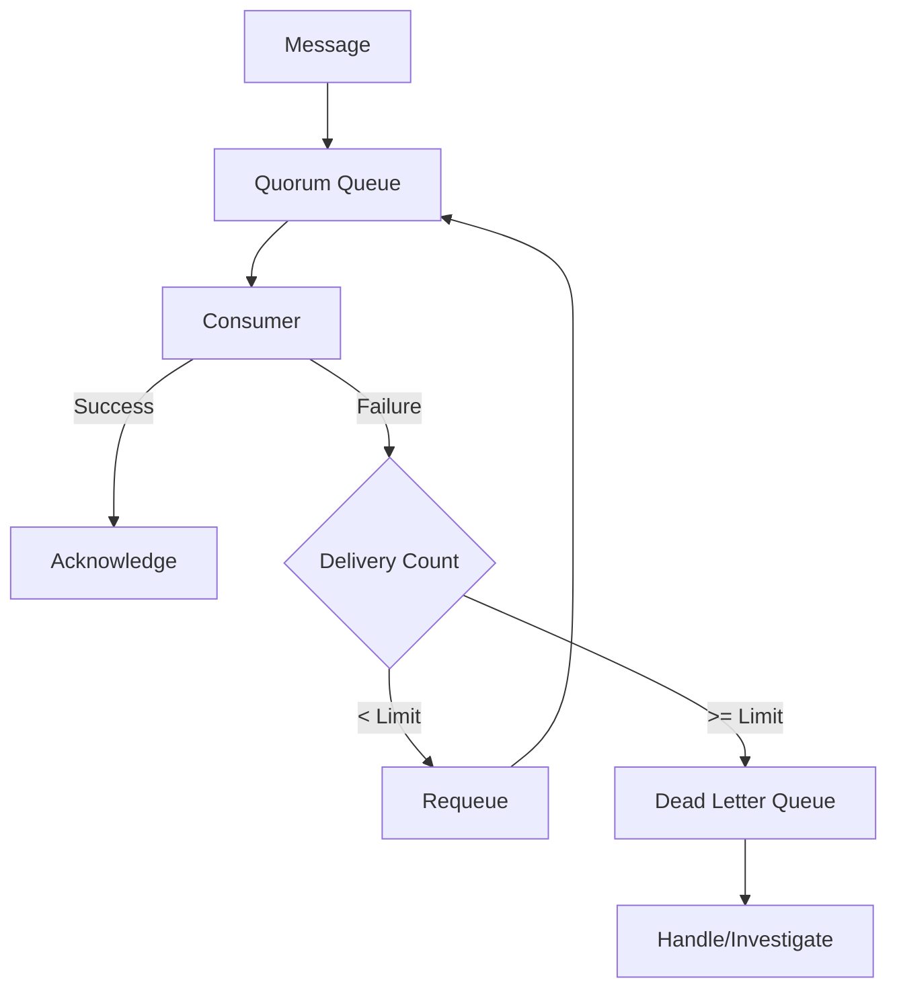
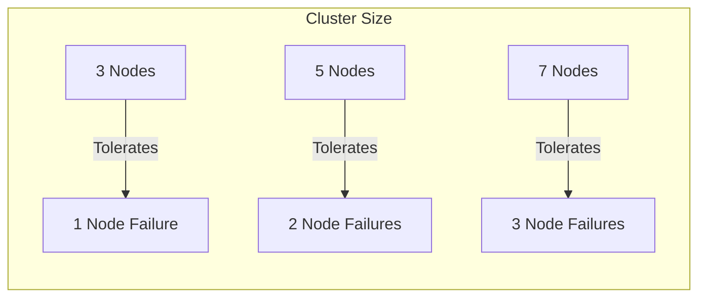

# How to Configure RabbitMQ Quorum Queues

Author: [nawazdhandala](https://www.github.com/nawazdhandala)

Tags: RabbitMQ, Quorum Queues, Message Queue, High Availability, Distributed Systems, Raft, Clustering

Description: A comprehensive guide to configuring RabbitMQ quorum queues for high availability and data safety in distributed messaging systems.

---

> Quorum queues are a modern, replicated queue type in RabbitMQ designed for data safety and high availability. They use the Raft consensus algorithm to ensure messages are not lost even when nodes fail. This guide covers everything you need to know to configure and use quorum queues effectively.

RabbitMQ quorum queues were introduced in version 3.8 as a replacement for mirrored classic queues. They provide stronger guarantees for message durability and are the recommended queue type for workloads that require high availability.

---

## Understanding Quorum Queues



### Key Characteristics

- **Raft-based replication**: Messages are replicated across multiple nodes using the Raft consensus algorithm
- **Quorum writes**: A message is confirmed only when a majority (quorum) of replicas acknowledge it
- **Automatic leader election**: If the leader fails, a follower is automatically promoted
- **Data safety**: Messages survive node failures as long as a quorum of nodes remains available

---

## Prerequisites

Before configuring quorum queues, ensure you have:

1. RabbitMQ 3.8 or later installed
2. A cluster with at least 3 nodes (recommended for fault tolerance)
3. Sufficient disk space for the write-ahead log

```bash
# Check RabbitMQ version
rabbitmqctl version

# Check cluster status
rabbitmqctl cluster_status
```

---

## Creating Quorum Queues

### Using the Management UI

Navigate to Queues > Add a new queue, then:
1. Set the queue name
2. Select "Quorum" as the queue type
3. Configure additional arguments as needed

### Using the CLI

```bash
# Declare a quorum queue using rabbitmqadmin
rabbitmqadmin declare queue name=orders-queue \
    durable=true \
    arguments='{"x-queue-type": "quorum"}'
```

### Using Python (pika)

```python
import pika

# Establish connection to RabbitMQ
connection = pika.BlockingConnection(
    pika.ConnectionParameters('localhost')
)
channel = connection.channel()

# Declare a quorum queue with specific arguments
# The x-queue-type argument specifies this is a quorum queue
channel.queue_declare(
    queue='orders-queue',
    durable=True,  # Quorum queues must be durable
    arguments={
        'x-queue-type': 'quorum',  # Required: specifies quorum queue type
        'x-quorum-initial-group-size': 3,  # Number of replicas
        'x-delivery-limit': 5  # Max redelivery attempts before dead-lettering
    }
)

print("Quorum queue 'orders-queue' created successfully")
connection.close()
```

### Using Node.js (amqplib)

```javascript
const amqp = require('amqplib');

async function createQuorumQueue() {
    // Connect to RabbitMQ
    const connection = await amqp.connect('amqp://localhost');
    const channel = await connection.createChannel();

    // Declare the quorum queue
    // Note: quorum queues must be durable
    await channel.assertQueue('orders-queue', {
        durable: true,
        arguments: {
            'x-queue-type': 'quorum',  // Specifies quorum queue type
            'x-quorum-initial-group-size': 3,  // Initial replica count
            'x-delivery-limit': 5  // Redelivery limit
        }
    });

    console.log('Quorum queue created successfully');

    await channel.close();
    await connection.close();
}

createQuorumQueue().catch(console.error);
```

### Using Java (Spring AMQP)

```java
import org.springframework.amqp.core.Queue;
import org.springframework.amqp.core.QueueBuilder;
import org.springframework.context.annotation.Bean;
import org.springframework.context.annotation.Configuration;

@Configuration
public class RabbitMQConfig {

    @Bean
    public Queue ordersQueue() {
        // Create a quorum queue using QueueBuilder
        // The quorum() method sets the x-queue-type argument
        return QueueBuilder.durable("orders-queue")
            .quorum()  // Sets x-queue-type to quorum
            .deliveryLimit(5)  // Maximum redelivery attempts
            .build();
    }
}
```

---

## Configuration Options

### Essential Arguments

| Argument | Description | Default |
|----------|-------------|---------|
| `x-queue-type` | Must be set to "quorum" | N/A |
| `x-quorum-initial-group-size` | Number of replicas | Cluster size |
| `x-delivery-limit` | Max redeliveries before dead-letter | None |
| `x-dead-letter-exchange` | Exchange for dead-lettered messages | None |
| `x-dead-letter-routing-key` | Routing key for dead-lettered messages | Original key |
| `x-max-length` | Maximum queue length | Unlimited |
| `x-max-length-bytes` | Maximum queue size in bytes | Unlimited |
| `x-overflow` | Behavior when limit reached | drop-head |
| `x-expires` | Queue TTL in milliseconds | Never |
| `x-message-ttl` | Message TTL in milliseconds | Never |

### Advanced Configuration Example

```python
import pika

connection = pika.BlockingConnection(
    pika.ConnectionParameters('localhost')
)
channel = connection.channel()

# Declare a fully configured quorum queue
channel.queue_declare(
    queue='critical-events',
    durable=True,
    arguments={
        # Core quorum queue settings
        'x-queue-type': 'quorum',
        'x-quorum-initial-group-size': 5,  # 5 replicas for higher fault tolerance

        # Dead letter configuration
        'x-delivery-limit': 3,  # Dead-letter after 3 failed deliveries
        'x-dead-letter-exchange': 'dlx-exchange',
        'x-dead-letter-routing-key': 'failed-events',

        # Queue limits
        'x-max-length': 1000000,  # Max 1 million messages
        'x-max-length-bytes': 1073741824,  # Max 1GB
        'x-overflow': 'reject-publish',  # Reject new messages when full

        # TTL settings
        'x-message-ttl': 86400000,  # Messages expire after 24 hours
        'x-expires': 604800000  # Queue deleted after 7 days of no use
    }
)

# Set up the dead letter exchange and queue
channel.exchange_declare(
    exchange='dlx-exchange',
    exchange_type='direct',
    durable=True
)

channel.queue_declare(
    queue='failed-events-queue',
    durable=True,
    arguments={'x-queue-type': 'quorum'}
)

channel.queue_bind(
    queue='failed-events-queue',
    exchange='dlx-exchange',
    routing_key='failed-events'
)

print("Quorum queue with dead-lettering configured")
connection.close()
```

---

## Cluster Configuration

### RabbitMQ Configuration File

```erlang
%% rabbitmq.conf - Quorum queue specific settings

%% Default queue type for new queues (optional)
default_queue_type = quorum

%% Quorum queue settings
quorum_queue.default_initial_cluster_size = 3

%% Raft settings for quorum queues
raft.segment_max_entries = 32768
raft.wal_max_size_bytes = 536870912

%% Memory management
quorum_queue.memory_limit = 0.4
```

### Environment Variables

```bash
# Set via environment variables
export RABBITMQ_DEFAULT_QUEUE_TYPE=quorum

# Start RabbitMQ with quorum queue defaults
rabbitmq-server
```

---

## Replication Architecture



### Setting Replica Count

```python
import pika

connection = pika.BlockingConnection(
    pika.ConnectionParameters('localhost')
)
channel = connection.channel()

# For a 5-node cluster, use 5 replicas for maximum durability
# For a 3-node cluster, 3 replicas is recommended
channel.queue_declare(
    queue='high-durability-queue',
    durable=True,
    arguments={
        'x-queue-type': 'quorum',
        # Set initial replica count
        # Should be odd number for proper quorum (3, 5, 7)
        'x-quorum-initial-group-size': 5
    }
)

connection.close()
```

---

## Producer Configuration

### Publishing with Confirms

```python
import pika

# Enable publisher confirms for reliable message delivery
connection = pika.BlockingConnection(
    pika.ConnectionParameters('localhost')
)
channel = connection.channel()

# Enable delivery confirmations
channel.confirm_delivery()

# Declare the quorum queue
channel.queue_declare(
    queue='reliable-queue',
    durable=True,
    arguments={'x-queue-type': 'quorum'}
)

def publish_message(message):
    """Publish a message with confirmation handling"""
    try:
        # Publish with mandatory flag and persistent delivery mode
        channel.basic_publish(
            exchange='',
            routing_key='reliable-queue',
            body=message,
            properties=pika.BasicProperties(
                delivery_mode=2,  # Persistent message
                content_type='application/json'
            ),
            mandatory=True  # Return message if not routable
        )
        print(f"Message confirmed: {message}")
        return True
    except pika.exceptions.UnroutableError:
        print(f"Message could not be routed: {message}")
        return False

# Publish messages
for i in range(10):
    publish_message(f'{{"order_id": {i}}}')

connection.close()
```

### Asynchronous Publishing with Confirms (Node.js)

```javascript
const amqp = require('amqplib');

async function publishWithConfirms() {
    const connection = await amqp.connect('amqp://localhost');
    const channel = await connection.createConfirmChannel();

    // Declare quorum queue
    await channel.assertQueue('reliable-queue', {
        durable: true,
        arguments: { 'x-queue-type': 'quorum' }
    });

    // Publish messages with confirmation
    const messages = [
        { orderId: 1, product: 'Widget' },
        { orderId: 2, product: 'Gadget' },
        { orderId: 3, product: 'Gizmo' }
    ];

    for (const msg of messages) {
        const content = Buffer.from(JSON.stringify(msg));

        // Publish and wait for confirmation
        await new Promise((resolve, reject) => {
            channel.publish(
                '',  // Default exchange
                'reliable-queue',
                content,
                { persistent: true },  // Persistent delivery
                (err) => {
                    if (err) {
                        console.error(`Failed to confirm: ${msg.orderId}`);
                        reject(err);
                    } else {
                        console.log(`Confirmed: ${msg.orderId}`);
                        resolve();
                    }
                }
            );
        });
    }

    await channel.close();
    await connection.close();
}

publishWithConfirms().catch(console.error);
```

---

## Consumer Configuration

### Consumer with Manual Acknowledgment

```python
import pika
import json

connection = pika.BlockingConnection(
    pika.ConnectionParameters('localhost')
)
channel = connection.channel()

# Set prefetch count to control message flow
# Lower values provide better load distribution
channel.basic_qos(prefetch_count=10)

def process_message(ch, method, properties, body):
    """Process message and acknowledge on success"""
    try:
        message = json.loads(body)
        print(f"Processing order: {message.get('order_id')}")

        # Simulate processing
        # ... your business logic here ...

        # Acknowledge successful processing
        # This removes the message from the queue
        ch.basic_ack(delivery_tag=method.delivery_tag)
        print(f"Acknowledged order: {message.get('order_id')}")

    except json.JSONDecodeError as e:
        # Reject malformed messages without requeue
        # They will be dead-lettered if configured
        ch.basic_reject(delivery_tag=method.delivery_tag, requeue=False)
        print(f"Rejected malformed message: {e}")

    except Exception as e:
        # Requeue message for retry on transient errors
        # Delivery count is tracked by quorum queues
        ch.basic_nack(delivery_tag=method.delivery_tag, requeue=True)
        print(f"Requeued message due to error: {e}")

# Start consuming with manual acknowledgment
channel.basic_consume(
    queue='reliable-queue',
    on_message_callback=process_message,
    auto_ack=False  # Disable auto-acknowledgment
)

print('Waiting for messages...')
channel.start_consuming()
```

### Handling Poison Messages



```python
import pika
import json

connection = pika.BlockingConnection(
    pika.ConnectionParameters('localhost')
)
channel = connection.channel()

# Create queue with delivery limit for poison message handling
channel.queue_declare(
    queue='orders-queue',
    durable=True,
    arguments={
        'x-queue-type': 'quorum',
        'x-delivery-limit': 3,  # Max 3 delivery attempts
        'x-dead-letter-exchange': 'dlx',
        'x-dead-letter-routing-key': 'failed-orders'
    }
)

# Set up dead letter infrastructure
channel.exchange_declare(exchange='dlx', exchange_type='direct', durable=True)
channel.queue_declare(
    queue='failed-orders',
    durable=True,
    arguments={'x-queue-type': 'quorum'}
)
channel.queue_bind(queue='failed-orders', exchange='dlx', routing_key='failed-orders')

channel.basic_qos(prefetch_count=1)

def process_order(ch, method, properties, body):
    """Process order with automatic poison message handling"""
    try:
        order = json.loads(body)

        # Check delivery count from headers
        headers = properties.headers or {}
        delivery_count = headers.get('x-delivery-count', 0)
        print(f"Processing order {order['id']}, attempt {delivery_count + 1}")

        # Your business logic here
        process_business_logic(order)

        ch.basic_ack(delivery_tag=method.delivery_tag)

    except Exception as e:
        print(f"Failed to process order: {e}")
        # Negative acknowledgment - message will be requeued
        # After x-delivery-limit attempts, it goes to DLQ
        ch.basic_nack(delivery_tag=method.delivery_tag, requeue=True)

def process_business_logic(order):
    """Simulate business logic that might fail"""
    if order.get('invalid'):
        raise ValueError("Invalid order data")
    print(f"Order {order['id']} processed successfully")

channel.basic_consume(
    queue='orders-queue',
    on_message_callback=process_order,
    auto_ack=False
)

print('Order processor started...')
channel.start_consuming()
```

---

## Monitoring Quorum Queues

### Key Metrics

```bash
# Check quorum queue status
rabbitmqctl list_queues name type leader members online

# Get detailed queue info
rabbitmqctl list_queues name messages messages_ready messages_unacknowledged \
    type leader members

# Monitor Raft state
rabbitmqctl list_queues name type state leader
```

### Monitoring Script

```python
import subprocess
import json

def get_quorum_queue_status():
    """Retrieve status of all quorum queues in the cluster"""

    # Get queue information in JSON format
    result = subprocess.run(
        ['rabbitmqctl', 'list_queues',
         'name', 'type', 'messages', 'leader', 'members', 'online',
         '--formatter=json'],
        capture_output=True,
        text=True
    )

    queues = json.loads(result.stdout)

    for queue in queues:
        if queue.get('type') == 'quorum':
            name = queue['name']
            messages = queue['messages']
            leader = queue['leader']
            members = queue['members']
            online = queue['online']

            # Check replica health
            total_replicas = len(members)
            online_replicas = len(online)

            print(f"\nQueue: {name}")
            print(f"  Messages: {messages}")
            print(f"  Leader: {leader}")
            print(f"  Replicas: {online_replicas}/{total_replicas} online")

            if online_replicas < total_replicas:
                offline = set(members) - set(online)
                print(f"  WARNING: Offline replicas: {offline}")

            # Check if quorum is maintained
            quorum_size = (total_replicas // 2) + 1
            if online_replicas < quorum_size:
                print(f"  CRITICAL: Below quorum! Need {quorum_size} replicas")

if __name__ == '__main__':
    get_quorum_queue_status()
```

---

## Best Practices

### 1. Sizing Recommendations



### 2. Memory and Disk Considerations

```erlang
%% rabbitmq.conf

%% Set memory high watermark
vm_memory_high_watermark.relative = 0.6

%% Configure disk free space limit
disk_free_limit.relative = 2.0

%% Quorum queue memory limit (fraction of total memory)
quorum_queue.memory_limit = 0.3
```

### 3. Network Configuration

```erlang
%% rabbitmq.conf

%% Increase inter-node communication timeout for WAN deployments
cluster_partition_handling = pause_minority

%% Heartbeat interval
heartbeat = 60

%% TCP connection timeout
handshake_timeout = 30000
```

---

## Troubleshooting

### Common Issues

| Issue | Cause | Solution |
|-------|-------|----------|
| Queue unavailable | Below quorum | Add more nodes or fix failed nodes |
| Slow publishing | Disk I/O bottleneck | Use faster storage (SSD) |
| High memory usage | Large WAL | Increase checkpointing frequency |
| Leader election storms | Network instability | Improve network reliability |

### Checking Queue Health

```bash
# Check if all replicas are online
rabbitmqctl list_queues name type members online --formatter=json | \
    jq '.[] | select(.type=="quorum") |
        {name, members: .members|length, online: .online|length}'

# Force leader election (if needed)
rabbitmqctl delete_member <queue-name> <node-name>
rabbitmqctl add_member <queue-name> <node-name>

# Check Raft log status
rabbitmqctl quorum_status <queue-name>
```

---

## Conclusion

Quorum queues provide a robust foundation for building reliable messaging systems with RabbitMQ. By understanding their configuration options and following best practices, you can ensure your message queues remain available and your data stays safe even during node failures.

Key takeaways:
- Use quorum queues for any workload requiring high availability
- Configure appropriate replica counts based on your fault tolerance requirements
- Always use publisher confirms and manual acknowledgments
- Set up dead-lettering for poison message handling
- Monitor replica health and Raft consensus metrics

---

*Need to monitor your RabbitMQ clusters and quorum queues? [OneUptime](https://oneuptime.com) provides comprehensive monitoring for message queue systems, including queue depth, consumer lag, and cluster health metrics.*

**Related Reading:**
- [How to Monitor RabbitMQ with Prometheus](https://oneuptime.com/blog)
- [How to Migrate from RabbitMQ Classic to Quorum Queues](https://oneuptime.com/blog)
