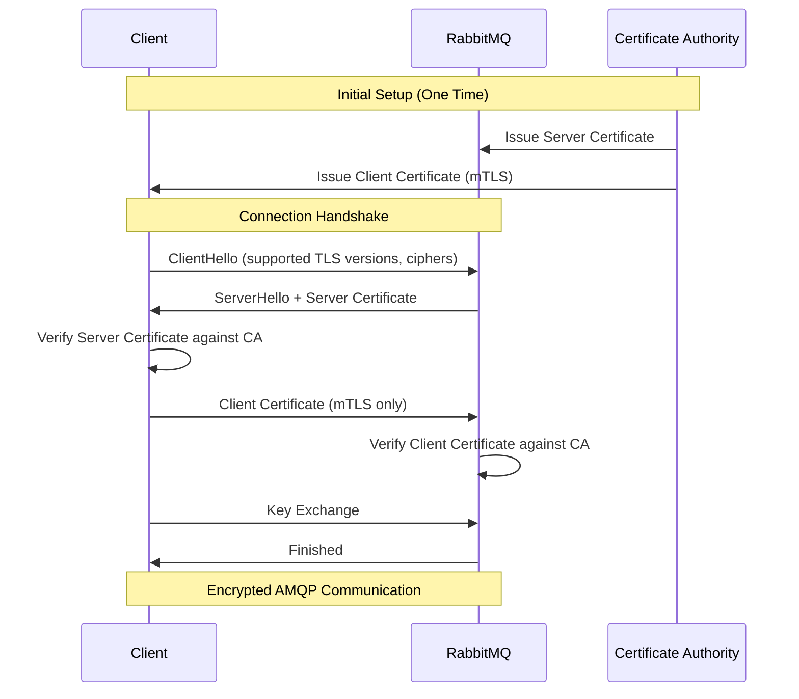
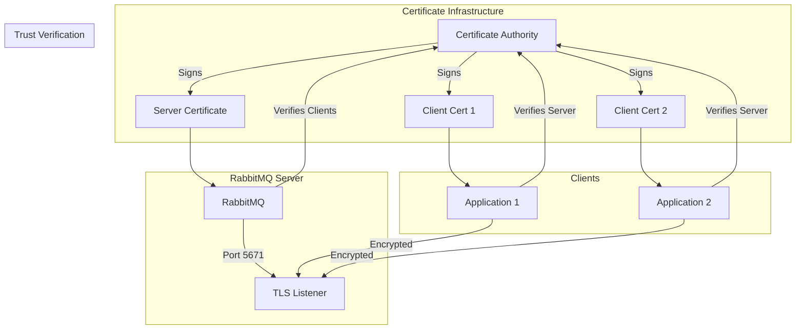

# How to Configure RabbitMQ SSL/TLS

Author: [nawazdhandala](https://www.github.com/nawazdhandala)

Tags: RabbitMQ, SSL, TLS, Security, Encryption, Certificates, DevOps

Description: Step-by-step guide to configuring SSL/TLS encryption for RabbitMQ connections, including certificate generation and client configuration.

---

Securing RabbitMQ connections with SSL/TLS is essential for production deployments. TLS encrypts data in transit, preventing eavesdropping and man-in-the-middle attacks. This guide covers certificate generation, server configuration, and client setup for encrypted RabbitMQ connections.

## TLS Architecture Overview

When TLS is enabled, all communication between clients and RabbitMQ is encrypted. The server presents its certificate, and optionally, clients present theirs for mutual TLS (mTLS).



## Step 1: Generate Certificates

For production, use certificates from a trusted CA. For testing, create a self-signed CA.

```bash
#!/bin/bash
# generate_certificates.sh
# Creates a CA and certificates for RabbitMQ TLS configuration
# For production, replace with certificates from your organization's CA

set -e

CERT_DIR="/etc/rabbitmq/ssl"
mkdir -p "$CERT_DIR"
cd "$CERT_DIR"

# Generate Certificate Authority (CA) private key
# The CA signs all other certificates in your infrastructure
# Use 4096 bits for strong security
openssl genrsa -out ca_key.pem 4096

# Create CA certificate (self-signed)
# This certificate will be distributed to all clients
# Valid for 10 years (3650 days)
openssl req -new -x509 -days 3650 \
    -key ca_key.pem \
    -out ca_certificate.pem \
    -subj "/CN=RabbitMQ-CA/O=MyOrganization/C=US"

echo "CA certificate created: ca_certificate.pem"

# Generate server private key
# This key must be kept secure on the RabbitMQ server
openssl genrsa -out server_key.pem 4096

# Create server certificate signing request (CSR)
# The CN should match the server's hostname
# Include SANs for all hostnames clients might use
openssl req -new \
    -key server_key.pem \
    -out server_csr.pem \
    -subj "/CN=rabbitmq.example.com/O=MyOrganization/C=US"

# Create server certificate signed by our CA
# Include Subject Alternative Names (SANs) for hostname verification
cat > server_ext.cnf << EOF
basicConstraints = CA:FALSE
keyUsage = digitalSignature, keyEncipherment
extendedKeyUsage = serverAuth
subjectAltName = @alt_names

[alt_names]
DNS.1 = rabbitmq.example.com
DNS.2 = localhost
DNS.3 = rabbitmq
IP.1 = 127.0.0.1
EOF

openssl x509 -req -days 365 \
    -in server_csr.pem \
    -CA ca_certificate.pem \
    -CAkey ca_key.pem \
    -CAcreateserial \
    -out server_certificate.pem \
    -extfile server_ext.cnf

echo "Server certificate created: server_certificate.pem"

# Generate client certificate (for mutual TLS)
# Each client application should have its own certificate
openssl genrsa -out client_key.pem 4096

openssl req -new \
    -key client_key.pem \
    -out client_csr.pem \
    -subj "/CN=myapp-client/O=MyOrganization/C=US"

cat > client_ext.cnf << EOF
basicConstraints = CA:FALSE
keyUsage = digitalSignature
extendedKeyUsage = clientAuth
EOF

openssl x509 -req -days 365 \
    -in client_csr.pem \
    -CA ca_certificate.pem \
    -CAkey ca_key.pem \
    -CAcreateserial \
    -out client_certificate.pem \
    -extfile client_ext.cnf

echo "Client certificate created: client_certificate.pem"

# Set proper permissions
# RabbitMQ needs to read these files
chmod 644 ca_certificate.pem server_certificate.pem client_certificate.pem
chmod 600 ca_key.pem server_key.pem client_key.pem
chown -R rabbitmq:rabbitmq "$CERT_DIR"

echo ""
echo "Certificate generation complete!"
echo "Files in $CERT_DIR:"
ls -la "$CERT_DIR"
```

## Step 2: Configure RabbitMQ Server

Update the RabbitMQ configuration to enable TLS.

```erlang
%% /etc/rabbitmq/rabbitmq.conf
%% Modern RabbitMQ configuration format (3.7+)

%% Disable plain AMQP listener (optional but recommended for security)
%% Uncomment to force all connections through TLS
%% listeners.tcp = none

%% Enable TLS listener on port 5671
%% This is the standard port for AMQPS (AMQP over TLS)
listeners.ssl.default = 5671

%% Path to the CA certificate
%% Clients must trust this CA to verify the server
ssl_options.cacertfile = /etc/rabbitmq/ssl/ca_certificate.pem

%% Path to the server certificate
%% This certificate is presented to clients during TLS handshake
ssl_options.certfile = /etc/rabbitmq/ssl/server_certificate.pem

%% Path to the server private key
%% Must be readable by the rabbitmq user
ssl_options.keyfile = /etc/rabbitmq/ssl/server_key.pem

%% Require clients to present a certificate (mutual TLS)
%% Set to verify_none to allow connections without client certificates
ssl_options.verify = verify_peer

%% Reject connections from clients without valid certificates
%% Only applies when verify = verify_peer
ssl_options.fail_if_no_peer_cert = true

%% Minimum TLS version (TLS 1.2 recommended minimum)
%% TLS 1.3 is preferred when supported by clients
ssl_options.versions.1 = tlsv1.3
ssl_options.versions.2 = tlsv1.2

%% Cipher suites (TLS 1.2)
%% Use strong ciphers only, disable weak algorithms
ssl_options.ciphers.1 = ECDHE-ECDSA-AES256-GCM-SHA384
ssl_options.ciphers.2 = ECDHE-RSA-AES256-GCM-SHA384
ssl_options.ciphers.3 = ECDHE-ECDSA-AES128-GCM-SHA256
ssl_options.ciphers.4 = ECDHE-RSA-AES128-GCM-SHA256

%% Honor server cipher order
%% Server chooses the cipher, not the client
ssl_options.honor_cipher_order = true

%% Management UI TLS configuration
%% Enable HTTPS for the management interface
management.ssl.port = 15671
management.ssl.cacertfile = /etc/rabbitmq/ssl/ca_certificate.pem
management.ssl.certfile = /etc/rabbitmq/ssl/server_certificate.pem
management.ssl.keyfile = /etc/rabbitmq/ssl/server_key.pem
```

After updating the configuration, restart RabbitMQ.

```bash
# Restart RabbitMQ to apply TLS configuration
# Always check status after restart to verify the service started correctly
systemctl restart rabbitmq-server

# Verify TLS listener is active
# You should see port 5671 listed under Listeners
rabbitmqctl status | grep -A 10 "Listeners"

# Test TLS connection with openssl
# This verifies the server certificate is presented correctly
openssl s_client -connect localhost:5671 \
    -CAfile /etc/rabbitmq/ssl/ca_certificate.pem \
    -servername rabbitmq.example.com
```

## Step 3: Configure Clients

### Python Client with TLS

```python
# client_tls.py
# Connect to RabbitMQ using TLS encryption
# Includes options for both server verification and mutual TLS

import ssl
import pika

def create_tls_connection(
    host='rabbitmq.example.com',
    port=5671,
    vhost='/',
    username='guest',
    password='guest',
    ca_cert='/path/to/ca_certificate.pem',
    client_cert=None,  # For mutual TLS
    client_key=None    # For mutual TLS
):
    """
    Create a TLS-encrypted connection to RabbitMQ.

    Args:
        host: RabbitMQ server hostname
        port: TLS port (default 5671)
        vhost: Virtual host
        username: RabbitMQ username
        password: RabbitMQ password
        ca_cert: Path to CA certificate for server verification
        client_cert: Path to client certificate (mutual TLS)
        client_key: Path to client private key (mutual TLS)

    Returns:
        pika.BlockingConnection: TLS-encrypted connection
    """
    # Create SSL context with modern security settings
    # PROTOCOL_TLS lets the library negotiate the best available version
    ssl_context = ssl.create_default_context(
        purpose=ssl.Purpose.SERVER_AUTH,
        cafile=ca_cert
    )

    # Set minimum TLS version to 1.2
    # TLS 1.0 and 1.1 are deprecated and insecure
    ssl_context.minimum_version = ssl.TLSVersion.TLSv1_2

    # Enable hostname verification
    # This prevents man-in-the-middle attacks
    ssl_context.check_hostname = True
    ssl_context.verify_mode = ssl.CERT_REQUIRED

    # Load client certificate for mutual TLS (optional)
    # Required if server has fail_if_no_peer_cert = true
    if client_cert and client_key:
        ssl_context.load_cert_chain(
            certfile=client_cert,
            keyfile=client_key
        )

    # Create connection parameters with TLS
    credentials = pika.PlainCredentials(username, password)
    parameters = pika.ConnectionParameters(
        host=host,
        port=port,
        virtual_host=vhost,
        credentials=credentials,
        ssl_options=pika.SSLOptions(ssl_context, host)
    )

    return pika.BlockingConnection(parameters)

# Example: Basic TLS connection (server certificate only)
connection = create_tls_connection(
    host='rabbitmq.example.com',
    ca_cert='/path/to/ca_certificate.pem',
    username='myuser',
    password='mypassword'
)

channel = connection.channel()
print("TLS connection established successfully!")

# Example: Mutual TLS connection (client and server certificates)
mtls_connection = create_tls_connection(
    host='rabbitmq.example.com',
    ca_cert='/path/to/ca_certificate.pem',
    client_cert='/path/to/client_certificate.pem',
    client_key='/path/to/client_key.pem',
    username='myuser',
    password='mypassword'
)

mtls_channel = mtls_connection.channel()
print("Mutual TLS connection established successfully!")
```

### Node.js Client with TLS

```javascript
// client_tls.js
// Connect to RabbitMQ using TLS in Node.js
// Uses the amqplib library

const amqp = require('amqplib');
const fs = require('fs');
const path = require('path');

async function createTlsConnection(options = {}) {
    /**
     * Create a TLS-encrypted connection to RabbitMQ.
     *
     * @param {Object} options - Connection options
     * @param {string} options.host - RabbitMQ hostname
     * @param {number} options.port - TLS port (default 5671)
     * @param {string} options.vhost - Virtual host
     * @param {string} options.username - RabbitMQ username
     * @param {string} options.password - RabbitMQ password
     * @param {string} options.caCert - Path to CA certificate
     * @param {string} options.clientCert - Path to client certificate (mTLS)
     * @param {string} options.clientKey - Path to client key (mTLS)
     * @returns {Promise<Connection>} - AMQP connection
     */
    const {
        host = 'rabbitmq.example.com',
        port = 5671,
        vhost = '/',
        username = 'guest',
        password = 'guest',
        caCert,
        clientCert,
        clientKey
    } = options;

    // Build TLS options
    // The ca option contains trusted CA certificates
    const tlsOptions = {
        ca: [fs.readFileSync(caCert)],
        // Enable hostname verification
        checkServerIdentity: () => undefined, // Use default verification
        // Minimum TLS version
        minVersion: 'TLSv1.2',
        // Reject unauthorized connections
        rejectUnauthorized: true
    };

    // Add client certificate for mutual TLS
    if (clientCert && clientKey) {
        tlsOptions.cert = fs.readFileSync(clientCert);
        tlsOptions.key = fs.readFileSync(clientKey);
    }

    // Build connection URL
    // URL-encode vhost if it contains special characters
    const encodedVhost = encodeURIComponent(vhost);
    const url = `amqps://${username}:${password}@${host}:${port}/${encodedVhost}`;

    // Connect with TLS options
    const connection = await amqp.connect(url, {
        // Pass TLS options as socket options
        ...tlsOptions
    });

    console.log('TLS connection established successfully!');
    return connection;
}

// Example usage
async function main() {
    try {
        const connection = await createTlsConnection({
            host: 'rabbitmq.example.com',
            caCert: '/path/to/ca_certificate.pem',
            clientCert: '/path/to/client_certificate.pem',
            clientKey: '/path/to/client_key.pem',
            username: 'myuser',
            password: 'mypassword'
        });

        const channel = await connection.createChannel();

        // Your messaging logic here
        await channel.assertQueue('test-queue', { durable: true });
        console.log('Queue asserted successfully over TLS!');

        await connection.close();
    } catch (error) {
        console.error('Connection failed:', error.message);
        process.exit(1);
    }
}

main();
```

### Java Client with TLS

```java
// TlsConnection.java
// Connect to RabbitMQ using TLS in Java
// Uses the official RabbitMQ Java client

import com.rabbitmq.client.ConnectionFactory;
import com.rabbitmq.client.Connection;
import com.rabbitmq.client.Channel;

import javax.net.ssl.SSLContext;
import javax.net.ssl.TrustManagerFactory;
import javax.net.ssl.KeyManagerFactory;
import java.security.KeyStore;
import java.io.FileInputStream;

public class TlsConnection {

    /**
     * Create a TLS-encrypted connection to RabbitMQ.
     *
     * This example uses Java KeyStores (JKS) for certificate management.
     * Convert PEM files to JKS using keytool or use BouncyCastle for PEM support.
     */
    public static Connection createConnection(
            String host,
            int port,
            String vhost,
            String username,
            String password,
            String trustStorePath,
            String trustStorePassword,
            String keyStorePath,      // For mutual TLS
            String keyStorePassword   // For mutual TLS
    ) throws Exception {

        // Load the trust store containing the CA certificate
        // The trust store is used to verify the server's certificate
        KeyStore trustStore = KeyStore.getInstance("JKS");
        try (FileInputStream trustStoreStream = new FileInputStream(trustStorePath)) {
            trustStore.load(trustStoreStream, trustStorePassword.toCharArray());
        }

        // Initialize trust manager with CA certificate
        TrustManagerFactory trustManagerFactory = TrustManagerFactory.getInstance(
            TrustManagerFactory.getDefaultAlgorithm()
        );
        trustManagerFactory.init(trustStore);

        // Initialize key manager for mutual TLS (optional)
        KeyManagerFactory keyManagerFactory = null;
        if (keyStorePath != null) {
            KeyStore keyStore = KeyStore.getInstance("JKS");
            try (FileInputStream keyStoreStream = new FileInputStream(keyStorePath)) {
                keyStore.load(keyStoreStream, keyStorePassword.toCharArray());
            }
            keyManagerFactory = KeyManagerFactory.getInstance(
                KeyManagerFactory.getDefaultAlgorithm()
            );
            keyManagerFactory.init(keyStore, keyStorePassword.toCharArray());
        }

        // Create SSL context with TLS 1.2 minimum
        SSLContext sslContext = SSLContext.getInstance("TLSv1.2");
        sslContext.init(
            keyManagerFactory != null ? keyManagerFactory.getKeyManagers() : null,
            trustManagerFactory.getTrustManagers(),
            null  // Use default SecureRandom
        );

        // Configure connection factory
        ConnectionFactory factory = new ConnectionFactory();
        factory.setHost(host);
        factory.setPort(port);
        factory.setVirtualHost(vhost);
        factory.setUsername(username);
        factory.setPassword(password);

        // Enable TLS with our SSL context
        factory.useSslProtocol(sslContext);

        // Enable hostname verification
        factory.enableHostnameVerification();

        return factory.newConnection();
    }

    public static void main(String[] args) throws Exception {
        Connection connection = createConnection(
            "rabbitmq.example.com",
            5671,
            "/",
            "myuser",
            "mypassword",
            "/path/to/truststore.jks",
            "truststorepassword",
            "/path/to/keystore.jks",  // null for server-only TLS
            "keystorepassword"
        );

        Channel channel = connection.createChannel();
        System.out.println("TLS connection established successfully!");

        connection.close();
    }
}
```

## TLS Configuration Architecture



## Verifying TLS Configuration

Test your TLS setup to ensure it is working correctly.

```bash
#!/bin/bash
# verify_tls.sh
# Comprehensive TLS verification script

RABBITMQ_HOST="${1:-localhost}"
RABBITMQ_TLS_PORT="${2:-5671}"
CA_CERT="${3:-/etc/rabbitmq/ssl/ca_certificate.pem}"

echo "Verifying TLS configuration for $RABBITMQ_HOST:$RABBITMQ_TLS_PORT"
echo ""

# Test 1: Verify TLS listener is active
echo "Test 1: Checking TLS listener..."
if nc -z "$RABBITMQ_HOST" "$RABBITMQ_TLS_PORT" 2>/dev/null; then
    echo "  PASS: Port $RABBITMQ_TLS_PORT is open"
else
    echo "  FAIL: Port $RABBITMQ_TLS_PORT is not reachable"
    exit 1
fi

# Test 2: Verify certificate chain
echo ""
echo "Test 2: Verifying certificate chain..."
CERT_INFO=$(echo | openssl s_client -connect "$RABBITMQ_HOST:$RABBITMQ_TLS_PORT" \
    -CAfile "$CA_CERT" 2>/dev/null)

if echo "$CERT_INFO" | grep -q "Verify return code: 0"; then
    echo "  PASS: Certificate chain verified"
else
    echo "  FAIL: Certificate verification failed"
    echo "$CERT_INFO" | grep "Verify return code"
fi

# Test 3: Check TLS version
echo ""
echo "Test 3: Checking TLS version..."
TLS_VERSION=$(echo | openssl s_client -connect "$RABBITMQ_HOST:$RABBITMQ_TLS_PORT" \
    -CAfile "$CA_CERT" 2>/dev/null | grep "Protocol" | head -1)
echo "  $TLS_VERSION"

# Test 4: Check cipher suite
echo ""
echo "Test 4: Checking cipher suite..."
CIPHER=$(echo | openssl s_client -connect "$RABBITMQ_HOST:$RABBITMQ_TLS_PORT" \
    -CAfile "$CA_CERT" 2>/dev/null | grep "Cipher" | head -1)
echo "  $CIPHER"

# Test 5: Display certificate details
echo ""
echo "Test 5: Server certificate details..."
echo | openssl s_client -connect "$RABBITMQ_HOST:$RABBITMQ_TLS_PORT" \
    -CAfile "$CA_CERT" 2>/dev/null | \
    openssl x509 -noout -subject -issuer -dates 2>/dev/null

# Test 6: Test weak TLS versions are rejected
echo ""
echo "Test 6: Verifying TLS 1.0 is rejected..."
if echo | openssl s_client -connect "$RABBITMQ_HOST:$RABBITMQ_TLS_PORT" \
    -tls1 2>&1 | grep -q "handshake failure\|wrong version"; then
    echo "  PASS: TLS 1.0 correctly rejected"
else
    echo "  WARNING: TLS 1.0 may be enabled (security risk)"
fi

echo ""
echo "Verification complete!"
```

## Troubleshooting Common Issues

### Certificate Verification Failed

```bash
# Check certificate expiration
openssl x509 -in /etc/rabbitmq/ssl/server_certificate.pem -noout -dates

# Verify certificate matches private key
# These two commands should output the same modulus
openssl x509 -in server_certificate.pem -noout -modulus | md5sum
openssl rsa -in server_key.pem -noout -modulus | md5sum

# Check certificate chain
openssl verify -CAfile ca_certificate.pem server_certificate.pem
```

### Hostname Verification Failed

```bash
# Check SANs in the certificate
# The hostname used to connect must appear in the SANs
openssl x509 -in server_certificate.pem -noout -text | grep -A1 "Subject Alternative Name"

# If the SAN does not include your hostname, regenerate the certificate
# with the correct hostnames in the alt_names section
```

### Permission Denied Errors

```bash
# Check file permissions on certificate files
ls -la /etc/rabbitmq/ssl/

# Fix permissions if needed
# RabbitMQ needs read access to certificates and keys
sudo chown rabbitmq:rabbitmq /etc/rabbitmq/ssl/*
sudo chmod 644 /etc/rabbitmq/ssl/*.pem
sudo chmod 600 /etc/rabbitmq/ssl/*_key.pem
```

## Summary

Configuring SSL/TLS for RabbitMQ involves generating certificates (CA, server, and optionally client certificates), configuring the RabbitMQ server to use TLS on port 5671, updating clients to use TLS connections with proper certificate verification, and testing the configuration to ensure encryption is working. For production environments, use certificates from a trusted CA, enable mutual TLS for enhanced security, disable older TLS versions (1.0 and 1.1), and regularly rotate certificates before expiration. With TLS properly configured, all AMQP traffic between clients and RabbitMQ is encrypted, protecting sensitive message data from interception.
