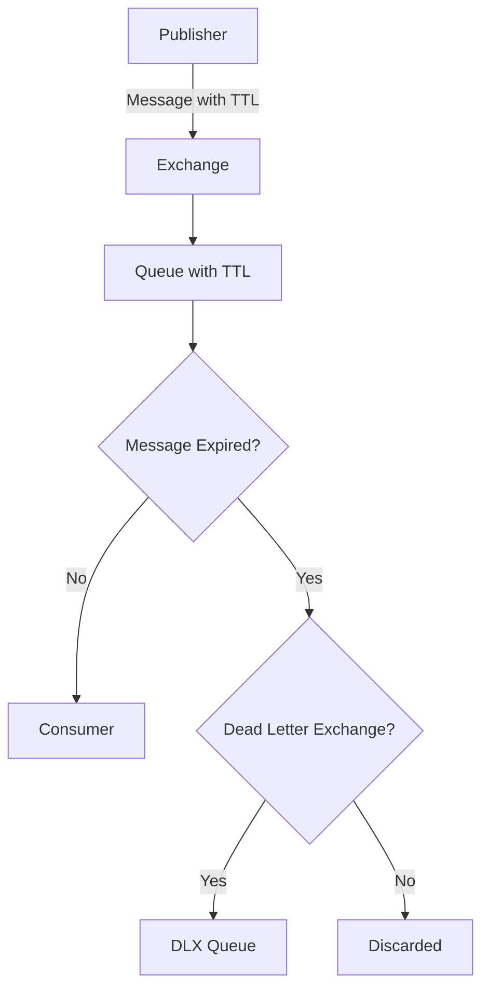
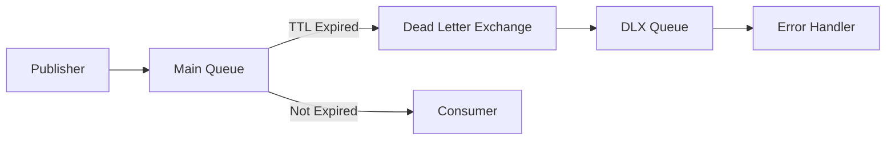
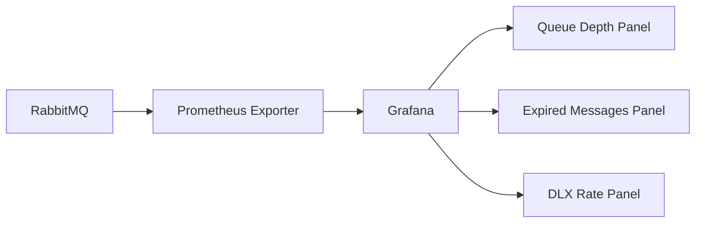
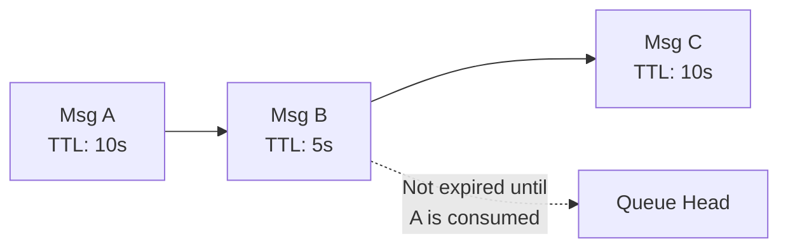

# How to Configure RabbitMQ TTL for Messages

Author: [nawazdhandala](https://www.github.com/nawazdhandala)

Tags: RabbitMQ, Message Queue, TTL, AMQP, Backend, Distributed Systems, Configuration

Description: Learn how to configure message and queue TTL in RabbitMQ to automatically expire messages and manage queue storage.

---

> Time-To-Live (TTL) in RabbitMQ controls how long messages remain in queues before being automatically discarded or dead-lettered. Proper TTL configuration prevents queue buildup and ensures consumers only process relevant messages.

TTL can be set at the queue level, message level, or both, giving you fine-grained control over message expiration.

---

## Understanding TTL in RabbitMQ



---

## Types of TTL

### 1. Per-Queue TTL

All messages in the queue share the same TTL:

```python
import pika

connection = pika.BlockingConnection(
    pika.ConnectionParameters('localhost')
)
channel = connection.channel()

# Declare a queue with 60 second TTL for all messages
# x-message-ttl is specified in milliseconds
channel.queue_declare(
    queue='notifications',
    durable=True,
    arguments={
        'x-message-ttl': 60000  # 60 seconds in milliseconds
    }
)

# All messages in this queue will expire after 60 seconds
channel.basic_publish(
    exchange='',
    routing_key='notifications',
    body='This message expires in 60 seconds'
)

print("Message published to queue with TTL")
connection.close()
```

### 2. Per-Message TTL

Each message can have its own expiration time:

```python
import pika

connection = pika.BlockingConnection(
    pika.ConnectionParameters('localhost')
)
channel = connection.channel()

# Declare a regular queue without TTL
channel.queue_declare(queue='tasks', durable=True)

# Publish with per-message TTL using the expiration property
# Note: expiration is a string, not an integer
properties = pika.BasicProperties(
    expiration='30000',  # 30 seconds in milliseconds (as string)
    delivery_mode=2      # Make message persistent
)

channel.basic_publish(
    exchange='',
    routing_key='tasks',
    body='Urgent task - expires in 30 seconds',
    properties=properties
)

# Publish another message with different TTL
properties_long = pika.BasicProperties(
    expiration='300000',  # 5 minutes
    delivery_mode=2
)

channel.basic_publish(
    exchange='',
    routing_key='tasks',
    body='Normal task - expires in 5 minutes',
    properties=properties_long
)

print("Messages published with different TTLs")
connection.close()
```

### 3. Combined TTL

When both queue and message TTL are set, the lower value wins:

```python
import pika

connection = pika.BlockingConnection(
    pika.ConnectionParameters('localhost')
)
channel = connection.channel()

# Queue TTL: 120 seconds
channel.queue_declare(
    queue='combined_ttl',
    durable=True,
    arguments={
        'x-message-ttl': 120000  # 2 minutes
    }
)

# Message TTL: 30 seconds (lower value wins)
properties = pika.BasicProperties(
    expiration='30000'  # 30 seconds
)

channel.basic_publish(
    exchange='',
    routing_key='combined_ttl',
    body='Expires in 30 seconds (message TTL wins)',
    properties=properties
)

# Message with 5 minute TTL (queue TTL wins)
properties_long = pika.BasicProperties(
    expiration='300000'  # 5 minutes
)

channel.basic_publish(
    exchange='',
    routing_key='combined_ttl',
    body='Expires in 2 minutes (queue TTL wins)',
    properties=properties_long
)

connection.close()
```

---

## TTL with Dead Letter Exchanges

Route expired messages to a dead letter exchange for analysis or retry:



### Configuration Example

```python
import pika

connection = pika.BlockingConnection(
    pika.ConnectionParameters('localhost')
)
channel = connection.channel()

# Step 1: Create the dead letter exchange
channel.exchange_declare(
    exchange='dlx',
    exchange_type='fanout',
    durable=True
)

# Step 2: Create the dead letter queue to receive expired messages
channel.queue_declare(
    queue='expired_messages',
    durable=True
)

# Step 3: Bind the dead letter queue to the DLX
channel.queue_bind(
    queue='expired_messages',
    exchange='dlx'
)

# Step 4: Create the main queue with TTL and dead letter exchange
channel.queue_declare(
    queue='orders',
    durable=True,
    arguments={
        'x-message-ttl': 300000,           # 5 minutes
        'x-dead-letter-exchange': 'dlx',   # Route expired messages here
        'x-dead-letter-routing-key': ''    # Optional: override routing key
    }
)

print("Queue with TTL and DLX configured")
connection.close()
```

### Consuming Dead-Lettered Messages

```python
import pika
import json

def handle_expired_message(ch, method, properties, body):
    """
    Process messages that expired from the main queue.
    The x-death header contains information about why the message
    was dead-lettered.
    """
    # Extract death information from headers
    x_death = properties.headers.get('x-death', []) if properties.headers else []

    if x_death:
        death_info = x_death[0]
        original_queue = death_info.get('queue')
        reason = death_info.get('reason')
        death_count = death_info.get('count')
        original_expiration = death_info.get('original-expiration')

        print(f"Expired message from: {original_queue}")
        print(f"Reason: {reason}")
        print(f"Death count: {death_count}")
        print(f"Original TTL: {original_expiration}ms")

    print(f"Message body: {body.decode()}")

    # Acknowledge after processing
    ch.basic_ack(delivery_tag=method.delivery_tag)

connection = pika.BlockingConnection(
    pika.ConnectionParameters('localhost')
)
channel = connection.channel()

# Consume from the dead letter queue
channel.basic_consume(
    queue='expired_messages',
    on_message_callback=handle_expired_message
)

print("Waiting for expired messages...")
channel.start_consuming()
```

---

## Queue Expiration (Queue TTL)

Queues themselves can expire and be deleted automatically:

```python
import pika

connection = pika.BlockingConnection(
    pika.ConnectionParameters('localhost')
)
channel = connection.channel()

# Queue will be deleted after 10 minutes of being unused
# x-expires applies to the queue itself, not messages
channel.queue_declare(
    queue='temporary_queue',
    durable=False,
    arguments={
        'x-expires': 600000  # Queue expires after 10 minutes of no consumers
    }
)

# Combine queue expiration with message TTL
channel.queue_declare(
    queue='ephemeral_notifications',
    durable=False,
    arguments={
        'x-message-ttl': 30000,   # Messages expire after 30 seconds
        'x-expires': 300000       # Queue deleted after 5 minutes idle
    }
)

print("Queues with expiration configured")
connection.close()
```

---

## Dynamic TTL Configuration

### Policy-Based TTL

Use RabbitMQ policies to set TTL without code changes:

```bash
# Set TTL policy for all queues matching pattern
# This applies to queues starting with "notifications"
rabbitmqctl set_policy ttl-policy "^notifications" \
    '{"message-ttl": 60000}' \
    --apply-to queues

# Set policy with dead letter exchange
rabbitmqctl set_policy dlx-policy "^orders" \
    '{"message-ttl": 300000, "dead-letter-exchange": "dlx"}' \
    --apply-to queues

# List all policies
rabbitmqctl list_policies

# Remove a policy
rabbitmqctl clear_policy ttl-policy
```

### Via Management API

```bash
# Create a policy via HTTP API
curl -u guest:guest -X PUT \
    -H "Content-Type: application/json" \
    -d '{"pattern": "^temp-", "definition": {"message-ttl": 30000}, "apply-to": "queues"}' \
    http://localhost:15672/api/policies/%2f/temp-queue-ttl

# Update existing policy
curl -u guest:guest -X PUT \
    -H "Content-Type: application/json" \
    -d '{"pattern": "^notifications", "definition": {"message-ttl": 120000}, "apply-to": "queues"}' \
    http://localhost:15672/api/policies/%2f/notifications-ttl
```

---

## TTL Use Cases

### 1. Session Management

```python
import pika
import json
import uuid

def create_session_queue(user_id, session_timeout_minutes=30):
    """
    Create a per-user session queue that expires with the session.
    Messages are temporary and should not outlive the session.
    """
    connection = pika.BlockingConnection(
        pika.ConnectionParameters('localhost')
    )
    channel = connection.channel()

    queue_name = f"session_{user_id}_{uuid.uuid4().hex[:8]}"
    timeout_ms = session_timeout_minutes * 60 * 1000

    # Queue and messages expire together
    channel.queue_declare(
        queue=queue_name,
        durable=False,  # Sessions don't survive restarts
        arguments={
            'x-message-ttl': timeout_ms,  # Messages expire with session
            'x-expires': timeout_ms        # Queue deleted when session ends
        }
    )

    return queue_name
```

### 2. Rate Limiting with TTL

```python
import pika
import time

def send_with_rate_limit(channel, queue, message, max_age_seconds=10):
    """
    Send messages that are only valid for a short time.
    Consumers will skip processing if messages are too old.
    """
    properties = pika.BasicProperties(
        expiration=str(max_age_seconds * 1000),
        timestamp=int(time.time()),
        headers={
            'sent_at': time.time()
        }
    )

    channel.basic_publish(
        exchange='',
        routing_key=queue,
        body=message,
        properties=properties
    )
```

### 3. Retry Queue with Exponential Backoff

```python
import pika
import json
import math

def setup_retry_queues(channel, base_queue, max_retries=5):
    """
    Create retry queues with exponential backoff using TTL.
    Each retry queue has a longer delay before messages return
    to the main queue.
    """
    # Main exchange
    channel.exchange_declare(
        exchange=f'{base_queue}_exchange',
        exchange_type='direct',
        durable=True
    )

    # Main queue
    channel.queue_declare(
        queue=base_queue,
        durable=True,
        arguments={
            'x-dead-letter-exchange': f'{base_queue}_retry_exchange'
        }
    )
    channel.queue_bind(
        queue=base_queue,
        exchange=f'{base_queue}_exchange',
        routing_key=base_queue
    )

    # Retry exchange
    channel.exchange_declare(
        exchange=f'{base_queue}_retry_exchange',
        exchange_type='direct',
        durable=True
    )

    # Create retry queues with increasing delays
    # Retry 1: 1 second, Retry 2: 4 seconds, Retry 3: 16 seconds, etc.
    for i in range(max_retries):
        delay_ms = int(math.pow(4, i) * 1000)  # Exponential backoff
        retry_queue = f'{base_queue}_retry_{i}'

        channel.queue_declare(
            queue=retry_queue,
            durable=True,
            arguments={
                'x-message-ttl': delay_ms,
                'x-dead-letter-exchange': f'{base_queue}_exchange',
                'x-dead-letter-routing-key': base_queue
            }
        )

        channel.queue_bind(
            queue=retry_queue,
            exchange=f'{base_queue}_retry_exchange',
            routing_key=str(i)
        )

        print(f"Created retry queue {retry_queue} with {delay_ms}ms delay")

def reject_for_retry(channel, method, retry_count):
    """
    Reject a message and route it to the appropriate retry queue.
    """
    # Route to retry queue based on count
    channel.basic_publish(
        exchange='tasks_retry_exchange',
        routing_key=str(min(retry_count, 4)),  # Max 5 retries
        body=method.body,
        properties=pika.BasicProperties(
            headers={'retry_count': retry_count + 1}
        )
    )
    channel.basic_ack(delivery_tag=method.delivery_tag)
```

---

## Monitoring TTL Effects



### Key Metrics to Track

```bash
# Get queue message counts including unacked
rabbitmqctl list_queues name messages messages_ready messages_unacknowledged

# Check message rates
rabbitmqctl list_queues name message_stats.publish_details.rate \
    message_stats.deliver_get_details.rate

# Monitor dead letter queue growth
watch -n 5 'rabbitmqctl list_queues name messages | grep -E "(expired|dlx)"'
```

### Prometheus Queries

```promql
# Rate of messages being dead-lettered due to TTL
rate(rabbitmq_queue_messages_dead_lettered_expired_total[5m])

# Queue depth over time
rabbitmq_queue_messages{queue="orders"}

# Average message age in queue
rabbitmq_queue_head_message_timestamp
```

---

## Common Pitfalls

### 1. TTL Only Checked at Queue Head

Messages are only expired when they reach the head of the queue:



```python
# Problem: If Msg A has 10s TTL and Msg B has 5s TTL,
# Msg B won't expire until Msg A is consumed or expires first.

# Solution: Use per-queue TTL for consistent expiration
# or ensure consumers process messages promptly
```

### 2. Expiration as String

```python
# WRONG: expiration as integer
properties = pika.BasicProperties(
    expiration=30000  # This will cause an error or unexpected behavior
)

# CORRECT: expiration as string
properties = pika.BasicProperties(
    expiration='30000'  # Always use string for per-message TTL
)
```

### 3. TTL Precision

```python
# TTL is not guaranteed to be precise
# Messages may live slightly longer than specified

# For time-critical applications, also check timestamp in consumer
def consume_with_freshness_check(ch, method, properties, body):
    if properties.timestamp:
        message_age = time.time() - properties.timestamp
        if message_age > MAX_AGE_SECONDS:
            print(f"Discarding stale message (age: {message_age}s)")
            ch.basic_ack(delivery_tag=method.delivery_tag)
            return

    # Process fresh message
    process_message(body)
    ch.basic_ack(delivery_tag=method.delivery_tag)
```

---

## Best Practices

1. **Use queue TTL for consistent expiration** - per-message TTL can lead to out-of-order expiration
2. **Always configure a DLX** - capture expired messages for debugging
3. **Set appropriate TTL values** - too short loses messages, too long wastes memory
4. **Monitor expired message rates** - high rates may indicate consumer issues
5. **Use policies for flexibility** - change TTL without redeploying code
6. **Document TTL decisions** - explain why specific values were chosen

---

## Conclusion

TTL in RabbitMQ is essential for managing message lifecycle and preventing queue growth. Key takeaways:

- **Queue TTL** applies to all messages uniformly
- **Message TTL** allows per-message expiration
- **Dead letter exchanges** capture expired messages
- **Policies** enable dynamic TTL configuration
- **Monitor expiration rates** to detect issues early

---

*Need to monitor your RabbitMQ message expiration? [OneUptime](https://oneuptime.com) provides comprehensive monitoring for message queue systems with alerting on queue depth and dead letter rates.*
