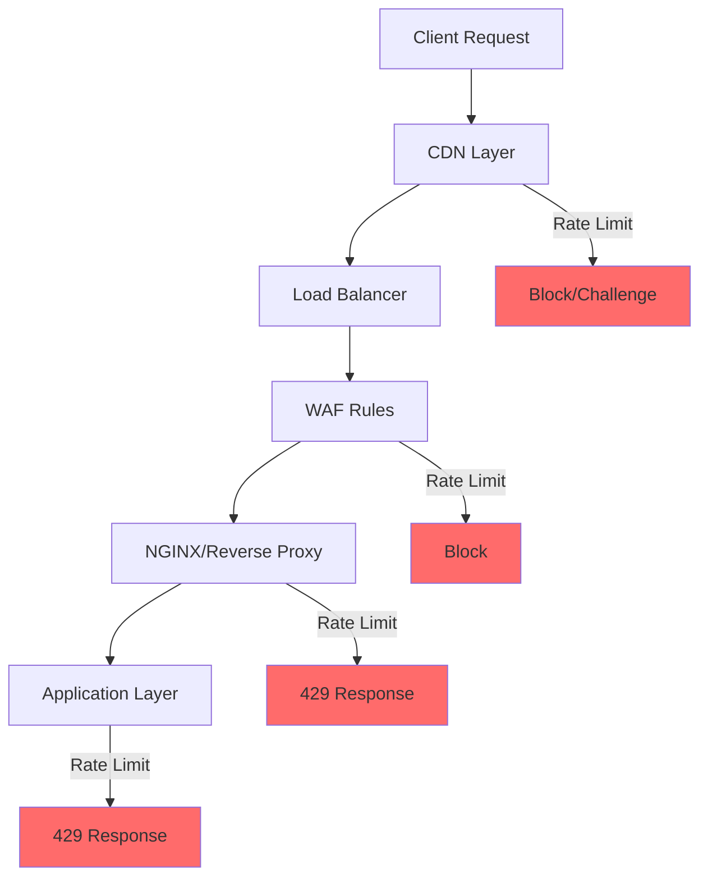

# How to Configure Rate Limiting for Security

Author: [nawazdhandala](https://www.github.com/nawazdhandala)

Tags: Security, Rate Limiting, API Security, DDoS Protection, DevOps

Description: Learn how to configure rate limiting to protect your applications from brute force attacks, DDoS, and API abuse with practical examples.

---

Rate limiting is one of the most effective security controls you can implement. It protects your applications from brute force attacks, credential stuffing, DDoS attempts, and API abuse. This guide covers how to configure rate limiting across different layers of your infrastructure.

## Why Rate Limiting Matters for Security

Without rate limiting, attackers can:
- Brute force login credentials at thousands of attempts per second
- Overwhelm your servers with automated requests
- Scrape your entire database through API endpoints
- Exploit expensive operations to cause denial of service

## Rate Limiting Architecture



## Layer 1: NGINX Rate Limiting

NGINX provides efficient rate limiting at the reverse proxy level before requests hit your application.

```nginx
# /etc/nginx/nginx.conf

http {
    # Define rate limit zones
    # Zone for general API requests: 10 requests per second per IP
    limit_req_zone $binary_remote_addr zone=api_limit:10m rate=10r/s;

    # Zone for login attempts: 5 requests per minute per IP
    limit_req_zone $binary_remote_addr zone=login_limit:10m rate=5r/m;

    # Zone for password reset: 3 requests per hour per IP
    limit_req_zone $binary_remote_addr zone=reset_limit:10m rate=3r/h;

    # Zone based on API key for authenticated requests
    limit_req_zone $http_x_api_key zone=apikey_limit:10m rate=100r/s;

    # Connection limiting
    limit_conn_zone $binary_remote_addr zone=conn_limit:10m;

    server {
        listen 80;
        server_name api.example.com;

        # Global connection limit
        limit_conn conn_limit 20;

        # General API endpoints
        location /api/ {
            # Allow burst of 20 requests, delay after 10
            limit_req zone=api_limit burst=20 delay=10;
            limit_req_status 429;

            # Custom error response
            error_page 429 = @rate_limited;

            proxy_pass http://backend;
        }

        # Strict rate limiting for authentication
        location /api/auth/login {
            limit_req zone=login_limit burst=3 nodelay;
            limit_req_status 429;

            proxy_pass http://backend;
        }

        # Very strict for password reset
        location /api/auth/reset-password {
            limit_req zone=reset_limit burst=1 nodelay;
            limit_req_status 429;

            proxy_pass http://backend;
        }

        # Rate limit response handler
        location @rate_limited {
            default_type application/json;
            return 429 '{"error": "Too many requests", "retry_after": 60}';
        }
    }
}
```

### NGINX Rate Limit Headers

Add headers to help clients understand rate limits:

```nginx
# Add rate limit headers
location /api/ {
    limit_req zone=api_limit burst=20 delay=10;

    # Add headers after successful processing
    add_header X-RateLimit-Limit 10 always;
    add_header X-RateLimit-Burst 20 always;

    proxy_pass http://backend;
}
```

## Layer 2: Application-Level Rate Limiting

### Express.js with Redis

For distributed applications, use Redis as a shared rate limit store:

```javascript
// rate-limiter.js
const Redis = require('ioredis');
const redis = new Redis(process.env.REDIS_URL);

class DistributedRateLimiter {
    constructor(options) {
        this.windowMs = options.windowMs || 60000;
        this.maxRequests = options.maxRequests || 100;
        this.keyPrefix = options.keyPrefix || 'rl:';
    }

    async isAllowed(identifier) {
        const key = `${this.keyPrefix}${identifier}`;
        const now = Date.now();
        const windowStart = now - this.windowMs;

        // Use Redis sorted set for sliding window
        const pipeline = redis.pipeline();

        // Remove old entries
        pipeline.zremrangebyscore(key, 0, windowStart);

        // Count current entries
        pipeline.zcard(key);

        // Add current request
        pipeline.zadd(key, now, `${now}-${Math.random()}`);

        // Set expiry
        pipeline.expire(key, Math.ceil(this.windowMs / 1000) + 1);

        const results = await pipeline.exec();
        const count = results[1][1];

        if (count >= this.maxRequests) {
            // Remove the request we just added
            await redis.zremrangebyscore(key, now, now);

            return {
                allowed: false,
                remaining: 0,
                resetAt: windowStart + this.windowMs
            };
        }

        return {
            allowed: true,
            remaining: this.maxRequests - count - 1
        };
    }
}

// Security-focused rate limiters
const rateLimiters = {
    // General API: 100 requests per minute
    api: new DistributedRateLimiter({
        windowMs: 60000,
        maxRequests: 100,
        keyPrefix: 'rl:api:'
    }),

    // Login: 5 attempts per 15 minutes per IP+username
    login: new DistributedRateLimiter({
        windowMs: 900000,
        maxRequests: 5,
        keyPrefix: 'rl:login:'
    }),

    // Registration: 3 per hour per IP
    register: new DistributedRateLimiter({
        windowMs: 3600000,
        maxRequests: 3,
        keyPrefix: 'rl:register:'
    }),

    // Password reset: 3 per hour per email
    passwordReset: new DistributedRateLimiter({
        windowMs: 3600000,
        maxRequests: 3,
        keyPrefix: 'rl:reset:'
    }),

    // API key creation: 5 per day
    apiKeyCreate: new DistributedRateLimiter({
        windowMs: 86400000,
        maxRequests: 5,
        keyPrefix: 'rl:apikey:'
    })
};

// Express middleware factory
function createRateLimitMiddleware(limiter, keyGenerator) {
    return async (req, res, next) => {
        const key = keyGenerator(req);
        const result = await limiter.isAllowed(key);

        res.set({
            'X-RateLimit-Limit': limiter.maxRequests,
            'X-RateLimit-Remaining': result.remaining,
            'X-RateLimit-Reset': Math.ceil((Date.now() + limiter.windowMs) / 1000)
        });

        if (!result.allowed) {
            res.set('Retry-After', Math.ceil(limiter.windowMs / 1000));
            return res.status(429).json({
                error: 'Too Many Requests',
                message: 'Rate limit exceeded. Please try again later.',
                retryAfter: Math.ceil(limiter.windowMs / 1000)
            });
        }

        next();
    };
}

module.exports = { rateLimiters, createRateLimitMiddleware };
```

### Using the Rate Limiters

```javascript
// app.js
const express = require('express');
const { rateLimiters, createRateLimitMiddleware } = require('./rate-limiter');

const app = express();

// Apply rate limiters to routes
app.use('/api', createRateLimitMiddleware(
    rateLimiters.api,
    (req) => req.ip
));

app.post('/api/auth/login',
    createRateLimitMiddleware(
        rateLimiters.login,
        // Key by IP and username to prevent targeted attacks
        (req) => `${req.ip}:${req.body.email || 'unknown'}`
    ),
    loginHandler
);

app.post('/api/auth/register',
    createRateLimitMiddleware(
        rateLimiters.register,
        (req) => req.ip
    ),
    registerHandler
);

app.post('/api/auth/reset-password',
    createRateLimitMiddleware(
        rateLimiters.passwordReset,
        // Key by email to prevent enumeration
        (req) => req.body.email || req.ip
    ),
    resetPasswordHandler
);
```

## Layer 3: Progressive Rate Limiting

Implement escalating penalties for repeated violations:

```javascript
class ProgressiveRateLimiter {
    constructor(redis) {
        this.redis = redis;
    }

    async checkAndPenalize(ip) {
        const violationKey = `violations:${ip}`;
        const blockKey = `blocked:${ip}`;

        // Check if IP is blocked
        const blocked = await this.redis.get(blockKey);
        if (blocked) {
            const ttl = await this.redis.ttl(blockKey);
            return {
                allowed: false,
                blockedFor: ttl,
                reason: 'IP temporarily blocked due to repeated violations'
            };
        }

        return { allowed: true };
    }

    async recordViolation(ip) {
        const violationKey = `violations:${ip}`;
        const blockKey = `blocked:${ip}`;

        // Increment violation count
        const violations = await this.redis.incr(violationKey);

        // Set expiry on first violation (24 hours)
        if (violations === 1) {
            await this.redis.expire(violationKey, 86400);
        }

        // Progressive blocking based on violation count
        let blockDuration = 0;
        if (violations >= 10) {
            blockDuration = 86400;  // 24 hours
        } else if (violations >= 5) {
            blockDuration = 3600;   // 1 hour
        } else if (violations >= 3) {
            blockDuration = 300;    // 5 minutes
        }

        if (blockDuration > 0) {
            await this.redis.setex(blockKey, blockDuration, '1');

            // Log security event
            console.log(`Security: IP ${ip} blocked for ${blockDuration}s after ${violations} violations`);
        }

        return { violations, blockDuration };
    }
}
```

## Security-Specific Rate Limits

| Endpoint | Limit | Window | Key |
|----------|-------|--------|-----|
| Login | 5 | 15 min | IP + Username |
| Register | 3 | 1 hour | IP |
| Password Reset | 3 | 1 hour | Email |
| 2FA Verify | 5 | 5 min | User ID |
| API Key Create | 5 | 24 hours | User ID |
| File Upload | 10 | 1 hour | User ID |
| Search | 30 | 1 min | IP |
| GraphQL | 100 | 1 min | API Key |

## Monitoring Rate Limit Events

```javascript
// Track rate limit events for security monitoring
const rateLimitEvents = {
    total: 0,
    byEndpoint: {},
    byIP: {}
};

function recordRateLimitEvent(req, endpoint) {
    rateLimitEvents.total++;

    rateLimitEvents.byEndpoint[endpoint] =
        (rateLimitEvents.byEndpoint[endpoint] || 0) + 1;

    rateLimitEvents.byIP[req.ip] =
        (rateLimitEvents.byIP[req.ip] || 0) + 1;

    // Alert on suspicious patterns
    if (rateLimitEvents.byIP[req.ip] > 100) {
        alertSecurityTeam({
            type: 'excessive_rate_limits',
            ip: req.ip,
            count: rateLimitEvents.byIP[req.ip],
            timestamp: new Date().toISOString()
        });
    }
}
```

## Best Practices

1. **Layer your defenses** - Apply rate limiting at CDN, WAF, reverse proxy, and application levels
2. **Use appropriate keys** - Combine IP with user identifiers for authentication endpoints
3. **Set sensible limits** - Too strict breaks legitimate users, too loose fails to protect
4. **Implement progressive penalties** - Escalate blocking duration for repeat offenders
5. **Return proper headers** - Help legitimate clients understand and respect limits
6. **Monitor and alert** - Track rate limit events to identify attack patterns
7. **Fail open carefully** - Decide whether to allow or deny when rate limit system fails

Rate limiting is not a complete security solution, but it significantly raises the bar for attackers and protects your infrastructure from abuse.
