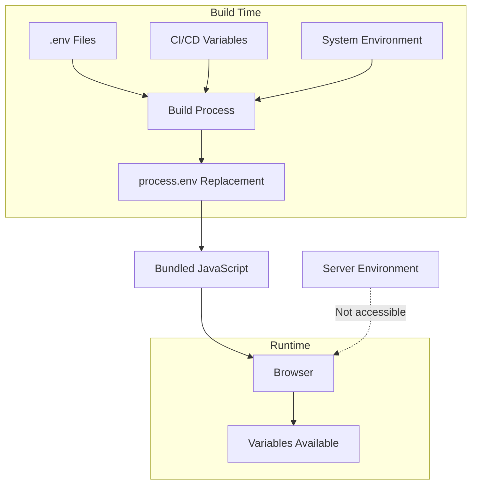
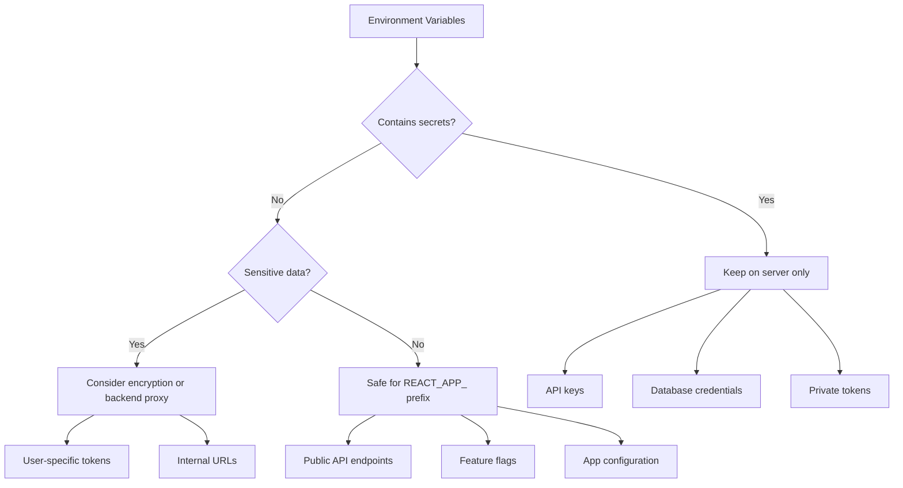

# How to Configure React Environment Variables

Author: [nawazdhandala](https://github.com/nawazdhandala)

Tags: React, Environment Variables, Configuration, JavaScript, Security, DevOps

Description: A comprehensive guide to configuring environment variables in React applications for different environments, including security best practices and deployment strategies.

---

Environment variables let you configure your React application differently for development, staging, and production without changing code. This guide covers how to set up, use, and secure environment variables in React applications.

## Understanding Environment Variables in React

React applications run in the browser, which means environment variables work differently than in Node.js. Variables are embedded into the JavaScript bundle at build time, not read at runtime.



## Create React App Configuration

Create React App has built-in support for environment variables.

### Setting Up Environment Files

Create environment files in your project root:

```bash
# .env - default values, loaded in all environments
REACT_APP_NAME=My Application

# .env.local - local overrides, not committed to git
REACT_APP_API_URL=http://localhost:3001

# .env.development - development-specific
REACT_APP_DEBUG=true
REACT_APP_API_URL=http://localhost:3001

# .env.production - production-specific
REACT_APP_API_URL=https://api.production.com

# .env.test - test environment
REACT_APP_API_URL=http://localhost:3001/test
```

### Naming Convention

All custom environment variables must start with `REACT_APP_`:

```bash
# These work
REACT_APP_API_URL=https://api.example.com
REACT_APP_FEATURE_FLAG=true
REACT_APP_VERSION=1.0.0

# These do NOT work (will be undefined)
API_URL=https://api.example.com
MY_SECRET=abc123
```

### Using Environment Variables

Access variables through `process.env`:

```typescript
// src/config/environment.ts

// Define the shape of your environment variables
interface Environment {
  apiUrl: string;
  appName: string;
  debug: boolean;
  version: string;
  environment: 'development' | 'production' | 'test';
}

// Parse and validate environment variables
function getEnvironment(): Environment {
  const apiUrl = process.env.REACT_APP_API_URL;
  const appName = process.env.REACT_APP_NAME;
  const debug = process.env.REACT_APP_DEBUG;
  const version = process.env.REACT_APP_VERSION;

  // Validate required variables
  if (!apiUrl) {
    throw new Error('REACT_APP_API_URL is required');
  }

  return {
    apiUrl,
    appName: appName || 'React App',
    debug: debug === 'true',
    version: version || '0.0.0',
    environment: (process.env.NODE_ENV as Environment['environment']) || 'development'
  };
}

// Export a singleton
export const env = getEnvironment();

// Usage example
console.log('API URL:', env.apiUrl);
console.log('Debug mode:', env.debug);
```

### Environment Priority

Files are loaded in this order (later files override earlier ones):

```bash
# Load order for npm start (development):
.env
.env.local
.env.development
.env.development.local

# Load order for npm run build (production):
.env
.env.local
.env.production
.env.production.local

# Load order for npm test:
.env
.env.local
.env.test
.env.test.local
```

## Vite Configuration

Vite uses a different prefix and exposes variables differently.

```bash
# .env files for Vite
VITE_API_URL=https://api.example.com
VITE_APP_TITLE=My Vite App
VITE_FEATURE_FLAGS={"darkMode":true,"newUI":false}
```

Access in code:

```typescript
// src/config/environment.ts (Vite)

interface Environment {
  apiUrl: string;
  appTitle: string;
  featureFlags: {
    darkMode: boolean;
    newUI: boolean;
  };
}

function getEnvironment(): Environment {
  const apiUrl = import.meta.env.VITE_API_URL as string;
  const appTitle = import.meta.env.VITE_APP_TITLE as string;
  const featureFlagsJson = import.meta.env.VITE_FEATURE_FLAGS as string;

  if (!apiUrl) {
    throw new Error('VITE_API_URL is required');
  }

  let featureFlags = { darkMode: false, newUI: false };
  try {
    featureFlags = JSON.parse(featureFlagsJson || '{}');
  } catch (e) {
    console.warn('Failed to parse VITE_FEATURE_FLAGS');
  }

  return {
    apiUrl,
    appTitle: appTitle || 'App',
    featureFlags
  };
}

export const env = getEnvironment();
```

Add TypeScript support for Vite environment variables:

```typescript
// src/vite-env.d.ts

/// <reference types="vite/client" />

interface ImportMetaEnv {
  readonly VITE_API_URL: string;
  readonly VITE_APP_TITLE: string;
  readonly VITE_FEATURE_FLAGS: string;
}

interface ImportMeta {
  readonly env: ImportMetaEnv;
}
```

## Webpack Configuration

For custom Webpack setups, use DefinePlugin or dotenv-webpack.

### Using DefinePlugin

```javascript
// webpack.config.js

const webpack = require('webpack');
const dotenv = require('dotenv');
const path = require('path');

// Load environment variables
const envPath = path.resolve(__dirname, `.env.${process.env.NODE_ENV || 'development'}`);
const envVars = dotenv.config({ path: envPath }).parsed || {};

// Also load base .env
const baseEnvVars = dotenv.config({ path: path.resolve(__dirname, '.env') }).parsed || {};

// Merge with base having lower priority
const allEnvVars = { ...baseEnvVars, ...envVars };

module.exports = {
  // ... other config

  plugins: [
    new webpack.DefinePlugin({
      // Make environment variables available as process.env
      'process.env': Object.keys(allEnvVars).reduce((env, key) => {
        env[key] = JSON.stringify(allEnvVars[key]);
        return env;
      }, {}),
      // Also define NODE_ENV
      'process.env.NODE_ENV': JSON.stringify(process.env.NODE_ENV || 'development')
    })
  ]
};
```

### Using dotenv-webpack

```bash
npm install --save-dev dotenv-webpack
```

```javascript
// webpack.config.js

const Dotenv = require('dotenv-webpack');

module.exports = {
  // ... other config

  plugins: [
    new Dotenv({
      // Path to .env file
      path: `./.env.${process.env.NODE_ENV || 'development'}`,
      // Load system environment variables
      systemvars: true,
      // Expose only variables starting with REACT_APP_
      allowEmptyValues: false,
      // Safe mode - only expose variables listed in .env.example
      safe: true,
      // Path to .env.example file
      example: './.env.example'
    })
  ]
};
```

## Runtime Configuration

For variables that need to change without rebuilding, use runtime configuration.

```typescript
// public/config.js - loaded before React

window.__CONFIG__ = {
  API_URL: 'https://api.example.com',
  FEATURE_FLAGS: {
    darkMode: true,
    newUI: false
  }
};
```

```html
<!-- public/index.html -->
<!DOCTYPE html>
<html lang="en">
<head>
    <meta charset="UTF-8">
    <!-- Load config before app bundle -->
    <script src="%PUBLIC_URL%/config.js"></script>
</head>
<body>
    <div id="root"></div>
</body>
</html>
```

```typescript
// src/config/runtime.ts

interface RuntimeConfig {
  API_URL: string;
  FEATURE_FLAGS: {
    darkMode: boolean;
    newUI: boolean;
  };
}

declare global {
  interface Window {
    __CONFIG__?: RuntimeConfig;
  }
}

// Get runtime config with fallbacks
export function getRuntimeConfig(): RuntimeConfig {
  const config = window.__CONFIG__;

  if (!config) {
    console.warn('Runtime config not found, using defaults');
    return {
      API_URL: process.env.REACT_APP_API_URL || '',
      FEATURE_FLAGS: {
        darkMode: false,
        newUI: false
      }
    };
  }

  return config;
}

export const runtimeConfig = getRuntimeConfig();
```

### Docker Runtime Configuration

Replace configuration at container startup:

```dockerfile
# Dockerfile

FROM node:20-alpine AS builder
WORKDIR /app
COPY package*.json ./
RUN npm ci
COPY . .
RUN npm run build

FROM nginx:alpine
COPY --from=builder /app/build /usr/share/nginx/html
COPY docker/nginx.conf /etc/nginx/nginx.conf
COPY docker/entrypoint.sh /entrypoint.sh

RUN chmod +x /entrypoint.sh

ENTRYPOINT ["/entrypoint.sh"]
CMD ["nginx", "-g", "daemon off;"]
```

```bash
#!/bin/sh
# docker/entrypoint.sh

# Replace placeholders in config.js with environment variables
cat > /usr/share/nginx/html/config.js << EOF
window.__CONFIG__ = {
  API_URL: '${API_URL}',
  FEATURE_FLAGS: {
    darkMode: ${FEATURE_FLAG_DARK_MODE:-false},
    newUI: ${FEATURE_FLAG_NEW_UI:-false}
  }
};
EOF

# Execute the main command
exec "$@"
```

```bash
# Run container with environment variables
docker run -d \
  -e API_URL=https://api.production.com \
  -e FEATURE_FLAG_DARK_MODE=true \
  -p 80:80 \
  my-react-app
```

## Security Best Practices

Environment variables in React are exposed to the client. Never include secrets.



### What NOT to Include

```bash
# NEVER put these in React environment variables

# API keys for services
STRIPE_SECRET_KEY=sk_live_xxx  # NO!
AWS_SECRET_ACCESS_KEY=xxx      # NO!
DATABASE_PASSWORD=xxx          # NO!

# These are safe for React
REACT_APP_STRIPE_PUBLIC_KEY=pk_live_xxx  # OK - public key
REACT_APP_API_URL=https://api.example.com  # OK - public URL
REACT_APP_GOOGLE_ANALYTICS_ID=UA-xxx  # OK - public ID
```

### Use a Backend Proxy for Secrets

```typescript
// Instead of exposing API keys in React:

// BAD - API key exposed in client bundle
const response = await fetch('https://api.stripe.com/v1/charges', {
  headers: {
    'Authorization': `Bearer ${process.env.REACT_APP_STRIPE_SECRET_KEY}`  // EXPOSED!
  }
});

// GOOD - call your backend which has the secret
const response = await fetch('/api/create-charge', {
  method: 'POST',
  body: JSON.stringify({ amount: 1000 })
});
```

```typescript
// Backend (Node.js/Express)
// The secret key stays on the server

const stripe = require('stripe')(process.env.STRIPE_SECRET_KEY);

app.post('/api/create-charge', async (req, res) => {
  const { amount } = req.body;

  const charge = await stripe.charges.create({
    amount,
    currency: 'usd',
    source: req.body.token
  });

  res.json(charge);
});
```

## Type-Safe Environment Configuration

Create a strongly-typed configuration module:

```typescript
// src/config/index.ts

// Define all environment variables
const envVars = {
  // Required variables
  REACT_APP_API_URL: process.env.REACT_APP_API_URL,
  REACT_APP_AUTH_DOMAIN: process.env.REACT_APP_AUTH_DOMAIN,

  // Optional with defaults
  REACT_APP_DEBUG: process.env.REACT_APP_DEBUG || 'false',
  REACT_APP_LOG_LEVEL: process.env.REACT_APP_LOG_LEVEL || 'warn',
  REACT_APP_FEATURE_NEW_UI: process.env.REACT_APP_FEATURE_NEW_UI || 'false'
};

// Validate required variables
const requiredVars = ['REACT_APP_API_URL', 'REACT_APP_AUTH_DOMAIN'] as const;

for (const varName of requiredVars) {
  if (!envVars[varName]) {
    throw new Error(`Missing required environment variable: ${varName}`);
  }
}

// Export typed configuration object
export const config = {
  api: {
    baseUrl: envVars.REACT_APP_API_URL as string,
    timeout: 30000
  },
  auth: {
    domain: envVars.REACT_APP_AUTH_DOMAIN as string,
    clientId: process.env.REACT_APP_AUTH_CLIENT_ID || ''
  },
  debug: envVars.REACT_APP_DEBUG === 'true',
  logLevel: envVars.REACT_APP_LOG_LEVEL as 'debug' | 'info' | 'warn' | 'error',
  features: {
    newUI: envVars.REACT_APP_FEATURE_NEW_UI === 'true'
  },
  environment: process.env.NODE_ENV as 'development' | 'production' | 'test'
} as const;

// Type for the config
export type Config = typeof config;
```

Usage:

```typescript
import { config } from './config';

// Fully typed access
const apiUrl = config.api.baseUrl;  // string
const isDebug = config.debug;  // boolean
const logLevel = config.logLevel;  // 'debug' | 'info' | 'warn' | 'error'

// Use in API calls
async function fetchData() {
  const response = await fetch(`${config.api.baseUrl}/data`, {
    signal: AbortSignal.timeout(config.api.timeout)
  });
  return response.json();
}

// Use in feature flags
function App() {
  return (
    <div>
      {config.features.newUI ? <NewDashboard /> : <OldDashboard />}
    </div>
  );
}
```

## CI/CD Integration

Configure environment variables in your CI/CD pipeline.

### GitHub Actions

```yaml
# .github/workflows/deploy.yml

name: Deploy

on:
  push:
    branches: [main]

jobs:
  build:
    runs-on: ubuntu-latest

    steps:
      - uses: actions/checkout@v4

      - name: Setup Node.js
        uses: actions/setup-node@v4
        with:
          node-version: '20'
          cache: 'npm'

      - name: Install dependencies
        run: npm ci

      - name: Build
        run: npm run build
        env:
          # Set environment variables from GitHub secrets
          REACT_APP_API_URL: ${{ secrets.API_URL }}
          REACT_APP_AUTH_DOMAIN: ${{ secrets.AUTH_DOMAIN }}
          REACT_APP_AUTH_CLIENT_ID: ${{ secrets.AUTH_CLIENT_ID }}
          # Or use vars for non-sensitive values
          REACT_APP_FEATURE_NEW_UI: ${{ vars.FEATURE_NEW_UI }}

      - name: Deploy
        run: |
          # Deploy to your hosting platform
          npx vercel --prod --token=${{ secrets.VERCEL_TOKEN }}
```

### Environment-Specific Builds

```yaml
# .github/workflows/deploy.yml

name: Deploy

on:
  push:
    branches:
      - main
      - staging
      - develop

jobs:
  build:
    runs-on: ubuntu-latest

    steps:
      - uses: actions/checkout@v4

      - name: Set environment
        id: set-env
        run: |
          if [ "${{ github.ref }}" == "refs/heads/main" ]; then
            echo "environment=production" >> $GITHUB_OUTPUT
          elif [ "${{ github.ref }}" == "refs/heads/staging" ]; then
            echo "environment=staging" >> $GITHUB_OUTPUT
          else
            echo "environment=development" >> $GITHUB_OUTPUT
          fi

      - name: Build for ${{ steps.set-env.outputs.environment }}
        run: npm run build
        env:
          REACT_APP_API_URL: ${{ secrets[format('API_URL_{0}', steps.set-env.outputs.environment)] }}
          REACT_APP_ENVIRONMENT: ${{ steps.set-env.outputs.environment }}
```

## Debugging Environment Variables

```typescript
// src/debug/env-debug.ts

export function debugEnvironment(): void {
  if (process.env.NODE_ENV !== 'development') {
    return;
  }

  console.group('Environment Variables');

  // List all REACT_APP_ variables
  Object.keys(process.env)
    .filter(key => key.startsWith('REACT_APP_'))
    .sort()
    .forEach(key => {
      const value = process.env[key];
      // Mask potentially sensitive values
      const displayValue = key.includes('KEY') || key.includes('SECRET')
        ? '***MASKED***'
        : value;
      console.log(`${key}: ${displayValue}`);
    });

  console.log('NODE_ENV:', process.env.NODE_ENV);
  console.log('PUBLIC_URL:', process.env.PUBLIC_URL);

  console.groupEnd();
}

// Add to your app entry point
if (process.env.NODE_ENV === 'development') {
  debugEnvironment();
}
```

## Summary

| Aspect | Create React App | Vite | Webpack |
|--------|-----------------|------|---------|
| **Prefix** | REACT_APP_ | VITE_ | Custom |
| **Access** | process.env | import.meta.env | process.env |
| **Build time** | Yes | Yes | Yes |
| **Runtime** | No (use config.js) | No | No |
| **TypeScript** | Manual | Built-in support | Manual |

Environment variables are essential for configuring React applications across different environments. Always remember that variables are embedded at build time and exposed in the client bundle. Never include secrets in frontend environment variables. Use runtime configuration or backend proxies for sensitive data that needs to change without rebuilding.
