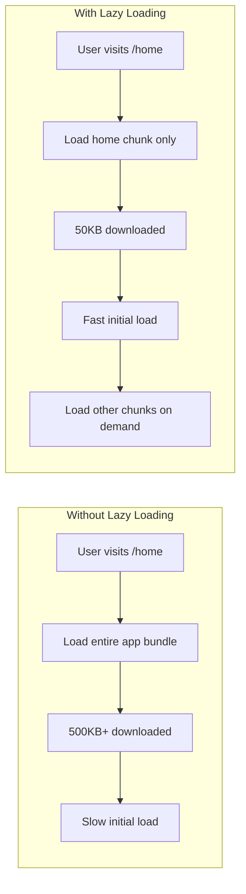
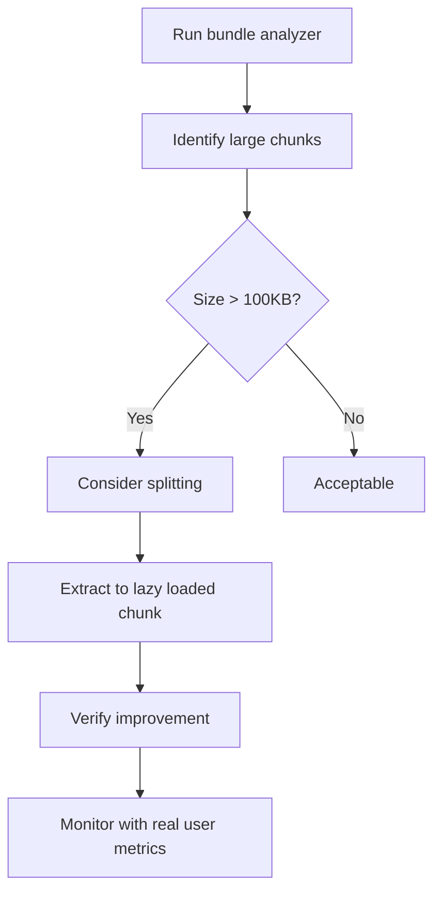
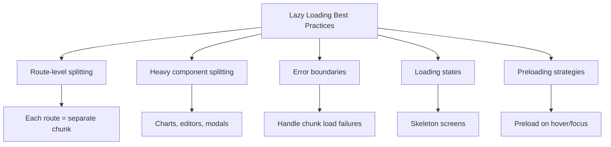

# How to Configure React Lazy Loading

Author: [nawazdhandala](https://github.com/nawazdhandala)

Tags: React, JavaScript, Performance, Code Splitting, Frontend, Optimization

Description: A comprehensive guide to implementing lazy loading in React applications using React.lazy, Suspense, and advanced code splitting strategies.

---

Lazy loading (also known as code splitting) is a technique that allows you to load components only when they are needed, rather than loading your entire application upfront. This can significantly improve initial load time and overall performance. This guide covers everything from basic setup to advanced patterns.

## Why Lazy Loading Matters



## Basic Lazy Loading Setup

### Using React.lazy and Suspense

```javascript
// App.js
import React, { Suspense, lazy } from 'react';
import { BrowserRouter, Routes, Route } from 'react-router-dom';

// Eager loaded - always in main bundle
import Navbar from './components/Navbar';
import LoadingSpinner from './components/LoadingSpinner';

// Lazy loaded - separate chunks
const Home = lazy(() => import('./pages/Home'));
const Dashboard = lazy(() => import('./pages/Dashboard'));
const Settings = lazy(() => import('./pages/Settings'));
const Profile = lazy(() => import('./pages/Profile'));

function App() {
  return (
    <BrowserRouter>
      <Navbar />
      <Suspense fallback={<LoadingSpinner />}>
        <Routes>
          <Route path="/" element={<Home />} />
          <Route path="/dashboard" element={<Dashboard />} />
          <Route path="/settings" element={<Settings />} />
          <Route path="/profile" element={<Profile />} />
        </Routes>
      </Suspense>
    </BrowserRouter>
  );
}

export default App;
```

### Loading Fallback Component

Create a proper loading component:

```javascript
// LoadingSpinner.js
function LoadingSpinner({ message = 'Loading...' }) {
  return (
    <div className="loading-container">
      <div className="spinner"></div>
      <p>{message}</p>
    </div>
  );
}

// LoadingSkeleton.js - For content-aware loading
function PageSkeleton() {
  return (
    <div className="page-skeleton">
      <div className="skeleton-header"></div>
      <div className="skeleton-content">
        <div className="skeleton-line"></div>
        <div className="skeleton-line"></div>
        <div className="skeleton-line short"></div>
      </div>
    </div>
  );
}

// CSS for skeleton loading
const skeletonStyles = `
.page-skeleton {
  padding: 20px;
}

.skeleton-header,
.skeleton-line {
  background: linear-gradient(
    90deg,
    #f0f0f0 25%,
    #e0e0e0 50%,
    #f0f0f0 75%
  );
  background-size: 200% 100%;
  animation: shimmer 1.5s infinite;
  border-radius: 4px;
}

.skeleton-header {
  height: 40px;
  margin-bottom: 20px;
}

.skeleton-line {
  height: 20px;
  margin-bottom: 10px;
}

.skeleton-line.short {
  width: 60%;
}

@keyframes shimmer {
  0% { background-position: -200% 0; }
  100% { background-position: 200% 0; }
}
`;
```

## Advanced Lazy Loading Patterns

### Named Exports with Lazy Loading

React.lazy only works with default exports. For named exports, use this pattern:

```javascript
// utils.js - Named exports
export const Dashboard = () => <div>Dashboard</div>;
export const Analytics = () => <div>Analytics</div>;

// Lazy loading named exports
const Dashboard = lazy(() =>
  import('./utils').then(module => ({
    default: module.Dashboard
  }))
);

const Analytics = lazy(() =>
  import('./utils').then(module => ({
    default: module.Analytics
  }))
);

// Helper function for cleaner syntax
function lazyLoadNamed(importFn, componentName) {
  return lazy(() =>
    importFn().then(module => ({
      default: module[componentName]
    }))
  );
}

// Usage
const Dashboard = lazyLoadNamed(
  () => import('./utils'),
  'Dashboard'
);
```

### Preloading Components

Preload components before they are needed for better UX:

```javascript
// preloadable.js
function preloadable(importFn) {
  const Component = lazy(importFn);

  // Attach preload function to the component
  Component.preload = importFn;

  return Component;
}

// Usage
const Dashboard = preloadable(() => import('./pages/Dashboard'));
const Settings = preloadable(() => import('./pages/Settings'));

// Preload on hover
function NavLink({ to, children, component }) {
  const handleMouseEnter = () => {
    if (component && component.preload) {
      component.preload();
    }
  };

  return (
    <Link
      to={to}
      onMouseEnter={handleMouseEnter}
    >
      {children}
    </Link>
  );
}

// In navigation
<NavLink to="/dashboard" component={Dashboard}>Dashboard</NavLink>
<NavLink to="/settings" component={Settings}>Settings</NavLink>
```

### Route-Based Code Splitting with Preloading

```javascript
// routes.js
const routes = [
  {
    path: '/',
    component: lazy(() => import('./pages/Home')),
    preload: () => import('./pages/Home')
  },
  {
    path: '/dashboard',
    component: lazy(() => import('./pages/Dashboard')),
    preload: () => import('./pages/Dashboard')
  },
  {
    path: '/analytics',
    component: lazy(() => import('./pages/Analytics')),
    preload: () => import('./pages/Analytics')
  }
];

// Preload next likely routes
function useRoutePreloader(currentPath) {
  useEffect(() => {
    // Define route relationships
    const preloadMap = {
      '/': ['/dashboard'],
      '/dashboard': ['/analytics', '/settings'],
      '/analytics': ['/reports']
    };

    const toPreload = preloadMap[currentPath] || [];

    // Preload after a short delay
    const timer = setTimeout(() => {
      toPreload.forEach(path => {
        const route = routes.find(r => r.path === path);
        if (route && route.preload) {
          route.preload();
        }
      });
    }, 1000);

    return () => clearTimeout(timer);
  }, [currentPath]);
}
```

### Component-Level Lazy Loading

Lazy load specific components within a page:

```javascript
// Dashboard.js
import React, { Suspense, lazy, useState } from 'react';

// Heavy components loaded on demand
const Chart = lazy(() => import('./components/Chart'));
const DataTable = lazy(() => import('./components/DataTable'));
const ExportModal = lazy(() => import('./components/ExportModal'));

function Dashboard() {
  const [showExport, setShowExport] = useState(false);
  const [activeTab, setActiveTab] = useState('chart');

  return (
    <div className="dashboard">
      <header>
        <h1>Dashboard</h1>
        <button onClick={() => setShowExport(true)}>
          Export Data
        </button>
      </header>

      <nav className="tabs">
        <button
          className={activeTab === 'chart' ? 'active' : ''}
          onClick={() => setActiveTab('chart')}
        >
          Chart View
        </button>
        <button
          className={activeTab === 'table' ? 'active' : ''}
          onClick={() => setActiveTab('table')}
        >
          Table View
        </button>
      </nav>

      <main>
        <Suspense fallback={<div>Loading visualization...</div>}>
          {activeTab === 'chart' && <Chart />}
          {activeTab === 'table' && <DataTable />}
        </Suspense>
      </main>

      {/* Modal only loads when needed */}
      {showExport && (
        <Suspense fallback={<div>Loading...</div>}>
          <ExportModal onClose={() => setShowExport(false)} />
        </Suspense>
      )}
    </div>
  );
}
```

## Error Handling with Lazy Loading

Combine lazy loading with error boundaries:

```javascript
// LazyLoadErrorBoundary.js
import React from 'react';

class LazyLoadErrorBoundary extends React.Component {
  constructor(props) {
    super(props);
    this.state = { hasError: false, error: null };
  }

  static getDerivedStateFromError(error) {
    return { hasError: true, error };
  }

  componentDidCatch(error, errorInfo) {
    // Log the error
    console.error('Lazy load error:', error, errorInfo);

    // Check if it is a chunk loading error
    if (error.name === 'ChunkLoadError') {
      // Could be a network issue or deployment
      console.log('Chunk failed to load, may need refresh');
    }
  }

  handleRetry = () => {
    this.setState({ hasError: false, error: null });
  };

  handleRefresh = () => {
    window.location.reload();
  };

  render() {
    if (this.state.hasError) {
      const isChunkError = this.state.error?.name === 'ChunkLoadError';

      return (
        <div className="lazy-load-error">
          <h2>Failed to load component</h2>
          {isChunkError ? (
            <>
              <p>
                This might be due to a new deployment.
                Please refresh the page.
              </p>
              <button onClick={this.handleRefresh}>
                Refresh Page
              </button>
            </>
          ) : (
            <>
              <p>Something went wrong loading this section.</p>
              <button onClick={this.handleRetry}>
                Try Again
              </button>
            </>
          )}
        </div>
      );
    }

    return this.props.children;
  }
}

// Usage
function App() {
  return (
    <LazyLoadErrorBoundary>
      <Suspense fallback={<LoadingSpinner />}>
        <Routes>
          <Route path="/" element={<Home />} />
          <Route path="/dashboard" element={<Dashboard />} />
        </Routes>
      </Suspense>
    </LazyLoadErrorBoundary>
  );
}
```

### Retry Logic for Failed Chunks

```javascript
// retryLazy.js
function retryLazy(importFn, retries = 3, delay = 1000) {
  return lazy(() => {
    let attempts = 0;

    const tryImport = () => {
      return importFn().catch(error => {
        attempts++;

        if (attempts >= retries) {
          throw error;
        }

        // Exponential backoff
        const waitTime = delay * Math.pow(2, attempts - 1);

        return new Promise(resolve => {
          setTimeout(() => {
            resolve(tryImport());
          }, waitTime);
        });
      });
    };

    return tryImport();
  });
}

// Usage
const Dashboard = retryLazy(
  () => import('./pages/Dashboard'),
  3,  // 3 retries
  1000 // 1 second initial delay
);
```

## Webpack Magic Comments

Use webpack magic comments for better control:

```javascript
// Named chunks for better debugging
const Dashboard = lazy(() =>
  import(/* webpackChunkName: "dashboard" */ './pages/Dashboard')
);

// Prefetch - load in browser idle time
const Settings = lazy(() =>
  import(/* webpackPrefetch: true */ './pages/Settings')
);

// Preload - load immediately with higher priority
const CriticalFeature = lazy(() =>
  import(/* webpackPreload: true */ './components/CriticalFeature')
);

// Combine multiple options
const Analytics = lazy(() =>
  import(
    /* webpackChunkName: "analytics" */
    /* webpackPrefetch: true */
    './pages/Analytics'
  )
);
```

## Bundle Analysis



### Setting Up Bundle Analysis

```javascript
// package.json
{
  "scripts": {
    "analyze": "npm run build && npx source-map-explorer 'build/static/js/*.js'",
    "analyze:webpack": "webpack-bundle-analyzer build/stats.json"
  }
}

// For Create React App with CRACO
// craco.config.js
const BundleAnalyzerPlugin = require('webpack-bundle-analyzer').BundleAnalyzerPlugin;

module.exports = {
  webpack: {
    plugins: {
      add: [
        new BundleAnalyzerPlugin({
          analyzerMode: process.env.ANALYZE ? 'server' : 'disabled'
        })
      ]
    }
  }
};
```

## Performance Monitoring

Track lazy loading performance:

```javascript
// LazyLoadMetrics.js
const loadTimes = new Map();

function measureLazyLoad(name, importFn) {
  return lazy(() => {
    const startTime = performance.now();

    return importFn().then(module => {
      const loadTime = performance.now() - startTime;
      loadTimes.set(name, loadTime);

      // Report to analytics
      console.log(`[Lazy Load] ${name}: ${loadTime.toFixed(2)}ms`);

      // Send to your analytics service
      // analytics.track('lazy_load', { name, loadTime });

      return module;
    });
  });
}

// Usage
const Dashboard = measureLazyLoad(
  'Dashboard',
  () => import('./pages/Dashboard')
);

// Get all load times
function getLazyLoadMetrics() {
  return Object.fromEntries(loadTimes);
}
```

## Best Practices Summary



### When to Lazy Load

1. **Route-level components**: Always lazy load page components
2. **Heavy libraries**: Charts, rich text editors, PDF viewers
3. **Modals and dialogs**: Load only when triggered
4. **Below-the-fold content**: Content not visible on initial load
5. **Admin/authenticated sections**: Features not all users need

### When NOT to Lazy Load

1. **Critical above-the-fold content**: Main UI that users see immediately
2. **Small components**: The overhead is not worth it for tiny components
3. **Frequently used components**: Components needed on most pages
4. **Authentication components**: Login/signup should load fast

## Complete Example

```javascript
// App.js - Production-ready lazy loading setup
import React, { Suspense, lazy } from 'react';
import { BrowserRouter, Routes, Route, useLocation } from 'react-router-dom';

// Always loaded
import Navbar from './components/Navbar';
import Footer from './components/Footer';
import LazyLoadErrorBoundary from './components/LazyLoadErrorBoundary';
import PageSkeleton from './components/PageSkeleton';

// Lazy loaded with retry and metrics
function createLazyComponent(importFn, name) {
  return lazy(() => {
    const start = performance.now();

    return importFn()
      .then(module => {
        console.log(`Loaded ${name} in ${(performance.now() - start).toFixed(0)}ms`);
        return module;
      })
      .catch(error => {
        console.error(`Failed to load ${name}:`, error);
        throw error;
      });
  });
}

// Pages
const Home = createLazyComponent(
  () => import(/* webpackChunkName: "home" */ './pages/Home'),
  'Home'
);
const Dashboard = createLazyComponent(
  () => import(/* webpackChunkName: "dashboard" */ './pages/Dashboard'),
  'Dashboard'
);
const Settings = createLazyComponent(
  () => import(/* webpackChunkName: "settings", webpackPrefetch: true */ './pages/Settings'),
  'Settings'
);
const Profile = createLazyComponent(
  () => import(/* webpackChunkName: "profile" */ './pages/Profile'),
  'Profile'
);

function AppContent() {
  const location = useLocation();

  return (
    <div className="app">
      <Navbar />
      <main>
        <LazyLoadErrorBoundary key={location.pathname}>
          <Suspense fallback={<PageSkeleton />}>
            <Routes>
              <Route path="/" element={<Home />} />
              <Route path="/dashboard" element={<Dashboard />} />
              <Route path="/settings" element={<Settings />} />
              <Route path="/profile" element={<Profile />} />
            </Routes>
          </Suspense>
        </LazyLoadErrorBoundary>
      </main>
      <Footer />
    </div>
  );
}

function App() {
  return (
    <BrowserRouter>
      <AppContent />
    </BrowserRouter>
  );
}

export default App;
```

## Summary

Lazy loading in React is essential for building performant applications. Key takeaways:

1. Use `React.lazy` and `Suspense` for basic code splitting
2. Implement error boundaries to handle chunk load failures gracefully
3. Use webpack magic comments for prefetching and named chunks
4. Preload components on user intent (hover, focus) for better UX
5. Monitor bundle sizes and lazy load performance
6. Apply lazy loading strategically - not everything needs to be lazy loaded
