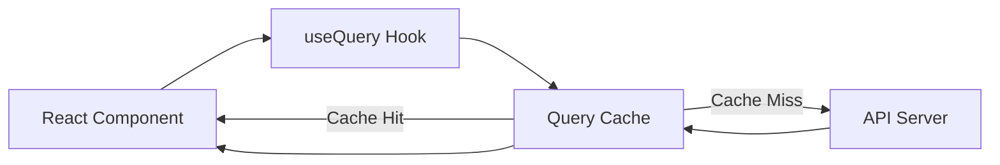
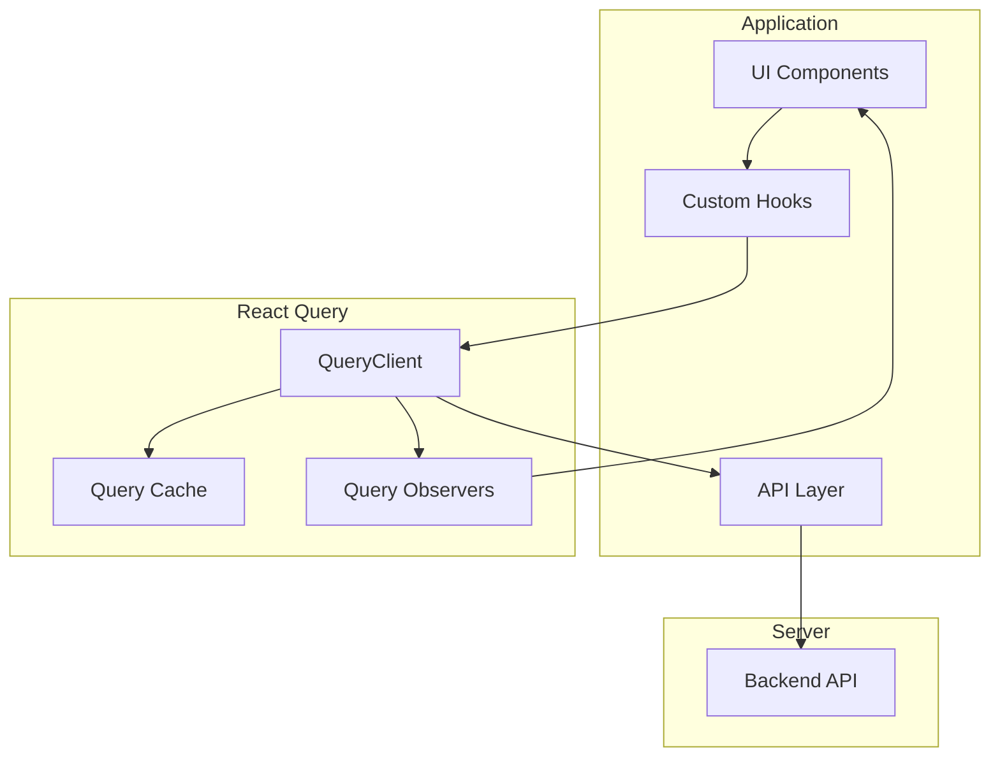

# How to Configure React Query for Data Fetching

Author: [nawazdhandala](https://www.github.com/nawazdhandala)

Tags: React, React Query, TanStack Query, Data Fetching, Caching, JavaScript, TypeScript, Frontend

Description: Learn how to configure React Query for efficient data fetching with caching, background updates, and error handling in React applications.

---

> React Query transforms how you handle server state in React applications. Instead of managing loading states, caching, and refetching manually, React Query provides a declarative approach that simplifies data synchronization. Stop reinventing the wheel with custom fetch logic.

Data fetching in React has long been a pain point. React Query solves this elegantly with built-in caching, deduplication, and background updates.

---

## Overview



---

## Installation

Install React Query (now part of TanStack Query) and the DevTools for debugging:

```bash
# Install React Query and DevTools
npm install @tanstack/react-query @tanstack/react-query-devtools

# Or with yarn
yarn add @tanstack/react-query @tanstack/react-query-devtools
```

---

## Basic Setup

### Configure QueryClient

Create a QueryClient instance with default options that apply to all queries in your application:

```typescript
// src/lib/queryClient.ts
import { QueryClient } from '@tanstack/react-query';

// Create a client with sensible defaults for production use
export const queryClient = new QueryClient({
  defaultOptions: {
    queries: {
      // Data is considered fresh for 5 minutes
      // During this time, cached data is returned without refetching
      staleTime: 5 * 60 * 1000,

      // Cache is kept for 30 minutes after component unmounts
      // This allows instant data display when navigating back
      gcTime: 30 * 60 * 1000,

      // Retry failed requests 3 times with exponential backoff
      retry: 3,

      // Refetch when window regains focus (useful for stale tabs)
      refetchOnWindowFocus: true,

      // Do not refetch when component remounts if data is fresh
      refetchOnMount: false,
    },
    mutations: {
      // Retry mutations once on failure
      retry: 1,
    },
  },
});
```

### Wrap Your Application

Provide the QueryClient to your application using QueryClientProvider:

```tsx
// src/main.tsx
import React from 'react';
import ReactDOM from 'react-dom/client';
import { QueryClientProvider } from '@tanstack/react-query';
import { ReactQueryDevtools } from '@tanstack/react-query-devtools';
import { queryClient } from './lib/queryClient';
import App from './App';

ReactDOM.createRoot(document.getElementById('root')!).render(
  <React.StrictMode>
    <QueryClientProvider client={queryClient}>
      {/* Your app components */}
      <App />

      {/* DevTools only appear in development mode */}
      <ReactQueryDevtools initialIsOpen={false} />
    </QueryClientProvider>
  </React.StrictMode>
);
```

---

## Data Fetching Architecture



---

## Basic Query Usage

### Simple Data Fetching

Use the useQuery hook to fetch and cache data:

```tsx
// src/hooks/useUser.ts
import { useQuery } from '@tanstack/react-query';

// Define the User type for type safety
interface User {
  id: number;
  name: string;
  email: string;
  role: string;
}

// API function that fetches user data
// Keep API calls separate from hooks for better testing
async function fetchUser(userId: number): Promise<User> {
  const response = await fetch(`/api/users/${userId}`);

  if (!response.ok) {
    // Throw error to trigger React Query's error handling
    throw new Error(`Failed to fetch user: ${response.statusText}`);
  }

  return response.json();
}

// Custom hook that wraps useQuery for fetching a single user
export function useUser(userId: number) {
  return useQuery({
    // Unique key for this query - includes userId for per-user caching
    // React Query uses this key to identify and cache the query
    queryKey: ['user', userId],

    // Function that fetches the data
    queryFn: () => fetchUser(userId),

    // Only run query if userId is provided
    enabled: !!userId,
  });
}
```

### Using the Hook in a Component

```tsx
// src/components/UserProfile.tsx
import { useUser } from '../hooks/useUser';

interface UserProfileProps {
  userId: number;
}

export function UserProfile({ userId }: UserProfileProps) {
  // Destructure the query result for easy access to state
  const {
    data: user,
    isLoading,
    isError,
    error,
    refetch,
  } = useUser(userId);

  // Show loading state while data is being fetched
  if (isLoading) {
    return <div className="loading">Loading user profile...</div>;
  }

  // Show error state with retry option
  if (isError) {
    return (
      <div className="error">
        <p>Error loading user: {error.message}</p>
        <button onClick={() => refetch()}>Try Again</button>
      </div>
    );
  }

  // Render user data once available
  return (
    <div className="user-profile">
      <h2>{user.name}</h2>
      <p>Email: {user.email}</p>
      <p>Role: {user.role}</p>
    </div>
  );
}
```

---

## Query Keys Strategy

### Hierarchical Query Keys

Structure query keys hierarchically for effective cache invalidation:

```typescript
// src/lib/queryKeys.ts

// Query key factory pattern for consistent key generation
export const queryKeys = {
  // All user-related queries
  users: {
    // Base key for all user queries
    all: ['users'] as const,

    // List queries with optional filters
    lists: () => [...queryKeys.users.all, 'list'] as const,

    // Filtered list query
    list: (filters: UserFilters) =>
      [...queryKeys.users.lists(), filters] as const,

    // Single user queries
    details: () => [...queryKeys.users.all, 'detail'] as const,

    // Single user by ID
    detail: (id: number) =>
      [...queryKeys.users.details(), id] as const,
  },

  // All post-related queries
  posts: {
    all: ['posts'] as const,
    lists: () => [...queryKeys.posts.all, 'list'] as const,
    list: (filters: PostFilters) =>
      [...queryKeys.posts.lists(), filters] as const,
    details: () => [...queryKeys.posts.all, 'detail'] as const,
    detail: (id: number) =>
      [...queryKeys.posts.details(), id] as const,

    // Posts by a specific user
    byUser: (userId: number) =>
      [...queryKeys.posts.all, 'user', userId] as const,
  },
};

// Usage examples:
// queryKeys.users.all           -> ['users']
// queryKeys.users.detail(5)     -> ['users', 'detail', 5]
// queryKeys.posts.byUser(3)     -> ['posts', 'user', 3]
```

### Using Query Keys

```typescript
// src/hooks/usePosts.ts
import { useQuery, useQueryClient } from '@tanstack/react-query';
import { queryKeys } from '../lib/queryKeys';

interface PostFilters {
  status?: 'draft' | 'published';
  category?: string;
  page?: number;
}

export function usePosts(filters: PostFilters = {}) {
  return useQuery({
    // Use the query key factory for consistent keys
    queryKey: queryKeys.posts.list(filters),
    queryFn: () => fetchPosts(filters),
  });
}

export function useInvalidatePosts() {
  const queryClient = useQueryClient();

  return {
    // Invalidate all post queries
    invalidateAll: () =>
      queryClient.invalidateQueries({
        queryKey: queryKeys.posts.all,
      }),

    // Invalidate only list queries
    invalidateLists: () =>
      queryClient.invalidateQueries({
        queryKey: queryKeys.posts.lists(),
      }),

    // Invalidate posts by a specific user
    invalidateByUser: (userId: number) =>
      queryClient.invalidateQueries({
        queryKey: queryKeys.posts.byUser(userId),
      }),
  };
}
```

---

## Mutations

### Creating Data

Use useMutation for create, update, and delete operations:

```typescript
// src/hooks/useCreatePost.ts
import { useMutation, useQueryClient } from '@tanstack/react-query';
import { queryKeys } from '../lib/queryKeys';

interface CreatePostData {
  title: string;
  content: string;
  categoryId: number;
}

interface Post {
  id: number;
  title: string;
  content: string;
  categoryId: number;
  createdAt: string;
}

async function createPost(data: CreatePostData): Promise<Post> {
  const response = await fetch('/api/posts', {
    method: 'POST',
    headers: { 'Content-Type': 'application/json' },
    body: JSON.stringify(data),
  });

  if (!response.ok) {
    throw new Error('Failed to create post');
  }

  return response.json();
}

export function useCreatePost() {
  const queryClient = useQueryClient();

  return useMutation({
    // Function that performs the mutation
    mutationFn: createPost,

    // Called when mutation succeeds
    onSuccess: (newPost) => {
      // Invalidate post list queries to refetch with new post
      queryClient.invalidateQueries({
        queryKey: queryKeys.posts.lists(),
      });

      // Optionally, add the new post directly to the cache
      // This provides instant UI update without waiting for refetch
      queryClient.setQueryData(
        queryKeys.posts.detail(newPost.id),
        newPost
      );
    },

    // Called when mutation fails
    onError: (error) => {
      console.error('Failed to create post:', error);
    },
  });
}
```

### Using Mutations in Components

```tsx
// src/components/CreatePostForm.tsx
import { useState } from 'react';
import { useCreatePost } from '../hooks/useCreatePost';

export function CreatePostForm() {
  const [title, setTitle] = useState('');
  const [content, setContent] = useState('');

  // Get mutation function and state
  const createPost = useCreatePost();

  const handleSubmit = async (e: React.FormEvent) => {
    e.preventDefault();

    // Call the mutation
    createPost.mutate(
      { title, content, categoryId: 1 },
      {
        // Callback when this specific mutation succeeds
        onSuccess: () => {
          // Clear form after successful creation
          setTitle('');
          setContent('');
        },
      }
    );
  };

  return (
    <form onSubmit={handleSubmit}>
      <input
        type="text"
        value={title}
        onChange={(e) => setTitle(e.target.value)}
        placeholder="Post title"
        disabled={createPost.isPending}
      />

      <textarea
        value={content}
        onChange={(e) => setContent(e.target.value)}
        placeholder="Post content"
        disabled={createPost.isPending}
      />

      <button type="submit" disabled={createPost.isPending}>
        {createPost.isPending ? 'Creating...' : 'Create Post'}
      </button>

      {createPost.isError && (
        <p className="error">
          Error: {createPost.error.message}
        </p>
      )}
    </form>
  );
}
```

---

## Optimistic Updates

### Update UI Before Server Response

Implement optimistic updates for instant feedback:

```typescript
// src/hooks/useUpdatePost.ts
import { useMutation, useQueryClient } from '@tanstack/react-query';
import { queryKeys } from '../lib/queryKeys';

interface UpdatePostData {
  id: number;
  title?: string;
  content?: string;
}

export function useUpdatePost() {
  const queryClient = useQueryClient();

  return useMutation({
    mutationFn: updatePost,

    // Called before the mutation function runs
    onMutate: async (updatedPost) => {
      // Cancel any outgoing refetches to prevent race conditions
      await queryClient.cancelQueries({
        queryKey: queryKeys.posts.detail(updatedPost.id),
      });

      // Snapshot the previous value for rollback
      const previousPost = queryClient.getQueryData(
        queryKeys.posts.detail(updatedPost.id)
      );

      // Optimistically update the cache with new data
      queryClient.setQueryData(
        queryKeys.posts.detail(updatedPost.id),
        (old: Post) => ({ ...old, ...updatedPost })
      );

      // Return context with previous value for rollback
      return { previousPost };
    },

    // Called if the mutation fails
    onError: (err, updatedPost, context) => {
      // Roll back to the previous value on error
      if (context?.previousPost) {
        queryClient.setQueryData(
          queryKeys.posts.detail(updatedPost.id),
          context.previousPost
        );
      }
    },

    // Called after mutation succeeds or fails
    onSettled: (data, error, variables) => {
      // Invalidate to ensure cache is in sync with server
      queryClient.invalidateQueries({
        queryKey: queryKeys.posts.detail(variables.id),
      });
    },
  });
}
```

---

## Pagination and Infinite Queries

### Paginated Queries

Handle paginated data with keepPreviousData:

```typescript
// src/hooks/usePaginatedPosts.ts
import { useQuery, keepPreviousData } from '@tanstack/react-query';

interface PaginatedResponse<T> {
  data: T[];
  meta: {
    currentPage: number;
    totalPages: number;
    totalItems: number;
  };
}

export function usePaginatedPosts(page: number, pageSize: number = 10) {
  return useQuery({
    queryKey: ['posts', 'paginated', { page, pageSize }],

    queryFn: () => fetchPaginatedPosts(page, pageSize),

    // Keep showing previous page data while fetching next page
    // This prevents UI flicker during page navigation
    placeholderData: keepPreviousData,
  });
}
```

### Infinite Scroll

Implement infinite scroll with useInfiniteQuery:

```typescript
// src/hooks/useInfinitePosts.ts
import { useInfiniteQuery } from '@tanstack/react-query';

interface InfinitePostsResponse {
  posts: Post[];
  nextCursor: number | null;
}

async function fetchInfinitePosts(
  cursor: number | null
): Promise<InfinitePostsResponse> {
  const url = cursor
    ? `/api/posts?cursor=${cursor}`
    : '/api/posts';

  const response = await fetch(url);
  return response.json();
}

export function useInfinitePosts() {
  return useInfiniteQuery({
    queryKey: ['posts', 'infinite'],

    queryFn: ({ pageParam }) => fetchInfinitePosts(pageParam),

    // Starting cursor for the first page
    initialPageParam: null as number | null,

    // Extract the cursor for the next page from the response
    getNextPageParam: (lastPage) => lastPage.nextCursor,

    // Optionally get previous page cursor for bidirectional scroll
    getPreviousPageParam: (firstPage) => firstPage.previousCursor,
  });
}
```

### Using Infinite Query in Component

```tsx
// src/components/InfinitePostList.tsx
import { useInfinitePosts } from '../hooks/useInfinitePosts';
import { useInView } from 'react-intersection-observer';
import { useEffect } from 'react';

export function InfinitePostList() {
  const {
    data,
    fetchNextPage,
    hasNextPage,
    isFetchingNextPage,
    isLoading,
    isError,
  } = useInfinitePosts();

  // Intersection observer for infinite scroll trigger
  const { ref, inView } = useInView();

  // Fetch next page when sentinel comes into view
  useEffect(() => {
    if (inView && hasNextPage && !isFetchingNextPage) {
      fetchNextPage();
    }
  }, [inView, hasNextPage, isFetchingNextPage, fetchNextPage]);

  if (isLoading) return <div>Loading posts...</div>;
  if (isError) return <div>Error loading posts</div>;

  return (
    <div className="post-list">
      {/* Flatten all pages into a single list */}
      {data.pages.map((page, pageIndex) => (
        <div key={pageIndex}>
          {page.posts.map((post) => (
            <PostCard key={post.id} post={post} />
          ))}
        </div>
      ))}

      {/* Sentinel element for infinite scroll */}
      <div ref={ref} className="scroll-sentinel">
        {isFetchingNextPage && <p>Loading more...</p>}
        {!hasNextPage && <p>No more posts</p>}
      </div>
    </div>
  );
}
```

---

## Prefetching Data

### Prefetch on Hover

Prefetch data before user navigates to improve perceived performance:

```tsx
// src/components/PostListItem.tsx
import { useQueryClient } from '@tanstack/react-query';
import { queryKeys } from '../lib/queryKeys';
import { Link } from 'react-router-dom';

interface PostListItemProps {
  post: Post;
}

export function PostListItem({ post }: PostListItemProps) {
  const queryClient = useQueryClient();

  // Prefetch post details when user hovers over the link
  const handleMouseEnter = () => {
    queryClient.prefetchQuery({
      queryKey: queryKeys.posts.detail(post.id),
      queryFn: () => fetchPost(post.id),
      // Only prefetch if data is older than 5 minutes
      staleTime: 5 * 60 * 1000,
    });
  };

  return (
    <Link
      to={`/posts/${post.id}`}
      onMouseEnter={handleMouseEnter}
      className="post-list-item"
    >
      <h3>{post.title}</h3>
      <p>{post.excerpt}</p>
    </Link>
  );
}
```

---

## Error Handling

### Global Error Handler

Configure global error handling for all queries:

```typescript
// src/lib/queryClient.ts
import { QueryClient, QueryCache, MutationCache } from '@tanstack/react-query';
import { toast } from 'react-hot-toast';

export const queryClient = new QueryClient({
  queryCache: new QueryCache({
    // Global handler for query errors
    onError: (error, query) => {
      // Only show toast for queries that have already failed
      // This prevents showing errors during background refetches
      if (query.state.data !== undefined) {
        toast.error(`Background update failed: ${error.message}`);
      }
    },
  }),
  mutationCache: new MutationCache({
    // Global handler for mutation errors
    onError: (error, variables, context, mutation) => {
      // Show error toast for failed mutations
      toast.error(`Operation failed: ${error.message}`);
    },
  }),
  defaultOptions: {
    queries: {
      staleTime: 5 * 60 * 1000,
      retry: (failureCount, error) => {
        // Do not retry on 4xx errors (client errors)
        if (error instanceof Error && error.message.includes('4')) {
          return false;
        }
        // Retry up to 3 times for other errors
        return failureCount < 3;
      },
    },
  },
});
```

---

## Best Practices

1. **Use query key factories** - maintain consistent and predictable keys
2. **Separate API functions** - keep fetch logic outside hooks for testing
3. **Configure staleTime appropriately** - balance freshness with performance
4. **Implement optimistic updates** - provide instant feedback for mutations
5. **Use prefetching** - anticipate user navigation patterns
6. **Handle errors gracefully** - provide retry options and clear messages

---

## Conclusion

React Query simplifies data fetching in React applications by handling caching, background updates, and synchronization automatically. Key takeaways:

- **Declarative data fetching** with useQuery and useMutation
- **Automatic caching** reduces unnecessary network requests
- **Query key hierarchy** enables precise cache invalidation
- **Optimistic updates** provide instant user feedback

---

*Need to monitor your React application's performance? [OneUptime](https://oneuptime.com) provides comprehensive monitoring with real user metrics and error tracking for frontend applications.*
