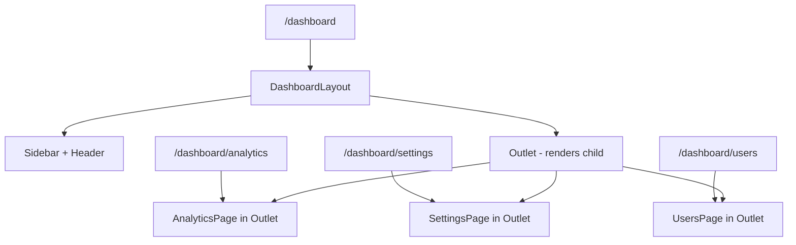
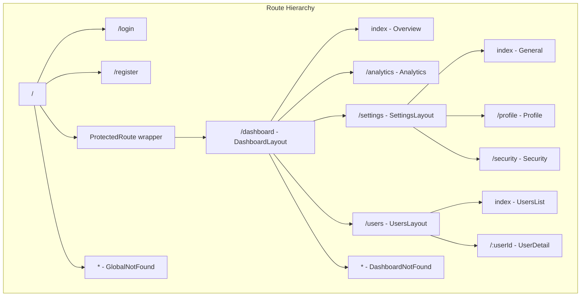

# How to Configure React Router for Nested Routes

Author: [nawazdhandala](https://github.com/nawazdhandala)

Tags: React, React Router, JavaScript, Frontend, Routing

Description: Learn how to configure nested routes in React Router v6 for building complex layouts with shared navigation and protected route patterns.

---

Nested routes in React Router allow you to build layouts where parts of the page remain constant while other parts change based on the URL. This pattern is essential for dashboards, settings pages, and any application with hierarchical navigation.

## Understanding Nested Routes

Nested routes create a parent-child relationship where child routes render inside the parent:



## Basic Nested Route Configuration

### Setting Up Routes

```javascript
// App.jsx
import { BrowserRouter, Routes, Route } from 'react-router-dom';
import DashboardLayout from './layouts/DashboardLayout';
import Overview from './pages/Overview';
import Analytics from './pages/Analytics';
import Settings from './pages/Settings';
import Users from './pages/Users';

function App() {
  return (
    <BrowserRouter>
      <Routes>
        {/* Parent route with nested children */}
        <Route path="/dashboard" element={<DashboardLayout />}>
          {/* Index route renders at /dashboard */}
          <Route index element={<Overview />} />
          {/* Child routes render at /dashboard/analytics, etc */}
          <Route path="analytics" element={<Analytics />} />
          <Route path="settings" element={<Settings />} />
          <Route path="users" element={<Users />} />
        </Route>
      </Routes>
    </BrowserRouter>
  );
}
```

### Creating the Layout with Outlet

```javascript
// layouts/DashboardLayout.jsx
import { Outlet, NavLink } from 'react-router-dom';

function DashboardLayout() {
  return (
    <div className="dashboard">
      <aside className="sidebar">
        <nav>
          <NavLink
            to="/dashboard"
            end
            className={({ isActive }) => isActive ? 'active' : ''}
          >
            Overview
          </NavLink>
          <NavLink
            to="/dashboard/analytics"
            className={({ isActive }) => isActive ? 'active' : ''}
          >
            Analytics
          </NavLink>
          <NavLink
            to="/dashboard/settings"
            className={({ isActive }) => isActive ? 'active' : ''}
          >
            Settings
          </NavLink>
          <NavLink
            to="/dashboard/users"
            className={({ isActive }) => isActive ? 'active' : ''}
          >
            Users
          </NavLink>
        </nav>
      </aside>

      <main className="content">
        {/* Child routes render here */}
        <Outlet />
      </main>
    </div>
  );
}

export default DashboardLayout;
```

## Multi-Level Nesting

You can nest routes multiple levels deep:

```javascript
// Routes configuration
function App() {
  return (
    <BrowserRouter>
      <Routes>
        <Route path="/dashboard" element={<DashboardLayout />}>
          <Route index element={<Overview />} />

          {/* Settings has its own nested routes */}
          <Route path="settings" element={<SettingsLayout />}>
            <Route index element={<GeneralSettings />} />
            <Route path="profile" element={<ProfileSettings />} />
            <Route path="security" element={<SecuritySettings />} />
            <Route path="notifications" element={<NotificationSettings />} />
          </Route>

          {/* Users with dynamic segment and nested routes */}
          <Route path="users" element={<UsersLayout />}>
            <Route index element={<UsersList />} />
            <Route path=":userId" element={<UserDetail />}>
              <Route index element={<UserOverview />} />
              <Route path="activity" element={<UserActivity />} />
              <Route path="permissions" element={<UserPermissions />} />
            </Route>
          </Route>
        </Route>
      </Routes>
    </BrowserRouter>
  );
}
```

The URL structure becomes:

```mermaid
graph LR
    A[/dashboard] --> B[/dashboard/settings]
    B --> C[/dashboard/settings/profile]
    B --> D[/dashboard/settings/security]

    A --> E[/dashboard/users]
    E --> F[/dashboard/users/123]
    F --> G[/dashboard/users/123/activity]
    F --> H[/dashboard/users/123/permissions]
```

### Settings Layout Example

```javascript
// layouts/SettingsLayout.jsx
import { Outlet, NavLink } from 'react-router-dom';

function SettingsLayout() {
  return (
    <div className="settings-page">
      <h1>Settings</h1>

      <div className="settings-nav">
        <NavLink to="/dashboard/settings" end>General</NavLink>
        <NavLink to="/dashboard/settings/profile">Profile</NavLink>
        <NavLink to="/dashboard/settings/security">Security</NavLink>
        <NavLink to="/dashboard/settings/notifications">Notifications</NavLink>
      </div>

      <div className="settings-content">
        <Outlet />
      </div>
    </div>
  );
}
```

## Protected Routes with Nested Layout

Combine nested routes with authentication:

```javascript
// components/ProtectedRoute.jsx
import { Navigate, Outlet, useLocation } from 'react-router-dom';
import { useAuth } from '../hooks/useAuth';

function ProtectedRoute() {
  const { isAuthenticated, isLoading } = useAuth();
  const location = useLocation();

  if (isLoading) {
    return <LoadingScreen />;
  }

  if (!isAuthenticated) {
    // Redirect to login, preserving the attempted URL
    return <Navigate to="/login" state={{ from: location }} replace />;
  }

  // Render child routes
  return <Outlet />;
}

// App.jsx - Using ProtectedRoute as layout
function App() {
  return (
    <BrowserRouter>
      <Routes>
        {/* Public routes */}
        <Route path="/login" element={<Login />} />
        <Route path="/register" element={<Register />} />

        {/* Protected routes - all children require auth */}
        <Route element={<ProtectedRoute />}>
          <Route path="/dashboard" element={<DashboardLayout />}>
            <Route index element={<Overview />} />
            <Route path="analytics" element={<Analytics />} />
            <Route path="settings" element={<Settings />} />
          </Route>

          <Route path="/profile" element={<ProfileLayout />}>
            <Route index element={<ProfileOverview />} />
            <Route path="edit" element={<EditProfile />} />
          </Route>
        </Route>
      </Routes>
    </BrowserRouter>
  );
}
```

## Role-Based Route Protection

For more granular access control:

```javascript
// components/RequireRole.jsx
import { Navigate, Outlet } from 'react-router-dom';
import { useAuth } from '../hooks/useAuth';

function RequireRole({ allowedRoles }) {
  const { user } = useAuth();

  const hasRequiredRole = allowedRoles.some(role =>
    user?.roles?.includes(role)
  );

  if (!hasRequiredRole) {
    return <Navigate to="/unauthorized" replace />;
  }

  return <Outlet />;
}

// Usage in routes
function App() {
  return (
    <BrowserRouter>
      <Routes>
        <Route element={<ProtectedRoute />}>
          <Route path="/dashboard" element={<DashboardLayout />}>
            {/* All authenticated users */}
            <Route index element={<Overview />} />

            {/* Admin only routes */}
            <Route element={<RequireRole allowedRoles={['admin']} />}>
              <Route path="users" element={<UserManagement />} />
              <Route path="settings/system" element={<SystemSettings />} />
            </Route>

            {/* Admin and manager routes */}
            <Route element={<RequireRole allowedRoles={['admin', 'manager']} />}>
              <Route path="reports" element={<Reports />} />
            </Route>
          </Route>
        </Route>
      </Routes>
    </BrowserRouter>
  );
}
```

## Dynamic Segments in Nested Routes

Handle dynamic URL parameters:

```javascript
// Routes with dynamic segments
<Route path="/projects" element={<ProjectsLayout />}>
  <Route index element={<ProjectsList />} />
  <Route path=":projectId" element={<ProjectDetail />}>
    <Route index element={<ProjectOverview />} />
    <Route path="tasks" element={<TasksList />} />
    <Route path="tasks/:taskId" element={<TaskDetail />} />
    <Route path="members" element={<ProjectMembers />} />
  </Route>
</Route>

// Accessing parameters in nested components
// pages/TaskDetail.jsx
import { useParams } from 'react-router-dom';

function TaskDetail() {
  // Access all params from parent routes
  const { projectId, taskId } = useParams();

  return (
    <div>
      <h2>Task {taskId}</h2>
      <p>Project: {projectId}</p>
    </div>
  );
}
```

## Relative Links and Navigation

Use relative paths in nested routes:

```javascript
// Inside a component rendered at /dashboard/projects/123
import { Link, useNavigate } from 'react-router-dom';

function ProjectDetail() {
  const navigate = useNavigate();

  return (
    <div>
      {/* Relative links - relative to current route */}
      <Link to="tasks">View Tasks</Link> {/* /dashboard/projects/123/tasks */}
      <Link to="members">View Members</Link> {/* /dashboard/projects/123/members */}

      {/* Go up one level */}
      <Link to="..">Back to Projects</Link> {/* /dashboard/projects */}

      {/* Go up two levels */}
      <Link to="../..">Back to Dashboard</Link> {/* /dashboard */}

      {/* Programmatic relative navigation */}
      <button onClick={() => navigate('tasks')}>
        Go to Tasks
      </button>

      <button onClick={() => navigate('..', { replace: true })}>
        Back (replace history)
      </button>
    </div>
  );
}
```

## Route Configuration as Data

For large applications, define routes as data:

```javascript
// routes/dashboardRoutes.js
import Overview from '../pages/Overview';
import Analytics from '../pages/Analytics';
import Settings from '../pages/Settings';
import Users from '../pages/Users';

export const dashboardRoutes = [
  {
    index: true,
    element: <Overview />,
  },
  {
    path: 'analytics',
    element: <Analytics />,
  },
  {
    path: 'settings',
    element: <Settings />,
    children: [
      { index: true, element: <GeneralSettings /> },
      { path: 'profile', element: <ProfileSettings /> },
      { path: 'security', element: <SecuritySettings /> },
    ],
  },
  {
    path: 'users',
    element: <Users />,
  },
];

// App.jsx - Using useRoutes hook
import { useRoutes } from 'react-router-dom';
import { dashboardRoutes } from './routes/dashboardRoutes';

function App() {
  const routes = useRoutes([
    {
      path: '/dashboard',
      element: <DashboardLayout />,
      children: dashboardRoutes,
    },
    {
      path: '/login',
      element: <Login />,
    },
  ]);

  return routes;
}
```

## Handling 404s in Nested Routes

Add catch-all routes at each level:

```javascript
function App() {
  return (
    <BrowserRouter>
      <Routes>
        <Route path="/dashboard" element={<DashboardLayout />}>
          <Route index element={<Overview />} />
          <Route path="analytics" element={<Analytics />} />
          <Route path="settings" element={<Settings />} />

          {/* Catch-all for unknown dashboard routes */}
          <Route path="*" element={<DashboardNotFound />} />
        </Route>

        {/* Global catch-all */}
        <Route path="*" element={<NotFound />} />
      </Routes>
    </BrowserRouter>
  );
}

// DashboardNotFound.jsx
function DashboardNotFound() {
  return (
    <div className="not-found">
      <h2>Page Not Found</h2>
      <p>The dashboard page you are looking for does not exist.</p>
      <Link to="/dashboard">Return to Dashboard</Link>
    </div>
  );
}
```

## Complete Example Structure

Here is how a complete nested route setup looks:



## Summary

| Concept | Purpose |
|---------|---------|
| `<Outlet />` | Renders child route components |
| `index` route | Default child route for parent path |
| Relative paths | Navigate relative to current route |
| `useParams()` | Access URL parameters from any nested level |
| Layout routes | Share UI between multiple routes |
| Protected routes | Wrap routes requiring authentication |
| Catch-all `*` | Handle unknown routes at each level |
| `useRoutes()` | Define routes as JavaScript objects |

Nested routes in React Router v6 provide a powerful way to build complex layouts while keeping your routing configuration declarative and maintainable. By combining layouts, protected routes, and dynamic segments, you can create sophisticated navigation patterns that scale with your application.
