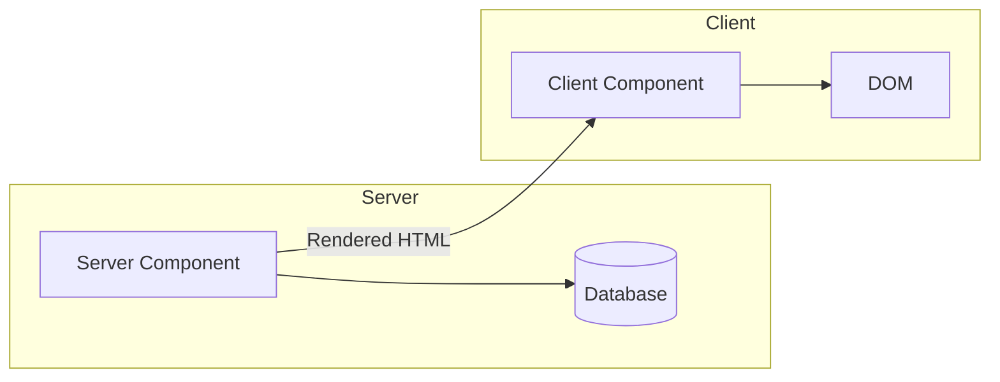
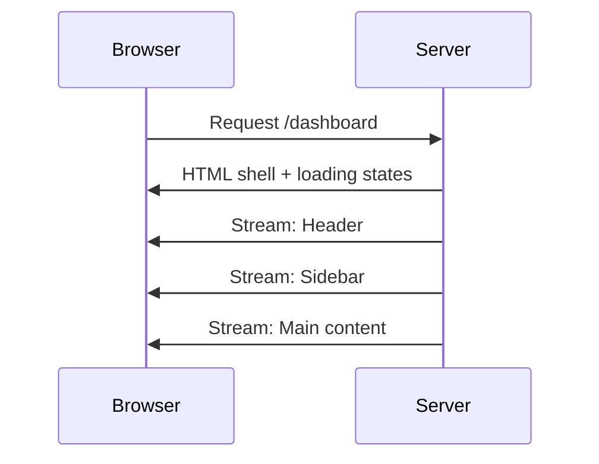

# How to Configure React Server Components

Author: [nawazdhandala](https://www.github.com/nawazdhandala)

Tags: React, Server Components, Next.js, RSC, Performance, SSR, Full Stack, TypeScript

Description: Learn how to configure and use React Server Components to build faster applications with reduced client-side JavaScript.

---

React Server Components (RSC) execute on the server and stream rendered output to the client. They offer zero client-side JavaScript, direct database access, and automatic code splitting.

## What Are React Server Components?



## Setting Up Next.js with Server Components

```bash
npx create-next-app@latest my-app --typescript --app
cd my-app
npm run dev
```

## Server vs Client Components

In Next.js App Router, components are Server Components by default. Add 'use client' for Client Components.

```typescript
// Server Component (default)
async function UserList(): Promise<React.ReactElement> {
  const users = await fetchUsersFromDatabase();
  return (
    <ul>
      {users.map((user) => (
        <li key={user.id}>{user.name}</li>
      ))}
    </ul>
  );
}
```

```typescript
// Client Component
'use client';

import { useState } from 'react';

function Counter(): React.ReactElement {
  const [count, setCount] = useState(0);
  return (
    <button onClick={() => setCount(count + 1)}>
      Count: {count}
    </button>
  );
}
```

## Data Fetching Pattern

```typescript
// app/products/page.tsx
import { Suspense } from 'react';
import ProductList from './ProductList';

function ProductsPage(): React.ReactElement {
  return (
    <Suspense fallback={<div>Loading...</div>}>
      <ProductList category="electronics" />
    </Suspense>
  );
}
```

## Server Actions for Mutations

```typescript
// app/actions/user.ts
'use server';

import { revalidatePath } from 'next/cache';

export async function createUser(data: { name: string; email: string }) {
  await db.insert(users).values(data);
  revalidatePath('/users');
  return { success: true };
}
```

## Streaming with Suspense



## Summary

| Feature | Server Components | Client Components |
|---------|------------------|-------------------|
| JavaScript to client | None | Yes |
| Can use hooks | No | Yes |
| Can access backend | Yes | No |
| Default in App Router | Yes | No |

Start with Server Components by default and add 'use client' only when you need interactivity.
