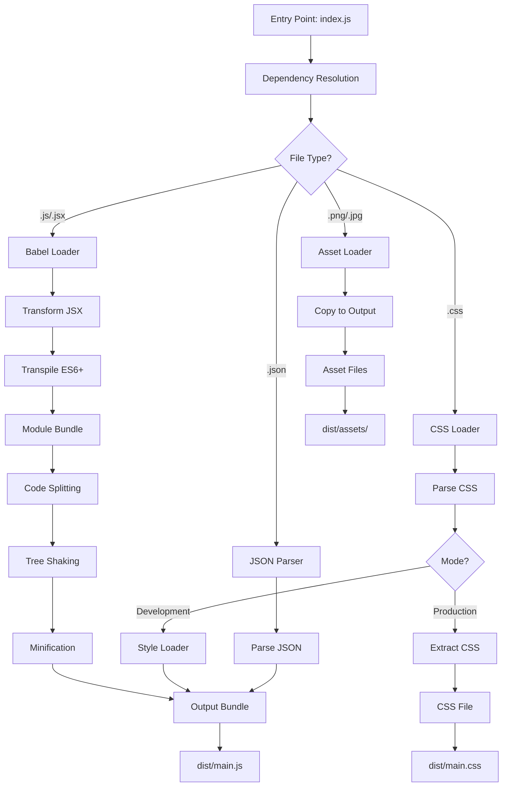
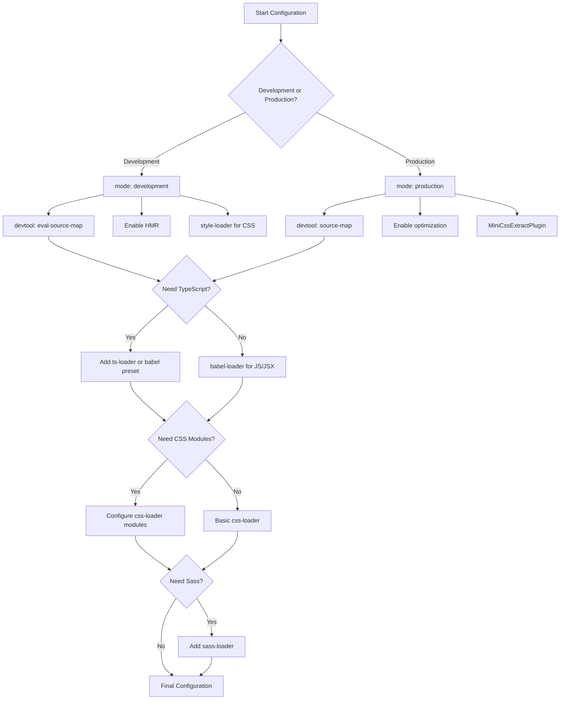

# How to Configure React with Webpack

Author: [nawazdhandala](https://github.com/nawazdhandala)

Tags: React, Webpack, JavaScript, Build Tools, Configuration, Frontend

Description: A comprehensive guide to configuring Webpack for React applications, covering development and production setups, loaders, plugins, and optimization techniques.

---

While tools like Create React App and Vite abstract away build configuration, understanding how to configure Webpack for React gives you complete control over your build process. This guide walks through setting up Webpack from scratch for a React application, including development and production configurations.

## Project Setup

Start by creating a new project and installing the necessary dependencies.

```bash
# Create project directory
mkdir react-webpack-app
cd react-webpack-app

# Initialize package.json
npm init -y

# Install React
npm install react react-dom

# Install Webpack and development dependencies
npm install --save-dev webpack webpack-cli webpack-dev-server

# Install Babel for JSX transformation
npm install --save-dev @babel/core @babel/preset-env @babel/preset-react babel-loader

# Install HTML plugin
npm install --save-dev html-webpack-plugin

# Install CSS loaders
npm install --save-dev style-loader css-loader
```

## Basic Project Structure

Create the following directory structure for your project.

```
react-webpack-app/
  src/
    index.js
    App.js
    App.css
  public/
    index.html
  webpack.config.js
  babel.config.js
  package.json
```

## HTML Template

Create the HTML template that Webpack will use to inject the bundled JavaScript.

```html
<!-- public/index.html -->
<!DOCTYPE html>
<html lang="en">
<head>
    <meta charset="UTF-8">
    <meta name="viewport" content="width=device-width, initial-scale=1.0">
    <title>React Webpack App</title>
</head>
<body>
    <!-- React will mount to this element -->
    <div id="root"></div>
</body>
</html>
```

## Babel Configuration

Configure Babel to transform JSX and modern JavaScript syntax.

```javascript
// babel.config.js

module.exports = {
  // Presets are collections of plugins
  presets: [
    [
      '@babel/preset-env',
      {
        // Target browsers that have more than 0.25% market share
        targets: '> 0.25%, not dead',
        // Only include polyfills that are actually used
        useBuiltIns: 'usage',
        corejs: 3
      }
    ],
    [
      '@babel/preset-react',
      {
        // Use the new JSX transform (React 17+)
        runtime: 'automatic'
      }
    ]
  ]
};
```

## Basic Webpack Configuration

Create the main Webpack configuration file.

```javascript
// webpack.config.js

const path = require('path');
const HtmlWebpackPlugin = require('html-webpack-plugin');

module.exports = {
  // Entry point - where Webpack starts bundling
  entry: './src/index.js',

  // Output configuration
  output: {
    // Output directory
    path: path.resolve(__dirname, 'dist'),
    // Output filename with content hash for cache busting
    filename: '[name].[contenthash].js',
    // Clean the output directory before each build
    clean: true
  },

  // Module rules define how different file types are processed
  module: {
    rules: [
      {
        // Process JavaScript and JSX files
        test: /\.(js|jsx)$/,
        exclude: /node_modules/,
        use: {
          loader: 'babel-loader',
          options: {
            // Cache compilation results for faster rebuilds
            cacheDirectory: true
          }
        }
      },
      {
        // Process CSS files
        test: /\.css$/,
        use: [
          // Injects CSS into the DOM via style tags
          'style-loader',
          // Interprets @import and url() like import/require
          'css-loader'
        ]
      },
      {
        // Process image files
        test: /\.(png|jpg|jpeg|gif|svg)$/i,
        type: 'asset/resource'
      }
    ]
  },

  // Resolve configuration
  resolve: {
    // Allow importing without specifying extensions
    extensions: ['.js', '.jsx'],
    // Create aliases for common import paths
    alias: {
      '@': path.resolve(__dirname, 'src'),
      '@components': path.resolve(__dirname, 'src/components'),
      '@utils': path.resolve(__dirname, 'src/utils')
    }
  },

  // Plugins extend Webpack functionality
  plugins: [
    new HtmlWebpackPlugin({
      // Use our HTML template
      template: './public/index.html',
      // Inject scripts at the end of body
      inject: 'body'
    })
  ]
};
```

## Development Configuration

Create a separate configuration for development with hot reloading and source maps.

```javascript
// webpack.dev.js

const { merge } = require('webpack-merge');
const common = require('./webpack.config.js');

module.exports = merge(common, {
  // Development mode enables useful defaults
  mode: 'development',

  // Source maps for debugging
  devtool: 'eval-source-map',

  // Development server configuration
  devServer: {
    // Serve files from this directory
    static: './dist',
    // Port number
    port: 3000,
    // Open browser automatically
    open: true,
    // Enable hot module replacement
    hot: true,
    // Enable gzip compression
    compress: true,
    // Handle client-side routing
    historyApiFallback: true,
    // Show errors as overlay in browser
    client: {
      overlay: {
        errors: true,
        warnings: false
      }
    }
  },

  // Optimization for development
  optimization: {
    // Use readable module and chunk names in dev
    moduleIds: 'named',
    chunkIds: 'named'
  }
});
```

Install webpack-merge for combining configurations.

```bash
npm install --save-dev webpack-merge
```

## Production Configuration

Create an optimized configuration for production builds.

```javascript
// webpack.prod.js

const { merge } = require('webpack-merge');
const common = require('./webpack.config.js');
const MiniCssExtractPlugin = require('mini-css-extract-plugin');
const CssMinimizerPlugin = require('css-minimizer-webpack-plugin');
const TerserPlugin = require('terser-webpack-plugin');

module.exports = merge(common, {
  // Production mode enables optimizations
  mode: 'production',

  // Source maps for debugging production issues
  devtool: 'source-map',

  // Override CSS rule to extract CSS to separate files
  module: {
    rules: [
      {
        test: /\.css$/,
        use: [
          // Extract CSS to separate files instead of injecting
          MiniCssExtractPlugin.loader,
          'css-loader'
        ]
      }
    ]
  },

  // Production plugins
  plugins: [
    new MiniCssExtractPlugin({
      // Output CSS filename with content hash
      filename: '[name].[contenthash].css'
    })
  ],

  // Optimization configuration
  optimization: {
    // Enable minimization
    minimize: true,
    minimizer: [
      // Minify JavaScript
      new TerserPlugin({
        terserOptions: {
          compress: {
            // Remove console.log in production
            drop_console: true
          }
        }
      }),
      // Minify CSS
      new CssMinimizerPlugin()
    ],
    // Split vendor code into separate chunks
    splitChunks: {
      chunks: 'all',
      cacheGroups: {
        // Vendor chunk for node_modules
        vendor: {
          test: /[\\/]node_modules[\\/]/,
          name: 'vendors',
          chunks: 'all'
        }
      }
    },
    // Create a runtime chunk for better caching
    runtimeChunk: 'single'
  }
});
```

Install production dependencies.

```bash
npm install --save-dev mini-css-extract-plugin css-minimizer-webpack-plugin terser-webpack-plugin
```

## Package.json Scripts

Add scripts to run development and production builds.

```json
{
  "scripts": {
    "start": "webpack serve --config webpack.dev.js",
    "build": "webpack --config webpack.prod.js",
    "build:analyze": "webpack --config webpack.prod.js --profile --json > stats.json"
  }
}
```

## React Entry Point and App Component

Create the React application files.

```javascript
// src/index.js

import React from 'react';
import { createRoot } from 'react-dom/client';
import App from './App';
import './index.css';

// Get the root element from HTML
const container = document.getElementById('root');

// Create a root and render the app
const root = createRoot(container);
root.render(
  <React.StrictMode>
    <App />
  </React.StrictMode>
);
```

```javascript
// src/App.js

import React, { useState } from 'react';
import './App.css';

function App() {
  const [count, setCount] = useState(0);

  return (
    <div className="app">
      <h1>React Webpack App</h1>
      <p>Count: {count}</p>
      <button onClick={() => setCount(count + 1)}>
        Increment
      </button>
    </div>
  );
}

export default App;
```

## TypeScript Configuration

To add TypeScript support, install additional dependencies and modify the configuration.

```bash
# Install TypeScript and type definitions
npm install --save-dev typescript @babel/preset-typescript
npm install --save-dev @types/react @types/react-dom
```

Create a TypeScript configuration file.

```json
{
  "compilerOptions": {
    "target": "ES2020",
    "lib": ["DOM", "DOM.Iterable", "ES2020"],
    "module": "ESNext",
    "moduleResolution": "bundler",
    "jsx": "react-jsx",
    "strict": true,
    "noEmit": true,
    "skipLibCheck": true,
    "esModuleInterop": true,
    "allowSyntheticDefaultImports": true,
    "forceConsistentCasingInFileNames": true,
    "resolveJsonModule": true,
    "isolatedModules": true,
    "baseUrl": ".",
    "paths": {
      "@/*": ["src/*"],
      "@components/*": ["src/components/*"]
    }
  },
  "include": ["src"],
  "exclude": ["node_modules"]
}
```

Update Babel configuration.

```javascript
// babel.config.js

module.exports = {
  presets: [
    [
      '@babel/preset-env',
      {
        targets: '> 0.25%, not dead',
        useBuiltIns: 'usage',
        corejs: 3
      }
    ],
    [
      '@babel/preset-react',
      {
        runtime: 'automatic'
      }
    ],
    // Add TypeScript preset
    '@babel/preset-typescript'
  ]
};
```

Update Webpack to handle TypeScript files.

```javascript
// webpack.config.js - updated module rules

module: {
  rules: [
    {
      // Process TypeScript and TSX files
      test: /\.(ts|tsx|js|jsx)$/,
      exclude: /node_modules/,
      use: {
        loader: 'babel-loader',
        options: {
          cacheDirectory: true
        }
      }
    }
    // ... other rules
  ]
},

resolve: {
  // Add TypeScript extensions
  extensions: ['.ts', '.tsx', '.js', '.jsx']
}
```

## Environment Variables

Configure environment variables for different environments.

```bash
npm install --save-dev dotenv-webpack
```

```javascript
// webpack.config.js

const Dotenv = require('dotenv-webpack');

module.exports = {
  // ... other configuration

  plugins: [
    // Load environment variables from .env file
    new Dotenv({
      // Path to .env file
      path: './.env',
      // Load system environment variables as well
      systemvars: true,
      // Hide any errors if .env file is missing
      silent: true
    }),
    // ... other plugins
  ]
};
```

Create environment files.

```bash
# .env - shared variables
REACT_APP_NAME=My React App

# .env.development - development variables
REACT_APP_API_URL=http://localhost:8080/api

# .env.production - production variables
REACT_APP_API_URL=https://api.example.com
```

## Webpack Build Process Flow

The following diagram illustrates how Webpack processes a React application.



## Advanced Loader Configuration

Add support for Sass and CSS Modules.

```bash
npm install --save-dev sass sass-loader
```

```javascript
// webpack.config.js - advanced CSS configuration

module: {
  rules: [
    {
      // Regular CSS files
      test: /\.css$/,
      exclude: /\.module\.css$/,
      use: ['style-loader', 'css-loader']
    },
    {
      // CSS Modules
      test: /\.module\.css$/,
      use: [
        'style-loader',
        {
          loader: 'css-loader',
          options: {
            modules: {
              // Generate unique class names
              localIdentName: '[name]__[local]--[hash:base64:5]'
            }
          }
        }
      ]
    },
    {
      // Sass files
      test: /\.scss$/,
      use: [
        'style-loader',
        'css-loader',
        {
          loader: 'sass-loader',
          options: {
            // Use dart-sass
            implementation: require('sass')
          }
        }
      ]
    }
  ]
}
```

## Performance Optimization

Configure bundle analysis and performance hints.

```bash
npm install --save-dev webpack-bundle-analyzer
```

```javascript
// webpack.prod.js - with bundle analyzer

const BundleAnalyzerPlugin = require('webpack-bundle-analyzer').BundleAnalyzerPlugin;

module.exports = merge(common, {
  // ... other production config

  plugins: [
    // Only run analyzer when ANALYZE env variable is set
    ...(process.env.ANALYZE ? [
      new BundleAnalyzerPlugin({
        analyzerMode: 'static',
        reportFilename: 'bundle-report.html',
        openAnalyzer: false
      })
    ] : [])
  ],

  // Performance hints
  performance: {
    // Show warning for assets larger than 250KB
    maxAssetSize: 250000,
    maxEntrypointSize: 250000,
    hints: 'warning'
  }
});
```

## Caching Strategy

Optimize caching for faster rebuilds.

```javascript
// webpack.prod.js - caching configuration

module.exports = merge(common, {
  // ... other config

  output: {
    // Use content hash for cache busting
    filename: '[name].[contenthash:8].js',
    chunkFilename: '[name].[contenthash:8].chunk.js'
  },

  optimization: {
    // Ensure module IDs are deterministic for better caching
    moduleIds: 'deterministic',

    splitChunks: {
      chunks: 'all',
      maxInitialRequests: 25,
      minSize: 20000,
      cacheGroups: {
        // React vendor chunk
        react: {
          test: /[\\/]node_modules[\\/](react|react-dom)[\\/]/,
          name: 'react-vendor',
          chunks: 'all',
          priority: 20
        },
        // Other vendors
        vendors: {
          test: /[\\/]node_modules[\\/]/,
          name: 'vendors',
          chunks: 'all',
          priority: 10
        },
        // Common code shared between chunks
        common: {
          minChunks: 2,
          priority: 5,
          reuseExistingChunk: true
        }
      }
    }
  }
});
```

## Configuration Decision Flow

Use this decision tree to choose the right Webpack configuration options.



## Common Issues and Solutions

### Issue: Module not found errors

```javascript
// webpack.config.js - fix module resolution

resolve: {
  // Ensure all extensions are listed
  extensions: ['.ts', '.tsx', '.js', '.jsx', '.json'],

  // Add fallbacks for Node.js core modules (Webpack 5)
  fallback: {
    path: require.resolve('path-browserify'),
    stream: require.resolve('stream-browserify')
  }
}
```

### Issue: Large bundle size

```javascript
// webpack.prod.js - aggressive code splitting

optimization: {
  splitChunks: {
    chunks: 'all',
    maxSize: 200000,  // Split chunks larger than 200KB
    cacheGroups: {
      // Split each large dependency into its own chunk
      defaultVendors: {
        test: /[\\/]node_modules[\\/]/,
        priority: -10,
        reuseExistingChunk: true,
        name(module) {
          // Get package name
          const packageName = module.context.match(
            /[\\/]node_modules[\\/](.*?)([\\/]|$)/
          )[1];
          return `npm.${packageName.replace('@', '')}`;
        }
      }
    }
  }
}
```

### Issue: Slow builds

```javascript
// webpack.config.js - speed optimizations

module.exports = {
  // Use cache for faster rebuilds
  cache: {
    type: 'filesystem',
    cacheDirectory: path.resolve(__dirname, '.webpack_cache')
  },

  module: {
    rules: [
      {
        test: /\.(js|jsx|ts|tsx)$/,
        // Exclude more directories
        exclude: /node_modules/,
        use: {
          loader: 'babel-loader',
          options: {
            // Enable caching
            cacheDirectory: true,
            // Use compact output
            compact: true
          }
        }
      }
    ]
  }
};
```

## Summary

| Configuration | Development | Production |
|--------------|-------------|------------|
| **mode** | development | production |
| **devtool** | eval-source-map | source-map |
| **CSS** | style-loader | MiniCssExtractPlugin |
| **Optimization** | Readable names | Minification, tree shaking |
| **Caching** | File system cache | Content hash filenames |
| **Code Splitting** | None | Vendor chunks |

Webpack provides complete control over your React build process. Start with a basic configuration and add features as needed. Use the development configuration for fast feedback during development and the production configuration for optimized deployable bundles. The key is understanding what each loader and plugin does so you can customize the build for your specific needs.
