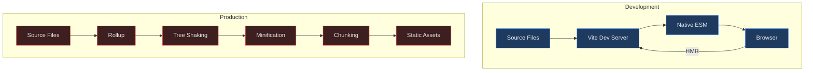
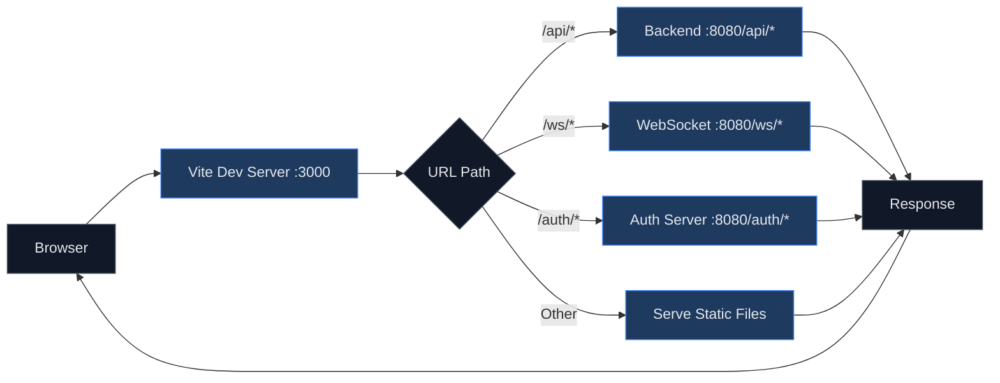

# How to Configure React with Vite

Author: [nawazdhandala](https://www.github.com/nawazdhandala)

Tags: React, Vite, Build Tools, JavaScript, TypeScript, Frontend, Development, Configuration

Description: A complete guide to setting up a React project with Vite, covering TypeScript configuration, path aliases, environment variables, proxies, and production optimization.

---

Vite has become the preferred build tool for modern React applications due to its lightning-fast development server and optimized production builds. This guide walks through configuring a production-ready React project with Vite from scratch.

## Quick Start

Create a new React project with Vite:

```bash
# Using npm
npm create vite@latest my-react-app -- --template react-ts

# Using yarn
yarn create vite my-react-app --template react-ts

# Using pnpm
pnpm create vite my-react-app --template react-ts

# Navigate to project
cd my-react-app

# Install dependencies
npm install

# Start development server
npm run dev
```

## Project Structure

A well-organized Vite React project:

```
my-react-app/
├── public/
│   └── favicon.ico
├── src/
│   ├── assets/
│   │   └── logo.svg
│   ├── components/
│   │   └── Button/
│   │       ├── Button.tsx
│   │       ├── Button.module.css
│   │       └── index.ts
│   ├── hooks/
│   │   └── useAuth.ts
│   ├── pages/
│   │   └── Home.tsx
│   ├── services/
│   │   └── api.ts
│   ├── types/
│   │   └── index.ts
│   ├── utils/
│   │   └── helpers.ts
│   ├── App.tsx
│   ├── main.tsx
│   └── vite-env.d.ts
├── .env
├── .env.development
├── .env.production
├── index.html
├── package.json
├── tsconfig.json
├── tsconfig.node.json
└── vite.config.ts
```

## Vite Build Process



## Basic Configuration

Create or update `vite.config.ts`:

```typescript
// vite.config.ts
import { defineConfig } from 'vite';
import react from '@vitejs/plugin-react';

export default defineConfig({
  plugins: [react()],

  // Development server configuration
  server: {
    port: 3000,
    open: true,
    cors: true,
  },

  // Preview server (for production build testing)
  preview: {
    port: 4173,
  },

  // Build configuration
  build: {
    outDir: 'dist',
    sourcemap: true,
  },
});
```

## TypeScript Configuration

Configure TypeScript for optimal Vite integration:

```json
// tsconfig.json
{
  "compilerOptions": {
    "target": "ES2020",
    "useDefineForClassFields": true,
    "lib": ["ES2020", "DOM", "DOM.Iterable"],
    "module": "ESNext",
    "skipLibCheck": true,

    "moduleResolution": "bundler",
    "allowImportingTsExtensions": true,
    "resolveJsonModule": true,
    "isolatedModules": true,
    "noEmit": true,
    "jsx": "react-jsx",

    "strict": true,
    "noUnusedLocals": true,
    "noUnusedParameters": true,
    "noFallthroughCasesInSwitch": true,

    "baseUrl": ".",
    "paths": {
      "@/*": ["src/*"],
      "@components/*": ["src/components/*"],
      "@hooks/*": ["src/hooks/*"],
      "@pages/*": ["src/pages/*"],
      "@services/*": ["src/services/*"],
      "@utils/*": ["src/utils/*"],
      "@types/*": ["src/types/*"]
    }
  },
  "include": ["src"],
  "references": [{ "path": "./tsconfig.node.json" }]
}
```

```json
// tsconfig.node.json
{
  "compilerOptions": {
    "composite": true,
    "skipLibCheck": true,
    "module": "ESNext",
    "moduleResolution": "bundler",
    "allowSyntheticDefaultImports": true,
    "strict": true
  },
  "include": ["vite.config.ts"]
}
```

## Path Aliases

Configure path aliases in both Vite and TypeScript:

```typescript
// vite.config.ts
import { defineConfig } from 'vite';
import react from '@vitejs/plugin-react';
import path from 'path';

export default defineConfig({
  plugins: [react()],

  resolve: {
    alias: {
      '@': path.resolve(__dirname, './src'),
      '@components': path.resolve(__dirname, './src/components'),
      '@hooks': path.resolve(__dirname, './src/hooks'),
      '@pages': path.resolve(__dirname, './src/pages'),
      '@services': path.resolve(__dirname, './src/services'),
      '@utils': path.resolve(__dirname, './src/utils'),
      '@types': path.resolve(__dirname, './src/types'),
      '@assets': path.resolve(__dirname, './src/assets'),
    },
  },
});
```

Now use the aliases in your code:

```typescript
// Before
import { Button } from '../../../components/Button';
import { useAuth } from '../../../hooks/useAuth';

// After
import { Button } from '@components/Button';
import { useAuth } from '@hooks/useAuth';
```

## Environment Variables

Vite uses `.env` files with a `VITE_` prefix:

```bash
# .env (shared defaults)
VITE_APP_TITLE=My React App

# .env.development
VITE_API_URL=http://localhost:8080/api
VITE_DEBUG=true

# .env.production
VITE_API_URL=https://api.production.com
VITE_DEBUG=false

# .env.local (gitignored, for secrets)
VITE_API_KEY=your-secret-key
```

Access environment variables in your code:

```typescript
// src/services/api.ts
const API_URL = import.meta.env.VITE_API_URL;
const DEBUG = import.meta.env.VITE_DEBUG === 'true';

// Type definitions for environment variables
// src/vite-env.d.ts
/// <reference types="vite/client" />

interface ImportMetaEnv {
  readonly VITE_API_URL: string;
  readonly VITE_APP_TITLE: string;
  readonly VITE_DEBUG: string;
  readonly VITE_API_KEY: string;
}

interface ImportMeta {
  readonly env: ImportMetaEnv;
}
```

## API Proxy Configuration

Configure a proxy to avoid CORS issues during development:

```typescript
// vite.config.ts
import { defineConfig } from 'vite';
import react from '@vitejs/plugin-react';

export default defineConfig({
  plugins: [react()],

  server: {
    port: 3000,
    proxy: {
      // Simple proxy
      '/api': {
        target: 'http://localhost:8080',
        changeOrigin: true,
      },

      // Proxy with path rewrite
      '/services': {
        target: 'http://localhost:9000',
        changeOrigin: true,
        rewrite: (path) => path.replace(/^\/services/, ''),
      },

      // WebSocket proxy
      '/ws': {
        target: 'ws://localhost:8080',
        ws: true,
      },

      // Proxy with custom headers
      '/auth': {
        target: 'http://localhost:8080',
        changeOrigin: true,
        headers: {
          'X-Custom-Header': 'value',
        },
      },
    },
  },
});
```

## Proxy Request Flow



## CSS Configuration

### CSS Modules

CSS Modules work out of the box:

```css
/* Button.module.css */
.button {
  padding: 8px 16px;
  border-radius: 4px;
}

.primary {
  background-color: #3b82f6;
  color: white;
}
```

```tsx
// Button.tsx
import styles from './Button.module.css';

export function Button({ variant = 'primary', children }) {
  return (
    <button className={`${styles.button} ${styles[variant]}`}>
      {children}
    </button>
  );
}
```

### Sass/SCSS

Install Sass and use it directly:

```bash
npm install -D sass
```

```scss
// styles/variables.scss
$primary-color: #3b82f6;
$border-radius: 4px;

// Component.module.scss
@use './variables' as *;

.component {
  color: $primary-color;
  border-radius: $border-radius;
}
```

### Tailwind CSS

Configure Tailwind CSS with Vite:

```bash
npm install -D tailwindcss postcss autoprefixer
npx tailwindcss init -p
```

```javascript
// tailwind.config.js
/** @type {import('tailwindcss').Config} */
export default {
  content: [
    "./index.html",
    "./src/**/*.{js,ts,jsx,tsx}",
  ],
  theme: {
    extend: {},
  },
  plugins: [],
}
```

```css
/* src/index.css */
@tailwind base;
@tailwind components;
@tailwind utilities;
```

## Production Build Optimization

Configure optimized production builds:

```typescript
// vite.config.ts
import { defineConfig } from 'vite';
import react from '@vitejs/plugin-react';

export default defineConfig({
  plugins: [react()],

  build: {
    // Output directory
    outDir: 'dist',

    // Generate sourcemaps for error tracking
    sourcemap: true,

    // Minification options
    minify: 'terser',
    terserOptions: {
      compress: {
        drop_console: true,
        drop_debugger: true,
      },
    },

    // Chunk splitting
    rollupOptions: {
      output: {
        manualChunks: {
          // Vendor chunk for React
          'react-vendor': ['react', 'react-dom'],

          // Router chunk
          'router': ['react-router-dom'],

          // UI library chunk
          'ui': ['@radix-ui/react-dialog', '@radix-ui/react-dropdown-menu'],
        },
      },
    },

    // Chunk size warnings
    chunkSizeWarningLimit: 1000,
  },
});
```

## Advanced Configuration

### Adding SVG as React Components

```bash
npm install -D vite-plugin-svgr
```

```typescript
// vite.config.ts
import { defineConfig } from 'vite';
import react from '@vitejs/plugin-react';
import svgr from 'vite-plugin-svgr';

export default defineConfig({
  plugins: [
    react(),
    svgr({
      include: '**/*.svg?react',
    }),
  ],
});
```

```tsx
// Usage
import Logo from '@assets/logo.svg?react';

function Header() {
  return <Logo className="h-8 w-8" />;
}
```

### PWA Support

```bash
npm install -D vite-plugin-pwa
```

```typescript
// vite.config.ts
import { defineConfig } from 'vite';
import react from '@vitejs/plugin-react';
import { VitePWA } from 'vite-plugin-pwa';

export default defineConfig({
  plugins: [
    react(),
    VitePWA({
      registerType: 'autoUpdate',
      includeAssets: ['favicon.ico', 'robots.txt', 'apple-touch-icon.png'],
      manifest: {
        name: 'My React App',
        short_name: 'ReactApp',
        theme_color: '#ffffff',
        icons: [
          {
            src: '/pwa-192x192.png',
            sizes: '192x192',
            type: 'image/png',
          },
          {
            src: '/pwa-512x512.png',
            sizes: '512x512',
            type: 'image/png',
          },
        ],
      },
    }),
  ],
});
```

### Bundle Analysis

```bash
npm install -D rollup-plugin-visualizer
```

```typescript
// vite.config.ts
import { defineConfig } from 'vite';
import react from '@vitejs/plugin-react';
import { visualizer } from 'rollup-plugin-visualizer';

export default defineConfig({
  plugins: [
    react(),
    visualizer({
      filename: 'dist/stats.html',
      open: true,
      gzipSize: true,
    }),
  ],
});
```

## Complete Configuration Example

```typescript
// vite.config.ts
import { defineConfig, loadEnv } from 'vite';
import react from '@vitejs/plugin-react';
import svgr from 'vite-plugin-svgr';
import path from 'path';

export default defineConfig(({ mode }) => {
  // Load env file based on mode
  const env = loadEnv(mode, process.cwd(), '');

  return {
    plugins: [
      react({
        // Enable React Fast Refresh
        fastRefresh: true,
      }),
      svgr(),
    ],

    resolve: {
      alias: {
        '@': path.resolve(__dirname, './src'),
        '@components': path.resolve(__dirname, './src/components'),
        '@hooks': path.resolve(__dirname, './src/hooks'),
        '@pages': path.resolve(__dirname, './src/pages'),
        '@services': path.resolve(__dirname, './src/services'),
        '@utils': path.resolve(__dirname, './src/utils'),
      },
    },

    server: {
      port: 3000,
      open: true,
      proxy: {
        '/api': {
          target: env.VITE_API_URL || 'http://localhost:8080',
          changeOrigin: true,
        },
      },
    },

    preview: {
      port: 4173,
    },

    build: {
      outDir: 'dist',
      sourcemap: mode !== 'production',
      minify: 'terser',
      terserOptions: {
        compress: {
          drop_console: mode === 'production',
          drop_debugger: mode === 'production',
        },
      },
      rollupOptions: {
        output: {
          manualChunks: {
            'react-vendor': ['react', 'react-dom'],
          },
        },
      },
    },

    // Define global constants
    define: {
      __APP_VERSION__: JSON.stringify(process.env.npm_package_version),
    },
  };
});
```

## Package.json Scripts

```json
{
  "scripts": {
    "dev": "vite",
    "build": "tsc && vite build",
    "preview": "vite preview",
    "lint": "eslint src --ext ts,tsx --report-unused-disable-directives --max-warnings 0",
    "type-check": "tsc --noEmit",
    "test": "vitest",
    "test:coverage": "vitest --coverage"
  }
}
```

## Quick Reference

| Task | Command/Configuration |
|------|----------------------|
| Start dev server | `npm run dev` |
| Build for production | `npm run build` |
| Preview production build | `npm run preview` |
| Add path alias | Update both `vite.config.ts` and `tsconfig.json` |
| Add environment variable | Create `.env` file with `VITE_` prefix |
| Configure proxy | Add `server.proxy` in `vite.config.ts` |
| Enable CSS Modules | Name file `*.module.css` |
| Add Sass support | `npm install -D sass` |

Vite provides an excellent developer experience with minimal configuration. Start with the basics and add plugins and optimizations as your project grows. The key is leveraging Vite's native ESM support during development while using Rollup's powerful bundling for production builds.
