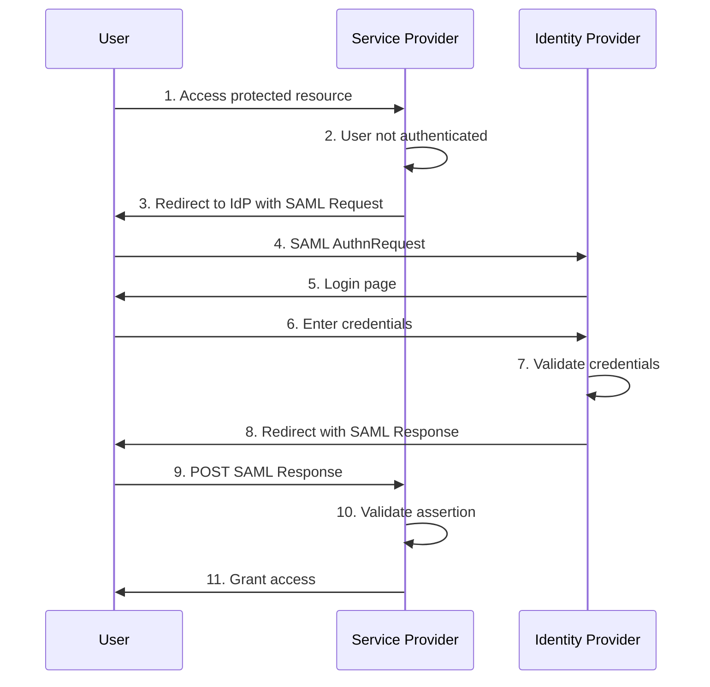
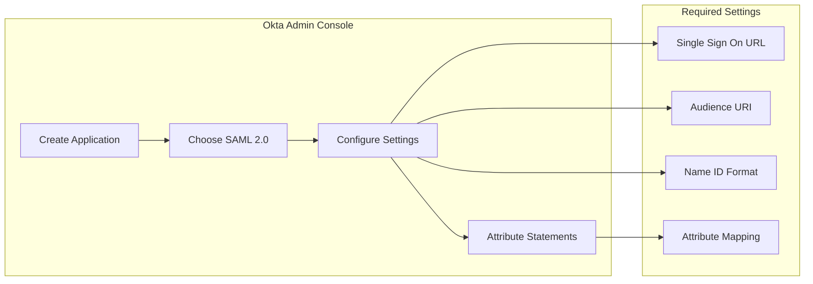
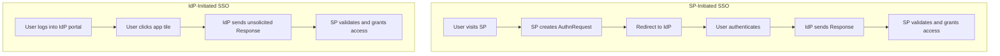
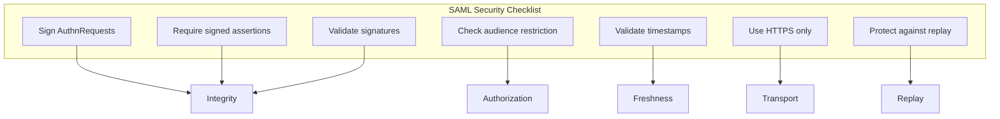

# How to Configure SAML Authentication

Author: [nawazdhandala](https://www.github.com/nawazdhandala)

Tags: SAML, SSO, Authentication, Security, Identity Provider, Enterprise

Description: A complete guide to implementing SAML 2.0 authentication including IdP configuration, SP setup, attribute mapping, and troubleshooting common issues.

---

SAML (Security Assertion Markup Language) is the enterprise standard for Single Sign-On (SSO). It allows users to authenticate once with an Identity Provider (IdP) and access multiple Service Providers (SP) without re-entering credentials. This guide covers practical SAML implementation from both the IdP and SP perspectives.

## Understanding SAML Flow



### Key SAML Components

| Component | Description |
|-----------|-------------|
| Identity Provider (IdP) | Authenticates users (Okta, Azure AD, OneLogin) |
| Service Provider (SP) | Your application that needs authentication |
| SAML Assertion | XML document with user identity and attributes |
| AuthnRequest | Request from SP to IdP to authenticate user |
| ACS URL | Assertion Consumer Service - where IdP sends response |
| Entity ID | Unique identifier for SP or IdP |

## Setting Up SAML Service Provider

### Node.js with passport-saml

```javascript
// Install: npm install passport passport-saml express-session

const express = require('express');
const passport = require('passport');
const SamlStrategy = require('passport-saml').Strategy;
const session = require('express-session');

const app = express();

// Session configuration
app.use(session({
    secret: process.env.SESSION_SECRET,
    resave: false,
    saveUninitialized: false,
    cookie: { secure: true, maxAge: 24 * 60 * 60 * 1000 }
}));

app.use(passport.initialize());
app.use(passport.session());

// SAML Strategy configuration
const samlStrategy = new SamlStrategy(
    {
        // Your SP configuration
        callbackUrl: 'https://yourapp.com/auth/saml/callback',
        entryPoint: 'https://idp.example.com/sso/saml',
        issuer: 'https://yourapp.com',

        // IdP certificate (from IdP metadata)
        cert: `-----BEGIN CERTIFICATE-----
MIICpDCCAYwCCQDU+pQ4P2...
-----END CERTIFICATE-----`,

        // Optional: Sign requests
        privateKey: process.env.SAML_PRIVATE_KEY,
        signatureAlgorithm: 'sha256',

        // Identity provider settings
        identifierFormat: 'urn:oasis:names:tc:SAML:1.1:nameid-format:emailAddress',

        // Validation settings
        validateInResponseTo: true,
        disableRequestedAuthnContext: true
    },
    // Verify callback
    (profile, done) => {
        // Map SAML attributes to user object
        const user = {
            id: profile.nameID,
            email: profile.email || profile['http://schemas.xmlsoap.org/ws/2005/05/identity/claims/emailaddress'],
            firstName: profile.firstName || profile['http://schemas.xmlsoap.org/ws/2005/05/identity/claims/givenname'],
            lastName: profile.lastName || profile['http://schemas.xmlsoap.org/ws/2005/05/identity/claims/surname'],
            groups: profile.groups || []
        };

        // Find or create user in your database
        return findOrCreateUser(user)
            .then(dbUser => done(null, dbUser))
            .catch(err => done(err));
    }
);

passport.use(samlStrategy);

// Serialize user for session
passport.serializeUser((user, done) => {
    done(null, user.id);
});

passport.deserializeUser((id, done) => {
    findUserById(id)
        .then(user => done(null, user))
        .catch(err => done(err));
});

// Routes

// Initiate SAML login
app.get('/auth/saml/login',
    passport.authenticate('saml', { failureRedirect: '/login-failed' })
);

// SAML callback (ACS URL)
app.post('/auth/saml/callback',
    express.urlencoded({ extended: false }),
    passport.authenticate('saml', { failureRedirect: '/login-failed' }),
    (req, res) => {
        // Successful authentication
        res.redirect('/dashboard');
    }
);

// SP Metadata endpoint
app.get('/auth/saml/metadata', (req, res) => {
    res.type('application/xml');
    res.send(samlStrategy.generateServiceProviderMetadata());
});

// Logout
app.get('/auth/saml/logout', (req, res) => {
    req.logout(() => {
        res.redirect('/');
    });
});

app.listen(3000);
```

### Python with python3-saml

```python
# Install: pip install python3-saml

from flask import Flask, request, redirect, session, make_response
from onelogin.saml2.auth import OneLogin_Saml2_Auth
from onelogin.saml2.utils import OneLogin_Saml2_Utils
import json

app = Flask(__name__)
app.secret_key = 'your-secret-key'

def init_saml_auth(req):
    """Initialize SAML auth object."""
    auth = OneLogin_Saml2_Auth(req, custom_base_path='saml/')
    return auth

def prepare_flask_request(request):
    """Prepare Flask request for SAML library."""
    url_data = request.url.split('?')
    return {
        'https': 'on' if request.scheme == 'https' else 'off',
        'http_host': request.host,
        'server_port': request.environ.get('SERVER_PORT'),
        'script_name': request.path,
        'get_data': request.args.copy(),
        'post_data': request.form.copy(),
        'query_string': request.query_string.decode('utf-8')
    }

@app.route('/saml/login')
def saml_login():
    """Initiate SAML login."""
    req = prepare_flask_request(request)
    auth = init_saml_auth(req)

    # Redirect to IdP
    return redirect(auth.login())

@app.route('/saml/acs', methods=['POST'])
def saml_acs():
    """Assertion Consumer Service - handle SAML response."""
    req = prepare_flask_request(request)
    auth = init_saml_auth(req)

    auth.process_response()
    errors = auth.get_errors()

    if errors:
        return f"SAML Error: {', '.join(errors)}", 400

    if not auth.is_authenticated():
        return "Authentication failed", 401

    # Get user attributes
    attributes = auth.get_attributes()
    name_id = auth.get_nameid()

    # Store in session
    session['saml_user'] = {
        'name_id': name_id,
        'email': attributes.get('email', [None])[0],
        'first_name': attributes.get('firstName', [None])[0],
        'last_name': attributes.get('lastName', [None])[0],
        'groups': attributes.get('groups', [])
    }

    # Redirect to original URL or dashboard
    relay_state = request.form.get('RelayState', '/')
    return redirect(relay_state)

@app.route('/saml/metadata')
def saml_metadata():
    """Serve SP metadata XML."""
    req = prepare_flask_request(request)
    auth = init_saml_auth(req)

    settings = auth.get_settings()
    metadata = settings.get_sp_metadata()
    errors = settings.validate_metadata(metadata)

    if errors:
        return f"Metadata Error: {', '.join(errors)}", 400

    resp = make_response(metadata)
    resp.headers['Content-Type'] = 'application/xml'
    return resp

@app.route('/saml/logout')
def saml_logout():
    """Initiate SAML logout."""
    req = prepare_flask_request(request)
    auth = init_saml_auth(req)

    name_id = session.get('saml_user', {}).get('name_id')
    return redirect(auth.logout(name_id=name_id))

@app.route('/saml/sls')
def saml_sls():
    """Single Logout Service - handle logout response."""
    req = prepare_flask_request(request)
    auth = init_saml_auth(req)

    auth.process_slo()
    errors = auth.get_errors()

    if errors:
        return f"SLO Error: {', '.join(errors)}", 400

    session.clear()
    return redirect('/')

if __name__ == '__main__':
    app.run(ssl_context='adhoc')
```

### SAML Settings Configuration

```json
{
    "strict": true,
    "debug": false,
    "sp": {
        "entityId": "https://yourapp.com",
        "assertionConsumerService": {
            "url": "https://yourapp.com/saml/acs",
            "binding": "urn:oasis:names:tc:SAML:2.0:bindings:HTTP-POST"
        },
        "singleLogoutService": {
            "url": "https://yourapp.com/saml/sls",
            "binding": "urn:oasis:names:tc:SAML:2.0:bindings:HTTP-Redirect"
        },
        "NameIDFormat": "urn:oasis:names:tc:SAML:1.1:nameid-format:emailAddress",
        "x509cert": "",
        "privateKey": ""
    },
    "idp": {
        "entityId": "https://idp.example.com",
        "singleSignOnService": {
            "url": "https://idp.example.com/sso/saml",
            "binding": "urn:oasis:names:tc:SAML:2.0:bindings:HTTP-Redirect"
        },
        "singleLogoutService": {
            "url": "https://idp.example.com/slo/saml",
            "binding": "urn:oasis:names:tc:SAML:2.0:bindings:HTTP-Redirect"
        },
        "x509cert": "MIICpDCCAYwCCQDU..."
    },
    "security": {
        "authnRequestsSigned": true,
        "wantAssertionsSigned": true,
        "wantMessagesSigned": false,
        "wantNameIdEncrypted": false,
        "signatureAlgorithm": "http://www.w3.org/2001/04/xmldsig-more#rsa-sha256",
        "digestAlgorithm": "http://www.w3.org/2001/04/xmlenc#sha256"
    }
}
```

## Configuring Identity Providers

### Okta Configuration



Okta application settings:

```yaml
# Okta SAML Settings
General Settings:
  App name: Your Application
  App logo: (optional)

SAML Settings:
  Single sign on URL: https://yourapp.com/saml/acs
  Audience URI (SP Entity ID): https://yourapp.com
  Default RelayState: /dashboard
  Name ID format: EmailAddress
  Application username: Email

Attribute Statements:
  - Name: email
    Value: user.email
  - Name: firstName
    Value: user.firstName
  - Name: lastName
    Value: user.lastName

Group Attribute Statements:
  - Name: groups
    Filter: Matches regex (.*)
```

### Azure AD Configuration

```powershell
# Azure AD SAML Configuration via PowerShell
# Install: Install-Module AzureAD

Connect-AzureAD

# Create SAML application
$appName = "Your Application"
$replyUrl = "https://yourapp.com/saml/acs"
$identifierUri = "https://yourapp.com"

# Create application
$app = New-AzureADApplication `
    -DisplayName $appName `
    -ReplyUrls @($replyUrl) `
    -IdentifierUris @($identifierUri)

# Create service principal
$sp = New-AzureADServicePrincipal -AppId $app.AppId

# Configure SAML signing certificate
$certPath = "C:\path\to\certificate.pfx"
$certPassword = ConvertTo-SecureString -String "password" -AsPlainText -Force
$cert = New-Object System.Security.Cryptography.X509Certificates.X509Certificate2($certPath, $certPassword)

# Add certificate to application
New-AzureADApplicationKeyCredential `
    -ObjectId $app.ObjectId `
    -CustomKeyIdentifier "SAMLSigningCert" `
    -Type AsymmetricX509Cert `
    -Usage Sign `
    -Value ([System.Convert]::ToBase64String($cert.GetRawCertData()))
```

Azure Portal configuration:

```yaml
# Azure AD Enterprise Application Settings
Basic SAML Configuration:
  Identifier (Entity ID): https://yourapp.com
  Reply URL (ACS URL): https://yourapp.com/saml/acs
  Sign on URL: https://yourapp.com/saml/login
  Relay State: (optional)
  Logout URL: https://yourapp.com/saml/sls

User Attributes and Claims:
  Required claim:
    - Unique User Identifier (Name ID): user.userprincipalname
  Additional claims:
    - email: user.mail
    - firstName: user.givenname
    - lastName: user.surname
    - groups: user.groups
```

## Attribute Mapping

Different IdPs send attributes with different names. Handle this with flexible mapping.

```javascript
// Flexible attribute mapper
class SAMLAttributeMapper {
    constructor() {
        // Common attribute name variations
        this.attributeMaps = {
            email: [
                'email',
                'emailAddress',
                'http://schemas.xmlsoap.org/ws/2005/05/identity/claims/emailaddress',
                'http://schemas.xmlsoap.org/claims/EmailAddress',
                'urn:oid:0.9.2342.19200300.100.1.3'
            ],
            firstName: [
                'firstName',
                'givenName',
                'http://schemas.xmlsoap.org/ws/2005/05/identity/claims/givenname',
                'urn:oid:2.5.4.42'
            ],
            lastName: [
                'lastName',
                'surname',
                'sn',
                'http://schemas.xmlsoap.org/ws/2005/05/identity/claims/surname',
                'urn:oid:2.5.4.4'
            ],
            groups: [
                'groups',
                'memberOf',
                'http://schemas.microsoft.com/ws/2008/06/identity/claims/groups',
                'http://schemas.xmlsoap.org/claims/Group'
            ],
            department: [
                'department',
                'http://schemas.xmlsoap.org/ws/2005/05/identity/claims/department',
                'urn:oid:2.5.4.11'
            ]
        };
    }

    // Find attribute value from SAML profile
    getAttribute(profile, attributeName) {
        const possibleNames = this.attributeMaps[attributeName] || [attributeName];

        for (const name of possibleNames) {
            if (profile[name] !== undefined) {
                // Handle array values (some IdPs return arrays)
                const value = profile[name];
                return Array.isArray(value) ? value[0] : value;
            }
        }

        return null;
    }

    // Map SAML profile to user object
    mapProfile(profile) {
        return {
            id: profile.nameID,
            email: this.getAttribute(profile, 'email'),
            firstName: this.getAttribute(profile, 'firstName'),
            lastName: this.getAttribute(profile, 'lastName'),
            groups: this.getGroups(profile),
            department: this.getAttribute(profile, 'department'),
            rawAttributes: profile
        };
    }

    // Get groups (always return array)
    getGroups(profile) {
        const possibleNames = this.attributeMaps.groups;

        for (const name of possibleNames) {
            if (profile[name] !== undefined) {
                const value = profile[name];
                return Array.isArray(value) ? value : [value];
            }
        }

        return [];
    }
}

// Usage in passport strategy
const mapper = new SAMLAttributeMapper();

const samlStrategy = new SamlStrategy(config, (profile, done) => {
    const user = mapper.mapProfile(profile);
    console.log('Mapped user:', user);
    return done(null, user);
});
```

## SP-Initiated vs IdP-Initiated SSO



### Handling IdP-Initiated SSO

```javascript
// Support both SP-initiated and IdP-initiated SSO
const samlStrategy = new SamlStrategy(
    {
        ...config,
        // Allow unsolicited responses (IdP-initiated)
        validateInResponseTo: false,
        // Or use 'never' to explicitly allow
        // validateInResponseTo: 'never'
    },
    (profile, done) => {
        // Process user profile
        return done(null, profile);
    }
);

// Alternative: Conditional validation
app.post('/auth/saml/callback', (req, res, next) => {
    // Check if this is IdP-initiated (no InResponseTo)
    const samlResponse = req.body.SAMLResponse;
    const decoded = Buffer.from(samlResponse, 'base64').toString('utf8');
    const isIdpInitiated = !decoded.includes('InResponseTo');

    // Configure strategy based on flow type
    samlStrategy.options.validateInResponseTo = !isIdpInitiated;

    passport.authenticate('saml', (err, user) => {
        if (err) return next(err);
        if (!user) return res.redirect('/login-failed');

        req.logIn(user, (err) => {
            if (err) return next(err);
            res.redirect('/dashboard');
        });
    })(req, res, next);
});
```

## Generating SP Metadata

```javascript
// Generate complete SP metadata
function generateSPMetadata(config) {
    const entityId = config.entityId;
    const acsUrl = config.acsUrl;
    const sloUrl = config.sloUrl;
    const cert = config.certificate;

    return `<?xml version="1.0" encoding="UTF-8"?>
<md:EntityDescriptor xmlns:md="urn:oasis:names:tc:SAML:2.0:metadata"
    entityID="${entityId}">
    <md:SPSSODescriptor
        AuthnRequestsSigned="true"
        WantAssertionsSigned="true"
        protocolSupportEnumeration="urn:oasis:names:tc:SAML:2.0:protocol">

        <md:KeyDescriptor use="signing">
            <ds:KeyInfo xmlns:ds="http://www.w3.org/2000/09/xmldsig#">
                <ds:X509Data>
                    <ds:X509Certificate>${cert}</ds:X509Certificate>
                </ds:X509Data>
            </ds:KeyInfo>
        </md:KeyDescriptor>

        <md:KeyDescriptor use="encryption">
            <ds:KeyInfo xmlns:ds="http://www.w3.org/2000/09/xmldsig#">
                <ds:X509Data>
                    <ds:X509Certificate>${cert}</ds:X509Certificate>
                </ds:X509Data>
            </ds:KeyInfo>
        </md:KeyDescriptor>

        <md:SingleLogoutService
            Binding="urn:oasis:names:tc:SAML:2.0:bindings:HTTP-Redirect"
            Location="${sloUrl}"/>

        <md:NameIDFormat>urn:oasis:names:tc:SAML:1.1:nameid-format:emailAddress</md:NameIDFormat>

        <md:AssertionConsumerService
            Binding="urn:oasis:names:tc:SAML:2.0:bindings:HTTP-POST"
            Location="${acsUrl}"
            index="1"
            isDefault="true"/>

    </md:SPSSODescriptor>
</md:EntityDescriptor>`;
}
```

## Troubleshooting SAML Issues

### Common Errors and Solutions

```javascript
// SAML error handler with detailed messages
function handleSAMLError(error, samlResponse) {
    const errorHandlers = {
        'InResponseTo': {
            message: 'Response InResponseTo mismatch',
            solution: 'Clear session and try again, or disable InResponseTo validation for IdP-initiated SSO'
        },
        'Issuer': {
            message: 'Invalid issuer in SAML response',
            solution: 'Verify IdP Entity ID matches configuration'
        },
        'Signature': {
            message: 'Invalid signature',
            solution: 'Verify IdP certificate is correct and not expired'
        },
        'Audience': {
            message: 'Audience restriction validation failed',
            solution: 'Verify SP Entity ID matches what IdP expects'
        },
        'NotBefore': {
            message: 'Assertion not yet valid',
            solution: 'Check server clock synchronization'
        },
        'NotOnOrAfter': {
            message: 'Assertion expired',
            solution: 'Check server clock, increase assertion validity time in IdP'
        }
    };

    for (const [key, handler] of Object.entries(errorHandlers)) {
        if (error.message.includes(key)) {
            console.error(`SAML Error: ${handler.message}`);
            console.error(`Solution: ${handler.solution}`);
            return handler;
        }
    }

    console.error('Unknown SAML error:', error.message);
    return { message: error.message, solution: 'Check SAML response and configuration' };
}

// Debug SAML response
function debugSAMLResponse(samlResponse) {
    const decoded = Buffer.from(samlResponse, 'base64').toString('utf8');

    // Parse XML
    const parser = new DOMParser();
    const doc = parser.parseFromString(decoded, 'text/xml');

    console.log('=== SAML Response Debug ===');
    console.log('Raw XML:', decoded.substring(0, 500) + '...');

    // Extract key elements
    const issuer = doc.getElementsByTagName('saml:Issuer')[0];
    console.log('Issuer:', issuer ? issuer.textContent : 'Not found');

    const status = doc.getElementsByTagName('samlp:StatusCode')[0];
    console.log('Status:', status ? status.getAttribute('Value') : 'Not found');

    const conditions = doc.getElementsByTagName('saml:Conditions')[0];
    if (conditions) {
        console.log('NotBefore:', conditions.getAttribute('NotBefore'));
        console.log('NotOnOrAfter:', conditions.getAttribute('NotOnOrAfter'));
    }

    const audience = doc.getElementsByTagName('saml:Audience')[0];
    console.log('Audience:', audience ? audience.textContent : 'Not found');

    return decoded;
}
```

### SAML Debugging Middleware

```javascript
// Debug middleware for SAML troubleshooting
function samlDebugMiddleware(req, res, next) {
    if (req.body && req.body.SAMLResponse) {
        console.log('=== Incoming SAML Response ===');
        console.log('Timestamp:', new Date().toISOString());
        console.log('RelayState:', req.body.RelayState);

        try {
            const decoded = Buffer.from(req.body.SAMLResponse, 'base64').toString('utf8');

            // Log formatted XML (first 2000 chars)
            console.log('Decoded Response (truncated):', decoded.substring(0, 2000));

            // Check for common issues
            if (!decoded.includes('samlp:Response')) {
                console.warn('Warning: Response may not be a valid SAML Response');
            }

            if (decoded.includes('samlp:StatusCode Value="urn:oasis:names:tc:SAML:2.0:status:Success"')) {
                console.log('Status: Success');
            } else {
                console.warn('Warning: Response status is not Success');
            }
        } catch (e) {
            console.error('Failed to decode SAML Response:', e.message);
        }
    }

    next();
}

// Use before SAML callback route
app.use('/auth/saml/callback', samlDebugMiddleware);
```

## Security Best Practices



```javascript
// Secure SAML configuration
const secureConfig = {
    // Always sign requests
    authnRequestsSigned: true,

    // Require signed assertions
    wantAssertionsSigned: true,

    // Use strong algorithms
    signatureAlgorithm: 'sha256',

    // Validate InResponseTo to prevent replay
    validateInResponseTo: true,

    // Short validity window
    acceptedClockSkewMs: 60000,  // 1 minute

    // Audience validation
    audience: 'https://yourapp.com',

    // Certificate validation
    wantAuthnResponseSigned: true
};

// Certificate rotation handling
class CertificateManager {
    constructor() {
        this.certificates = [];
    }

    // Add certificate (supports rotation)
    addCertificate(cert, validUntil) {
        this.certificates.push({ cert, validUntil: new Date(validUntil) });
        // Sort by expiration, newest first
        this.certificates.sort((a, b) => b.validUntil - a.validUntil);
    }

    // Get all valid certificates
    getValidCertificates() {
        const now = new Date();
        return this.certificates
            .filter(c => c.validUntil > now)
            .map(c => c.cert);
    }

    // Use with passport-saml (supports array of certs)
    getCertConfig() {
        return this.getValidCertificates();
    }
}
```

## SAML Configuration Checklist

- [ ] SP Entity ID configured and unique
- [ ] ACS URL accessible and using HTTPS
- [ ] IdP metadata imported correctly
- [ ] IdP certificate installed and valid
- [ ] Attribute mapping configured
- [ ] Signature validation enabled
- [ ] Clock skew tolerance set appropriately
- [ ] Session management configured
- [ ] Logout flow implemented
- [ ] Error handling in place
- [ ] Debugging/logging available

---

SAML authentication requires careful configuration on both the SP and IdP sides. Always use HTTPS, validate signatures, and test thoroughly with your specific Identity Provider. Keep IdP certificates updated and implement proper error handling to help users when authentication fails.
