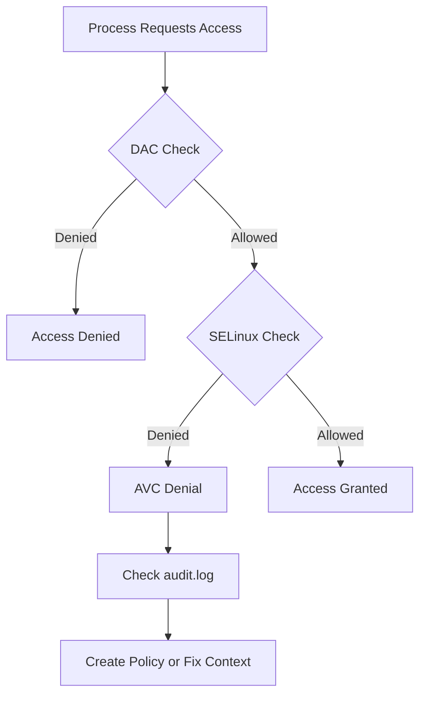
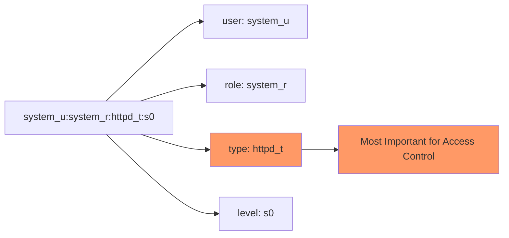
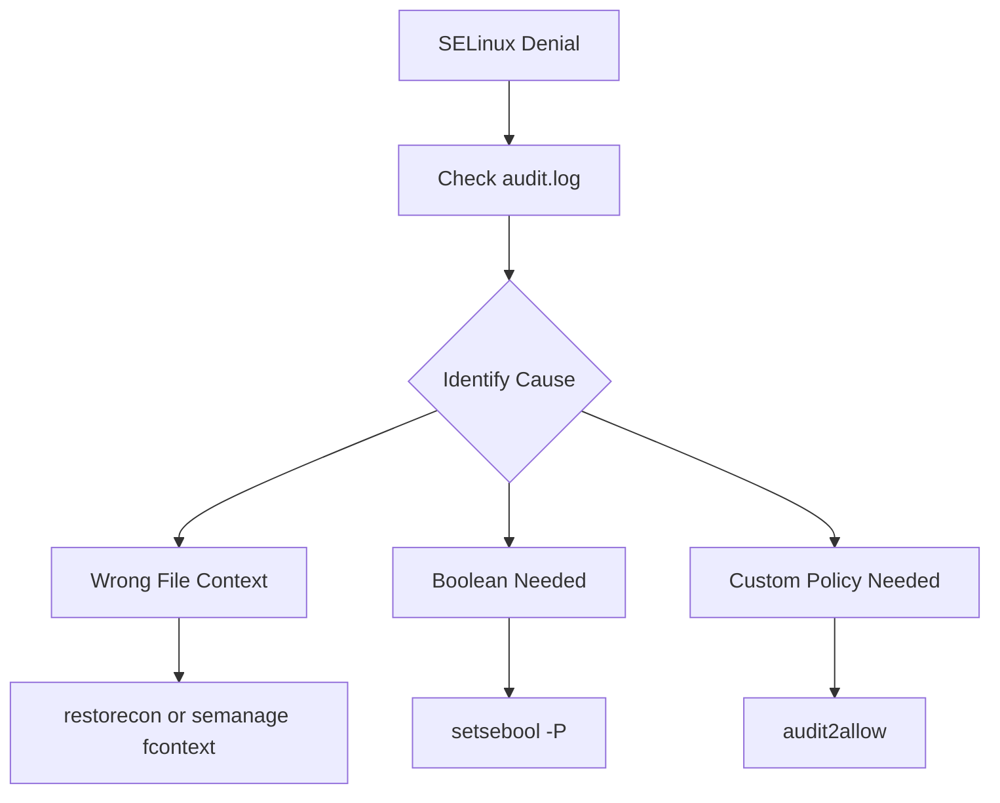

# How to Configure SELinux Policies

Author: [nawazdhandala](https://www.github.com/nawazdhandala)

Tags: Linux, SELinux, Security, RHEL, CentOS, Fedora, System Administration, Access Control

Description: Learn how to configure SELinux policies effectively, including managing contexts, creating custom policies, troubleshooting denials, and maintaining security without disabling SELinux.

---

SELinux (Security-Enhanced Linux) provides mandatory access control that goes beyond traditional Unix permissions. Rather than disabling it when you encounter issues, learn to configure it properly. This guide shows you how.

## Understanding SELinux



### SELinux Modes

```bash
# Check current SELinux status
getenforce
# Output: Enforcing, Permissive, or Disabled

# Or get detailed status
sestatus
```

| Mode | Behavior | Use Case |
|------|----------|----------|
| Enforcing | Denies and logs violations | Production |
| Permissive | Logs but allows violations | Debugging |
| Disabled | No SELinux at all | Not recommended |

### Key Concepts

- **Context**: Labels attached to files, processes, and ports
- **Policy**: Rules defining what contexts can access what
- **Type**: The most important part of a context (e.g., `httpd_t`)
- **Boolean**: On/off switches for policy features

## Basic SELinux Commands

### Managing Modes

```bash
# Check current mode
getenforce

# Temporarily switch to permissive (until reboot)
sudo setenforce 0

# Temporarily switch to enforcing
sudo setenforce 1

# Permanently change mode (edit config file)
sudo vi /etc/selinux/config
# Change: SELINUX=enforcing
# Options: enforcing, permissive, disabled

# After changing to/from disabled, reboot is required
sudo reboot
```

### Viewing Contexts

```bash
# View file context
ls -Z /var/www/html/
# Output: unconfined_u:object_r:httpd_sys_content_t:s0 index.html

# View process context
ps auxZ | grep httpd
# Output: system_u:system_r:httpd_t:s0 ... /usr/sbin/httpd

# View port context
sudo semanage port -l | grep http
# Output: http_port_t tcp 80, 81, 443, 488, 8008, 8009, 8443, 9000
```

### Understanding Context Format

```
user:role:type:level
```



## Managing File Contexts

### Viewing Default Contexts

```bash
# See what context files should have in a directory
sudo semanage fcontext -l | grep /var/www

# Output:
# /var/www(/.*)?    all files    system_u:object_r:httpd_sys_content_t:s0
# /var/www/cgi-bin(/.*)?    all files    system_u:object_r:httpd_sys_script_exec_t:s0
```

### Changing File Contexts

```bash
# Temporarily change context (lost on relabel)
sudo chcon -t httpd_sys_content_t /path/to/file

# Restore default context for a file/directory
sudo restorecon -v /var/www/html/myfile

# Restore contexts recursively
sudo restorecon -Rv /var/www/html/

# Permanently add new context rule
sudo semanage fcontext -a -t httpd_sys_content_t "/srv/mywebsite(/.*)?"

# Apply the new rule
sudo restorecon -Rv /srv/mywebsite

# Delete a custom context rule
sudo semanage fcontext -d "/srv/mywebsite(/.*)?"
```

### Common File Context Types

| Type | Purpose |
|------|---------|
| `httpd_sys_content_t` | Web server read-only content |
| `httpd_sys_rw_content_t` | Web server read-write content |
| `httpd_log_t` | Web server logs |
| `var_log_t` | General log files |
| `tmp_t` | Temporary files |
| `user_home_t` | User home directory content |

### Example: Setting Up a Custom Web Root

```bash
# Create custom web directory
sudo mkdir -p /srv/mywebsite

# Add SELinux context rule
sudo semanage fcontext -a -t httpd_sys_content_t "/srv/mywebsite(/.*)?"

# For directories where Apache needs to write
sudo semanage fcontext -a -t httpd_sys_rw_content_t "/srv/mywebsite/uploads(/.*)?"

# Apply contexts
sudo restorecon -Rv /srv/mywebsite

# Verify
ls -Z /srv/mywebsite
```

## Managing Port Contexts

### Viewing Port Assignments

```bash
# List all port contexts
sudo semanage port -l

# Filter for specific service
sudo semanage port -l | grep ssh
# Output: ssh_port_t tcp 22

sudo semanage port -l | grep http
# Output: http_port_t tcp 80, 81, 443, 488, 8008, 8009, 8443, 9000
```

### Adding Custom Ports

```bash
# Allow Apache to listen on port 8080
sudo semanage port -a -t http_port_t -p tcp 8080

# Allow SSH on a non-standard port
sudo semanage port -a -t ssh_port_t -p tcp 2222

# Modify existing port assignment
sudo semanage port -m -t http_port_t -p tcp 8081

# Delete custom port assignment
sudo semanage port -d -t http_port_t -p tcp 8080

# Verify
sudo semanage port -l | grep 8080
```

### Example: Running Nginx on Port 8443

```bash
# Check if port is already assigned
sudo semanage port -l | grep 8443
# If http_port_t is listed, you're good

# If not, add it
sudo semanage port -a -t http_port_t -p tcp 8443

# Restart nginx
sudo systemctl restart nginx
```

## Managing Booleans

Booleans are on/off switches that modify SELinux policy behavior without writing custom policies.

### Viewing Booleans

```bash
# List all booleans
sudo getsebool -a

# List booleans for a specific service
sudo getsebool -a | grep httpd

# Get detailed information about a boolean
sudo semanage boolean -l | grep httpd_can_network_connect
```

### Setting Booleans

```bash
# Temporarily enable a boolean (lost on reboot)
sudo setsebool httpd_can_network_connect on

# Permanently enable a boolean
sudo setsebool -P httpd_can_network_connect on

# Permanently disable a boolean
sudo setsebool -P httpd_can_network_connect off
```

### Common Useful Booleans

```bash
# Allow Apache to connect to network (databases, APIs)
sudo setsebool -P httpd_can_network_connect on

# Allow Apache to connect to databases specifically
sudo setsebool -P httpd_can_network_connect_db on

# Allow Apache to send emails
sudo setsebool -P httpd_can_sendmail on

# Allow Apache to execute CGI scripts
sudo setsebool -P httpd_enable_cgi on

# Allow users to run their own web content in ~/public_html
sudo setsebool -P httpd_enable_homedirs on

# Allow NFS home directories
sudo setsebool -P use_nfs_home_dirs on

# Allow Samba to share home directories
sudo setsebool -P samba_enable_home_dirs on

# Allow FTP to access home directories
sudo setsebool -P ftp_home_dir on
```

## Troubleshooting SELinux Denials

### Finding Denials

```bash
# Check audit log for SELinux denials
sudo ausearch -m AVC -ts recent

# Or grep the audit log directly
sudo grep "denied" /var/log/audit/audit.log | tail -20

# Use sealert for human-readable analysis (requires setroubleshoot)
sudo sealert -a /var/log/audit/audit.log

# Watch denials in real-time
sudo tail -f /var/log/audit/audit.log | grep denied
```

### Understanding Denial Messages

```
type=AVC msg=audit(1706100000.123:456): avc:  denied  { read } for  pid=1234
comm="httpd" name="config.php" dev="sda1" ino=789
scontext=system_u:system_r:httpd_t:s0
tcontext=unconfined_u:object_r:user_home_t:s0 tclass=file permissive=0
```

Breaking down:

| Field | Meaning |
|-------|---------|
| `denied { read }` | Read access was denied |
| `comm="httpd"` | Apache process tried to access |
| `name="config.php"` | File that was accessed |
| `scontext=...httpd_t...` | Source context (Apache) |
| `tcontext=...user_home_t...` | Target context (file) |
| `permissive=0` | Enforcing mode (denial enforced) |

### Quick Troubleshooting Workflow



### Using audit2allow

```bash
# Generate human-readable explanation
sudo ausearch -m AVC -ts recent | audit2allow -w

# Generate type enforcement rules
sudo ausearch -m AVC -ts recent | audit2allow -m mymodule

# Generate and compile a complete module
sudo ausearch -m AVC -ts recent | audit2allow -M mymodule

# This creates:
# mymodule.te - Type Enforcement file
# mymodule.pp - Compiled policy package

# Install the module
sudo semodule -i mymodule.pp

# List installed modules
sudo semodule -l | grep mymodule

# Remove a module
sudo semodule -r mymodule
```

## Creating Custom Policies

### Basic Policy Structure

```bash
# Create a Type Enforcement file: myapp.te
module myapp 1.0;

require {
    type httpd_t;
    type myapp_data_t;
    class file { read write open getattr };
    class dir { search getattr };
}

# Allow Apache to read myapp data files
allow httpd_t myapp_data_t:file { read open getattr };
allow httpd_t myapp_data_t:dir { search getattr };
```

### Compiling and Installing Custom Policies

```bash
# Check the policy for errors
checkmodule -M -m -o myapp.mod myapp.te

# Compile to policy package
semodule_package -o myapp.pp -m myapp.mod

# Install the policy
sudo semodule -i myapp.pp

# Verify installation
sudo semodule -l | grep myapp
```

### Example: Policy for Custom Application

```bash
# Step 1: Run application in permissive mode and collect denials
sudo setenforce 0
# Run your application
# Collect denials

# Step 2: Generate initial policy
sudo ausearch -m AVC -ts recent | audit2allow -M myapp

# Step 3: Review the generated policy
cat myapp.te

# Step 4: Edit if needed (remove overly permissive rules)
vi myapp.te

# Step 5: Recompile if edited
checkmodule -M -m -o myapp.mod myapp.te
semodule_package -o myapp.pp -m myapp.mod

# Step 6: Install
sudo semodule -i myapp.pp

# Step 7: Return to enforcing mode
sudo setenforce 1

# Step 8: Test the application
```

## Common Scenarios and Solutions

### Scenario 1: Apache Cannot Read Files

```bash
# Symptom: 403 Forbidden, files have wrong context

# Diagnosis
ls -Z /var/www/html/problem-file
# Shows: unconfined_u:object_r:user_home_t:s0  (wrong!)

# Fix: Restore correct context
sudo restorecon -Rv /var/www/html/

# Or if custom location
sudo semanage fcontext -a -t httpd_sys_content_t "/custom/path(/.*)?"
sudo restorecon -Rv /custom/path/
```

### Scenario 2: Application Cannot Connect to Database

```bash
# Symptom: Connection refused or timeout

# Check boolean
sudo getsebool httpd_can_network_connect_db

# Enable it
sudo setsebool -P httpd_can_network_connect_db on

# For general network connections
sudo setsebool -P httpd_can_network_connect on
```

### Scenario 3: Service Cannot Bind to Non-Standard Port

```bash
# Symptom: Permission denied when binding port

# Check current port assignments
sudo semanage port -l | grep http_port_t

# Add new port
sudo semanage port -a -t http_port_t -p tcp 9000

# Restart service
sudo systemctl restart httpd
```

### Scenario 4: Docker Container Denied Access

```bash
# Symptom: Container cannot access mounted volume

# Option 1: Use :Z or :z flag for auto-labeling
docker run -v /host/path:/container/path:Z myimage

# :Z - Relabels for single container (exclusive)
# :z - Relabels for multiple containers (shared)

# Option 2: Set context on host directory
sudo semanage fcontext -a -t container_file_t "/host/path(/.*)?"
sudo restorecon -Rv /host/path/

# Option 3: Enable boolean for NFS/Samba mounts
sudo setsebool -P virt_use_nfs on
sudo setsebool -P virt_use_samba on
```

### Scenario 5: NFS Mount Permission Issues

```bash
# Symptom: SELinux denying access to NFS-mounted content

# Enable NFS home directories
sudo setsebool -P use_nfs_home_dirs on

# For HTTP serving NFS content
sudo setsebool -P httpd_use_nfs on

# For Samba serving NFS content
sudo setsebool -P samba_share_nfs on
```

## Useful SELinux Tools

```bash
# Install SELinux troubleshooting tools
# RHEL/CentOS/Fedora
sudo dnf install setroubleshoot setroubleshoot-server policycoreutils-python-utils

# Essential commands summary
getenforce                      # Check mode
setenforce 0|1                  # Set mode temporarily
sestatus                        # Detailed status
ls -Z                           # View file contexts
ps auxZ                         # View process contexts
semanage fcontext              # Manage file contexts
semanage port                   # Manage port contexts
semanage boolean               # Manage booleans
restorecon                      # Apply default contexts
chcon                          # Temporarily change context
setsebool                       # Set booleans
getsebool                       # Get boolean values
ausearch -m AVC                # Search for denials
audit2allow                     # Generate policy from denials
semodule                        # Manage policy modules
sealert                         # Analyze denials (user-friendly)
```

## SELinux Troubleshooting Checklist

```bash
# Quick troubleshooting steps
# 1. Identify the denial
sudo ausearch -m AVC -ts recent

# 2. Check if it's a context issue
ls -Z /path/to/file
# Fix: sudo restorecon -Rv /path/

# 3. Check if boolean can help
sudo getsebool -a | grep service_name
# Fix: sudo setsebool -P boolean_name on

# 4. Check if port needs to be added
sudo semanage port -l | grep port_type
# Fix: sudo semanage port -a -t type -p tcp port

# 5. Generate custom policy if needed
sudo ausearch -m AVC -ts recent | audit2allow -M mypolicy
sudo semodule -i mypolicy.pp
```

---

SELinux is a powerful security layer that should not be disabled. Most issues are solved by: restoring file contexts, enabling booleans, or adding port assignments. Custom policies are rarely needed for standard applications. When in doubt, use permissive mode temporarily to collect denials, then create targeted fixes rather than broad exceptions.
