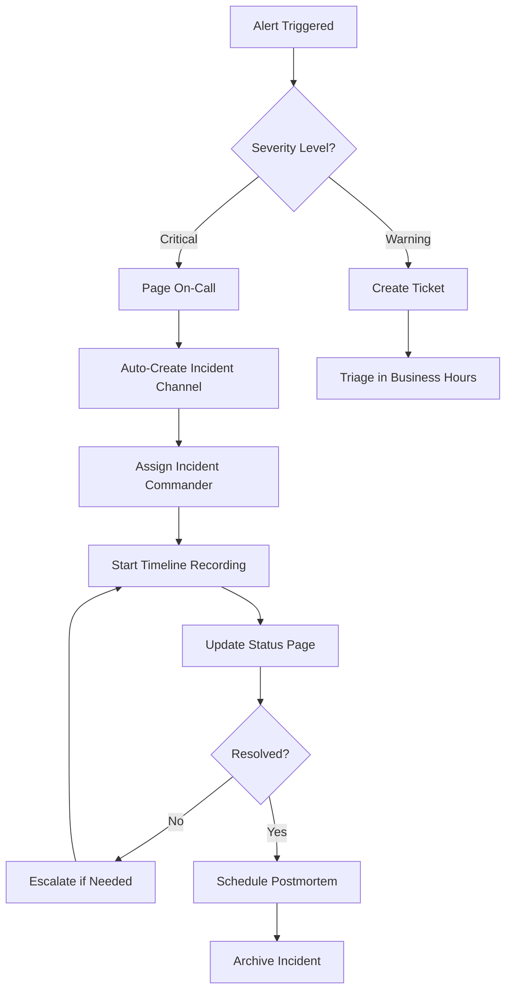

# How to Configure SRE Practices

Author: [nawazdhandala](https://www.github.com/nawazdhandala)

Tags: Site Reliability Engineering, SRE, Configuration, Best Practices, Observability, Monitoring, Reliability

Description: A practical guide to configuring Site Reliability Engineering practices in your organization, from foundational elements to advanced implementations.

---

## Why SRE Configuration Matters

Site Reliability Engineering is not something you install once and forget. It requires deliberate configuration across tools, processes, and team structures. Getting this configuration right determines whether your SRE program delivers measurable improvements or becomes just another buzzword in your engineering culture.

This guide walks through the essential configurations that transform SRE from theory into practice.

## Step 1: Configure Service Level Objectives (SLOs)

SLOs are the backbone of SRE. Without them, you are flying blind. Here is how to configure them properly.

Start by identifying the critical user journeys in your application. For an e-commerce platform, this might be checkout completion. For a SaaS product, it could be API response times.

Here is an example SLO configuration for a web service:

```yaml
# slo-config.yaml
# Configuration for service level objectives
service: checkout-service
slos:
  - name: availability
    description: "Checkout service should be available"
    target: 99.9  # 99.9% availability
    window: 30d   # Rolling 30-day window
    indicator:
      type: availability
      # Count successful responses (2xx, 3xx) vs total
      good_events: "http_requests_total{status=~'2..|3..'}"
      total_events: "http_requests_total"

  - name: latency
    description: "Checkout should complete within 500ms"
    target: 95.0  # 95th percentile
    window: 30d
    indicator:
      type: latency
      threshold_ms: 500
      histogram: "http_request_duration_seconds_bucket"
```

The target percentages should reflect what your users actually need. Setting 99.99% availability when 99.5% would satisfy users just burns engineering time defending against imaginary threats.

## Step 2: Configure Error Budget Policies

Error budgets give you permission to take risks. Configure them as concrete policies that the team can follow.

```yaml
# error-budget-policy.yaml
# Defines actions based on error budget consumption
policies:
  - budget_remaining: "> 50%"
    status: "healthy"
    actions:
      - "Normal development velocity"
      - "Feature work prioritized"
      - "Experimentation encouraged"

  - budget_remaining: "25% - 50%"
    status: "caution"
    actions:
      - "Increase monitoring attention"
      - "Review recent deployments"
      - "Limit risky changes"

  - budget_remaining: "< 25%"
    status: "critical"
    actions:
      - "Freeze non-essential deployments"
      - "Focus on reliability improvements"
      - "Incident review required for any outage"

  - budget_remaining: "exhausted"
    status: "frozen"
    actions:
      - "All deployments require SRE approval"
      - "Mandatory reliability sprint"
      - "Stakeholder communication required"
```

## Step 3: Configure Alerting Thresholds

Alerts that page engineers at 3 AM should indicate real problems. Configure multi-window alerts to reduce noise.

The following Prometheus alerting rule uses multiple burn rate windows to catch both fast burns (acute incidents) and slow burns (gradual degradation):

```yaml
# alerting-rules.yaml
# Multi-window burn rate alerting configuration
groups:
  - name: slo-alerts
    rules:
      # Fast burn alert - catches rapid degradation
      # Triggers if burning 14x normal rate over 1 hour
      # and 7x over 5 minutes
      - alert: SLOFastBurn
        expr: |
          (
            sum(rate(http_requests_total{status=~"5.."}[1h]))
            / sum(rate(http_requests_total[1h]))
          ) > (14 * 0.001)
          and
          (
            sum(rate(http_requests_total{status=~"5.."}[5m]))
            / sum(rate(http_requests_total[5m]))
          ) > (7 * 0.001)
        labels:
          severity: critical
        annotations:
          summary: "High error rate burning through SLO budget"
          runbook: "https://runbooks.example.com/slo-fast-burn"

      # Slow burn alert - catches gradual degradation
      - alert: SLOSlowBurn
        expr: |
          (
            sum(rate(http_requests_total{status=~"5.."}[6h]))
            / sum(rate(http_requests_total[6h]))
          ) > (2 * 0.001)
        labels:
          severity: warning
        annotations:
          summary: "Elevated error rate may exhaust SLO budget"
```

## Step 4: Configure On-Call Rotations

A well-configured on-call rotation prevents burnout and ensures coverage. Here is an example using a common rotation schedule:

```yaml
# oncall-schedule.yaml
# On-call rotation configuration
rotation:
  name: "platform-team-oncall"
  timezone: "UTC"

  # Primary rotation handles first response
  primary:
    schedule: "weekly"
    handoff_time: "09:00"
    handoff_day: "monday"
    members:
      - alice@example.com
      - bob@example.com
      - charlie@example.com

  # Secondary provides backup and learning opportunity
  secondary:
    schedule: "weekly"
    offset_from_primary: 1  # One week behind primary
    members:
      - alice@example.com
      - bob@example.com
      - charlie@example.com

  escalation:
    - level: 1
      timeout_minutes: 15
      target: primary
    - level: 2
      timeout_minutes: 30
      target: secondary
    - level: 3
      timeout_minutes: 45
      target: engineering-managers
```

## Step 5: Configure Observability Pipelines

OpenTelemetry provides a vendor-neutral way to collect telemetry. Configure your collector to route data appropriately.

This configuration sets up collection of traces, metrics, and logs with appropriate processing:

```yaml
# otel-collector-config.yaml
# OpenTelemetry Collector configuration for SRE observability
receivers:
  otlp:
    protocols:
      grpc:
        endpoint: 0.0.0.0:4317
      http:
        endpoint: 0.0.0.0:4318

processors:
  # Add resource attributes for better correlation
  resource:
    attributes:
      - key: environment
        value: production
        action: insert

  # Batch telemetry to reduce network overhead
  batch:
    timeout: 10s
    send_batch_size: 1024

  # Filter out health check noise
  filter:
    spans:
      exclude:
        match_type: strict
        span_names:
          - "health_check"
          - "readiness_probe"

exporters:
  otlphttp:
    endpoint: "https://otlp.oneuptime.com"
    headers:
      "x-oneuptime-token": "${ONEUPTIME_TOKEN}"

service:
  pipelines:
    traces:
      receivers: [otlp]
      processors: [resource, filter, batch]
      exporters: [otlphttp]
    metrics:
      receivers: [otlp]
      processors: [resource, batch]
      exporters: [otlphttp]
```

## Step 6: Configure Incident Management Workflows

Incidents need structured response. Configure automated workflows to reduce toil during stressful situations.

The following diagram shows how an incident flows through your configured systems:



## Step 7: Configure Deployment Guardrails

Deployments are the most common cause of incidents. Configure guardrails that catch problems early.

```yaml
# deployment-guardrails.yaml
# Configuration for safe deployments
guardrails:
  pre_deployment:
    # Require passing tests
    - check: "ci-tests"
      required: true
    # Check error budget status
    - check: "error-budget"
      block_if: "budget_remaining < 25%"

  during_deployment:
    # Canary deployment configuration
    canary:
      initial_percentage: 5
      increment: 10
      interval_minutes: 5
      max_percentage: 50

    # Automatic rollback triggers
    rollback_triggers:
      - metric: "error_rate"
        threshold: "2x baseline"
        window: "5m"
      - metric: "latency_p99"
        threshold: "3x baseline"
        window: "5m"

  post_deployment:
    bake_time_minutes: 30
    required_signals:
      - "no_new_errors"
      - "latency_stable"
```

## Verification and Iteration

After configuring these practices, verify they work with a game day exercise. Simulate an incident and walk through the entire response process. You will find gaps in your configuration that only show up under pressure.

Review your SRE configuration quarterly. As your system evolves, your practices need to evolve with it. Track metrics like Mean Time to Detect (MTTD), Mean Time to Resolve (MTTR), and error budget consumption to measure whether your configuration is working.

## Key Takeaways

Configuring SRE practices is not a one-time project. It requires:

- Clear SLOs that reflect user expectations
- Error budget policies with defined escalation paths
- Alerting that catches real problems without creating noise
- Observability pipelines that provide the data you need
- Incident management workflows that reduce cognitive load
- Deployment guardrails that prevent common failures

Start with the basics and iterate. A simple configuration that the team actually follows beats a complex one that gets ignored.
