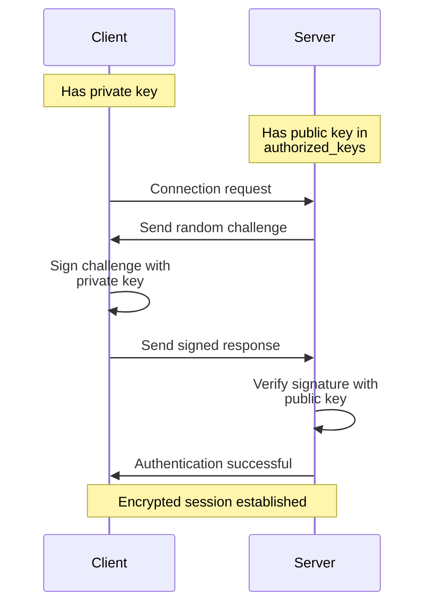
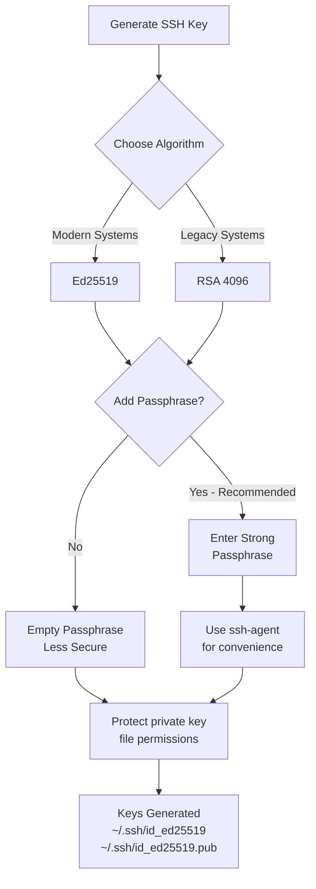
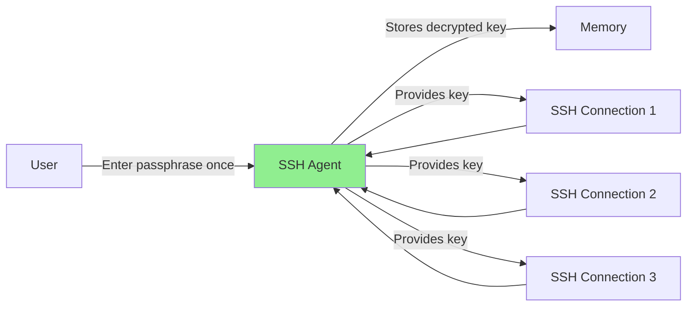
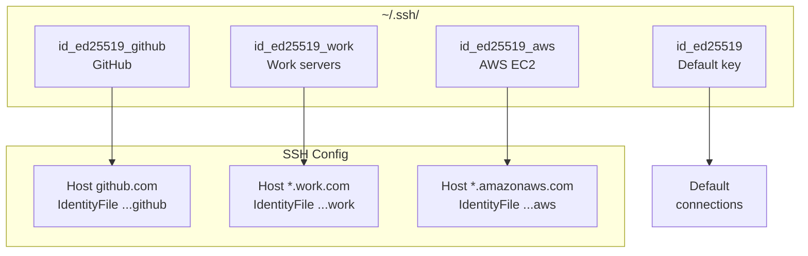
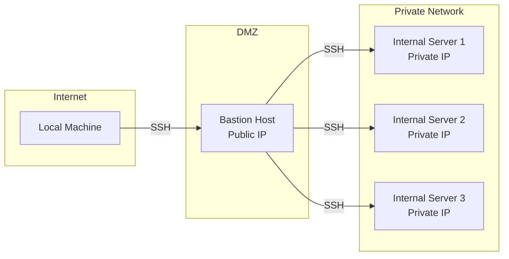

# How to Configure SSH Key Authentication

Author: [nawazdhandala](https://www.github.com/nawazdhandala)

Tags: Linux, SSH, Security, Authentication, System Administration, DevOps

Description: Learn how to set up secure SSH key-based authentication, disable password login, and follow best practices for managing SSH keys.

---

SSH key authentication is more secure and convenient than password-based authentication. Keys are nearly impossible to brute-force, eliminate the need to remember passwords, and can be protected with passphrases. This guide walks you through setting up SSH key authentication from scratch.

## How SSH Key Authentication Works



## Key Types Comparison

| Key Type | Security | Compatibility | Recommended |
|----------|----------|---------------|-------------|
| RSA 4096 | High | Universal | Yes (legacy systems) |
| Ed25519 | Very High | Modern systems | Yes (preferred) |
| ECDSA | High | Good | Yes |
| DSA | Low | Deprecated | No |
| RSA 2048 | Medium | Universal | No (too short) |

## Step 1: Generate SSH Key Pair

### Generate Ed25519 Key (Recommended)

```bash
# Generate Ed25519 key pair
# -t ed25519: Use Ed25519 algorithm (fast, secure, short keys)
# -C: Add a comment (usually email) for identification
ssh-keygen -t ed25519 -C "your.email@example.com"

# Output:
# Generating public/private ed25519 key pair.
# Enter file in which to save the key (/home/user/.ssh/id_ed25519):
# Enter passphrase (empty for no passphrase):
# Enter same passphrase again:
# Your identification has been saved in /home/user/.ssh/id_ed25519
# Your public key has been saved in /home/user/.ssh/id_ed25519.pub
```

### Generate RSA Key (For Compatibility)

```bash
# Generate RSA key pair with 4096 bits
# -t rsa: Use RSA algorithm
# -b 4096: Use 4096 bits (minimum recommended for RSA)
# -C: Comment for identification
ssh-keygen -t rsa -b 4096 -C "your.email@example.com"
```

### Generate Key with Custom Name

```bash
# Specify custom filename for multiple keys
# Useful for managing keys for different servers/purposes
ssh-keygen -t ed25519 -f ~/.ssh/id_ed25519_work -C "work-laptop"
ssh-keygen -t ed25519 -f ~/.ssh/id_ed25519_github -C "github-key"
```

### Key Generation Best Practices



## Step 2: Copy Public Key to Server

### Method 1: Using ssh-copy-id (Easiest)

```bash
# Copy public key to server
# This automatically adds the key to ~/.ssh/authorized_keys on the server
ssh-copy-id -i ~/.ssh/id_ed25519.pub user@server.example.com

# For non-standard SSH port
ssh-copy-id -i ~/.ssh/id_ed25519.pub -p 2222 user@server.example.com

# Output:
# /usr/bin/ssh-copy-id: INFO: attempting to log in with the new key(s)
# user@server.example.com's password:
# Number of key(s) added: 1
```

### Method 2: Manual Copy

```bash
# Display your public key
cat ~/.ssh/id_ed25519.pub

# Output example:
# ssh-ed25519 AAAAC3NzaC1lZDI1NTE5AAAAIGqj... your.email@example.com

# SSH to the server and create .ssh directory
ssh user@server.example.com
mkdir -p ~/.ssh
chmod 700 ~/.ssh

# Add your public key to authorized_keys
echo "ssh-ed25519 AAAAC3NzaC1lZDI1NTE5AAAAIGqj... your.email@example.com" >> ~/.ssh/authorized_keys

# Set correct permissions
chmod 600 ~/.ssh/authorized_keys
```

### Method 3: One-liner with Pipe

```bash
# Copy key in a single command
cat ~/.ssh/id_ed25519.pub | ssh user@server.example.com "mkdir -p ~/.ssh && chmod 700 ~/.ssh && cat >> ~/.ssh/authorized_keys && chmod 600 ~/.ssh/authorized_keys"
```

## Step 3: Test SSH Key Authentication

```bash
# Test connection with verbose output
# -v: Verbose mode shows authentication details
ssh -v user@server.example.com

# Look for these lines in output:
# debug1: Authentications that can continue: publickey,password
# debug1: Offering public key: /home/user/.ssh/id_ed25519 ED25519
# debug1: Server accepts key: /home/user/.ssh/id_ed25519 ED25519
# debug1: Authentication succeeded (publickey).

# If successful, you should connect without password prompt
```

## Step 4: Configure SSH Client

Create or edit `~/.ssh/config` for convenient connections:

```bash
# Edit SSH client configuration
nano ~/.ssh/config
```

```bash
# Default settings for all hosts
Host *
    # Use key-based authentication
    IdentitiesOnly yes
    # Add keys to ssh-agent automatically
    AddKeysToAgent yes
    # Connection keep-alive
    ServerAliveInterval 60
    ServerAliveCountMax 3

# Configuration for production server
Host production
    HostName prod.example.com
    User deploy
    Port 22
    IdentityFile ~/.ssh/id_ed25519_production

# Configuration for staging server
Host staging
    HostName staging.example.com
    User deploy
    Port 2222
    IdentityFile ~/.ssh/id_ed25519_staging

# GitHub
Host github.com
    HostName github.com
    User git
    IdentityFile ~/.ssh/id_ed25519_github

# Jump host / Bastion configuration
Host internal-server
    HostName 10.0.1.50
    User admin
    ProxyJump bastion.example.com
    IdentityFile ~/.ssh/id_ed25519
```

Now you can connect simply with:

```bash
# Instead of: ssh -i ~/.ssh/id_ed25519_production deploy@prod.example.com
ssh production

# Instead of: ssh -p 2222 deploy@staging.example.com
ssh staging
```

## Step 5: Configure SSH Server (Secure Settings)

Edit the SSH server configuration on the remote server:

```bash
# Edit SSH daemon configuration
sudo nano /etc/ssh/sshd_config
```

Recommended secure settings:

```bash
# Authentication settings
# Disable root login via SSH
PermitRootLogin no

# Enable public key authentication
PubkeyAuthentication yes

# Disable password authentication (after keys are working!)
PasswordAuthentication no

# Disable empty passwords
PermitEmptyPasswords no

# Disable challenge-response authentication
ChallengeResponseAuthentication no

# Disable keyboard-interactive authentication
KbdInteractiveAuthentication no

# Use PAM for account/session management
UsePAM yes

# Specify authorized keys file location
AuthorizedKeysFile .ssh/authorized_keys

# Security settings
# Use only protocol version 2
Protocol 2

# Limit authentication attempts
MaxAuthTries 3

# Limit concurrent unauthenticated connections
MaxStartups 10:30:60

# Disconnect idle sessions after 15 minutes
ClientAliveInterval 300
ClientAliveCountMax 3

# Logging
LogLevel VERBOSE

# Restrict to specific users (optional)
# AllowUsers deploy admin

# Restrict to specific groups (optional)
# AllowGroups sshusers admins
```

Apply changes:

```bash
# Validate configuration syntax
sudo sshd -t

# If no errors, restart SSH service
sudo systemctl restart sshd

# On older systems
sudo service ssh restart
```

## Using SSH Agent

SSH agent stores decrypted keys in memory, so you only enter the passphrase once:



### Start SSH Agent

```bash
# Start ssh-agent and set environment variables
eval "$(ssh-agent -s)"

# Output:
# Agent pid 12345
```

### Add Keys to Agent

```bash
# Add default key
ssh-add

# Add specific key
ssh-add ~/.ssh/id_ed25519_work

# Add key with expiration (12 hours)
# -t: Key lifetime in seconds
ssh-add -t 43200 ~/.ssh/id_ed25519

# List loaded keys
ssh-add -l

# Remove all keys from agent
ssh-add -D
```

### Persistent Agent (Linux with systemd)

Create a user service for persistent ssh-agent:

```bash
# Create systemd user directory
mkdir -p ~/.config/systemd/user

# Create ssh-agent service file
nano ~/.config/systemd/user/ssh-agent.service
```

```ini
[Unit]
Description=SSH Key Agent

[Service]
Type=simple
Environment=SSH_AUTH_SOCK=%t/ssh-agent.socket
ExecStart=/usr/bin/ssh-agent -D -a $SSH_AUTH_SOCK

[Install]
WantedBy=default.target
```

```bash
# Enable and start the service
systemctl --user enable ssh-agent
systemctl --user start ssh-agent

# Add to your ~/.bashrc or ~/.zshrc
export SSH_AUTH_SOCK="$XDG_RUNTIME_DIR/ssh-agent.socket"
```

### macOS Keychain Integration

On macOS, ssh-agent integrates with Keychain:

```bash
# Add key to Keychain (persistent across reboots)
ssh-add --apple-use-keychain ~/.ssh/id_ed25519

# Configure in ~/.ssh/config
Host *
    UseKeychain yes
    AddKeysToAgent yes
    IdentityFile ~/.ssh/id_ed25519
```

## Managing Multiple Keys



## Key Rotation and Management

### Rotate SSH Keys

```bash
# Step 1: Generate new key
ssh-keygen -t ed25519 -f ~/.ssh/id_ed25519_new -C "new-key-2026"

# Step 2: Add new public key to server
ssh-copy-id -i ~/.ssh/id_ed25519_new.pub user@server

# Step 3: Test new key works
ssh -i ~/.ssh/id_ed25519_new user@server

# Step 4: Remove old key from server's authorized_keys
ssh user@server "grep -v 'old-key-identifier' ~/.ssh/authorized_keys > ~/.ssh/authorized_keys.new && mv ~/.ssh/authorized_keys.new ~/.ssh/authorized_keys"

# Step 5: Update local key files
mv ~/.ssh/id_ed25519 ~/.ssh/id_ed25519_old
mv ~/.ssh/id_ed25519.pub ~/.ssh/id_ed25519_old.pub
mv ~/.ssh/id_ed25519_new ~/.ssh/id_ed25519
mv ~/.ssh/id_ed25519_new.pub ~/.ssh/id_ed25519.pub

# Step 6: After verification, delete old keys
rm ~/.ssh/id_ed25519_old ~/.ssh/id_ed25519_old.pub
```

### Revoke a Compromised Key

```bash
# On the server, edit authorized_keys
nano ~/.ssh/authorized_keys

# Find and delete the line containing the compromised key
# Keys are identified by the comment at the end

# Or use grep to remove it
grep -v "compromised-key-comment" ~/.ssh/authorized_keys > ~/.ssh/authorized_keys.new
mv ~/.ssh/authorized_keys.new ~/.ssh/authorized_keys
chmod 600 ~/.ssh/authorized_keys
```

## Security Best Practices

### File Permissions

```bash
# Correct permissions for SSH files
chmod 700 ~/.ssh                    # Directory: owner only
chmod 600 ~/.ssh/id_ed25519         # Private key: owner read/write
chmod 644 ~/.ssh/id_ed25519.pub     # Public key: readable by all
chmod 600 ~/.ssh/authorized_keys    # Authorized keys: owner only
chmod 600 ~/.ssh/config             # Config: owner only
chmod 600 ~/.ssh/known_hosts        # Known hosts: owner only
```

### Restricting Key Usage

In `authorized_keys`, you can restrict what a key can do:

```bash
# Restrict key to specific command only
command="/usr/bin/rsync --server" ssh-ed25519 AAAAC3... backup-key

# Restrict key to specific source IP
from="192.168.1.100,10.0.0.0/8" ssh-ed25519 AAAAC3... office-key

# Disable features for automation keys
no-port-forwarding,no-X11-forwarding,no-agent-forwarding ssh-ed25519 AAAAC3... automation-key

# Combine restrictions
from="10.0.0.0/8",command="/home/backup/backup.sh",no-pty ssh-ed25519 AAAAC3... backup-key
```

### Using a Bastion/Jump Host



Configure jump host in `~/.ssh/config`:

```bash
# Bastion host configuration
Host bastion
    HostName bastion.example.com
    User admin
    IdentityFile ~/.ssh/id_ed25519

# Internal server accessed via bastion
Host internal-*
    User deploy
    ProxyJump bastion
    IdentityFile ~/.ssh/id_ed25519

Host internal-web
    HostName 10.0.1.10

Host internal-db
    HostName 10.0.1.20
```

## Troubleshooting

### Common Issues

```bash
# Permission denied (publickey)
# Check these in order:

# 1. Verify correct permissions on client
ls -la ~/.ssh/
chmod 700 ~/.ssh
chmod 600 ~/.ssh/id_ed25519

# 2. Verify correct permissions on server
ssh user@server "ls -la ~/.ssh"
# Should show:
# drwx------ .ssh
# -rw------- authorized_keys

# 3. Check if public key is in authorized_keys
ssh user@server "cat ~/.ssh/authorized_keys"

# 4. Test with verbose mode
ssh -vvv user@server

# 5. Check server logs
sudo tail -f /var/log/auth.log
# Or on RHEL/CentOS:
sudo tail -f /var/log/secure
```

### Debugging Connection Issues

```bash
# Test SSH connection with maximum verbosity
ssh -vvv user@server 2>&1 | grep -E "(Offering|Server accepts|Authentication)"

# Check if SSH agent has your key loaded
ssh-add -l

# Verify key fingerprint matches
ssh-keygen -l -f ~/.ssh/id_ed25519.pub
```

## Quick Reference

```bash
# Generate Ed25519 key
ssh-keygen -t ed25519 -C "comment"

# Copy key to server
ssh-copy-id user@server

# Start SSH agent
eval "$(ssh-agent -s)"

# Add key to agent
ssh-add ~/.ssh/id_ed25519

# Test connection
ssh -v user@server

# Set correct permissions
chmod 700 ~/.ssh && chmod 600 ~/.ssh/id_ed25519
```

## Conclusion

SSH key authentication significantly improves security by eliminating password-based attacks and providing a more robust authentication mechanism. Always use strong key algorithms (Ed25519 or RSA 4096), protect private keys with passphrases, and disable password authentication on servers once key auth is working. Regular key rotation and proper permission management are essential for maintaining a secure SSH infrastructure.
