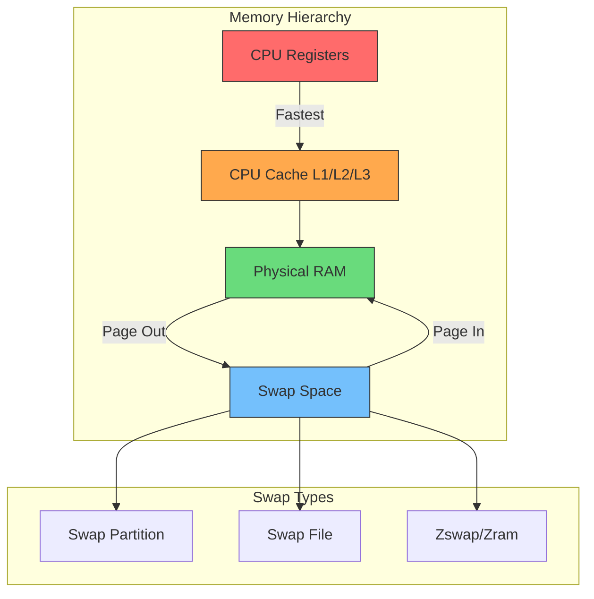
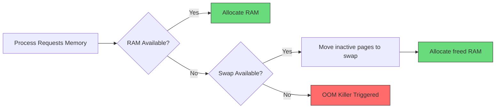
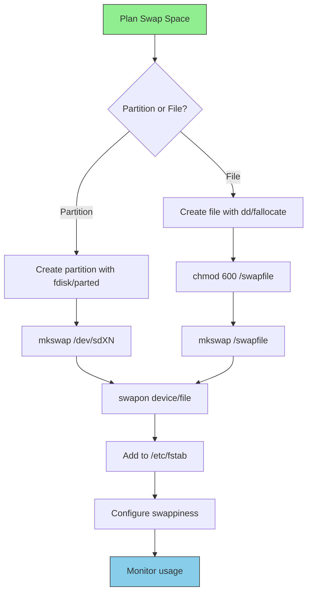
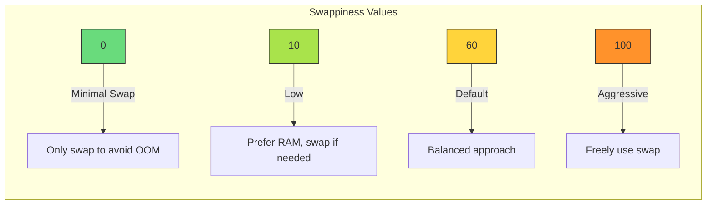
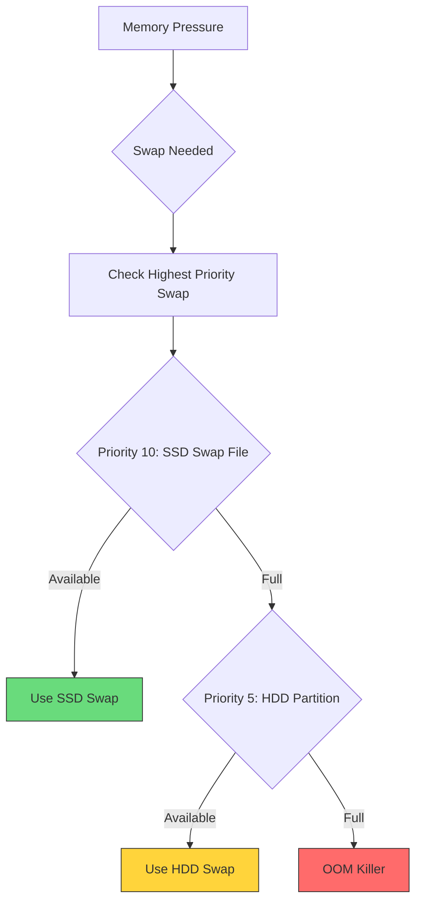
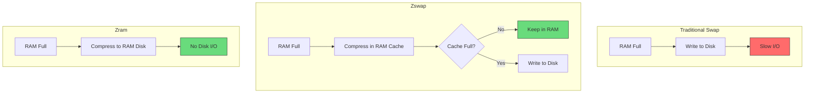
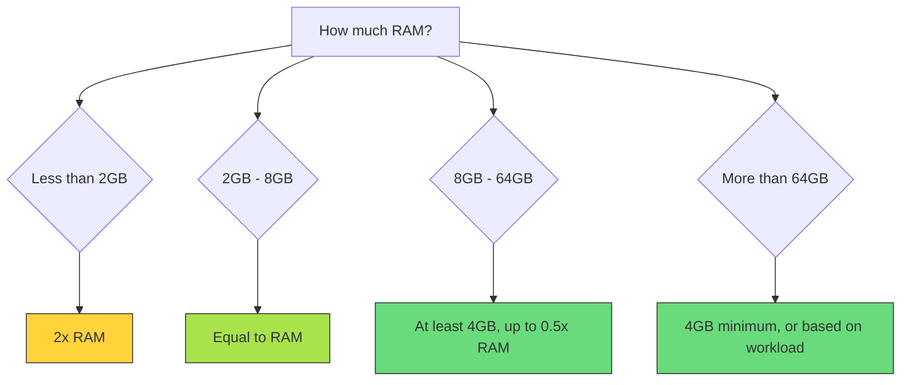

# How to Configure swap Space in Linux

Author: [nawazdhandala](https://www.github.com/nawazdhandala)

Tags: Linux, System Administration, Memory Management, Performance, Swap, Virtual Memory

Description: A comprehensive guide to configuring and managing swap space in Linux, including swap partitions, swap files, swappiness tuning, and best practices for different workloads.

---

Swap space is a critical component of Linux memory management. It provides a safety net when physical RAM is exhausted and can improve system stability under memory pressure. This guide covers everything you need to know about configuring, optimizing, and managing swap space in Linux.

## Understanding Swap Space

Swap space is disk storage used as an extension of physical memory (RAM). When the system runs low on RAM, inactive pages are moved to swap, freeing RAM for active processes.



### When Swap is Used



## Checking Current Swap Configuration

Before making changes, examine your current swap setup:

```bash
# View swap summary
swapon --show

# Example output:
# NAME      TYPE      SIZE USED PRIO
# /dev/sda2 partition   4G   0B   -2
# /swapfile file        2G   0B   -3

# Detailed memory and swap information
free -h

# Example output:
#               total        used        free      shared  buff/cache   available
# Mem:           15Gi       4.2Gi       8.1Gi       512Mi       3.1Gi        10Gi
# Swap:          4.0Gi          0B       4.0Gi

# View swap usage per process (top swap consumers)
for file in /proc/*/status; do
    awk '/VmSwap|Name/{printf $2 " " $3}END{print ""}' $file
done 2>/dev/null | sort -k2 -n -r | head -20
```

## Creating a Swap File

Swap files are flexible and easier to manage than partitions:

### Step 1: Create the Swap File

```bash
# Method 1: Using dd (traditional, works everywhere)
# Create a 4GB swap file
sudo dd if=/dev/zero of=/swapfile bs=1M count=4096 status=progress

# Method 2: Using fallocate (faster, but may not work on all filesystems)
sudo fallocate -l 4G /swapfile

# Note: fallocate may not work on XFS with older kernels
# or on filesystems with copy-on-write (Btrfs needs special handling)
```

### Step 2: Set Permissions and Format

```bash
# Set correct permissions (CRITICAL for security)
# Only root should be able to read/write the swap file
sudo chmod 600 /swapfile

# Verify permissions
ls -l /swapfile
# Output: -rw------- 1 root root 4294967296 Jan 24 10:00 /swapfile

# Format as swap
sudo mkswap /swapfile

# Output:
# Setting up swapspace version 1, size = 4 GiB (4294963200 bytes)
# no label, UUID=xxxxxxxx-xxxx-xxxx-xxxx-xxxxxxxxxxxx
```

### Step 3: Enable and Make Persistent

```bash
# Enable the swap file immediately
sudo swapon /swapfile

# Verify it is active
swapon --show

# Add to /etc/fstab for persistence across reboots
echo '/swapfile none swap sw 0 0' | sudo tee -a /etc/fstab

# Alternative fstab entry with UUID (more robust)
# First get the UUID
sudo blkid /swapfile

# Then add to fstab:
# UUID=xxxxxxxx-xxxx-xxxx-xxxx-xxxxxxxxxxxx none swap sw 0 0
```

## Creating a Swap Partition

Swap partitions can offer slightly better performance than swap files:

### Using fdisk

```bash
# List current partitions
sudo fdisk -l /dev/sdb

# Create swap partition interactively
sudo fdisk /dev/sdb

# In fdisk:
# n - new partition
# p - primary
# Enter - default partition number
# Enter - default first sector
# +4G - size of 4GB
# t - change partition type
# 82 - Linux swap type (or 19 for GPT)
# w - write changes and exit

# Format the partition as swap
sudo mkswap /dev/sdb1

# Enable the swap partition
sudo swapon /dev/sdb1

# Add to /etc/fstab
echo '/dev/sdb1 none swap sw 0 0' | sudo tee -a /etc/fstab
```

### Using parted for GPT Disks

```bash
# Create swap partition with parted
sudo parted /dev/sdb

# In parted:
# mklabel gpt                        # If new disk
# mkpart primary linux-swap 0% 4GiB  # Create 4GB swap at start
# quit

# Format and enable
sudo mkswap /dev/sdb1
sudo swapon /dev/sdb1
```

## Swap Configuration Workflow



## Tuning Swappiness

Swappiness controls how aggressively Linux uses swap:

```bash
# Check current swappiness (0-100, default is usually 60)
cat /proc/sys/vm/swappiness

# Temporarily change swappiness
sudo sysctl vm.swappiness=10

# Make permanent - add to /etc/sysctl.conf or create new file
echo 'vm.swappiness=10' | sudo tee /etc/sysctl.d/99-swappiness.conf

# Apply changes
sudo sysctl -p /etc/sysctl.d/99-swappiness.conf
```

### Swappiness Guidelines



| Swappiness | Use Case |
|------------|----------|
| 1-10 | Database servers, low-latency applications |
| 10-30 | Desktop systems with plenty of RAM |
| 60 | General purpose servers (default) |
| 80-100 | Systems with limited RAM |

### Additional Memory Tuning Parameters

```bash
# How aggressively to reclaim memory from cache
# Default: 100 (cache and swap equally weighted)
sudo sysctl vm.vfs_cache_pressure=50

# Minimum free memory (in KB) before swapping
sudo sysctl vm.min_free_kbytes=65536

# View all VM parameters
sudo sysctl -a | grep ^vm

# Recommended settings for different workloads
# Create /etc/sysctl.d/99-memory.conf

# For Database Servers:
# vm.swappiness = 1
# vm.vfs_cache_pressure = 50
# vm.dirty_ratio = 15
# vm.dirty_background_ratio = 5

# For Web Servers:
# vm.swappiness = 10
# vm.vfs_cache_pressure = 100

# For Desktop:
# vm.swappiness = 10
# vm.vfs_cache_pressure = 50
```

## Managing Multiple Swap Spaces

Linux supports multiple swap areas with priorities:

```bash
# Add swap with specific priority (higher = preferred)
sudo swapon -p 10 /swapfile
sudo swapon -p 5 /dev/sdb1

# View priorities
swapon --show

# Output:
# NAME      TYPE      SIZE USED PRIO
# /swapfile file        4G   0B   10
# /dev/sdb1 partition   4G   0B    5

# In /etc/fstab, specify priority:
/swapfile none swap sw,pri=10 0 0
/dev/sdb1 none swap sw,pri=5  0 0
```

### Swap Priority Strategy



## Removing Swap Space

```bash
# Disable swap temporarily
sudo swapoff /swapfile

# Check if swap was disabled
swapon --show

# Remove from /etc/fstab
sudo sed -i '/swapfile/d' /etc/fstab

# Delete the swap file
sudo rm /swapfile

# For partitions, you can delete or repurpose
sudo swapoff /dev/sdb1
# Then use fdisk to delete or change the partition
```

## Swap on SSD Considerations

When using SSDs for swap:

```bash
# Check if TRIM is supported
sudo hdparm -I /dev/sda | grep TRIM

# Enable discard option for swap partition (in /etc/fstab)
/dev/sda2 none swap sw,discard 0 0

# For swap files, discard may not work directly
# Use periodic fstrim instead
sudo fstrim -v /

# Configure automatic TRIM via systemd
sudo systemctl enable fstrim.timer
```

## Swap Encryption

For security-sensitive environments:

```bash
# Method 1: Encrypted swap with random key (data lost on reboot)
# In /etc/crypttab:
# swap /dev/sdb1 /dev/urandom swap,cipher=aes-xts-plain64,size=256

# In /etc/fstab:
# /dev/mapper/swap none swap sw 0 0

# Method 2: Using dm-crypt with LUKS
sudo cryptsetup luksFormat /dev/sdb1
sudo cryptsetup luksOpen /dev/sdb1 swap_encrypted
sudo mkswap /dev/mapper/swap_encrypted
sudo swapon /dev/mapper/swap_encrypted
```

## Zswap and Zram

Modern alternatives that compress swap data:

### Zswap (Compressed Swap Cache)

```bash
# Check if zswap is enabled
cat /sys/module/zswap/parameters/enabled

# Enable zswap at boot - add to kernel parameters
# Edit /etc/default/grub:
# GRUB_CMDLINE_LINUX="zswap.enabled=1"

# Update grub
sudo update-grub

# Or enable at runtime
echo 1 | sudo tee /sys/module/zswap/parameters/enabled

# Configure zswap parameters
echo lz4 | sudo tee /sys/module/zswap/parameters/compressor
echo 25 | sudo tee /sys/module/zswap/parameters/max_pool_percent

# Check zswap statistics
grep -r . /sys/kernel/debug/zswap/ 2>/dev/null
```

### Zram (Compressed RAM Disk)

```bash
# Load zram module
sudo modprobe zram

# Create a 4GB compressed swap in RAM
echo 4G | sudo tee /sys/block/zram0/disksize

# Make it swap
sudo mkswap /dev/zram0
sudo swapon -p 100 /dev/zram0  # High priority

# For persistent configuration, create /etc/systemd/zram-generator.conf
# Or use a systemd service

# Check zram statistics
cat /sys/block/zram0/mm_stat
```

### Memory Compression Comparison



## Monitoring Swap Usage

### Real-time Monitoring

```bash
# Watch swap usage in real-time
watch -n 1 'free -h; echo; swapon --show'

# Using vmstat (swap in/out activity)
vmstat 1 10

# Output columns:
# si - swap in (KB/s from swap to memory)
# so - swap out (KB/s from memory to swap)

# Using sar (if sysstat is installed)
sar -W 1 10  # Swap statistics
sar -r 1 10  # Memory and swap utilization
```

### Finding Swap-Heavy Processes

```bash
#!/bin/bash
# Script to find processes using swap

echo "PID    SWAP(KB)   COMMAND"
echo "---    --------   -------"

for pid in $(ls /proc | grep -E '^[0-9]+$'); do
    if [ -f /proc/$pid/status ]; then
        swap=$(grep VmSwap /proc/$pid/status 2>/dev/null | awk '{print $2}')
        name=$(grep Name /proc/$pid/status 2>/dev/null | awk '{print $2}')
        if [ -n "$swap" ] && [ "$swap" -gt 0 ]; then
            printf "%-6s %-10s %s\n" "$pid" "$swap" "$name"
        fi
    fi
done | sort -k2 -n -r | head -20
```

### Alerting on High Swap Usage

```bash
#!/bin/bash
# Monitor swap usage and alert if threshold exceeded

THRESHOLD=80  # Alert if swap usage exceeds 80%

while true; do
    # Get swap usage percentage
    SWAP_USED=$(free | grep Swap | awk '{if($2>0) print int($3/$2*100); else print 0}')

    if [ "$SWAP_USED" -gt "$THRESHOLD" ]; then
        echo "ALERT: Swap usage at ${SWAP_USED}%"
        # Add notification method (email, slack, etc.)
        # mail -s "High Swap Usage Alert" admin@example.com
    fi

    sleep 60
done
```

## How Much Swap Do You Need?

Traditional and modern recommendations:



| RAM | Minimum Swap | With Hibernation |
|-----|-------------|------------------|
| 2GB | 2GB | 4GB |
| 4GB | 4GB | 6GB |
| 8GB | 4GB | 10GB |
| 16GB | 4GB | 20GB |
| 32GB | 4GB | 36GB |
| 64GB+ | 4GB | RAM + sqrt(RAM) |

## Troubleshooting

### High Swap Usage with Available RAM

```bash
# Check swappiness setting
cat /proc/sys/vm/swappiness

# Check cache pressure
cat /proc/sys/vm/vfs_cache_pressure

# Review memory pressure
cat /proc/pressure/memory

# Force reclaim from cache before swapping
echo 3 | sudo tee /proc/sys/vm/drop_caches
# Note: This drops page cache, use with caution
```

### Swap File Creation Fails

```bash
# If fallocate fails, use dd instead
sudo dd if=/dev/zero of=/swapfile bs=1M count=4096

# Check filesystem supports swap files
# Btrfs requires special handling:
sudo truncate -s 0 /swapfile
sudo chattr +C /swapfile  # Disable copy-on-write
sudo fallocate -l 4G /swapfile
```

### System Unresponsive Due to Swapping

```bash
# Emergency: Free up memory
sync
echo 3 > /proc/sys/vm/drop_caches

# Identify memory hogs
ps aux --sort=-%mem | head -10

# Consider adding more swap or RAM
# Or reduce swappiness to delay swapping
sudo sysctl vm.swappiness=1
```

## Quick Reference

| Command | Description |
|---------|-------------|
| `swapon --show` | Display active swap |
| `free -h` | Show memory and swap usage |
| `mkswap /path` | Format as swap |
| `swapon /path` | Enable swap |
| `swapoff /path` | Disable swap |
| `swapon -p N /path` | Enable with priority N |
| `sysctl vm.swappiness=N` | Set swappiness |

## Conclusion

Proper swap configuration is essential for system stability and performance. While modern systems with abundant RAM may rarely use swap, having it configured correctly provides a safety net against out-of-memory situations.

Key takeaways:
- Use swap files for flexibility, partitions for slight performance gains
- Set swappiness based on your workload (lower for databases, default for general use)
- Monitor swap usage as part of system health
- Consider zswap or zram for better performance on systems with limited RAM
- Always secure swap files with proper permissions (chmod 600)
- Plan swap size based on RAM amount and whether hibernation is needed
