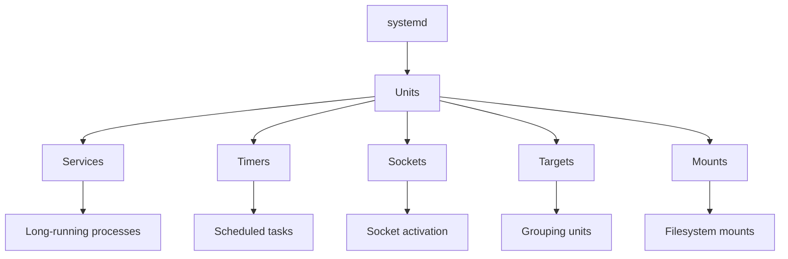
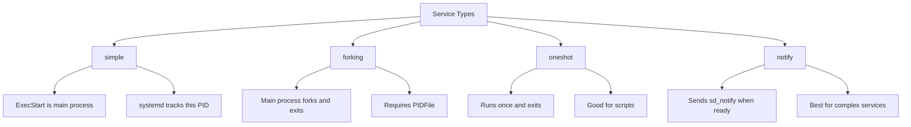
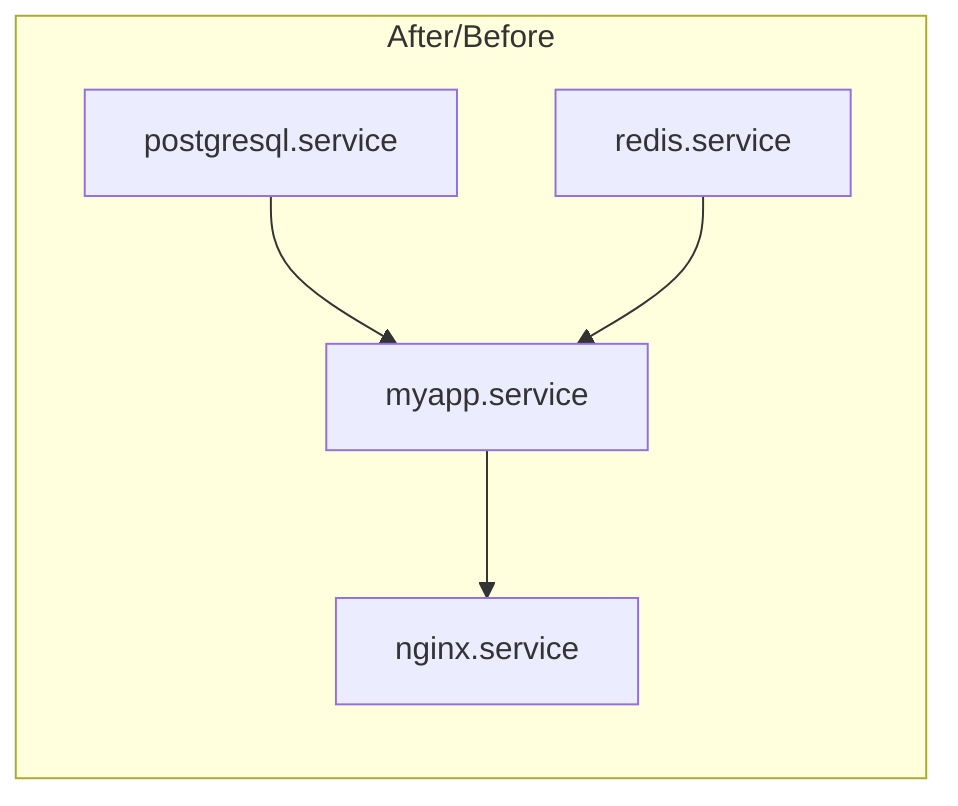

# How to Configure systemd Services in Linux

Author: [nawazdhandala](https://www.github.com/nawazdhandala)

Tags: Linux, System Administration, systemd, Services, Init System, Process Management, DevOps

Description: A comprehensive guide to creating, configuring, and managing systemd services in Linux, including unit files, dependencies, resource limits, and troubleshooting.

---

systemd is the default init system for most modern Linux distributions. Understanding how to create and manage systemd services is essential for any Linux administrator.

## Understanding systemd



### Unit Types

| Type | Extension | Purpose |
|------|-----------|---------|
| Service | .service | Manage daemons and processes |
| Timer | .timer | Schedule recurring tasks |
| Socket | .socket | Socket-based activation |
| Target | .target | Group units for synchronization |
| Mount | .mount | Filesystem mount points |
| Path | .path | File/directory monitoring |

### Unit File Locations

| Path | Purpose |
|------|---------|
| /etc/systemd/system/ | Administrator-created units (highest priority) |
| /run/systemd/system/ | Runtime units |
| /lib/systemd/system/ | Package-installed units |

## Basic Service Management

```bash
# Start a service
sudo systemctl start nginx

# Stop a service
sudo systemctl stop nginx

# Restart a service
sudo systemctl restart nginx

# Reload configuration (without restart)
sudo systemctl reload nginx

# Check status
systemctl status nginx

# Enable at boot
sudo systemctl enable nginx

# Disable at boot
sudo systemctl disable nginx

# Enable and start in one command
sudo systemctl enable --now nginx

# Check if service is enabled
systemctl is-enabled nginx

# Check if service is active
systemctl is-active nginx
```

## Creating a Service Unit File

### Basic Service Structure

```ini
# /etc/systemd/system/myapp.service

[Unit]
Description=My Application Service
Documentation=https://docs.example.com/myapp
After=network.target
Wants=network-online.target

[Service]
Type=simple
User=myapp
Group=myapp
WorkingDirectory=/opt/myapp
ExecStart=/opt/myapp/bin/myapp --config /etc/myapp/config.yaml
ExecReload=/bin/kill -HUP $MAINPID
Restart=on-failure
RestartSec=5

[Install]
WantedBy=multi-user.target
```

### Section Breakdown

#### [Unit] Section

```ini
[Unit]
# Human-readable description
Description=My Application Service

# Link to documentation
Documentation=https://docs.example.com
Documentation=man:myapp(1)

# Start after these units
After=network.target postgresql.service

# Start before these units
Before=nginx.service

# Weak dependency (start if available)
Wants=redis.service

# Strong dependency (fail if not available)
Requires=postgresql.service

# Binding dependency (stop if dependency stops)
BindsTo=docker.service

# Conflicts (stop these before starting)
Conflicts=other-app.service

# Conditions that must be met
ConditionPathExists=/etc/myapp/config.yaml
ConditionFileIsExecutable=/opt/myapp/bin/myapp
```

#### [Service] Section

```ini
[Service]
# Service types
Type=simple      # Default: ExecStart is main process
Type=forking     # Traditional daemons that fork
Type=oneshot     # Short-lived tasks
Type=notify      # Sends notification when ready
Type=dbus        # Acquires D-Bus name when ready

# Process user/group
User=myapp
Group=myapp

# Working directory
WorkingDirectory=/opt/myapp

# Environment variables
Environment=NODE_ENV=production
Environment=PORT=3000
EnvironmentFile=/etc/myapp/environment

# Commands
ExecStartPre=/opt/myapp/bin/pre-start.sh
ExecStart=/opt/myapp/bin/myapp
ExecStartPost=/opt/myapp/bin/post-start.sh
ExecReload=/bin/kill -HUP $MAINPID
ExecStop=/opt/myapp/bin/graceful-stop.sh

# Restart behavior
Restart=always           # Always restart
Restart=on-failure       # Restart on non-zero exit
Restart=on-abnormal      # Restart on signal/timeout
Restart=on-abort         # Restart on signal only
RestartSec=5             # Wait 5 seconds before restart

# Timeouts
TimeoutStartSec=30
TimeoutStopSec=30

# PID file (for forking services)
PIDFile=/run/myapp/myapp.pid
```

#### [Install] Section

```ini
[Install]
# Target to enable under
WantedBy=multi-user.target    # Standard services
WantedBy=graphical.target     # Desktop services

# Alias names
Alias=myapp.service

# Also enable these units
Also=myapp-worker.service
```

## Service Types Explained



### Type=simple (Default)

```ini
[Service]
Type=simple
ExecStart=/opt/myapp/bin/myapp
# systemd considers service started immediately
```

### Type=forking (Traditional Daemons)

```ini
[Service]
Type=forking
PIDFile=/run/myapp.pid
ExecStart=/opt/myapp/bin/myapp --daemon
# systemd waits for main process to exit and tracks forked process
```

### Type=oneshot (Scripts and One-time Tasks)

```ini
[Service]
Type=oneshot
ExecStart=/opt/myapp/bin/init-database.sh
RemainAfterExit=yes    # Consider active even after exit
# Good for initialization scripts
```

### Type=notify (Modern Services)

```ini
[Service]
Type=notify
ExecStart=/opt/myapp/bin/myapp
# Service calls sd_notify(3) when ready
# Best for services that need time to initialize
```

## Resource Limits and Security

### Resource Limits

```ini
[Service]
# Memory limits
MemoryLimit=512M
MemoryMax=1G

# CPU limits
CPUQuota=50%
CPUWeight=100

# Process limits
LimitNPROC=100
LimitNOFILE=65536

# Core dump limits
LimitCORE=infinity

# IO limits (requires cgroups v2)
IOWeight=100
IODeviceWeight=/dev/sda 200
```

### Security Hardening

```ini
[Service]
# Run as unprivileged user
User=myapp
Group=myapp
DynamicUser=yes    # Create ephemeral user

# Filesystem restrictions
ReadOnlyPaths=/
ReadWritePaths=/var/lib/myapp
TemporaryFileSystem=/tmp
PrivateTmp=yes

# Network restrictions
PrivateNetwork=yes    # No network access
RestrictAddressFamilies=AF_INET AF_INET6

# System call restrictions
SystemCallFilter=@system-service
SystemCallFilter=~@privileged

# Capability restrictions
CapabilityBoundingSet=CAP_NET_BIND_SERVICE
AmbientCapabilities=CAP_NET_BIND_SERVICE

# Other security
NoNewPrivileges=yes
ProtectSystem=strict
ProtectHome=yes
ProtectKernelTunables=yes
ProtectKernelModules=yes
ProtectControlGroups=yes
```

## Dependencies and Ordering



### Dependency Types

```ini
[Unit]
# Ordering (when to start)
After=network.target postgresql.service
Before=nginx.service

# Requirements (what must be present)
Wants=redis.service        # Weak: start if available
Requires=postgresql.service # Strong: fail if unavailable
Requisite=docker.service   # Must be running already

# Binding (lifecycle coupling)
BindsTo=docker.service     # Stop when dependency stops
PartOf=myapp.target        # Stop/restart together
```

### Creating a Target for Service Groups

```ini
# /etc/systemd/system/myapp.target
[Unit]
Description=My Application Stack
Requires=myapp-web.service myapp-worker.service
After=myapp-web.service myapp-worker.service

[Install]
WantedBy=multi-user.target
```

## Socket Activation

Socket activation allows systemd to listen on sockets and start services on demand.

### Socket Unit

```ini
# /etc/systemd/system/myapp.socket
[Unit]
Description=My Application Socket

[Socket]
ListenStream=8080
ListenStream=/run/myapp.sock
Accept=no

[Install]
WantedBy=sockets.target
```

### Corresponding Service

```ini
# /etc/systemd/system/myapp.service
[Unit]
Description=My Application
Requires=myapp.socket
After=myapp.socket

[Service]
Type=simple
ExecStart=/opt/myapp/bin/myapp
# Service receives socket from systemd
```

## Timers (Replacement for Cron)

### Timer Unit

```ini
# /etc/systemd/system/backup.timer
[Unit]
Description=Daily backup timer

[Timer]
OnCalendar=daily
# Or specific time: OnCalendar=*-*-* 02:00:00
# Or interval: OnBootSec=5min
#              OnUnitActiveSec=1h
Persistent=true    # Run if missed

[Install]
WantedBy=timers.target
```

### Service for Timer

```ini
# /etc/systemd/system/backup.service
[Unit]
Description=Backup service

[Service]
Type=oneshot
ExecStart=/opt/scripts/backup.sh
```

### Timer Management

```bash
# List timers
systemctl list-timers

# Enable timer
sudo systemctl enable --now backup.timer

# Check next run time
systemctl status backup.timer
```

## Practical Examples

### Node.js Application

```ini
# /etc/systemd/system/nodeapp.service
[Unit]
Description=Node.js Application
After=network.target

[Service]
Type=simple
User=nodeapp
WorkingDirectory=/opt/nodeapp
ExecStart=/usr/bin/node /opt/nodeapp/server.js
Restart=on-failure
RestartSec=10

# Environment
Environment=NODE_ENV=production
Environment=PORT=3000
EnvironmentFile=-/opt/nodeapp/.env

# Logging
StandardOutput=journal
StandardError=journal
SyslogIdentifier=nodeapp

# Hardening
NoNewPrivileges=yes
ProtectSystem=full
ProtectHome=yes
PrivateTmp=yes

[Install]
WantedBy=multi-user.target
```

### Python Application with Virtual Environment

```ini
# /etc/systemd/system/pythonapp.service
[Unit]
Description=Python Application
After=network.target

[Service]
Type=simple
User=pythonapp
Group=pythonapp
WorkingDirectory=/opt/pythonapp
ExecStart=/opt/pythonapp/venv/bin/python /opt/pythonapp/app.py
Restart=always
RestartSec=5

# Environment
Environment=PYTHONUNBUFFERED=1
EnvironmentFile=/opt/pythonapp/.env

# Limits
LimitNOFILE=65536
MemoryMax=1G

[Install]
WantedBy=multi-user.target
```

### Java Application

```ini
# /etc/systemd/system/javaapp.service
[Unit]
Description=Java Application
After=network.target

[Service]
Type=simple
User=javaapp
WorkingDirectory=/opt/javaapp

ExecStart=/usr/bin/java \
    -Xms512m \
    -Xmx2g \
    -XX:+UseG1GC \
    -jar /opt/javaapp/app.jar

Restart=on-failure
RestartSec=10

# Proper shutdown
ExecStop=/bin/kill -TERM $MAINPID
TimeoutStopSec=30
KillMode=mixed
KillSignal=SIGTERM

# Environment
Environment=JAVA_HOME=/usr/lib/jvm/java-17-openjdk
EnvironmentFile=/opt/javaapp/config.env

[Install]
WantedBy=multi-user.target
```

### Service with Pre/Post Commands

```ini
# /etc/systemd/system/webapp.service
[Unit]
Description=Web Application with Database Migration
After=postgresql.service
Requires=postgresql.service

[Service]
Type=oneshot
RemainAfterExit=yes
User=webapp

# Run migrations before starting
ExecStartPre=/opt/webapp/bin/check-config.sh
ExecStartPre=/opt/webapp/bin/migrate-db.sh

# Main start command
ExecStart=/opt/webapp/bin/start.sh

# Health check after start
ExecStartPost=/opt/webapp/bin/health-check.sh

# Cleanup on stop
ExecStop=/opt/webapp/bin/stop.sh
ExecStopPost=/opt/webapp/bin/cleanup.sh

[Install]
WantedBy=multi-user.target
```

## Troubleshooting

### View Service Logs

```bash
# View logs for a service
journalctl -u myapp.service

# Follow logs in real-time
journalctl -u myapp.service -f

# View logs since last boot
journalctl -u myapp.service -b

# View logs with timestamps
journalctl -u myapp.service --since "1 hour ago"

# View logs for multiple services
journalctl -u myapp.service -u nginx.service
```

### Debug Service Issues

```bash
# Check service status and recent logs
systemctl status myapp.service

# Verify unit file syntax
systemd-analyze verify /etc/systemd/system/myapp.service

# Check dependency order
systemd-analyze critical-chain myapp.service

# List all units and their states
systemctl list-units --type=service --all

# Show unit file contents
systemctl cat myapp.service

# Show all properties
systemctl show myapp.service

# Check for failed units
systemctl --failed
```

### Common Issues and Solutions

#### Service Fails to Start

```bash
# Check detailed status
systemctl status myapp.service -l

# Check full logs
journalctl -u myapp.service -n 100 --no-pager

# Try running command manually as service user
sudo -u myapp /opt/myapp/bin/myapp
```

#### Service Keeps Restarting

```bash
# Check exit code
systemctl show myapp.service -p ExecMainStatus

# Temporarily disable restart to debug
# Add to [Service]: Restart=no
sudo systemctl daemon-reload
sudo systemctl restart myapp.service
```

#### Permission Issues

```bash
# Check file ownership
ls -la /opt/myapp/

# Check SELinux context (RHEL/CentOS)
ls -Z /opt/myapp/

# Fix SELinux context
sudo restorecon -Rv /opt/myapp/
```

### Reload After Changes

```bash
# After modifying unit files
sudo systemctl daemon-reload

# Then restart the service
sudo systemctl restart myapp.service
```

## Management Commands Reference

```bash
# Unit management
systemctl start|stop|restart|reload unit
systemctl enable|disable unit
systemctl mask|unmask unit      # Completely disable/enable
systemctl status unit
systemctl is-active|is-enabled|is-failed unit

# Logs
journalctl -u unit              # View logs
journalctl -u unit -f           # Follow logs
journalctl -u unit --since today

# System
systemctl daemon-reload         # Reload unit files
systemctl list-units            # List all units
systemctl list-unit-files       # List unit files
systemctl list-dependencies     # Show dependencies

# Analysis
systemd-analyze                 # Boot time
systemd-analyze blame           # Slow units
systemd-analyze critical-chain  # Critical path
systemd-analyze verify file     # Syntax check
```

---

Creating reliable systemd services involves understanding unit file structure, proper dependency management, and appropriate security hardening. Start with a basic service, test it thoroughly, then add resource limits and security restrictions. Use `journalctl` for debugging and `systemd-analyze verify` to catch configuration errors before deployment.
