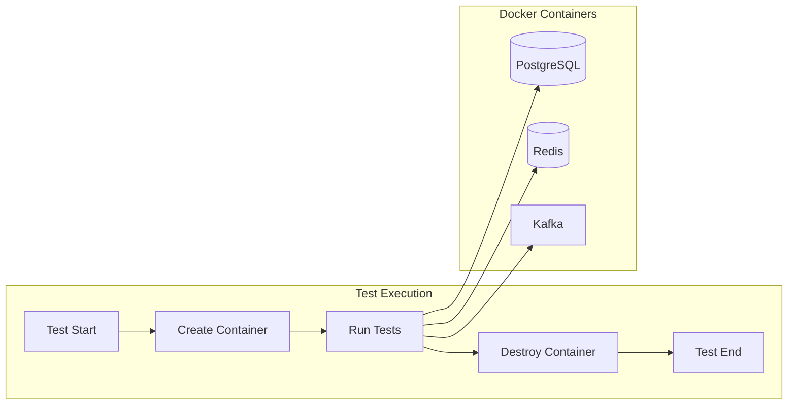

# How to Configure TestContainers

Author: [nawazdhandala](https://www.github.com/nawazdhandala)

Tags: Testing, TestContainers, Docker, Integration Tests, Databases, Java, Python, Node.js

Description: Learn how to use TestContainers to run real databases, message queues, and other services in Docker containers during integration tests.

---

Mocking databases is painful and often misses real issues. TestContainers solves this by spinning up real databases, message queues, and other services in Docker containers for your tests. Your tests run against actual PostgreSQL, Redis, Kafka, or whatever else you need.

## What is TestContainers?

TestContainers is a library that manages Docker containers during test execution. It starts containers before your tests run and tears them down afterward, giving you isolated, reproducible test environments.



## Java/Kotlin Setup

TestContainers originated in the Java ecosystem and has the most mature support there.

### Basic Configuration

```java
// build.gradle
dependencies {
    testImplementation 'org.testcontainers:testcontainers:1.19.3'
    testImplementation 'org.testcontainers:junit-jupiter:1.19.3'
    testImplementation 'org.testcontainers:postgresql:1.19.3'
}
```

```java
// src/test/java/com/example/PostgresTest.java
import org.junit.jupiter.api.Test;
import org.testcontainers.containers.PostgreSQLContainer;
import org.testcontainers.junit.jupiter.Container;
import org.testcontainers.junit.jupiter.Testcontainers;

import java.sql.Connection;
import java.sql.DriverManager;
import java.sql.ResultSet;

@Testcontainers
class PostgresTest {

    // Container is shared across all tests in this class
    @Container
    static PostgreSQLContainer<?> postgres = new PostgreSQLContainer<>("postgres:15")
        .withDatabaseName("testdb")
        .withUsername("test")
        .withPassword("test")
        .withInitScript("schema.sql");  // Run init script

    @Test
    void testDatabaseConnection() throws Exception {
        String jdbcUrl = postgres.getJdbcUrl();
        String username = postgres.getUsername();
        String password = postgres.getPassword();

        try (Connection conn = DriverManager.getConnection(jdbcUrl, username, password)) {
            ResultSet rs = conn.createStatement().executeQuery("SELECT 1");
            rs.next();
            assertEquals(1, rs.getInt(1));
        }
    }

    @Test
    void testInsertAndRetrieve() throws Exception {
        try (Connection conn = DriverManager.getConnection(
                postgres.getJdbcUrl(),
                postgres.getUsername(),
                postgres.getPassword())) {

            conn.createStatement().execute(
                "INSERT INTO users (name, email) VALUES ('John', 'john@example.com')"
            );

            ResultSet rs = conn.createStatement().executeQuery(
                "SELECT name FROM users WHERE email = 'john@example.com'"
            );
            rs.next();
            assertEquals("John", rs.getString("name"));
        }
    }
}
```

### Spring Boot Integration

```java
// src/test/java/com/example/SpringPostgresTest.java
import org.springframework.boot.test.context.SpringBootTest;
import org.springframework.test.context.DynamicPropertyRegistry;
import org.springframework.test.context.DynamicPropertySource;
import org.testcontainers.containers.PostgreSQLContainer;
import org.testcontainers.junit.jupiter.Container;
import org.testcontainers.junit.jupiter.Testcontainers;

@SpringBootTest
@Testcontainers
class SpringPostgresTest {

    @Container
    static PostgreSQLContainer<?> postgres = new PostgreSQLContainer<>("postgres:15");

    // Dynamically configure Spring to use the container
    @DynamicPropertySource
    static void configureProperties(DynamicPropertyRegistry registry) {
        registry.add("spring.datasource.url", postgres::getJdbcUrl);
        registry.add("spring.datasource.username", postgres::getUsername);
        registry.add("spring.datasource.password", postgres::getPassword);
    }

    @Autowired
    private UserRepository userRepository;

    @Test
    void testRepository() {
        User user = new User("John", "john@example.com");
        userRepository.save(user);

        User found = userRepository.findByEmail("john@example.com");
        assertNotNull(found);
        assertEquals("John", found.getName());
    }
}
```

## Python Setup

```python
# requirements-test.txt
testcontainers[postgres,redis,kafka]==3.7.1
pytest==7.4.0
psycopg2-binary==2.9.9
```

### PostgreSQL Container

```python
# tests/conftest.py
import pytest
from testcontainers.postgres import PostgresContainer
from testcontainers.redis import RedisContainer
import psycopg2

@pytest.fixture(scope="session")
def postgres_container():
    """Spin up PostgreSQL for the entire test session"""
    with PostgresContainer("postgres:15") as postgres:
        # Run migrations or init scripts
        conn = psycopg2.connect(
            host=postgres.get_container_host_ip(),
            port=postgres.get_exposed_port(5432),
            user=postgres.POSTGRES_USER,
            password=postgres.POSTGRES_PASSWORD,
            database=postgres.POSTGRES_DB
        )
        with conn.cursor() as cur:
            cur.execute("""
                CREATE TABLE IF NOT EXISTS users (
                    id SERIAL PRIMARY KEY,
                    name VARCHAR(100),
                    email VARCHAR(100) UNIQUE
                )
            """)
        conn.commit()
        conn.close()

        yield postgres

@pytest.fixture
def db_connection(postgres_container):
    """Create a new connection for each test"""
    conn = psycopg2.connect(
        host=postgres_container.get_container_host_ip(),
        port=postgres_container.get_exposed_port(5432),
        user=postgres_container.POSTGRES_USER,
        password=postgres_container.POSTGRES_PASSWORD,
        database=postgres_container.POSTGRES_DB
    )
    yield conn
    conn.rollback()  # Clean up after each test
    conn.close()

# tests/test_database.py
def test_insert_user(db_connection):
    with db_connection.cursor() as cur:
        cur.execute(
            "INSERT INTO users (name, email) VALUES (%s, %s) RETURNING id",
            ("John", "john@example.com")
        )
        user_id = cur.fetchone()[0]
        assert user_id is not None

def test_query_user(db_connection):
    with db_connection.cursor() as cur:
        cur.execute("INSERT INTO users (name, email) VALUES (%s, %s)",
                   ("Jane", "jane@example.com"))
        db_connection.commit()

        cur.execute("SELECT name FROM users WHERE email = %s", ("jane@example.com",))
        result = cur.fetchone()
        assert result[0] == "Jane"
```

### Redis Container

```python
# tests/test_redis.py
import pytest
from testcontainers.redis import RedisContainer
import redis

@pytest.fixture(scope="module")
def redis_container():
    with RedisContainer("redis:7") as container:
        yield container

@pytest.fixture
def redis_client(redis_container):
    client = redis.Redis(
        host=redis_container.get_container_host_ip(),
        port=redis_container.get_exposed_port(6379),
        decode_responses=True
    )
    yield client
    client.flushall()  # Clean up

def test_cache_operations(redis_client):
    redis_client.set("key", "value", ex=60)
    assert redis_client.get("key") == "value"

    redis_client.delete("key")
    assert redis_client.get("key") is None

def test_hash_operations(redis_client):
    redis_client.hset("user:1", mapping={
        "name": "John",
        "email": "john@example.com"
    })

    user = redis_client.hgetall("user:1")
    assert user["name"] == "John"
```

## Node.js/TypeScript Setup

```json
// package.json
{
  "devDependencies": {
    "testcontainers": "^10.4.0",
    "@types/node": "^20.0.0",
    "jest": "^29.7.0"
  }
}
```

### Basic Usage

```typescript
// tests/postgres.test.ts
import { PostgreSqlContainer, StartedPostgreSqlContainer } from 'testcontainers';
import { Client } from 'pg';

describe('PostgreSQL Tests', () => {
  let container: StartedPostgreSqlContainer;
  let client: Client;

  beforeAll(async () => {
    // Start container - this takes a few seconds
    container = await new PostgreSqlContainer('postgres:15')
      .withDatabase('testdb')
      .withUsername('test')
      .withPassword('test')
      .start();

    // Connect to the database
    client = new Client({
      host: container.getHost(),
      port: container.getPort(),
      database: container.getDatabase(),
      user: container.getUsername(),
      password: container.getPassword(),
    });
    await client.connect();

    // Run migrations
    await client.query(`
      CREATE TABLE IF NOT EXISTS users (
        id SERIAL PRIMARY KEY,
        name VARCHAR(100),
        email VARCHAR(100) UNIQUE
      )
    `);
  }, 60000);  // Increase timeout for container startup

  afterAll(async () => {
    await client.end();
    await container.stop();
  });

  afterEach(async () => {
    // Clean up between tests
    await client.query('DELETE FROM users');
  });

  it('should insert and retrieve a user', async () => {
    await client.query(
      'INSERT INTO users (name, email) VALUES ($1, $2)',
      ['John', 'john@example.com']
    );

    const result = await client.query(
      'SELECT name FROM users WHERE email = $1',
      ['john@example.com']
    );

    expect(result.rows[0].name).toBe('John');
  });
});
```

### Multiple Containers

```typescript
// tests/integration.test.ts
import { PostgreSqlContainer, GenericContainer, Wait } from 'testcontainers';

describe('Integration Tests', () => {
  let postgres: StartedPostgreSqlContainer;
  let redis: StartedGenericContainer;

  beforeAll(async () => {
    // Start containers in parallel for faster setup
    const [pgContainer, redisContainer] = await Promise.all([
      new PostgreSqlContainer('postgres:15').start(),
      new GenericContainer('redis:7')
        .withExposedPorts(6379)
        .withWaitStrategy(Wait.forLogMessage('Ready to accept connections'))
        .start()
    ]);

    postgres = pgContainer;
    redis = redisContainer;
  }, 120000);

  afterAll(async () => {
    await Promise.all([
      postgres.stop(),
      redis.stop()
    ]);
  });

  it('should use both services', async () => {
    // Use postgres
    const pgClient = new Client({
      host: postgres.getHost(),
      port: postgres.getPort(),
      database: postgres.getDatabase(),
      user: postgres.getUsername(),
      password: postgres.getPassword(),
    });
    await pgClient.connect();

    // Use redis
    const redisClient = createClient({
      url: `redis://${redis.getHost()}:${redis.getMappedPort(6379)}`
    });
    await redisClient.connect();

    // Your test logic here
    await pgClient.end();
    await redisClient.quit();
  });
});
```

## Advanced Configuration

### Custom Container Images

```java
// Java - Using custom image with pre-loaded data
@Container
static GenericContainer<?> customDb = new GenericContainer<>("my-registry/custom-postgres:latest")
    .withExposedPorts(5432)
    .withEnv("POSTGRES_PASSWORD", "secret")
    .waitingFor(Wait.forLogMessage(".*database system is ready.*", 1));
```

### Container Networks

```python
# Python - Containers that communicate with each other
from testcontainers.core.container import DockerContainer
from testcontainers.core.network import Network

@pytest.fixture(scope="session")
def container_network():
    with Network() as network:
        # API container
        api = DockerContainer("my-api:latest")
        api.with_network(network)
        api.with_network_aliases("api")

        # Database container
        db = PostgresContainer("postgres:15")
        db.with_network(network)
        db.with_network_aliases("db")

        with api, db:
            yield {"api": api, "db": db, "network": network}
```

### Wait Strategies

```typescript
// TypeScript - Custom wait strategies
const container = await new GenericContainer('my-service:latest')
  .withExposedPorts(8080)
  .withWaitStrategy(
    Wait.forAll([
      Wait.forListeningPorts(),
      Wait.forHttp('/health', 8080).forStatusCode(200),
      Wait.forLogMessage('Server started')
    ])
  )
  .withStartupTimeout(60000)
  .start();
```

### Reusable Containers (Development Mode)

```java
// Java - Keep containers running between test runs for faster development
@Container
static PostgreSQLContainer<?> postgres = new PostgreSQLContainer<>("postgres:15")
    .withReuse(true);  // Container survives test restarts
```

```properties
# ~/.testcontainers.properties
testcontainers.reuse.enable=true
```

## CI/CD Configuration

### GitHub Actions

```yaml
# .github/workflows/test.yml
name: Tests

on: [push, pull_request]

jobs:
  test:
    runs-on: ubuntu-latest

    steps:
      - uses: actions/checkout@v4

      - name: Set up JDK
        uses: actions/setup-java@v4
        with:
          java-version: '17'
          distribution: 'temurin'

      - name: Run tests
        run: ./gradlew test
        env:
          TESTCONTAINERS_RYUK_DISABLED: true  # Faster in CI
```

### GitLab CI

```yaml
# .gitlab-ci.yml
test:
  image: docker:24-dind
  services:
    - docker:24-dind
  variables:
    DOCKER_HOST: tcp://docker:2375
    DOCKER_TLS_CERTDIR: ""
    TESTCONTAINERS_HOST_OVERRIDE: docker
  script:
    - ./gradlew test
```

## Best Practices

1. **Use session-scoped fixtures** for expensive containers to share across tests
2. **Clean data between tests** rather than recreating containers
3. **Run containers in parallel** when they do not depend on each other
4. **Use specific image tags** instead of `latest` for reproducibility
5. **Configure adequate timeouts** for container startup in CI environments
6. **Use reusable containers** during local development for faster feedback

---

TestContainers eliminates the gap between unit tests with mocks and production environments. Your tests run against real databases, and you catch issues that mocks would never reveal. The setup cost is worth it for the confidence you gain.
