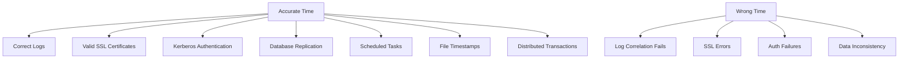
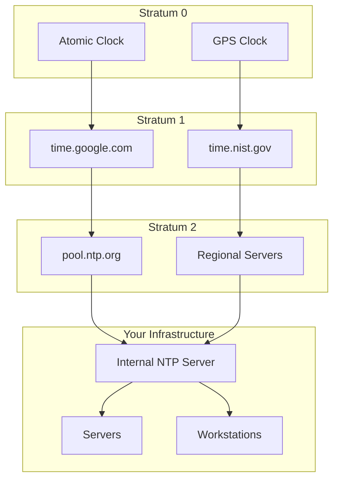
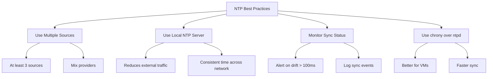

# How to Configure Time Synchronization with NTP

Author: [nawazdhandala](https://www.github.com/nawazdhandala)

Tags: Linux, NTP, Time Synchronization, chrony, systemd-timesyncd, System Administration

Description: Learn how to configure accurate time synchronization on Linux servers using NTP, chrony, and systemd-timesyncd for reliable distributed systems.

---

Accurate time synchronization is critical for distributed systems, logging, authentication, and scheduled tasks. This guide covers configuring NTP time synchronization using different tools available on Linux systems.

## Why Time Synchronization Matters



Even a few seconds of time drift can cause:
- Failed SSL/TLS certificate validation
- Kerberos authentication failures
- Incorrect log timestamps making debugging difficult
- Database replication issues
- Cron jobs running at wrong times

## Check Current Time Configuration

### View Current Time and Status

```bash
# Show current date and time
date

# Show detailed time information
timedatectl

# Example output:
#                Local time: Fri 2026-01-24 10:15:30 UTC
#            Universal time: Fri 2026-01-24 10:15:30 UTC
#                  RTC time: Fri 2026-01-24 10:15:30
#                 Time zone: UTC (UTC, +0000)
# System clock synchronized: yes
#               NTP service: active
#           RTC in local TZ: no
```

### Check Time Service Status

```bash
# Check if chronyd is running
systemctl status chronyd

# Check if systemd-timesyncd is running
systemctl status systemd-timesyncd

# Check if ntpd is running
systemctl status ntpd
```

## Method 1: Using chrony (Recommended)

chrony is the modern NTP implementation, faster and more accurate than traditional ntpd, especially for systems that are frequently suspended or have intermittent network connectivity.

### Install chrony

```bash
# Debian/Ubuntu
sudo apt update
sudo apt install chrony

# RHEL/CentOS/Rocky
sudo dnf install chrony

# Arch Linux
sudo pacman -S chrony
```

### Configure chrony

```bash
# Edit configuration file
sudo nano /etc/chrony/chrony.conf   # Debian/Ubuntu
sudo nano /etc/chrony.conf          # RHEL/CentOS
```

Basic configuration:

```ini
# /etc/chrony/chrony.conf

# Use public NTP servers
pool pool.ntp.org iburst
pool time.google.com iburst
pool time.cloudflare.com iburst

# Allow NTP client access from local network
# allow 192.168.0.0/16

# Serve time even if not synchronized
# local stratum 10

# Record rate at which system clock gains/loses time
driftfile /var/lib/chrony/drift

# Enable kernel RTC synchronization
rtcsync

# Log files location
logdir /var/log/chrony

# Step clock if offset is larger than 1 second
makestep 1.0 3

# Enable hardware timestamping if supported
# hwtimestamp *
```

### Start and Enable chrony

```bash
# Start the service
sudo systemctl start chronyd

# Enable on boot
sudo systemctl enable chronyd

# Check status
sudo systemctl status chronyd
```

### Verify chrony Synchronization

```bash
# Check current synchronization status
chronyc tracking

# Example output:
# Reference ID    : A29FC801 (time.google.com)
# Stratum         : 2
# Ref time (UTC)  : Fri Jan 24 10:15:30 2026
# System time     : 0.000001234 seconds fast of NTP time
# Last offset     : +0.000000123 seconds
# RMS offset      : 0.000000456 seconds
# Frequency       : 1.234 ppm slow
# Residual freq   : +0.000 ppm
# Skew            : 0.012 ppm
# Root delay      : 0.012345678 seconds
# Root dispersion : 0.000123456 seconds
# Update interval : 64.0 seconds
# Leap status     : Normal

# Check NTP sources
chronyc sources -v

# Check source statistics
chronyc sourcestats

# Force immediate sync
sudo chronyc -a makestep
```

## Method 2: Using systemd-timesyncd

systemd-timesyncd is a lightweight SNTP client built into systemd. It is simpler than chrony but sufficient for most workstations.

### Check if timesyncd is Available

```bash
# Check if systemd-timesyncd is installed
systemctl list-unit-files | grep timesyncd
```

### Configure systemd-timesyncd

```bash
# Edit configuration
sudo nano /etc/systemd/timesyncd.conf
```

```ini
# /etc/systemd/timesyncd.conf
[Time]
NTP=pool.ntp.org time.google.com time.cloudflare.com
FallbackNTP=0.pool.ntp.org 1.pool.ntp.org 2.pool.ntp.org
RootDistanceMaxSec=5
PollIntervalMinSec=32
PollIntervalMaxSec=2048
```

### Enable and Start timesyncd

```bash
# Disable other NTP services first
sudo systemctl stop chronyd
sudo systemctl disable chronyd

# Enable timesyncd
sudo systemctl enable systemd-timesyncd
sudo systemctl start systemd-timesyncd

# Check status
timedatectl timesync-status
```

### Verify timesyncd Synchronization

```bash
# Check synchronization status
timedatectl show-timesync --all

# Or use timedatectl
timedatectl status
```

## Method 3: Using Traditional ntpd

The classic ntpd is still used on some systems, especially older ones.

### Install ntpd

```bash
# Debian/Ubuntu
sudo apt install ntp

# RHEL/CentOS (older versions)
sudo yum install ntp
```

### Configure ntpd

```bash
# Edit configuration
sudo nano /etc/ntp.conf
```

```ini
# /etc/ntp.conf

# Drift file location
driftfile /var/lib/ntp/drift

# Use public NTP servers
server 0.pool.ntp.org iburst
server 1.pool.ntp.org iburst
server 2.pool.ntp.org iburst
server 3.pool.ntp.org iburst

# Restrict default access
restrict default kod nomodify notrap nopeer noquery
restrict -6 default kod nomodify notrap nopeer noquery

# Allow localhost
restrict 127.0.0.1
restrict ::1

# Allow local network (adjust as needed)
# restrict 192.168.0.0 mask 255.255.0.0 nomodify notrap
```

### Start ntpd

```bash
# Start and enable
sudo systemctl start ntpd
sudo systemctl enable ntpd

# Check status
ntpq -p
```

## NTP Architecture Overview



## Setting Up an Internal NTP Server

For larger networks, set up an internal NTP server to reduce external traffic and ensure consistent time.

### Configure chrony as NTP Server

```ini
# /etc/chrony/chrony.conf on the NTP server

# Upstream NTP sources
pool pool.ntp.org iburst maxsources 4
pool time.google.com iburst maxsources 2

# Allow clients from your network
allow 192.168.0.0/16
allow 10.0.0.0/8

# Serve time even when not synchronized (for isolated networks)
local stratum 10

# Drift file
driftfile /var/lib/chrony/drift

# RTC sync
rtcsync

# Make stepping adjustments
makestep 1.0 3

# Enable logging
logdir /var/log/chrony
log measurements statistics tracking
```

### Configure Clients to Use Internal Server

```ini
# /etc/chrony/chrony.conf on clients

# Use internal NTP server as primary
server ntp.internal.example.com iburst prefer

# Fallback to public servers
pool pool.ntp.org iburst

# Drift file
driftfile /var/lib/chrony/drift

# RTC sync
rtcsync

# Quick step at startup
makestep 1.0 3
```

## Time Zone Configuration

### Set Time Zone

```bash
# List available time zones
timedatectl list-timezones

# Search for specific timezone
timedatectl list-timezones | grep -i america

# Set timezone
sudo timedatectl set-timezone America/New_York

# Or use UTC for servers (recommended)
sudo timedatectl set-timezone UTC

# Verify
timedatectl
```

### Configure Timezone Non-Interactively

```bash
# Link timezone file
sudo ln -sf /usr/share/zoneinfo/UTC /etc/localtime

# Update timezone info
echo "UTC" | sudo tee /etc/timezone
```

## Hardware Clock (RTC) Configuration

```bash
# Check if RTC is in UTC or local time
timedatectl | grep "RTC in local TZ"

# Set RTC to UTC (recommended)
sudo timedatectl set-local-rtc 0

# Sync system time to hardware clock
sudo hwclock --systohc

# Read hardware clock
sudo hwclock --show

# Manually set hardware clock from system time
sudo hwclock --systohc --utc
```

## Troubleshooting Time Sync Issues

### chrony Not Synchronizing

```bash
# Check chrony sources
chronyc sources -v

# Force resync
sudo chronyc -a makestep

# Check firewall (NTP uses UDP port 123)
sudo firewall-cmd --list-all
sudo firewall-cmd --add-service=ntp --permanent
sudo firewall-cmd --reload

# Or with iptables
sudo iptables -A INPUT -p udp --dport 123 -j ACCEPT
sudo iptables -A OUTPUT -p udp --dport 123 -j ACCEPT
```

### Check NTP Connectivity

```bash
# Test NTP server connectivity
chronyd -Q 'server pool.ntp.org iburst'

# Or use ntpdate (if installed)
ntpdate -q pool.ntp.org

# Check if port 123 is reachable
nc -zuv pool.ntp.org 123
```

### Large Time Offset

```bash
# If time is way off, manually step the clock
sudo chronyc -a makestep

# Or stop chrony and set time manually
sudo systemctl stop chronyd
sudo date -s "2026-01-24 10:15:30"
sudo systemctl start chronyd
```

### Time Drift Debugging

```bash
# Check drift rate
chronyc tracking | grep Frequency

# View drift file
cat /var/lib/chrony/drift

# Monitor time offset over time
watch -n 10 'chronyc tracking | grep "System time"'
```

## Security Considerations

### NTP Authentication

```bash
# Generate NTP key
sudo sh -c 'echo "1 SHA1 $(openssl rand -hex 20)" >> /etc/chrony/chrony.keys'

# Set permissions
sudo chmod 640 /etc/chrony/chrony.keys
sudo chown root:chrony /etc/chrony/chrony.keys
```

Configure authenticated server in chrony.conf:

```ini
# /etc/chrony/chrony.conf

# Load key file
keyfile /etc/chrony/chrony.keys

# Use authenticated server
server ntp.internal.example.com iburst key 1
```

### Firewall Configuration

```bash
# Allow NTP through firewall (server only)
# For firewalld
sudo firewall-cmd --permanent --add-service=ntp
sudo firewall-cmd --reload

# For UFW
sudo ufw allow 123/udp

# For iptables
sudo iptables -A INPUT -p udp --dport 123 -j ACCEPT
```

## Monitoring NTP with Prometheus

```yaml
# chrony_exporter configuration
# Expose chrony metrics for Prometheus

scrape_configs:
  - job_name: 'chrony'
    static_configs:
      - targets: ['localhost:9123']
```

### Useful Prometheus Queries

```promql
# Time offset from NTP
chrony_tracking_system_time_offset_seconds

# Root delay
chrony_tracking_root_delay_seconds

# Stratum
chrony_tracking_stratum

# Alert on large time drift
- alert: TimeDriftHigh
  expr: abs(chrony_tracking_system_time_offset_seconds) > 0.1
  for: 5m
  labels:
    severity: warning
  annotations:
    summary: "Time drift detected on {{ $labels.instance }}"
```

## NTP Best Practices



## Quick Reference

```bash
# Check current time and sync status
timedatectl

# Set timezone
sudo timedatectl set-timezone UTC

# chrony commands
chronyc tracking           # Show sync status
chronyc sources -v         # Show NTP sources
chronyc sourcestats        # Show source statistics
sudo chronyc -a makestep   # Force time step

# timesyncd commands
timedatectl timesync-status
systemctl status systemd-timesyncd

# ntpd commands
ntpq -p                    # Show peers
ntpstat                    # Show sync status

# Manual time setting
sudo date -s "2026-01-24 10:15:30"
sudo hwclock --systohc     # Sync RTC

# Test NTP server
chronyd -Q 'server pool.ntp.org iburst'
```

## Configuration Comparison

| Feature | chrony | systemd-timesyncd | ntpd |
|---------|--------|-------------------|------|
| Accuracy | High | Medium | High |
| Resource Usage | Low | Very Low | Medium |
| VM Support | Excellent | Good | Fair |
| Server Mode | Yes | No | Yes |
| Authentication | Yes | No | Yes |
| Recommended For | Servers | Desktops | Legacy |

---

Accurate time synchronization is fundamental for modern infrastructure. chrony is the recommended choice for most Linux systems due to its accuracy, efficiency, and excellent handling of virtual machines and network interruptions. For simpler desktop systems, systemd-timesyncd provides adequate synchronization with minimal configuration. Whichever tool you choose, ensure your systems are synchronized and monitor for drift to prevent subtle but serious issues.
