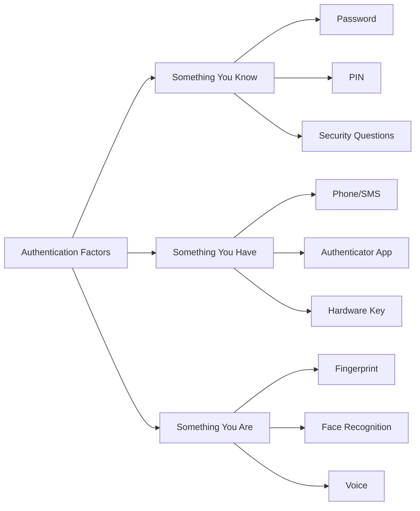
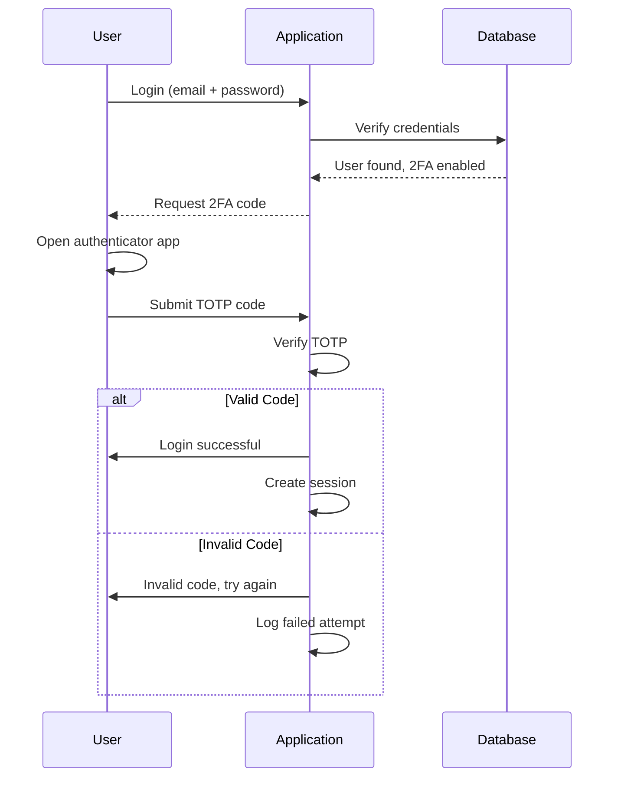
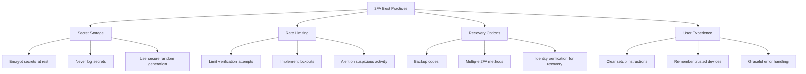

# How to Configure Two-Factor Authentication

Author: [nawazdhandala](https://www.github.com/nawazdhandala)

Tags: Security, Authentication, 2FA, MFA, TOTP, WebAuthn, Identity

Description: Learn how to implement two-factor authentication in your applications using TOTP, SMS, and WebAuthn for enhanced security.

---

Two-factor authentication (2FA) adds a critical layer of security by requiring users to prove their identity with something they know (password) and something they have (phone, security key). This guide covers implementing 2FA in your applications using industry-standard methods.

---

## Authentication Factors



---

## TOTP Implementation (Time-based One-Time Password)

TOTP is the most common 2FA method, used by Google Authenticator, Authy, and similar apps.

### Python Implementation

```python
import pyotp
import qrcode
import io
import base64
from datetime import datetime

class TOTPManager:
    """Manage TOTP-based two-factor authentication"""

    def __init__(self, issuer_name="MyApp"):
        self.issuer = issuer_name

    def generate_secret(self):
        """Generate a new TOTP secret for a user"""
        # Returns a 32-character base32 secret
        return pyotp.random_base32()

    def get_provisioning_uri(self, secret, user_email):
        """Generate URI for QR code"""
        totp = pyotp.TOTP(secret)
        return totp.provisioning_uri(
            name=user_email,
            issuer_name=self.issuer
        )

    def generate_qr_code(self, secret, user_email):
        """Generate QR code image as base64 string"""
        uri = self.get_provisioning_uri(secret, user_email)

        # Create QR code
        qr = qrcode.QRCode(version=1, box_size=10, border=5)
        qr.add_data(uri)
        qr.make(fit=True)

        # Convert to image
        img = qr.make_image(fill_color="black", back_color="white")

        # Convert to base64 for embedding in HTML
        buffer = io.BytesIO()
        img.save(buffer, format='PNG')
        return base64.b64encode(buffer.getvalue()).decode()

    def verify_token(self, secret, token, valid_window=1):
        """Verify a TOTP token"""
        totp = pyotp.TOTP(secret)
        # valid_window allows for clock drift (1 = +/- 30 seconds)
        return totp.verify(token, valid_window=valid_window)

    def get_current_token(self, secret):
        """Get current valid token (for testing only)"""
        totp = pyotp.TOTP(secret)
        return totp.now()


# Usage in Flask application
from flask import Flask, request, jsonify, session
from models import User

app = Flask(__name__)
totp_manager = TOTPManager(issuer_name="MySecureApp")

@app.route('/api/2fa/setup', methods=['POST'])
def setup_2fa():
    user_id = session.get('user_id')
    user = User.query.get(user_id)

    # Generate new secret
    secret = totp_manager.generate_secret()

    # Store secret temporarily (not yet confirmed)
    user.pending_totp_secret = secret
    user.save()

    # Generate QR code
    qr_base64 = totp_manager.generate_qr_code(secret, user.email)

    return jsonify({
        'qr_code': f'data:image/png;base64,{qr_base64}',
        'manual_key': secret,  # For manual entry
        'message': 'Scan QR code with your authenticator app'
    })

@app.route('/api/2fa/verify-setup', methods=['POST'])
def verify_2fa_setup():
    user_id = session.get('user_id')
    user = User.query.get(user_id)
    token = request.json.get('token')

    # Verify the token before enabling 2FA
    if totp_manager.verify_token(user.pending_totp_secret, token):
        user.totp_secret = user.pending_totp_secret
        user.pending_totp_secret = None
        user.two_factor_enabled = True
        user.save()

        # Generate backup codes
        backup_codes = generate_backup_codes(user)

        return jsonify({
            'success': True,
            'backup_codes': backup_codes,
            'message': 'Two-factor authentication enabled'
        })

    return jsonify({'success': False, 'error': 'Invalid token'}), 400
```

---

### Node.js Implementation

```javascript
const speakeasy = require('speakeasy');
const QRCode = require('qrcode');

class TOTPManager {
    constructor(issuer = 'MyApp') {
        this.issuer = issuer;
    }

    // Generate a new secret for a user
    generateSecret(userEmail) {
        const secret = speakeasy.generateSecret({
            name: `${this.issuer}:${userEmail}`,
            issuer: this.issuer,
            length: 32
        });

        return {
            base32: secret.base32,
            otpauthUrl: secret.otpauth_url
        };
    }

    // Generate QR code as data URL
    async generateQRCode(otpauthUrl) {
        try {
            return await QRCode.toDataURL(otpauthUrl);
        } catch (error) {
            throw new Error('Failed to generate QR code');
        }
    }

    // Verify a token
    verifyToken(secret, token) {
        return speakeasy.totp.verify({
            secret: secret,
            encoding: 'base32',
            token: token,
            window: 1  // Allow 30 second drift
        });
    }
}

// Express routes
const express = require('express');
const router = express.Router();
const totpManager = new TOTPManager('MySecureApp');

router.post('/2fa/setup', async (req, res) => {
    const user = req.user;

    // Generate secret
    const { base32, otpauthUrl } = totpManager.generateSecret(user.email);

    // Store pending secret
    await User.updateOne(
        { _id: user._id },
        { pendingTotpSecret: base32 }
    );

    // Generate QR code
    const qrCode = await totpManager.generateQRCode(otpauthUrl);

    res.json({
        qrCode: qrCode,
        manualKey: base32,
        message: 'Scan QR code with your authenticator app'
    });
});

router.post('/2fa/verify-setup', async (req, res) => {
    const user = req.user;
    const { token } = req.body;

    const isValid = totpManager.verifyToken(user.pendingTotpSecret, token);

    if (isValid) {
        // Enable 2FA
        const backupCodes = generateBackupCodes();

        await User.updateOne(
            { _id: user._id },
            {
                totpSecret: user.pendingTotpSecret,
                pendingTotpSecret: null,
                twoFactorEnabled: true,
                backupCodes: hashBackupCodes(backupCodes)
            }
        );

        res.json({
            success: true,
            backupCodes: backupCodes
        });
    } else {
        res.status(400).json({
            success: false,
            error: 'Invalid token'
        });
    }
});
```

---

## Authentication Flow with 2FA



---

## Backup Codes

Always provide backup codes for users who lose access to their authenticator:

```python
import secrets
import hashlib
from typing import List, Tuple

def generate_backup_codes(count=10) -> Tuple[List[str], List[str]]:
    """
    Generate backup codes and their hashes.
    Returns (plain_codes, hashed_codes)
    """
    plain_codes = []
    hashed_codes = []

    for _ in range(count):
        # Generate a random 8-character code
        code = secrets.token_hex(4).upper()
        formatted_code = f"{code[:4]}-{code[4:]}"

        plain_codes.append(formatted_code)
        hashed_codes.append(hash_backup_code(formatted_code))

    return plain_codes, hashed_codes

def hash_backup_code(code: str) -> str:
    """Hash a backup code for storage"""
    # Remove formatting and lowercase
    normalized = code.replace('-', '').lower()
    return hashlib.sha256(normalized.encode()).hexdigest()

def verify_backup_code(user, submitted_code: str) -> bool:
    """Verify and consume a backup code"""
    submitted_hash = hash_backup_code(submitted_code)

    for i, stored_hash in enumerate(user.backup_code_hashes):
        if stored_hash and submitted_hash == stored_hash:
            # Mark code as used (set to None)
            user.backup_code_hashes[i] = None
            user.save()
            return True

    return False
```

---

## WebAuthn/FIDO2 Implementation

WebAuthn provides phishing-resistant authentication using hardware security keys:

```javascript
// Server-side WebAuthn setup (Node.js)
const { generateRegistrationOptions, verifyRegistrationResponse,
        generateAuthenticationOptions, verifyAuthenticationResponse
} = require('@simplewebauthn/server');

const rpName = 'My Secure App';
const rpID = 'example.com';
const origin = 'https://example.com';

// Registration
async function startWebAuthnRegistration(user) {
    const options = await generateRegistrationOptions({
        rpName,
        rpID,
        userID: user.id,
        userName: user.email,
        userDisplayName: user.name,
        attestationType: 'none',
        authenticatorSelection: {
            residentKey: 'preferred',
            userVerification: 'preferred'
        }
    });

    // Store challenge for verification
    await storeChallenge(user.id, options.challenge);

    return options;
}

async function completeWebAuthnRegistration(user, response) {
    const expectedChallenge = await getStoredChallenge(user.id);

    const verification = await verifyRegistrationResponse({
        response,
        expectedChallenge,
        expectedOrigin: origin,
        expectedRPID: rpID
    });

    if (verification.verified) {
        // Store credential
        await saveCredential(user.id, {
            credentialID: verification.registrationInfo.credentialID,
            credentialPublicKey: verification.registrationInfo.credentialPublicKey,
            counter: verification.registrationInfo.counter
        });

        return { success: true };
    }

    return { success: false };
}

// Authentication
async function startWebAuthnAuthentication(user) {
    const credentials = await getUserCredentials(user.id);

    const options = await generateAuthenticationOptions({
        rpID,
        allowCredentials: credentials.map(cred => ({
            id: cred.credentialID,
            type: 'public-key'
        })),
        userVerification: 'preferred'
    });

    await storeChallenge(user.id, options.challenge);

    return options;
}
```

---

## Client-Side WebAuthn

```javascript
// Frontend WebAuthn implementation
class WebAuthnClient {

    async register() {
        // Get options from server
        const response = await fetch('/api/webauthn/register/start', {
            method: 'POST'
        });
        const options = await response.json();

        // Convert base64 strings to ArrayBuffers
        options.challenge = base64ToArrayBuffer(options.challenge);
        options.user.id = base64ToArrayBuffer(options.user.id);

        try {
            // Prompt user to create credential
            const credential = await navigator.credentials.create({
                publicKey: options
            });

            // Send credential to server
            const verifyResponse = await fetch('/api/webauthn/register/complete', {
                method: 'POST',
                headers: { 'Content-Type': 'application/json' },
                body: JSON.stringify({
                    id: credential.id,
                    rawId: arrayBufferToBase64(credential.rawId),
                    response: {
                        clientDataJSON: arrayBufferToBase64(
                            credential.response.clientDataJSON
                        ),
                        attestationObject: arrayBufferToBase64(
                            credential.response.attestationObject
                        )
                    },
                    type: credential.type
                })
            });

            return await verifyResponse.json();

        } catch (error) {
            console.error('WebAuthn registration failed:', error);
            throw error;
        }
    }

    async authenticate() {
        const response = await fetch('/api/webauthn/authenticate/start', {
            method: 'POST'
        });
        const options = await response.json();

        options.challenge = base64ToArrayBuffer(options.challenge);
        options.allowCredentials = options.allowCredentials.map(cred => ({
            ...cred,
            id: base64ToArrayBuffer(cred.id)
        }));

        const credential = await navigator.credentials.get({
            publicKey: options
        });

        // Send to server for verification
        return fetch('/api/webauthn/authenticate/complete', {
            method: 'POST',
            headers: { 'Content-Type': 'application/json' },
            body: JSON.stringify({
                id: credential.id,
                rawId: arrayBufferToBase64(credential.rawId),
                response: {
                    clientDataJSON: arrayBufferToBase64(
                        credential.response.clientDataJSON
                    ),
                    authenticatorData: arrayBufferToBase64(
                        credential.response.authenticatorData
                    ),
                    signature: arrayBufferToBase64(
                        credential.response.signature
                    )
                },
                type: credential.type
            })
        });
    }
}

// Utility functions
function base64ToArrayBuffer(base64) {
    const binary = atob(base64);
    const bytes = new Uint8Array(binary.length);
    for (let i = 0; i < binary.length; i++) {
        bytes[i] = binary.charCodeAt(i);
    }
    return bytes.buffer;
}

function arrayBufferToBase64(buffer) {
    const bytes = new Uint8Array(buffer);
    let binary = '';
    for (let i = 0; i < bytes.length; i++) {
        binary += String.fromCharCode(bytes[i]);
    }
    return btoa(binary);
}
```

---

## Security Best Practices



---

## Rate Limiting 2FA Attempts

```python
from flask_limiter import Limiter
from flask_limiter.util import get_remote_address

limiter = Limiter(
    app,
    key_func=get_remote_address,
    default_limits=["100 per hour"]
)

@app.route('/api/2fa/verify', methods=['POST'])
@limiter.limit("5 per minute")  # Prevent brute force
def verify_2fa():
    user_id = session.get('pending_user_id')
    token = request.json.get('token')

    user = User.query.get(user_id)

    # Track failed attempts
    if not totp_manager.verify_token(user.totp_secret, token):
        user.failed_2fa_attempts += 1
        user.save()

        if user.failed_2fa_attempts >= 5:
            # Lock account temporarily
            user.locked_until = datetime.utcnow() + timedelta(minutes=15)
            user.save()
            send_security_alert(user)

        return jsonify({'error': 'Invalid code'}), 400

    # Reset on success
    user.failed_2fa_attempts = 0
    user.save()

    return complete_login(user)
```

---

## Summary

Implementing two-factor authentication effectively requires:

1. **Choose appropriate methods** - TOTP for most users, WebAuthn for high security
2. **Secure secret storage** - Encrypt TOTP secrets, never log them
3. **Provide backup options** - Backup codes for account recovery
4. **Rate limit attempts** - Prevent brute force attacks on codes
5. **Consider user experience** - Remember devices, clear instructions
6. **Log authentication events** - Track 2FA successes and failures
7. **Support multiple methods** - Allow users to register multiple 2FA options

Two-factor authentication significantly reduces account compromise risk, even when passwords are leaked. Make it easy for users to enable and use.

---

*Monitoring authentication security across your applications? [OneUptime](https://oneuptime.com) helps you track login attempts, detect suspicious activity, and alert your team to potential account compromises in real-time.*
