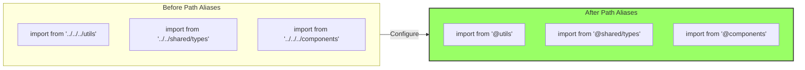
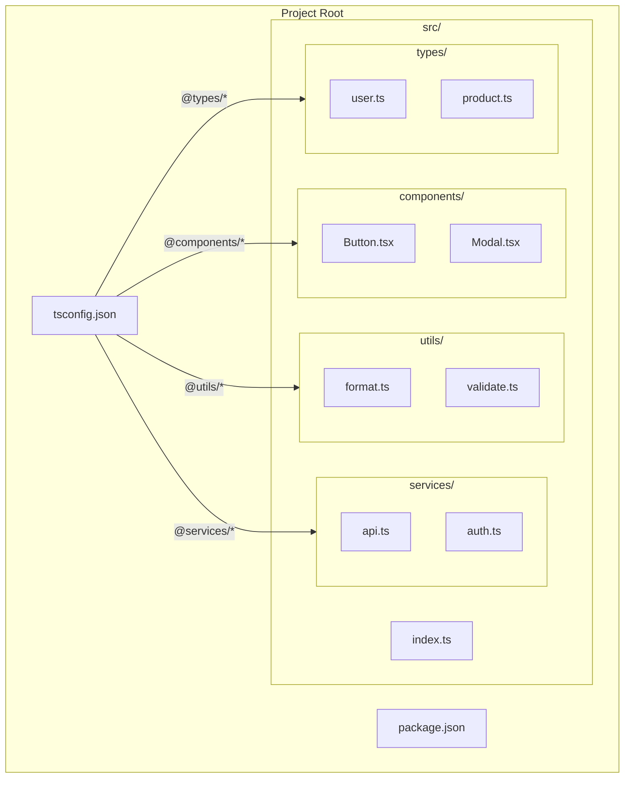
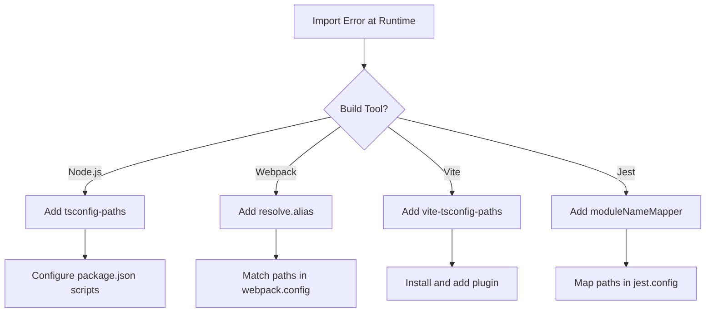

# How to Configure TypeScript Path Aliases

Author: [nawazdhandala](https://www.github.com/nawazdhandala)

Tags: TypeScript, Configuration, Webpack, NodeJS, Module Resolution

Description: Configure TypeScript path aliases to replace long relative imports with clean absolute paths across different build tools.

---

Path aliases replace long relative import paths like `../../../components/Button` with clean absolute paths like `@components/Button`. This guide covers configuring path aliases for TypeScript projects with different build tools.

## Why Use Path Aliases?



| Benefit | Description |
|---------|-------------|
| Readability | Clear module origins at a glance |
| Refactoring | Move files without updating imports |
| Consistency | Same import path everywhere |
| No Guessing | No counting `../` levels |

## Basic TypeScript Configuration

Start with the `tsconfig.json` file. The two key options are `baseUrl` and `paths`:

```json
{
  "compilerOptions": {
    "baseUrl": ".",
    "paths": {
      "@/*": ["src/*"],
      "@components/*": ["src/components/*"],
      "@utils/*": ["src/utils/*"],
      "@hooks/*": ["src/hooks/*"],
      "@types/*": ["src/types/*"],
      "@services/*": ["src/services/*"],
      "@config/*": ["src/config/*"]
    }
  }
}
```

### Understanding the Configuration

```typescript
// baseUrl: The root directory for module resolution
// "." means the directory containing tsconfig.json

// paths: Maps import patterns to file locations
// "@/*" matches any import starting with "@/"
// ["src/*"] tells TypeScript where to find those files

// Example transformation:
// import { Button } from '@components/Button'
// Resolves to: ./src/components/Button
```

### Full tsconfig.json Example

```json
{
  "compilerOptions": {
    "target": "ES2022",
    "module": "ESNext",
    "moduleResolution": "bundler",
    "esModuleInterop": true,
    "strict": true,
    "skipLibCheck": true,
    "declaration": true,
    "outDir": "./dist",
    "rootDir": "./src",
    "baseUrl": ".",
    "paths": {
      "@/*": ["src/*"],
      "@components/*": ["src/components/*"],
      "@utils/*": ["src/utils/*"],
      "@hooks/*": ["src/hooks/*"],
      "@types/*": ["src/types/*"],
      "@services/*": ["src/services/*"],
      "@config/*": ["src/config/*"],
      "@assets/*": ["src/assets/*"],
      "@styles/*": ["src/styles/*"],
      "@lib/*": ["src/lib/*"]
    }
  },
  "include": ["src/**/*"],
  "exclude": ["node_modules", "dist"]
}
```

## Runtime Resolution Setup

TypeScript path aliases only work at compile time. For runtime resolution, you need additional configuration depending on your setup.

### Node.js with ts-node

For running TypeScript directly with ts-node, install the tsconfig-paths package:

```bash
npm install --save-dev tsconfig-paths
```

Then use it when running your application:

```bash
# Using ts-node with path resolution
ts-node -r tsconfig-paths/register src/index.ts

# Or in package.json scripts
{
  "scripts": {
    "dev": "ts-node -r tsconfig-paths/register src/index.ts",
    "start:dev": "nodemon --exec ts-node -r tsconfig-paths/register src/index.ts"
  }
}
```

### Node.js with Compiled JavaScript

For production builds where TypeScript compiles to JavaScript, use tsc-alias:

```bash
npm install --save-dev tsc-alias
```

Configure your build script:

```json
{
  "scripts": {
    "build": "tsc && tsc-alias",
    "start": "node dist/index.js"
  }
}
```

The tsc-alias tool rewrites the compiled imports to relative paths:

```javascript
// Before tsc-alias (dist/services/userService.js)
const config_1 = require("@config/database");

// After tsc-alias (dist/services/userService.js)
const config_1 = require("../config/database");
```

## Framework-Specific Configuration

### Vite

Vite requires a separate alias configuration in `vite.config.ts`:

```typescript
import { defineConfig } from 'vite';
import react from '@vitejs/plugin-react';
import path from 'path';

export default defineConfig({
  plugins: [react()],
  resolve: {
    alias: {
      '@': path.resolve(__dirname, './src'),
      '@components': path.resolve(__dirname, './src/components'),
      '@utils': path.resolve(__dirname, './src/utils'),
      '@hooks': path.resolve(__dirname, './src/hooks'),
      '@types': path.resolve(__dirname, './src/types'),
      '@services': path.resolve(__dirname, './src/services'),
      '@config': path.resolve(__dirname, './src/config'),
    },
  },
});
```

You can also use the vite-tsconfig-paths plugin for automatic synchronization:

```bash
npm install --save-dev vite-tsconfig-paths
```

```typescript
import { defineConfig } from 'vite';
import react from '@vitejs/plugin-react';
import tsconfigPaths from 'vite-tsconfig-paths';

export default defineConfig({
  plugins: [
    react(),
    tsconfigPaths(),  // Automatically reads paths from tsconfig.json
  ],
});
```

### Webpack

Configure Webpack's resolve.alias to match your TypeScript paths:

```javascript
// webpack.config.js
const path = require('path');

module.exports = {
  // ... other config
  resolve: {
    alias: {
      '@': path.resolve(__dirname, 'src'),
      '@components': path.resolve(__dirname, 'src/components'),
      '@utils': path.resolve(__dirname, 'src/utils'),
      '@hooks': path.resolve(__dirname, 'src/hooks'),
      '@types': path.resolve(__dirname, 'src/types'),
      '@services': path.resolve(__dirname, 'src/services'),
      '@config': path.resolve(__dirname, 'src/config'),
    },
    extensions: ['.ts', '.tsx', '.js', '.jsx'],
  },
};
```

For automatic synchronization, use tsconfig-paths-webpack-plugin:

```bash
npm install --save-dev tsconfig-paths-webpack-plugin
```

```javascript
// webpack.config.js
const TsconfigPathsPlugin = require('tsconfig-paths-webpack-plugin');

module.exports = {
  resolve: {
    plugins: [new TsconfigPathsPlugin()],
    extensions: ['.ts', '.tsx', '.js', '.jsx'],
  },
};
```

### Next.js

Next.js has built-in support for TypeScript path aliases. Just configure tsconfig.json:

```json
{
  "compilerOptions": {
    "baseUrl": ".",
    "paths": {
      "@/*": ["src/*"],
      "@components/*": ["src/components/*"],
      "@lib/*": ["src/lib/*"],
      "@styles/*": ["src/styles/*"]
    }
  }
}
```

For the app router structure:

```json
{
  "compilerOptions": {
    "baseUrl": ".",
    "paths": {
      "@/*": ["./*"],
      "@components/*": ["components/*"],
      "@lib/*": ["lib/*"],
      "@app/*": ["app/*"]
    }
  }
}
```

### Jest

Jest needs its own module resolution configuration:

```javascript
// jest.config.js
module.exports = {
  preset: 'ts-jest',
  moduleNameMapper: {
    // Map path aliases to their actual locations
    '^@/(.*)$': '<rootDir>/src/$1',
    '^@components/(.*)$': '<rootDir>/src/components/$1',
    '^@utils/(.*)$': '<rootDir>/src/utils/$1',
    '^@hooks/(.*)$': '<rootDir>/src/hooks/$1',
    '^@types/(.*)$': '<rootDir>/src/types/$1',
    '^@services/(.*)$': '<rootDir>/src/services/$1',
    '^@config/(.*)$': '<rootDir>/src/config/$1',
  },
};
```

You can also use ts-jest's pathsToModuleNameMapper helper:

```javascript
// jest.config.js
const { pathsToModuleNameMapper } = require('ts-jest');
const { compilerOptions } = require('./tsconfig.json');

module.exports = {
  preset: 'ts-jest',
  moduleNameMapper: pathsToModuleNameMapper(
    compilerOptions.paths,
    { prefix: '<rootDir>/' }
  ),
};
```

## Project Structure Example



### Sample File Using Aliases

```typescript
// src/pages/UserProfile.tsx
// Clean imports using path aliases instead of relative paths

import { Button, Modal } from '@components';
import { formatDate, formatCurrency } from '@utils/format';
import { validateEmail } from '@utils/validate';
import { fetchUser, updateUser } from '@services/api';
import { useAuth } from '@hooks/useAuth';
import type { User } from '@types/user';
import { API_URL } from '@config/constants';

// Without aliases, these would be:
// import { Button } from '../../components/Button';
// import { formatDate } from '../../utils/format';
// etc.

export function UserProfile({ userId }: { userId: string }) {
  const { user } = useAuth();
  // ... component logic
}
```

## ESLint Configuration

Configure ESLint to understand your path aliases:

```bash
npm install --save-dev eslint-import-resolver-typescript
```

```json
{
  "settings": {
    "import/resolver": {
      "typescript": {
        "alwaysTryTypes": true,
        "project": "./tsconfig.json"
      }
    }
  },
  "rules": {
    "import/order": [
      "error",
      {
        "groups": [
          "builtin",
          "external",
          "internal",
          "parent",
          "sibling",
          "index"
        ],
        "pathGroups": [
          {
            "pattern": "@/**",
            "group": "internal"
          }
        ],
        "newlines-between": "always",
        "alphabetize": {
          "order": "asc"
        }
      }
    ]
  }
}
```

## VS Code Configuration

VS Code should automatically pick up path aliases from tsconfig.json. If it does not, add explicit settings:

```json
{
  "typescript.preferences.importModuleSpecifier": "non-relative",
  "typescript.suggest.paths": true,
  "javascript.preferences.importModuleSpecifier": "non-relative"
}
```

For auto-import suggestions to use your aliases, ensure your tsconfig.json is in the workspace root or configure the TypeScript SDK path.

## Troubleshooting

### Common Issues

**Imports work in editor but fail at runtime:**



**TypeScript cannot find module:**

```typescript
// Error: Cannot find module '@utils/format'

// Check 1: Verify baseUrl is set
{
  "compilerOptions": {
    "baseUrl": "."  // Must be present
  }
}

// Check 2: Verify path pattern matches
{
  "paths": {
    "@utils/*": ["src/utils/*"]  // Pattern must end with /*
  }
}

// Check 3: Verify file exists at the resolved path
// @utils/format resolves to ./src/utils/format.ts
```

**Index files not resolving:**

```typescript
// If you have src/components/index.ts that exports all components

// Configure both patterns
{
  "paths": {
    "@components": ["src/components/index"],
    "@components/*": ["src/components/*"]
  }
}

// Now both work:
import { Button } from '@components';         // Uses index
import { Button } from '@components/Button';  // Direct import
```

## Best Practices

| Practice | Reason |
|----------|--------|
| Use consistent prefixes | `@` prefix distinguishes from npm packages |
| Keep aliases shallow | One level of aliasing is usually enough |
| Match folder structure | `@components` maps to `components/` |
| Document in README | Help team members understand aliases |
| Sync all configurations | tsconfig, bundler, and test config must match |

## Summary

Path aliases improve code organization and readability by replacing relative paths with meaningful absolute imports. The key steps are:

1. Configure `baseUrl` and `paths` in tsconfig.json
2. Set up runtime resolution for your build tool
3. Configure testing frameworks to understand aliases
4. Optionally set up ESLint and VS Code for better developer experience

Remember that TypeScript path aliases are a compile-time feature. Every tool that processes your code needs its own configuration to resolve these paths correctly.
