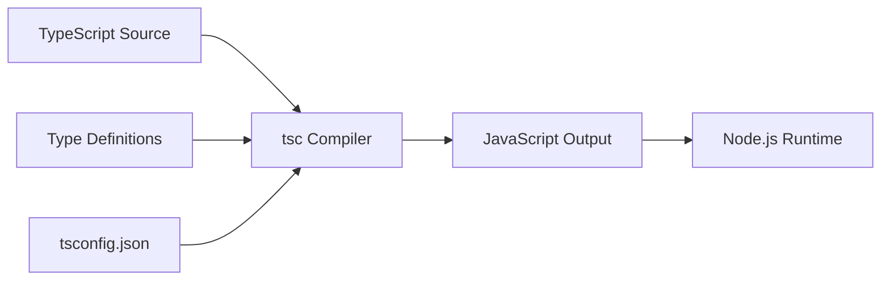
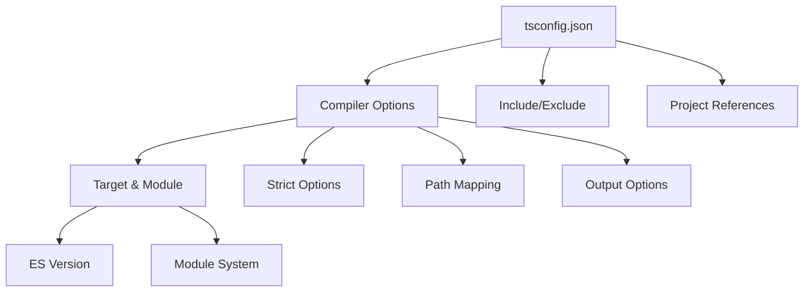

# How to Configure TypeScript with Node.js

Author: [nawazdhandala](https://www.github.com/nawazdhandala)

Tags: TypeScript, Node.js, Configuration, tsconfig, JavaScript, Backend Development

Description: A comprehensive guide to setting up and configuring TypeScript for Node.js projects, covering tsconfig options, module systems, and best practices for production applications.

---

Setting up TypeScript with Node.js can feel overwhelming given the many configuration options available. In this guide, we will walk through the essential configurations, explain what each option does, and provide production-ready examples that you can use in your projects.

## Why TypeScript with Node.js?

TypeScript adds static type checking to JavaScript, catching errors at compile time rather than runtime. For Node.js applications, this means fewer bugs in production, better IDE support, and more maintainable code.



## Initial Project Setup

Let us start with a fresh Node.js project and add TypeScript.

```bash
# Create project directory
mkdir my-node-app
cd my-node-app

# Initialize npm project
npm init -y

# Install TypeScript and Node.js types
npm install -D typescript @types/node

# Initialize TypeScript configuration
npx tsc --init
```

This creates a `tsconfig.json` file with default settings. Let us customize it for Node.js development.

## Understanding tsconfig.json

The `tsconfig.json` file controls how TypeScript compiles your code. Here is a breakdown of the most important options for Node.js:



### Basic Configuration for Node.js 20+

Here is a recommended configuration for modern Node.js applications:

```json
{
    "compilerOptions": {
        // Target ES2022 for Node.js 20+
        // This enables modern JavaScript features like top-level await
        "target": "ES2022",

        // Use Node16 module system for proper ESM support
        // This handles both .mjs and .cjs files correctly
        "module": "Node16",
        "moduleResolution": "Node16",

        // Output directory for compiled JavaScript
        "outDir": "./dist",

        // Source directory for TypeScript files
        "rootDir": "./src",

        // Enable all strict type checking options
        "strict": true,

        // Ensure consistent casing in imports
        "forceConsistentCasingInFileNames": true,

        // Skip type checking of declaration files for faster builds
        "skipLibCheck": true,

        // Generate source maps for debugging
        "sourceMap": true,

        // Generate declaration files for library projects
        "declaration": true,

        // Allow importing JSON files
        "resolveJsonModule": true,

        // Ensure each file can be safely transpiled independently
        "isolatedModules": true,

        // Enable ES module interop
        "esModuleInterop": true
    },
    "include": ["src/**/*"],
    "exclude": ["node_modules", "dist"]
}
```

### Configuration for Older Node.js Versions

If you need to support Node.js 16 or 18, adjust the target:

```json
{
    "compilerOptions": {
        // Node.js 16 supports ES2021
        "target": "ES2021",
        "module": "Node16",
        "moduleResolution": "Node16",
        "outDir": "./dist",
        "rootDir": "./src",
        "strict": true,
        "skipLibCheck": true,
        "esModuleInterop": true
    },
    "include": ["src/**/*"],
    "exclude": ["node_modules", "dist"]
}
```

## Module Systems: CommonJS vs ESM

Node.js supports two module systems, and choosing the right one affects your configuration.

### CommonJS (Traditional)

CommonJS uses `require()` and `module.exports`:

```typescript
// src/utils.ts
export function greet(name: string): string {
    return `Hello, ${name}!`;
}

// src/index.ts
import { greet } from "./utils";
console.log(greet("World"));
```

For CommonJS output, use this configuration:

```json
{
    "compilerOptions": {
        "target": "ES2022",
        "module": "CommonJS",
        "moduleResolution": "Node",
        "outDir": "./dist",
        "rootDir": "./src",
        "strict": true,
        "esModuleInterop": true
    }
}
```

Your `package.json` should not specify `"type": "module"`:

```json
{
    "name": "my-node-app",
    "version": "1.0.0",
    "main": "dist/index.js",
    "scripts": {
        "build": "tsc",
        "start": "node dist/index.js"
    }
}
```

### ES Modules (Modern)

ES Modules use `import` and `export` natively:

```json
{
    "compilerOptions": {
        "target": "ES2022",
        "module": "Node16",
        "moduleResolution": "Node16",
        "outDir": "./dist",
        "rootDir": "./src",
        "strict": true,
        "esModuleInterop": true
    }
}
```

Your `package.json` should specify `"type": "module"`:

```json
{
    "name": "my-node-app",
    "version": "1.0.0",
    "type": "module",
    "main": "dist/index.js",
    "scripts": {
        "build": "tsc",
        "start": "node dist/index.js"
    }
}
```

**Important**: With ESM, you must include file extensions in imports:

```typescript
// With ESM, always include the .js extension (even for .ts files)
import { greet } from "./utils.js";
```

## Path Aliases and Module Resolution

Path aliases help you avoid long relative imports like `../../../utils/helpers`.

### Setting Up Path Aliases

Add these to your `tsconfig.json`:

```json
{
    "compilerOptions": {
        "baseUrl": ".",
        "paths": {
            "@/*": ["src/*"],
            "@utils/*": ["src/utils/*"],
            "@models/*": ["src/models/*"],
            "@services/*": ["src/services/*"]
        }
    }
}
```

Now you can use cleaner imports:

```typescript
// Before - relative paths
import { logger } from "../../../utils/logger";
import { User } from "../../../models/user";

// After - path aliases
import { logger } from "@utils/logger";
import { User } from "@models/user";
```

### Runtime Resolution

TypeScript path aliases only work at compile time. For runtime, you need additional setup.

**Option 1: Use tsconfig-paths**

```bash
npm install -D tsconfig-paths
```

Update your start script:

```json
{
    "scripts": {
        "start": "node -r tsconfig-paths/register dist/index.js"
    }
}
```

**Option 2: Use module-alias**

```bash
npm install module-alias
```

Add to `package.json`:

```json
{
    "_moduleAliases": {
        "@": "dist",
        "@utils": "dist/utils",
        "@models": "dist/models"
    }
}
```

Register at the top of your entry file:

```typescript
// src/index.ts - must be the first import
import "module-alias/register";

import { logger } from "@utils/logger";
```

**Option 3: Use Node.js subpath imports (recommended for ESM)**

In `package.json`:

```json
{
    "imports": {
        "#utils/*": "./dist/utils/*",
        "#models/*": "./dist/models/*",
        "#services/*": "./dist/services/*"
    }
}
```

Usage:

```typescript
import { logger } from "#utils/logger.js";
```

## Strict Mode Options

The `strict` flag enables multiple type checking options. Here is what each one does:

```json
{
    "compilerOptions": {
        // Enable all strict options at once
        "strict": true,

        // Or enable individually:
        "noImplicitAny": true,           // Error on implicit 'any' type
        "strictNullChecks": true,         // null and undefined are distinct types
        "strictFunctionTypes": true,      // Stricter function type checking
        "strictBindCallApply": true,      // Check bind, call, apply methods
        "strictPropertyInitialization": true,  // Check class property initialization
        "noImplicitThis": true,           // Error on 'this' with implicit 'any'
        "useUnknownInCatchVariables": true,    // catch variables are 'unknown'
        "alwaysStrict": true              // Emit 'use strict' in output
    }
}
```

### Practical Examples of Strict Checks

```typescript
// noImplicitAny - catches untyped parameters
function processData(data) {  // Error: Parameter 'data' implicitly has 'any' type
    return data.value;
}

// Fixed version
function processData(data: { value: string }): string {
    return data.value;
}

// strictNullChecks - catches potential null errors
function getLength(str: string | null): number {
    return str.length;  // Error: 'str' is possibly 'null'
}

// Fixed version
function getLength(str: string | null): number {
    if (str === null) return 0;
    return str.length;
}

// strictPropertyInitialization - ensures class properties are initialized
class User {
    name: string;  // Error: Property 'name' has no initializer

    constructor() {
        // name is never assigned
    }
}

// Fixed version
class User {
    name: string;

    constructor(name: string) {
        this.name = name;
    }
}
```

## Development vs Production Configuration

You might want different settings for development and production.

### Base Configuration (tsconfig.json)

```json
{
    "compilerOptions": {
        "target": "ES2022",
        "module": "Node16",
        "moduleResolution": "Node16",
        "rootDir": "./src",
        "strict": true,
        "esModuleInterop": true,
        "skipLibCheck": true,
        "forceConsistentCasingInFileNames": true
    },
    "include": ["src/**/*"],
    "exclude": ["node_modules"]
}
```

### Development Configuration (tsconfig.dev.json)

```json
{
    "extends": "./tsconfig.json",
    "compilerOptions": {
        "outDir": "./dist",
        "sourceMap": true,
        "declaration": false,
        // Faster builds during development
        "incremental": true,
        "tsBuildInfoFile": "./dist/.tsbuildinfo"
    }
}
```

### Production Configuration (tsconfig.prod.json)

```json
{
    "extends": "./tsconfig.json",
    "compilerOptions": {
        "outDir": "./dist",
        "sourceMap": false,
        "declaration": true,
        "declarationMap": true,
        // Remove comments from output
        "removeComments": true
    }
}
```

### Build Scripts

```json
{
    "scripts": {
        "build:dev": "tsc -p tsconfig.dev.json",
        "build:prod": "tsc -p tsconfig.prod.json",
        "dev": "tsc -p tsconfig.dev.json --watch",
        "start": "node dist/index.js"
    }
}
```

## Using ts-node for Development

For faster development iteration, use `ts-node` to run TypeScript directly:

```bash
npm install -D ts-node
```

### ts-node Configuration

Add to `tsconfig.json`:

```json
{
    "ts-node": {
        "esm": true,
        "experimentalSpecifierResolution": "node"
    }
}
```

Update scripts:

```json
{
    "scripts": {
        "dev": "ts-node src/index.ts",
        "dev:watch": "ts-node-dev --respawn src/index.ts"
    }
}
```

### Using tsx (faster alternative)

`tsx` is a faster alternative to `ts-node`:

```bash
npm install -D tsx
```

```json
{
    "scripts": {
        "dev": "tsx src/index.ts",
        "dev:watch": "tsx watch src/index.ts"
    }
}
```

## Complete Project Structure

Here is a recommended project structure:

```
my-node-app/
├── src/
│   ├── index.ts           # Application entry point
│   ├── config/
│   │   └── index.ts       # Configuration loading
│   ├── models/
│   │   └── user.ts        # Data models
│   ├── services/
│   │   └── userService.ts # Business logic
│   ├── utils/
│   │   └── logger.ts      # Utility functions
│   └── types/
│       └── index.ts       # Custom type definitions
├── tests/
│   └── user.test.ts       # Test files
├── dist/                  # Compiled output (gitignored)
├── package.json
├── tsconfig.json
├── tsconfig.dev.json
├── tsconfig.prod.json
└── .gitignore
```

### Sample Entry File

```typescript
// src/index.ts
import { config } from "./config/index.js";
import { logger } from "./utils/logger.js";
import { UserService } from "./services/userService.js";

async function main(): Promise<void> {
    logger.info("Starting application", { environment: config.env });

    const userService = new UserService();
    const users = await userService.getAllUsers();

    logger.info("Users loaded", { count: users.length });
}

main().catch((error) => {
    logger.error("Application failed to start", { error });
    process.exit(1);
});
```

## Common Pitfalls and Solutions

### Import Extensions with ESM

When using ES Modules, always include `.js` extensions in imports:

```typescript
// Wrong - will fail at runtime
import { helper } from "./helper";

// Correct - works with ESM
import { helper } from "./helper.js";
```

### JSON Imports

Enable JSON imports in your config:

```json
{
    "compilerOptions": {
        "resolveJsonModule": true
    }
}
```

Then import JSON files:

```typescript
import packageJson from "../package.json" assert { type: "json" };
console.log(packageJson.version);
```

### Type-Only Imports

Use type-only imports to avoid runtime issues:

```typescript
// This import is removed at compile time
import type { User } from "./models/user.js";

// This imports both the type and value
import { User, createUser } from "./models/user.js";
```

## Conclusion

Configuring TypeScript with Node.js involves understanding module systems, strict type checking, and build configurations. The key decisions are:

1. **Choose your module system**: ESM for new projects, CommonJS for compatibility
2. **Enable strict mode**: Catches bugs early and improves code quality
3. **Set up path aliases**: Makes imports cleaner and refactoring easier
4. **Use proper development tools**: tsx or ts-node for faster iteration

With the configurations provided in this guide, you will have a solid foundation for building type-safe Node.js applications.

---

**Related Reading:**

- [How to Build an MCP Server in Node.js](https://oneuptime.com/blog/post/2025-12-17-build-mcp-server-nodejs/view)
- [How to Fix "Cannot Redeclare Block-Scoped Variable"](https://oneuptime.com/blog/post/2026-01-24-cannot-redeclare-block-scoped-variable/view)
- [How to Fix "Module Has No Default Export" Errors](https://oneuptime.com/blog/post/2026-01-24-module-has-no-default-export/view)
