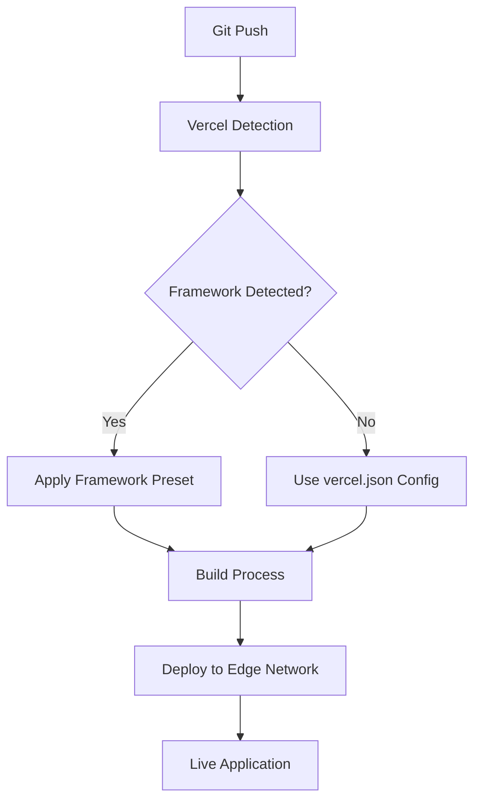
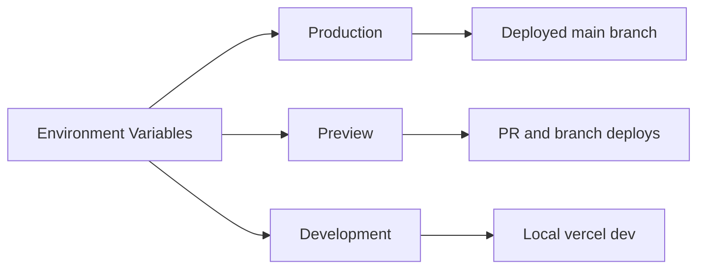
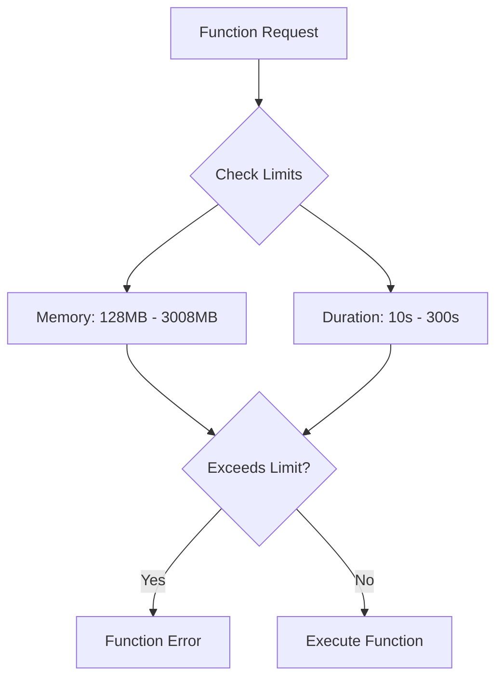
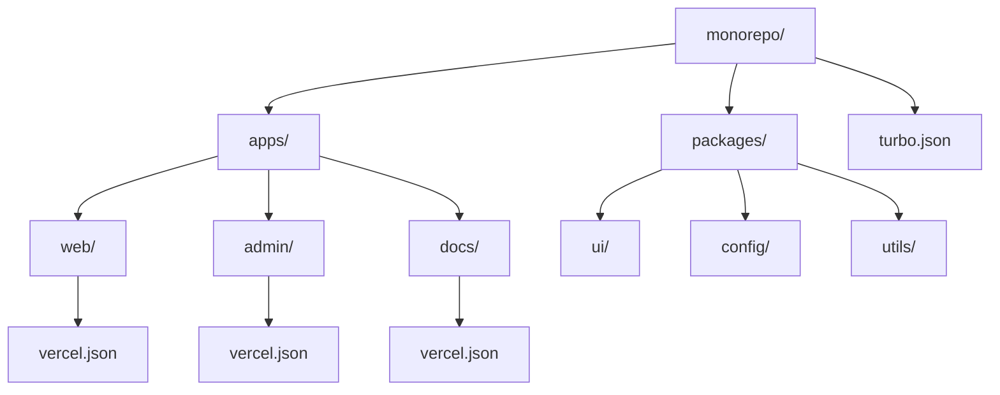
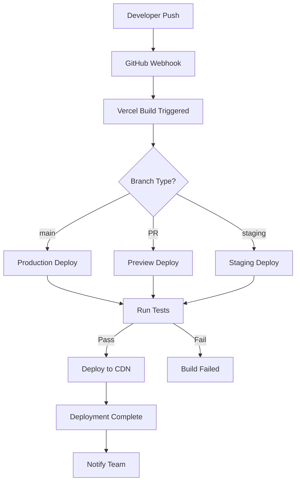

# How to Configure Deployment on Vercel

Author: [nawazdhandala](https://www.github.com/nawazdhandala)

Tags: Vercel, Deployment, Next.js, CI/CD, Environment Variables, Serverless, Edge Functions, DevOps

Description: A comprehensive guide to configuring and optimizing Vercel deployments, covering project setup, environment variables, build settings, and production best practices.

---

> Vercel provides a seamless deployment experience for modern web applications, but getting the configuration right requires understanding its features and options. This guide covers everything from basic setup to advanced deployment strategies.

Whether you are deploying a Next.js application, a static site, or a full-stack application with serverless functions, Vercel offers powerful configuration options to optimize your deployment.

---

## Project Setup and Configuration

Start by understanding the core configuration file and project structure.



### Basic vercel.json Configuration

Create a `vercel.json` file in your project root to customize deployment behavior.

```json
{
  "$schema": "https://openapi.vercel.sh/vercel.json",
  "version": 2,
  "name": "my-application",
  "regions": ["iad1", "sfo1"],
  "buildCommand": "npm run build",
  "devCommand": "npm run dev",
  "installCommand": "npm install",
  "outputDirectory": ".next",
  "framework": "nextjs",
  "public": false
}
```

### Configuration Options Explained

```typescript
// vercel.json with detailed comments
// Note: JSON does not support comments, this is for explanation only

const vercelConfig = {
  // Schema for IDE autocompletion
  "$schema": "https://openapi.vercel.sh/vercel.json",

  // Vercel platform version (always use 2)
  "version": 2,

  // Project name - used in deployment URLs
  "name": "my-application",

  // Target regions for serverless functions
  // iad1 = US East, sfo1 = US West, cdg1 = Europe, etc.
  "regions": ["iad1"],

  // Custom build command (overrides framework default)
  "buildCommand": "npm run build",

  // Custom install command
  "installCommand": "npm ci",

  // Development command for vercel dev
  "devCommand": "npm run dev",

  // Build output directory
  "outputDirectory": ".next",

  // Framework preset
  "framework": "nextjs",

  // Git settings
  "git": {
    "deploymentEnabled": true
  }
};
```

---

## Environment Variables Configuration

Properly managing environment variables is crucial for secure deployments.

### Setting Environment Variables in Vercel Dashboard

Navigate to your project settings and configure environment variables for each environment.



### Using vercel.json for Environment Variables

```json
{
  "version": 2,
  "env": {
    "NODE_ENV": "production",
    "API_VERSION": "v2"
  },
  "build": {
    "env": {
      "NEXT_PUBLIC_API_URL": "https://api.myapp.com",
      "DATABASE_URL": "@database-url"
    }
  }
}
```

### Environment Variable Types

```typescript
// Different types of environment variables in Next.js on Vercel

// 1. Server-only variables (secure, not exposed to browser)
// Set in Vercel dashboard or vercel.json
process.env.DATABASE_URL;        // Only accessible in server code
process.env.API_SECRET_KEY;      // Never sent to browser

// 2. Public variables (exposed to browser)
// Must start with NEXT_PUBLIC_
process.env.NEXT_PUBLIC_API_URL; // Available in both server and browser
process.env.NEXT_PUBLIC_GA_ID;   // Safe to expose

// 3. System variables (auto-set by Vercel)
process.env.VERCEL;              // "1" when running on Vercel
process.env.VERCEL_ENV;          // "production", "preview", or "development"
process.env.VERCEL_URL;          // Deployment URL without protocol
process.env.VERCEL_REGION;       // Current region (e.g., "iad1")
```

### Creating Environment Variable Files

```bash
# .env.local - Local development (git ignored)
DATABASE_URL=postgresql://localhost:5432/mydb
API_SECRET_KEY=local-secret-key
NEXT_PUBLIC_API_URL=http://localhost:3001

# .env.production - Production defaults (can be committed)
NEXT_PUBLIC_API_URL=https://api.myapp.com
NEXT_PUBLIC_SITE_URL=https://myapp.com

# .env.development - Development defaults
NEXT_PUBLIC_API_URL=http://localhost:3001
```

### Linked Environment Variables

Use Vercel CLI to manage environment variables securely.

```bash
# Install Vercel CLI
npm install -g vercel

# Link your project
vercel link

# Pull environment variables to local .env file
vercel env pull .env.local

# Add a new environment variable
vercel env add DATABASE_URL production

# List all environment variables
vercel env ls

# Remove an environment variable
vercel env rm DATABASE_URL production
```

---

## Build Configuration

Customize the build process for optimal performance.

### Custom Build Settings

```json
{
  "version": 2,
  "buildCommand": "npm run build",
  "installCommand": "npm ci --legacy-peer-deps",
  "framework": "nextjs",
  "functions": {
    "api/**/*.ts": {
      "memory": 1024,
      "maxDuration": 30
    },
    "app/api/**/*.ts": {
      "memory": 512,
      "maxDuration": 10
    }
  }
}
```

### Memory and Duration Settings



### Configuring Function Regions

```json
{
  "version": 2,
  "regions": ["iad1", "cdg1", "hnd1"],
  "functions": {
    "api/user/**": {
      "memory": 1024,
      "maxDuration": 30,
      "runtime": "nodejs20.x"
    },
    "api/heavy-computation.ts": {
      "memory": 3008,
      "maxDuration": 60
    }
  }
}
```

---

## Routing and Rewrites

Configure URL routing, redirects, and rewrites.

### Basic Rewrites

```json
{
  "version": 2,
  "rewrites": [
    {
      "source": "/api/:path*",
      "destination": "https://api.mybackend.com/:path*"
    },
    {
      "source": "/blog/:slug",
      "destination": "/posts/:slug"
    },
    {
      "source": "/old-page",
      "destination": "/new-page"
    }
  ]
}
```

### Redirects

```json
{
  "version": 2,
  "redirects": [
    {
      "source": "/old-blog/:slug",
      "destination": "/blog/:slug",
      "permanent": true
    },
    {
      "source": "/github",
      "destination": "https://github.com/myorg/myrepo",
      "permanent": false
    },
    {
      "source": "/docs/:path((?!v2/).*)",
      "destination": "/docs/v2/:path*",
      "permanent": false
    }
  ]
}
```

### Headers Configuration

```json
{
  "version": 2,
  "headers": [
    {
      "source": "/api/(.*)",
      "headers": [
        {
          "key": "Access-Control-Allow-Origin",
          "value": "*"
        },
        {
          "key": "Access-Control-Allow-Methods",
          "value": "GET, POST, PUT, DELETE, OPTIONS"
        }
      ]
    },
    {
      "source": "/(.*)",
      "headers": [
        {
          "key": "X-Frame-Options",
          "value": "DENY"
        },
        {
          "key": "X-Content-Type-Options",
          "value": "nosniff"
        },
        {
          "key": "Referrer-Policy",
          "value": "strict-origin-when-cross-origin"
        }
      ]
    },
    {
      "source": "/static/(.*)",
      "headers": [
        {
          "key": "Cache-Control",
          "value": "public, max-age=31536000, immutable"
        }
      ]
    }
  ]
}
```

---

## Edge Configuration

Deploy functions at the edge for better performance.

### Edge Functions

```typescript
// app/api/geo/route.ts
// Edge function for geolocation-based responses

import { NextRequest, NextResponse } from "next/server";

// Configure as Edge Function
export const runtime = "edge";

export async function GET(request: NextRequest) {
  // Access geolocation data (available at the edge)
  const country = request.geo?.country || "Unknown";
  const city = request.geo?.city || "Unknown";
  const region = request.geo?.region || "Unknown";

  return NextResponse.json({
    country,
    city,
    region,
    timestamp: new Date().toISOString(),
  });
}
```

### Edge Middleware

```typescript
// middleware.ts
// Runs on every request at the edge

import { NextResponse } from "next/server";
import type { NextRequest } from "next/server";

export function middleware(request: NextRequest) {
  // Get the pathname of the request
  const { pathname } = request.nextUrl;

  // Add custom header
  const response = NextResponse.next();
  response.headers.set("x-custom-header", "my-value");

  // Geolocation-based routing
  const country = request.geo?.country || "US";

  // Redirect to country-specific page
  if (pathname === "/" && country !== "US") {
    return NextResponse.redirect(
      new URL(`/${country.toLowerCase()}`, request.url)
    );
  }

  // A/B testing with cookies
  const bucket = request.cookies.get("ab-bucket")?.value;
  if (!bucket) {
    const newBucket = Math.random() < 0.5 ? "a" : "b";
    response.cookies.set("ab-bucket", newBucket, {
      maxAge: 60 * 60 * 24 * 30, // 30 days
    });
  }

  return response;
}

// Configure which paths the middleware runs on
export const config = {
  matcher: [
    // Match all paths except static files and api
    "/((?!_next/static|_next/image|favicon.ico).*)",
  ],
};
```

### Edge Config for Feature Flags

```typescript
// lib/feature-flags.ts
// Using Vercel Edge Config for dynamic configuration

import { createClient } from "@vercel/edge-config";

const edgeConfig = createClient(process.env.EDGE_CONFIG);

export async function getFeatureFlags() {
  try {
    const flags = await edgeConfig.getAll();
    return {
      newCheckout: flags.newCheckout ?? false,
      darkMode: flags.darkMode ?? true,
      betaFeatures: flags.betaFeatures ?? false,
    };
  } catch (error) {
    console.error("Failed to fetch feature flags:", error);
    return {
      newCheckout: false,
      darkMode: true,
      betaFeatures: false,
    };
  }
}

// Usage in a page
// app/page.tsx
import { getFeatureFlags } from "@/lib/feature-flags";

export default async function HomePage() {
  const flags = await getFeatureFlags();

  return (
    <main>
      {flags.newCheckout ? <NewCheckoutFlow /> : <LegacyCheckout />}
    </main>
  );
}
```

---

## Caching and Performance

Configure caching for optimal performance.

### Cache-Control Headers

```json
{
  "version": 2,
  "headers": [
    {
      "source": "/static/(.*)",
      "headers": [
        {
          "key": "Cache-Control",
          "value": "public, max-age=31536000, immutable"
        }
      ]
    },
    {
      "source": "/api/static-data",
      "headers": [
        {
          "key": "Cache-Control",
          "value": "s-maxage=3600, stale-while-revalidate=86400"
        }
      ]
    },
    {
      "source": "/(.*)",
      "headers": [
        {
          "key": "Cache-Control",
          "value": "public, max-age=0, must-revalidate"
        }
      ]
    }
  ]
}
```

### ISR Configuration in Next.js

```typescript
// app/products/[id]/page.tsx
// Configure Incremental Static Regeneration

// Revalidate every 60 seconds
export const revalidate = 60;

// Or use on-demand revalidation
// export const revalidate = false;

export default async function ProductPage({
  params,
}: {
  params: Promise<{ id: string }>;
}) {
  const { id } = await params;
  const product = await getProduct(id);

  return <ProductDetails product={product} />;
}

// For on-demand revalidation, create an API route
// app/api/revalidate/route.ts
import { revalidatePath, revalidateTag } from "next/cache";
import { NextRequest, NextResponse } from "next/server";

export async function POST(request: NextRequest) {
  const { searchParams } = new URL(request.url);
  const secret = searchParams.get("secret");
  const path = searchParams.get("path");
  const tag = searchParams.get("tag");

  // Validate secret token
  if (secret !== process.env.REVALIDATION_SECRET) {
    return NextResponse.json({ error: "Invalid secret" }, { status: 401 });
  }

  try {
    if (path) {
      revalidatePath(path);
      return NextResponse.json({ revalidated: true, path });
    }

    if (tag) {
      revalidateTag(tag);
      return NextResponse.json({ revalidated: true, tag });
    }

    return NextResponse.json({ error: "Missing path or tag" }, { status: 400 });
  } catch (error) {
    return NextResponse.json({ error: "Revalidation failed" }, { status: 500 });
  }
}
```

---

## Monorepo Configuration

Configure Vercel for monorepo deployments.

### Turborepo Configuration

```json
{
  "version": 2,
  "buildCommand": "cd ../.. && turbo run build --filter=web",
  "installCommand": "cd ../.. && npm install",
  "framework": "nextjs",
  "outputDirectory": "apps/web/.next"
}
```

### Root Directory Setting

```json
{
  "version": 2,
  "framework": "nextjs",
  "ignoreCommand": "npx turbo-ignore"
}
```

### Project Structure for Monorepo



### Shared Configuration

```typescript
// packages/config/vercel.shared.js
// Shared Vercel configuration for monorepo apps

module.exports = {
  version: 2,
  regions: ["iad1"],
  headers: [
    {
      source: "/(.*)",
      headers: [
        { key: "X-DNS-Prefetch-Control", value: "on" },
        { key: "X-Frame-Options", value: "SAMEORIGIN" },
        { key: "X-Content-Type-Options", value: "nosniff" },
      ],
    },
  ],
};

// apps/web/vercel.json
// Extend shared configuration
const shared = require("@myorg/config/vercel.shared");

module.exports = {
  ...shared,
  name: "web-app",
  buildCommand: "cd ../.. && turbo run build --filter=web",
};
```

---

## Preview Deployments

Configure preview deployments for pull requests.

### Branch-Specific Configuration

```json
{
  "version": 2,
  "git": {
    "deploymentEnabled": {
      "main": true,
      "staging": true,
      "develop": true
    }
  }
}
```

### Preview Environment Variables

```typescript
// Using VERCEL_ENV to determine environment
const getApiUrl = () => {
  switch (process.env.VERCEL_ENV) {
    case "production":
      return "https://api.myapp.com";
    case "preview":
      return "https://staging-api.myapp.com";
    default:
      return "http://localhost:3001";
  }
};

// Or use VERCEL_URL for preview-specific URLs
const getSiteUrl = () => {
  if (process.env.VERCEL_URL) {
    return `https://${process.env.VERCEL_URL}`;
  }
  return process.env.NEXT_PUBLIC_SITE_URL || "http://localhost:3000";
};
```

### Comment Integration

```json
{
  "version": 2,
  "github": {
    "enabled": true,
    "autoAlias": true,
    "silent": false
  }
}
```

---

## Domain Configuration

Configure custom domains and SSL.

### vercel.json Domain Aliases

```json
{
  "version": 2,
  "alias": ["myapp.com", "www.myapp.com"]
}
```

### Redirect www to Non-www

```json
{
  "version": 2,
  "redirects": [
    {
      "source": "/:path(.*)",
      "has": [
        {
          "type": "host",
          "value": "www.myapp.com"
        }
      ],
      "destination": "https://myapp.com/:path",
      "permanent": true
    }
  ]
}
```

---

## Deployment Workflow

Implement a complete deployment workflow.



### Vercel CLI Deployment

```bash
# Install Vercel CLI
npm install -g vercel

# Deploy to preview
vercel

# Deploy to production
vercel --prod

# Deploy with specific environment
vercel --env NODE_ENV=production --env API_KEY=xxx

# Deploy and wait for completion
vercel --prod --confirm

# View deployment logs
vercel logs [deployment-url]

# Rollback to previous deployment
vercel rollback [deployment-url]
```

---

## Monitoring and Analytics

Set up monitoring for your Vercel deployments.

### Vercel Analytics Integration

```typescript
// app/layout.tsx
// Add Vercel Analytics

import { Analytics } from "@vercel/analytics/react";
import { SpeedInsights } from "@vercel/speed-insights/next";

export default function RootLayout({
  children,
}: {
  children: React.ReactNode;
}) {
  return (
    <html lang="en">
      <body>
        {children}
        <Analytics />
        <SpeedInsights />
      </body>
    </html>
  );
}
```

### Custom Monitoring Integration

```typescript
// lib/monitoring.ts
// Integrate with external monitoring

import { OneUptime } from "@oneuptime/sdk";

// Initialize monitoring
const monitoring = new OneUptime({
  apiKey: process.env.ONEUPTIME_API_KEY!,
  serviceName: "my-vercel-app",
});

// Track deployments
export async function trackDeployment() {
  await monitoring.createEvent({
    type: "deployment",
    environment: process.env.VERCEL_ENV,
    commit: process.env.VERCEL_GIT_COMMIT_SHA,
    timestamp: new Date().toISOString(),
  });
}

// Track errors
export async function trackError(error: Error) {
  await monitoring.captureException(error, {
    region: process.env.VERCEL_REGION,
    url: process.env.VERCEL_URL,
  });
}
```

---

## Security Best Practices

Implement security measures for your Vercel deployment.

### Security Headers

```json
{
  "version": 2,
  "headers": [
    {
      "source": "/(.*)",
      "headers": [
        {
          "key": "Strict-Transport-Security",
          "value": "max-age=63072000; includeSubDomains; preload"
        },
        {
          "key": "X-Frame-Options",
          "value": "DENY"
        },
        {
          "key": "X-Content-Type-Options",
          "value": "nosniff"
        },
        {
          "key": "Referrer-Policy",
          "value": "strict-origin-when-cross-origin"
        },
        {
          "key": "Content-Security-Policy",
          "value": "default-src 'self'; script-src 'self' 'unsafe-inline' 'unsafe-eval'; style-src 'self' 'unsafe-inline';"
        },
        {
          "key": "Permissions-Policy",
          "value": "camera=(), microphone=(), geolocation=()"
        }
      ]
    }
  ]
}
```

### Protecting Sensitive Routes

```typescript
// middleware.ts
// Protect admin routes

import { NextResponse } from "next/server";
import type { NextRequest } from "next/server";

export function middleware(request: NextRequest) {
  const { pathname } = request.nextUrl;

  // Protect admin routes
  if (pathname.startsWith("/admin")) {
    const authToken = request.cookies.get("admin-token");

    if (!authToken) {
      return NextResponse.redirect(new URL("/login", request.url));
    }
  }

  // Rate limiting headers
  const response = NextResponse.next();
  response.headers.set("X-RateLimit-Limit", "100");
  response.headers.set("X-RateLimit-Remaining", "99");

  return response;
}
```

---

## Conclusion

Vercel provides a powerful platform for deploying modern web applications. By properly configuring your deployment settings, you can ensure optimal performance, security, and reliability.

Key takeaways:

- Use `vercel.json` for detailed deployment configuration
- Manage environment variables securely across environments
- Configure functions with appropriate memory and duration limits
- Implement proper caching strategies for performance
- Use Edge Functions for geolocation and low-latency operations
- Set up preview deployments for pull request testing
- Implement security headers and best practices

With these configurations in place, your Vercel deployment will be production-ready and optimized for performance.

---

*Monitor your Vercel deployments with [OneUptime](https://oneuptime.com). Track uptime, performance metrics, and get alerted when issues occur across your deployed applications.*
