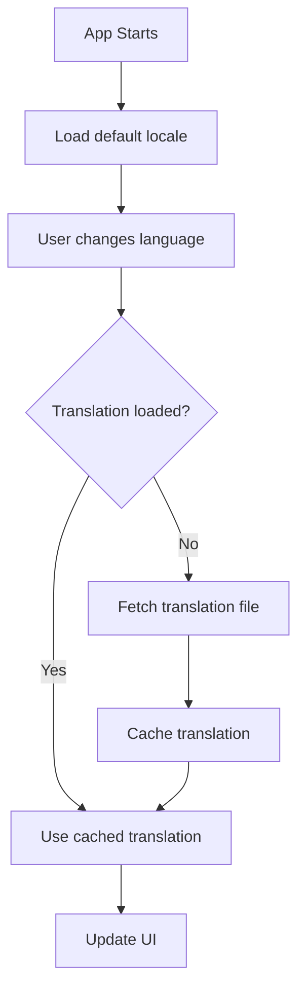

# How to Configure Vue i18n Internationalization

Author: [nawazdhandala](https://www.github.com/nawazdhandala)

Tags: Vue, Vue3, i18n, Internationalization, Localization, Translation, Frontend

Description: Complete guide to setting up Vue i18n for multilingual applications including lazy loading, pluralization, and component interpolation.

---

Vue i18n is the standard internationalization plugin for Vue applications. This guide covers setup, configuration, and advanced patterns for building multilingual Vue 3 applications.

## Installation and Basic Setup

### Install Vue i18n

```bash
npm install vue-i18n@9
```

### Create i18n Instance

```typescript
// src/i18n/index.ts
import { createI18n } from 'vue-i18n';

// Define message types for type safety
type MessageSchema = {
  greeting: string;
  welcome: string;
  nav: {
    home: string;
    about: string;
    contact: string;
  };
  buttons: {
    submit: string;
    cancel: string;
  };
};

// English translations
const en: MessageSchema = {
  greeting: 'Hello',
  welcome: 'Welcome to our application',
  nav: {
    home: 'Home',
    about: 'About',
    contact: 'Contact'
  },
  buttons: {
    submit: 'Submit',
    cancel: 'Cancel'
  }
};

// Spanish translations
const es: MessageSchema = {
  greeting: 'Hola',
  welcome: 'Bienvenido a nuestra aplicacion',
  nav: {
    home: 'Inicio',
    about: 'Acerca de',
    contact: 'Contacto'
  },
  buttons: {
    submit: 'Enviar',
    cancel: 'Cancelar'
  }
};

const i18n = createI18n({
  legacy: false,  // Use Composition API mode
  locale: 'en',   // Default locale
  fallbackLocale: 'en',
  messages: {
    en,
    es
  }
});

export default i18n;
```

### Register with Vue App

```typescript
// src/main.ts
import { createApp } from 'vue';
import App from './App.vue';
import i18n from './i18n';

const app = createApp(App);
app.use(i18n);
app.mount('#app');
```

## Using Translations in Components

### Template Syntax

```vue
<template>
  <div>
    <!-- Basic translation -->
    <h1>{{ $t('greeting') }}</h1>

    <!-- Nested keys -->
    <nav>
      <a href="/">{{ $t('nav.home') }}</a>
      <a href="/about">{{ $t('nav.about') }}</a>
    </nav>

    <!-- In attributes -->
    <input :placeholder="$t('form.emailPlaceholder')" />

    <!-- Using the t component for safer HTML -->
    <i18n-t keypath="terms" tag="p">
      <template #link>
        <a href="/terms">{{ $t('termsLink') }}</a>
      </template>
    </i18n-t>
  </div>
</template>
```

### Composition API

```vue
<script setup lang="ts">
import { useI18n } from 'vue-i18n';

const { t, locale, availableLocales } = useI18n();

// Use t function for translations
const greeting = t('greeting');

// Change locale
function switchLanguage(lang: string) {
  locale.value = lang;
}
</script>

<template>
  <div>
    <p>{{ t('welcome') }}</p>

    <!-- Language switcher -->
    <select v-model="locale">
      <option v-for="lang in availableLocales" :key="lang" :value="lang">
        {{ lang }}
      </option>
    </select>
  </div>
</template>
```

## Interpolation and Formatting

### Named Interpolation

```typescript
// messages
const en = {
  greeting: 'Hello, {name}!',
  items: 'You have {count} items in your cart',
  orderStatus: 'Order #{orderId} is {status}'
};
```

```vue
<template>
  <p>{{ $t('greeting', { name: userName }) }}</p>
  <p>{{ $t('items', { count: cartItems.length }) }}</p>
  <p>{{ $t('orderStatus', { orderId: order.id, status: order.status }) }}</p>
</template>
```

### List Interpolation

```typescript
const en = {
  introduction: '{0} is a {1} developer from {2}'
};
```

```vue
<template>
  <p>{{ $t('introduction', ['John', 'Vue.js', 'New York']) }}</p>
</template>
```

### Pluralization

```typescript
const en = {
  // Pipe-separated plural forms: zero | one | many
  items: 'no items | one item | {count} items',

  // With explicit counts
  messages: '{n} message | {n} messages',

  // Complex pluralization
  apples: 'no apples | one apple | {count} apples'
};
```

```vue
<template>
  <!-- Uses $tc for plural -->
  <p>{{ $t('items', itemCount) }}</p>
  <p>{{ $t('items', { count: itemCount }, itemCount) }}</p>

  <!-- Composition API -->
  <p>{{ t('messages', messageCount) }}</p>
</template>

<script setup>
import { useI18n } from 'vue-i18n';

const { t } = useI18n();
const messageCount = ref(5);
</script>
```

### Date and Number Formatting

```typescript
// src/i18n/index.ts
const i18n = createI18n({
  legacy: false,
  locale: 'en',
  messages: { en, es },

  // Date formats
  datetimeFormats: {
    en: {
      short: {
        year: 'numeric',
        month: 'short',
        day: 'numeric'
      },
      long: {
        year: 'numeric',
        month: 'long',
        day: 'numeric',
        weekday: 'long',
        hour: 'numeric',
        minute: 'numeric'
      }
    },
    es: {
      short: {
        year: 'numeric',
        month: 'short',
        day: 'numeric'
      },
      long: {
        year: 'numeric',
        month: 'long',
        day: 'numeric',
        weekday: 'long',
        hour: 'numeric',
        minute: 'numeric'
      }
    }
  },

  // Number formats
  numberFormats: {
    en: {
      currency: {
        style: 'currency',
        currency: 'USD'
      },
      decimal: {
        style: 'decimal',
        minimumFractionDigits: 2,
        maximumFractionDigits: 2
      },
      percent: {
        style: 'percent',
        useGrouping: false
      }
    },
    es: {
      currency: {
        style: 'currency',
        currency: 'EUR'
      },
      decimal: {
        style: 'decimal',
        minimumFractionDigits: 2,
        maximumFractionDigits: 2
      },
      percent: {
        style: 'percent',
        useGrouping: false
      }
    }
  }
});
```

```vue
<template>
  <!-- Date formatting -->
  <p>{{ $d(new Date(), 'short') }}</p>
  <p>{{ $d(new Date(), 'long') }}</p>

  <!-- Number formatting -->
  <p>{{ $n(1234.56, 'currency') }}</p>
  <p>{{ $n(0.15, 'percent') }}</p>
</template>
```

## Lazy Loading Translations

For large applications, load translations on demand:



### Setup Lazy Loading

```typescript
// src/i18n/index.ts
import { createI18n } from 'vue-i18n';

// Start with minimal messages
const i18n = createI18n({
  legacy: false,
  locale: 'en',
  fallbackLocale: 'en',
  messages: {}
});

// Track loaded locales
const loadedLocales: string[] = [];

// Load locale messages dynamically
export async function loadLocaleMessages(locale: string): Promise<void> {
  // Skip if already loaded
  if (loadedLocales.includes(locale)) {
    return;
  }

  // Dynamic import of locale file
  const messages = await import(`./locales/${locale}.json`);

  // Set locale messages
  i18n.global.setLocaleMessage(locale, messages.default);
  loadedLocales.push(locale);
}

// Change locale with lazy loading
export async function setLocale(locale: string): Promise<void> {
  await loadLocaleMessages(locale);
  i18n.global.locale.value = locale;

  // Update HTML lang attribute
  document.documentElement.setAttribute('lang', locale);

  // Persist preference
  localStorage.setItem('locale', locale);
}

// Initialize with saved or browser locale
export async function initLocale(): Promise<void> {
  const savedLocale = localStorage.getItem('locale');
  const browserLocale = navigator.language.split('-')[0];
  const locale = savedLocale || browserLocale || 'en';

  await setLocale(locale);
}

export default i18n;
```

### Locale Files Structure

```
src/i18n/
  index.ts
  locales/
    en.json
    es.json
    fr.json
    de.json
```

```json
// src/i18n/locales/en.json
{
  "greeting": "Hello",
  "welcome": "Welcome to our application",
  "nav": {
    "home": "Home",
    "about": "About",
    "contact": "Contact"
  }
}
```

### Initialize in Main

```typescript
// src/main.ts
import { createApp } from 'vue';
import App from './App.vue';
import i18n, { initLocale } from './i18n';

async function bootstrap() {
  const app = createApp(App);
  app.use(i18n);

  // Load initial locale before mounting
  await initLocale();

  app.mount('#app');
}

bootstrap();
```

## Component-Level Translations

### Scoped Messages

```vue
<script setup lang="ts">
import { useI18n } from 'vue-i18n';

// Component-specific messages
const { t } = useI18n({
  messages: {
    en: {
      title: 'User Profile',
      fields: {
        name: 'Full Name',
        email: 'Email Address'
      }
    },
    es: {
      title: 'Perfil de Usuario',
      fields: {
        name: 'Nombre Completo',
        email: 'Correo Electronico'
      }
    }
  }
});
</script>

<template>
  <div class="user-profile">
    <h2>{{ t('title') }}</h2>
    <label>{{ t('fields.name') }}</label>
    <label>{{ t('fields.email') }}</label>
  </div>
</template>
```

### Inherit and Override

```vue
<script setup lang="ts">
import { useI18n } from 'vue-i18n';

const { t } = useI18n({
  // Use global messages and add local ones
  useScope: 'global',
  messages: {
    en: {
      localOnly: 'This is component-specific'
    }
  }
});
</script>
```

## HTML in Translations

### Using v-html (Use with Caution)

```typescript
const en = {
  richText: 'Please read our <strong>terms</strong> and <em>conditions</em>'
};
```

```vue
<template>
  <!-- Only use with trusted content -->
  <p v-html="$t('richText')"></p>
</template>
```

### Safer Component Interpolation

```typescript
const en = {
  terms: 'By signing up, you agree to our {termsLink} and {privacyLink}',
  termsText: 'Terms of Service',
  privacyText: 'Privacy Policy'
};
```

```vue
<template>
  <i18n-t keypath="terms" tag="p">
    <template #termsLink>
      <router-link to="/terms">{{ $t('termsText') }}</router-link>
    </template>
    <template #privacyLink>
      <router-link to="/privacy">{{ $t('privacyText') }}</router-link>
    </template>
  </i18n-t>
</template>
```

## Language Switcher Component

```vue
<!-- LanguageSwitcher.vue -->
<script setup lang="ts">
import { useI18n } from 'vue-i18n';
import { setLocale } from '@/i18n';

const { locale, availableLocales } = useI18n();

// Language display names
const languageNames: Record<string, string> = {
  en: 'English',
  es: 'Espanol',
  fr: 'Francais',
  de: 'Deutsch'
};

async function changeLanguage(event: Event) {
  const target = event.target as HTMLSelectElement;
  await setLocale(target.value);
}
</script>

<template>
  <select :value="locale" @change="changeLanguage" class="language-switcher">
    <option v-for="lang in availableLocales" :key="lang" :value="lang">
      {{ languageNames[lang] || lang }}
    </option>
  </select>
</template>

<style scoped>
.language-switcher {
  padding: 0.5rem;
  border-radius: 4px;
  border: 1px solid #ccc;
}
</style>
```

## Router Integration

### Locale in URL

```typescript
// src/router/index.ts
import { createRouter, createWebHistory } from 'vue-router';
import i18n, { setLocale, loadLocaleMessages } from '@/i18n';

const routes = [
  {
    path: '/:locale',
    children: [
      { path: '', name: 'home', component: () => import('@/views/Home.vue') },
      { path: 'about', name: 'about', component: () => import('@/views/About.vue') }
    ]
  }
];

const router = createRouter({
  history: createWebHistory(),
  routes
});

// Handle locale from URL
router.beforeEach(async (to, from, next) => {
  const locale = to.params.locale as string;
  const supportedLocales = ['en', 'es', 'fr', 'de'];

  if (!supportedLocales.includes(locale)) {
    return next(`/en${to.path}`);
  }

  await setLocale(locale);
  next();
});

export default router;
```

### Generate Localized Routes

```vue
<script setup lang="ts">
import { useI18n } from 'vue-i18n';
import { useRouter } from 'vue-router';

const { locale } = useI18n();
const router = useRouter();

function localePath(path: string): string {
  return `/${locale.value}${path}`;
}
</script>

<template>
  <nav>
    <router-link :to="localePath('/')">{{ $t('nav.home') }}</router-link>
    <router-link :to="localePath('/about')">{{ $t('nav.about') }}</router-link>
  </nav>
</template>
```

## Vite Plugin for Optimization

```bash
npm install @intlify/unplugin-vue-i18n
```

```typescript
// vite.config.ts
import { defineConfig } from 'vite';
import vue from '@vitejs/plugin-vue';
import VueI18nPlugin from '@intlify/unplugin-vue-i18n/vite';
import { resolve } from 'path';

export default defineConfig({
  plugins: [
    vue(),
    VueI18nPlugin({
      // Locale directory
      include: resolve(__dirname, './src/i18n/locales/**'),
      // Strict message format
      strictMessage: false,
      // Skip escaping
      escapeHtml: false
    })
  ]
});
```

## Testing with i18n

```typescript
// test-utils.ts
import { mount } from '@vue/test-utils';
import { createI18n } from 'vue-i18n';
import type { Component } from 'vue';

export function mountWithI18n(
  component: Component,
  options: { locale?: string; messages?: Record<string, any> } = {}
) {
  const i18n = createI18n({
    legacy: false,
    locale: options.locale || 'en',
    messages: options.messages || {
      en: {
        greeting: 'Hello',
        welcome: 'Welcome'
      }
    }
  });

  return mount(component, {
    global: {
      plugins: [i18n]
    }
  });
}

// Usage in tests
test('renders greeting', () => {
  const wrapper = mountWithI18n(MyComponent);
  expect(wrapper.text()).toContain('Hello');
});

test('renders in Spanish', () => {
  const wrapper = mountWithI18n(MyComponent, {
    locale: 'es',
    messages: {
      es: { greeting: 'Hola' }
    }
  });
  expect(wrapper.text()).toContain('Hola');
});
```

## Summary

| Feature | Implementation |
|---------|----------------|
| Basic setup | createI18n with messages |
| Composition API | useI18n composable |
| Interpolation | Named placeholders {name} |
| Pluralization | Pipe-separated forms |
| Date/Number | datetimeFormats, numberFormats |
| Lazy loading | Dynamic imports |
| Component scope | useI18n with messages option |
| Router integration | Locale prefix in URL |

Vue i18n provides a complete solution for internationalization with strong TypeScript support, lazy loading for performance, and flexible formatting options. Start with a simple setup and add features like lazy loading and URL-based locales as your application grows.
