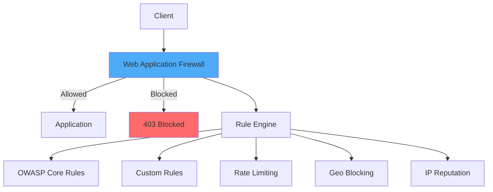

# How to Configure WAF Rules

Author: [nawazdhandala](https://www.github.com/nawazdhandala)

Tags: Security, WAF, Web Application Firewall, OWASP, ModSecurity, DevOps

Description: Learn how to configure Web Application Firewall rules to protect against SQL injection, XSS, and other common web attacks.

---

A Web Application Firewall (WAF) inspects HTTP traffic and blocks malicious requests before they reach your application. This guide covers how to configure WAF rules effectively, whether you use cloud-based WAFs like AWS WAF and Cloudflare, or open-source solutions like ModSecurity.

## WAF Architecture



## AWS WAF Configuration

### Basic Rule Groups

```json
{
  "Name": "production-waf-rules",
  "Scope": "REGIONAL",
  "DefaultAction": {
    "Allow": {}
  },
  "Rules": [
    {
      "Name": "AWSManagedRulesCommonRuleSet",
      "Priority": 1,
      "OverrideAction": {
        "None": {}
      },
      "Statement": {
        "ManagedRuleGroupStatement": {
          "VendorName": "AWS",
          "Name": "AWSManagedRulesCommonRuleSet",
          "ExcludedRules": []
        }
      },
      "VisibilityConfig": {
        "SampledRequestsEnabled": true,
        "CloudWatchMetricsEnabled": true,
        "MetricName": "AWSCommonRules"
      }
    },
    {
      "Name": "AWSManagedRulesSQLiRuleSet",
      "Priority": 2,
      "OverrideAction": {
        "None": {}
      },
      "Statement": {
        "ManagedRuleGroupStatement": {
          "VendorName": "AWS",
          "Name": "AWSManagedRulesSQLiRuleSet"
        }
      },
      "VisibilityConfig": {
        "SampledRequestsEnabled": true,
        "CloudWatchMetricsEnabled": true,
        "MetricName": "AWSSQLiRules"
      }
    },
    {
      "Name": "AWSManagedRulesKnownBadInputsRuleSet",
      "Priority": 3,
      "OverrideAction": {
        "None": {}
      },
      "Statement": {
        "ManagedRuleGroupStatement": {
          "VendorName": "AWS",
          "Name": "AWSManagedRulesKnownBadInputsRuleSet"
        }
      },
      "VisibilityConfig": {
        "SampledRequestsEnabled": true,
        "CloudWatchMetricsEnabled": true,
        "MetricName": "AWSBadInputsRules"
      }
    }
  ]
}
```

### Custom Rate Limiting Rule

```json
{
  "Name": "RateLimitRule",
  "Priority": 10,
  "Action": {
    "Block": {
      "CustomResponse": {
        "ResponseCode": 429,
        "CustomResponseBodyKey": "rate-limit-response"
      }
    }
  },
  "Statement": {
    "RateBasedStatement": {
      "Limit": 2000,
      "AggregateKeyType": "IP",
      "ScopeDownStatement": {
        "ByteMatchStatement": {
          "SearchString": "/api/",
          "FieldToMatch": {
            "UriPath": {}
          },
          "PositionalConstraint": "STARTS_WITH",
          "TextTransformations": [
            {
              "Priority": 0,
              "Type": "LOWERCASE"
            }
          ]
        }
      }
    }
  },
  "VisibilityConfig": {
    "SampledRequestsEnabled": true,
    "CloudWatchMetricsEnabled": true,
    "MetricName": "RateLimitRule"
  }
}
```

### Geo-Blocking Rule

```json
{
  "Name": "GeoBlockRule",
  "Priority": 0,
  "Action": {
    "Block": {}
  },
  "Statement": {
    "GeoMatchStatement": {
      "CountryCodes": ["CN", "RU", "KP"]
    }
  },
  "VisibilityConfig": {
    "SampledRequestsEnabled": true,
    "CloudWatchMetricsEnabled": true,
    "MetricName": "GeoBlockRule"
  }
}
```

### AWS WAF with Terraform

```hcl
# waf.tf
resource "aws_wafv2_web_acl" "main" {
  name        = "production-waf"
  description = "Production WAF rules"
  scope       = "REGIONAL"

  default_action {
    allow {}
  }

  # AWS Managed Common Rule Set
  rule {
    name     = "AWSManagedRulesCommonRuleSet"
    priority = 1

    override_action {
      none {}
    }

    statement {
      managed_rule_group_statement {
        name        = "AWSManagedRulesCommonRuleSet"
        vendor_name = "AWS"

        # Exclude rules that cause false positives
        rule_action_override {
          action_to_use {
            count {}
          }
          name = "SizeRestrictions_BODY"
        }
      }
    }

    visibility_config {
      cloudwatch_metrics_enabled = true
      metric_name                = "AWSCommonRules"
      sampled_requests_enabled   = true
    }
  }

  # SQL Injection Protection
  rule {
    name     = "AWSManagedRulesSQLiRuleSet"
    priority = 2

    override_action {
      none {}
    }

    statement {
      managed_rule_group_statement {
        name        = "AWSManagedRulesSQLiRuleSet"
        vendor_name = "AWS"
      }
    }

    visibility_config {
      cloudwatch_metrics_enabled = true
      metric_name                = "AWSSQLiRules"
      sampled_requests_enabled   = true
    }
  }

  # Rate Limiting
  rule {
    name     = "RateLimit"
    priority = 10

    action {
      block {
        custom_response {
          response_code = 429
        }
      }
    }

    statement {
      rate_based_statement {
        limit              = 2000
        aggregate_key_type = "IP"
      }
    }

    visibility_config {
      cloudwatch_metrics_enabled = true
      metric_name                = "RateLimit"
      sampled_requests_enabled   = true
    }
  }

  # Custom XSS Protection Rule
  rule {
    name     = "XSSProtection"
    priority = 20

    action {
      block {}
    }

    statement {
      xss_match_statement {
        field_to_match {
          body {}
        }
        text_transformation {
          priority = 0
          type     = "URL_DECODE"
        }
        text_transformation {
          priority = 1
          type     = "HTML_ENTITY_DECODE"
        }
      }
    }

    visibility_config {
      cloudwatch_metrics_enabled = true
      metric_name                = "XSSProtection"
      sampled_requests_enabled   = true
    }
  }

  visibility_config {
    cloudwatch_metrics_enabled = true
    metric_name                = "ProductionWAF"
    sampled_requests_enabled   = true
  }

  tags = {
    Environment = "production"
  }
}

# Associate with ALB
resource "aws_wafv2_web_acl_association" "main" {
  resource_arn = aws_lb.main.arn
  web_acl_arn  = aws_wafv2_web_acl.main.arn
}
```

## ModSecurity Configuration

### NGINX with ModSecurity

```nginx
# /etc/nginx/nginx.conf
load_module modules/ngx_http_modsecurity_module.so;

http {
    modsecurity on;
    modsecurity_rules_file /etc/nginx/modsec/main.conf;

    server {
        listen 443 ssl;
        server_name api.example.com;

        location / {
            proxy_pass http://backend;
        }
    }
}
```

### ModSecurity Main Configuration

```apache
# /etc/nginx/modsec/main.conf

# Enable ModSecurity
SecRuleEngine On

# Request body handling
SecRequestBodyAccess On
SecRequestBodyLimit 13107200
SecRequestBodyNoFilesLimit 131072
SecRequestBodyLimitAction Reject

# Response body handling
SecResponseBodyAccess Off

# Audit logging
SecAuditEngine RelevantOnly
SecAuditLogRelevantStatus "^(?:5|4(?!04))"
SecAuditLogParts ABCFHZ
SecAuditLogType Serial
SecAuditLog /var/log/modsec_audit.log

# Debug logging (disable in production)
SecDebugLog /var/log/modsec_debug.log
SecDebugLogLevel 0

# Temporary files
SecTmpDir /tmp
SecDataDir /var/cache/modsecurity

# Include OWASP Core Rule Set
Include /etc/nginx/modsec/crs/crs-setup.conf
Include /etc/nginx/modsec/crs/rules/*.conf

# Custom rules
Include /etc/nginx/modsec/custom-rules.conf
```

### OWASP CRS Configuration

```apache
# /etc/nginx/modsec/crs/crs-setup.conf

# Paranoia level (1-4, higher = more rules, more false positives)
SecAction "id:900000,phase:1,nolog,pass,t:none,setvar:tx.paranoia_level=2"

# Anomaly scoring mode
SecAction "id:900110,phase:1,nolog,pass,t:none,setvar:tx.inbound_anomaly_score_threshold=5,setvar:tx.outbound_anomaly_score_threshold=4"

# Enable specific attack categories
SecAction "id:900200,phase:1,nolog,pass,t:none,setvar:tx.do_sqli_check=1"
SecAction "id:900210,phase:1,nolog,pass,t:none,setvar:tx.do_xss_check=1"
SecAction "id:900220,phase:1,nolog,pass,t:none,setvar:tx.do_rfi_check=1"
SecAction "id:900230,phase:1,nolog,pass,t:none,setvar:tx.do_lfi_check=1"
SecAction "id:900240,phase:1,nolog,pass,t:none,setvar:tx.do_rce_check=1"

# Allowed HTTP methods
SecAction "id:900300,phase:1,nolog,pass,t:none,setvar:'tx.allowed_methods=GET HEAD POST PUT DELETE OPTIONS PATCH'"

# Allowed content types
SecAction "id:900310,phase:1,nolog,pass,t:none,setvar:'tx.allowed_request_content_type=application/x-www-form-urlencoded|multipart/form-data|text/xml|application/xml|application/json'"
```

### Custom ModSecurity Rules

```apache
# /etc/nginx/modsec/custom-rules.conf

# Block requests with known malicious user agents
SecRule REQUEST_HEADERS:User-Agent "@pmFromFile malicious-user-agents.data" \
    "id:100001,phase:1,deny,status:403,log,msg:'Malicious User Agent Detected'"

# Block access to sensitive files
SecRule REQUEST_URI "@rx (?:\.git|\.env|\.htaccess|wp-config\.php|\.svn)" \
    "id:100002,phase:1,deny,status:403,log,msg:'Access to sensitive file blocked'"

# Rate limit login attempts
SecRule REQUEST_URI "@streq /api/auth/login" \
    "id:100003,phase:1,pass,nolog,setvar:ip.login_counter=+1,expirevar:ip.login_counter=300"

SecRule IP:LOGIN_COUNTER "@gt 5" \
    "id:100004,phase:1,deny,status:429,log,msg:'Login rate limit exceeded'"

# Block SQL injection in JSON bodies
SecRule REQUEST_BODY "@detectSQLi" \
    "id:100005,phase:2,deny,status:403,log,msg:'SQL Injection in request body',chain"
    SecRule REQUEST_HEADERS:Content-Type "@contains application/json"

# Custom XSS protection for API
SecRule ARGS "@detectXSS" \
    "id:100006,phase:2,deny,status:403,log,msg:'XSS Attack Detected in parameters'"

# Block common path traversal patterns
SecRule REQUEST_URI "@rx (?:\.\./|\.\.\\\\)" \
    "id:100007,phase:1,deny,status:403,log,msg:'Path Traversal Attempt'"

# IP allowlist for admin endpoints
SecRule REQUEST_URI "@beginsWith /admin" \
    "id:100008,phase:1,deny,status:403,log,msg:'Admin access denied',chain"
    SecRule REMOTE_ADDR "!@ipMatch 10.0.0.0/8,192.168.1.100"
```

## Cloudflare WAF Rules

### Firewall Rules (Legacy)

```javascript
// Block SQL injection attempts
(http.request.uri.query contains "UNION" and http.request.uri.query contains "SELECT")
or (http.request.uri.query contains "/*" and http.request.uri.query contains "*/")
or http.request.uri.query contains "WAITFOR DELAY"

// Block XSS attempts
http.request.uri contains "<script"
or http.request.uri contains "javascript:"
or http.request.uri contains "onerror="
```

### WAF Custom Rules (Rulesets)

```json
{
  "rules": [
    {
      "id": "rate-limit-api",
      "expression": "(http.request.uri.path contains \"/api/\")",
      "action": "rate_limit",
      "ratelimit": {
        "characteristics": ["ip.src"],
        "period": 60,
        "requests_per_period": 100,
        "mitigation_timeout": 300
      }
    },
    {
      "id": "block-bad-bots",
      "expression": "(cf.client.bot) and not (cf.verified_bot_category in {\"search_engine\" \"monitoring\"})",
      "action": "block"
    },
    {
      "id": "challenge-suspicious",
      "expression": "(cf.threat_score gt 30)",
      "action": "managed_challenge"
    }
  ]
}
```

## WAF Rule Testing

### Testing Script

```python
#!/usr/bin/env python3
# waf-test.py - Test WAF rules

import requests
import json

BASE_URL = "https://api.example.com"

test_cases = [
    {
        "name": "SQL Injection in query",
        "method": "GET",
        "path": "/api/users?id=1' OR '1'='1",
        "expected_status": 403
    },
    {
        "name": "SQL Injection UNION",
        "method": "GET",
        "path": "/api/users?id=1 UNION SELECT * FROM users--",
        "expected_status": 403
    },
    {
        "name": "XSS in parameter",
        "method": "GET",
        "path": "/api/search?q=<script>alert(1)</script>",
        "expected_status": 403
    },
    {
        "name": "Path traversal",
        "method": "GET",
        "path": "/api/files?name=../../../etc/passwd",
        "expected_status": 403
    },
    {
        "name": "Command injection",
        "method": "POST",
        "path": "/api/process",
        "body": {"command": "; cat /etc/passwd"},
        "expected_status": 403
    },
    {
        "name": "Valid request",
        "method": "GET",
        "path": "/api/users/123",
        "expected_status": 200
    }
]

def run_tests():
    results = []

    for test in test_cases:
        try:
            if test["method"] == "GET":
                response = requests.get(f"{BASE_URL}{test['path']}", timeout=10)
            else:
                response = requests.post(
                    f"{BASE_URL}{test['path']}",
                    json=test.get("body"),
                    timeout=10
                )

            passed = response.status_code == test["expected_status"]
            results.append({
                "name": test["name"],
                "passed": passed,
                "expected": test["expected_status"],
                "actual": response.status_code
            })

        except Exception as e:
            results.append({
                "name": test["name"],
                "passed": False,
                "error": str(e)
            })

    # Print results
    print("\nWAF Test Results:")
    print("-" * 60)
    for result in results:
        status = "PASS" if result["passed"] else "FAIL"
        print(f"[{status}] {result['name']}")
        if not result["passed"]:
            if "error" in result:
                print(f"       Error: {result['error']}")
            else:
                print(f"       Expected: {result['expected']}, Got: {result['actual']}")

    passed = sum(1 for r in results if r["passed"])
    print(f"\nTotal: {passed}/{len(results)} tests passed")

if __name__ == "__main__":
    run_tests()
```

## WAF Best Practices

| Practice | Description |
|----------|-------------|
| Start in detection mode | Log attacks before blocking to tune rules |
| Use managed rule sets | Start with OWASP CRS or cloud provider rules |
| Monitor false positives | Review blocked requests regularly |
| Exclude trusted paths | Whitelist admin IPs, health checks |
| Layer defenses | WAF + rate limiting + application validation |
| Keep rules updated | Update rule sets for new vulnerabilities |
| Log everything | Maintain audit trail of blocked requests |
| Test before production | Verify rules don't break legitimate traffic |

## Summary

WAF rules provide an essential security layer for web applications. Start with managed rule sets like OWASP CRS or cloud provider defaults, then add custom rules for your specific needs. Always test rules in detection mode first, monitor for false positives, and keep rule sets updated. Remember that WAF is one layer of defense - combine it with secure coding practices, input validation, and other security controls for comprehensive protection.
