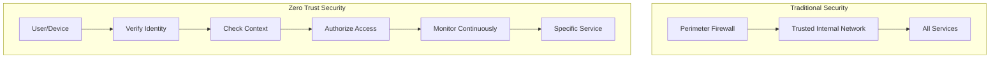
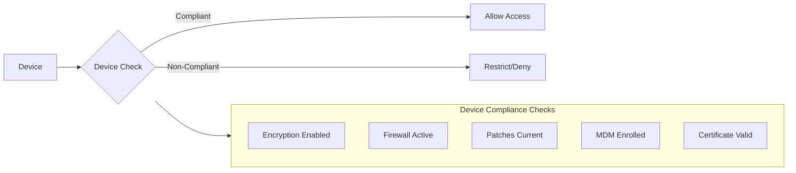
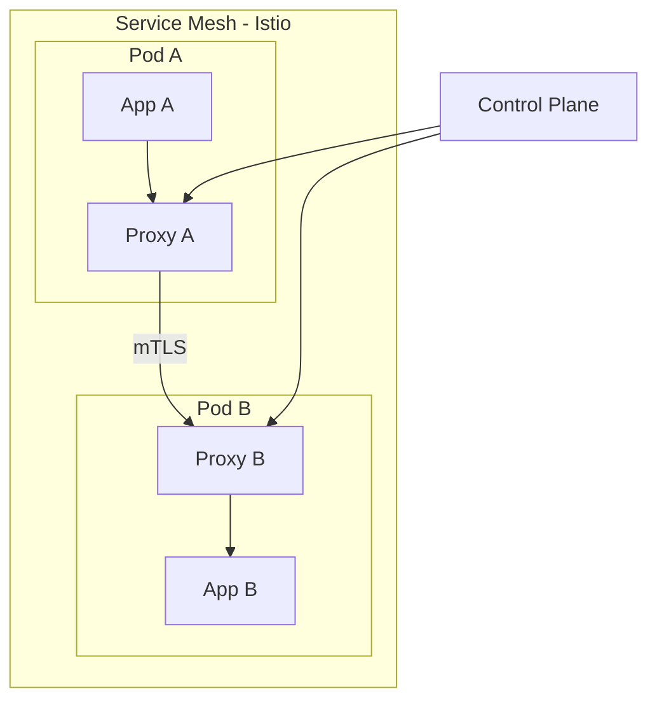

# How to Configure Zero Trust Architecture

Author: [nawazdhandala](https://www.github.com/nawazdhandala)

Tags: Security, Zero Trust, Architecture, Identity, Network Security, DevSecOps, Authentication

Description: A practical guide to implementing Zero Trust Architecture in your infrastructure, from identity verification to microsegmentation.

---

The traditional security model of "trust everything inside the network perimeter" is broken. VPNs create a false sense of security, and once attackers breach the perimeter, they move laterally with ease. Zero Trust flips this model: trust nothing, verify everything, regardless of network location.

## Zero Trust Principles



The core principles:

1. **Never trust, always verify** - Authenticate and authorize every request
2. **Assume breach** - Design as if attackers are already inside
3. **Least privilege access** - Grant minimum permissions needed
4. **Microsegmentation** - Isolate resources to limit blast radius
5. **Continuous verification** - Re-evaluate trust on every request

## Identity-Based Access Control

The foundation of Zero Trust is strong identity verification.

### Configure Identity Provider Integration

```yaml
# Example: Keycloak OIDC configuration for your application
apiVersion: v1
kind: ConfigMap
metadata:
  name: oidc-config
  namespace: auth
data:
  OIDC_ISSUER: "https://auth.example.com/realms/production"
  OIDC_CLIENT_ID: "my-application"
  OIDC_SCOPES: "openid profile email groups"
  OIDC_AUDIENCE: "my-application"
```

### Implement Token Validation Middleware

```python
# Python middleware for Zero Trust token validation
import jwt
import requests
from functools import wraps
from flask import request, jsonify, g
from datetime import datetime

class ZeroTrustAuth:
    def __init__(self, issuer, audience):
        self.issuer = issuer
        self.audience = audience
        self.jwks_client = jwt.PyJWKClient(f"{issuer}/.well-known/jwks.json")

    def validate_token(self, token):
        """Validate JWT token with full verification"""
        try:
            # Get the signing key from JWKS
            signing_key = self.jwks_client.get_signing_key_from_jwt(token)

            # Decode and validate the token
            payload = jwt.decode(
                token,
                signing_key.key,
                algorithms=["RS256"],
                audience=self.audience,
                issuer=self.issuer,
                options={
                    "verify_exp": True,
                    "verify_nbf": True,
                    "verify_iat": True,
                    "require": ["exp", "iat", "sub", "aud", "iss"]
                }
            )

            return payload

        except jwt.ExpiredSignatureError:
            raise AuthError("Token has expired")
        except jwt.InvalidAudienceError:
            raise AuthError("Invalid token audience")
        except jwt.InvalidIssuerError:
            raise AuthError("Invalid token issuer")
        except Exception as e:
            raise AuthError(f"Token validation failed: {str(e)}")

def require_zero_trust(required_scopes=None, required_groups=None):
    """Decorator for Zero Trust protected endpoints"""
    def decorator(func):
        @wraps(func)
        def wrapper(*args, **kwargs):
            # Extract token from Authorization header
            auth_header = request.headers.get('Authorization', '')
            if not auth_header.startswith('Bearer '):
                return jsonify({'error': 'Missing bearer token'}), 401

            token = auth_header.split(' ')[1]

            try:
                # Validate the token
                claims = auth.validate_token(token)

                # Check required scopes
                if required_scopes:
                    token_scopes = claims.get('scope', '').split()
                    if not all(s in token_scopes for s in required_scopes):
                        return jsonify({'error': 'Insufficient scopes'}), 403

                # Check required groups
                if required_groups:
                    user_groups = claims.get('groups', [])
                    if not any(g in user_groups for g in required_groups):
                        return jsonify({'error': 'Insufficient group membership'}), 403

                # Attach user context to request
                g.user = claims
                g.user_id = claims['sub']

                return func(*args, **kwargs)

            except AuthError as e:
                return jsonify({'error': str(e)}), 401

        return wrapper
    return decorator

# Usage
@app.route('/api/sensitive-data')
@require_zero_trust(required_scopes=['read:sensitive'], required_groups=['data-team'])
def get_sensitive_data():
    return jsonify({'data': 'sensitive information'})
```

## Device Trust Verification

Zero Trust requires verifying the device, not just the user.



### Device Certificate Authentication

```nginx
# Nginx configuration for mutual TLS (mTLS)
server {
    listen 443 ssl;
    server_name api.example.com;

    # Server certificate
    ssl_certificate /etc/nginx/certs/server.crt;
    ssl_certificate_key /etc/nginx/certs/server.key;

    # Client certificate verification (mTLS)
    ssl_client_certificate /etc/nginx/certs/ca.crt;
    ssl_verify_client on;
    ssl_verify_depth 2;

    # Pass client certificate info to backend
    location / {
        proxy_pass http://backend;
        proxy_set_header X-Client-Cert-DN $ssl_client_s_dn;
        proxy_set_header X-Client-Cert-Serial $ssl_client_serial;
        proxy_set_header X-Client-Cert-Verify $ssl_client_verify;
    }
}
```

### Device Posture Check Service

```python
# Service that validates device posture before granting access
from flask import Flask, request, jsonify
from datetime import datetime, timedelta

app = Flask(__name__)

REQUIRED_POSTURE = {
    'os_patch_age_days': 30,
    'antivirus_required': True,
    'encryption_required': True,
    'firewall_required': True
}

@app.route('/api/device/posture-check', methods=['POST'])
def check_device_posture():
    """Validate device meets security requirements"""
    device_info = request.get_json()

    issues = []

    # Check OS patch level
    last_patch = datetime.fromisoformat(device_info.get('last_os_patch', '2000-01-01'))
    patch_age = (datetime.now() - last_patch).days
    if patch_age > REQUIRED_POSTURE['os_patch_age_days']:
        issues.append(f'OS patches are {patch_age} days old (max: {REQUIRED_POSTURE["os_patch_age_days"]})')

    # Check antivirus
    if REQUIRED_POSTURE['antivirus_required'] and not device_info.get('antivirus_active'):
        issues.append('Antivirus is not active')

    # Check disk encryption
    if REQUIRED_POSTURE['encryption_required'] and not device_info.get('disk_encrypted'):
        issues.append('Disk encryption is not enabled')

    # Check firewall
    if REQUIRED_POSTURE['firewall_required'] and not device_info.get('firewall_enabled'):
        issues.append('Firewall is not enabled')

    if issues:
        return jsonify({
            'compliant': False,
            'issues': issues,
            'access_level': 'restricted'
        }), 403

    # Device is compliant - issue a short-lived device token
    device_token = generate_device_token(
        device_id=device_info['device_id'],
        expires_in=timedelta(hours=8)
    )

    return jsonify({
        'compliant': True,
        'device_token': device_token,
        'access_level': 'full'
    })
```

## Network Microsegmentation

Implement network-level Zero Trust with microsegmentation.

### Kubernetes Network Policies

```yaml
# Default deny all traffic in namespace
apiVersion: networking.k8s.io/v1
kind: NetworkPolicy
metadata:
  name: default-deny-all
  namespace: production
spec:
  podSelector: {}
  policyTypes:
    - Ingress
    - Egress
---
# Allow specific service-to-service communication
apiVersion: networking.k8s.io/v1
kind: NetworkPolicy
metadata:
  name: api-to-database
  namespace: production
spec:
  podSelector:
    matchLabels:
      app: database
  policyTypes:
    - Ingress
  ingress:
    - from:
        - podSelector:
            matchLabels:
              app: api
        - namespaceSelector:
            matchLabels:
              name: production
      ports:
        - protocol: TCP
          port: 5432
---
# Allow API to reach external identity provider only
apiVersion: networking.k8s.io/v1
kind: NetworkPolicy
metadata:
  name: api-egress
  namespace: production
spec:
  podSelector:
    matchLabels:
      app: api
  policyTypes:
    - Egress
  egress:
    # Allow DNS
    - to:
        - namespaceSelector:
            matchLabels:
              name: kube-system
      ports:
        - protocol: UDP
          port: 53
    # Allow identity provider
    - to:
        - ipBlock:
            cidr: 10.0.0.0/8  # Internal identity provider
      ports:
        - protocol: TCP
          port: 443
```

## Service Mesh for Zero Trust



### Istio Authorization Policy

```yaml
# Istio authorization policy for Zero Trust
apiVersion: security.istio.io/v1beta1
kind: AuthorizationPolicy
metadata:
  name: api-authz
  namespace: production
spec:
  selector:
    matchLabels:
      app: api
  action: ALLOW
  rules:
    # Allow frontend to call specific API paths
    - from:
        - source:
            principals: ["cluster.local/ns/production/sa/frontend"]
      to:
        - operation:
            methods: ["GET", "POST"]
            paths: ["/api/v1/public/*"]

    # Allow admin service with specific JWT claims
    - from:
        - source:
            principals: ["cluster.local/ns/production/sa/admin"]
      to:
        - operation:
            paths: ["/api/v1/admin/*"]
      when:
        - key: request.auth.claims[groups]
          values: ["admin-group"]
---
# Enforce mTLS between all services
apiVersion: security.istio.io/v1beta1
kind: PeerAuthentication
metadata:
  name: default
  namespace: production
spec:
  mtls:
    mode: STRICT
```

## Continuous Monitoring and Verification

Zero Trust requires continuous monitoring, not just authentication at the door.

```python
# Continuous session validation
import redis
from datetime import datetime, timedelta

class ContinuousVerification:
    def __init__(self, redis_client):
        self.redis = redis_client
        self.session_ttl = timedelta(minutes=15)
        self.max_requests_per_minute = 100

    def verify_session(self, session_id, user_id, context):
        """Continuously verify session validity"""
        session_key = f"session:{session_id}"

        # Check if session exists and is valid
        session_data = self.redis.hgetall(session_key)
        if not session_data:
            raise SessionError("Session not found or expired")

        # Verify user context hasn't changed suspiciously
        if session_data.get('ip') != context['ip']:
            # IP changed - require re-authentication
            self.redis.delete(session_key)
            raise SessionError("Session context changed - re-authenticate")

        # Check rate limiting
        rate_key = f"rate:{user_id}:{datetime.now().strftime('%Y%m%d%H%M')}"
        current_rate = self.redis.incr(rate_key)
        self.redis.expire(rate_key, 60)

        if current_rate > self.max_requests_per_minute:
            raise RateLimitError("Rate limit exceeded")

        # Check for anomalous behavior
        if self.detect_anomaly(user_id, context):
            self.flag_for_review(user_id, session_id)
            raise SessionError("Anomalous behavior detected")

        # Refresh session TTL
        self.redis.expire(session_key, int(self.session_ttl.total_seconds()))

        return True

    def detect_anomaly(self, user_id, context):
        """Detect anomalous access patterns"""
        history_key = f"access_history:{user_id}"

        # Get recent access patterns
        recent_accesses = self.redis.lrange(history_key, 0, 100)

        # Check for impossible travel (accessing from distant locations quickly)
        # Check for unusual access times
        # Check for unusual resource access patterns

        # Store current access
        self.redis.lpush(history_key, f"{context['ip']}:{context['timestamp']}")
        self.redis.ltrim(history_key, 0, 999)

        return False  # Implement actual anomaly detection logic
```

## Implementation Checklist

Follow this checklist when implementing Zero Trust:

- [ ] Implement strong identity verification (OIDC/SAML)
- [ ] Enable multi-factor authentication for all users
- [ ] Deploy device trust verification
- [ ] Implement mutual TLS between services
- [ ] Create network microsegmentation policies
- [ ] Deploy a service mesh with authorization policies
- [ ] Implement continuous session verification
- [ ] Enable comprehensive logging and monitoring
- [ ] Set up anomaly detection for user behavior
- [ ] Create incident response procedures for trust violations
- [ ] Regularly audit and rotate credentials
- [ ] Document all trust relationships

## Common Pitfalls to Avoid

1. **All or nothing thinking** - Zero Trust is a journey, not a destination. Start with critical systems.
2. **Ignoring user experience** - Balance security with usability. Too many prompts lead to workarounds.
3. **Forgetting about service accounts** - Machine identities need Zero Trust too.
4. **Static policies** - Trust should be dynamic based on context and risk.
5. **Insufficient logging** - You cannot verify what you cannot see.

---

Zero Trust is not a product you buy but an architecture you build. Start by identifying your most critical assets, implement strong identity verification, add network microsegmentation, and establish continuous monitoring. Each layer you add reduces the blast radius when (not if) a breach occurs.
