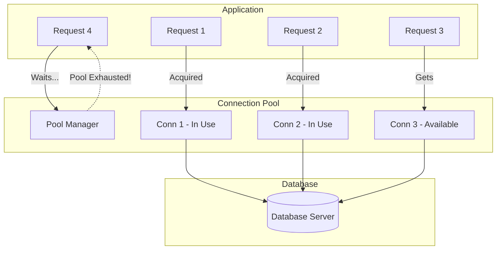
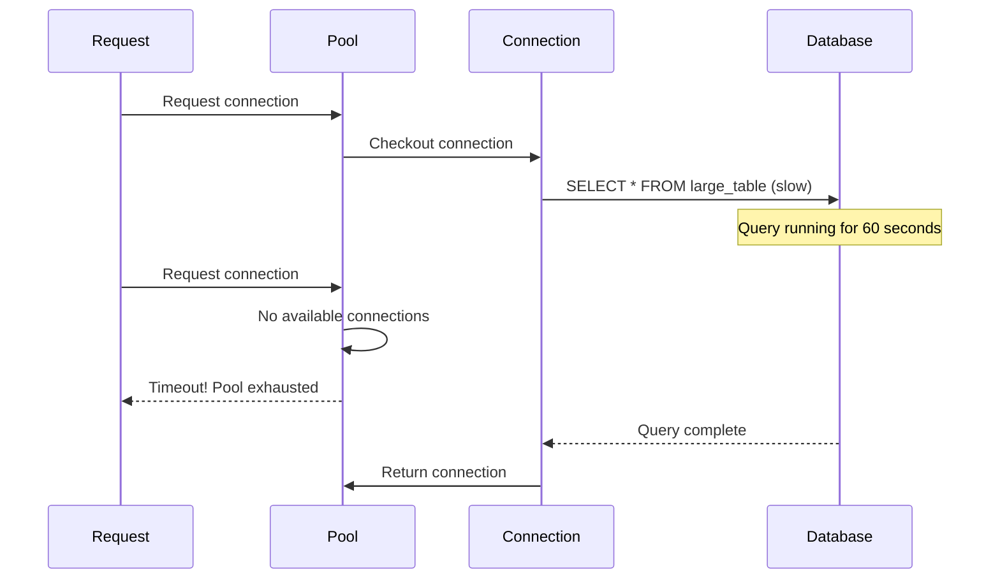
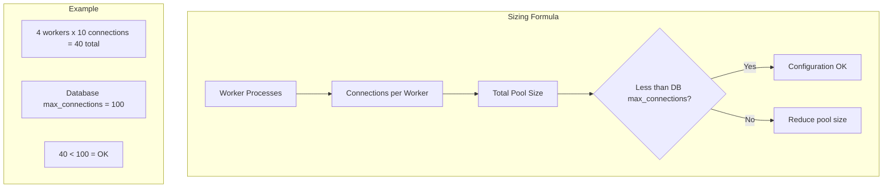

# How to Fix "Connection Pool Exhausted" Errors

Author: [nawazdhandala](https://www.github.com/nawazdhandala)

Tags: Connection Pooling, Database, Performance, Troubleshooting, PostgreSQL, MySQL, Redis, Microservices

Description: Learn how to diagnose and fix connection pool exhaustion errors in databases and services, including proper pool configuration, connection leak detection, and monitoring strategies.

---

> "Connection pool exhausted" is one of the most frustrating errors in production systems. Your database is healthy, your queries are fast, but your application cannot get a connection to execute them.

Connection pool exhaustion typically indicates either misconfiguration, connection leaks, or traffic patterns that exceed your pool capacity. This guide helps you identify and fix the root cause.

---

## Understanding Connection Pools



---

## Common Causes of Pool Exhaustion

### 1. Connection Leaks

Connections acquired but never released.

```go
// Go - Detecting and preventing connection leaks

package database

import (
    "context"
    "database/sql"
    "fmt"
    "runtime"
    "sync"
    "time"

    _ "github.com/lib/pq"
)

// LeakDetector wraps a database to detect connection leaks
type LeakDetector struct {
    db            *sql.DB
    activeConns   map[*sql.Conn]connInfo
    mu            sync.Mutex
    leakThreshold time.Duration
}

type connInfo struct {
    acquiredAt time.Time
    stack      string
}

// NewLeakDetector creates a new leak detector
func NewLeakDetector(db *sql.DB, leakThreshold time.Duration) *LeakDetector {
    ld := &LeakDetector{
        db:            db,
        activeConns:   make(map[*sql.Conn]connInfo),
        leakThreshold: leakThreshold,
    }

    // Start leak detection goroutine
    go ld.detectLeaks()

    return ld
}

// Conn acquires a connection with tracking
func (ld *LeakDetector) Conn(ctx context.Context) (*sql.Conn, error) {
    conn, err := ld.db.Conn(ctx)
    if err != nil {
        return nil, err
    }

    ld.mu.Lock()
    ld.activeConns[conn] = connInfo{
        acquiredAt: time.Now(),
        stack:      getStackTrace(),
    }
    ld.mu.Unlock()

    return conn, nil
}

// Release marks a connection as released
func (ld *LeakDetector) Release(conn *sql.Conn) {
    ld.mu.Lock()
    delete(ld.activeConns, conn)
    ld.mu.Unlock()

    conn.Close()
}

func (ld *LeakDetector) detectLeaks() {
    ticker := time.NewTicker(30 * time.Second)
    defer ticker.Stop()

    for range ticker.C {
        ld.mu.Lock()
        now := time.Now()

        for conn, info := range ld.activeConns {
            if now.Sub(info.acquiredAt) > ld.leakThreshold {
                fmt.Printf("POTENTIAL LEAK: Connection held for %v\n", now.Sub(info.acquiredAt))
                fmt.Printf("Acquired at: %s\n", info.stack)
                // Optionally force close leaked connections
                // conn.Close()
                // delete(ld.activeConns, conn)
                _ = conn // silence unused warning
            }
        }

        ld.mu.Unlock()
    }
}

func getStackTrace() string {
    buf := make([]byte, 4096)
    n := runtime.Stack(buf, false)
    return string(buf[:n])
}

// BAD: Connection leak example
func badQueryExample(db *sql.DB) error {
    conn, err := db.Conn(context.Background())
    if err != nil {
        return err
    }
    // Missing: defer conn.Close()

    rows, err := conn.QueryContext(context.Background(), "SELECT * FROM users")
    if err != nil {
        return err // Connection leaked!
    }

    // Process rows...
    _ = rows

    // Connection never returned to pool!
    return nil
}

// GOOD: Proper connection handling
func goodQueryExample(db *sql.DB) error {
    conn, err := db.Conn(context.Background())
    if err != nil {
        return err
    }
    defer conn.Close() // Always release connection

    rows, err := conn.QueryContext(context.Background(), "SELECT * FROM users")
    if err != nil {
        return err // Connection will be released by defer
    }
    defer rows.Close() // Also close rows

    for rows.Next() {
        // Process row
    }

    return rows.Err()
}
```

---

### 2. Pool Size Misconfiguration

Pool too small for the workload.

```python
# Python - Proper connection pool configuration
import os
from contextlib import contextmanager
from dataclasses import dataclass
from typing import Optional
import time

from sqlalchemy import create_engine, event, text
from sqlalchemy.orm import sessionmaker
from sqlalchemy.pool import QueuePool

@dataclass
class PoolConfig:
    # Core pool settings
    pool_size: int = 10          # Number of persistent connections
    max_overflow: int = 20       # Additional connections when pool is full
    pool_timeout: int = 30       # Seconds to wait for available connection
    pool_recycle: int = 3600     # Recycle connections after 1 hour
    pool_pre_ping: bool = True   # Verify connection before use

    @classmethod
    def from_env(cls) -> 'PoolConfig':
        """Load configuration from environment variables"""
        return cls(
            pool_size=int(os.getenv('DB_POOL_SIZE', '10')),
            max_overflow=int(os.getenv('DB_MAX_OVERFLOW', '20')),
            pool_timeout=int(os.getenv('DB_POOL_TIMEOUT', '30')),
            pool_recycle=int(os.getenv('DB_POOL_RECYCLE', '3600')),
            pool_pre_ping=os.getenv('DB_POOL_PRE_PING', 'true').lower() == 'true',
        )

    def calculate_for_workers(self, num_workers: int) -> 'PoolConfig':
        """
        Calculate pool size based on number of worker processes.
        Rule of thumb: Each worker should have its own pool.
        Total connections = pool_size * num_workers
        """
        # Ensure we don't exceed database max_connections
        max_total = int(os.getenv('DB_MAX_CONNECTIONS', '100'))
        connections_per_worker = max_total // num_workers

        # Leave some headroom for admin connections
        connections_per_worker = int(connections_per_worker * 0.8)

        return PoolConfig(
            pool_size=min(self.pool_size, connections_per_worker // 2),
            max_overflow=min(self.max_overflow, connections_per_worker // 2),
            pool_timeout=self.pool_timeout,
            pool_recycle=self.pool_recycle,
            pool_pre_ping=self.pool_pre_ping,
        )

class DatabaseConnection:
    def __init__(self, database_url: str, config: Optional[PoolConfig] = None):
        self.config = config or PoolConfig.from_env()
        self.database_url = database_url

        self.engine = create_engine(
            database_url,
            poolclass=QueuePool,
            pool_size=self.config.pool_size,
            max_overflow=self.config.max_overflow,
            pool_timeout=self.config.pool_timeout,
            pool_recycle=self.config.pool_recycle,
            pool_pre_ping=self.config.pool_pre_ping,
        )

        # Set up event listeners for monitoring
        self._setup_pool_events()

        self.Session = sessionmaker(bind=self.engine)

    def _setup_pool_events(self):
        """Set up connection pool monitoring events"""

        @event.listens_for(self.engine, "checkout")
        def on_checkout(dbapi_conn, connection_record, connection_proxy):
            connection_record.info['checkout_time'] = time.time()

        @event.listens_for(self.engine, "checkin")
        def on_checkin(dbapi_conn, connection_record):
            checkout_time = connection_record.info.get('checkout_time')
            if checkout_time:
                duration = time.time() - checkout_time
                if duration > 30:  # Connection held for more than 30 seconds
                    print(f"WARNING: Connection held for {duration:.2f} seconds")

        @event.listens_for(self.engine, "connect")
        def on_connect(dbapi_conn, connection_record):
            print("New database connection established")

        @event.listens_for(self.engine, "invalidate")
        def on_invalidate(dbapi_conn, connection_record, exception):
            print(f"Connection invalidated: {exception}")

    @contextmanager
    def session(self):
        """Context manager for database sessions"""
        session = self.Session()
        try:
            yield session
            session.commit()
        except Exception:
            session.rollback()
            raise
        finally:
            session.close()

    def get_pool_status(self) -> dict:
        """Get current connection pool status"""
        pool = self.engine.pool
        return {
            "pool_size": pool.size(),
            "checked_out": pool.checkedout(),
            "overflow": pool.overflow(),
            "checked_in": pool.checkedin(),
        }

    def health_check(self) -> bool:
        """Check database connectivity"""
        try:
            with self.engine.connect() as conn:
                conn.execute(text("SELECT 1"))
            return True
        except Exception as e:
            print(f"Health check failed: {e}")
            return False

# Usage example
if __name__ == "__main__":
    # Configure for 4 worker processes
    config = PoolConfig.from_env().calculate_for_workers(4)
    print(f"Pool config: size={config.pool_size}, overflow={config.max_overflow}")

    db = DatabaseConnection(
        "postgresql://localhost/mydb",
        config=config
    )

    # Use connection
    with db.session() as session:
        result = session.execute(text("SELECT COUNT(*) FROM users"))
        print(f"User count: {result.scalar()}")

    # Check pool status
    print(f"Pool status: {db.get_pool_status()}")
```

---

### 3. Slow Queries Holding Connections

Long-running queries block the pool.



```java
// Java - Connection pool with query timeout
import com.zaxxer.hikari.HikariConfig;
import com.zaxxer.hikari.HikariDataSource;
import io.micrometer.core.instrument.MeterRegistry;

import javax.sql.DataSource;
import java.sql.Connection;
import java.sql.PreparedStatement;
import java.sql.ResultSet;
import java.sql.SQLException;
import java.time.Duration;

public class DatabasePool {
    private final HikariDataSource dataSource;

    public DatabasePool(String jdbcUrl, String username, String password,
                       MeterRegistry meterRegistry) {
        HikariConfig config = new HikariConfig();

        // Connection settings
        config.setJdbcUrl(jdbcUrl);
        config.setUsername(username);
        config.setPassword(password);

        // Pool sizing
        config.setMinimumIdle(5);
        config.setMaximumPoolSize(20);

        // Timeouts
        config.setConnectionTimeout(30000);      // 30 seconds to get connection
        config.setIdleTimeout(600000);           // 10 minutes idle before removal
        config.setMaxLifetime(1800000);          // 30 minutes max connection lifetime

        // Leak detection
        config.setLeakDetectionThreshold(60000); // Warn if connection held > 60 seconds

        // Validation
        config.setConnectionTestQuery("SELECT 1");
        config.setValidationTimeout(5000);       // 5 seconds validation timeout

        // Statement timeout (prevents long-running queries from holding connections)
        config.addDataSourceProperty("socketTimeout", "300"); // 5 minutes max query time

        // Metrics
        config.setMetricRegistry(meterRegistry);

        // Pool name for monitoring
        config.setPoolName("MainPool");

        this.dataSource = new HikariDataSource(config);
    }

    public DataSource getDataSource() {
        return dataSource;
    }

    /**
     * Execute a query with explicit timeout
     */
    public <T> T executeWithTimeout(String sql, Duration timeout,
                                    ResultSetHandler<T> handler) throws SQLException {
        try (Connection conn = dataSource.getConnection()) {
            // Set statement timeout
            try (PreparedStatement stmt = conn.prepareStatement(sql)) {
                stmt.setQueryTimeout((int) timeout.getSeconds());

                try (ResultSet rs = stmt.executeQuery()) {
                    return handler.handle(rs);
                }
            }
        }
    }

    /**
     * Get pool statistics
     */
    public PoolStats getStats() {
        return new PoolStats(
            dataSource.getHikariPoolMXBean().getActiveConnections(),
            dataSource.getHikariPoolMXBean().getIdleConnections(),
            dataSource.getHikariPoolMXBean().getTotalConnections(),
            dataSource.getHikariPoolMXBean().getThreadsAwaitingConnection()
        );
    }

    public void close() {
        dataSource.close();
    }

    @FunctionalInterface
    public interface ResultSetHandler<T> {
        T handle(ResultSet rs) throws SQLException;
    }

    public record PoolStats(
        int activeConnections,
        int idleConnections,
        int totalConnections,
        int threadsAwaiting
    ) {}
}

// Usage with circuit breaker for pool exhaustion
import io.github.resilience4j.circuitbreaker.CircuitBreaker;
import io.github.resilience4j.circuitbreaker.CircuitBreakerConfig;

public class ResilientDatabasePool {
    private final DatabasePool pool;
    private final CircuitBreaker circuitBreaker;

    public ResilientDatabasePool(DatabasePool pool) {
        this.pool = pool;

        CircuitBreakerConfig config = CircuitBreakerConfig.custom()
            .failureRateThreshold(50)
            .slowCallRateThreshold(50)
            .slowCallDurationThreshold(Duration.ofSeconds(5))
            .waitDurationInOpenState(Duration.ofSeconds(30))
            .permittedNumberOfCallsInHalfOpenState(3)
            .slidingWindowSize(10)
            .build();

        this.circuitBreaker = CircuitBreaker.of("database", config);
    }

    public <T> T execute(String sql, DatabasePool.ResultSetHandler<T> handler)
            throws SQLException {
        return CircuitBreaker.decorateCheckedSupplier(circuitBreaker, () ->
            pool.executeWithTimeout(sql, Duration.ofSeconds(30), handler)
        ).get();
    }
}
```

---

## Monitoring Connection Pools

```go
// Go - Prometheus metrics for connection pool monitoring
package metrics

import (
    "database/sql"
    "time"

    "github.com/prometheus/client_golang/prometheus"
    "github.com/prometheus/client_golang/prometheus/promauto"
)

var (
    // Pool size metrics
    poolOpenConnections = promauto.NewGaugeVec(
        prometheus.GaugeOpts{
            Name: "db_pool_open_connections",
            Help: "Number of open connections in the pool",
        },
        []string{"pool_name"},
    )

    poolInUseConnections = promauto.NewGaugeVec(
        prometheus.GaugeOpts{
            Name: "db_pool_in_use_connections",
            Help: "Number of connections currently in use",
        },
        []string{"pool_name"},
    )

    poolIdleConnections = promauto.NewGaugeVec(
        prometheus.GaugeOpts{
            Name: "db_pool_idle_connections",
            Help: "Number of idle connections in the pool",
        },
        []string{"pool_name"},
    )

    // Wait metrics
    poolWaitCount = promauto.NewCounterVec(
        prometheus.CounterOpts{
            Name: "db_pool_wait_total",
            Help: "Total number of times a connection was waited for",
        },
        []string{"pool_name"},
    )

    poolWaitDuration = promauto.NewHistogramVec(
        prometheus.HistogramOpts{
            Name:    "db_pool_wait_duration_seconds",
            Help:    "Time spent waiting for a connection",
            Buckets: prometheus.ExponentialBuckets(0.001, 2, 15),
        },
        []string{"pool_name"},
    )

    // Connection duration
    connectionHoldDuration = promauto.NewHistogramVec(
        prometheus.HistogramOpts{
            Name:    "db_connection_hold_duration_seconds",
            Help:    "Time a connection was held before being returned",
            Buckets: prometheus.ExponentialBuckets(0.001, 2, 15),
        },
        []string{"pool_name"},
    )

    // Errors
    poolExhaustedTotal = promauto.NewCounterVec(
        prometheus.CounterOpts{
            Name: "db_pool_exhausted_total",
            Help: "Number of times pool was exhausted",
        },
        []string{"pool_name"},
    )
)

// PoolMonitor collects pool metrics
type PoolMonitor struct {
    db       *sql.DB
    poolName string
    stopChan chan struct{}
}

// NewPoolMonitor creates a new pool monitor
func NewPoolMonitor(db *sql.DB, poolName string) *PoolMonitor {
    return &PoolMonitor{
        db:       db,
        poolName: poolName,
        stopChan: make(chan struct{}),
    }
}

// Start begins collecting metrics
func (m *PoolMonitor) Start() {
    go func() {
        ticker := time.NewTicker(5 * time.Second)
        defer ticker.Stop()

        for {
            select {
            case <-ticker.C:
                m.collectMetrics()
            case <-m.stopChan:
                return
            }
        }
    }()
}

// Stop stops collecting metrics
func (m *PoolMonitor) Stop() {
    close(m.stopChan)
}

func (m *PoolMonitor) collectMetrics() {
    stats := m.db.Stats()

    poolOpenConnections.WithLabelValues(m.poolName).Set(float64(stats.OpenConnections))
    poolInUseConnections.WithLabelValues(m.poolName).Set(float64(stats.InUse))
    poolIdleConnections.WithLabelValues(m.poolName).Set(float64(stats.Idle))

    // Check for pool exhaustion
    maxOpen := m.db.Stats().MaxOpenConnections
    if maxOpen > 0 && stats.InUse >= maxOpen {
        poolExhaustedTotal.WithLabelValues(m.poolName).Inc()
    }
}

// RecordConnectionWait records time spent waiting for a connection
func RecordConnectionWait(poolName string, duration time.Duration) {
    poolWaitCount.WithLabelValues(poolName).Inc()
    poolWaitDuration.WithLabelValues(poolName).Observe(duration.Seconds())
}

// RecordConnectionHold records time a connection was held
func RecordConnectionHold(poolName string, duration time.Duration) {
    connectionHoldDuration.WithLabelValues(poolName).Observe(duration.Seconds())
}
```

---

## Redis Connection Pool Management

```typescript
// TypeScript - Redis connection pool with proper management
import Redis, { RedisOptions } from 'ioredis';

interface PoolConfig {
    maxConnections: number;
    minIdleConnections: number;
    connectionTimeout: number;
    idleTimeout: number;
    retryStrategy?: (times: number) => number | null;
}

class RedisPool {
    private readonly pool: Redis[];
    private readonly available: Redis[];
    private readonly config: PoolConfig;
    private readonly redisOptions: RedisOptions;
    private waitQueue: Array<{
        resolve: (conn: Redis) => void;
        reject: (err: Error) => void;
        timeout: NodeJS.Timeout;
    }> = [];

    constructor(redisOptions: RedisOptions, config: Partial<PoolConfig> = {}) {
        this.redisOptions = redisOptions;
        this.config = {
            maxConnections: 10,
            minIdleConnections: 2,
            connectionTimeout: 5000,
            idleTimeout: 30000,
            ...config,
        };
        this.pool = [];
        this.available = [];
    }

    async initialize(): Promise<void> {
        // Create minimum idle connections
        const promises = [];
        for (let i = 0; i < this.config.minIdleConnections; i++) {
            promises.push(this.createConnection());
        }
        await Promise.all(promises);
    }

    private async createConnection(): Promise<Redis> {
        const client = new Redis({
            ...this.redisOptions,
            lazyConnect: true,
            retryStrategy: this.config.retryStrategy || ((times) => {
                if (times > 3) return null;
                return Math.min(times * 100, 2000);
            }),
        });

        // Set up event handlers
        client.on('error', (err) => {
            console.error('Redis connection error:', err);
        });

        client.on('close', () => {
            // Remove from pools
            const poolIndex = this.pool.indexOf(client);
            if (poolIndex > -1) this.pool.splice(poolIndex, 1);

            const availIndex = this.available.indexOf(client);
            if (availIndex > -1) this.available.splice(availIndex, 1);
        });

        await client.connect();
        this.pool.push(client);
        this.available.push(client);

        return client;
    }

    async acquire(): Promise<Redis> {
        // Try to get an available connection
        if (this.available.length > 0) {
            const conn = this.available.pop()!;

            // Verify connection is still alive
            try {
                await conn.ping();
                return conn;
            } catch {
                // Connection is dead, remove it and try again
                const poolIndex = this.pool.indexOf(conn);
                if (poolIndex > -1) this.pool.splice(poolIndex, 1);
                return this.acquire();
            }
        }

        // Can we create a new connection?
        if (this.pool.length < this.config.maxConnections) {
            const conn = await this.createConnection();
            // Remove from available since we're returning it
            const availIndex = this.available.indexOf(conn);
            if (availIndex > -1) this.available.splice(availIndex, 1);
            return conn;
        }

        // Pool exhausted, wait for a connection
        return new Promise((resolve, reject) => {
            const timeout = setTimeout(() => {
                const index = this.waitQueue.findIndex(w => w.resolve === resolve);
                if (index > -1) {
                    this.waitQueue.splice(index, 1);
                    reject(new Error('Connection pool exhausted: timeout waiting for connection'));
                }
            }, this.config.connectionTimeout);

            this.waitQueue.push({ resolve, reject, timeout });
        });
    }

    release(conn: Redis): void {
        // Check if anyone is waiting
        if (this.waitQueue.length > 0) {
            const waiter = this.waitQueue.shift()!;
            clearTimeout(waiter.timeout);
            waiter.resolve(conn);
            return;
        }

        // Return to available pool
        if (!this.available.includes(conn) && this.pool.includes(conn)) {
            this.available.push(conn);
        }
    }

    async execute<T>(fn: (client: Redis) => Promise<T>): Promise<T> {
        const conn = await this.acquire();
        try {
            return await fn(conn);
        } finally {
            this.release(conn);
        }
    }

    getStats(): {
        total: number;
        available: number;
        inUse: number;
        waiting: number;
    } {
        return {
            total: this.pool.length,
            available: this.available.length,
            inUse: this.pool.length - this.available.length,
            waiting: this.waitQueue.length,
        };
    }

    async close(): Promise<void> {
        // Reject all waiters
        for (const waiter of this.waitQueue) {
            clearTimeout(waiter.timeout);
            waiter.reject(new Error('Pool is closing'));
        }
        this.waitQueue = [];

        // Close all connections
        await Promise.all(this.pool.map(conn => conn.quit()));
        this.pool.length = 0;
        this.available.length = 0;
    }
}

// Usage with automatic resource management
async function example() {
    const pool = new RedisPool(
        { host: 'localhost', port: 6379 },
        { maxConnections: 20, minIdleConnections: 5 }
    );

    await pool.initialize();

    // Execute with automatic release
    const result = await pool.execute(async (client) => {
        await client.set('key', 'value');
        return client.get('key');
    });

    console.log('Result:', result);
    console.log('Pool stats:', pool.getStats());

    await pool.close();
}
```

---

## Debugging Pool Exhaustion

```bash
# PostgreSQL - Check current connections
SELECT
    datname as database,
    usename as user,
    application_name,
    client_addr,
    state,
    query_start,
    NOW() - query_start as query_duration,
    LEFT(query, 50) as query_preview
FROM pg_stat_activity
WHERE datname = 'mydb'
ORDER BY query_start;

# Check connection limits
SHOW max_connections;

# See connections per application
SELECT application_name, COUNT(*)
FROM pg_stat_activity
WHERE datname = 'mydb'
GROUP BY application_name;

# Find long-running queries
SELECT
    pid,
    NOW() - query_start as duration,
    query
FROM pg_stat_activity
WHERE state = 'active'
  AND NOW() - query_start > interval '30 seconds'
ORDER BY duration DESC;

# MySQL - Check connections
SHOW PROCESSLIST;
SHOW STATUS LIKE 'Threads_connected';
SHOW VARIABLES LIKE 'max_connections';

# Check for connection issues
SHOW STATUS LIKE 'Aborted_clients';
SHOW STATUS LIKE 'Aborted_connects';
```

---

## Configuration Guidelines



### Pool Sizing Rules

1. **Total connections** = (pool_size + max_overflow) * num_workers
2. **Leave headroom** - Keep 20% of max_connections for admin tasks
3. **Start small** - Begin with smaller pools and increase based on metrics
4. **Monitor wait times** - High wait times indicate pool is too small

---

## Best Practices

1. **Always use connection pooling** - Never create connections per request
2. **Set appropriate timeouts** - Prevent indefinite waits
3. **Enable leak detection** - Catch connection leaks early
4. **Monitor pool metrics** - Alert on exhaustion and high wait times
5. **Use context managers** - Ensure connections are always released
6. **Set query timeouts** - Prevent slow queries from blocking the pool
7. **Right-size your pools** - Based on actual load, not theoretical max

---

*Need to monitor your database connection pools? [OneUptime](https://oneuptime.com) provides real-time database monitoring with connection pool metrics and alerting.*

**Related Reading:**
- [How to Fix "Health Check Failed" Service Errors](https://oneuptime.com/blog/post/2026-01-24-health-check-failed-service-errors/view)
- [How to Handle Idempotency in Microservices](https://oneuptime.com/blog/post/2026-01-24-idempotency-in-microservices/view)
